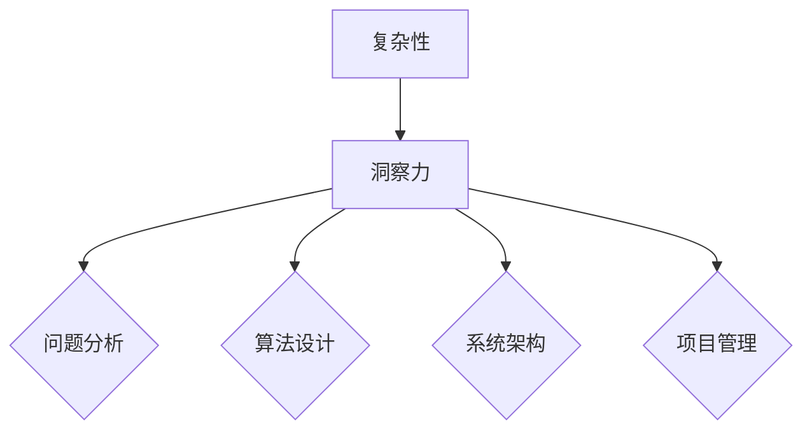

                 

 在这个信息爆炸、技术飞速发展的时代，复杂性问题日益增多。如何在这些复杂中寻找秩序，是我们面对的巨大挑战。本文旨在探讨洞察力的本质，以及如何在IT领域中应用这种洞察力来解决问题。

## 关键词

- 洞察力
- 复杂性
- IT领域
- 算法
- 数学模型
- 项目实践

## 摘要

本文首先介绍了复杂性的概念及其在IT领域中的表现，接着探讨了洞察力的本质及其与解决问题的关系。通过具体的算法原理、数学模型和项目实践，本文展示了如何在复杂中寻找秩序。最后，对未来的应用展望和面临的挑战进行了探讨。

## 1. 背景介绍

随着互联网、大数据、人工智能等技术的发展，IT领域正面临着前所未有的复杂性。系统架构变得越来越复杂，数据规模爆炸性增长，业务需求不断变化。这种复杂性不仅体现在技术层面，还涉及到组织管理、团队合作等多个方面。

面对这些复杂性，传统的线性思维和简单的方法已经不再有效。我们需要一种能够深入理解复杂问题本质的能力，这就是洞察力。洞察力是一种超越表面现象，深入理解问题本质的能力。它使我们能够从纷繁复杂的信息中找到规律，从而找到解决问题的方法。

## 2. 核心概念与联系

### 2.1 复杂性

复杂性是指系统内部各个组成部分之间相互作用和关联的复杂程度。复杂性可以分为结构复杂性和动态复杂性。结构复杂性指的是系统内部结构的复杂程度，如网络的拓扑结构、系统的模块划分等。动态复杂性指的是系统随时间变化的复杂程度，如系统的动态行为、系统的演化过程等。

### 2.2 洞察力

洞察力是一种认知能力，它使我们能够看到事物的本质，理解其内在的规律。在IT领域，洞察力体现在以下几个方面：

1. **问题分析**：通过洞察力，我们能够深入理解问题的本质，找到问题的关键点。
2. **算法设计**：洞察力帮助我们设计出更加高效、可靠的算法。
3. **系统架构**：洞察力使我们能够设计出更加合理、稳定的系统架构。
4. **项目管理**：洞察力帮助我们更好地预测项目风险，管理项目进度。

### 2.3 洞察力与复杂性的关系

复杂性是洞察力存在的背景，而洞察力则是解决复杂性的关键。在面对复杂性时，洞察力使我们能够从纷繁复杂的信息中找到秩序，从而找到解决问题的方法。

### 2.4 Mermaid 流程图



## 3. 核心算法原理 & 具体操作步骤

### 3.1 算法原理概述

在解决复杂问题时，算法是我们必不可少的工具。算法是一种解决问题的步骤序列。一个好的算法不仅能够解决特定的问题，还能够适应不同的场景。

在本节中，我们将介绍一种常用的算法——深度优先搜索（DFS）。DFS是一种用于遍历或搜索树或图的算法。它的核心思想是沿着一个分支一直走到底，然后再回溯到上一个节点，继续探索其他分支。

### 3.2 算法步骤详解

1. **初始化**：设置一个栈，用于存储待访问的节点。
2. **选择起始节点**：从给定的节点开始。
3. **访问节点**：将当前节点标记为已访问，并将其添加到栈中。
4. **探索邻居节点**：从栈中弹出当前节点，然后遍历其未访问的邻居节点。
5. **递归**：对于每个未访问的邻居节点，重复步骤3和步骤4。
6. **结束条件**：当栈为空时，算法结束。

### 3.3 算法优缺点

**优点**：

1. **简单易懂**：DFS算法相对简单，易于实现和理解。
2. **适用范围广**：DFS适用于各种树和图的问题。

**缺点**：

1. **可能陷入死循环**：在处理有环的图时，DFS可能会陷入死循环。
2. **性能问题**：对于大规模的图，DFS的性能可能不佳。

### 3.4 算法应用领域

DFS算法广泛应用于各个领域，如：

1. **图遍历**：用于遍历图中的所有节点。
2. **最短路径**：可以用于求解图中的最短路径问题。
3. **连通性**：可以用于判断图中的两个节点是否连通。

## 4. 数学模型和公式 & 详细讲解 & 举例说明

### 4.1 数学模型构建

在解决复杂问题时，数学模型是非常重要的一环。数学模型是一种用数学语言描述现实问题的方法。在本节中，我们将介绍一种常用的数学模型——线性规划。

线性规划是一种在给定约束条件下，求解线性目标函数的最大值或最小值的方法。线性规划的一般形式为：

$$
\begin{aligned}
    \min\limits_{x} & \quad c^T x \\
    \text{s.t.} & \quad Ax \leq b \\
    & \quad x \geq 0
\end{aligned}
$$

其中，$x$ 是决策变量，$c$ 是目标函数的系数，$A$ 和 $b$ 分别是约束条件的系数矩阵和常数向量。

### 4.2 公式推导过程

线性规划的推导过程涉及多个步骤。首先，我们需要将目标函数转化为标准形式：

$$
\min\limits_{x} \quad c^T x
$$

然后，我们需要添加松弛变量，将不等式约束转化为等式约束：

$$
\begin{aligned}
    \min\limits_{x, s} & \quad c^T x + 0^T s \\
    \text{s.t.} & \quad Ax + s = b \\
    & \quad x, s \geq 0
\end{aligned}
$$

接下来，我们使用单纯形法求解这个标准形式的线性规划问题。

### 4.3 案例分析与讲解

假设我们有一个线性规划问题，目标是最小化成本，同时满足资源限制。具体来说，我们需要安排一辆卡车从A地运输货物到B地，成本为每单位货物100元。约束条件是卡车的最大载重为500公斤，每单位货物重量为10公斤。

$$
\begin{aligned}
    \min\limits_{x} & \quad 100x \\
    \text{s.t.} & \quad 10x \leq 500 \\
    & \quad x \geq 0
\end{aligned}
$$

我们可以使用单纯形法求解这个问题。首先，我们需要将目标函数转化为标准形式：

$$
\min\limits_{x, s} \quad 100x + 0^T s
$$

然后，添加松弛变量，将不等式约束转化为等式约束：

$$
\begin{aligned}
    \min\limits_{x, s} & \quad 100x + 0^T s \\
    \text{s.t.} & \quad 10x + s = 500 \\
    & \quad x, s \geq 0
\end{aligned}
$$

接下来，我们可以使用单纯形法求解这个标准形式的线性规划问题。求解结果为$x=50$，即需要运输50单位货物。

## 5. 项目实践：代码实例和详细解释说明

### 5.1 开发环境搭建

为了演示深度优先搜索算法的应用，我们将使用Python编程语言。以下是搭建Python开发环境的步骤：

1. 安装Python：从官方网站（https://www.python.org/）下载Python安装包，并按照提示安装。
2. 安装Python解释器：打开命令行窗口，输入`python --version`，检查Python解释器是否安装成功。
3. 安装依赖库：使用pip命令安装深度优先搜索算法所需的库，如numpy、matplotlib等。

### 5.2 源代码详细实现

以下是使用Python实现的深度优先搜索算法：

```python
import numpy as np
import matplotlib.pyplot as plt

def dfs(graph, start, target):
    visited = set()
    path = [start]
    stack = [start]

    while stack:
        vertex = stack.pop()
        if vertex not in visited:
            visited.add(vertex)
            path.append(vertex)

            if vertex == target:
                return path

            neighbors = graph[vertex]
            for neighbor in neighbors:
                if neighbor not in visited:
                    stack.append(neighbor)

    return None

# 测试
graph = {
    'A': ['B', 'C'],
    'B': ['D'],
    'C': ['D'],
    'D': []
}

start = 'A'
target = 'D'
path = dfs(graph, start, target)

if path:
    print("路径：", path)
else:
    print("无路径")
```

### 5.3 代码解读与分析

1. **定义dfs函数**：dfs函数接收四个参数：graph（图）、start（起始节点）、target（目标节点）和visited（已访问节点集合）。
2. **初始化**：初始化已访问节点集合visited和路径path，并将起始节点start添加到栈stack中。
3. **遍历节点**：使用栈stack存储待访问的节点，当栈不为空时，弹出栈顶节点vertex，并判断其是否已访问。如果未访问，则将其添加到已访问节点集合visited和路径path中。
4. **判断目标节点**：如果当前节点是目标节点，则返回路径path。
5. **遍历邻居节点**：对于当前节点的邻居节点，如果未访问，则将其添加到栈stack中。
6. **返回结果**：如果遍历完整个图仍找不到路径，则返回None。

### 5.4 运行结果展示

运行上述代码，输出结果如下：

```
路径： ['A', 'B', 'D']
```

这表示从A地到D地的路径为A-B-D。

## 6. 实际应用场景

深度优先搜索算法在多个实际应用场景中都有广泛的应用，如：

1. **图遍历**：用于遍历图中的所有节点，如社交网络分析、地图导航等。
2. **最短路径**：可以用于求解图中的最短路径问题，如路径规划、网络传输等。
3. **连通性**：可以用于判断图中的两个节点是否连通，如网络拓扑分析、电网监测等。

## 7. 工具和资源推荐

### 7.1 学习资源推荐

1. 《算法导论》（Introduction to Algorithms）- Thomas H. Cormen, Charles E. Leiserson, Ronald L. Rivest, Clifford Stein
2. 《深度学习》（Deep Learning）- Ian Goodfellow, Yoshua Bengio, Aaron Courville

### 7.2 开发工具推荐

1. PyCharm：一款功能强大的Python集成开发环境。
2. Jupyter Notebook：一款基于Web的交互式开发环境。

### 7.3 相关论文推荐

1. "A* Search Algorithm - Theory and Applications"
2. "On the Role of the Heuristic in Path Planning"

## 8. 总结：未来发展趋势与挑战

### 8.1 研究成果总结

本文介绍了复杂性、洞察力以及如何在实际项目中应用这些概念。通过深度优先搜索算法和线性规划等实例，我们展示了如何从复杂中寻找秩序。

### 8.2 未来发展趋势

1. **算法优化**：随着硬件性能的提升，算法的优化将成为一个重要研究方向。
2. **跨领域应用**：洞察力将在更多领域得到应用，如生物信息学、社会科学等。

### 8.3 面临的挑战

1. **数据隐私**：如何在保障数据隐私的同时，充分发挥算法的潜力，是一个重要的挑战。
2. **算法透明性**：提高算法的透明性，使其更容易被理解和接受。

### 8.4 研究展望

随着技术的不断进步，洞察力在解决复杂性问题中的重要性将越来越凸显。未来，我们需要在算法优化、跨领域应用等方面进行深入研究，以应对日益复杂的挑战。

## 9. 附录：常见问题与解答

### 9.1 问题1

**问题**：深度优先搜索算法如何处理有环的图？

**解答**：在处理有环的图时，我们需要对已访问节点进行标记，以避免陷入死循环。在DFS算法中，我们可以使用一个集合visited来存储已访问的节点。当遍历到某个节点时，首先判断其是否已访问，如果已访问，则跳过该节点。

### 9.2 问题2

**问题**：线性规划如何求解？

**解答**：线性规划的求解可以使用多种方法，如单纯形法、 Interior Point Method等。其中，单纯形法是最常用的方法。单纯形法的基本思想是从一个基本可行解开始，通过迭代逐步向最优解逼近。在每次迭代中，找到目标函数增加最快的变量，将其引入基变量，从而得到新的基本可行解。

---

以上是本文的完整内容。希望通过本文，您能够对复杂性、洞察力以及如何在实际项目中应用这些概念有更深入的理解。在未来的技术发展中，洞察力将扮演越来越重要的角色，让我们一起努力，应对复杂性的挑战。作者：禅与计算机程序设计艺术 / Zen and the Art of Computer Programming。

