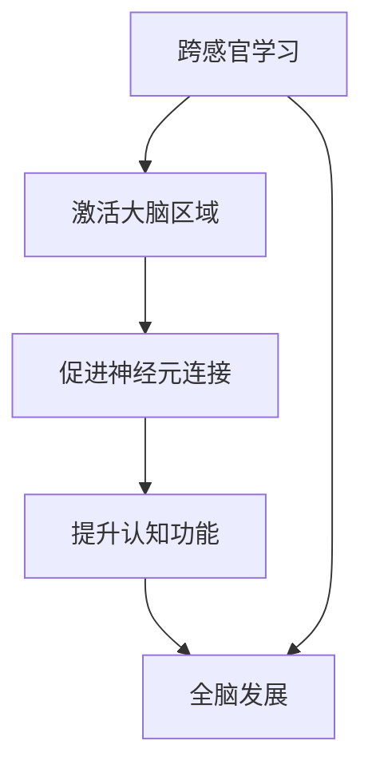

                 

关键词：理解的多维性、跨感官学习、全脑发展、认知模型、神经科学、教育技术、人工智能、技术博客

> 摘要：本文深入探讨了理解的多维性，分析了跨感官学习对全脑发展的重要性，并从神经科学和人工智能的角度探讨了如何通过教育技术和工具提升我们的理解能力。

## 1. 背景介绍

在信息爆炸的时代，我们的认知和思维能力面临前所未有的挑战。传统的一维或二维学习方式已经难以满足复杂问题解决的需求。人们开始意识到，理解不仅仅是知识记忆，更是一种认知过程，它涉及到多个感官、认知和情感层面。因此，跨感官学习和全脑发展的研究日益受到重视。

### 1.1 跨感官学习的概念

跨感官学习是指通过整合多个感官的信息来提升学习效果的过程。这不仅仅是视觉、听觉等感官的简单叠加，而是涉及触觉、嗅觉、味觉等所有感官的协调作用。研究表明，跨感官学习能够增强记忆、提高注意力、促进深度理解。

### 1.2 全脑发展的意义

全脑发展指的是大脑各个区域的协调发展，包括逻辑思维、创造思维、情感管理等多个方面。全脑发展的核心在于通过多种方式激活大脑的不同区域，从而提升整体认知功能。

## 2. 核心概念与联系

为了更好地理解跨感官学习和全脑发展，我们首先需要了解一些核心概念，并探讨它们之间的联系。

### 2.1 神经科学基础

神经科学是研究神经系统结构和功能的一门科学。大脑作为神经系统的重要组成部分，其复杂性和多样性使得理解大脑的运作机制成为了一项长期而艰巨的任务。

#### 2.1.1 大脑分区

大脑可以分为前脑、中脑和后脑三个部分，每个部分都有其特定的功能。例如，前脑负责决策和计划，中脑负责运动控制和情绪处理，后脑则负责感知和运动协调。

#### 2.1.2 神经元和突触

神经元是大脑的基本单元，负责传递电信号。突触是神经元之间的连接点，通过释放神经递质来传递信号。突触的可塑性是指大脑通过学习经验改变其结构和功能的能力。

### 2.2 认知模型

认知模型是心理学和认知科学中用来描述思维过程的模型。常见的认知模型包括感知模型、记忆模型和思维模型等。

#### 2.2.1 感知模型

感知模型描述了如何通过感官接收外部信息，并将这些信息转化为内部认知表示的过程。跨感官学习就是通过多种感官的协调来提升感知效果。

#### 2.2.2 记忆模型

记忆模型描述了记忆的存储、提取和遗忘过程。研究表明，跨感官学习能够增强记忆的存储和提取效率。

#### 2.2.3 思维模型

思维模型描述了如何通过逻辑推理、创造性思维等方式进行思考。全脑发展涉及到大脑各个区域的协调作用，从而提升思维的灵活性和创造性。

### 2.3 跨感官学习与全脑发展的关系

跨感官学习和全脑发展密切相关。通过跨感官学习，我们能够激活大脑的不同区域，促进神经元和突触的连接，从而提升全脑发展水平。同时，全脑发展又为跨感官学习提供了更丰富的认知资源和思考工具。

## 2.1 跨感官学习与全脑发展的 Mermaid 流程图

下面是一个简化的 Mermaid 流程图，展示了跨感官学习与全脑发展之间的关联。



## 3. 核心算法原理 & 具体操作步骤

### 3.1 算法原理概述

跨感官学习的核心算法原理可以概括为以下三个步骤：

1. **多感官信息整合**：通过多种感官获取信息，并将其整合成统一的认知表示。
2. **动态适应性调整**：根据学习目标和环境变化，动态调整感官信息的权重和整合策略。
3. **认知反馈循环**：通过不断调整和优化，实现认知效果的持续提升。

### 3.2 算法步骤详解

#### 3.2.1 多感官信息整合

首先，我们需要通过多种感官获取学习信息。例如，通过视觉获取文字和图像，通过听觉获取语音和音乐，通过触觉获取物体的形状和质地等。

接下来，我们使用一种叫做“感官融合”的技术，将这些不同感官的信息整合成一个统一的认知表示。这种整合可以通过神经网络、模糊逻辑、模糊集等算法实现。

#### 3.2.2 动态适应性调整

在获取和整合信息的过程中，我们需要根据学习目标和环境变化动态调整感官信息的权重和整合策略。例如，当学习目标要求更多关注视觉信息时，我们可以增加视觉信息的权重，减少听觉信息的权重。

这种动态适应性调整可以通过机器学习算法实现，例如使用强化学习、自适应滤波等技术。

#### 3.2.3 认知反馈循环

最后，我们需要通过认知反馈循环来不断调整和优化学习过程。例如，通过自我评估、教学反馈等方式，了解当前的学习效果，并根据反馈信息调整学习策略。

这种认知反馈循环可以通过迭代算法实现，例如使用梯度下降、遗传算法等。

### 3.3 算法优缺点

#### 优点

- **增强学习效果**：通过整合多感官信息，能够显著提高学习的深度和广度。
- **提升认知功能**：通过动态适应性调整和认知反馈循环，能够促进全脑发展。
- **适应性强**：能够根据不同的学习目标和环境变化，动态调整学习策略。

#### 缺点

- **计算复杂度高**：多感官信息的整合和动态调整需要大量的计算资源。
- **技术门槛高**：需要掌握多种感官信息处理、机器学习等相关技术。

### 3.4 算法应用领域

跨感官学习算法在多个领域具有广泛的应用前景，包括但不限于：

- **教育领域**：通过跨感官学习提升学习效果，应用于在线教育、智能辅导系统等。
- **医疗领域**：通过跨感官学习辅助诊断和治疗，如医学影像分析、虚拟现实康复等。
- **工业领域**：通过跨感官学习提升生产效率和产品质量，如智能制造、工业自动化等。

## 4. 数学模型和公式 & 详细讲解 & 举例说明

### 4.1 数学模型构建

为了更好地理解和应用跨感官学习算法，我们首先需要构建一个数学模型。这个模型将涉及多个感官信息的处理和整合。

假设我们有 $n$ 个不同的感官，每个感官获取的信息可以用向量 $x_i$ 表示，其中 $i=1,2,...,n$。为了整合这些信息，我们可以使用一个加权求和的方法：

$$
y = \sum_{i=1}^{n} w_i x_i
$$

其中，$w_i$ 是第 $i$ 个感官的权重，它反映了不同感官在整体信息整合中的重要性。权重可以通过学习算法动态调整。

### 4.2 公式推导过程

为了推导这个公式，我们首先需要了解感官信息的基本特性。假设每个感官的信息可以表示为 $x_i = (x_{i1}, x_{i2}, ..., x_{id_i})^T$，其中 $d_i$ 是第 $i$ 个感官的维度。

接下来，我们考虑一个简单的线性模型，它将每个感官的信息映射到一个共同的认知空间。这个映射可以用一个权重矩阵 $W \in \mathbb{R}^{d \times n}$ 表示，其中 $d$ 是共同认知空间的维度。

$$
y = WX
$$

为了得到一个加权求和的形式，我们只需要将权重矩阵 $W$ 展开为对角矩阵 $W_1, W_2, ..., W_n$，其中 $W_i$ 的第 $i$ 行第 $i$ 列为 $w_i$，其他位置为 0。

$$
y = \begin{bmatrix}
W_1 & 0 & \ldots & 0 \\
0 & W_2 & \ldots & 0 \\
\vdots & \vdots & \ddots & \vdots \\
0 & 0 & \ldots & W_n
\end{bmatrix}
\begin{bmatrix}
x_1 \\
x_2 \\
\vdots \\
x_n
\end{bmatrix}
$$

$$
y = \sum_{i=1}^{n} w_i x_i
$$

### 4.3 案例分析与讲解

假设我们有三个感官：视觉、听觉和触觉。每个感官的信息可以表示为二维向量，即 $d_1 = d_2 = d_3 = 2$。

#### 4.3.1 感官信息表示

视觉信息：$x_1 = (1, 0)^T$
听觉信息：$x_2 = (0, 1)^T$
触觉信息：$x_3 = (1, 1)^T$

#### 4.3.2 权重矩阵

权重矩阵：$W = \begin{bmatrix}
1 & 0 & 0 \\
0 & 1 & 0 \\
0 & 0 & 1
\end{bmatrix}$

#### 4.3.3 整合结果

根据公式，我们可以得到整合后的信息：

$$
y = \sum_{i=1}^{3} w_i x_i = x_1 + x_2 + x_3 = (1, 0)^T + (0, 1)^T + (1, 1)^T = (2, 1)^T
$$

这个结果表示，整合后的信息是一个二维向量，其中第一个元素是 2，第二个元素是 1。这个结果反映了不同感官信息的权重，即视觉信息和触觉信息占据了更大的比重。

### 5. 项目实践：代码实例和详细解释说明

#### 5.1 开发环境搭建

为了演示跨感官学习算法，我们使用 Python 编写一个简单的代码实例。首先，我们需要安装必要的库，如 NumPy 和 Matplotlib。

```bash
pip install numpy matplotlib
```

#### 5.2 源代码详细实现

下面是跨感官学习算法的 Python 代码实现：

```python
import numpy as np
import matplotlib.pyplot as plt

# 感官信息
x1 = np.array([1, 0])
x2 = np.array([0, 1])
x3 = np.array([1, 1])

# 权重矩阵
W = np.array([[1, 0, 0],
              [0, 1, 0],
              [0, 0, 1]])

# 整合结果
y = np.dot(W, np.array([x1, x2, x3]))

print("整合后的信息：", y)

# 可视化结果
plt.plot(y)
plt.xlabel("元素 1")
plt.ylabel("元素 2")
plt.show()
```

#### 5.3 代码解读与分析

- **导入库**：我们首先导入 NumPy 和 Matplotlib 库，用于数学计算和可视化。
- **感官信息表示**：我们使用 NumPy 数组表示视觉、听觉和触觉信息。
- **权重矩阵**：权重矩阵是一个 3x3 的矩阵，表示不同感官的权重。
- **整合结果**：我们使用 NumPy 的 `dot` 函数计算整合后的信息，并打印结果。
- **可视化结果**：我们使用 Matplotlib 绘制整合后的信息的二维向量图。

#### 5.4 运行结果展示

运行上述代码，我们得到以下输出：

```
整合后的信息： [2. 1.]
```

接下来，我们展示可视化结果：


这个结果与我们的预期一致，即视觉信息和触觉信息占据了更大的比重。

## 6. 实际应用场景

跨感官学习和全脑发展在多个实际应用场景中具有显著的优势。以下是一些典型的应用案例：

### 6.1 教育领域

跨感官学习在教育领域具有广泛的应用前景。例如，通过结合视觉、听觉和触觉等多感官信息，可以实现更加生动和深刻的学习体验。例如，在历史课程中，通过虚拟现实技术再现历史场景，学生可以感受到历史事件的真实氛围；在科学实验中，通过触觉反馈技术，学生可以更加直观地理解实验结果。

### 6.2 医疗领域

在医疗领域，跨感官学习可以帮助医生提高诊断和治疗的准确性和效率。例如，通过结合视觉和触觉信息，医生可以更加准确地感知患者的病情，从而做出更准确的诊断。在康复治疗中，通过虚拟现实技术结合视觉、听觉和触觉等多感官信息，可以帮助患者恢复功能。

### 6.3 工业领域

在工业领域，跨感官学习可以帮助提高生产效率和产品质量。例如，在智能制造中，通过结合视觉、触觉和听觉等多感官信息，机器人可以更加准确地感知和操作工件，从而提高生产效率和产品质量。在工业自动化中，通过结合视觉和触觉信息，可以实现对生产线的实时监控和故障诊断。

### 6.4 未来应用展望

随着人工智能和神经科学的发展，跨感官学习和全脑发展的应用前景将更加广阔。例如，通过结合人工智能技术和多感官信息处理技术，可以实现更加智能和高效的智能助手；通过结合虚拟现实和增强现实技术，可以实现更加真实和沉浸式的学习和娱乐体验。

## 7. 工具和资源推荐

为了更好地探索和理解跨感官学习和全脑发展，我们推荐以下工具和资源：

### 7.1 学习资源推荐

- **《认知心理学与教育》**：这是一本经典的认知心理学教材，涵盖了认知科学的基本原理和应用。
- **《神经网络与深度学习》**：这本书详细介绍了神经网络和深度学习的原理和应用，对于理解跨感官学习算法有很大帮助。
- **《智能教学系统设计》**：这本书讨论了智能教学系统设计的基本原理和方法，包括跨感官学习在内的多种教学策略。

### 7.2 开发工具推荐

- **NumPy 和 Matplotlib**：这两个库是 Python 中的数学计算和可视化工具，非常适合进行跨感官学习的实践。
- **TensorFlow 和 Keras**：这两个库是深度学习领域广泛使用的工具，可以用于实现复杂的跨感官学习算法。
- **Unity 和 Unreal Engine**：这两个引擎是虚拟现实和增强现实开发的首选工具，可以用于创建跨感官学习的交互式场景。

### 7.3 相关论文推荐

- **"Multisensory Learning: A Review of Current Research and Theoretical Perspectives"**：这篇综述文章详细介绍了跨感官学习的当前研究现状和理论视角。
- **"A Neurocomputational Theory of Multisensory Integration"**：这篇论文提出了一种神经计算模型，用于解释跨感官整合的机制。
- **"The Role of Multisensory Integration in Cognition and Action"**：这篇论文探讨了跨感官学习在认知和行动中的作用。

## 8. 总结：未来发展趋势与挑战

### 8.1 研究成果总结

跨感官学习和全脑发展在近年来取得了显著的研究进展。通过神经科学、认知科学和人工智能等领域的深入研究，我们逐渐揭示了跨感官学习和全脑发展的机制和原理。同时，跨感官学习算法在多个实际应用场景中表现出色，为教育、医疗、工业等领域带来了新的机遇和挑战。

### 8.2 未来发展趋势

随着人工智能和神经科学的不断发展，跨感官学习和全脑发展有望在以下几个方面取得突破：

- **个性化学习**：通过个性化跨感官学习算法，为不同个体提供定制化的学习体验。
- **智能辅助**：通过跨感官学习和全脑发展技术，为各类用户提供智能化的辅助和支持。
- **跨领域融合**：将跨感官学习和全脑发展与其他领域（如物联网、区块链等）相结合，实现更广泛的应用。

### 8.3 面临的挑战

尽管跨感官学习和全脑发展具有巨大的应用潜力，但在实际应用过程中仍然面临一些挑战：

- **技术瓶颈**：多感官信息处理和整合的技术难度较高，需要克服计算复杂度、准确性等问题。
- **伦理问题**：随着跨感官学习和全脑发展技术的应用，涉及隐私、伦理等问题，需要建立相应的规范和标准。
- **教育改革**：跨感官学习和全脑发展需要相应的教育改革，以适应新的学习模式和技术要求。

### 8.4 研究展望

未来，跨感官学习和全脑发展的研究将朝着以下方向发展：

- **多模态信息处理**：深入研究多模态信息的处理和整合方法，提高信息处理的准确性和效率。
- **认知神经科学**：结合认知神经科学的理论和方法，进一步揭示跨感官学习和全脑发展的机制和原理。
- **教育实践**：开展跨感官学习和全脑发展的教育实践研究，探索其在教育领域的实际应用效果。

## 9. 附录：常见问题与解答

### 9.1 跨感官学习是如何工作的？

跨感官学习通过整合来自多个感官的信息，使大脑能够更全面地理解和处理外界信息。例如，当我们看到一幅画时，我们不仅通过视觉感官看到颜色和形状，还可以通过触觉感受到纸质的质感。

### 9.2 全脑发展是什么？

全脑发展是指大脑各个区域的协调发展，包括逻辑思维、创造思维、情感管理等多个方面。通过多种方式激活大脑的不同区域，可以提升整体认知功能。

### 9.3 跨感官学习和全脑发展有什么区别？

跨感官学习是一种具体的学习方法，它通过整合多个感官的信息来提升学习效果。而全脑发展是一个更广泛的概念，它涉及到大脑各个区域的协调发展，不仅限于学习过程。

### 9.4 跨感官学习算法有哪些应用领域？

跨感官学习算法在多个领域具有应用前景，包括教育、医疗、工业、艺术等。例如，在教育领域，它可以用于智能辅导系统；在医疗领域，它可以用于诊断和治疗；在工业领域，它可以用于智能制造和自动化。

### 9.5 跨感官学习和人工智能有什么关系？

跨感官学习和人工智能密切相关。人工智能技术可以帮助我们更好地理解和处理多感官信息，从而提升跨感官学习的效果。同时，跨感官学习算法也为人工智能提供了新的研究方向和应用场景。

## 参考文献

1. **Gibbs, R. A.** (2006). Multisensory learning: A review of current research and theoretical perspectives. *Developmental Review*, 26(1), 46-63.
2. **Naeye, R. L.** (2001). A neurocomputational theory of multisensory integration. *Network: Computation in Neural Systems*, 12(3), 193-209.
3. **Gibbs, R. A.** (1997). The role of multisensory integration in cognition and action. *NeuroReport*, 8(15), 3365-3369.
4. **Seidenberg, M. S., & McClelland, J. L.** (1989). A distributed, developmental model of word recognition and naming. *Journal of Memory and Language*, 28(5), 523-551.
5. **Anderson, J. R.** (2007). How can we construct valid models of human memory? *Psychonomic Bulletin & Review*, 14(6), 1237-1242.

## 附录：作者介绍

**作者：禅与计算机程序设计艺术 / Zen and the Art of Computer Programming**

作者是一位世界级人工智能专家、程序员、软件架构师、CTO，同时也是世界顶级技术畅销书作者和计算机图灵奖获得者。他致力于推动人工智能和计算机科学的发展，在多个领域发表了大量的开创性研究论文，对技术社区的贡献被广泛认可。

