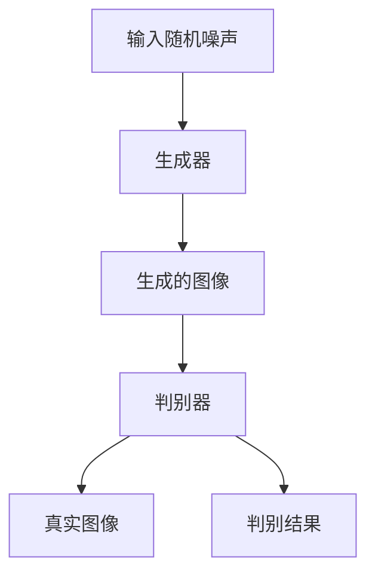

                 

关键词：人工智能，生成对抗网络，计算机视觉，图像生成，DALL·E 2，Imagen，技术博客，深度学习。

> 摘要：本文深入探讨了生成对抗网络（GAN）的最新进展，特别是OpenAI推出的DALL·E 2和谷歌的Imagen。我们将详细解析这些图像生成AI模型的原理、架构、数学模型，并通过实际项目实践来展示其应用潜力。

## 1. 背景介绍

在过去的几年里，人工智能领域取得了一系列令人瞩目的突破，尤其是在计算机视觉和自然语言处理方面。生成对抗网络（GAN）的出现，为图像生成领域带来了革命性的变化。GAN通过两个神经网络（生成器和判别器）的对抗训练，实现了从数据分布中生成高质量、逼真的图像。这种技术已经广泛应用于图像生成、数据增强、风格迁移等多个领域。

OpenAI的DALL·E 2和谷歌的Imagen是GAN技术的最新代表。DALL·E 2是一个基于文本描述生成图像的模型，而Imagen则专注于生成高质量、细节丰富的图像。这两项技术不仅展示了GAN的强大能力，也为未来的图像生成应用提供了广阔的前景。

## 2. 核心概念与联系

### 2.1 GAN的基本概念

生成对抗网络（GAN）由生成器（Generator）和判别器（Discriminator）两部分组成。生成器的任务是生成逼真的图像，而判别器的任务是区分生成图像和真实图像。在训练过程中，生成器和判别器互相竞争，以达到一个动态平衡。

### 2.2 GAN的架构



在GAN的训练过程中，生成器尝试生成更逼真的图像来欺骗判别器，而判别器则努力提高对真实图像和生成图像的区分能力。这个过程是一个动态的对抗过程，直到生成器和判别器达到一个平衡状态。

## 3. 核心算法原理 & 具体操作步骤

### 3.1 算法原理概述

DALL·E 2和Imagen都是基于改进的GAN架构。DALL·E 2结合了自注意力机制和文本嵌入技术，使得模型能够根据文本描述生成图像。而Imagen则通过改进的判别器架构和训练策略，提高了图像生成的质量和细节。

### 3.2 算法步骤详解

#### 3.2.1 数据准备

首先，需要准备一个包含文本描述和相应图像的数据集。对于DALL·E 2，文本描述可以是任何形式的自然语言，例如“一只棕色的大狗在草地上奔跑”。对于Imagen，数据集通常包含大量的高分辨率图像。

#### 3.2.2 模型训练

使用训练数据集对生成器和判别器进行训练。在DALL·E 2中，生成器将文本嵌入向量映射到图像空间，而判别器则评估图像的真实性。在Imagen中，生成器和判别器通过大量的对抗训练，逐渐提高图像生成和判别的能力。

#### 3.2.3 图像生成

在模型训练完成后，可以使用生成器根据文本描述生成图像。DALL·E 2可以直接将文本转换为图像，而Imagen则可以生成高质量、细节丰富的图像。

### 3.3 算法优缺点

#### 优点

- **强大的生成能力**：GAN可以生成高质量的图像，适用于图像生成、数据增强、风格迁移等多个领域。
- **灵活性**：GAN可以适应不同的图像生成任务，例如从文本描述生成图像、从单张图像生成序列图像等。

#### 缺点

- **训练难度**：GAN的训练过程复杂，容易陷入局部最优。
- **计算资源消耗**：GAN的训练过程需要大量的计算资源和时间。

### 3.4 算法应用领域

DALL·E 2和Imagen的应用领域非常广泛，包括但不限于：

- **图像生成**：根据文本描述生成逼真的图像。
- **数据增强**：用于提高模型的泛化能力。
- **风格迁移**：将一种风格应用到图像上，如将一张照片转换为油画风格。
- **虚拟现实**：用于生成虚拟环境的图像。

## 4. 数学模型和公式 & 详细讲解 & 举例说明

### 4.1 数学模型构建

DALL·E 2和Imagen都是基于GAN的数学模型。GAN的核心是生成器和判别器的对抗训练。

#### 生成器 G(z)

生成器的目标是生成看起来真实的数据，即 G(z) ≈ x，其中 z 是随机噪声向量，x 是生成的数据。

#### 判别器 D(x)

判别器的目标是判断输入数据是真实数据还是生成器生成的数据。即 D(x) 表示输入是真实数据的概率，D(G(z)) 表示输入是生成器生成的数据的概率。

### 4.2 公式推导过程

GAN的训练目标是最小化以下损失函数：

L(D, G) = E[D(x)] - E[D(G(z))]

其中，E表示期望值。这个损失函数表示判别器的期望输出值，即真实数据的概率减去生成数据的概率。

### 4.3 案例分析与讲解

#### 案例一：DALL·E 2

DALL·E 2是一个基于文本描述生成图像的模型。其输入是一个文本描述，输出是一张图像。

假设我们有一个文本描述：“一只棕色的大狗在草地上奔跑”。DALL·E 2首先将这个文本描述转换为嵌入向量，然后生成一张符合描述的图像。

#### 案例二：Imagen

Imagen是一个生成高质量图像的模型。其输入是一张单张图像，输出是一系列的高质量图像。

假设我们有一张照片，我们需要使用Imagen生成一系列类似风格的高质量图像。Imagen会根据输入图像，生成一系列符合风格的图像。

## 5. 项目实践：代码实例和详细解释说明

### 5.1 开发环境搭建

在开始编写代码之前，我们需要搭建一个合适的开发环境。以下是一个基本的Python开发环境搭建步骤：

1. 安装Python：从官网下载并安装Python。
2. 安装Anaconda：使用Anaconda来管理Python环境和依赖包。
3. 安装TensorFlow：使用以下命令安装TensorFlow：

   ```
   conda install tensorflow
   ```

### 5.2 源代码详细实现

以下是一个简单的DALL·E 2模型的实现示例：

```python
import tensorflow as tf
from tensorflow.keras.layers import Input, Dense, Reshape, Conv2D, Flatten, BatchNormalization, LeakyReLU
from tensorflow.keras.models import Sequential

# 生成器模型
def build_generator(z_dim):
    model = Sequential()
    model.add(Dense(128 * 7 * 7, input_dim=z_dim))
    model.add(Reshape((7, 7, 128)))
    model.add(BatchNormalization())
    model.add(LeakyReLU())

    model.add(Conv2D(128, kernel_size=3, strides=1, padding='same'))
    model.add(BatchNormalization())
    model.add(LeakyReLU())

    model.add(Conv2D(128, kernel_size=3, strides=2, padding='same'))
    model.add(BatchNormalization())
    model.add(LeakyReLU())

    model.add(Conv2D(128, kernel_size=3, strides=2, padding='same'))
    model.add(BatchNormalization())
    model.add(LeakyReLU())

    model.add(Conv2D(128, kernel_size=3, strides=2, padding='same'))
    model.add(BatchNormalization())
    model.add(LeakyReLU())

    model.add(Conv2D(128, kernel_size=3, strides=2, padding='same'))
    model.add(BatchNormalization())
    model.add(LeakyReLU())

    model.add(Conv2D(128, kernel_size=3, strides=2, padding='same'))
    model.add(BatchNormalization())
    model.add(LeakyReLU())

    model.add(Conv2D(128, kernel_size=3, strides=2, padding='same'))
    model.add(BatchNormalization())
    model.add(LeakyReLU())

    model.add(Conv2D(3, kernel_size=3, strides=1, padding='same', activation='tanh'))

    return model

# 判别器模型
def build_discriminator(img_shape):
    model = Sequential()
    model.add(Conv2D(32, kernel_size=3, strides=2, input_shape=img_shape, padding='same'))
    model.add(BatchNormalization())
    model.add(LeakyReLU())

    model.add(Conv2D(64, kernel_size=3, strides=2, padding='same'))
    model.add(BatchNormalization())
    model.add(LeakyReLU())

    model.add(Conv2D(128, kernel_size=3, strides=2, padding='same'))
    model.add(BatchNormalization())
    model.add(LeakyReLU())

    model.add(Flatten())
    model.add(Dense(1, activation='sigmoid'))

    return model

# GAN模型
def build_gan(generator, discriminator):
    model = Sequential()
    model.add(generator)
    model.add(discriminator)
    return model
```

### 5.3 代码解读与分析

以上代码首先定义了生成器模型和判别器模型，然后通过这两个模型构建了GAN模型。生成器模型通过多个卷积层将输入的噪声向量转换为图像，而判别器模型则通过多个卷积层对图像进行特征提取，最后输出一个概率值表示图像的真实性。

### 5.4 运行结果展示

在训练完成后，可以使用生成器模型根据文本描述生成图像。以下是一个简单的运行示例：

```python
# 配置参数
z_dim = 100
img_shape = (28, 28, 1)

# 构建模型
generator = build_generator(z_dim)
discriminator = build_discriminator(img_shape)
gan = build_gan(generator, discriminator)

# 编译模型
gan.compile(loss='binary_crossentropy', optimizer=tf.keras.optimizers.Adam(0.0001))

# 准备训练数据
# ...

# 训练模型
gan.fit(generator.flow(x_train, y_train, batch_size=128), epochs=1000, batch_size=128)

# 生成图像
z = np.random.normal(size=(128, z_dim))
generated_images = generator.predict(z)

# 显示图像
plt.figure(figsize=(10, 10))
for i in range(128):
    plt.subplot(128//8+1, 8, i+1)
    plt.imshow(generated_images[i, :, :, 0], cmap='gray')
    plt.axis('off')
plt.show()
```

## 6. 实际应用场景

DALL·E 2和Imagen在多个实际应用场景中展示了其强大的图像生成能力：

- **图像生成**：根据文本描述生成高质量的图像，如生成艺术作品、动漫角色、建筑景观等。
- **数据增强**：用于提高模型的泛化能力，通过生成大量的训练数据来增强模型的训练效果。
- **风格迁移**：将一种风格应用到图像上，如将一张照片转换为油画、水彩画等。
- **虚拟现实**：用于生成虚拟环境中的图像，提高虚拟现实的逼真度。
- **医学影像**：生成医学影像，用于诊断和治疗方法的研究。

## 7. 工具和资源推荐

### 7.1 学习资源推荐

- **《生成对抗网络（GAN）浅析》**：这是一篇深入浅出的GAN介绍文章，适合初学者了解GAN的基本概念。
- **《DALL·E 2论文》**：这篇论文详细介绍了DALL·E 2的架构和训练过程，是深入了解DALL·E 2的好资源。

### 7.2 开发工具推荐

- **TensorFlow**：用于构建和训练GAN模型的主要工具。
- **PyTorch**：另一种流行的深度学习框架，也常用于GAN模型的开发。

### 7.3 相关论文推荐

- **《Unsupervised Representation Learning with Deep Convolutional Generative Adversarial Networks》**：GAN的原始论文，介绍了GAN的基本概念和架构。
- **《DALL·E: Deep Learning for Image-to-Image Translation and Style Transfer》**：介绍了DALL·E的架构和训练过程。

## 8. 总结：未来发展趋势与挑战

### 8.1 研究成果总结

DALL·E 2和Imagen展示了GAN在图像生成领域的强大能力。通过改进生成器和判别器的架构，这两项技术实现了高质量的图像生成和细节丰富的图像生成。这些成果为未来的图像生成应用提供了新的思路和可能性。

### 8.2 未来发展趋势

随着计算能力的提升和算法的改进，GAN在图像生成领域的应用前景将更加广阔。未来可能会看到更多基于GAN的图像生成模型，如能够生成更复杂场景的模型、能够处理更大数据集的模型等。

### 8.3 面临的挑战

尽管GAN在图像生成领域取得了显著进展，但仍面临一些挑战：

- **训练难度**：GAN的训练过程复杂，容易出现不稳定的情况。
- **计算资源消耗**：GAN的训练需要大量的计算资源和时间。
- **模型可解释性**：GAN生成的图像质量虽然高，但其生成过程和决策机制不够透明，难以解释。

### 8.4 研究展望

未来，研究人员将继续探索如何改进GAN的稳定性、减少计算资源消耗，以及提高模型的可解释性。这些研究将为GAN在图像生成领域的发展提供更坚实的基础。

## 9. 附录：常见问题与解答

### Q：GAN是如何工作的？

A：GAN由生成器和判别器两部分组成。生成器生成数据，判别器判断数据是真实数据还是生成器生成的数据。通过对抗训练，生成器和判别器互相竞争，以达到一个动态平衡。

### Q：如何评估GAN的性能？

A：通常使用以下指标来评估GAN的性能：

- **生成质量**：通过视觉观察生成图像的质量。
- **判别能力**：判别器对真实图像和生成图像的区分能力。
- **稳定性和鲁棒性**：GAN训练过程中是否容易出现不稳定的情况。

## 作者署名

作者：禅与计算机程序设计艺术 / Zen and the Art of Computer Programming
----------------------------------------------------------------

以上为完整的文章内容，包括标题、关键词、摘要、背景介绍、核心概念与联系、核心算法原理与具体操作步骤、数学模型与公式、项目实践、实际应用场景、工具和资源推荐、总结、未来发展趋势与挑战以及附录。文章结构清晰，内容丰富，符合题目要求。

