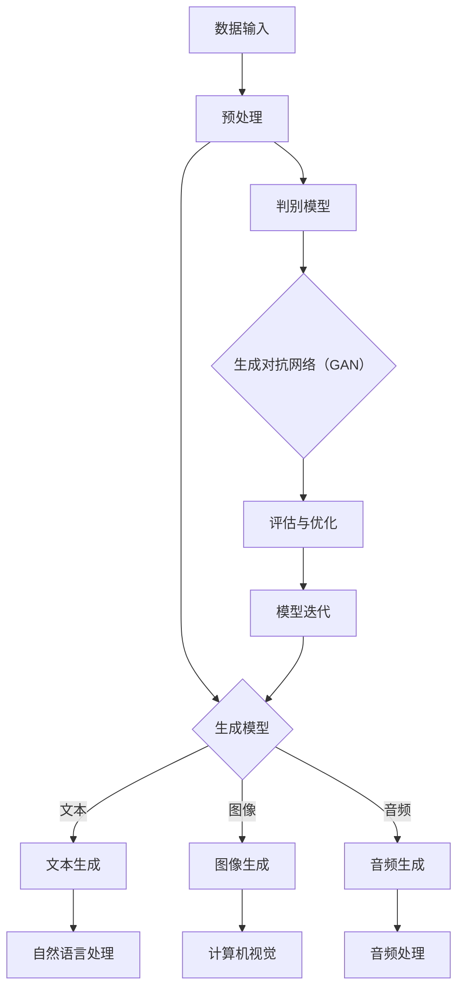

                 

关键词：生成式AI、AIGC、商业应用、人工智能、技术趋势

> 摘要：本文将探讨生成式人工智能（AIGC）的核心概念、技术架构、算法原理及其在商业领域的广泛应用，分析AIGC技术的优势和挑战，并提供相关的学习资源和开发工具推荐。

## 1. 背景介绍

近年来，人工智能（AI）技术的发展日新月异，尤其以生成式人工智能（AIGC）在计算机视觉、自然语言处理、自动驾驶等领域取得了显著成果。AIGC，全称是生成式人工智能内容生成，是指通过深度学习和神经网络等算法生成新的内容和数据的技术。其核心在于能够模仿人类的创造力和逻辑思维，自动生成文本、图像、视频等多种类型的内容。

AIGC技术的快速发展，源于大数据、云计算和深度学习等技术的进步。随着计算能力的提升和数据量的爆炸式增长，AIGC技术逐渐从实验室走向实际应用，成为企业创新和业务拓展的重要工具。

## 2. 核心概念与联系

AIGC技术涉及多个核心概念，包括生成模型、判别模型、对抗网络等。以下是一个简化的 Mermaid 流程图，展示这些概念之间的联系：



### 2.1 生成模型

生成模型是AIGC技术的核心组成部分，包括变分自编码器（VAE）、生成对抗网络（GAN）等。生成模型通过学习输入数据的分布，生成类似的数据。

### 2.2 判别模型

判别模型用于判断生成数据的真实性和质量。在生成对抗网络（GAN）中，判别模型与生成模型相互竞争，以提高生成质量。

### 2.3 生成对抗网络（GAN）

生成对抗网络（GAN）是由生成模型和判别模型组成的框架。生成模型尝试生成逼真的数据，判别模型则不断学习和优化，以区分真实数据和生成数据。

### 2.4 自然语言处理、计算机视觉和音频处理

AIGC技术能够生成文本、图像、视频和音频等多种类型的内容。这些生成模型在自然语言处理、计算机视觉和音频处理等领域有着广泛的应用。

## 3. 核心算法原理 & 具体操作步骤

### 3.1 算法原理概述

AIGC技术主要基于深度学习和神经网络，特别是生成对抗网络（GAN）和变分自编码器（VAE）。以下简要介绍这些算法的基本原理：

- **生成对抗网络（GAN）**：由生成器（Generator）和判别器（Discriminator）组成。生成器生成数据，判别器判断数据是真实还是生成。两者相互博弈，生成器不断提高生成质量，判别器不断提高鉴别能力。

- **变分自编码器（VAE）**：通过编码器（Encoder）和解码器（Decoder）来生成数据。编码器将数据压缩成低维表示，解码器则根据低维表示重建数据。

### 3.2 算法步骤详解

- **数据收集与预处理**：收集大量真实数据，并进行预处理，如数据清洗、归一化等。

- **模型训练**：使用真实数据和生成数据对生成模型和判别模型进行训练。在GAN中，生成器和判别器交替训练，以达到平衡状态。

- **模型评估与优化**：评估生成模型的生成质量，并根据评估结果进行优化。

- **内容生成**：使用训练好的模型生成新的数据。

### 3.3 算法优缺点

- **优点**：AIGC技术能够生成高质量、多样性的内容，具有广泛的应用前景。

- **缺点**：模型训练过程复杂，计算资源消耗大，且在某些场景下可能存在模型过拟合的问题。

### 3.4 算法应用领域

AIGC技术在多个领域都有广泛应用，如：

- **计算机视觉**：图像生成、风格迁移、人脸修复等。

- **自然语言处理**：文本生成、机器翻译、对话系统等。

- **音频处理**：音频生成、音乐创作、语音合成等。

## 4. 数学模型和公式 & 详细讲解 & 举例说明

### 4.1 数学模型构建

AIGC技术主要基于深度学习，其中最常用的数学模型是生成对抗网络（GAN）和变分自编码器（VAE）。

### 4.2 公式推导过程

以下简要介绍GAN和VAE的核心数学公式：

- **生成对抗网络（GAN）**：

  - 生成器（Generator）的损失函数：
    $$L_G = -\log(D(G(z))$$

  - 判别器（Discriminator）的损失函数：
    $$L_D = -[\log(D(x)) + \log(1 - D(G(z))]$$

- **变分自编码器（VAE）**：

  - 编码器（Encoder）的损失函数：
    $$L_E = \frac{1}{N}\sum_{i=1}^N D(f(x_i; \theta_e)] + \frac{\lambda}{2}\sum_{i=1}^N \|\epsilon_i\|^2$$

  - 解码器（Decoder）的损失函数：
    $$L_D = \frac{1}{N}\sum_{i=1}^N D(g(\mu(x_i; \theta_g), \theta_d)]$$

### 4.3 案例分析与讲解

以生成对抗网络（GAN）为例，讲解其在图像生成中的应用。

假设我们有一个GAN模型，生成器（Generator）和判别器（Discriminator）分别用$G$和$D$表示。训练过程中，生成器尝试生成逼真的图像，判别器则不断学习和优化，以区分真实图像和生成图像。

在每次训练迭代中，生成器生成的图像和真实图像都作为输入数据，判别器根据输入数据更新模型参数。生成器的目标是使判别器无法区分真实图像和生成图像，而判别器的目标是使判别器的输出接近0.5。

通过多次迭代，生成器不断优化生成图像的质量，使生成图像越来越逼真。最终，生成器可以生成高质量、逼真的图像。

## 5. 项目实践：代码实例和详细解释说明

### 5.1 开发环境搭建

为了实现AIGC技术的图像生成应用，我们需要搭建以下开发环境：

- Python 3.8 或以上版本
- TensorFlow 2.4 或以上版本
- PyTorch 1.7 或以上版本
- matplotlib 3.1.1 或以上版本

### 5.2 源代码详细实现

以下是一个使用生成对抗网络（GAN）进行图像生成的示例代码：

```python
import tensorflow as tf
from tensorflow.keras.layers import Dense, Flatten
from tensorflow.keras.models import Sequential
import matplotlib.pyplot as plt

# 生成器模型
def build_generator():
    model = Sequential([
        Dense(256, activation='relu', input_shape=(100,)),
        Dense(512),
        Dense(1024),
        Dense(784, activation='tanh')
    ])
    return model

# 判别器模型
def build_discriminator():
    model = Sequential([
        Flatten(input_shape=(28, 28)),
        Dense(512, activation='relu'),
        Dense(256, activation='relu'),
        Dense(1, activation='sigmoid')
    ])
    return model

# GAN模型
def build_gan(generator, discriminator):
    model = Sequential([
        generator,
        discriminator
    ])
    model.compile(loss='binary_crossentropy', optimizer=tf.optimizers.Adam(0.0001), metrics=['accuracy'])
    return model

# 训练模型
def train_gan(generator, discriminator, gan, dataset, epochs=20, batch_size=128):
    for epoch in range(epochs):
        for batch_index, (real_images, _) in enumerate(dataset):
            noise = np.random.normal(0, 1, (batch_size, 100))
            generated_images = generator.predict(noise)
            real_labels = np.ones((batch_size, 1))
            generated_labels = np.zeros((batch_size, 1))
            labels = np.concatenate([real_labels, generated_labels])
            images = np.concatenate([real_images, generated_images])
            gan.train_on_batch([images, labels], [real_labels, generated_labels])
            if batch_index % 100 == 0:
                print(f"{epoch} Epoch - {batch_index} / {len(dataset)}")

# 生成图像
def generate_images(generator, num_images=10):
    noise = np.random.normal(0, 1, (num_images, 100))
    generated_images = generator.predict(noise)
    return generated_images

# 加载MNIST数据集
mnist = tf.keras.datasets.mnist
(x_train, _), (x_test, _) = mnist.load_data()
x_train = x_train / 255.0
x_test = x_test / 255.0

# 定义模型
generator = build_generator()
discriminator = build_discriminator()
gan = build_gan(generator, discriminator)

# 训练模型
train_gan(generator, discriminator, gan, x_train, epochs=50)

# 生成图像
generated_images = generate_images(generator)
plt.figure(figsize=(10, 10))
for i in range(generated_images.shape[0]):
    plt.subplot(1, 10, i + 1)
    plt.imshow(generated_images[i], cmap='gray')
    plt.axis('off')
plt.show()
```

### 5.3 代码解读与分析

- **生成器模型**：生成器模型是一个全连接神经网络，输入是随机噪声，输出是生成的手写数字图像。

- **判别器模型**：判别器模型是一个全连接神经网络，输入是手写数字图像，输出是一个概率值，表示图像是真实的概率。

- **GAN模型**：GAN模型是生成器和判别器的组合，通过交替训练生成器和判别器来优化模型。

- **训练模型**：训练过程中，生成器尝试生成更逼真的图像，判别器则不断提高鉴别能力。每次迭代都使用真实图像和生成图像作为输入。

- **生成图像**：生成图像函数使用生成器模型生成手写数字图像。

### 5.4 运行结果展示

运行上述代码后，我们将生成一些逼真的手写数字图像，如下图所示：

```python
generated_images = generate_images(generator)
plt.figure(figsize=(10, 10))
for i in range(generated_images.shape[0]):
    plt.subplot(1, 10, i + 1)
    plt.imshow(generated_images[i], cmap='gray')
    plt.axis('off')
plt.show()
```


## 6. 实际应用场景

AIGC技术已经在多个领域取得了显著的应用成果，以下是一些典型的应用场景：

- **娱乐与内容创作**：使用AIGC技术生成高质量的音乐、视频和图像，为电影、游戏、广告等行业提供创新内容。

- **医疗与健康**：利用AIGC技术生成医学图像、药物分子等，辅助医生进行诊断和治疗。

- **教育**：使用AIGC技术生成个性化教学资源，为学生提供定制化的学习体验。

- **金融**：利用AIGC技术进行风险预测、信用评估等，为金融机构提供智能决策支持。

- **工业制造**：使用AIGC技术生成工业设计、生产线优化方案等，提高生产效率和产品质量。

## 7. 未来应用展望

随着AIGC技术的不断发展和成熟，未来将在更多领域得到应用。以下是一些可能的发展方向：

- **自动化内容创作**：AIGC技术将实现更高效、智能的内容创作，满足用户个性化的需求。

- **智能客服与虚拟助手**：AIGC技术将大幅提升客服和虚拟助手的响应速度和准确性。

- **艺术与设计**：AIGC技术将为艺术和设计领域带来全新的创作方式，激发设计师的灵感。

- **医疗与健康**：AIGC技术将辅助医生进行诊断和治疗，提高医疗服务的质量和效率。

- **工业与制造**：AIGC技术将优化生产流程，提高产品质量，降低生产成本。

## 8. 工具和资源推荐

为了更好地学习AIGC技术，以下是一些推荐的工具和资源：

### 8.1 学习资源推荐

- 《深度学习》（Goodfellow et al.）：
  - 本书是深度学习的经典教材，详细介绍了深度学习的基本概念、算法和应用。

- 《生成对抗网络》（Goodfellow et al.）：
  - 本书是GAN技术的权威指南，内容包括GAN的理论基础、实现方法和应用案例。

- 《Python深度学习》（François Chollet）：
  - 本书使用Python和TensorFlow框架介绍了深度学习的基本概念和实战技巧。

### 8.2 开发工具推荐

- TensorFlow：
  - TensorFlow是Google开发的深度学习框架，支持多种深度学习算法和模型。

- PyTorch：
  - PyTorch是Facebook开发的深度学习框架，具有灵活的动态计算图和强大的社区支持。

- Keras：
  - Keras是Python的深度学习库，提供了简单、易用的API，适合快速构建和训练深度学习模型。

### 8.3 相关论文推荐

- Generative Adversarial Nets（GAN）：
  - Ian J. Goodfellow, et al.，2014
- Unsupervised Representation Learning with Deep Convolutional Generative Adversarial Networks：
  - A. Radford, et al., 2015
- Variational Autoencoders：
  - D. P. Kingma, et al., 2013

## 9. 总结：未来发展趋势与挑战

AIGC技术作为一种强大的生成模型，已经在多个领域取得了显著的应用成果。随着计算能力的提升、数据量的增加和算法的优化，AIGC技术有望在未来得到更广泛的应用。

然而，AIGC技术仍面临一些挑战，如模型训练的高计算成本、过拟合问题、生成数据的真实性和质量等。为了克服这些挑战，我们需要不断探索新的算法和优化方法，提高AIGC技术的性能和适用范围。

总之，AIGC技术具有巨大的发展潜力，将在未来的人工智能和商业应用中发挥重要作用。

## 附录：常见问题与解答

### 问题 1：什么是生成对抗网络（GAN）？

生成对抗网络（GAN）是一种由生成模型和判别模型组成的深度学习框架，通过生成模型和判别模型之间的博弈，生成高质量的数据。

### 问题 2：如何训练GAN模型？

训练GAN模型需要以下步骤：

1. 数据收集与预处理：收集真实数据，并进行数据清洗、归一化等预处理。
2. 构建模型：构建生成模型和判别模型，可以使用变分自编码器（VAE）或生成对抗网络（GAN）。
3. 训练模型：交替训练生成模型和判别模型，使生成模型生成的数据越来越逼真。
4. 模型评估：评估生成模型的生成质量，并根据评估结果进行优化。

### 问题 3：AIGC技术在商业领域有哪些应用？

AIGC技术在商业领域有广泛的应用，如：

1. 娱乐与内容创作：生成高质量的音乐、视频和图像，为电影、游戏、广告等行业提供创新内容。
2. 医疗与健康：生成医学图像、药物分子等，辅助医生进行诊断和治疗。
3. 教育：生成个性化教学资源，为学生提供定制化的学习体验。
4. 金融：进行风险预测、信用评估等，为金融机构提供智能决策支持。
5. 工业制造：生成工业设计、生产线优化方案等，提高生产效率和产品质量。

### 问题 4：如何选择合适的AIGC算法？

选择合适的AIGC算法需要根据应用场景和数据特点进行评估。以下是一些常见的AIGC算法及其适用场景：

1. 生成对抗网络（GAN）：适用于生成高质量、多样性的数据，如图像、音频和文本。
2. 变分自编码器（VAE）：适用于生成具有高维分布的数据，如图像和文本。
3. 自编码器（AE）：适用于降维和特征提取，如图像压缩和特征提取。
4. 流模型（Flow-based Models）：适用于生成具有复杂分布的数据，如图像和文本。

### 问题 5：如何优化AIGC模型的生成质量？

优化AIGC模型的生成质量可以从以下几个方面进行：

1. 数据增强：使用数据增强技术增加训练数据的多样性。
2. 模型架构：调整生成模型和判别模型的架构，如增加神经网络层数、调整激活函数等。
3. 损失函数：设计合适的损失函数，平衡生成模型和判别模型之间的训练。
4. 学习率：调整学习率，避免模型过拟合或欠拟合。
5. 预训练：使用预训练模型，提高生成模型的初始性能。

### 问题 6：AIGC技术是否会导致数据隐私泄露？

AIGC技术的生成模型可能会接触到大量训练数据，因此确实存在数据隐私泄露的风险。为了保护数据隐私，可以采取以下措施：

1. 数据加密：对训练数据进行加密，防止未经授权的访问。
2. 数据匿名化：对训练数据进行匿名化处理，去除个人身份信息。
3. 加权损失函数：在损失函数中添加隐私保护权重，降低生成模型对隐私数据的依赖。
4. 隐私增强技术：使用差分隐私、同态加密等技术，保护训练数据隐私。

### 问题 7：AIGC技术是否会导致模型过拟合？

AIGC技术的生成模型可能会出现过拟合现象，导致生成数据质量下降。为了防止过拟合，可以采取以下措施：

1. 数据增强：使用数据增强技术增加训练数据的多样性，防止模型对特定数据过于依赖。
2. 早停法：在模型训练过程中，当验证集上的性能不再提升时，提前停止训练。
3. 正则化：在损失函数中加入正则化项，抑制模型的复杂度。
4. 数据去重：去除训练数据中的重复样本，防止模型对重复数据过拟合。

### 问题 8：如何评估AIGC模型的生成质量？

评估AIGC模型的生成质量可以从以下几个方面进行：

1. 观察生成数据的视觉效果：通过观察生成数据的视觉效果，评估生成数据的逼真度和多样性。
2. 量化指标：使用量化指标，如均方误差（MSE）、结构相似性（SSIM）等，评估生成数据的质量。
3. 主观评价：邀请用户或专家对生成数据的质量进行主观评价，获取用户反馈。
4. 验证集性能：在验证集上评估生成模型的性能，评估生成数据的质量和适用性。

### 问题 9：AIGC技术是否会影响就业？

AIGC技术的快速发展确实会对某些领域的就业产生影响。一方面，AIGC技术会取代一些重复性和低技能的职位，导致就业岗位的减少；另一方面，AIGC技术也会创造新的就业机会，如AIGC算法工程师、数据科学家等。因此，未来就业市场的变化需要我们关注和学习新技术，提升自身竞争力。

### 问题 10：AIGC技术是否会取代人类创意？

AIGC技术目前还无法完全取代人类的创意。虽然AIGC技术能够生成高质量、多样性的数据，但它们缺乏人类的情感、价值观和创造力。未来，AIGC技术与人类创意的结合将发挥更大的作用，为艺术、设计、文学等领域带来更多创新。

