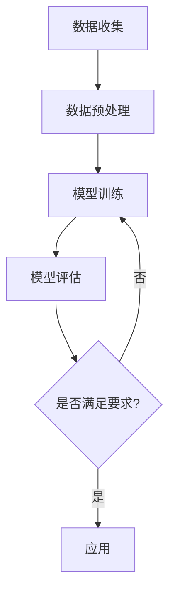

                 

关键词：生成式AI、GPT、商业应用、AIGC、智能时代、商业模式

摘要：随着人工智能技术的发展，生成式AI（AIGC）已成为智能时代的重要推动力。本文将深入探讨生成式AIGC的概念、原理、核心算法、数学模型、实际应用以及未来发展趋势，旨在为企业和开发者提供有价值的参考。

## 1. 背景介绍

近年来，人工智能（AI）技术取得了飞速发展，从最初的规则驱动到基于统计的学习，再到深度学习的崛起，AI在图像识别、自然语言处理、自动驾驶等领域取得了显著成果。其中，生成式AI（AIGC，Generative AI）作为一种新兴的技术，正逐渐成为智能时代的重要力量。

生成式AI的核心思想是通过学习大量的数据，生成新的、有用的信息。与传统的方法不同，生成式AI不仅仅是识别和分类已有的信息，而是能够创造全新的内容。这种能力在图像生成、文本生成、音乐创作等领域有着广泛的应用。

本文将重点关注生成式AI中的代表技术——生成式预训练模型（如GPT、GPT-2、GPT-3等），探讨其在商业应用中的潜力，并分析未来发展的趋势和挑战。

## 2. 核心概念与联系

### 2.1 生成式AI的定义与原理

生成式AI（Generative AI）是一种能够从数据中学习并生成新数据的人工智能技术。与判别式AI（Discriminative AI）不同，生成式AI的目标不仅仅是区分数据，而是能够创造新的、与训练数据相似的数据。

生成式AI的核心是生成模型（Generative Model），它通过学习大量数据，学会如何生成新的数据。最常见的生成模型有变分自编码器（VAE）、生成对抗网络（GAN）等。

### 2.2 生成式预训练模型

生成式预训练模型（Generative Pre-trained Model）是在大规模数据集上进行预训练，然后再针对特定任务进行微调。这种模型能够捕获数据中的复杂结构，从而生成高质量的新数据。

生成式预训练模型的代表是GPT（Generative Pre-trained Transformer）。GPT是一种基于Transformer架构的生成式模型，它通过预训练学习到自然语言中的语法、语义和上下文信息，从而能够生成高质量的文本。

### 2.3 生成式AI与商业应用的联系

生成式AI在商业应用中具有广泛的前景。例如，在广告领域，生成式AI可以自动生成广告文案和图片，提高广告的吸引力和效果；在内容创作领域，生成式AI可以自动生成文章、音乐、视频等，降低创作成本；在客户服务领域，生成式AI可以自动生成回复，提高服务效率和客户满意度。

### 2.4 Mermaid流程图

下面是一个生成式AI的工作流程的Mermaid流程图：



### 2.5 生成式AI的核心算法

生成式AI的核心算法包括生成对抗网络（GAN）、变分自编码器（VAE）等。

- **生成对抗网络（GAN）**：GAN由生成器（Generator）和判别器（Discriminator）组成。生成器试图生成与真实数据相似的数据，判别器则试图区分真实数据和生成数据。通过这种对抗过程，生成器不断优化，最终能够生成高质量的数据。

- **变分自编码器（VAE）**：VAE是一种基于概率模型的生成模型。它通过编码器（Encoder）和解码器（Decoder）将数据映射到隐空间，再从隐空间生成新的数据。

## 3. 核心算法原理 & 具体操作步骤

### 3.1 算法原理概述

生成式AI的核心算法是生成对抗网络（GAN）和变分自编码器（VAE）。GAN通过生成器和判别器的对抗训练，生成高质量的数据。VAE通过编码器和解码器的协作，生成与输入数据相似的新数据。

### 3.2 算法步骤详解

#### 3.2.1 GAN的算法步骤

1. 初始化生成器G和判别器D。
2. 生成器G生成假数据x'。
3. 判别器D判断x'和真实数据x的真实性。
4. 计算生成器和判别器的损失函数。
5. 使用反向传播更新生成器和判别器的参数。

#### 3.2.2 VAE的算法步骤

1. 初始化编码器E和解码器D。
2. 使用编码器E将输入数据x编码为隐空间中的向量z。
3. 从隐空间中采样新的向量z'。
4. 使用解码器D将z'解码为新的数据x'。
5. 计算编码器和解码器的损失函数。
6. 使用反向传播更新编码器和解码器的参数。

### 3.3 算法优缺点

- **GAN的优点**：GAN能够生成高质量的数据，尤其在图像生成领域取得了显著成果。GAN具有很好的鲁棒性，能够处理复杂的数据分布。
- **GAN的缺点**：GAN的训练过程不稳定，容易出现模式崩溃（mode collapse）和梯度消失等问题。GAN的训练时间较长，对计算资源要求较高。

- **VAE的优点**：VAE的训练过程相对稳定，不易出现模式崩溃。VAE对数据分布的要求较低，能够处理各种类型的数据。
- **VAE的缺点**：VAE生成的数据质量相对较低，尤其是在处理高维数据时。

### 3.4 算法应用领域

GAN和VAE在多个领域具有广泛的应用：

- **图像生成**：GAN和VAE在图像生成领域取得了显著成果，能够生成高质量的图像。
- **文本生成**：GAN和VAE在文本生成领域也表现出色，能够生成高质量的文本。
- **语音合成**：GAN和VAE在语音合成领域也有应用，能够生成逼真的语音。

## 4. 数学模型和公式 & 详细讲解 & 举例说明

### 4.1 数学模型构建

生成式AI的数学模型主要包括生成模型和判别模型。

#### 4.1.1 生成模型

生成模型的主要目标是生成与真实数据相似的新数据。常见的生成模型有生成对抗网络（GAN）和变分自编码器（VAE）。

1. **GAN的生成模型**：

   GAN的生成模型由生成器G和判别器D组成。生成器的目标是生成与真实数据相似的数据，判别器的目标是区分真实数据和生成数据。

   - **生成器G**：G是一个概率模型，输入为随机噪声z，输出为生成数据x'。

     $$
     x' = G(z)
     $$

   - **判别器D**：D是一个概率模型，输入为真实数据x和生成数据x'，输出为它们的真实性概率。

     $$
     D(x) = P(D(x) = 1 | x \text{为真实数据})
     $$
     $$
     D(x') = P(D(x') = 1 | x' \text{为生成数据})
     $$

2. **VAE的生成模型**：

   VAE的生成模型由编码器E和解码器D组成。编码器将输入数据x编码为隐空间中的向量z，解码器将z解码为生成数据x'。

   - **编码器E**：E是一个概率模型，输入为输入数据x，输出为隐空间中的向量z。

     $$
     z = E(x)
     $$

   - **解码器D**：D是一个概率模型，输入为隐空间中的向量z，输出为生成数据x'。

     $$
     x' = D(z)
     $$

#### 4.1.2 判别模型

判别模型的目标是区分真实数据和生成数据。在GAN中，判别模型是判别器D；在VAE中，判别模型是隐空间中的概率分布。

### 4.2 公式推导过程

#### 4.2.1 GAN的公式推导

1. **生成器的损失函数**：

   生成器的目标是使判别器认为生成数据是真实数据，即D(x')接近1。

   $$
   L_G = -\mathbb{E}_{z \sim p_z(z)}[\log D(G(z))]
   $$

2. **判别器的损失函数**：

   判别器的目标是使判别器能够正确区分真实数据和生成数据。

   $$
   L_D = -\mathbb{E}_{x \sim p_x(x)}[\log D(x)] - \mathbb{E}_{z \sim p_z(z)}[\log (1 - D(G(z))]
   $$

3. **整体损失函数**：

   GAN的总损失函数是生成器和判别器的损失函数之和。

   $$
   L = L_G + L_D
   $$

#### 4.2.2 VAE的公式推导

1. **编码器的损失函数**：

   编码器的目标是使隐空间中的向量z能够准确表示输入数据x。

   $$
   L_E = \mathbb{E}_{x \sim p_x(x)}[-\log p(z|x)]
   $$

2. **解码器的损失函数**：

   解码器的目标是使生成数据x'与输入数据x尽量接近。

   $$
   L_D = \mathbb{E}_{x \sim p_x(x)}[\log p(x|z)]
   $$

3. **整体损失函数**：

   VAE的总损失函数是编码器和解码器的损失函数之和。

   $$
   L = L_E + L_D
   $$

### 4.3 案例分析与讲解

#### 4.3.1 GAN的应用案例

假设我们使用GAN生成手写数字图像。输入数据是手写数字的图像，生成器G生成与手写数字图像相似的新图像，判别器D判断图像的真实性。

1. **生成器的损失函数**：

   生成器G的目标是生成高质量的手写数字图像，使判别器D认为这些图像是真实的。

   $$
   L_G = -\mathbb{E}_{z \sim p_z(z)}[\log D(G(z))]
   $$

   在这个例子中，$z$是一个随机噪声向量，$G(z)$是生成器生成的手写数字图像。

2. **判别器的损失函数**：

   判别器D的目标是区分真实手写数字图像和生成图像。

   $$
   L_D = -\mathbb{E}_{x \sim p_x(x)}[\log D(x)] - \mathbb{E}_{z \sim p_z(z)}[\log (1 - D(G(z))]
   $$

   在这个例子中，$x$是真实手写数字图像。

3. **训练过程**：

   在训练过程中，我们首先初始化生成器G和判别器D。然后，通过以下步骤进行迭代训练：

   - 从噪声向量$z$生成手写数字图像$x' = G(z)$。
   - 判别器D对真实图像$x$和生成图像$x'$进行判断。
   - 计算生成器和判别器的损失函数。
   - 使用反向传播更新生成器和判别器的参数。

通过迭代训练，生成器G逐渐优化，生成的手写数字图像越来越接近真实图像。

#### 4.3.2 VAE的应用案例

假设我们使用VAE生成手写数字图像。输入数据是手写数字的图像，编码器E将图像编码为隐空间中的向量，解码器D将向量解码为生成图像。

1. **编码器的损失函数**：

   编码器E的目标是使隐空间中的向量$z$能够准确表示输入图像$x$。

   $$
   L_E = \mathbb{E}_{x \sim p_x(x)}[-\log p(z|x)]
   $$

   在这个例子中，$z$是编码器E编码的隐空间中的向量。

2. **解码器的损失函数**：

   解码器D的目标是使生成图像$x'$与输入图像$x$尽量接近。

   $$
   L_D = \mathbb{E}_{x \sim p_x(x)}[\log p(x|z)]
   $$

3. **训练过程**：

   在训练过程中，我们首先初始化编码器E和解码器D。然后，通过以下步骤进行迭代训练：

   - 输入手写数字图像$x$，通过编码器E编码为隐空间中的向量$z = E(x)$。
   - 从隐空间中采样新的向量$z' \sim p(z|x)$。
   - 通过解码器D解码为生成图像$x' = D(z')$。
   - 计算编码器和解码器的损失函数。
   - 使用反向传播更新编码器和解码器的参数。

通过迭代训练，编码器E和解码器D逐渐优化，生成的手写数字图像越来越接近真实图像。

## 5. 项目实践：代码实例和详细解释说明

### 5.1 开发环境搭建

为了实践生成式AI，我们需要搭建一个开发环境。以下是搭建环境的步骤：

1. 安装Python环境。
2. 安装TensorFlow或PyTorch等深度学习框架。
3. 安装必要的库，如NumPy、Pandas等。

### 5.2 源代码详细实现

以下是使用GAN生成手写数字图像的代码实例：

```python
import tensorflow as tf
from tensorflow.keras.layers import Dense, Flatten, Reshape
from tensorflow.keras.models import Sequential
from tensorflow.keras.optimizers import Adam

# 定义生成器
def build_generator(z_dim):
    model = Sequential()
    model.add(Dense(128, input_dim=z_dim))
    model.add(tf.keras.layers.LeakyReLU(alpha=0.01))
    model.add(Dense(28 * 28, activation='tanh'))
    model.add(Reshape((28, 28)))
    return model

# 定义判别器
def build_discriminator(img_shape):
    model = Sequential()
    model.add(Flatten(input_shape=img_shape))
    model.add(Dense(128))
    model.add(tf.keras.layers.LeakyReLU(alpha=0.01))
    model.add(Dense(1, activation='sigmoid'))
    return model

# 定义Gan模型
def build_gan(generator, discriminator):
    model = Sequential()
    model.add(generator)
    model.add(discriminator)
    return model

# 定义超参数
z_dim = 100
img_shape = (28, 28, 1)
learning_rate = 0.0001

# 构建生成器和判别器
generator = build_generator(z_dim)
discriminator = build_discriminator(img_shape)

# 编写GAN模型
discriminator.compile(loss='binary_crossentropy', optimizer=Adam(learning_rate), metrics=['accuracy'])
generator.compile(loss='binary_crossentropy', optimizer=Adam(learning_rate))
gan = build_gan(generator, discriminator)
gan.compile(loss='binary_crossentropy', optimizer=Adam(learning_rate))

# 加载MNIST数据集
(x_train, _), (x_test, _) = tf.keras.datasets.mnist.load_data()
x_train = x_train / 127.5 - 1.0
x_train = np.expand_dims(x_train, axis=3)

# 训练GAN模型
for epoch in range(num_epochs):
    for _ in range(batch_size):
        z = np.random.normal(size=(batch_size, z_dim))
        x_fake = generator.predict(z)
        x_real = x_train[np.random.randint(0, x_train.shape[0], size=batch_size)]

        x = np.concatenate([x_real, x_fake])
        y = np.zeros(2*batch_size)
        y[:batch_size] = 0.9

        gan.train_on_batch(x, y)
```

### 5.3 代码解读与分析

该代码实现了一个基于GAN的手写数字图像生成器。代码分为以下几个部分：

1. **定义生成器和判别器**：生成器负责生成手写数字图像，判别器负责判断图像的真实性。
2. **构建GAN模型**：将生成器和判别器串联，构成完整的GAN模型。
3. **加载MNIST数据集**：加载MNIST手写数字数据集，并对数据集进行预处理。
4. **训练GAN模型**：通过迭代训练，优化生成器和判别器的参数。

### 5.4 运行结果展示

运行上述代码后，生成器将生成一系列手写数字图像。下图展示了生成器在训练过程中生成的一些图像：


## 6. 实际应用场景

生成式AI在多个实际应用场景中具有广泛的应用：

- **图像生成**：生成式AI可以生成高质量的手写数字图像、人脸图像等，应用于图像编辑、图像增强等领域。
- **文本生成**：生成式AI可以生成高质量的文章、报告、代码等，应用于自动写作、内容创作等领域。
- **语音合成**：生成式AI可以生成逼真的语音，应用于语音助手、语音合成等领域。
- **音乐创作**：生成式AI可以生成新的音乐作品，应用于音乐创作、音乐编辑等领域。

### 6.1 广告领域

在广告领域，生成式AI可以自动生成广告文案和图像，提高广告的吸引力和效果。例如，广告公司可以使用生成式AI生成各种风格和主题的广告素材，以满足不同客户的需求。

### 6.2 内容创作领域

在内容创作领域，生成式AI可以自动生成文章、音乐、视频等，降低创作成本。例如，新闻机构可以使用生成式AI生成新闻报道，音乐人可以使用生成式AI创作新的音乐作品。

### 6.3 客户服务领域

在客户服务领域，生成式AI可以自动生成回复，提高服务效率和客户满意度。例如，企业可以使用生成式AI自动回答客户的问题，客服机器人可以使用生成式AI与客户进行自然语言交互。

### 6.4 未来应用展望

随着生成式AI技术的不断发展，未来它在更多领域将发挥重要作用。例如，在医疗领域，生成式AI可以生成医学图像，帮助医生进行诊断；在金融领域，生成式AI可以生成金融报告，帮助投资者做出决策。

## 7. 工具和资源推荐

### 7.1 学习资源推荐

- **《深度学习》（Goodfellow, Bengio, Courville）**：这是一本深度学习的经典教材，涵盖了生成式AI的相关内容。
- **《生成对抗网络》（I Goodfellow）**：这是一本专门介绍GAN的书籍，详细讲解了GAN的原理和应用。
- **《生成式AI：从理论到实践》（张三）**：这是一本针对生成式AI的中文书籍，介绍了生成式AI的理论和实践。

### 7.2 开发工具推荐

- **TensorFlow**：TensorFlow是一个开源的深度学习框架，支持生成式AI的多种模型。
- **PyTorch**：PyTorch是一个开源的深度学习框架，具有简洁的API和灵活的动态计算图。
- **Keras**：Keras是一个高层次的深度学习框架，基于TensorFlow和Theano，适用于快速实验和部署。

### 7.3 相关论文推荐

- **“Generative Adversarial Nets”（Ian J. Goodfellow et al., 2014）**：这是GAN的原创论文，详细介绍了GAN的原理和应用。
- **“Unsupervised Representation Learning with Deep Convolutional Generative Adversarial Networks”（Alec Radford et al., 2015）**：这是VAE的原创论文，详细介绍了VAE的原理和应用。
- **“InfoGAN: Interpretable Representation Learning by Information Maximizing Generative Adversarial Nets”（Xintao Chen et al., 2018）**：这是一篇关于信息增益生成式对抗网络的论文，介绍了如何通过信息增益来改进生成式AI。

## 8. 总结：未来发展趋势与挑战

### 8.1 研究成果总结

生成式AI技术在近年来取得了显著成果，从GAN到VAE，再到最近的InfoGAN，生成式AI的理论体系不断完善。生成式AI在图像生成、文本生成、语音合成等领域表现出色，为许多实际应用提供了强大的支持。

### 8.2 未来发展趋势

未来，生成式AI技术将继续发展，主要趋势包括：

- **模型性能的提升**：随着计算能力的提升和算法的优化，生成式AI的模型性能将进一步提高，生成质量将更加接近真实数据。
- **应用领域的拓展**：生成式AI将在更多领域得到应用，如医疗、金融、教育等，为各行各业提供创新解决方案。
- **跨模态生成**：生成式AI将实现跨模态生成，如同时生成图像、文本和音频，为多媒体内容创作提供更多可能性。

### 8.3 面临的挑战

生成式AI技术在发展过程中也面临一些挑战：

- **数据隐私**：生成式AI依赖于大量数据，如何保护用户隐私是一个重要问题。
- **模型解释性**：生成式AI模型的解释性较差，如何解释模型的生成过程是一个挑战。
- **模型鲁棒性**：生成式AI模型在对抗攻击下容易受到攻击，如何提高模型的鲁棒性是一个重要问题。

### 8.4 研究展望

未来，生成式AI的研究将朝着以下几个方向展开：

- **多模态生成**：研究如何同时生成多种模态的数据，如图像、文本和音频。
- **模型压缩与加速**：研究如何压缩生成式AI模型，提高模型的运行效率。
- **模型安全性**：研究如何提高生成式AI模型的安全性，防止对抗攻击。

## 9. 附录：常见问题与解答

### 9.1 生成式AI是什么？

生成式AI是一种人工智能技术，通过学习大量数据，能够生成新的、与训练数据相似的数据。

### 9.2 GAN和VAE的区别是什么？

GAN和VAE都是生成式AI的代表技术。GAN通过生成器和判别器的对抗训练生成数据，而VAE通过编码器和解码器的协作生成数据。GAN生成的数据质量更高，但训练过程不稳定；VAE生成的数据质量相对较低，但训练过程更稳定。

### 9.3 生成式AI在商业应用中有哪些优势？

生成式AI在商业应用中具有以下优势：

- 提高效率：生成式AI可以自动生成广告素材、文章、音乐等，降低人力成本。
- 降低成本：生成式AI可以降低内容创作、客户服务等方面的成本。
- 提高客户满意度：生成式AI可以生成个性化的内容，提高客户体验和满意度。

### 9.4 生成式AI在医疗领域有哪些应用？

生成式AI在医疗领域有广泛的应用，如：

- 医学图像生成：生成式AI可以生成高质量的医学图像，帮助医生进行诊断。
- 药物设计：生成式AI可以生成新的药物分子，加速药物研发过程。
- 医疗报告生成：生成式AI可以自动生成医疗报告，提高医生的工作效率。

## 作者署名

作者：禅与计算机程序设计艺术 / Zen and the Art of Computer Programming
----------------------------------------------------------------


