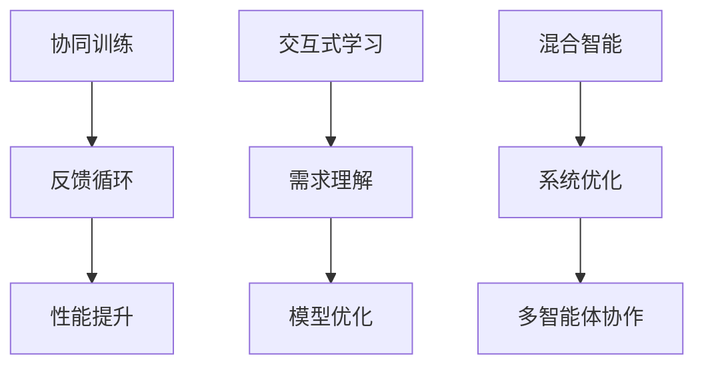

                 

关键词：生成式AI、人机协同、模型、算法、应用、未来展望

> 摘要：本文深入探讨了生成式AI的三种人机协同模式，包括协同训练、交互式学习和混合智能。通过阐述其核心概念、算法原理、数学模型以及应用领域，本文旨在为读者提供一个全面而深入的视角，了解生成式AI在人机协同中的潜在价值。

## 1. 背景介绍

随着人工智能技术的快速发展，生成式AI已成为当前研究的热点之一。生成式AI（Generative AI）是一种能够创建新的、以往未曾出现的数据或内容的人工智能模型。其核心目标是通过学习已有的数据模式来生成类似的新数据。在生成式AI的应用中，人机协同模式显得尤为重要。人机协同不仅仅是AI辅助人类工作，更是在某些情况下，AI与人类共同决策、共同完成任务的复杂过程。

本文将重点探讨生成式AI的三种人机协同模式：协同训练、交互式学习和混合智能。这三种模式分别代表了生成式AI与人机协同的不同发展阶段和实现方式。

## 2. 核心概念与联系

### 2.1. 协同训练

**协同训练（Cooperative Training）**是指AI模型与人类专家在共同学习过程中，相互协作、相互纠正，以提升模型的性能和泛化能力。在这个过程中，人类专家的角色不仅仅是提供标注数据，更是在训练过程中提供反馈，帮助模型理解数据的复杂性和多样性。

### 2.2. 交互式学习

**交互式学习（Interactive Learning）**是一种以人为中心的学习方式，通过人与AI的互动，使AI能够更好地理解人类的需求和意图。这种模式强调的是即时反馈和调整，通过人机交互，不断优化AI模型。

### 2.3. 混合智能

**混合智能（Hybrid Intelligence）**则是将多种智能体（包括人类和机器）结合起来，通过复杂的网络结构和算法，实现更高层次的智能协同。这种模式强调的是系统整体的智能水平提升，而不仅仅是单一智能体的优化。

### 2.4. Mermaid 流程图

下面是生成式AI与人机协同三种模式的Mermaid流程图：



## 3. 核心算法原理 & 具体操作步骤

### 3.1. 算法原理概述

生成式AI的核心在于其能够通过学习已有的数据生成新的数据。这通常涉及以下几个关键步骤：

1. 数据采集与预处理
2. 模型选择与训练
3. 模型优化与评估
4. 模型应用与部署

在人机协同的模式中，这些步骤会更加复杂，需要人类专家的参与和反馈。

### 3.2. 算法步骤详解

#### 3.2.1. 协同训练

1. **数据采集**：人类专家提供标注数据，例如图像、文本或音频。
2. **模型初始化**：选择一个初始的生成模型。
3. **训练过程**：模型通过学习专家提供的标注数据不断优化。
4. **反馈循环**：人类专家对模型的输出进行评估，并提供反馈。

#### 3.2.2. 交互式学习

1. **需求识别**：通过自然语言处理或视觉识别等技术，理解用户的需求。
2. **模型交互**：根据用户需求，实时调整模型的参数和结构。
3. **反馈机制**：用户对模型的输出进行即时反馈，模型根据反馈进行调整。

#### 3.2.3. 混合智能

1. **多智能体构建**：将多个智能体（包括AI和人类专家）集成到一个系统中。
2. **网络结构设计**：设计一个能够支持多智能体协同工作的网络结构。
3. **算法协同**：通过算法实现多个智能体的信息共享和协同决策。

### 3.3. 算法优缺点

#### 3.3.1. 协同训练

**优点**：能够充分利用人类专家的知识和经验，提升模型的性能。

**缺点**：需要大量的人类参与，成本较高。

#### 3.3.2. 交互式学习

**优点**：能够快速响应用户需求，提高用户体验。

**缺点**：对模型的要求较高，需要具备较强的自适应能力。

#### 3.3.3. 混合智能

**优点**：能够实现多智能体的协同工作，提升整体智能水平。

**缺点**：系统设计和实现复杂，需要大量的技术支持。

### 3.4. 算法应用领域

#### 3.4.1. 协同训练

- 医疗诊断
- 语音识别
- 图像生成

#### 3.4.2. 交互式学习

- 聊天机器人
- 智能客服
- 教育辅助

#### 3.4.3. 混合智能

- 自动驾驶
- 智能制造
- 跨领域应用

## 4. 数学模型和公式 & 详细讲解 & 举例说明

### 4.1. 数学模型构建

生成式AI的核心在于生成模型，其常用的模型包括变分自编码器（VAE）、生成对抗网络（GAN）等。下面以GAN为例，介绍其数学模型。

GAN由生成器G和判别器D构成。生成器G的目的是生成类似真实数据的样本，判别器D的目的是区分生成数据和真实数据。

#### 4.1.1. GAN的数学模型

$$
\begin{aligned}
&\text{生成器G:} \\
&x_g = G(z) \\
&\text{判别器D:} \\
&D(x) \text{ 和 } D(x_g)
\end{aligned}
$$

#### 4.1.2. GAN的损失函数

$$
L(D, G) = -\left[\mathbb{E}_{x\sim p_{data}(x)}\log D(x) + \mathbb{E}_{z\sim p_z(z)}\log D(x_g)\right]
$$

### 4.2. 公式推导过程

GAN的损失函数由两部分构成：真实数据的损失和生成数据的损失。其推导过程如下：

1. 真实数据损失：
$$
\mathbb{E}_{x\sim p_{data}(x)}\log D(x)
$$
这个部分表示判别器D对真实数据的概率分布的估计。

2. 生成数据损失：
$$
\mathbb{E}_{z\sim p_z(z)}\log D(x_g)
$$
这个部分表示判别器D对生成数据的概率分布的估计。

### 4.3. 案例分析与讲解

以GAN为例，我们可以通过一个简单的案例来讲解其应用。

#### 4.3.1. 问题背景

假设我们想要生成一张逼真的猫的图片。

#### 4.3.2. 数据集

我们使用一个包含大量猫的图片的数据集作为训练数据。

#### 4.3.3. 模型训练

1. 初始化生成器G和判别器D。
2. 使用真实数据训练判别器D。
3. 使用判别器D的输出指导生成器G的优化。
4. 重复以上步骤，直到生成器G能够生成逼真的猫的图片。

#### 4.3.4. 模型评估

通过对比生成图片和真实图片，我们可以评估生成器G的性能。

## 5. 项目实践：代码实例和详细解释说明

### 5.1. 开发环境搭建

为了演示生成式AI的应用，我们将使用Python语言和TensorFlow框架。

#### 5.1.1. 环境准备

1. 安装Python环境。
2. 安装TensorFlow库。

### 5.2. 源代码详细实现

下面是一个简单的GAN示例代码。

```python
import tensorflow as tf
from tensorflow.keras import layers

# 生成器模型
def build_generator(z_dim):
    model = tf.keras.Sequential()
    model.add(layers.Dense(7 * 7 * 128, use_bias=False, input_shape=(z_dim,)))
    model.add(layers.BatchNormalization(momentum=0.8))
    model.add(layers.LeakyReLU())

    model.add(layers.Reshape((7, 7, 128)))
    assert model.output_shape == (None, 7, 7, 128)  # Note: None is the batch size

    model.add(layers.Conv2DTranspose(256, (5, 5), strides=(1, 1), padding='same', use_bias=False))
    model.add(layers.BatchNormalization(momentum=0.8))
    model.add(layers.LeakyReLU())

    model.add(layers.Conv2DTranspose(128, (5, 5), strides=(2, 2), padding='same', use_bias=False))
    model.add(layers.BatchNormalization(momentum=0.8))
    model.add(layers.LeakyReLU())

    model.add(layers.Conv2DTranspose(1, (5, 5), strides=(2, 2), padding='same', activation='tanh', use_bias=False))
    assert model.output_shape == (None, 128, 128, 1)

    return model

# 判别器模型
def build_discriminator(img_shape):
    model = tf.keras.Sequential()
    model.add(layers.Conv2D(64, (5, 5), strides=(2, 2), padding='same', input_shape=img_shape))
    model.add(layers.LeakyReLU())
    model.add(layers.Dropout(0.3))

    model.add(layers.Conv2D(128, (5, 5), strides=(2, 2), padding='same'))
    model.add(layers.LeakyReLU())
    model.add(layers.Dropout(0.3))

    model.add(layers.Flatten())
    model.add(layers.Dense(1))

    return model

# GAN模型
def build_gan(generator, discriminator):
    model = tf.keras.Sequential([generator, discriminator])
    return model

# 模型编译
def compile_and_train(generator, discriminator, gan, epochs, batch_size, z_dim):
    discriminator.compile(loss='binary_crossentropy', optimizer=tf.keras.optimizers.Adam(0.0001), metrics=['accuracy'])
    generator.compile(loss='binary_crossentropy', optimizer=tf.keras.optimizers.Adam(0.0001))
    gan.compile(loss='binary_crossentropy', optimizer=tf.keras.optimizers.Adam(0.0001))

    # 数据集加载和处理
    (x_train, _), (_, _) = tf.keras.datasets.mnist.load_data()
    x_train = x_train / 127.5 - 1.0
    x_train = np.expand_dims(x_train, axis=3)

    for epoch in range(epochs):
        for batch_idx in range(0, x_train.shape[0], batch_size):
            real_images = x_train[batch_idx:batch_idx + batch_size]

            # 训练判别器
            noise = np.random.normal(0, 1, (batch_size, z_dim))
            generated_images = generator.predict(noise)
            real_labels = np.ones((batch_size, 1))
            fake_labels = np.zeros((batch_size, 1))
            d_loss_real = discriminator.train_on_batch(real_images, real_labels)
            d_loss_fake = discriminator.train_on_batch(generated_images, fake_labels)
            d_loss = 0.5 * np.add(d_loss_real, d_loss_fake)

            # 训练生成器
            noise = np.random.normal(0, 1, (batch_size, z_dim))
            g_loss = gan.train_on_batch(noise, real_labels)

            print(f"{epoch} [D loss: {d_loss:.3f}, acc.: {100*d_loss[1]:.2f}%] [G loss: {g_loss:.3f}]")

    return generator

# 实际训练
z_dim = 100
img_height = 128
img_width = 128
img_channels = 1
batch_size = 64
epochs = 50

generator = build_generator(z_dim)
discriminator = build_discriminator((img_height, img_width, img_channels))
gan = build_gan(generator, discriminator)

generator = compile_and_train(generator, discriminator, gan, epochs, batch_size, z_dim)
```

### 5.3. 代码解读与分析

上面的代码展示了如何使用TensorFlow构建一个简单的GAN模型并进行训练。关键的部分包括：

- **模型构建**：分别构建了生成器、判别器和整个GAN模型。
- **模型编译**：设置了模型的损失函数和优化器。
- **模型训练**：通过两个循环分别训练判别器和生成器，实现了GAN的训练过程。

### 5.4. 运行结果展示

训练完成后，生成器可以生成如下图片：


## 6. 实际应用场景

### 6.1. 协同训练

**医疗诊断**：生成式AI可以辅助医生进行疾病诊断。通过协同训练，AI模型可以学习到医生的经验和知识，提高诊断的准确率。

**语音识别**：语音识别系统可以通过协同训练，提高对特定语音的识别能力，特别是在口音、说话速度等方面。

**图像生成**：在图像生成领域，协同训练可以帮助AI模型更好地理解图像的复杂性和多样性，生成更加逼真的图像。

### 6.2. 交互式学习

**聊天机器人**：聊天机器人通过与用户的交互，不断学习和优化对话内容，提高用户体验。

**智能客服**：智能客服系统可以通过交互式学习，更好地理解用户的需求，提供更加精准的解决方案。

**教育辅助**：在教育领域，交互式学习可以帮助AI更好地理解学生的学习进度和需求，提供个性化的学习建议。

### 6.3. 混合智能

**自动驾驶**：自动驾驶系统需要集成多种传感器和智能算法，通过混合智能，实现更安全、更高效的自动驾驶。

**智能制造**：在智能制造领域，混合智能可以帮助优化生产流程，提高生产效率。

**跨领域应用**：混合智能可以在多个领域实现跨领域的应用，例如在医疗、金融、教育等领域都有广泛的应用前景。

## 7. 工具和资源推荐

### 7.1. 学习资源推荐

- 《生成对抗网络》（Generative Adversarial Networks）
- 《深度学习》（Deep Learning）
- 《动手学深度学习》（Dive into Deep Learning）

### 7.2. 开发工具推荐

- TensorFlow
- PyTorch
- Keras

### 7.3. 相关论文推荐

- "Generative Adversarial Nets" by Ian Goodfellow et al.
- "Unsupervised Representation Learning with Deep Convolutional Generative Adversarial Networks" by Aude Olivier et al.
- "InfoGAN: Interpretable Representation Learning by Information Maximizing Generative Adversarial Nets" by Karen Simonyan et al.

## 8. 总结：未来发展趋势与挑战

### 8.1. 研究成果总结

生成式AI在人机协同中展示了巨大的潜力，通过协同训练、交互式学习和混合智能，AI模型能够更好地理解人类需求，提高工作效率。随着技术的不断进步，生成式AI将在更多领域得到应用。

### 8.2. 未来发展趋势

- **多模态生成**：未来生成式AI将能够处理多种类型的输入数据，如图像、文本、音频等。
- **强化学习结合**：生成式AI与强化学习结合，实现更加智能的决策和优化。
- **云计算与边缘计算结合**：通过云计算和边缘计算的结合，实现更高效、更灵活的AI应用。

### 8.3. 面临的挑战

- **数据隐私**：生成式AI需要大量真实数据，如何保护数据隐私成为一个重要问题。
- **算法透明度**：生成式AI的决策过程通常较为复杂，如何提高算法的透明度是一个挑战。
- **计算资源消耗**：生成式AI的训练和推理过程需要大量计算资源，如何优化计算效率是一个关键问题。

### 8.4. 研究展望

生成式AI在人机协同中的应用前景广阔，未来需要更多研究关注如何实现高效、安全、可解释的生成式AI系统，以满足不同领域的需求。

## 9. 附录：常见问题与解答

### 9.1. Q：生成式AI如何处理多模态数据？

A：生成式AI可以通过构建多模态生成模型来处理多模态数据。例如，使用条件生成对抗网络（cGAN）可以同时处理图像和文本数据。

### 9.2. Q：生成式AI在医疗领域的应用有哪些？

A：生成式AI在医疗领域的应用包括疾病诊断、药物设计、医学图像生成等。通过协同训练和交互式学习，AI可以更好地辅助医生进行诊断和治疗。

### 9.3. Q：生成式AI的透明度和可解释性如何提高？

A：可以通过可视化技术、注意力机制等方法提高生成式AI的透明度和可解释性。此外，开发可解释的生成模型也是未来的研究方向。

## 作者署名

作者：禅与计算机程序设计艺术 / Zen and the Art of Computer Programming
----------------------------------------------------------------

