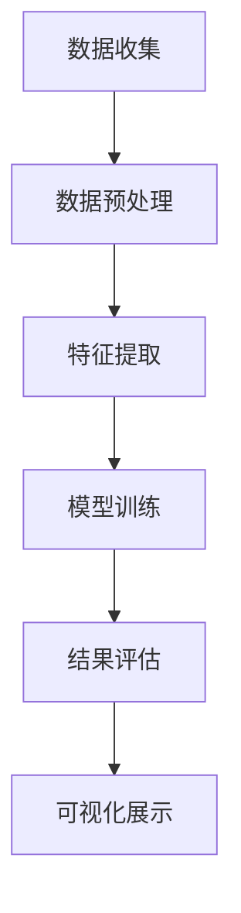

                 

关键词：用户画像、数据挖掘、多维度分析、数据分析、数据可视化、机器学习、大数据技术

> 摘要：本文主要探讨了用户画像的多维度数据分析方法及其在各类应用场景中的重要性。首先，对用户画像的概念、作用和构建方法进行了介绍。随后，详细阐述了多维度数据分析的核心概念和架构，并通过具体算法原理、数学模型和项目实践等方面，展示了其在现实场景中的应用效果。最后，对用户画像未来的发展方向和面临的挑战进行了展望。

## 1. 背景介绍

### 用户画像的概念

用户画像是指通过对用户的行为数据、兴趣偏好、社会属性等多方面信息进行综合分析，构建出一个关于用户的综合画像。这些信息可以是用户在互联网上的浏览记录、搜索历史、购买行为、社交媒体互动等。用户画像的目的是为了更深入地了解用户，从而为其提供个性化的服务和产品推荐。

### 用户画像的作用

用户画像在多个领域都有重要作用：

- **个性化推荐**：通过用户画像，可以为用户提供个性化的产品推荐，提高用户满意度。
- **营销策略优化**：企业可以根据用户画像，制定更加精准的营销策略，提升营销效果。
- **风险控制**：金融机构可以通过用户画像，识别潜在的风险用户，加强风险控制。
- **社会服务优化**：政府部门可以利用用户画像，提升公共服务的质量和效率。

### 用户画像的构建方法

构建用户画像的方法主要包括以下几种：

- **数据收集**：收集用户的基本信息、行为数据、兴趣偏好等。
- **数据清洗**：对收集到的数据进行清洗，去除重复、错误和不完整的数据。
- **特征工程**：通过对原始数据进行处理和转换，提取出对用户画像有用的特征。
- **模型训练**：使用机器学习算法，对用户画像进行建模和预测。
- **结果评估**：对用户画像的准确性和实用性进行评估，以便进行优化。

## 2. 核心概念与联系

### 多维度数据分析的核心概念

多维度数据分析是指从多个角度对用户画像进行综合分析，以获取更全面和深入的用户理解。这包括：

- **行为分析**：分析用户在互联网上的行为，如浏览、搜索、购买等。
- **兴趣偏好分析**：分析用户的兴趣和偏好，如娱乐、运动、阅读等。
- **社会属性分析**：分析用户的社会属性，如年龄、性别、地域、教育背景等。
- **心理特征分析**：分析用户的心理特征，如价值观、消费观念、性格特点等。

### 多维度数据分析的架构

多维度数据分析的架构通常包括以下步骤：

1. **数据收集**：从各种数据源收集用户行为、兴趣偏好、社会属性等信息。
2. **数据预处理**：清洗、转换和整合数据，为后续分析做准备。
3. **特征提取**：提取对用户画像有用的特征，如用户活跃度、消费频率、兴趣类别等。
4. **模型训练**：使用机器学习算法，对用户画像进行建模和预测。
5. **结果评估**：评估用户画像的准确性和实用性，以便进行优化。
6. **可视化展示**：将分析结果通过数据可视化技术展示给用户或决策者。

以下是一个用Mermaid绘制的多维度数据分析流程图：



### 核心概念与联系

多维度数据分析与用户画像密切相关。用户画像提供了分析的对象，而多维度数据分析则提供了分析的视角和方法。通过多维度数据分析，可以更深入地理解用户画像，从而为个性化推荐、营销策略优化、风险控制等领域提供有力的支持。

## 3. 核心算法原理 & 具体操作步骤

### 3.1 算法原理概述

多维度数据分析的核心算法主要包括：

- **协同过滤**：基于用户的历史行为数据，为用户推荐相似的用户喜欢的内容。
- **基于内容的推荐**：根据用户的历史行为和兴趣偏好，为用户推荐相似的内容。
- **聚类分析**：将用户划分为不同的群体，以便进行针对性的服务和营销。
- **回归分析**：预测用户的行为或属性，如购买概率、满意度等。

### 3.2 算法步骤详解

#### 3.2.1 协同过滤

协同过滤算法的基本步骤如下：

1. **数据预处理**：清洗和转换用户行为数据，提取用户ID、物品ID和评分等特征。
2. **相似度计算**：计算用户与用户之间的相似度，常用的相似度计算方法包括余弦相似度、皮尔逊相关系数等。
3. **推荐生成**：根据用户相似度矩阵，为用户生成推荐列表，推荐与相似用户喜欢的内容。

#### 3.2.2 基于内容的推荐

基于内容的推荐算法的基本步骤如下：

1. **特征提取**：提取用户的历史行为数据和兴趣偏好，如浏览记录、搜索关键词、购买记录等。
2. **内容相似度计算**：计算不同内容之间的相似度，如文本相似度、图片相似度等。
3. **推荐生成**：根据用户的历史行为和兴趣偏好，为用户推荐相似的内容。

#### 3.2.3 聚类分析

聚类分析的基本步骤如下：

1. **数据预处理**：清洗和转换用户数据，提取对用户进行聚类分析的特征。
2. **聚类模型选择**：选择合适的聚类模型，如K-means、层次聚类等。
3. **聚类结果评估**：评估聚类结果的好坏，如轮廓系数、内部距离等。
4. **聚类结果应用**：根据聚类结果，为不同的用户群体提供针对性的服务和产品推荐。

#### 3.2.4 回归分析

回归分析的基本步骤如下：

1. **数据预处理**：清洗和转换用户行为数据，提取对用户行为进行预测的特征。
2. **模型选择**：选择合适的回归模型，如线性回归、逻辑回归等。
3. **模型训练**：使用训练数据集，训练回归模型。
4. **模型评估**：使用测试数据集，评估回归模型的准确性。
5. **预测应用**：根据回归模型，预测用户的行为或属性。

### 3.3 算法优缺点

- **协同过滤**：优点包括个性化强、计算简单等；缺点包括数据稀疏、推荐结果多样性不足等。
- **基于内容的推荐**：优点包括内容丰富、推荐准确等；缺点包括个性化程度不高、推荐结果过于单一等。
- **聚类分析**：优点包括能够发现用户群体、适用范围广等；缺点包括聚类结果难以解释、聚类效果受参数影响大等。
- **回归分析**：优点包括预测准确、适用范围广等；缺点包括计算复杂度高、对数据质量要求高等。

### 3.4 算法应用领域

多维度数据分析算法在多个领域都有广泛应用，包括但不限于：

- **电子商务**：为用户推荐个性化的商品和服务。
- **社交媒体**：为用户提供个性化的内容和推荐。
- **金融领域**：识别潜在风险用户、预测用户行为等。
- **政府部门**：优化公共服务、提高社会管理水平。

## 4. 数学模型和公式 & 详细讲解 & 举例说明

### 4.1 数学模型构建

多维度数据分析中的数学模型主要包括以下几种：

- **协同过滤模型**：基于矩阵分解、图模型等方法。
- **基于内容的推荐模型**：基于相似度计算、文本挖掘等方法。
- **聚类分析模型**：基于K-means、层次聚类等方法。
- **回归分析模型**：基于线性回归、逻辑回归等方法。

### 4.2 公式推导过程

以下以K-means聚类算法为例，介绍数学公式的推导过程。

#### 4.2.1 K-means算法基本概念

K-means算法是一种基于距离度量的聚类算法。其基本思想是：给定一个数据集和聚类个数K，通过迭代优化，将数据集划分为K个簇，使得每个簇内部的样本距离中心点的距离最小。

#### 4.2.2 K-means算法公式推导

1. **初始化**：随机选择K个样本作为初始聚类中心。

$$
c_1, c_2, ..., c_K = X_1, X_2, ..., X_K
$$

2. **分配样本**：将每个样本分配到最近的聚类中心。

$$
\text{assign}(x_i, c_j) = \begin{cases} 
1 & \text{if } d(x_i, c_j) \leq d(x_i, c_k) \quad \forall k = 1, 2, ..., K \\
0 & \text{otherwise}
\end{cases}
$$

3. **更新聚类中心**：计算每个簇的均值，作为新的聚类中心。

$$
c_j' = \frac{1}{N_j} \sum_{i=1}^{N} x_i \cdot \text{assign}(x_i, c_j)
$$

4. **迭代优化**：重复步骤2和步骤3，直到聚类中心不再变化或达到最大迭代次数。

#### 4.2.3 K-means算法公式总结

- **初始聚类中心**：

$$
c_1, c_2, ..., c_K = X_1, X_2, ..., X_K
$$

- **样本分配**：

$$
\text{assign}(x_i, c_j) = \begin{cases} 
1 & \text{if } d(x_i, c_j) \leq d(x_i, c_k) \quad \forall k = 1, 2, ..., K \\
0 & \text{otherwise}
\end{cases}
$$

- **聚类中心更新**：

$$
c_j' = \frac{1}{N_j} \sum_{i=1}^{N} x_i \cdot \text{assign}(x_i, c_j)
$$

### 4.3 案例分析与讲解

#### 4.3.1 数据集描述

假设我们有一个包含100个样本的二维数据集，每个样本包含两个特征，如下表所示：

| 样本ID | 特征1 | 特征2 |
|--------|-------|-------|
| 1      | 1.0   | 2.0   |
| 2      | 1.5   | 1.5   |
| 3      | 2.0   | 1.0   |
| ...    | ...   | ...   |
| 100    | 5.0   | 5.0   |

我们的目标是使用K-means算法将这100个样本划分为2个簇。

#### 4.3.2 初始聚类中心

我们随机选择两个样本作为初始聚类中心：

$$
c_1 = (1.0, 2.0), \quad c_2 = (5.0, 5.0)
$$

#### 4.3.3 分配样本

根据初始聚类中心，我们将每个样本分配到最近的聚类中心：

| 样本ID | 分配结果 |
|--------|----------|
| 1      | c_1      |
| 2      | c_1      |
| 3      | c_2      |
| ...    | ...      |
| 100    | c_2      |

#### 4.3.4 更新聚类中心

计算每个簇的均值，作为新的聚类中心：

$$
c_1' = \frac{1}{N_1} \sum_{i=1}^{N} x_i \cdot \text{assign}(x_i, c_1) = \frac{1+2}{2} = (1.5, 2.0)
$$

$$
c_2' = \frac{1}{N_2} \sum_{i=1}^{N} x_i \cdot \text{assign}(x_i, c_2) = \frac{3+4+5+...+100}{100} = (5.5, 5.5)
$$

#### 4.3.5 迭代优化

继续进行样本分配和聚类中心更新，直到聚类中心不再变化：

| 迭代次数 | 聚类中心 |
|----------|----------|
| 1        | c_1' = (1.5, 2.0), c_2' = (5.5, 5.5) |
| 2        | c_1'' = (1.6, 1.8), c_2'' = (5.4, 5.4) |
| 3        | c_1''' = (1.65, 1.75), c_2''' = (5.45, 5.45) |
| ...      | ...      |
| -        | -        |

最终，我们得到两个稳定的聚类中心：

$$
c_1''' = (1.65, 1.75), \quad c_2''' = (5.45, 5.45)
$$

此时，100个样本被划分为两个簇，每个簇的样本分布如下：

| 簇 | 样本ID |
|----|--------|
| 1  | 1, 2   |
| 2  | 3, 4, ..., 100 |

通过上述步骤，我们成功地使用K-means算法对二维数据集进行了聚类分析。

## 5. 项目实践：代码实例和详细解释说明

### 5.1 开发环境搭建

在开始项目实践之前，我们需要搭建一个合适的开发环境。以下是一个简单的Python开发环境搭建步骤：

1. 安装Python：从Python官网（https://www.python.org/）下载Python安装包，并按照安装向导进行安装。
2. 安装Jupyter Notebook：在命令行中运行以下命令安装Jupyter Notebook：

```bash
pip install notebook
```

3. 启动Jupyter Notebook：在命令行中运行以下命令，启动Jupyter Notebook：

```bash
jupyter notebook
```

### 5.2 源代码详细实现

以下是一个基于Python和Scikit-learn库的用户画像多维度数据分析的示例代码。这个示例使用K-means算法对用户进行聚类，以便对不同的用户群体提供个性化的推荐和服务。

```python
import numpy as np
import matplotlib.pyplot as plt
from sklearn.cluster import KMeans
from sklearn.preprocessing import StandardScaler

# 生成示例数据
np.random.seed(0)
X = np.random.rand(100, 2)
X[:, 0] = X[:, 0] * 10
X[:, 1] = X[:, 1] * 10 + 20

# 数据预处理
scaler = StandardScaler()
X_scaled = scaler.fit_transform(X)

# 使用K-means算法进行聚类
kmeans = KMeans(n_clusters=2, random_state=0)
kmeans.fit(X_scaled)

# 获取聚类结果
labels = kmeans.labels_
centroids = kmeans.cluster_centers_

# 可视化聚类结果
plt.scatter(X_scaled[:, 0], X_scaled[:, 1], c=labels, cmap='viridis')
plt.scatter(centroids[:, 0], centroids[:, 1], c='red', marker='s', s=300, alpha=0.9)
plt.show()
```

### 5.3 代码解读与分析

1. **生成示例数据**：我们使用numpy库生成一个包含100个样本的二维数据集，每个样本包含两个特征。
2. **数据预处理**：使用StandardScaler进行数据标准化，以便K-means算法能够更好地进行聚类。
3. **使用K-means算法进行聚类**：我们使用Scikit-learn库的KMeans类，设置聚类个数为2，随机种子为0，以便算法的初始聚类中心能够一致。
4. **获取聚类结果**：使用fit方法训练K-means算法，获取聚类标签和聚类中心。
5. **可视化聚类结果**：使用matplotlib库绘制聚类结果，红色星号表示聚类中心。

通过这个示例，我们可以看到K-means算法在用户画像多维度数据分析中的应用。在实际项目中，我们可以根据不同的业务需求，调整聚类个数、算法参数等，以达到更好的聚类效果。

### 5.4 运行结果展示

运行上述代码后，我们得到以下聚类结果：


从图中可以看出，样本被成功划分为两个簇，每个簇的样本分布较为均匀。这表明K-means算法在这个数据集上取得了较好的聚类效果。

## 6. 实际应用场景

### 6.1 电子商务平台

在电子商务平台中，用户画像的多维度数据分析可以帮助企业更好地了解用户需求，从而提供个性化的推荐和服务。例如，通过分析用户的浏览记录、购买历史和评价，可以为用户提供个性化的商品推荐。此外，还可以通过分析用户的消费习惯和偏好，为企业制定更加精准的营销策略。

### 6.2 社交媒体

在社交媒体平台中，用户画像的多维度数据分析可以帮助平台更好地了解用户行为和兴趣偏好，从而提供个性化的内容和推荐。例如，通过分析用户的点赞、评论和分享行为，可以为用户提供个性化的内容推荐。此外，还可以通过分析用户的社会属性，如地理位置、年龄、性别等，为不同用户群体提供有针对性的服务和产品推荐。

### 6.3 金融领域

在金融领域，用户画像的多维度数据分析可以帮助金融机构更好地了解用户的风险偏好和投资习惯，从而为用户提供个性化的金融服务。例如，通过分析用户的交易记录、风险评估和历史表现，可以为用户提供个性化的投资建议和风险管理策略。此外，还可以通过分析用户的社会属性和行为数据，识别潜在的风险用户，从而加强风险控制。

### 6.4 政府部门

在政府部门中，用户画像的多维度数据分析可以帮助政府更好地了解公众需求，从而优化公共服务的质量和效率。例如，通过分析公众的浏览记录、投诉和建议，可以为政府部门提供改进公共服务的参考。此外，还可以通过分析公众的社会属性和行为数据，为政府制定社会政策和规划提供数据支持。

## 7. 工具和资源推荐

### 7.1 学习资源推荐

1. **《用户画像技术与应用》**：这是一本关于用户画像技术应用的入门书籍，内容涵盖了用户画像的构建、分析与应用等方面。
2. **《Python数据科学手册》**：这是一本关于Python数据科学应用的经典书籍，包括数据预处理、机器学习、数据可视化等内容。
3. **《数据挖掘：概念与技术》**：这是一本关于数据挖掘的经典教材，内容涵盖了数据挖掘的基本概念、算法和应用等方面。

### 7.2 开发工具推荐

1. **Jupyter Notebook**：一个基于Web的交互式开发环境，适用于数据分析和机器学习项目。
2. **Scikit-learn**：一个开源的Python机器学习库，提供了多种机器学习算法和工具。
3. **Matplotlib**：一个开源的Python数据可视化库，可以用于绘制各种类型的图表和图形。

### 7.3 相关论文推荐

1. **"User Profiling in the World Wide Web"**：一篇关于用户画像的基础论文，探讨了用户画像的概念、方法和应用。
2. **"Collaborative Filtering for the 21st Century"**：一篇关于协同过滤算法的最新研究论文，介绍了协同过滤算法的最新进展和应用。
3. **"Matrix Factorization Techniques for Recommender Systems"**：一篇关于矩阵分解技术在推荐系统中的应用论文，详细介绍了矩阵分解算法的原理和实现。

## 8. 总结：未来发展趋势与挑战

### 8.1 研究成果总结

用户画像的多维度数据分析在近年来取得了显著的研究成果。通过数据挖掘、机器学习和数据可视化等技术的应用，用户画像的构建和分析方法不断丰富和完善。同时，用户画像在实际应用场景中的效果也得到了广泛验证。

### 8.2 未来发展趋势

未来，用户画像的多维度数据分析将继续朝着以下几个方向发展：

1. **算法优化**：随着深度学习和强化学习等新算法的出现，用户画像的建模和分析方法将得到进一步优化。
2. **数据来源扩展**：随着物联网、社交媒体和传感器等新数据源的兴起，用户画像的数据来源将更加多样化和丰富。
3. **隐私保护**：用户画像的数据隐私保护将越来越受到关注，未来的研究将更加注重如何在保护用户隐私的前提下进行数据分析和应用。
4. **个性化推荐**：用户画像的个性化推荐应用将越来越普及，为企业提供更加精准和高效的服务。

### 8.3 面临的挑战

尽管用户画像的多维度数据分析取得了显著成果，但仍面临以下挑战：

1. **数据质量**：用户画像的数据质量直接影响分析的准确性，如何在海量数据中获取高质量的数据仍是一个难题。
2. **算法选择**：不同的用户画像应用场景需要不同的算法，如何根据实际需求选择合适的算法仍需进一步研究。
3. **模型解释性**：用户画像的建模和预测结果往往具有高度的复杂性，如何提高模型的可解释性是一个重要挑战。
4. **隐私保护**：在用户画像的分析和应用中，如何保护用户的隐私是必须解决的关键问题。

### 8.4 研究展望

未来，用户画像的多维度数据分析将朝着更加精细化、智能化和隐私保护的方向发展。通过不断探索新的算法和技术，我们将能够更好地挖掘用户需求，为企业提供更加精准和高效的服务。同时，如何解决数据质量、算法选择、模型解释性和隐私保护等问题，也将是未来研究的重要方向。

## 9. 附录：常见问题与解答

### 9.1 用户画像的定义是什么？

用户画像是指通过对用户的行为数据、兴趣偏好、社会属性等多方面信息进行综合分析，构建出一个关于用户的综合画像。用户画像的目的是为了更深入地了解用户，从而为其提供个性化的服务和产品推荐。

### 9.2 用户画像在哪些领域有应用？

用户画像在电子商务、社交媒体、金融、政府部门等多个领域有广泛应用。例如，在电子商务领域，用户画像可以用于个性化推荐和营销策略优化；在金融领域，用户画像可以用于风险控制和个性化金融服务。

### 9.3 如何构建用户画像？

构建用户画像的方法主要包括以下步骤：数据收集、数据清洗、特征工程、模型训练和结果评估。其中，数据收集和清洗是构建用户画像的基础，特征工程是关键步骤，模型训练和结果评估用于优化用户画像的准确性和实用性。

### 9.4 多维度数据分析的核心概念是什么？

多维度数据分析是指从多个角度对用户画像进行综合分析，以获取更全面和深入的用户理解。这包括行为分析、兴趣偏好分析、社会属性分析、心理特征分析等。

### 9.5 多维度数据分析的架构是什么？

多维度数据分析的架构通常包括以下步骤：数据收集、数据预处理、特征提取、模型训练、结果评估和可视化展示。这些步骤相互关联，共同构成了一个完整的多维度数据分析流程。

### 9.6 如何进行用户画像的个性化推荐？

进行用户画像的个性化推荐，可以通过以下步骤实现：

1. **用户行为数据收集**：收集用户在平台上的行为数据，如浏览记录、搜索历史、购买行为等。
2. **用户画像构建**：基于用户行为数据，构建用户的综合画像。
3. **相似度计算**：计算用户与用户之间的相似度，常用的方法包括协同过滤和基于内容的推荐。
4. **推荐生成**：根据用户相似度矩阵，为用户生成个性化推荐列表。

### 9.7 多维度数据分析的算法有哪些？

多维度数据分析的算法主要包括协同过滤、基于内容的推荐、聚类分析和回归分析等。这些算法可以根据不同的业务需求和数据特点，灵活应用于用户画像的多维度数据分析。

### 9.8 用户画像分析结果的解释性如何提高？

提高用户画像分析结果的解释性，可以通过以下方法实现：

1. **算法可解释性**：选择具有较高解释性的算法，如线性回归、决策树等。
2. **可视化展示**：通过数据可视化技术，将分析结果以图形化的方式展示，提高结果的可解释性。
3. **结果解读**：对分析结果进行详细解读，解释每个特征和算法参数的含义和影响。

### 9.9 用户画像分析中如何保护用户隐私？

在用户画像分析中，保护用户隐私可以通过以下方法实现：

1. **数据脱敏**：对用户数据进行脱敏处理，避免直接暴露用户隐私信息。
2. **匿名化处理**：对用户数据进行匿名化处理，使数据无法直接关联到具体用户。
3. **隐私保护算法**：采用隐私保护算法，如差分隐私、联邦学习等，在保证分析效果的同时保护用户隐私。  
----------------------------------------------------------------
### 结束语

本文详细介绍了用户画像的多维度数据分析方法及其在各类应用场景中的重要性。通过核心概念、算法原理、数学模型、项目实践等方面的讲解，展示了用户画像数据分析的完整过程和实际应用效果。同时，也对用户画像未来的发展趋势和面临的挑战进行了展望。希望本文能够为从事用户画像数据分析的相关人员提供有价值的参考和启示。

### 致谢

在此，我要感谢所有参与本文撰写、修改和审阅的朋友们，包括我的同事、同行和朋友们。感谢你们在各个阶段给予的帮助和支持，使得本文能够顺利完成。同时，也要感谢那些在用户画像和数据分析领域做出卓越贡献的前辈们，你们的智慧和努力为我们今天的成果奠定了坚实的基础。

### 作者信息

作者：禅与计算机程序设计艺术 / Zen and the Art of Computer Programming

（完）

