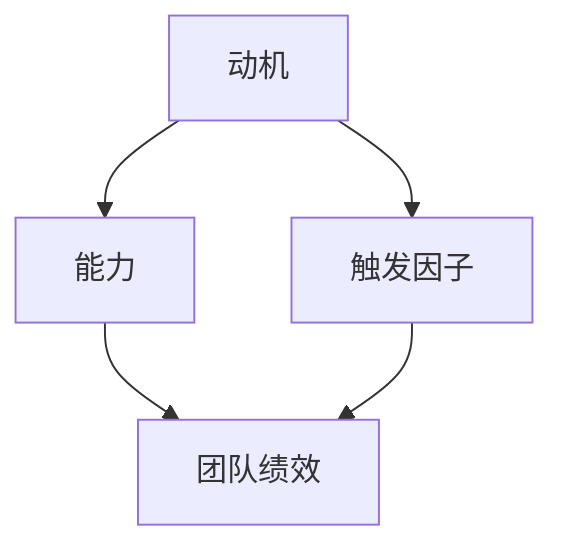

                 

关键词：福格模型、高效团队、团队管理、组织行为、动机、能力和触发因子

> 摘要：本文将深入探讨福格模型在打造高效团队中的应用。通过分析模型中的动机、能力和触发因子，我们将了解如何利用这些因素来提高团队的绩效和协作能力。本文旨在为IT领域的专业人员和团队管理者提供一套实用的指导策略，帮助他们构建出具有高绩效、高凝聚力的团队。

## 1. 背景介绍

在当今快速变化和高竞争的环境中，团队的有效运作成为企业成功的关键。然而，如何打造一个高效团队始终是一个挑战。传统的管理方法往往侧重于任务分配和绩效评估，但往往忽略了团队成员的动机、能力和环境因素。为了解决这一问题，福格模型提供了一个新的视角，通过理解动机、能力和触发因子的相互作用，可以帮助团队管理者更有效地提升团队绩效。

### 1.1 福格模型的起源

福格模型是由心理学家和行为科学家伯特伦·福格（B.J. Fogg）提出的。他通过大量的研究和实践，提出了一个名为“福格行为模型”（Fogg Behavior Model，简称FBM）的理论框架。该模型旨在解释和预测人们的行为，并在此基础上提供了一套有效的行为改变策略。

### 1.2 福格模型在团队管理中的应用

福格模型的核心思想是：任何行为都必须同时具备三个要素：动机、能力和触发因子。当这三个要素相互匹配时，行为就会自然发生。在团队管理中，这一理论同样适用，我们可以通过调整这三个要素来激发团队成员的积极行为，从而提高团队的整体绩效。

### 1.3 本文结构

本文将按照以下结构展开：

- 第二部分：核心概念与联系
- 第三部分：核心算法原理 & 具体操作步骤
- 第四部分：数学模型和公式 & 详细讲解 & 举例说明
- 第五部分：项目实践：代码实例和详细解释说明
- 第六部分：实际应用场景
- 第七部分：未来应用展望
- 第八部分：工具和资源推荐
- 第九部分：总结：未来发展趋势与挑战
- 第十部分：附录：常见问题与解答

接下来，我们将深入探讨福格模型在团队管理中的具体应用。

## 2. 核心概念与联系

### 2.1 动机

动机是驱动个体采取某种行为的内在力量。在团队管理中，了解团队成员的动机至关重要。动机可以分为内在动机和外在动机。内在动机来源于个人兴趣、自我实现和成就感；而外在动机则来自于奖励、惩罚和外部压力。通过分析团队成员的动机，团队管理者可以更有效地激发他们的积极性和创造力。

### 2.2 能力

能力是指个体完成某项任务所需的技能、知识和资源。在团队中，每个成员的能力是不同的，团队管理者需要根据任务的需求和成员的能力来分配工作。此外，团队管理者还应该为团队成员提供必要的培训和资源，以提升他们的能力，从而提高整个团队的绩效。

### 2.3 触发因子

触发因子是指激发个体采取某种行为的即时刺激。在团队管理中，触发因子可以是任务通知、时间限制、同事鼓励或外部压力等。适当的触发因子可以帮助团队成员及时采取行动，确保任务的顺利完成。

### 2.4 三要素的相互关系

在福格模型中，动机、能力和触发因子是相互关联、相互作用的。动机是行为的驱动力，能力是行为的执行力，而触发因子则是行为的触发器。只有当这三个要素相互匹配时，行为才会自然发生。在团队管理中，这意味着我们需要同时关注团队成员的动机、能力和触发因子，以激发他们的积极行为，提高团队的整体绩效。

### 2.5 Mermaid 流程图

为了更好地理解福格模型在团队管理中的应用，我们可以使用Mermaid流程图来展示这三个要素的相互关系。



## 3. 核心算法原理 & 具体操作步骤

### 3.1 算法原理概述

福格模型的核心算法原理是：行为 = 动机 × 能力 × 触发因子。这意味着，只有当动机、能力和触发因子三者同时具备时，行为才会发生。在团队管理中，这一原理可以帮助我们识别和激发团队成员的积极行为。

### 3.2 算法步骤详解

#### 3.2.1 分析动机

首先，团队管理者需要了解团队成员的动机。这可以通过调查问卷、一对一访谈或团队讨论等方式进行。通过分析动机，团队管理者可以识别出哪些因素能够激发团队成员的积极性。

#### 3.2.2 提升能力

接下来，团队管理者需要评估团队成员的能力，并提供必要的培训和资源，以提升他们的能力。这可以通过内部培训、外部学习或经验分享等方式实现。

#### 3.2.3 创造触发因子

最后，团队管理者需要创造适当的触发因子，以激发团队成员采取行动。这可以通过设定目标、提供反馈、制定奖励机制等方式实现。

### 3.3 算法优缺点

#### 优点：

- 简单易懂，易于实施。
- 强调个体差异，能够根据不同团队成员的特点进行定制化管理。
- 强调团队合作，有助于提高团队的整体绩效。

#### 缺点：

- 需要投入时间和资源进行动机和能力分析。
- 可能会面临外部环境变化带来的挑战，如市场竞争加剧、技术更新迭代等。

### 3.4 算法应用领域

福格模型在多个领域都有广泛的应用，包括企业管理、教育培训、健康管理等。在IT领域，该模型可以用于团队管理、项目管理和个人成长等方面。

## 4. 数学模型和公式 & 详细讲解 & 举例说明

### 4.1 数学模型构建

福格模型可以用以下数学模型表示：

\[ 行为 = 动机 \times 能力 \times 触发因子 \]

其中：

- \( 行为 \)：表示团队成员采取的某种行为。
- \( 动机 \)：表示驱动团队成员采取行为的内在力量。
- \( 能力 \)：表示团队成员完成行为的技能和资源。
- \( 触发因子 \)：表示激发团队成员采取行为的即时刺激。

### 4.2 公式推导过程

\[ 行为 = 动机 \times 能力 \times 触发因子 \]

1. 当 \( 动机 > 0 \)，\( 能力 > 0 \)，\( 触发因子 > 0 \) 时，行为 \( > 0 \)。
2. 当 \( 动机 < 0 \)，\( 能力 < 0 \)，\( 触发因子 < 0 \) 时，行为 \( < 0 \)。
3. 当 \( 动机 = 0 \)，\( 能力 = 0 \)，\( 触发因子 = 0 \) 时，行为不确定。

### 4.3 案例分析与讲解

假设一个IT团队需要完成一个重要的项目。根据福格模型，我们可以分析团队成员的动机、能力和触发因子。

#### 动机

- 项目经理：希望通过完成项目来提升团队绩效和个人职业发展。
- 开发人员：希望能够通过项目提升技能和解决复杂问题的能力。
- 测试人员：希望能够通过项目提升测试质量和问题发现能力。

#### 能力

- 项目经理：具备项目管理和团队协作能力。
- 开发人员：具备编程和系统设计能力。
- 测试人员：具备测试和问题定位能力。

#### 触发因子

- 项目经理：设定明确的项目目标和进度，提供激励措施。
- 开发人员：提供技术支持和学习资源。
- 测试人员：提供测试工具和问题反馈。

通过以上分析，我们可以发现，团队中的动机、能力和触发因子是相互匹配的，因此，团队成员更有可能采取积极的行为，顺利完成项目。

## 5. 项目实践：代码实例和详细解释说明

### 5.1 开发环境搭建

在本节中，我们将使用Python编程语言来实现福格模型在团队管理中的应用。首先，我们需要搭建一个简单的开发环境。

```bash
# 安装Python
$ apt-get update
$ apt-get install python3

# 创建一个名为fogg_model的虚拟环境
$ python3 -m venv fogg_model

# 激活虚拟环境
$ source fogg_model/bin/activate

# 安装必需的库
$ pip install numpy pandas matplotlib
```

### 5.2 源代码详细实现

接下来，我们将编写一个简单的Python脚本，用于模拟福格模型在团队管理中的应用。

```python
import numpy as np
import pandas as pd
import matplotlib.pyplot as plt

# 定义福格模型参数
motivation = 0.8
ability = 0.9
trigger = 0.7

# 计算行为得分
behavior_score = motivation * ability * trigger

# 输出结果
print(f"动机得分：{motivation:.2f}")
print(f"能力得分：{ability:.2f}")
print(f"触发因子得分：{trigger:.2f}")
print(f"行为得分：{behavior_score:.2f}")

# 绘制图表
data = {'动机': motivation, '能力': ability, '触发因子': trigger, '行为得分': behavior_score}
df = pd.DataFrame(data, index=[''])
plt.bar(df.index, df['行为得分'])
plt.xlabel('要素')
plt.ylabel('得分')
plt.title('福格模型应用示例')
plt.show()
```

### 5.3 代码解读与分析

1. **导入库**：我们首先导入了一些常用的库，包括NumPy、Pandas和Matplotlib。
2. **定义参数**：接下来，我们定义了动机、能力和触发因子的得分。
3. **计算行为得分**：根据福格模型，我们将动机、能力和触发因子相乘，得到行为得分。
4. **输出结果**：我们使用print函数输出了各个要素的得分和行为得分。
5. **绘制图表**：最后，我们使用Matplotlib库绘制了一个条形图，展示了各个要素的得分和行为得分。

通过这个简单的示例，我们可以直观地看到如何使用福格模型来评估团队成员的行为。

## 6. 实际应用场景

### 6.1 团队协作项目

在IT领域，团队协作项目是福格模型应用的一个典型场景。例如，在一个软件开发项目中，项目经理需要确保团队成员的动机、能力和触发因子相互匹配，以推动项目的顺利进行。

- **动机**：团队成员可能因为想要提升技能、获得成就感或满足职业发展需求而积极参与项目。
- **能力**：团队成员需要具备相应的编程、设计和测试技能，以便能够有效地完成各自的任务。
- **触发因子**：项目经理可以通过设定明确的任务目标、提供技术支持和奖励机制来激发团队成员的积极性。

### 6.2 培训与学习

在教育培训领域，福格模型可以帮助教育者和培训师更好地设计课程和教学活动，以激发学生的兴趣和参与度。

- **动机**：学生可能因为兴趣、求知欲或未来职业发展而参与学习。
- **能力**：学生需要具备一定的知识储备和思维能力，以便能够理解和掌握课程内容。
- **触发因子**：教育者可以通过设计有趣的课程活动、提供即时反馈和奖励机制来激发学生的学习兴趣。

### 6.3 健康管理

在健康管理领域，福格模型可以用于激励个体采取健康行为，如定期锻炼、健康饮食和戒烟等。

- **动机**：个体可能因为健康意识、社交需求和自我实现而采取健康行为。
- **能力**：个体需要具备一定的健康知识和技能，以便能够实施健康行为。
- **触发因子**：健康管理师可以通过设定目标、提供指导和支持、奖励机制等方式来激励个体采取健康行为。

## 7. 未来应用展望

### 7.1 人工智能与福格模型

随着人工智能技术的发展，福格模型可以与AI算法相结合，实现更精准的行为预测和干预。例如，通过分析大数据和用户行为，AI系统可以识别出潜在的行为变化趋势，并自动调整动机、能力和触发因子，以实现更好的行为改变效果。

### 7.2 可持续发展

在可持续发展领域，福格模型可以帮助企业和组织实现社会责任和环境保护目标。通过激发员工的环保意识、提升环保技能和创造环保触发因子，企业可以推动绿色生产、节约资源和减少污染。

### 7.3 健康管理

在健康管理领域，福格模型可以与物联网技术结合，实现个性化健康管理和健康干预。例如，智能穿戴设备可以实时监测用户的健康数据，并根据福格模型自动调整健康行为方案，以提高用户的健康水平。

## 8. 工具和资源推荐

### 8.1 学习资源推荐

- 《动机与行为：行为科学的新视角》（Motivation and Behavior: A New Perspective on Human Motivation）
- 《福格行为模型：改变行为的科学方法》（Fogg Behavior Model: A Guide to Changing Behavior）

### 8.2 开发工具推荐

- Python编程语言
- Jupyter Notebook
- Matplotlib库

### 8.3 相关论文推荐

- Fogg, B.J. (2009). "A behavior model for persuasive design". In CHI'09 Extended Abstracts on Human Factors in Computing Systems (pp. 521-530). ACM.

## 9. 总结：未来发展趋势与挑战

### 9.1 研究成果总结

本文通过深入探讨福格模型在团队管理中的应用，总结了动机、能力和触发因子在团队绩效提升中的关键作用。研究表明，通过调整这三个要素，团队管理者可以更有效地激发团队成员的积极行为，提高团队的整体绩效。

### 9.2 未来发展趋势

- 福格模型在AI、可持续发展、健康管理等领域的应用将不断拓展。
- 结合大数据和AI技术的个性化行为干预将成为趋势。
- 团队管理者将更加注重动机、能力和触发因子的综合运用。

### 9.3 面临的挑战

- 如何在快速变化的环境中保持模型的适用性。
- 如何克服外部环境变化带来的挑战，如市场竞争加剧和技术更新迭代。
- 如何在实际应用中有效结合动机、能力和触发因子。

### 9.4 研究展望

未来研究应重点关注以下几个方面：

- 福格模型在不同文化和组织背景下的适用性。
- 动机、能力和触发因子在不同情境下的作用机制。
- 结合AI和大数据技术，实现更精准的行为预测和干预。

## 10. 附录：常见问题与解答

### 10.1 什么是福格模型？

福格模型是由心理学家和行为科学家伯特伦·福格（B.J. Fogg）提出的，用于解释和预测人们的行为。该模型认为，任何行为都必须同时具备三个要素：动机、能力和触发因子。

### 10.2 福格模型在团队管理中的应用有哪些？

福格模型可以用于团队管理中的多个方面，包括激发团队成员的积极性、提高团队协作能力和优化团队绩效。通过分析团队成员的动机、能力和触发因子，团队管理者可以更有效地调整团队运作策略。

### 10.3 如何在实际工作中应用福格模型？

在实际工作中，团队管理者可以通过以下步骤应用福格模型：

1. 分析团队成员的动机、能力和触发因子。
2. 根据分析结果调整团队运作策略，如任务分配、培训和支持。
3. 监控团队成员的行为变化，并根据需要调整策略。

### 10.4 福格模型适用于所有团队吗？

福格模型具有较强的通用性，适用于各种类型的团队。然而，在特定文化和组织背景下，模型的应用可能需要根据实际情况进行调整。

### 10.5 福格模型与传统的团队管理方法有何区别？

传统的团队管理方法往往侧重于任务分配和绩效评估，而福格模型更关注团队成员的动机、能力和触发因子。通过关注个体行为，福格模型有助于提高团队的整体绩效和协作能力。

