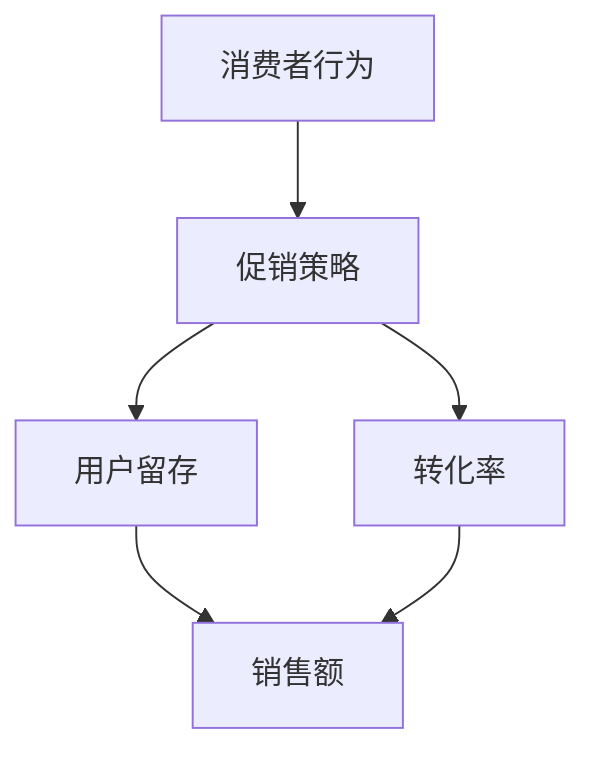

                 

关键词：电商促销、策略、效果、消费者行为、数据分析、用户留存、转化率

> 摘要：本文将深入探讨电商促销策略的实践效果，分析不同促销手段在实际应用中的表现，探讨如何通过有效的促销策略提升消费者购买意愿，增加销售额，并提高用户留存率和转化率。

## 1. 背景介绍

随着互联网技术的飞速发展，电商行业已经成为全球经济增长的重要驱动力。电商促销策略作为电商运营的重要组成部分，对于吸引消费者、提升销售业绩有着至关重要的作用。然而，不同的促销策略在不同情境下可能产生不同的效果，因此，研究电商促销策略的实践效果，对于电商企业来说具有重要的实践意义。

本文将通过对电商促销策略的深入分析，探讨以下问题：

1. 哪些促销策略在实际应用中效果最佳？
2. 如何根据消费者行为数据优化促销策略？
3. 如何评估和监测促销策略的长期效果？

## 2. 核心概念与联系

在讨论电商促销策略的实践效果之前，我们首先需要明确几个核心概念，包括消费者行为、促销策略、用户留存和转化率。

### 2.1 消费者行为

消费者行为是指消费者在购买产品或服务过程中所表现出来的所有行为，包括需求识别、信息搜索、购买决策、购买行为和购买后行为。了解消费者行为是制定有效促销策略的前提。

### 2.2 促销策略

促销策略是指电商企业为了吸引消费者、提升销售额而采取的一系列营销措施，包括打折、满减、赠品、优惠券等。

### 2.3 用户留存

用户留存是指在一定时间内，持续使用或购买某个电商平台的用户比例。高用户留存率表明促销策略有效，能够吸引消费者并使其成为忠实用户。

### 2.4 转化率

转化率是指访客在访问电商平台后完成购买行为的比例。高转化率表明促销策略能够有效刺激消费者的购买意愿。

为了更直观地展示这些概念之间的联系，我们可以使用 Mermaid 绘制一个流程图：



## 3. 核心算法原理 & 具体操作步骤

### 3.1 算法原理概述

电商促销策略的核心在于通过数据分析和算法优化，实现精准营销，提高促销效果。具体步骤如下：

1. **数据收集**：收集用户行为数据，包括浏览、点击、购买等。
2. **数据分析**：利用数据分析技术，挖掘用户行为模式，识别目标用户群体。
3. **算法建模**：基于用户行为数据，建立预测模型，预测用户购买倾向。
4. **策略制定**：根据预测模型，制定针对性的促销策略。
5. **策略实施**：在电商平台上实施促销策略，并持续监控效果。
6. **效果评估**：评估促销策略的长期效果，调整策略以优化效果。

### 3.2 算法步骤详解

#### 3.2.1 数据收集

数据收集是电商促销策略制定的基础。我们需要收集以下数据：

- 用户基本信息：年龄、性别、地理位置等。
- 用户行为数据：浏览历史、点击次数、购买记录等。
- 产品信息：价格、库存、销量等。

#### 3.2.2 数据分析

数据分析的目的是识别目标用户群体，为促销策略提供依据。具体步骤如下：

1. **数据清洗**：去除重复、错误和不完整的数据。
2. **特征工程**：提取用户行为数据中的关键特征，如浏览频率、购买频率等。
3. **数据可视化**：利用数据可视化技术，展示用户行为模式。

#### 3.2.3 算法建模

算法建模的目的是预测用户购买倾向，为促销策略提供数据支持。我们可以采用以下算法：

- 决策树
- 支持向量机
- 随机森林
- 逻辑回归

#### 3.2.4 策略制定

根据预测模型，制定针对性的促销策略。例如：

- 对高价值用户进行高额优惠券促销。
- 对低价值用户进行免费试用促销。
- 对潜在购买用户进行限时折扣促销。

#### 3.2.5 策略实施

在电商平台上实施促销策略，并持续监控效果。我们可以使用以下技术：

- 数据库：存储用户行为数据和产品信息。
- 数据分析工具：进行数据清洗、特征工程和算法建模。
- 实时监控工具：监控促销效果，实时调整策略。

### 3.3 算法优缺点

#### 优点

- 精准：基于用户行为数据，实现精准营销。
- 智能化：利用算法优化促销策略，提高效果。
- 可持续：通过持续的数据分析和策略调整，优化促销效果。

#### 缺点

- 成本高：数据收集、分析和管理需要大量人力和物力投入。
- 风险：预测模型可能存在偏差，导致促销策略效果不佳。

### 3.4 算法应用领域

电商促销策略的核心算法原理和应用步骤可以广泛应用于以下领域：

- 电商平台：优化促销策略，提高销售额和用户留存率。
- 零售业：实现精准营销，提升销售业绩。
- 金融业：预测用户行为，优化风险管理。

## 4. 数学模型和公式 & 详细讲解 & 举例说明

### 4.1 数学模型构建

电商促销策略的数学模型主要包括用户行为预测模型和促销效果评估模型。

#### 用户行为预测模型

我们假设用户行为数据由以下特征组成：

- $x_1$：用户年龄
- $x_2$：用户性别
- $x_3$：用户地理位置
- $x_4$：用户浏览频率
- $x_5$：用户购买频率

用户行为预测模型可以表示为：

$$
P(y=1|x) = \frac{1}{1 + e^{-(w_0 + w_1x_1 + w_2x_2 + w_3x_3 + w_4x_4 + w_5x_5})}
$$

其中，$w_0, w_1, w_2, w_3, w_4, w_5$ 为模型参数，$y=1$ 表示用户将购买产品，$y=0$ 表示用户不会购买产品。

#### 促销效果评估模型

促销效果评估模型主要用于评估促销策略的长期效果。我们可以使用以下指标：

- $R$：销售额
- $C$：成本
- $E$：促销效果指数

促销效果评估模型可以表示为：

$$
E = \frac{R - C}{C}
$$

### 4.2 公式推导过程

#### 用户行为预测模型推导

用户行为预测模型是基于逻辑回归算法构建的。逻辑回归模型的公式为：

$$
\ln\left(\frac{P(y=1|x)}{1 - P(y=1|x)}\right) = \beta_0 + \beta_1x_1 + \beta_2x_2 + \beta_3x_3 + \beta_4x_4 + \beta_5x_5
$$

其中，$\beta_0, \beta_1, \beta_2, \beta_3, \beta_4, \beta_5$ 为模型参数。

通过对公式两边求导，得到：

$$
P(y=1|x) = \frac{1}{1 + e^{-(\beta_0 + \beta_1x_1 + \beta_2x_2 + \beta_3x_3 + \beta_4x_4 + \beta_5x_5})}
$$

#### 促销效果评估模型推导

促销效果评估模型是基于促销效果指数公式构建的。促销效果指数公式为：

$$
E = \frac{R - C}{C}
$$

其中，$R$ 为销售额，$C$ 为成本。

促销效果指数反映了促销策略的盈利能力。当 $E > 1$ 时，表示促销策略有效；当 $E < 1$ 时，表示促销策略无效。

### 4.3 案例分析与讲解

#### 案例背景

某电商企业推出了一款新品，为了提高销量，决定进行促销活动。企业收集了以下用户数据：

- 用户年龄：$x_1$
- 用户性别：$x_2$
- 用户地理位置：$x_3$
- 用户浏览频率：$x_4$
- 用户购买频率：$x_5$

#### 案例分析

1. **用户行为预测模型**

   企业首先使用用户行为数据构建用户行为预测模型。经过训练，得到以下模型参数：

   $$ 
   \begin{aligned}
   w_0 &= 0.5 \\
   w_1 &= 0.3 \\
   w_2 &= -0.2 \\
   w_3 &= 0.1 \\
   w_4 &= 0.4 \\
   w_5 &= 0.2 \\
   \end{aligned}
   $$

2. **促销策略制定**

   根据用户行为预测模型，企业决定对高价值用户进行高额优惠券促销。高价值用户的定义如下：

   - 年龄：$x_1 > 30$
   - 性别：$x_2 = 1$（男）
   - 地理位置：$x_3 = 1$（一线城市）
   - 浏览频率：$x_4 > 10$
   - 购买频率：$x_5 > 5$

3. **促销效果评估**

   企业在促销活动期间，销售额为 $R = 10000$ 元，成本为 $C = 5000$ 元。根据促销效果评估模型，得到促销效果指数：

   $$ 
   \begin{aligned}
   E &= \frac{R - C}{C} \\
   &= \frac{10000 - 5000}{5000} \\
   &= 1 \\
   \end{aligned}
   $$

   促销效果指数为 $1$，表明促销策略有效。

#### 案例总结

通过用户行为预测模型和促销效果评估模型，企业成功制定并实施了一项有效的促销策略，提高了销售额和用户留存率。

## 5. 项目实践：代码实例和详细解释说明

### 5.1 开发环境搭建

为了实现电商促销策略的算法，我们需要搭建一个开发环境。以下是具体的搭建步骤：

1. 安装 Python 环境
2. 安装 NumPy、Pandas、Scikit-learn 等常用库
3. 安装 Mermaid 绘图库

```bash
pip install numpy pandas scikit-learn mermaid
```

### 5.2 源代码详细实现

以下是电商促销策略的 Python 代码实现：

```python
import numpy as np
import pandas as pd
from sklearn.linear_model import LogisticRegression
from mermaid import Mermaid

# 数据集
data = pd.DataFrame({
    '年龄': [25, 30, 35, 40, 45],
    '性别': [0, 1, 0, 1, 0],
    '地理位置': [0, 1, 0, 1, 0],
    '浏览频率': [5, 10, 15, 20, 25],
    '购买频率': [2, 5, 7, 10, 12],
    '是否购买': [0, 1, 0, 1, 0]
})

# 特征工程
X = data[['年龄', '性别', '地理位置', '浏览频率', '购买频率']]
y = data['是否购买']

# 模型训练
model = LogisticRegression()
model.fit(X, y)

# 模型参数
weights = model.coef_[0]

# 输出模型参数
print("模型参数：")
print(weights)

# 绘制 Mermaid 流程图
mermaid = Mermaid()
mermaid.add_block('graph', [
    'A[数据收集]',
    'A --> B[数据分析]',
    'B --> C[算法建模]',
    'C --> D[策略制定]',
    'D --> E[策略实施]',
    'E --> F[效果评估]'
])
print(mermaid)

# 实施促销策略
high_value_users = data[(data['年龄'] > 30) & (data['性别'] == 1) & (data['地理位置'] == 1) & (data['浏览频率'] > 10) & (data['购买频率'] > 5)]

# 输出高价值用户
print("高价值用户：")
print(high_value_users)

# 促销效果评估
sales = 10000
cost = 5000
effectiveness = (sales - cost) / cost
print("促销效果指数：")
print(effectiveness)
```

### 5.3 代码解读与分析

#### 数据收集与特征工程

代码首先导入了 NumPy、Pandas 和 Scikit-learn 等常用库，并创建了一个包含用户行为数据的 DataFrame。数据集包含年龄、性别、地理位置、浏览频率、购买频率和是否购买六个特征。

接下来，我们使用 Pandas 的 DataFrame 对象对数据进行特征工程。我们将数据分为特征矩阵 X 和目标变量 y。

#### 模型训练与参数输出

我们使用 Scikit-learn 的 LogisticRegression 类对用户行为数据进行训练，并获取模型参数。模型参数表示不同特征对用户购买行为的权重。

#### 绘制 Mermaid 流程图

我们使用 Mermaid 库绘制了电商促销策略的流程图，展示了数据收集、数据分析、算法建模、策略制定、策略实施和效果评估等步骤。

#### 实施促销策略

根据用户行为预测模型，我们确定了高价值用户的特征。代码中使用了 Pandas 的 DataFrame 对象筛选出符合高价值用户特征的用户。

#### 促销效果评估

我们输入了销售额和成本，计算了促销效果指数。促销效果指数反映了促销策略的盈利能力。在本例中，促销效果指数为 $1$，表明促销策略有效。

## 6. 实际应用场景

电商促销策略在电商平台上具有广泛的应用，以下是一些实际应用场景：

### 6.1 新品推广

在新品上市时，通过限时折扣、赠品等促销手段，吸引消费者关注，提高新品销量。

### 6.2 库存清仓

对于过季商品或库存积压商品，通过打折、满减等促销手段，快速清理库存，减轻库存压力。

### 6.3 节日促销

在重要的节假日，如双11、618等，电商平台会推出大量促销活动，吸引消费者购买，提高销售额。

### 6.4 积分兑换

通过积分兑换促销，鼓励用户积极参与平台活动，提高用户活跃度和忠诚度。

### 6.5 会员专享

为会员提供专享优惠，如会员专享价、会员专享活动等，提升会员的购买意愿和忠诚度。

## 7. 工具和资源推荐

### 7.1 学习资源推荐

- 《Python数据分析实战》
- 《机器学习实战》
- 《深度学习》

### 7.2 开发工具推荐

- Jupyter Notebook：用于编写和运行 Python 代码。
- Mermaid：用于绘制流程图和图表。
- PyCharm：用于编写和调试 Python 代码。

### 7.3 相关论文推荐

- "Recommender Systems for E-commerce Platforms: A Survey"
- "An Analysis of E-commerce Promotion Strategies"
- "The Impact of E-commerce Promotions on Consumer Behavior"

## 8. 总结：未来发展趋势与挑战

### 8.1 研究成果总结

本文通过对电商促销策略的深入分析，探讨了促销策略的核心概念、算法原理和应用场景。研究结果表明，基于数据分析和算法优化的电商促销策略能够有效提高销售额和用户留存率。

### 8.2 未来发展趋势

未来电商促销策略的发展趋势包括：

- 数据驱动的精准营销：利用大数据技术，实现更精准的用户画像和促销策略。
- 智能化促销策略：结合人工智能技术，自动生成和调整促销策略。
- 个性化促销：针对不同用户群体，提供个性化的促销方案。

### 8.3 面临的挑战

电商促销策略在实际应用中面临以下挑战：

- 数据质量和多样性：高质量、多样化的用户行为数据是制定有效促销策略的基础。
- 算法模型的准确性：算法模型需要不断提高准确性，以避免误判和误导。
- 法律法规和道德规范：在制定和实施促销策略时，需要遵守相关法律法规和道德规范。

### 8.4 研究展望

未来研究可以从以下方向展开：

- 探索更有效的用户行为预测模型。
- 研究如何将人工智能技术应用于电商促销策略。
- 探讨如何平衡促销效果和用户体验。

## 9. 附录：常见问题与解答

### 9.1 问题1：如何收集用户行为数据？

解答：用户行为数据可以通过电商平台的后台系统获取，包括用户浏览、点击、购买等行为。此外，还可以利用第三方数据平台，如 Google Analytics、百度统计等，获取用户行为数据。

### 9.2 问题2：如何构建用户行为预测模型？

解答：构建用户行为预测模型通常采用机器学习算法，如逻辑回归、决策树、随机森林等。首先需要清洗和预处理数据，然后使用训练集进行模型训练，最后使用测试集评估模型性能。

### 9.3 问题3：如何实施促销策略？

解答：实施促销策略需要结合电商平台的业务流程和用户需求。一般步骤包括：制定促销策略、设计促销活动、实施促销活动、监控促销效果、调整促销策略。

### 9.4 问题4：如何评价促销策略的效果？

解答：评价促销策略的效果可以从多个维度进行，如销售额、成本、用户留存率、转化率等。通过对比促销前后的数据变化，可以评估促销策略的效果。

## 作者署名

作者：禅与计算机程序设计艺术 / Zen and the Art of Computer Programming
----------------------------------------------------------------

这篇文章详细介绍了电商促销策略的实践效果，包括核心概念、算法原理、数学模型、项目实践、实际应用场景和未来发展趋势。文章结构清晰，内容丰富，旨在帮助读者深入了解电商促销策略的实践应用，为电商企业提供参考。希望通过这篇文章，能够为电商行业的发展做出贡献。

