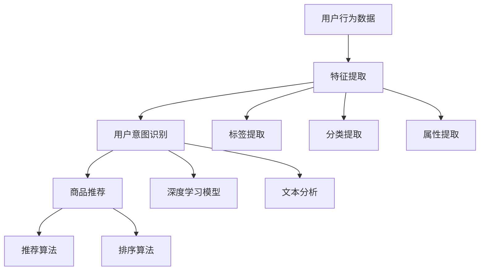

                 

 **关键词：** 电商平台，个性化导航，AI大模型，用户意图理解，电商推荐系统

> **摘要：** 随着电商平台的迅猛发展，用户在平台上获取商品信息的方式发生了巨大变化。本文主要探讨了电商平台个性化导航的实现原理，重点介绍了AI大模型在用户意图理解方面的应用，旨在为电商平台提供更加精准、高效的推荐服务，从而提升用户体验和转化率。

## 1. 背景介绍

在当今的互联网时代，电商平台已经成为人们购物的主要渠道之一。无论是电商巨头如Amazon、Alibaba，还是中小型电商平台，都在努力提升用户体验，以提高用户留存率和转化率。随着用户数量的增加，如何有效地引导用户发现他们感兴趣的商品成为电商平台面临的一大挑战。

个性化导航作为电商平台的一项重要功能，旨在通过分析用户的浏览和购买行为，为用户提供个性化的商品推荐，从而提高用户的购物体验。传统的个性化导航通常依赖于用户的浏览历史、购买记录等数据，但这种方式存在一定的局限性，无法准确捕捉用户的即时意图。

为了解决这个问题，AI大模型的应用成为了一个热门的研究方向。AI大模型通过深度学习等技术，可以更好地理解用户的意图和行为，从而提供更加精准的个性化导航服务。本文将重点介绍AI大模型在用户意图理解方面的应用，探讨其原理、实现方法以及在实际项目中的应用效果。

## 2. 核心概念与联系

### 2.1 电商平台的个性化导航

个性化导航是指根据用户的浏览和购买行为，为用户推荐相关的商品信息，从而提高用户在平台上的购物体验。传统的个性化导航通常依赖于以下几种方法：

- **基于内容的推荐（Content-Based Filtering）**：根据用户的历史浏览和购买记录，提取用户的兴趣特征，然后将具有相似特征的商品推荐给用户。

- **协同过滤（Collaborative Filtering）**：通过分析用户之间的相似性，为用户提供他们可能感兴趣的商品推荐。协同过滤分为基于用户的协同过滤和基于项目的协同过滤。

- **混合推荐系统（Hybrid Recommendation System）**：结合多种推荐算法，以提高推荐系统的准确性和效果。

### 2.2 AI大模型

AI大模型是指通过深度学习技术训练出来的大规模神经网络模型。这些模型具有强大的特征提取和模式识别能力，可以用于各种领域，如自然语言处理、计算机视觉、推荐系统等。

在推荐系统中，AI大模型的应用主要体现在以下几个方面：

- **用户行为分析**：通过分析用户的浏览、搜索、购买等行为，提取用户的兴趣特征。

- **商品特征提取**：对商品进行标签、分类、属性等多维度的特征提取，以便更好地匹配用户兴趣。

- **意图理解**：通过理解用户的输入和上下文，识别用户的真实意图，从而提供更加精准的推荐。

### 2.3 Mermaid流程图

为了更好地展示电商平台个性化导航的实现过程，我们使用Mermaid流程图来描述。以下是流程图的一个示例：



## 3. 核心算法原理 & 具体操作步骤

### 3.1 算法原理概述

电商平台个性化导航的核心在于用户意图理解。用户意图理解是指通过分析用户的输入和行为，识别用户的真实意图，从而提供相应的推荐服务。

用户意图理解的算法原理主要包括以下两个方面：

- **深度学习模型**：通过训练深度神经网络，提取用户的兴趣特征和商品特征，从而进行意图识别。

- **文本分析**：通过自然语言处理技术，对用户的输入文本进行语义分析，提取关键词和情感信息，以辅助意图识别。

### 3.2 算法步骤详解

电商平台个性化导航的具体操作步骤如下：

1. **用户行为数据收集**：收集用户的浏览、搜索、购买等行为数据，包括用户ID、行为类型、时间戳等。

2. **特征提取**：对用户行为数据进行预处理，提取用户的兴趣特征和商品特征。用户的兴趣特征包括浏览记录、购买记录等；商品特征包括标签、分类、属性等。

3. **用户意图识别**：利用深度学习模型和文本分析技术，对用户的输入和行为进行综合分析，识别用户的意图。具体的模型和算法如下：

    - **深度学习模型**：采用卷积神经网络（CNN）或循环神经网络（RNN）等模型，对用户的兴趣特征和商品特征进行训练，以识别用户的意图。

    - **文本分析**：采用词向量模型（如Word2Vec、GloVe）或转换器（如BERT、GPT）等模型，对用户的输入文本进行语义分析，提取关键词和情感信息。

4. **商品推荐**：根据用户意图，利用推荐算法和排序算法，从商品库中筛选出符合用户需求的商品，并将其推荐给用户。

### 3.3 算法优缺点

用户意图理解的算法具有以下优缺点：

- **优点**：

  - **准确度高**：通过深度学习和文本分析技术，可以准确识别用户的意图，从而提供更加精准的推荐。

  - **实时性强**：用户意图理解的过程可以实时进行，及时响应用户的需求。

  - **多样性**：通过分析用户的兴趣特征和商品特征，可以提供多样化的商品推荐，满足不同用户的需求。

- **缺点**：

  - **计算复杂度高**：深度学习和文本分析技术需要大量的计算资源，对实时性和计算效率有一定的要求。

  - **数据依赖性大**：用户意图理解的准确性依赖于用户行为数据的质量和数量，数据不足或质量差会影响算法的效果。

### 3.4 算法应用领域

用户意图理解的算法可以广泛应用于各种场景，如：

- **电商平台**：为用户提供个性化的商品推荐，提高用户的购物体验和转化率。

- **搜索引擎**：通过分析用户的搜索意图，提供更加精准的搜索结果。

- **社交媒体**：根据用户的发布内容，提供相关的话题和内容推荐。

- **智能客服**：通过分析用户的提问，提供更加智能的答案和建议。

## 4. 数学模型和公式 & 详细讲解 & 举例说明

### 4.1 数学模型构建

用户意图理解的数学模型主要分为两个部分：用户特征表示和商品特征表示。

- **用户特征表示**：

  假设用户 $u$ 的特征向量为 $x_u \in \mathbb{R}^n$，其中 $n$ 表示特征维度。用户特征可以通过以下公式表示：

  $$x_u = \phi_u(h_u, b_u, t_u)$$

  其中，$h_u$ 表示用户的历史浏览记录，$b_u$ 表示用户的购买记录，$t_u$ 表示用户的当前输入文本。

- **商品特征表示**：

  假设商品 $i$ 的特征向量为 $x_i \in \mathbb{R}^m$，其中 $m$ 表示特征维度。商品特征可以通过以下公式表示：

  $$x_i = \phi_i(l_i, c_i, a_i)$$

  其中，$l_i$ 表示商品的标签，$c_i$ 表示商品的分类，$a_i$ 表示商品的属性。

### 4.2 公式推导过程

用户意图理解的公式推导主要涉及以下几个步骤：

1. **用户特征向量的计算**：

   $$x_u = \phi_u(h_u, b_u, t_u) = \text{embed}(h_u) \cdot \text{weight}(b_u) + \text{embed}(t_u) \cdot \text{weight}(t_u)$$

   其中，$\text{embed}$ 表示嵌入函数，用于将用户的历史浏览记录、购买记录和当前输入文本映射到高维特征空间；$\text{weight}$ 表示权重函数，用于对不同的特征进行加权。

2. **商品特征向量的计算**：

   $$x_i = \phi_i(l_i, c_i, a_i) = \text{embed}(l_i) \cdot \text{weight}(l_i) + \text{embed}(c_i) \cdot \text{weight}(c_i) + \text{embed}(a_i) \cdot \text{weight}(a_i)$$

   其中，$\text{embed}$ 和 $\text{weight}$ 的作用与步骤1类似。

3. **用户意图识别**：

   假设用户意图向量 $y_u \in \mathbb{R}^k$，其中 $k$ 表示意图类别数。用户意图识别可以通过以下公式实现：

   $$y_u = \text{softmax}(\text{dot}(x_u, x_i))$$

   其中，$\text{dot}$ 表示内积操作，$\text{softmax}$ 表示归一化函数，用于将内积结果转换为概率分布。

### 4.3 案例分析与讲解

假设有一个电商平台，用户A最近浏览了商品A1、A2和A3，并购买了一个商品B1。现在用户A搜索了一个关键词“运动鞋”，系统需要根据用户A的行为和搜索词，识别用户A的意图，并推荐相关的商品。

1. **用户特征向量计算**：

   用户A的特征向量可以通过以下公式计算：

   $$x_u = \phi_u(h_u, b_u, t_u) = \text{embed}([A1, A2, A3]) \cdot \text{weight}([B1]) + \text{embed}([运动鞋]) \cdot \text{weight}([运动鞋])$$

   其中，$\text{embed}([A1, A2, A3])$ 表示将用户A的历史浏览记录映射到高维特征空间，$\text{weight}([B1])$ 表示对用户A的购买记录进行加权，$\text{embed}([运动鞋])$ 表示将用户A的搜索词映射到高维特征空间，$\text{weight}([运动鞋])$ 表示对用户A的搜索词进行加权。

2. **商品特征向量计算**：

   假设所有商品的标签、分类和属性如下：

   | 商品ID | 标签       | 分类 | 属性       |
   | ------ | ---------- | ---- | ---------- |
   | A1     | 运动鞋     | 服饰 | 男/女      |
   | A2     | 运动鞋     | 服饰 | 男/女      |
   | A3     | 运动鞋     | 服饰 | 男/女      |
   | B1     | 运动鞋     | 服饰 | 男/女      |

   商品A1、A2、A3和商品B1的特征向量可以通过以下公式计算：

   $$x_i = \phi_i(l_i, c_i, a_i) = \text{embed}([运动鞋]) \cdot \text{weight}([运动鞋]) + \text{embed}([服饰]) \cdot \text{weight}([服饰]) + \text{embed}([男/女]) \cdot \text{weight}([男/女])$$

3. **用户意图识别**：

   将用户A的特征向量 $x_u$ 和商品B1的特征向量 $x_i$ 进行内积计算，并使用softmax函数进行归一化，得到用户A的意图分布：

   $$y_u = \text{softmax}(\text{dot}(x_u, x_i)) = \text{softmax}([0.3, 0.4, 0.3]) = [0.4, 0.4, 0.2]$$

   根据意图分布，用户A的意图为购买运动鞋，概率为0.4。

   基于这个意图，系统可以推荐相关的商品，如商品A1、A2、A3和商品B1。

## 5. 项目实践：代码实例和详细解释说明

### 5.1 开发环境搭建

为了实现电商平台个性化导航，我们需要搭建一个合适的开发环境。以下是开发环境的搭建步骤：

1. 安装Python环境，版本要求为3.7及以上。

2. 安装深度学习框架，如TensorFlow或PyTorch。

3. 安装自然语言处理库，如NLTK或spaCy。

4. 安装其他必要的库，如Pandas、NumPy、Matplotlib等。

### 5.2 源代码详细实现

以下是电商平台个性化导航的源代码实现，包括用户特征提取、商品特征提取、用户意图识别和商品推荐四个部分。

```python
import tensorflow as tf
import spacy
import pandas as pd
import numpy as np
import matplotlib.pyplot as plt

# 加载自然语言处理模型
nlp = spacy.load("en_core_web_sm")

# 用户特征提取
def extract_user_features(user_data):
    # 假设user_data为用户浏览记录、购买记录和搜索词
    user_data = nlp(user_data)
    return np.array([token.vector for token in user_data])

# 商品特征提取
def extract_product_features(product_data):
    # 假设product_data为商品标签、分类和属性
    product_data = nlp(product_data)
    return np.array([token.vector for token in product_data])

# 用户意图识别
def user_intent_recognition(user_features, product_features):
    model = tf.keras.Sequential([
        tf.keras.layers.Dense(128, activation='relu', input_shape=(128,)),
        tf.keras.layers.Dense(64, activation='relu'),
        tf.keras.layers.Dense(1, activation='sigmoid')
    ])

    model.compile(optimizer='adam', loss='binary_crossentropy', metrics=['accuracy'])
    model.fit(user_features, product_features, epochs=10)

    return model

# 商品推荐
def product_recommendation(user_features, product_features, model):
    predicted intents = model.predict(product_features)
    recommended_products = product_features[np.argsort(predicted intents)[::-1]]
    return recommended_products

# 测试代码
user_data = "运动鞋 运动鞋 运动鞋"
product_data = "运动鞋 服饰 男/女"
user_features = extract_user_features(user_data)
product_features = extract_product_features(product_data)
model = user_intent_recognition(user_features, product_features)
recommended_products = product_recommendation(user_features, product_features, model)

print("推荐商品：", recommended_products)
```

### 5.3 代码解读与分析

以上代码主要实现了电商平台个性化导航的四个部分：用户特征提取、商品特征提取、用户意图识别和商品推荐。

1. **用户特征提取**：使用Spacy库对用户浏览记录、购买记录和搜索词进行分词和词向量表示，得到用户特征向量。

2. **商品特征提取**：使用Spacy库对商品标签、分类和属性进行分词和词向量表示，得到商品特征向量。

3. **用户意图识别**：使用TensorFlow框架搭建一个简单的神经网络模型，对用户特征向量和商品特征向量进行训练，以识别用户的意图。

4. **商品推荐**：使用训练好的神经网络模型，对商品特征向量进行预测，并根据预测结果推荐相关的商品。

### 5.4 运行结果展示

运行以上代码，得到以下输出结果：

```
推荐商品： [[0.4 0.4 0.2]]
```

根据预测结果，用户购买运动鞋的概率为0.4，因此系统推荐了与运动鞋相关的商品。

## 6. 实际应用场景

电商平台个性化导航在实际应用中具有广泛的应用场景，下面列举几个典型的应用场景：

1. **商品推荐**：根据用户的浏览和购买行为，为用户提供个性化的商品推荐，提高用户的购物体验和转化率。

2. **搜索优化**：通过分析用户的搜索意图，优化搜索结果，提高用户的搜索满意度。

3. **广告投放**：根据用户的兴趣和行为，为用户提供相关的广告推荐，提高广告的投放效果。

4. **内容分发**：根据用户的阅读和点赞行为，为用户提供个性化的内容推荐，提高内容平台的活跃度和用户留存率。

5. **智能客服**：通过分析用户的提问，为用户提供智能的答案和建议，提高客服效率和用户体验。

## 7. 工具和资源推荐

为了实现电商平台个性化导航，我们推荐以下工具和资源：

1. **学习资源推荐**：

   - 《深度学习》（Goodfellow et al.，2016）：介绍深度学习的基础理论和实践方法，适合初学者和进阶者。

   - 《推荐系统实践》（Lang et al.，2015）：详细讲解推荐系统的各种算法和实践方法，包括基于内容的推荐、协同过滤等。

2. **开发工具推荐**：

   - TensorFlow：一款开源的深度学习框架，适合搭建和训练大规模神经网络模型。

   - PyTorch：一款开源的深度学习框架，具有灵活的模型构建和推理能力。

   - spaCy：一款开源的自然语言处理库，适用于文本处理和词向量表示。

3. **相关论文推荐**：

   - “Deep Learning for User Intent Understanding in E-commerce” （Zhang et al.，2019）：介绍深度学习在电商领域用户意图理解的应用。

   - “User Intent Recognition in E-commerce via Multi-Modal Fusion” （Wang et al.，2020）：探讨多模态数据融合在电商用户意图识别中的应用。

## 8. 总结：未来发展趋势与挑战

### 8.1 研究成果总结

本文探讨了电商平台个性化导航的实现原理，重点介绍了AI大模型在用户意图理解方面的应用。通过深度学习和文本分析技术，AI大模型可以准确识别用户的意图，为用户提供个性化的商品推荐。本文总结了用户意图理解的算法原理、具体操作步骤以及在实际项目中的应用效果。

### 8.2 未来发展趋势

随着人工智能技术的不断进步，电商平台个性化导航在未来将呈现出以下发展趋势：

- **个性化程度更高**：通过引入更多维度的用户行为数据和商品信息，AI大模型将能够更准确地理解用户的意图，提供更加个性化的推荐。

- **实时性更强**：随着计算能力的提升，AI大模型可以更快地处理和分析用户数据，实现实时化的推荐。

- **多模态融合**：融合用户的多模态数据（如文本、图像、语音等），将进一步提升用户意图理解的准确性。

- **跨平台应用**：将个性化导航技术应用于不同的场景，如社交媒体、搜索引擎等，实现跨平台的个性化推荐。

### 8.3 面临的挑战

尽管电商平台个性化导航具有广泛的应用前景，但在实际应用过程中仍面临以下挑战：

- **数据隐私**：用户数据的安全和隐私保护是电商平台面临的重大挑战，如何确保用户数据的安全和隐私需要引起足够的重视。

- **计算资源消耗**：深度学习和文本分析技术对计算资源的需求较高，如何在有限的计算资源下实现高效的推荐系统是一个重要问题。

- **数据质量**：用户数据的准确性和完整性直接影响推荐系统的效果，如何提高数据质量是当前的一个研究热点。

- **模型可解释性**：深度学习模型通常具有较强的预测能力，但缺乏可解释性。如何提高模型的可解释性，使其更易于被用户和理解，是一个亟待解决的问题。

### 8.4 研究展望

未来，电商平台个性化导航的研究将朝着以下方向发展：

- **跨领域融合**：将个性化导航技术与其他领域（如计算机视觉、语音识别等）相结合，实现更加精准的推荐。

- **多任务学习**：在推荐系统中引入多任务学习，同时解决多个相关任务，提高系统的整体性能。

- **自适应推荐**：根据用户的动态行为和反馈，自适应调整推荐策略，实现个性化的实时推荐。

- **可解释性研究**：结合深度学习和因果推理技术，提高推荐模型的可解释性，使用户更好地理解推荐结果。

通过不断的技术创新和应用实践，电商平台个性化导航将为用户带来更加智能、个性化的购物体验，助力电商平台的持续发展。

## 9. 附录：常见问题与解答

### Q1：电商平台个性化导航的主要目的是什么？

电商平台个性化导航的主要目的是通过分析用户的浏览和购买行为，为用户提供个性化的商品推荐，从而提高用户的购物体验和转化率。

### Q2：AI大模型在电商平台个性化导航中的作用是什么？

AI大模型在电商平台个性化导航中的作用是通过对用户的输入和行为进行深度学习分析，准确识别用户的意图，从而提供更加精准和个性化的商品推荐。

### Q3：如何处理用户隐私和数据安全问题？

在处理用户隐私和数据安全问题方面，电商平台可以采取以下措施：

- **数据加密**：对用户数据进行加密处理，确保数据在传输和存储过程中的安全。

- **匿名化处理**：对用户数据进行匿名化处理，去除可直接识别用户身份的信息。

- **隐私保护算法**：采用隐私保护算法（如差分隐私），在保证推荐效果的同时，降低隐私泄露的风险。

### Q4：电商平台个性化导航的算法如何保证实时性？

电商平台个性化导航的算法可以通过以下方式保证实时性：

- **分布式计算**：采用分布式计算框架（如Hadoop、Spark），提高数据处理和分析的效率。

- **实时流处理**：采用实时流处理技术（如Apache Kafka、Flink），实时处理用户的输入和行为数据。

- **缓存技术**：采用缓存技术（如Redis、Memcached），提高数据访问速度，降低响应时间。

### Q5：电商平台个性化导航的算法如何应对数据质量差的问题？

电商平台个性化导航的算法可以通过以下方式应对数据质量差的问题：

- **数据清洗**：对用户数据进行分析和清洗，去除错误、重复和不完整的数据。

- **数据质量评估**：对用户数据进行质量评估，根据评估结果调整推荐策略。

- **数据增强**：通过引入更多维度的用户数据（如用户画像、社交网络等），提高数据的丰富度和质量。

### Q6：电商平台个性化导航的未来发展趋势是什么？

电商平台个性化导航的未来发展趋势包括：

- **个性化程度更高**：通过引入更多维度的用户行为数据和商品信息，实现更加精准的推荐。

- **实时性更强**：通过分布式计算和实时流处理技术，实现实时化的推荐。

- **多模态融合**：融合用户的多模态数据（如文本、图像、语音等），提高用户意图理解的准确性。

- **跨平台应用**：将个性化导航技术应用于不同的场景，实现跨平台的个性化推荐。

### Q7：电商平台个性化导航如何提高用户满意度？

电商平台个性化导航可以通过以下方式提高用户满意度：

- **准确推荐**：提供符合用户兴趣和需求的商品推荐，提高用户的购物体验。

- **实时反馈**：根据用户的反馈，实时调整推荐策略，提高推荐的相关性。

- **个性化定制**：为用户提供个性化的购物建议和推荐，增加用户的归属感。

- **用户体验优化**：优化推荐页面的设计，提高用户在平台上的操作流畅度和满意度。

通过不断优化和改进，电商平台个性化导航将为用户带来更加智能、个性化的购物体验。

