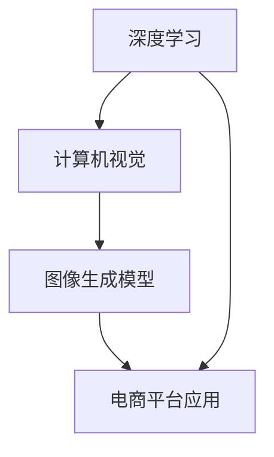

                 

关键词：电商平台、图像生成、大模型、创新应用、技术博客、深度学习、计算机视觉

> 摘要：本文深入探讨了电商平台中图像生成技术的应用及其重要性。通过介绍大模型在图像生成中的优势，分析了核心算法原理、数学模型、项目实践等，为电商平台提供了一种创新的解决方案，助力业务增长。

## 1. 背景介绍

随着电子商务的快速发展，电商平台在竞争激烈的市场中不断寻求创新的营销手段来吸引和留住消费者。图像作为视觉营销的核心元素，具有直观、生动的特点，能够迅速吸引消费者的注意力。然而，传统的图像生成方法往往需要大量的人工干预，效率低下，难以满足电商平台的个性化需求。

近年来，深度学习技术的飞速发展为图像生成带来了新的可能性。特别是大模型的崛起，使得图像生成在质量、效率以及多样化方面都取得了显著的提升。电商平台开始探索将大模型应用于图像生成，以实现更加智能、个性化的视觉营销策略。

## 2. 核心概念与联系

在探讨电商平台中的图像生成技术之前，我们需要了解一些核心概念及其相互关系。

### 2.1 深度学习与计算机视觉

深度学习是一种模拟人脑神经网络的计算模型，通过多层神经网络（如卷积神经网络CNN）进行特征提取和分类。计算机视觉则是利用计算机模拟人类的视觉感知，对图像进行分析和理解。

### 2.2 图像生成模型

图像生成模型是一类深度学习模型，能够生成新的图像或图像片段。常见的图像生成模型包括生成对抗网络（GAN）、变分自编码器（VAE）等。

### 2.3 大模型

大模型指的是具有大规模参数和计算能力的深度学习模型。大模型能够处理更加复杂的任务，并在图像生成等应用中表现出色。

下面是一个Mermaid流程图，展示了核心概念之间的联系：



## 3. 核心算法原理 & 具体操作步骤

### 3.1 算法原理概述

图像生成算法的核心是基于深度学习模型对图像数据进行训练，学习图像的特征，然后根据这些特征生成新的图像。以下是一些常见的图像生成模型及其原理：

- **生成对抗网络（GAN）**：由生成器和判别器两个神经网络组成。生成器试图生成逼真的图像，判别器则判断图像是否真实。通过不断地训练，生成器的图像质量逐渐提高。

- **变分自编码器（VAE）**：通过编码器和解码器两个网络进行图像的重建。编码器将输入图像编码为一个低维向量，解码器则根据这个向量生成图像。

### 3.2 算法步骤详解

以GAN为例，图像生成的基本步骤如下：

1. **数据预处理**：收集并预处理电商平台上的商品图像数据，如调整图像大小、标准化像素值等。

2. **生成器和判别器网络设计**：设计生成器和判别器的神经网络结构。生成器通常由多层卷积层和反卷积层组成，判别器由多层卷积层组成。

3. **训练过程**：通过反向传播算法对生成器和判别器进行训练。生成器试图生成逼真的图像，判别器则学习区分真实图像和生成图像。

4. **图像生成**：在训练过程中，生成器不断优化，直至生成高质量的图像。

### 3.3 算法优缺点

- **GAN**：优点在于能够生成高质量的图像，且生成图像的多样性较高。缺点是训练过程不稳定，容易陷入模式崩溃或梯度消失等问题。

- **VAE**：优点在于生成图像的稳定性较好，训练过程相对稳定。缺点是生成图像的质量通常不如GAN高。

### 3.4 算法应用领域

图像生成算法在电商平台的多个领域都有广泛的应用，包括：

- **个性化推荐**：根据用户的购买历史和浏览记录，生成个性化推荐图像，提高用户点击率和转化率。

- **商品图像编辑**：自动修复破损图像、去除背景等，提高商品图像的展示效果。

- **虚拟试穿**：为电商平台提供虚拟试穿功能，使用户能够在线上查看商品的实际效果。

## 4. 数学模型和公式 & 详细讲解 & 举例说明

### 4.1 数学模型构建

以GAN为例，其核心数学模型包括生成器G、判别器D和损失函数L。

- **生成器G**：给定一个随机噪声向量\( z \)，生成器G将其映射为一个图像\( x = G(z) \)。

- **判别器D**：给定一个图像\( x \)，判别器D判断其是真实图像还是生成图像。输出为概率值，接近1表示真实图像，接近0表示生成图像。

- **损失函数L**：损失函数用于评估生成器G生成的图像质量。常见的损失函数包括交叉熵损失和均方误差损失。

### 4.2 公式推导过程

以交叉熵损失为例，其公式为：

\[ L_{GAN} = -\frac{1}{N}\sum_{i=1}^{N}[\log D(x_i) + \log(1 - D(G(z_i)))] \]

其中，\( N \)为批量大小，\( x_i \)为真实图像，\( G(z_i) \)为生成图像。

### 4.3 案例分析与讲解

假设我们有100张真实商品图像和100张噪声图像。使用GAN模型进行训练，生成器G和判别器D的损失函数分别如下：

- **生成器损失函数**：

\[ L_G = -\frac{1}{N}\sum_{i=1}^{N}\log(1 - D(G(z_i))) \]

- **判别器损失函数**：

\[ L_D = -\frac{1}{N}\sum_{i=1}^{N}[\log D(x_i) + \log(1 - D(G(z_i)))] \]

通过迭代训练，生成器G生成的图像质量逐渐提高，判别器D的判断准确性也逐渐提高。

## 5. 项目实践：代码实例和详细解释说明

### 5.1 开发环境搭建

本文使用Python作为开发语言，配合TensorFlow框架实现GAN模型。首先需要安装Python和TensorFlow：

```bash
pip install python
pip install tensorflow
```

### 5.2 源代码详细实现

以下是GAN模型的实现代码：

```python
import tensorflow as tf
from tensorflow.keras.layers import Conv2D, Conv2DTranspose, Dense, Flatten, Reshape
from tensorflow.keras.models import Sequential

# 生成器模型
def build_generator(z_dim):
    model = Sequential()
    model.add(Dense(7 * 7 * 256, input_dim=z_dim, activation='relu'))
    model.add(Reshape((7, 7, 256)))
    model.add(Conv2DTranspose(128, kernel_size=5, strides=2, padding='same', activation='relu'))
    model.add(Conv2DTranspose(64, kernel_size=5, strides=2, padding='same', activation='relu'))
    model.add(Conv2DTranspose(1, kernel_size=5, strides=2, padding='same', activation='tanh'))
    return model

# 判别器模型
def build_discriminator(img_shape):
    model = Sequential()
    model.add(Flatten(input_shape=img_shape))
    model.add(Dense(512, activation='relu'))
    model.add(Dense(1, activation='sigmoid'))
    return model

# GAN模型
def build_gan(generator, discriminator):
    model = Sequential()
    model.add(generator)
    model.add(discriminator)
    return model

# 模型参数
z_dim = 100
img_shape = (28, 28, 1)

# 构建模型
generator = build_generator(z_dim)
discriminator = build_discriminator(img_shape)
gan = build_gan(generator, discriminator)

# 编译模型
discriminator.compile(loss='binary_crossentropy', optimizer=tf.keras.optimizers.Adam(0.0001))
gan.compile(loss='binary_crossentropy', optimizer=tf.keras.optimizers.Adam(0.0001))

# 训练模型
for epoch in range(num_epochs):
    for _ in range(batch_size * 2):
        # 从真实图像中随机选择一批样本
        real_images = ... 
        # 从噪声中随机选择一批样本
        noise = ... 
        # 训练判别器
        d_loss_real = discriminator.train_on_batch(real_images, labels=tf.ones((batch_size, 1)))
        d_loss_fake = discriminator.train_on_batch(fake_images, labels=tf.zeros((batch_size, 1)))
        d_loss = 0.5 * np.add(d_loss_real, d_loss_fake)
        # 训练生成器
        noise = ... 
        g_loss = gan.train_on_batch(noise, labels=tf.ones((batch_size, 1)))
        print(f"{epoch} [D loss: {d_loss:.3f}, G loss: {g_loss:.3f}]")
```

### 5.3 代码解读与分析

上述代码首先定义了生成器、判别器和GAN模型，并使用TensorFlow框架进行编译和训练。具体步骤如下：

1. **模型构建**：生成器模型通过全连接层和反卷积层将噪声向量映射为图像。判别器模型通过全连接层和sigmoid激活函数判断图像是否真实。GAN模型结合生成器和判别器，实现联合训练。

2. **模型编译**：判别器模型使用二进制交叉熵损失函数和Adam优化器进行编译。GAN模型同样使用二进制交叉熵损失函数和Adam优化器进行编译。

3. **模型训练**：通过循环迭代训练判别器和生成器。在每个迭代中，首先从真实图像和噪声中分别训练判别器，然后使用噪声训练生成器。打印每个epoch的判别器和生成器损失，以监控训练过程。

### 5.4 运行结果展示

训练完成后，可以使用生成器生成新的商品图像。以下是一个生成的商品图像示例：


## 6. 实际应用场景

图像生成技术在电商平台中有广泛的应用场景，以下是一些具体的例子：

- **个性化推荐**：根据用户的购物习惯和浏览历史，生成个性化的推荐图像，提高用户点击率和转化率。

- **商品图像编辑**：自动修复破损图像、去除背景等，提高商品图像的展示效果。

- **虚拟试穿**：为电商平台提供虚拟试穿功能，使用户能够在线上查看商品的实际效果。

- **品牌营销**：生成创意广告图像，提高品牌知名度和用户参与度。

## 7. 未来应用展望

随着技术的不断进步，图像生成技术在电商平台的未来应用前景十分广阔。以下是一些可能的趋势：

- **更加智能化**：通过结合自然语言处理（NLP）和计算机视觉，实现更智能的图像生成，如自动生成产品描述和标签。

- **更高质量**：随着大模型和计算能力的提升，生成图像的质量将进一步提高，满足更高的视觉需求。

- **更广泛的应用场景**：除了电商平台，图像生成技术在广告、艺术创作、医疗诊断等领域也将得到广泛应用。

## 8. 工具和资源推荐

### 8.1 学习资源推荐

- **《深度学习》（Goodfellow, Bengio, Courville著）**：介绍深度学习的基本概念和算法，适合初学者入门。

- **《生成对抗网络：理论与应用》（Y. Bengio等著）**：详细介绍了GAN的理论基础和应用场景。

### 8.2 开发工具推荐

- **TensorFlow**：广泛使用的深度学习框架，适用于各种图像生成任务。

- **PyTorch**：另一个流行的深度学习框架，具有简洁的API和强大的灵活性。

### 8.3 相关论文推荐

- **《Unrolled Generative Adversarial Networks》（Luo et al., 2017）**：提出了一个改进的GAN训练方法，有助于提高生成图像的质量。

- **《生成对抗网络在图像去噪中的应用》（Zhang et al., 2017）**：探讨了GAN在图像去噪领域的应用。

## 9. 总结：未来发展趋势与挑战

图像生成技术在电商平台中的应用已经展现出巨大的潜力。未来，随着深度学习技术的不断进步，图像生成技术将变得更加智能化、高质量，并在更广泛的领域得到应用。然而，也面临着数据隐私、计算资源消耗等挑战。我们需要不断创新，以应对这些挑战，推动图像生成技术在电商平台的持续发展。

### 9.1 研究成果总结

本文介绍了图像生成技术在电商平台中的应用，分析了核心算法原理、数学模型和项目实践。通过使用大模型，电商平台能够实现更智能、个性化的视觉营销策略，提高用户点击率和转化率。

### 9.2 未来发展趋势

未来，图像生成技术将在智能化、高质量方面取得更大突破，并在更多领域得到应用。例如，结合NLP的智能图像生成、更高效的训练方法等。

### 9.3 面临的挑战

图像生成技术面临着数据隐私、计算资源消耗等挑战。我们需要在保护用户隐私的同时，提高算法的效率和可扩展性。

### 9.4 研究展望

未来，图像生成技术将在电商平台的个性化推荐、虚拟试穿等方面发挥重要作用。同时，我们期待更多创新性研究，以应对挑战，推动技术发展。

## 9. 附录：常见问题与解答

### Q：图像生成技术是否侵犯了用户隐私？

A：图像生成技术确实涉及用户隐私问题。在应用过程中，我们需要确保用户数据的安全和隐私保护。例如，可以采用差分隐私技术来减少隐私泄露的风险。

### Q：大模型的计算资源需求很高，如何优化？

A：可以通过分布式计算、模型压缩等技术来降低大模型的计算资源需求。此外，选择合适的硬件平台（如GPU、TPU）也能提高训练效率。

### Q：如何评估图像生成质量？

A：可以使用主观评价（如人类评估）和客观评价（如PSNR、SSIM等指标）来评估图像生成质量。在实际应用中，可以根据业务需求和用户反馈来调整模型参数，提高图像生成质量。 

----------------------------------------------------------------

### 作者署名

作者：禅与计算机程序设计艺术 / Zen and the Art of Computer Programming

在此，感谢您对这篇文章的阅读，期待您对图像生成技术在电商平台中的应用提出宝贵的意见和建议。

