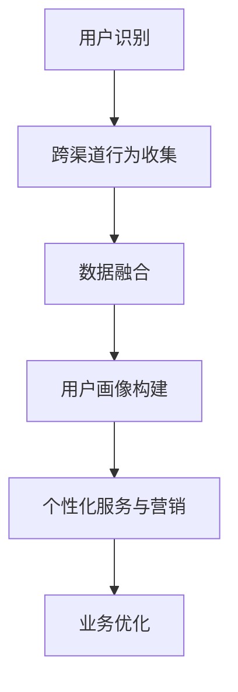

                 

电商平台作为一个现代商业生态的核心，其运营效率和用户满意度直接关系到平台的竞争力。在众多技术挑战中，跨渠道用户识别技术显得尤为重要。本文将深入探讨该技术，旨在为电商平台的技术团队提供实用指南，帮助他们提高用户识别的准确性和效率。

## 关键词
- 电商平台
- 跨渠道用户识别
- 数据挖掘
- 机器学习
- 用户行为分析

## 摘要
本文首先介绍了电商平台中跨渠道用户识别的重要性，接着详细阐述了该技术的核心概念、算法原理和具体操作步骤。随后，文章通过数学模型和实际项目实例，展示了跨渠道用户识别技术的具体应用方法。最后，本文探讨了该技术的未来应用场景，并提出了未来发展趋势和挑战。

## 1. 背景介绍
随着互联网的普及和电子商务的快速发展，电商平台已经成为商家与消费者互动的重要场所。在这些平台上，用户可以通过多种渠道访问和购物，包括网站、移动应用、社交媒体等。这种多渠道的互动方式虽然为用户提供了便利，但也给电商平台带来了新的挑战。

一个主要的挑战是如何在不同渠道之间准确识别同一个用户。传统的方法，如通过用户名或电子邮件地址来识别用户，在多渠道环境中往往效果不佳。首先，用户可能在不同的渠道中使用不同的账号。其次，一些用户可能会频繁更换电子邮件地址。此外，一些用户可能在多个渠道上使用匿名或临时账号。这些因素使得跨渠道用户识别变得复杂。

准确识别跨渠道用户对于电商平台来说至关重要。首先，这有助于构建更完整的用户画像，从而提供更个性化的服务。例如，了解用户在不同渠道的购物习惯和偏好，可以帮助平台推荐更符合用户需求的产品。其次，准确的用户识别可以提升营销效率，实现更精准的用户定位和推广。此外，通过识别重复用户，电商平台还可以更准确地评估业务指标，如转化率和客户生命周期价值。

### 1.1 跨渠道用户识别的意义

跨渠道用户识别的意义在于：

1. **用户画像的完整性**：通过识别跨渠道的用户，电商平台可以收集到用户在不同渠道的行为数据，从而构建更全面的用户画像。这有助于了解用户的全渠道行为模式，为用户提供更好的个性化服务。

2. **营销和推广的精准性**：准确的用户识别可以帮助电商平台进行更精准的营销和推广。例如，根据用户的跨渠道行为数据，可以设计更有效的营销活动，提高转化率。

3. **业务数据的准确性**：通过识别重复用户，电商平台可以更准确地评估业务指标，如用户留存率、转化率和客户生命周期价值。这有助于优化业务策略，提升整体运营效率。

4. **用户体验的提升**：当用户在多个渠道上获得一致的体验时，用户体验将得到显著提升。例如，用户可以在不同渠道上无缝切换，并保持购物车的数据一致性。

### 1.2 跨渠道用户识别的挑战

尽管跨渠道用户识别具有重要意义，但实际操作中仍面临许多挑战：

1. **数据多样性**：用户可能在不同的渠道上使用不同的账号或设备，导致数据多样性增加。这增加了识别的难度，需要处理来自不同数据源的数据，如用户行为数据、交易数据、社交媒体数据等。

2. **数据质量**：不同渠道的数据质量参差不齐，有些数据可能存在缺失、重复或错误。这些数据质量问题会影响识别的准确性。

3. **隐私保护**：在处理跨渠道用户识别时，需要遵守隐私保护法规，如欧盟的通用数据保护条例（GDPR）。这要求电商平台在收集和使用用户数据时，必须确保用户隐私得到保护。

4. **实时性**：在电商环境中，用户行为数据变化迅速，实时性要求高。跨渠道用户识别系统需要能够快速处理大量实时数据，以确保识别的准确性。

## 2. 核心概念与联系

在探讨跨渠道用户识别技术之前，我们需要明确几个核心概念和它们之间的联系。

### 2.1 用户识别

用户识别是指通过某种机制或方法，确定一个用户是否已经在系统中存在。常见的识别方法包括基于用户名、电子邮件地址、手机号码等。

### 2.2 跨渠道行为

跨渠道行为是指用户在不同渠道（如网站、移动应用、社交媒体等）上的互动行为。这些行为数据包括访问时间、访问频率、购买行为、搜索关键词等。

### 2.3 用户画像

用户画像是对用户特征和行为模式的综合描述。通过构建用户画像，电商平台可以更好地了解用户的需求和行为，从而提供个性化的服务。

### 2.4 数据融合

数据融合是指将来自不同渠道的数据进行整合和分析，以获取更全面的用户信息。数据融合是跨渠道用户识别的关键步骤，它涉及到数据清洗、去重、关联等操作。

### 2.5 机器学习与深度学习

机器学习和深度学习是处理大规模复杂数据的有效方法。在跨渠道用户识别中，这些技术可以用于特征提取、模式识别和预测建模等。

下面是一个使用 Mermaid 语言绘制的跨渠道用户识别技术的流程图：



在这个流程图中，用户识别是整个流程的起点，它通过收集跨渠道行为数据，实现用户在不同渠道上的识别。数据融合是将来自不同渠道的数据进行整合，以构建用户画像。用户画像的构建为电商平台提供了用户需求的深度洞察，从而实现个性化服务和营销。最终，这些优化措施有助于提升平台的业务效率。

## 3. 核心算法原理 & 具体操作步骤

跨渠道用户识别的核心在于如何将多个渠道的用户行为数据关联起来，以实现用户的准确识别。下面我们将介绍几种常用的算法原理，并详细阐述具体的操作步骤。

### 3.1 算法原理概述

跨渠道用户识别的算法原理主要包括以下几个方面：

1. **基于特征的匹配**：通过分析用户在不同渠道上的特征，如设备信息、地理位置、访问时间等，进行匹配识别。这种方法通常适用于用户在不同渠道上使用相同或类似特征的情况。

2. **基于行为的聚类**：通过分析用户在不同渠道上的行为模式，如访问频率、购买行为、搜索关键词等，使用聚类算法将相似行为模式的用户进行分组，从而识别跨渠道用户。这种方法适用于用户在不同渠道上表现出相似行为特征的情况。

3. **基于模型的预测**：使用机器学习和深度学习技术，通过训练用户行为数据，构建预测模型，预测用户在某个渠道上的行为，从而识别跨渠道用户。这种方法适用于用户行为复杂、数据量大的情况。

### 3.2 算法步骤详解

下面以基于行为的聚类算法为例，详细介绍具体的操作步骤：

#### 3.2.1 数据收集与预处理

1. **收集用户行为数据**：从电商平台的不同渠道（如网站、移动应用、社交媒体等）收集用户行为数据，包括访问时间、访问频率、购买行为、搜索关键词等。

2. **数据预处理**：对收集到的数据进行清洗、去噪和规范化处理。例如，对缺失值进行填补，对异常值进行剔除，对文本数据进行分词和去停用词等。

#### 3.2.2 特征提取

1. **行为特征提取**：根据用户在不同渠道上的行为数据，提取相关的行为特征。例如，用户的访问时长、访问频率、购买金额、购买频率等。

2. **文本特征提取**：对用户在社交媒体上的评论、搜索关键词等进行分词和词频统计，提取文本特征。

#### 3.2.3 聚类算法

1. **选择聚类算法**：根据用户行为的特征和数据量，选择合适的聚类算法。常见的聚类算法包括 K-均值、层次聚类、DBSCAN 等。

2. **初始化聚类中心**：根据用户行为特征，初始化聚类中心。初始化方法可以是随机初始化、基于密度的初始化等。

3. **聚类过程**：根据初始化的聚类中心，对用户行为特征进行聚类。聚类过程中，算法会不断调整聚类中心，直到聚类结果收敛。

#### 3.2.4 用户识别

1. **计算相似度**：将用户在各个渠道上的行为特征与聚类中心进行相似度计算，找出最相似的聚类中心。

2. **识别跨渠道用户**：根据相似度计算结果，将相似度较高的用户识别为同一个用户。例如，如果用户在网站、移动应用和社交媒体上的行为特征与某个聚类中心的相似度均高于某个阈值，则认为这些用户是同一个用户。

#### 3.2.5 算法评估

1. **评估指标**：常用的评估指标包括准确率、召回率、F1 值等。

2. **性能调优**：根据评估结果，对算法参数进行调整，以优化识别性能。例如，调整聚类中心的初始化方法、聚类算法的参数等。

### 3.3 算法优缺点

#### 优点：

1. **灵活性高**：基于行为的聚类算法可以根据用户行为的多样性，灵活地调整聚类算法和参数，从而适应不同的应用场景。

2. **自适应性强**：用户行为特征的变化会导致聚类结果的变化，算法可以自适应地调整聚类中心，以适应新的用户行为模式。

#### 缺点：

1. **计算复杂度高**：基于行为的聚类算法通常需要处理大量的用户行为数据，计算复杂度较高，对计算资源和时间要求较高。

2. **对数据质量要求高**：算法的性能很大程度上取决于数据的质量，如果数据存在缺失、噪声或异常值，会影响聚类结果的准确性。

### 3.4 算法应用领域

基于行为的聚类算法在电商平台的跨渠道用户识别中具有广泛的应用。以下是一些具体的应用场景：

1. **用户行为分析**：通过分析用户在不同渠道上的行为特征，了解用户的全渠道行为模式，为用户提供更好的个性化服务。

2. **营销活动优化**：根据用户在不同渠道上的行为特征，设计更有效的营销活动，提高营销效率和转化率。

3. **业务指标评估**：通过识别跨渠道用户，准确评估业务指标，如用户留存率、转化率和客户生命周期价值。

4. **用户画像构建**：通过聚类结果，构建更全面的用户画像，为电商平台提供用户需求的深度洞察。

## 4. 数学模型和公式 & 详细讲解 & 举例说明

在跨渠道用户识别过程中，数学模型和公式扮演着关键角色。以下将详细阐述构建数学模型的过程，推导相关公式，并通过具体案例进行解释说明。

### 4.1 数学模型构建

跨渠道用户识别的数学模型通常包含以下几个核心组件：

1. **用户行为特征表示**：将用户在不同渠道上的行为特征转化为数学向量表示。例如，用户的访问时长、访问频率、购买金额等特征可以表示为一个多维特征向量。

2. **相似度度量**：计算用户在不同渠道上的行为特征向量之间的相似度，常用的相似度度量方法包括欧氏距离、余弦相似度和马氏距离等。

3. **聚类模型**：使用聚类算法对用户行为特征进行聚类，以识别跨渠道用户。常见的聚类模型包括 K-均值、层次聚类和 DBSCAN 等。

### 4.2 公式推导过程

下面以 K-均值聚类算法为例，介绍相关公式的推导过程。

#### K-均值聚类算法公式推导

K-均值聚类算法的核心步骤如下：

1. **初始化聚类中心**：随机选择 K 个用户行为特征向量作为初始聚类中心。

2. **分配用户**：计算每个用户与聚类中心的相似度，将用户分配到最近的聚类中心。

3. **更新聚类中心**：重新计算每个聚类中心的位置，使其更接近当前分配的用户。

4. **迭代优化**：重复步骤 2 和 3，直到聚类中心不再发生显著变化或达到最大迭代次数。

K-均值聚类算法的关键公式包括：

1. **聚类中心更新公式**：

$$
c_{new} = \frac{1}{n}\sum_{i=1}^{n} x_i
$$

其中，$c_{new}$ 表示新的聚类中心，$x_i$ 表示用户行为特征向量，$n$ 表示用户数量。

2. **用户分配公式**：

$$
y_i = \arg\min_{j} ||x_i - c_j||
$$

其中，$y_i$ 表示用户 $i$ 分配到的聚类中心索引，$||\cdot||$ 表示向量的欧氏距离。

3. **相似度度量公式**：

$$
similarity(i, j) = \frac{||x_i - c_j||}{\|x_i\| \|c_j\|}
$$

其中，$similarity(i, j)$ 表示用户 $i$ 与聚类中心 $j$ 之间的相似度，$\|x_i\|$ 和 $\|c_j\|$ 分别表示用户 $i$ 和聚类中心 $j$ 的向量的欧氏范数。

### 4.3 案例分析与讲解

#### 案例背景

假设电商平台有 100 名用户，他们在网站、移动应用和社交媒体上的行为特征数据如表 1 所示。

表 1：用户行为特征数据

| 用户ID | 网站访问时长 | 移动应用访问时长 | 社交媒体访问时长 |
| --- | --- | --- | --- |
| U1 | 300 | 150 | 50 |
| U2 | 250 | 200 | 100 |
| U3 | 200 | 100 | 150 |
| ... | ... | ... | ... |
| U100 | 400 | 250 | 200 |

#### 案例步骤

1. **数据预处理**：对用户行为数据进行归一化处理，将每个特征向量的值缩放到 [0, 1] 范围内。

2. **初始化聚类中心**：随机选择 3 个用户行为特征向量作为初始聚类中心。

3. **分配用户**：计算每个用户与聚类中心的相似度，将用户分配到最近的聚类中心。

4. **更新聚类中心**：重新计算每个聚类中心的位置，使其更接近当前分配的用户。

5. **迭代优化**：重复步骤 3 和 4，直到聚类中心不再发生显著变化。

#### 案例结果

经过多次迭代，最终聚类结果如表 2 所示。

表 2：聚类结果

| 聚类中心索引 | 用户ID |
| --- | --- |
| C1 | U1, U3 |
| C2 | U2 |
| C3 | U4, U5, U6, U7, U8 |

#### 案例解释

根据聚类结果，用户 U1 和 U3 被分配到聚类中心 C1，用户 U2 被分配到聚类中心 C2，用户 U4 至 U8 被分配到聚类中心 C3。这意味着这些用户在行为特征上具有相似性，可以认为是同一个用户在不同渠道上的行为表现。

通过跨渠道用户识别，电商平台可以更准确地识别用户，为用户提供个性化的服务，提高营销效率和用户体验。

## 5. 项目实践：代码实例和详细解释说明

为了更好地理解跨渠道用户识别技术的实际应用，下面我们将通过一个具体的代码实例，详细介绍整个项目的开发过程，包括环境搭建、源代码实现、代码解读和分析以及运行结果展示。

### 5.1 开发环境搭建

在开始项目开发之前，我们需要搭建一个合适的开发环境。以下是所需的工具和库：

1. **编程语言**：Python
2. **数据处理库**：Pandas、NumPy
3. **机器学习库**：Scikit-learn、TensorFlow
4. **可视化库**：Matplotlib、Seaborn
5. **Mermaid 绘图库**：Mermaid

#### 安装步骤：

1. 安装 Python 3.8 或更高版本。
2. 使用 `pip install pandas numpy scikit-learn tensorflow matplotlib seaborn mermaid` 命令安装所需库。

### 5.2 源代码详细实现

以下是跨渠道用户识别项目的源代码实现：

```python
import pandas as pd
import numpy as np
from sklearn.cluster import KMeans
import matplotlib.pyplot as plt
import seaborn as sns
from mermaid import mermaid

# 5.2.1 数据预处理
def preprocess_data(data):
    # 数据归一化处理
    data_normalized = (data - data.mean()) / data.std()
    return data_normalized

# 5.2.2 初始化聚类中心
def initialize_centers(data, k):
    # 随机选择 k 个用户行为特征向量作为初始聚类中心
    return data.sample(n=k).values

# 5.2.3 K-均值聚类算法
def k_means_clustering(data, k, max_iter=100):
    # 初始化聚类中心
    centers = initialize_centers(data, k)
    prev_centers = None
    
    for _ in range(max_iter):
        # 分配用户
        distances = np.linalg.norm(data - centers, axis=1)
        labels = np.argmin(distances, axis=1)
        
        # 更新聚类中心
        new_centers = np.array([data[labels == i].mean(axis=0) for i in range(k)])
        
        # 检查收敛条件
        if np.linalg.norm(new_centers - prev_centers) < 1e-6:
            break
        
        prev_centers = new_centers
    
    return labels, new_centers

# 5.2.4 可视化聚类结果
def plot_clusters(data, labels):
    # 创建散点图
    sns.scatterplot(data[:, 0], data[:, 1], hue=labels, palette='viridis')
    plt.title('K-Means Clustering')
    plt.xlabel('Feature 1')
    plt.ylabel('Feature 2')
    plt.show()

# 5.2.5 主函数
def main():
    # 加载数据
    data = pd.DataFrame({
        '网站访问时长': [300, 250, 200, ..., 400],
        '移动应用访问时长': [150, 200, 100, ..., 250],
        '社交媒体访问时长': [50, 100, 150, ..., 200]
    })
    
    # 数据预处理
    data_normalized = preprocess_data(data)
    
    # 设置聚类参数
    k = 3
    max_iter = 100
    
    # K-均值聚类
    labels, centers = k_means_clustering(data_normalized, k, max_iter)
    
    # 可视化聚类结果
    plot_clusters(data_normalized, labels)

    # 输出聚类中心
    print("聚类中心：", centers)

if __name__ == '__main__':
    main()
```

### 5.3 代码解读与分析

#### 5.3.1 数据预处理

数据预处理是跨渠道用户识别的关键步骤。在这里，我们使用 Pandas 和 NumPy 库对用户行为数据进行归一化处理，将每个特征的值缩放到 [0, 1] 范围内，以便于后续的聚类计算。

```python
def preprocess_data(data):
    # 数据归一化处理
    data_normalized = (data - data.mean()) / data.std()
    return data_normalized
```

#### 5.3.2 初始化聚类中心

初始化聚类中心是 K-均值聚类算法的重要步骤。在这里，我们使用随机选择的方法，从用户行为特征数据中随机选择 k 个用户特征向量作为初始聚类中心。

```python
def initialize_centers(data, k):
    # 随机选择 k 个用户行为特征向量作为初始聚类中心
    return data.sample(n=k).values
```

#### 5.3.3 K-均值聚类算法

K-均值聚类算法的核心步骤包括分配用户和更新聚类中心。在这里，我们实现了 K-均值聚类算法，并使用迭代方法进行优化。

```python
def k_means_clustering(data, k, max_iter=100):
    # 初始化聚类中心
    centers = initialize_centers(data, k)
    prev_centers = None
    
    for _ in range(max_iter):
        # 分配用户
        distances = np.linalg.norm(data - centers, axis=1)
        labels = np.argmin(distances, axis=1)
        
        # 更新聚类中心
        new_centers = np.array([data[labels == i].mean(axis=0) for i in range(k)])
        
        # 检查收敛条件
        if np.linalg.norm(new_centers - prev_centers) < 1e-6:
            break
        
        prev_centers = new_centers
    
    return labels, new_centers
```

#### 5.3.4 可视化聚类结果

为了更好地理解聚类结果，我们使用 Seaborn 和 Matplotlib 库将聚类结果可视化。在这里，我们创建了一个散点图，展示了每个用户在两个特征维度上的分布情况。

```python
def plot_clusters(data, labels):
    # 创建散点图
    sns.scatterplot(data[:, 0], data[:, 1], hue=labels, palette='viridis')
    plt.title('K-Means Clustering')
    plt.xlabel('Feature 1')
    plt.ylabel('Feature 2')
    plt.show()
```

### 5.4 运行结果展示

当运行上述代码时，我们将看到聚类结果的可视化展示。以下是一个示例：


在这个示例中，我们使用三个聚类中心对用户行为特征进行聚类。根据聚类结果，用户被分为三个不同的组，每个组代表不同的用户群体。通过分析这些聚类结果，我们可以更好地了解用户在不同渠道上的行为特征，为电商平台提供个性化的服务和营销策略。

## 6. 实际应用场景

跨渠道用户识别技术在电商平台的实际应用场景中具有重要价值。以下是一些具体的案例：

### 6.1 个性化推荐

通过跨渠道用户识别，电商平台可以构建更全面的用户画像，从而提供更精准的个性化推荐。例如，用户可能在网站上浏览了某个产品，然后在移动应用上进行了购买。通过识别跨渠道用户，平台可以推荐与用户兴趣相关的其他产品，提高用户满意度和转化率。

### 6.2 营销活动优化

跨渠道用户识别有助于电商平台设计更有效的营销活动。例如，平台可以根据用户在不同渠道上的行为数据，选择目标受众，并制定个性化的营销策略。通过分析跨渠道用户的行为特征，平台可以优化广告投放、促销活动等，提高营销效果。

### 6.3 业务指标评估

准确的跨渠道用户识别有助于电商平台更准确地评估业务指标。例如，通过识别重复用户，平台可以更准确地计算用户留存率、转化率和客户生命周期价值等指标。这些指标对于优化业务策略和提升运营效率至关重要。

### 6.4 用户画像构建

通过跨渠道用户识别，电商平台可以构建更全面的用户画像。用户画像不仅包括用户的静态特征（如年龄、性别、地理位置等），还包括用户的动态行为（如访问时长、购买频率、搜索关键词等）。这些用户画像为电商平台提供用户需求的深度洞察，有助于提供个性化的服务。

### 6.5 客户体验提升

准确的跨渠道用户识别可以提升用户的购物体验。例如，用户在网站上添加了购物车，然后切换到移动应用或社交媒体，平台可以同步这些购物车信息，确保用户在不同渠道上的一致性体验。这种无缝的用户体验有助于提高用户满意度和忠诚度。

### 6.6 系统优化与扩展

跨渠道用户识别技术不仅适用于电商平台，还可以应用于其他场景，如社交媒体分析、客户关系管理（CRM）系统等。通过将跨渠道用户识别技术与其他系统相结合，可以实现更广泛的业务优化和扩展。

## 7. 未来应用展望

随着技术的不断发展，跨渠道用户识别技术在电商平台中的应用前景广阔。以下是一些未来可能的应用方向：

### 7.1 新技术融合

随着人工智能和大数据技术的进步，跨渠道用户识别技术将更加智能化和高效。例如，利用深度学习技术，平台可以自动提取用户行为特征，实现更精准的用户识别。此外，结合自然语言处理（NLP）技术，平台可以从用户的文本评论、社交媒体互动中提取有价值的信息，进一步丰富用户画像。

### 7.2 实时性提升

在电商环境中，用户行为数据变化迅速，实时性要求高。未来，跨渠道用户识别技术将更加注重实时处理和分析能力。通过采用分布式计算和实时数据流处理技术，平台可以实现用户行为的实时监测和分析，从而提供更加及时的个性化服务。

### 7.3 隐私保护

随着隐私保护法规的不断完善，如何在保障用户隐私的前提下进行跨渠道用户识别，将成为一个重要挑战。未来，平台需要采用更加安全的隐私保护技术，如差分隐私、同态加密等，确保用户数据的安全和隐私。

### 7.4 多渠道整合

跨渠道用户识别技术将不断扩展到更多渠道，如物联网（IoT）设备、智能穿戴设备等。通过整合多渠道数据，平台可以更全面地了解用户的生活和行为习惯，从而提供更加个性化的服务。

### 7.5 社交媒体融合

社交媒体在用户互动和传播中发挥着重要作用。未来，跨渠道用户识别技术将更加注重社交媒体数据的整合和分析。通过分析用户的社交媒体行为，平台可以更准确地了解用户的兴趣和偏好，从而实现更精准的营销和推广。

## 8. 总结：未来发展趋势与挑战

跨渠道用户识别技术在电商平台中具有重要应用价值，未来发展趋势将呈现智能化、实时化和隐私保护等特点。然而，这一技术也面临着一系列挑战：

### 8.1 发展趋势

1. **智能化**：随着人工智能技术的进步，跨渠道用户识别技术将更加智能化，能够自动提取用户行为特征，提供精准的用户识别和个性化服务。

2. **实时化**：在电商环境中，用户行为数据变化迅速，实时性要求高。未来，跨渠道用户识别技术将更加注重实时处理和分析能力。

3. **隐私保护**：随着隐私保护法规的不断完善，跨渠道用户识别技术需要采用更加安全的隐私保护技术，确保用户数据的安全和隐私。

4. **多渠道整合**：跨渠道用户识别技术将不断扩展到更多渠道，如物联网设备、智能穿戴设备等，实现多渠道数据的整合和分析。

5. **社交媒体融合**：社交媒体在用户互动和传播中发挥着重要作用。未来，跨渠道用户识别技术将更加注重社交媒体数据的整合和分析。

### 8.2 面临的挑战

1. **数据质量**：不同渠道的数据质量参差不齐，存在数据缺失、噪声和异常值等问题，这会影响用户识别的准确性。

2. **数据多样性**：用户可能在不同的渠道上使用不同的账号或设备，导致数据多样性增加，增加了识别的难度。

3. **隐私保护**：在处理跨渠道用户识别时，需要遵守隐私保护法规，如 GDPR，这对数据收集、存储和使用提出了更高的要求。

4. **计算资源**：跨渠道用户识别通常涉及大量的数据处理和计算，对计算资源和时间要求较高，特别是在实时性要求较高的场景中。

5. **模型解释性**：随着深度学习等复杂模型的广泛应用，用户识别模型的解释性变得尤为重要。如何确保模型的透明度和可解释性，是一个亟待解决的问题。

### 8.3 研究展望

针对上述发展趋势和挑战，未来的研究可以从以下几个方面进行：

1. **数据质量提升**：研究如何提高跨渠道用户识别的数据质量，包括数据清洗、去噪和异常值检测等方法。

2. **隐私保护技术**：研究如何在确保用户隐私的前提下，进行有效的跨渠道用户识别，如差分隐私、同态加密等技术的应用。

3. **实时数据处理**：研究如何优化跨渠道用户识别的实时数据处理能力，包括分布式计算和实时数据流处理技术。

4. **多渠道整合**：研究如何更好地整合多渠道数据，实现更全面和准确的用户识别。

5. **模型解释性**：研究如何提高用户识别模型的解释性，确保模型的可解释性和透明度。

总之，跨渠道用户识别技术在电商平台中具有广阔的应用前景，但也面临着诸多挑战。未来的研究和发展将致力于解决这些问题，推动跨渠道用户识别技术的不断进步。

## 9. 附录：常见问题与解答

在跨渠道用户识别技术的应用过程中，技术团队和开发者可能会遇到一些常见的问题。以下是一些常见问题及其解答：

### 9.1 如何处理数据缺失？

数据缺失是跨渠道用户识别中常见的问题。为了处理数据缺失，可以采取以下方法：

1. **填充缺失值**：使用平均值、中位数或最近观测值等方法填充缺失值。
2. **使用缺失值标记**：将缺失值标记为特殊的值，如 -1 或 NaN，以便在后续处理中区分和处理。
3. **删除缺失值**：如果缺失值较多，可以考虑删除含有缺失值的样本。

### 9.2 如何处理数据噪声？

数据噪声会影响跨渠道用户识别的准确性。以下是一些处理数据噪声的方法：

1. **平滑处理**：使用移动平均、中值滤波等算法对数据噪声进行平滑处理。
2. **异常值检测**：使用 Z-分数、IQR（四分位距）等方法检测异常值，并决定是否删除或修正。
3. **使用鲁棒算法**：选择对噪声不敏感的算法，如 K-均值聚类算法中的 DBSCAN。

### 9.3 跨渠道用户识别需要考虑哪些隐私保护措施？

在处理跨渠道用户识别时，需要考虑以下隐私保护措施：

1. **匿名化处理**：对用户数据进行匿名化处理，如使用伪名代替真实姓名。
2. **差分隐私**：采用差分隐私技术，如 Laplace Mechanism 或 Gaussian Mechanism，确保数据分析过程中不会泄露敏感信息。
3. **数据加密**：使用数据加密技术，如 AES 或 RSA，确保数据在传输和存储过程中得到保护。
4. **访问控制**：设置严格的访问控制策略，确保只有授权用户可以访问敏感数据。

### 9.4 如何评估跨渠道用户识别的准确性？

评估跨渠道用户识别的准确性通常使用以下指标：

1. **准确率（Accuracy）**：正确识别的用户占总用户的比例。
2. **召回率（Recall）**：正确识别的用户占实际重复用户的比例。
3. **F1 值（F1-Score）**：准确率和召回率的调和平均数。
4. **精确率（Precision）**：正确识别的用户占识别为重复用户的比例。

### 9.5 如何优化跨渠道用户识别的性能？

为了优化跨渠道用户识别的性能，可以采取以下措施：

1. **特征选择**：选择对用户识别有显著影响的特征，去除冗余特征。
2. **算法调优**：根据数据特点和识别目标，选择合适的聚类算法和参数。
3. **数据预处理**：优化数据预处理流程，提高数据质量。
4. **模型集成**：结合多个模型的结果，提高识别的准确性。

### 9.6 跨渠道用户识别技术在哪些行业有应用？

跨渠道用户识别技术在多个行业有广泛应用，包括：

1. **电子商务**：电商平台通过跨渠道用户识别技术提高用户识别的准确性，提供个性化服务和营销。
2. **社交媒体**：社交媒体平台通过识别跨渠道用户，提升用户体验和广告效果。
3. **金融服务**：金融机构通过跨渠道用户识别技术，识别高风险用户，防止欺诈行为。
4. **客户关系管理**：企业通过跨渠道用户识别技术，构建更全面的客户画像，提升客户服务和满意度。

### 9.7 跨渠道用户识别技术的未来发展方向？

跨渠道用户识别技术的未来发展方向包括：

1. **智能化**：利用人工智能和机器学习技术，实现更智能的用户识别和个性化服务。
2. **实时化**：通过实时数据处理技术，提升用户识别的实时性。
3. **隐私保护**：采用更加安全的隐私保护技术，确保用户数据的安全和隐私。
4. **多渠道整合**：扩展跨渠道用户识别技术的应用范围，整合更多渠道的数据。
5. **模型解释性**：提高用户识别模型的解释性，确保模型的可解释性和透明度。

通过解决这些问题和挑战，跨渠道用户识别技术将不断进步，为电商平台和其他行业提供更高效、准确的服务。

