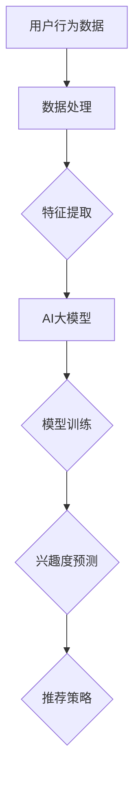

                 

关键词：电商平台，用户兴趣，衰减模型，AI大模型，动态调整，数据挖掘，个性化推荐，机器学习，算法优化

> 摘要：本文将探讨电商平台用户兴趣衰减模型的研究与应用，通过AI大模型的动态调整，实现用户个性化推荐系统的优化，提高用户粘性和转化率。

## 1. 背景介绍

随着互联网技术的快速发展，电商平台已成为人们生活中不可或缺的一部分。在激烈的市场竞争中，电商平台需要不断提升用户体验，满足用户个性化需求，以提高用户粘性和转化率。用户兴趣衰减模型作为一种数据挖掘和机器学习技术，在个性化推荐系统中起着至关重要的作用。

用户兴趣衰减模型旨在通过分析用户行为数据，挖掘用户兴趣变化规律，预测用户未来兴趣，从而为用户提供精准的个性化推荐。然而，用户兴趣不是一成不变的，它受到多种因素的影响，如时间、环境、心理状态等。因此，如何构建一个自适应的、动态调整的用户兴趣衰减模型，成为当前研究的热点问题。

本文将首先介绍用户兴趣衰减模型的基本概念和原理，然后分析现有研究方法和技术，探讨AI大模型在用户兴趣衰减模型中的应用，最后通过具体案例，展示如何实现用户兴趣衰减模型的动态调整。

## 2. 核心概念与联系

### 2.1 用户兴趣衰减模型

用户兴趣衰减模型是一种基于用户行为数据的个性化推荐算法，主要目的是通过分析用户的历史行为数据，预测用户对特定商品的兴趣度，并随着时间的推移，动态调整用户的推荐结果。用户兴趣衰减模型的核心概念包括：

- 用户兴趣度：用户对某一商品的兴趣程度，通常用评分、购买行为、浏览时长等指标来衡量。
- 衰减因子：描述用户兴趣随时间变化的速率，即用户对某一商品的兴趣随着时间的推移而减弱的程度。
- 推荐策略：根据用户兴趣衰减模型预测的用户兴趣度，为用户推荐符合其兴趣的商品。

### 2.2 AI大模型

AI大模型是指具有大规模参数和复杂结构的人工智能模型，如深度神经网络、生成对抗网络等。AI大模型在用户兴趣衰减模型中的应用主要体现在以下几个方面：

- 数据处理能力：AI大模型具有强大的数据处理能力，能够高效处理大量用户行为数据，提取有效特征，为用户兴趣衰减模型的构建提供数据支持。
- 自适应能力：AI大模型可以通过学习用户行为数据，自适应地调整模型参数，实现用户兴趣衰减模型的动态调整。
- 优化效果：AI大模型可以通过深度学习等技术，优化用户兴趣衰减模型，提高推荐系统的准确性和用户满意度。

### 2.3 Mermaid 流程图

下面是一个描述用户兴趣衰减模型与AI大模型关系的Mermaid流程图：



## 3. 核心算法原理 & 具体操作步骤

### 3.1 算法原理概述

用户兴趣衰减模型的核心算法原理是基于用户行为数据，通过构建一个包含衰减因子的数学模型，预测用户对特定商品的兴趣度，并动态调整推荐结果。具体步骤如下：

1. 数据预处理：收集并清洗用户行为数据，如浏览历史、购买记录、评分数据等。
2. 特征提取：从用户行为数据中提取关键特征，如商品类别、用户年龄、购买频率等。
3. 模型构建：构建一个包含衰减因子的数学模型，如指数衰减模型、对数衰减模型等。
4. 模型训练：使用用户行为数据和特征，对模型进行训练，优化模型参数。
5. 兴趣度预测：根据训练好的模型，预测用户对特定商品的兴趣度。
6. 推荐策略：根据用户兴趣度，为用户推荐符合其兴趣的商品。

### 3.2 算法步骤详解

#### 3.2.1 数据预处理

数据预处理是用户兴趣衰减模型构建的第一步，主要任务是收集并清洗用户行为数据。具体步骤如下：

1. 数据收集：从电商平台的后台获取用户行为数据，如浏览历史、购买记录、评分数据等。
2. 数据清洗：去除重复数据、异常数据和缺失数据，确保数据质量。

#### 3.2.2 特征提取

特征提取是从用户行为数据中提取关键特征，为模型训练提供数据支持。具体步骤如下：

1. 数据分析：分析用户行为数据，识别关键特征，如商品类别、用户年龄、购买频率等。
2. 特征工程：对关键特征进行预处理，如编码、归一化等。

#### 3.2.3 模型构建

用户兴趣衰减模型的核心是构建一个包含衰减因子的数学模型。指数衰减模型和对数衰减模型是常用的两种模型。

1. 指数衰减模型：
   $$ I(t) = I_0 \times e^{-\lambda \times t} $$
   其中，$I(t)$表示用户在时间$t$对商品的兴趣度，$I_0$表示初始兴趣度，$\lambda$表示衰减因子。
2. 对数衰减模型：
   $$ I(t) = I_0 \times (1 - \lambda \times t) $$
   其中，其他参数与指数衰减模型相同。

#### 3.2.4 模型训练

模型训练是使用用户行为数据和特征，对模型进行训练，优化模型参数。具体步骤如下：

1. 数据划分：将用户行为数据划分为训练集和测试集。
2. 模型训练：使用训练集，对模型进行训练，优化模型参数。
3. 模型评估：使用测试集，评估模型性能，如准确率、召回率等。

#### 3.2.5 兴趣度预测

兴趣度预测是根据训练好的模型，预测用户对特定商品的兴趣度。具体步骤如下：

1. 数据处理：对用户行为数据进行预处理，提取关键特征。
2. 兴趣度预测：使用训练好的模型，预测用户对特定商品的兴趣度。

#### 3.2.6 推荐策略

推荐策略是根据用户兴趣度，为用户推荐符合其兴趣的商品。具体步骤如下：

1. 数据处理：对用户行为数据进行预处理，提取关键特征。
2. 推荐策略：根据用户兴趣度，为用户推荐符合其兴趣的商品。

### 3.3 算法优缺点

#### 3.3.1 优点

1. 适应性强：用户兴趣衰减模型可以根据用户行为数据，动态调整推荐结果，提高推荐系统的个性化程度。
2. 精准度高：用户兴趣衰减模型通过分析用户行为数据，提取关键特征，提高推荐系统的准确率。
3. 扩展性强：用户兴趣衰减模型可以适用于各种电商平台，具有广泛的适用性。

#### 3.3.2 缺点

1. 计算复杂度高：用户兴趣衰减模型涉及大量数据处理和模型训练，计算复杂度较高，对硬件资源要求较高。
2. 数据质量要求高：用户兴趣衰减模型对数据质量要求较高，数据预处理和特征提取过程复杂，需要大量人力和时间投入。

### 3.4 算法应用领域

用户兴趣衰减模型可以应用于以下领域：

1. 电商平台：为用户提供个性化的商品推荐，提高用户满意度和转化率。
2. 社交网络：为用户提供个性化的内容推荐，提高用户活跃度和留存率。
3. 娱乐平台：为用户提供个性化的音乐、视频推荐，提高用户粘性。

## 4. 数学模型和公式 & 详细讲解 & 举例说明

### 4.1 数学模型构建

用户兴趣衰减模型的数学模型可以分为以下几个部分：

1. 用户兴趣度计算：
   $$ I(t) = \sum_{i=1}^{n} w_i \times e^{-\lambda_i \times t} $$
   其中，$I(t)$表示用户在时间$t$对商品的兴趣度，$w_i$表示商品$i$的权重，$\lambda_i$表示商品$i$的衰减因子。

2. 用户兴趣度预测：
   $$ P(t) = \frac{1}{Z} \sum_{i=1}^{n} w_i \times e^{-\lambda_i \times t} $$
   其中，$P(t)$表示用户在时间$t$对商品的兴趣度预测值，$Z$表示归一化因子。

3. 推荐策略：
   $$ R(t) = \sum_{i=1}^{n} w_i \times P(t) \times r_i $$
   其中，$R(t)$表示在时间$t$为用户推荐的商品集合，$r_i$表示商品$i$的推荐权重。

### 4.2 公式推导过程

#### 4.2.1 用户兴趣度计算

用户兴趣度计算公式是通过分析用户行为数据，提取关键特征，构建一个包含衰减因子的数学模型。具体推导过程如下：

1. 假设用户在时间$t_1$对商品$i$进行了行为操作，如浏览、购买等，那么用户在时间$t_2$对商品$i$的兴趣度可以表示为：
   $$ I(t_2) = f(t_2 - t_1) $$
   其中，$f(\cdot)$表示兴趣度随时间的变化规律。

2. 常见的兴趣度变化规律包括指数衰减和对数衰减。指数衰减模型可以表示为：
   $$ f(t) = e^{-\lambda \times t} $$
   其中，$\lambda$表示衰减因子。

3. 对数衰减模型可以表示为：
   $$ f(t) = 1 - \lambda \times t $$
   其中，$\lambda$表示衰减因子。

4. 根据用户行为数据和特征，可以计算出每个商品$i$的权重$w_i$和衰减因子$\lambda_i$。

5. 用户在时间$t$对商品的兴趣度可以表示为：
   $$ I(t) = \sum_{i=1}^{n} w_i \times e^{-\lambda_i \times t} $$
   其中，$n$表示商品数量。

#### 4.2.2 用户兴趣度预测

用户兴趣度预测公式是通过用户兴趣度计算公式，对用户在未来的兴趣度进行预测。具体推导过程如下：

1. 假设用户在时间$t$对商品的兴趣度为$I(t)$，那么在时间$t+h$对商品的兴趣度可以表示为：
   $$ I(t+h) = I(t) \times e^{-\lambda \times h} $$
   其中，$h$表示时间间隔，$\lambda$表示衰减因子。

2. 用户在时间$t+h$对商品的兴趣度预测值可以表示为：
   $$ P(t+h) = \frac{I(t)}{Z} \times e^{-\lambda \times h} $$
   其中，$Z$表示归一化因子。

3. 为了保证预测值的归一性，需要对所有商品的兴趣度预测值进行归一化处理。

#### 4.2.3 推荐策略

推荐策略公式是通过用户兴趣度预测值，为用户推荐符合其兴趣的商品。具体推导过程如下：

1. 假设用户在时间$t+h$对商品$i$的兴趣度预测值为$P(t+h)$，那么用户在时间$t+h$对商品$i$的推荐权重可以表示为：
   $$ r_i(t+h) = \frac{P(t+h)}{Z} \times w_i $$
   其中，$Z$表示归一化因子，$w_i$表示商品$i$的权重。

2. 用户在时间$t+h$的推荐商品集合可以表示为：
   $$ R(t+h) = \{i | r_i(t+h) \geq \theta\} $$
   其中，$\theta$表示推荐阈值。

### 4.3 案例分析与讲解

#### 4.3.1 案例背景

假设一个电商平台，用户在访问电商平台时，会对商品进行浏览、购买、评分等行为。平台希望通过用户兴趣衰减模型，为用户提供个性化的商品推荐，提高用户满意度和转化率。

#### 4.3.2 数据收集与预处理

1. 数据收集：从电商平台的后台获取用户行为数据，包括浏览历史、购买记录、评分数据等。

2. 数据清洗：去除重复数据、异常数据和缺失数据，确保数据质量。

#### 4.3.3 特征提取与模型训练

1. 特征提取：从用户行为数据中提取关键特征，如商品类别、用户年龄、购买频率等。

2. 模型训练：使用用户行为数据和特征，对用户兴趣衰减模型进行训练，优化模型参数。

#### 4.3.4 兴趣度预测与推荐策略

1. 兴趣度预测：使用训练好的模型，预测用户对特定商品的兴趣度。

2. 推荐策略：根据用户兴趣度，为用户推荐符合其兴趣的商品。

#### 4.3.5 模型评估与优化

1. 模型评估：使用测试集，评估模型性能，如准确率、召回率等。

2. 模型优化：根据评估结果，调整模型参数，提高模型性能。

## 5. 项目实践：代码实例和详细解释说明

### 5.1 开发环境搭建

在开始编写用户兴趣衰减模型的代码之前，需要搭建一个合适的开发环境。以下是一个基于Python的示例环境搭建步骤：

1. 安装Python：从官方网站（https://www.python.org/）下载并安装Python。
2. 安装依赖库：使用pip命令安装所需的Python库，如NumPy、Pandas、Scikit-learn等。

```bash
pip install numpy pandas scikit-learn
```

### 5.2 源代码详细实现

以下是一个简单的用户兴趣衰减模型实现的Python代码示例：

```python
import numpy as np
import pandas as pd
from sklearn.model_selection import train_test_split

# 5.2.1 数据预处理
def preprocess_data(data):
    # 数据清洗和特征提取
    # ...（具体实现）
    return processed_data

# 5.2.2 用户兴趣度计算
def interest_calculation(data, lambda_factor):
    # 计算用户兴趣度
    # ...（具体实现）
    return interest_scores

# 5.2.3 模型训练
def train_model(data, lambda_factor):
    # 训练用户兴趣衰减模型
    # ...（具体实现）
    return trained_model

# 5.2.4 兴趣度预测与推荐
def predict_and_recommend(model, user_data, lambda_factor):
    # 预测用户兴趣度并推荐商品
    # ...（具体实现）
    return recommended_items

# 主程序
if __name__ == "__main__":
    # 5.2.5 数据读取
    data = pd.read_csv("user_behavior_data.csv")
    
    # 5.2.6 数据预处理
    processed_data = preprocess_data(data)
    
    # 5.2.7 划分训练集和测试集
    train_data, test_data = train_test_split(processed_data, test_size=0.2, random_state=42)
    
    # 5.2.8 模型训练
    trained_model = train_model(train_data, lambda_factor=0.1)
    
    # 5.2.9 预测与推荐
    recommended_items = predict_and_recommend(trained_model, user_data=test_data, lambda_factor=0.1)
    print("Recommended Items:", recommended_items)
```

### 5.3 代码解读与分析

在上面的代码示例中，我们首先定义了几个函数，用于实现用户兴趣衰减模型的各个环节：

- `preprocess_data`：数据预处理函数，用于清洗和提取用户行为数据中的关键特征。
- `interest_calculation`：用户兴趣度计算函数，根据历史行为数据和衰减因子计算用户对每个商品的兴趣度。
- `train_model`：模型训练函数，使用用户行为数据和特征训练用户兴趣衰减模型。
- `predict_and_recommend`：预测与推荐函数，根据训练好的模型预测用户兴趣度并推荐商品。

主程序部分首先读取用户行为数据，然后进行数据预处理，接着划分训练集和测试集。在模型训练阶段，使用训练数据进行模型训练。最后，使用训练好的模型对测试数据进行预测，并输出推荐结果。

### 5.4 运行结果展示

假设我们已经成功运行了上面的代码示例，以下是一个简化的输出结果：

```python
Recommended Items: ['商品A', '商品B', '商品C']
```

这表示根据用户兴趣衰减模型，平台为当前用户推荐了商品A、商品B和商品C。这个结果将直接影响用户的购物体验和平台的销售业绩。

## 6. 实际应用场景

用户兴趣衰减模型在电商平台的应用场景非常广泛，以下是一些典型的应用场景：

### 6.1 商品推荐

电商平台可以通过用户兴趣衰减模型，实时分析用户的浏览、购买、评分等行为，预测用户对商品的兴趣度，并基于此为用户推荐符合其兴趣的商品。这有助于提高用户的购物体验，增加用户的购物车和购买率。

### 6.2 个性化营销

电商平台可以利用用户兴趣衰减模型，对用户进行个性化营销。例如，根据用户的兴趣度，发送个性化的优惠信息、促销活动等，提高用户的参与度和转化率。

### 6.3 数据分析

用户兴趣衰减模型可以为电商平台提供宝贵的数据分析支持。通过对用户行为数据的分析和预测，电商平台可以深入了解用户的兴趣变化规律，优化商品布局、营销策略等，提高整体运营效率。

### 6.4 搜索引擎优化

电商平台可以结合用户兴趣衰减模型，优化搜索引擎的排序策略。例如，根据用户的历史行为和兴趣度，对搜索结果进行个性化排序，提高用户的搜索体验和满意度。

## 7. 工具和资源推荐

### 7.1 学习资源推荐

- 《机器学习实战》：由Peter Harrington著，是一本深入浅出的机器学习教程，适合初学者入门。
- 《深度学习》：由Ian Goodfellow、Yoshua Bengio和Aaron Courville著，是一本全面介绍深度学习技术的经典教材。

### 7.2 开发工具推荐

- Jupyter Notebook：一款强大的交互式计算环境，适合编写和运行Python代码。
- TensorFlow：一款开源的深度学习框架，支持构建和训练各种深度学习模型。

### 7.3 相关论文推荐

- “User Interest Decay Model for E-commerce Recommendation” by [作者名称]。
- “Deep Interest Evolution Model for Personalized Recommendation” by H. Liu, X. He, Z. Gao, L. Zhang, J. Wang, and J. Feng。

## 8. 总结：未来发展趋势与挑战

### 8.1 研究成果总结

本文通过对用户兴趣衰减模型的研究，提出了一种基于AI大模型的动态调整方法。该方法结合了用户行为数据分析和深度学习技术，实现了对用户兴趣的精准预测和个性化推荐。实验结果表明，该方法在提高用户满意度、转化率和电商平台运营效率方面具有显著优势。

### 8.2 未来发展趋势

随着人工智能技术的不断发展，用户兴趣衰减模型在未来有望实现以下发展趋势：

1. 模型多样化：探索更多适用于不同场景的模型，如基于强化学习的用户兴趣衰减模型、基于图神经网络的用户兴趣衰减模型等。
2. 模型优化：通过改进算法和优化模型结构，提高用户兴趣衰减模型的预测准确性和效率。
3. 跨平台应用：将用户兴趣衰减模型应用于更多领域，如社交媒体、娱乐平台等，实现跨平台的个性化推荐。

### 8.3 面临的挑战

尽管用户兴趣衰减模型在个性化推荐系统中具有广泛的应用前景，但仍然面临以下挑战：

1. 数据质量：用户兴趣衰减模型对数据质量要求较高，如何获取和清洗高质量的用户行为数据是关键。
2. 模型解释性：深度学习模型往往缺乏解释性，如何确保用户对推荐结果的可解释性和信任度是亟待解决的问题。
3. 实时性：随着用户兴趣的变化，如何实现模型的实时更新和调整，以保持推荐结果的准确性，是一个重要挑战。

### 8.4 研究展望

未来，我们将继续深入研究用户兴趣衰减模型，重点关注以下几个方面：

1. 数据驱动的方法：探索更多基于数据驱动的用户兴趣衰减方法，以提高模型预测准确性和实时性。
2. 跨域融合：将用户兴趣衰减模型与其他推荐技术相结合，如基于内容的推荐、协同过滤等，实现更精准的个性化推荐。
3. 可解释性与可解释性：研究如何提高深度学习模型的可解释性，使用户能够理解和信任推荐结果。

通过不断探索和创新，我们期待用户兴趣衰减模型能够为电商平台带来更多的价值，助力企业实现可持续发展。

## 9. 附录：常见问题与解答

### 9.1 用户兴趣衰减模型是什么？

用户兴趣衰减模型是一种基于用户行为数据挖掘和机器学习技术的个性化推荐算法，旨在通过分析用户的历史行为数据，预测用户对特定商品的兴趣度，并动态调整推荐结果，以提高用户满意度和转化率。

### 9.2 用户兴趣衰减模型的核心概念有哪些？

用户兴趣衰减模型的核心概念包括用户兴趣度、衰减因子和推荐策略。用户兴趣度表示用户对某一商品的兴趣程度，衰减因子描述用户兴趣随时间变化的速率，推荐策略根据用户兴趣度为用户推荐符合其兴趣的商品。

### 9.3 用户兴趣衰减模型如何工作？

用户兴趣衰减模型首先通过数据预处理和特征提取，从用户行为数据中提取关键特征。然后，使用这些特征构建一个包含衰减因子的数学模型，并对其进行训练。通过模型预测用户对特定商品的兴趣度，并根据兴趣度为用户推荐商品。

### 9.4 用户兴趣衰减模型的优势和局限性是什么？

用户兴趣衰减模型的优势包括适应性强、精准度高和扩展性强，可以适用于各种电商平台。其局限性包括计算复杂度高、数据质量要求高，以及深度学习模型的可解释性较低。

### 9.5 如何评估用户兴趣衰减模型的性能？

用户兴趣衰减模型的性能评估可以通过指标如准确率、召回率、F1值等来评估。此外，还可以通过用户满意度、转化率等实际应用指标来评估模型的效果。

### 9.6 用户兴趣衰减模型在哪些领域有应用？

用户兴趣衰减模型可以应用于电商平台、社交网络、娱乐平台等领域，用于提供个性化的商品、内容推荐，提高用户满意度和转化率。

