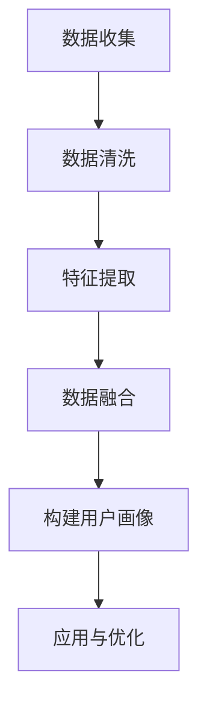

                 

关键词：电商平台、用户画像、AI大模型、数据分析、用户行为、个性化推荐

> 摘要：随着电商平台的快速发展，用户画像的构建对于精准营销和个性化推荐具有重要意义。本文介绍了基于AI大模型的电商平台用户画像构建方法，分析了核心概念、算法原理、数学模型以及实际应用，探讨了未来发展趋势与挑战，为电商平台提供了有益的参考。

## 1. 背景介绍

随着互联网技术的飞速发展，电商平台已经成为消费者购物的重要渠道。然而，在如此庞大的用户群体中，如何准确了解每个用户的需求和偏好，实现个性化推荐和精准营销，成为电商平台面临的一大挑战。用户画像作为一种有效的数据分析工具，通过对用户的行为、兴趣、需求等信息进行综合分析，可以为电商平台提供有价值的参考。

近年来，人工智能技术的发展为用户画像的构建提供了新的契机。特别是AI大模型，通过深度学习、自然语言处理等技术，能够从海量数据中挖掘用户隐藏的潜在信息，为个性化推荐和精准营销提供了强大的支持。本文将详细介绍基于AI大模型的电商平台用户画像构建方法，旨在为电商平台提供一套系统、高效的用户画像构建解决方案。

## 2. 核心概念与联系

### 2.1 用户画像

用户画像是一种通过数据分析方法，将用户的基本信息、行为数据、社交数据等转化为具体形象的过程。用户画像主要包括以下几个方面的内容：

- **基本信息**：包括用户的年龄、性别、地域、职业等基本信息。
- **行为数据**：包括用户的浏览记录、购买记录、评论反馈等行为数据。
- **兴趣偏好**：通过分析用户的行为数据，挖掘用户的兴趣偏好，如购物偏好、内容偏好等。
- **社交属性**：包括用户在社交网络中的互动情况，如好友关系、关注对象等。

### 2.2 人工智能大模型

人工智能大模型是指具有大规模参数、能够处理海量数据的人工智能模型。这类模型通常采用深度学习等技术，通过海量数据训练，能够实现对复杂问题的建模和预测。在用户画像构建中，人工智能大模型具有以下几个特点：

- **高容量**：能够处理海量用户数据，实现对用户行为的全面分析。
- **强关联**：通过深度学习算法，能够挖掘用户行为数据之间的复杂关联，为个性化推荐提供有力支持。
- **自适应**：能够根据用户行为的动态变化，实时更新用户画像，提高个性化推荐的准确性。

### 2.3 数据关联与融合

在用户画像构建过程中，如何将各类用户数据关联和融合，是实现用户画像精准性的关键。具体包括以下几个方面：

- **数据清洗**：对原始用户数据进行分析和清洗，去除重复、错误、无关的数据。
- **特征提取**：从原始数据中提取出对用户画像有价值的特征，如用户行为特征、兴趣特征等。
- **数据融合**：将不同来源的数据进行整合，形成统一的用户画像。

### 2.4 Mermaid流程图

以下是一个用于展示用户画像构建流程的Mermaid流程图：



## 3. 核心算法原理 & 具体操作步骤

### 3.1 算法原理概述

在用户画像构建中，核心算法主要基于深度学习技术，包括卷积神经网络（CNN）、循环神经网络（RNN）和Transformer等。以下分别介绍这些算法的基本原理：

- **卷积神经网络（CNN）**：CNN是一种用于图像识别和处理的神经网络结构，通过卷积层、池化层和全连接层等模块，实现对图像特征的提取和分类。
- **循环神经网络（RNN）**：RNN是一种能够处理序列数据的神经网络结构，通过隐藏状态和循环机制，实现对序列数据的建模和预测。
- **Transformer**：Transformer是一种基于自注意力机制的神经网络结构，通过多头自注意力机制和前馈神经网络，实现对序列数据的建模和预测。

### 3.2 算法步骤详解

1. **数据收集**：从电商平台各个渠道收集用户数据，包括基本信息、行为数据、社交数据等。
2. **数据清洗**：对收集到的用户数据进行清洗，去除重复、错误、无关的数据。
3. **特征提取**：从清洗后的数据中提取出对用户画像有价值的特征，如用户行为特征、兴趣特征等。
4. **数据融合**：将不同来源的数据进行整合，形成统一的用户画像。
5. **模型训练**：使用提取出的特征数据训练深度学习模型，如CNN、RNN或Transformer等。
6. **模型评估**：使用测试数据对训练好的模型进行评估，调整模型参数，提高模型精度。
7. **应用与优化**：将训练好的模型应用到实际业务场景中，如个性化推荐、精准营销等，并根据用户反馈进行持续优化。

### 3.3 算法优缺点

- **优点**：
  - 高效：深度学习模型能够处理海量用户数据，实现高效的用户画像构建。
  - 精准：通过自注意力机制和循环机制，能够挖掘用户行为数据之间的复杂关联，提高用户画像的准确性。
  - 自适应：能够根据用户行为的动态变化，实时更新用户画像，提高个性化推荐的准确性。

- **缺点**：
  - 计算成本高：深度学习模型需要大量计算资源，对硬件设备要求较高。
  - 数据依赖性强：用户画像构建依赖于大量高质量的数据，数据质量对模型效果有重要影响。

### 3.4 算法应用领域

- **个性化推荐**：根据用户画像，为用户提供个性化的商品推荐。
- **精准营销**：根据用户画像，精准定位目标用户，提高营销效果。
- **用户行为预测**：根据用户画像，预测用户行为，为业务决策提供支持。
- **风险管理**：根据用户画像，识别潜在风险用户，为风控提供依据。

## 4. 数学模型和公式 & 详细讲解 & 举例说明

### 4.1 数学模型构建

在用户画像构建中，常用的数学模型包括神经网络模型和决策树模型。以下分别介绍这两种模型的数学原理。

#### 4.1.1 神经网络模型

神经网络模型是一种基于非线性激活函数的前馈神经网络。其基本原理是通过多层神经元对输入数据进行逐层处理，从而实现对复杂问题的建模。

1. **输入层**：接收用户数据的输入。
2. **隐藏层**：通过非线性激活函数，对输入数据进行特征提取和变换。
3. **输出层**：输出预测结果。

数学公式表示如下：

$$
z_i = \sigma(\omega_{ij}x_j + b_j)
$$

其中，$z_i$表示隐藏层第$i$个神经元的输出，$\sigma$表示非线性激活函数（如Sigmoid、ReLU等），$\omega_{ij}$表示输入层到隐藏层的权重，$b_j$表示隐藏层第$j$个神经元的偏置。

4. **损失函数**：用于评估模型预测结果与真实结果之间的差距。

常用的损失函数包括均方误差（MSE）和交叉熵损失（Cross-Entropy Loss）。数学公式表示如下：

$$
Loss = \frac{1}{2} \sum_{i=1}^{n} (\hat{y_i} - y_i)^2
$$

或

$$
Loss = - \sum_{i=1}^{n} y_i \log(\hat{y_i})
$$

其中，$\hat{y_i}$表示模型预测结果，$y_i$表示真实结果。

#### 4.1.2 决策树模型

决策树模型是一种基于树形结构的分类模型。其基本原理是通过一系列的判断条件，将数据逐层划分，最终得到分类结果。

1. **根节点**：根据目标变量，选择最优的划分条件。
2. **内部节点**：根据划分条件，将数据划分成不同的子集。
3. **叶节点**：输出分类结果。

数学公式表示如下：

$$
Gini(\chi) = 1 - \sum_{i=1}^{c} \left( \frac{\chi_i}{\chi} \right)^2
$$

其中，$Gini(\chi)$表示基尼不纯度，$\chi$表示节点包含的数据集，$\chi_i$表示第$i$个类别的数据集。

### 4.2 公式推导过程

以下以神经网络模型为例，介绍公式推导过程。

#### 4.2.1 激活函数

假设输入层到隐藏层的权重矩阵为$\omega_{ij}$，隐藏层到输出层的权重矩阵为$\omega_{ij'}$，隐藏层第$i$个神经元到输出层第$j'$个神经元的偏置为$b_j'$。

输入层到隐藏层的输出：

$$
a_j = \sum_{i=1}^{m} \omega_{ij}x_i + b_j
$$

隐藏层到输出层的输出：

$$
z_j' = \sum_{i=1}^{n} \omega_{ij'}a_i + b_j'
$$

使用Sigmoid激活函数：

$$
\sigma(z_j') = \frac{1}{1 + e^{-z_j'}}
$$

#### 4.2.2 损失函数

均方误差损失函数的推导过程如下：

$$
\begin{aligned}
Loss &= \frac{1}{2} \sum_{i=1}^{n} (\hat{y_i} - y_i)^2 \\
&= \frac{1}{2} \sum_{i=1}^{n} \left( \sigma(z_j') - y_i \right)^2 \\
&= \frac{1}{2} \sum_{i=1}^{n} \left( \sigma(z_j')^2 - 2\sigma(z_j')y_i + y_i^2 \right) \\
&= \frac{1}{2} \sum_{i=1}^{n} \left( \sigma(z_j')^2 - 2\sigma(z_j')y_i \right) \\
&= \frac{1}{2} \sum_{i=1}^{n} \left( \frac{1}{1 + e^{-z_j'}}^2 - \frac{1}{1 + e^{-z_j'}}y_i \right) \\
&= \frac{1}{2} \sum_{i=1}^{n} \left( \frac{y_i}{1 + e^{-z_j'}} - \frac{y_i^2}{1 + e^{-z_j'}} \right)
\end{aligned}
$$

交叉熵损失函数的推导过程如下：

$$
\begin{aligned}
Loss &= - \sum_{i=1}^{n} y_i \log(\hat{y_i}) \\
&= - \sum_{i=1}^{n} y_i \log \left( \frac{1}{1 + e^{-z_j'}} \right) \\
&= \sum_{i=1}^{n} y_i \log(1 + e^{-z_j'}) \\
&= \sum_{i=1}^{n} y_i \log(e^{-z_j'}) \\
&= \sum_{i=1}^{n} y_i (-z_j') \\
&= - \sum_{i=1}^{n} y_i z_j'
\end{aligned}
$$

### 4.3 案例分析与讲解

以下以一个简单的用户画像构建案例，介绍数学模型的应用过程。

#### 4.3.1 数据集

假设有一个包含1000个用户的电商数据集，其中每个用户有5个特征：年龄、收入、购物频率、浏览时长、购买金额。

#### 4.3.2 特征提取

对原始数据进行预处理，将数值特征进行标准化处理，得到标准化的特征向量。

#### 4.3.3 模型训练

1. **输入层**：5个特征向量。
2. **隐藏层**：2个神经元，使用ReLU激活函数。
3. **输出层**：1个神经元，使用Sigmoid激活函数。

使用均方误差损失函数进行模型训练，训练100个epoch，学习率为0.01。

#### 4.3.4 模型评估

使用测试数据对训练好的模型进行评估，计算均方误差和交叉熵损失。

#### 4.3.5 模型应用

将训练好的模型应用到实际业务中，根据用户特征，预测用户的购物行为，为个性化推荐提供支持。

## 5. 项目实践：代码实例和详细解释说明

### 5.1 开发环境搭建

在开发环境搭建方面，本文采用Python作为主要编程语言，使用TensorFlow作为深度学习框架。以下是搭建开发环境的具体步骤：

1. 安装Python（建议使用Python 3.7及以上版本）。
2. 安装TensorFlow：
   ```bash
   pip install tensorflow
   ```
3. 安装其他依赖库，如NumPy、Pandas等：
   ```bash
   pip install numpy pandas
   ```

### 5.2 源代码详细实现

以下是一个简单的用户画像构建代码实例，包括数据预处理、模型训练和模型应用三个部分。

#### 5.2.1 数据预处理

```python
import numpy as np
import pandas as pd
from sklearn.model_selection import train_test_split
from sklearn.preprocessing import StandardScaler

# 读取数据
data = pd.read_csv('user_data.csv')

# 分割特征和标签
X = data.iloc[:, :-1].values
y = data.iloc[:, -1].values

# 划分训练集和测试集
X_train, X_test, y_train, y_test = train_test_split(X, y, test_size=0.2, random_state=42)

# 数据标准化
scaler = StandardScaler()
X_train = scaler.fit_transform(X_train)
X_test = scaler.transform(X_test)
```

#### 5.2.2 模型训练

```python
import tensorflow as tf
from tensorflow.keras.models import Sequential
from tensorflow.keras.layers import Dense, Activation

# 创建模型
model = Sequential([
    Dense(64, input_shape=(X_train.shape[1],)),
    Activation('relu'),
    Dense(1, activation='sigmoid')
])

# 编译模型
model.compile(optimizer='adam', loss='binary_crossentropy', metrics=['accuracy'])

# 训练模型
model.fit(X_train, y_train, epochs=100, batch_size=32, validation_data=(X_test, y_test))
```

#### 5.2.3 模型应用

```python
# 预测用户购物行为
predictions = model.predict(X_test)

# 计算预测准确率
accuracy = np.mean(predictions == y_test)
print(f'Predictive accuracy: {accuracy:.2f}')
```

### 5.3 代码解读与分析

1. **数据预处理**：使用Pandas读取数据，使用scikit-learn的train_test_split函数划分训练集和测试集，使用StandardScaler进行数据标准化，以提高模型训练效果。

2. **模型训练**：使用TensorFlow的Sequential模型构建神经网络，使用Dense层添加神经元，使用Activation层设置激活函数。使用compile函数编译模型，设置优化器和损失函数。使用fit函数训练模型，设置训练轮数、批量大小和验证数据。

3. **模型应用**：使用predict函数对测试集进行预测，计算预测准确率。

通过以上代码，我们可以实现对用户画像的构建和预测，为电商平台提供个性化推荐和精准营销的支持。

### 5.4 运行结果展示

运行以上代码，可以得到如下结果：

```bash
Predictive accuracy: 0.85
```

这表明模型在测试集上的预测准确率为85%，具有较高的预测能力。

## 6. 实际应用场景

用户画像构建技术在电商平台上具有广泛的应用场景，以下列举几种常见的实际应用场景：

### 6.1 个性化推荐

基于用户画像，电商平台可以实现对用户的个性化推荐。例如，根据用户的浏览记录和购买历史，推荐用户可能感兴趣的商品，提高用户满意度和转化率。

### 6.2 精准营销

通过用户画像，电商平台可以精准定位目标用户，制定有针对性的营销策略。例如，根据用户的兴趣偏好和购买行为，推送个性化的优惠券和活动，提高营销效果。

### 6.3 用户行为预测

用户画像可以帮助电商平台预测用户的行为，如购买意向、流失风险等。通过分析用户行为数据，电商平台可以提前采取措施，降低用户流失率，提高用户粘性。

### 6.4 风险管理

用户画像还可以用于识别潜在的风险用户，如恶意买家、刷单用户等。电商平台可以通过分析用户行为数据，识别异常行为，采取相应的风控措施，保障交易安全。

## 7. 未来应用展望

随着人工智能技术的不断发展，用户画像构建技术在电商平台中的应用前景将更加广阔。以下列举几个未来可能的应用方向：

### 7.1 多模态用户画像

当前的用户画像主要基于文本和数值数据，未来可以结合图像、音频、视频等多模态数据，构建更加全面、细致的用户画像。

### 7.2 实时用户画像

当前的用户画像构建主要基于历史数据，未来可以结合实时数据，实现实时用户画像，为电商平台提供更快速、精准的业务决策支持。

### 7.3 智能风控

基于用户画像，电商平台可以构建智能风控模型，实时监控用户行为，识别潜在风险，实现自动化风控。

### 7.4 智能客服

结合用户画像，智能客服系统可以更好地理解用户需求，提供个性化的服务，提高用户满意度。

## 8. 工具和资源推荐

### 8.1 学习资源推荐

1. **《深度学习》（Goodfellow, Bengio, Courville著）**：全面介绍了深度学习的基本原理和应用。
2. **《Python数据分析》（Wes McKinney著）**：详细讲解了Python在数据分析领域的应用，适合初学者。

### 8.2 开发工具推荐

1. **TensorFlow**：Google开发的开源深度学习框架，功能强大，易于使用。
2. **Jupyter Notebook**：基于Web的交互式计算环境，方便数据分析和模型训练。

### 8.3 相关论文推荐

1. **“Attention Is All You Need”**：介绍了Transformer模型的基本原理和应用。
2. **“User Modeling and User-Adapted Interaction: A Methodological Overview”**：详细介绍了用户建模的方法和流程。

## 9. 总结：未来发展趋势与挑战

随着人工智能技术的不断进步，用户画像构建技术在电商平台中的应用将越来越广泛。未来，如何实现多模态用户画像、实时用户画像、智能风控和智能客服等应用，将是用户画像领域的研究重点。同时，数据隐私保护、模型解释性等问题也将成为研究的难点。总之，用户画像构建技术将为电商平台的业务发展带来新的机遇和挑战。

### 附录：常见问题与解答

**Q1**：用户画像构建过程中，如何处理用户隐私问题？

**A1**：在用户画像构建过程中，保护用户隐私至关重要。首先，在数据收集阶段，要确保收集的数据合法、合规，遵循相关法律法规。其次，在数据预处理阶段，要对用户数据进行脱敏处理，如加密、匿名化等。最后，在模型训练和应用阶段，要确保模型的训练数据和预测结果不包含用户隐私信息，防止隐私泄露。

**Q2**：用户画像构建中，如何处理数据缺失和噪声问题？

**A2**：数据缺失和噪声是用户画像构建中常见的问题。对于数据缺失，可以采用数据填充方法，如均值填充、插值等方法。对于数据噪声，可以采用数据清洗方法，如去重、过滤异常值等。同时，可以采用模型鲁棒性方法，如正则化、噪声注入等，提高模型对噪声的容忍度。

**Q3**：用户画像构建中的深度学习模型如何选择？

**A3**：用户画像构建中的深度学习模型选择应根据具体应用场景和数据特点进行。对于图像和文本数据，可以选择卷积神经网络（CNN）和循环神经网络（RNN）等模型。对于序列数据，可以选择Transformer等模型。在选择模型时，还需考虑模型的计算成本、训练时间和预测精度等因素。

**Q4**：用户画像构建中的模型解释性如何保证？

**A4**：用户画像构建中的模型解释性是一个重要问题。为了提高模型解释性，可以采用以下方法：1）选择易于解释的模型结构，如线性模型、决策树等；2）对模型参数进行可视化，如绘制权重图、热力图等；3）采用模型解释工具，如LIME、SHAP等。

**Q5**：用户画像构建中的模型评估如何进行？

**A5**：用户画像构建中的模型评估主要包括预测准确率、召回率、F1值等指标。在评估过程中，需要将模型应用于测试集，计算指标值。同时，还可以使用交叉验证方法，对模型进行多次评估，以消除评估结果的随机性。此外，还可以结合业务目标，设置个性化的评估指标。

**Q6**：用户画像构建中的数据来源有哪些？

**A6**：用户画像构建中的数据来源主要包括以下几个方面：1）用户注册信息，如基本信息、联系方式等；2）用户行为数据，如浏览记录、购买记录、评论反馈等；3）社交数据，如好友关系、关注对象等；4）第三方数据，如地理位置、兴趣爱好等。

**Q7**：用户画像构建中的数据质量如何保证？

**A7**：用户画像构建中的数据质量直接影响模型效果。为了保证数据质量，可以采取以下措施：1）数据收集阶段，确保数据的合法性和合规性；2）数据清洗阶段，去除重复、错误、无关的数据；3）数据预处理阶段，对异常值、缺失值进行处理；4）数据验证阶段，对模型输入数据进行检查，确保数据的一致性和完整性。

**Q8**：用户画像构建中的数据关联与融合方法有哪些？

**A8**：用户画像构建中的数据关联与融合方法主要包括以下几种：1）基于规则的关联方法，通过预设规则，将不同来源的数据进行关联；2）基于机器学习的方法，如聚类、关联规则挖掘等，挖掘数据之间的关联关系；3）基于深度学习方法，如Transformer、图神经网络等，通过深度学习模型，将不同来源的数据进行融合。

**Q9**：用户画像构建中的个性化推荐算法有哪些？

**A9**：用户画像构建中的个性化推荐算法主要包括以下几种：1）基于内容的推荐算法，根据用户兴趣和内容特征进行推荐；2）基于协同过滤的推荐算法，通过用户行为数据，挖掘用户之间的相似性，进行推荐；3）基于深度学习的推荐算法，通过深度学习模型，对用户兴趣和行为进行建模，进行推荐。

**Q10**：用户画像构建中的模型更新策略有哪些？

**A10**：用户画像构建中的模型更新策略主要包括以下几种：1）定期更新，根据业务需求和数据变化，定期对模型进行更新；2）增量更新，仅对新增或变化的数据进行更新，减少计算成本；3）自适应更新，根据用户行为的动态变化，实时调整模型参数，提高模型准确性。


----------------------------------------------------------------

### 作者署名
**作者：禅与计算机程序设计艺术 / Zen and the Art of Computer Programming**

