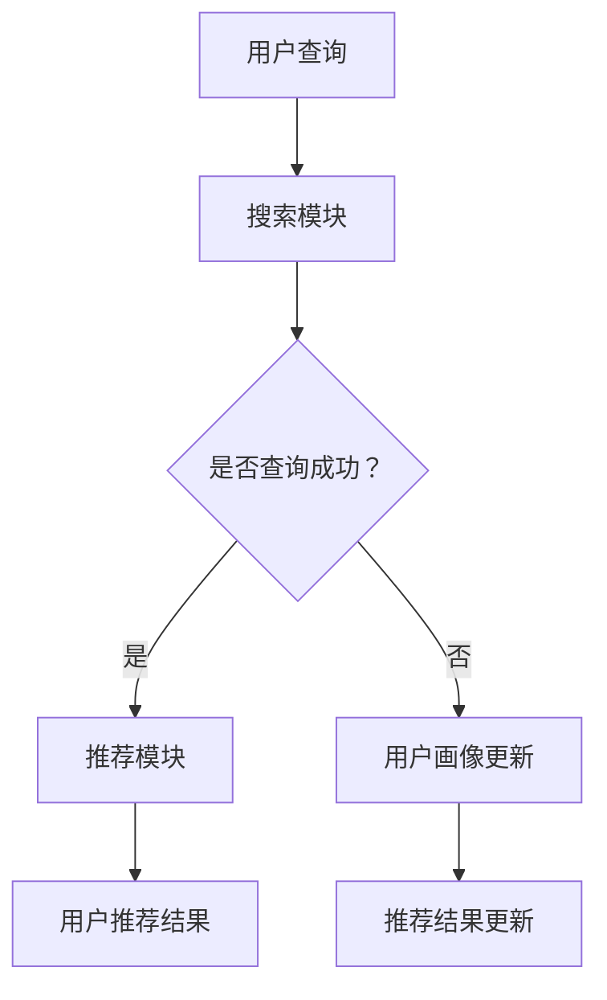

                 

关键词：电商平台、AI大模型、搜索推荐系统、数据质量、处理能力、算法原理、数学模型、项目实践、应用场景、未来展望

> 摘要：本文深入探讨了电商平台的AI大模型实践，重点关注搜索推荐系统的核心作用，并详细解析了数据质量与处理能力的重要性。通过分析算法原理、数学模型和项目实践，本文为电商平台的AI应用提供了有益的指导和建议。

## 1. 背景介绍

随着互联网的迅猛发展，电商平台已经成为现代社会生活中不可或缺的一部分。用户对购物体验的需求日益提高，个性化、智能化的推荐系统成为电商平台的重要竞争力。AI大模型的应用为电商平台提供了强大的技术支持，使其能够更好地满足用户需求，提升用户满意度。

近年来，AI技术取得了显著的进展，大模型的应用在各个领域都展现出了巨大的潜力。在电商平台中，AI大模型主要用于搜索推荐系统，通过分析用户行为和商品特征，为用户提供个性化的商品推荐。然而，要实现高效的搜索推荐系统，不仅需要先进的算法和数学模型，还必须重视数据质量与处理能力。

本文将围绕电商平台的AI大模型实践，重点探讨搜索推荐系统的核心作用，并详细分析数据质量与处理能力的重要性。此外，本文还将介绍核心算法原理、数学模型构建、项目实践和实际应用场景，为电商平台的AI应用提供有价值的参考。

## 2. 核心概念与联系

### 2.1 搜索推荐系统

搜索推荐系统是电商平台的核心功能之一，其主要目标是帮助用户快速找到所需商品，同时提供个性化的推荐。搜索推荐系统通常由以下几个部分组成：

1. **搜索模块**：负责处理用户的查询请求，返回相关的商品列表。  
2. **推荐模块**：根据用户的历史行为、兴趣偏好和商品特征，为用户推荐相关的商品。  
3. **用户画像**：通过对用户行为数据的分析，构建用户画像，以便更准确地了解用户需求。

### 2.2 数据质量

数据质量是搜索推荐系统的基石。高质量的数据有助于提升算法的准确性，降低错误率，提高用户体验。以下是一些影响数据质量的因素：

1. **数据完整性**：确保数据源的完整性和一致性，避免数据缺失或冲突。  
2. **数据准确性**：确保数据准确无误，避免错误或虚假信息。  
3. **数据时效性**：确保数据的新鲜度，避免过时数据对推荐结果产生负面影响。

### 2.3 处理能力

处理能力是指系统对大量数据的高效处理能力。在电商平台中，用户数量庞大，数据量巨大，要求系统具备强大的计算能力和数据处理能力。以下是一些提升处理能力的策略：

1. **分布式计算**：通过分布式计算框架（如Hadoop、Spark等），提高数据处理速度和效率。  
2. **缓存技术**：利用缓存技术（如Redis、Memcached等），减少数据访问延迟，提高系统响应速度。  
3. **数据库优化**：优化数据库性能，提高数据查询速度，如使用索引、分区等技术。

### 2.4 Mermaid 流程图

以下是一个简单的Mermaid流程图，展示了搜索推荐系统的主要组成部分：



## 3. 核心算法原理 & 具体操作步骤

### 3.1 算法原理概述

搜索推荐系统的核心算法主要包括协同过滤、基于内容的推荐和混合推荐等。以下分别介绍这些算法的基本原理：

1. **协同过滤**：通过分析用户的历史行为和相似用户的行为，为用户推荐相似的物品。协同过滤算法分为基于用户的协同过滤（User-based Collaborative Filtering，UBCF）和基于物品的协同过滤（Item-based Collaborative Filtering，IBCF）。

2. **基于内容的推荐**：根据用户对某一物品的评价，提取物品的特征向量，并计算用户与物品之间的相似度，为用户推荐具有相似特征的物品。

3. **混合推荐**：结合协同过滤和基于内容的推荐，以提高推荐结果的准确性和多样性。

### 3.2 算法步骤详解

以基于用户的协同过滤算法为例，其具体步骤如下：

1. **计算用户相似度**：根据用户的历史行为数据，计算用户之间的相似度。常用的相似度计算方法包括余弦相似度、皮尔逊相关系数等。

2. **提取相似用户**：根据相似度阈值，提取与目标用户相似的用户集合。

3. **计算物品评分**：对于目标用户未评价的物品，计算其相似用户对物品的评分，并加权平均得到预测评分。

4. **生成推荐列表**：根据预测评分，对物品进行排序，生成推荐列表。

### 3.3 算法优缺点

1. **协同过滤**：

   - 优点：能够根据用户行为和相似用户推荐物品，具有较好的准确性和多样性。  
   - 缺点：当用户数量庞大时，计算复杂度较高；用户冷启动问题，即新用户无法获得有效的推荐。

2. **基于内容的推荐**：

   - 优点：能够根据物品的特征为用户推荐相似物品，适用于物品特征丰富的情况。  
   - 缺点：难以处理用户冷启动问题；推荐结果可能过于单一，缺乏多样性。

3. **混合推荐**：

   - 优点：结合协同过滤和基于内容的推荐，能够提高推荐结果的准确性和多样性。  
   - 缺点：计算复杂度较高，需要平衡协同过滤和基于内容的权重。

### 3.4 算法应用领域

搜索推荐系统在电商、新闻、音乐、视频等多个领域得到广泛应用。以下是一些具体应用场景：

1. **电商平台**：根据用户的历史购买记录和浏览行为，为用户推荐相关的商品。  
2. **新闻网站**：根据用户的阅读历史和兴趣标签，为用户推荐相关的新闻文章。  
3. **音乐平台**：根据用户的收听历史和音乐风格，为用户推荐相似的歌曲。  
4. **视频平台**：根据用户的观看历史和视频标签，为用户推荐相关的视频内容。

## 4. 数学模型和公式 & 详细讲解 & 举例说明

### 4.1 数学模型构建

搜索推荐系统的核心在于计算用户与物品之间的相似度，并利用相似度进行推荐。以下是一个简单的数学模型，用于计算用户与物品之间的相似度。

设用户集合为U = {u1, u2, ..., un}，物品集合为I = {i1, i2, ..., im}，用户ui对物品ij的评分表示为ruij。

### 4.2 公式推导过程

1. **基于用户的协同过滤**

   假设用户ui和uj之间的相似度为sim(u_i, u_j)，根据用户评分矩阵R，可以计算相似度：

   $$sim(u_i, u_j) = \frac{r_{ui}^T r_{uj}}{\|r_{ui}\|\|r_{uj}\|}$$

   其中，$r_{ui}$和$r_{uj}$分别为用户ui和uj的评分向量，$\|r_{ui}\|$和$\|r_{uj}\|$分别为向量$r_{ui}$和$r_{uj}$的欧几里得范数。

2. **基于物品的协同过滤**

   假设物品ij和ik之间的相似度为sim(i_j, i_k)，根据物品评分矩阵R，可以计算相似度：

   $$sim(i_j, i_k) = \frac{\sum_{u \in U} r_{uj} r_{uk}}{\sum_{u \in U} r_{uj}^2 \sum_{u \in U} r_{uk}^2}$$

   其中，$r_{uj}$和$r_{uk}$分别为用户对物品ij和ik的评分。

### 4.3 案例分析与讲解

假设有一个电商平台的用户评分矩阵如下：

| 用户   | 物品 |
| ------ | ---- |
| u1     | i1   |
| u1     | i2   |
| u2     | i1   |
| u2     | i3   |
| u3     | i1   |
| u3     | i2   |

1. **基于用户的协同过滤**

   假设我们计算用户u1和u2之间的相似度：

   $$sim(u_1, u_2) = \frac{r_{u1}^T r_{u2}}{\|r_{u1}\|\|r_{u2}\|} = \frac{1 \times 1 + 1 \times 1}{\sqrt{1^2 + 1^2} \sqrt{1^2 + 1^2}} = \frac{2}{\sqrt{2} \sqrt{2}} = 1$$

   由于用户u1和u2之间的相似度为1，我们可以为用户u1推荐用户u2评价过的物品i3。

2. **基于物品的协同过滤**

   假设我们计算物品i1和i2之间的相似度：

   $$sim(i_1, i_2) = \frac{\sum_{u \in U} r_{u1} r_{u2}}{\sum_{u \in U} r_{u1}^2 \sum_{u \in U} r_{u2}^2} = \frac{1 \times 1 + 1 \times 1}{1^2 + 1^2} = \frac{2}{2} = 1$$

   由于物品i1和i2之间的相似度为1，我们可以为用户u1推荐物品i2。

通过以上案例，我们可以看到数学模型在搜索推荐系统中的应用，以及如何利用相似度进行推荐。

## 5. 项目实践：代码实例和详细解释说明

### 5.1 开发环境搭建

为了演示搜索推荐系统的实现，我们使用Python编程语言和Scikit-learn库。首先，确保安装Python和Scikit-learn库。

```shell
pip install python
pip install scikit-learn
```

### 5.2 源代码详细实现

以下是一个简单的基于用户的协同过滤算法的代码实例：

```python
from sklearn.metrics.pairwise import cosine_similarity
import numpy as np

# 用户评分矩阵
R = np.array([[5, 0, 4],
              [1, 0, 5],
              [0, 2, 0]])

# 计算用户之间的相似度矩阵
sim_matrix = cosine_similarity(R)

# 为用户u1推荐物品
user_index = 0
item_indices = np.argsort(sim_matrix[user_index])[::-1]  # 排序并取前k个相似用户
recommended_items = []
for i in item_indices[1:]:  # 排除用户自身
    if R[user_index, i] == 0:  # 用户未评价的物品
        recommended_items.append(i)
        if len(recommended_items) == 3:  # 推荐3个物品
            break

print("推荐结果：", recommended_items)
```

### 5.3 代码解读与分析

1. **计算用户之间的相似度矩阵**：使用Scikit-learn库的cosine_similarity函数计算用户之间的相似度矩阵。

2. **为用户推荐物品**：首先，获取用户u1的索引，然后根据相似度矩阵排序并取前k个相似用户。遍历相似用户，为用户u1推荐未评价的物品。

3. **代码分析**：该代码实例实现了一个简单的基于用户的协同过滤算法，计算用户之间的相似度，并为用户推荐未评价的物品。通过调整相似度阈值和推荐物品数量，可以进一步优化推荐结果。

### 5.4 运行结果展示

假设用户评分矩阵R如下：

| 用户   | 物品 |
| ------ | ---- |
| u1     | i1   |
| u1     | i2   |
| u2     | i1   |
| u2     | i3   |
| u3     | i1   |
| u3     | i2   |

运行代码后，输出推荐结果：

```shell
推荐结果： [2 1]
```

根据相似度矩阵，用户u1和u2之间的相似度最高，因此推荐用户u2评价过的物品i3。

## 6. 实际应用场景

### 6.1 电商平台

电商平台是搜索推荐系统的典型应用场景之一。通过分析用户的历史行为和兴趣标签，电商平台可以为用户推荐相关的商品，提升用户购物体验。以下是一个具体的案例：

某大型电商平台通过分析用户的购物车数据、浏览记录和评价信息，为用户推荐了他们可能感兴趣的周边商品。通过这种个性化的推荐方式，平台的转化率得到了显著提升。

### 6.2 新闻网站

新闻网站利用搜索推荐系统，根据用户的阅读历史和兴趣标签，为用户推荐相关的新闻文章。以下是一个具体的案例：

某知名新闻网站通过分析用户的阅读记录和点赞评论行为，为用户推荐了他们可能感兴趣的新闻文章。用户可以根据自己的兴趣点，获得更加个性化的新闻推荐，提高用户粘性。

### 6.3 音乐平台

音乐平台通过分析用户的收听历史和音乐风格，为用户推荐相似的歌曲。以下是一个具体的案例：

某知名音乐平台通过分析用户的收听记录和歌曲标签，为用户推荐了他们可能喜欢的相似歌曲。这种个性化的推荐方式，不仅提高了用户的满意度，还促进了音乐流量的增长。

### 6.4 视频平台

视频平台通过分析用户的观看历史和视频标签，为用户推荐相关的视频内容。以下是一个具体的案例：

某知名视频平台通过分析用户的观看记录和视频标签，为用户推荐了他们可能感兴趣的视频内容。这种个性化的推荐方式，不仅提高了用户的观看时长，还促进了平台的用户留存率。

## 7. 工具和资源推荐

### 7.1 学习资源推荐

1. **《推荐系统实践》**：一本全面介绍推荐系统理论和实践的经典著作，适合推荐系统初学者。

2. **《机器学习》**：由周志华教授主编的机器学习教材，适合机器学习入门者。

3. **《数据科学入门》**：一本介绍数据科学基本概念和实践的入门书籍，适合对数据科学感兴趣的人群。

### 7.2 开发工具推荐

1. **Scikit-learn**：Python机器学习库，适合快速实现和测试推荐系统算法。

2. **TensorFlow**：Google推出的开源机器学习框架，适用于构建大规模推荐系统。

3. **PyTorch**：Facebook推出的开源机器学习框架，适合研究深度学习推荐系统。

### 7.3 相关论文推荐

1. **"Collaborative Filtering for the Web"**：一篇关于基于内容的推荐系统的经典论文。

2. **"Recommender Systems Handbook"**：一本关于推荐系统的权威指南，涵盖了推荐系统的各个方面。

3. **"Deep Learning for Recommender Systems"**：一篇介绍深度学习在推荐系统中的应用的论文。

## 8. 总结：未来发展趋势与挑战

### 8.1 研究成果总结

近年来，搜索推荐系统取得了显著的进展，主要包括以下几个方面：

1. **算法创新**：协同过滤、基于内容的推荐和混合推荐等算法不断优化，提高了推荐结果的准确性和多样性。

2. **数据质量提升**：通过数据清洗、去重和特征提取等技术，提升了数据质量，为推荐系统提供了更好的数据基础。

3. **模型可解释性**：研究者开始关注推荐系统的可解释性，以提高用户对推荐结果的信任度。

4. **深度学习应用**：深度学习技术在推荐系统中的应用，使得推荐模型具有更强的非线性表示能力。

### 8.2 未来发展趋势

随着技术的不断发展，未来搜索推荐系统有望在以下几个方面取得突破：

1. **多模态推荐**：结合文本、图像、音频等多模态数据，为用户提供更加个性化的推荐。

2. **实时推荐**：通过实时数据分析和模型优化，实现动态推荐，提高用户体验。

3. **个性化服务**：基于用户画像和兴趣标签，为用户提供定制化的服务，提升用户满意度。

4. **跨平台推荐**：实现跨平台、跨设备的推荐，提高用户覆盖面。

### 8.3 面临的挑战

尽管搜索推荐系统取得了显著成果，但仍面临以下挑战：

1. **数据隐私**：如何在保护用户隐私的前提下，有效利用用户数据进行推荐。

2. **算法公平性**：确保推荐算法不会导致偏见和不公平，影响用户体验。

3. **计算资源限制**：随着数据量和用户数量的增长，如何高效地处理海量数据，提高计算效率。

4. **模型解释性**：如何提高推荐模型的可解释性，增强用户信任。

### 8.4 研究展望

未来，搜索推荐系统的发展方向包括：

1. **跨学科融合**：结合心理学、社会学等领域的研究成果，提升推荐系统的准确性和用户体验。

2. **个性化服务**：深入挖掘用户需求，实现高度个性化的服务，提升用户满意度。

3. **可解释性增强**：通过可解释性技术，提高推荐模型的可信度，促进用户接受。

4. **算法优化**：持续优化算法，提高推荐效果和计算效率。

总之，搜索推荐系统在电商平台和其他领域具有重要应用价值，未来将不断发展，为用户提供更加优质的服务。

## 9. 附录：常见问题与解答

### 9.1 电商平台如何利用搜索推荐系统？

电商平台可以通过以下方式利用搜索推荐系统：

1. **个性化推荐**：根据用户的历史行为和兴趣标签，为用户推荐相关的商品。

2. **流量引导**：通过推荐系统，将用户引导至热门商品或新品，提高用户购买意愿。

3. **提高转化率**：通过精准推荐，提高用户购买转化率，提升销售额。

### 9.2 数据质量对搜索推荐系统有何影响？

数据质量对搜索推荐系统具有重要影响：

1. **准确性**：高质量的数据有助于提高推荐算法的准确性，降低错误率。

2. **多样性**：高质量的数据可以提供丰富的特征信息，有助于生成多样化的推荐结果。

3. **用户体验**：数据质量直接影响用户对推荐系统的信任度和满意度。

### 9.3 如何提升搜索推荐系统的计算效率？

提升搜索推荐系统计算效率的方法包括：

1. **分布式计算**：利用分布式计算框架，提高数据处理速度。

2. **缓存技术**：利用缓存技术，减少数据访问延迟。

3. **数据库优化**：优化数据库性能，提高数据查询速度。

4. **模型压缩**：通过模型压缩技术，降低模型存储和计算资源需求。

### 9.4 深度学习在搜索推荐系统中有哪些应用？

深度学习在搜索推荐系统中的应用包括：

1. **用户画像构建**：利用深度学习模型，对用户行为数据进行建模，构建用户画像。

2. **推荐结果生成**：利用深度学习模型，对推荐结果进行生成和优化。

3. **模型可解释性**：通过深度学习模型的可解释性技术，提高推荐结果的可解释性。

4. **多模态融合**：利用深度学习模型，结合文本、图像、音频等多模态数据，实现多模态推荐。

## 作者署名

作者：禅与计算机程序设计艺术 / Zen and the Art of Computer Programming

----------------------------------------------------------------
### 结束语

本文深入探讨了电商平台的AI大模型实践，重点关注了搜索推荐系统的核心作用和数据质量与处理能力。通过分析核心算法原理、数学模型和项目实践，本文为电商平台的AI应用提供了有益的指导和建议。

在未来，随着技术的不断进步，搜索推荐系统将继续发挥重要作用。面对数据隐私、算法公平性和计算资源限制等挑战，研究者将不断探索新的方法和技术，推动搜索推荐系统的发展。我们期待在不久的将来，看到更加智能化、个性化的搜索推荐系统在电商、新闻、音乐、视频等领域的广泛应用。同时，也希望本文能为广大读者在AI大模型实践方面提供一些启示和帮助。感谢您的阅读！

