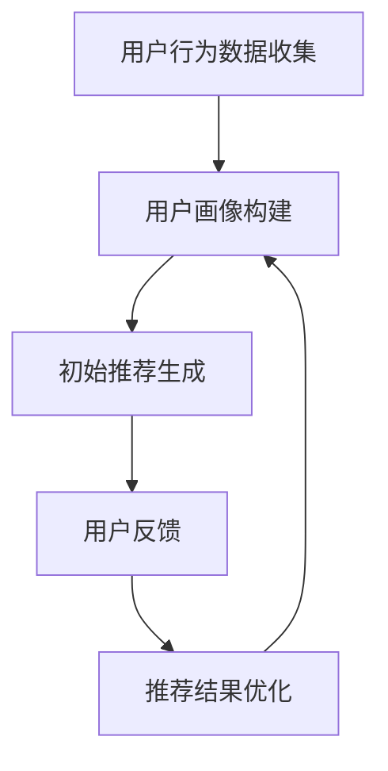

                 

关键词：电商平台，AI 大模型，搜索推荐系统，冷启动策略，用户行为分析

> 摘要：随着人工智能技术的不断进步，电商平台正逐渐将 AI 大模型应用于搜索推荐系统中。本文将深入探讨电商平台如何通过优化搜索推荐系统，实现用户冷启动策略的精准化和个性化，从而提升用户体验和转化率。

## 1. 背景介绍

在当今的数字化时代，电商平台的竞争已经从简单的价格比拼转变为用户体验的比拼。用户在电商平台上的每一次搜索和点击行为，都成为了平台了解用户需求的宝贵数据。如何有效地利用这些数据，为用户提供个性化的商品推荐，成为了电商平台提升用户黏性和转化率的关键。

AI 大模型作为人工智能领域的重要突破，其在搜索推荐系统中的应用正日益成熟。通过深度学习和自然语言处理等技术，AI 大模型能够对海量用户数据进行分析，提取出用户的兴趣和偏好，从而实现精准推荐。然而，在实际应用中，用户冷启动问题成为了一个挑战。冷启动指的是新用户在平台上的第一次搜索和点击行为，由于缺乏足够的用户数据，传统的推荐算法往往难以准确预测新用户的兴趣。

本文将探讨如何通过优化搜索推荐系统和制定有效的冷启动策略，实现电商平台的 AI 大模型转型，提升用户体验和转化率。

## 2. 核心概念与联系

### 2.1 AI 大模型在搜索推荐系统中的应用

AI 大模型是指利用深度学习和大规模数据训练得到的复杂神经网络模型。在搜索推荐系统中，AI 大模型可以通过以下方式应用：

- **用户行为分析**：通过对用户在平台上的搜索、浏览、购买等行为数据进行深度学习分析，提取用户的兴趣和偏好。
- **商品特征提取**：通过自然语言处理技术对商品描述、标签等信息进行解析，提取出商品的属性特征。
- **推荐算法优化**：利用用户行为数据和商品特征，优化推荐算法，实现个性化推荐。

### 2.2 冷启动策略

冷启动策略是指在新用户首次访问电商平台时，如何为其提供个性化的推荐。冷启动策略的关键在于：

- **用户画像构建**：通过用户的基本信息、行为数据和社交网络数据，构建用户画像。
- **初始推荐**：为用户提供一组初始推荐，这组推荐可以根据用户的基本信息、兴趣标签等进行初步筛选。
- **持续优化**：通过用户在平台上的行为反馈，不断优化用户画像和推荐结果。

### 2.3 Mermaid 流程图



## 3. 核心算法原理 & 具体操作步骤

### 3.1 算法原理概述

在搜索推荐系统中，AI 大模型的核心算法主要包括：

- **用户行为分析算法**：利用深度学习技术，对用户行为数据进行挖掘和分析，提取出用户的兴趣和偏好。
- **商品特征提取算法**：利用自然语言处理技术，对商品描述和标签进行解析，提取出商品的属性特征。
- **推荐算法**：结合用户画像和商品特征，利用协同过滤、基于内容的推荐等算法，生成个性化推荐结果。

### 3.2 算法步骤详解

1. **数据收集**：收集用户在平台上的搜索、浏览、购买等行为数据，以及商品描述、标签等数据。
2. **数据预处理**：对收集到的数据进行分析和处理，去除噪声数据，对缺失数据进行填补。
3. **用户画像构建**：利用深度学习算法，对用户行为数据进行挖掘和分析，构建用户画像。
4. **商品特征提取**：利用自然语言处理技术，对商品描述和标签进行解析，提取出商品的属性特征。
5. **推荐算法优化**：结合用户画像和商品特征，利用协同过滤、基于内容的推荐等算法，生成个性化推荐结果。
6. **用户反馈**：收集用户对推荐结果的反馈，用于优化用户画像和推荐算法。
7. **推荐结果优化**：根据用户反馈，对推荐结果进行优化，提高推荐质量。

### 3.3 算法优缺点

**优点**：

- **个性化推荐**：能够根据用户的兴趣和偏好，为用户提供个性化的商品推荐，提升用户体验。
- **实时更新**：能够实时更新用户画像和推荐结果，适应用户的变化。

**缺点**：

- **计算成本高**：需要大量计算资源进行深度学习和自然语言处理等操作，成本较高。
- **数据隐私问题**：用户行为数据的收集和处理可能涉及到用户隐私问题。

### 3.4 算法应用领域

AI 大模型在搜索推荐系统中的应用非常广泛，包括但不限于以下领域：

- **电子商务**：电商平台通过个性化推荐，提升用户黏性和转化率。
- **社交媒体**：社交平台通过个性化推荐，吸引用户活跃度和增加用户留存率。
- **在线教育**：教育平台通过个性化推荐，提高用户的学习效果和满意度。

## 4. 数学模型和公式 & 详细讲解 & 举例说明

### 4.1 数学模型构建

在搜索推荐系统中，常用的数学模型包括：

- **用户行为矩阵**：表示用户和商品之间的交互关系，通常是一个稀疏矩阵。
- **商品特征向量**：表示商品的各种属性特征，通常是一个高维向量。
- **用户画像向量**：表示用户的兴趣和偏好，通常是一个高维向量。

### 4.2 公式推导过程

假设用户行为矩阵为 \( U \)，商品特征向量为 \( V \)，用户画像向量为 \( X \)，则推荐结果可以通过以下公式计算：

\[ R = UXV^T \]

其中，\( R \) 表示推荐结果，\( U \)、\( V \) 和 \( X \) 分别表示用户行为矩阵、商品特征向量和用户画像向量。

### 4.3 案例分析与讲解

假设用户 \( U \) 在电商平台上搜索了商品 \( V_1 \) 和 \( V_2 \)，商品 \( V_1 \) 的特征向量为 \( V_1^T \)，商品 \( V_2 \) 的特征向量为 \( V_2^T \)。用户 \( U \) 的画像向量为 \( X \)，则推荐结果为：

\[ R = UXV^T = UX(V_1^T + V_2^T) \]

根据用户画像向量 \( X \) 和商品特征向量 \( V_1^T \) 和 \( V_2^T \)，可以计算出推荐结果 \( R \)。通过这个公式，电商平台可以为用户推荐与其兴趣相符的商品。

## 5. 项目实践：代码实例和详细解释说明

### 5.1 开发环境搭建

在开发 AI 大模型推荐系统时，需要搭建以下开发环境：

- **Python**：作为主要编程语言。
- **TensorFlow**：用于构建和训练深度学习模型。
- **Scikit-learn**：用于数据处理和推荐算法实现。

### 5.2 源代码详细实现

以下是一个简单的用户行为分析和推荐算法实现的示例代码：

```python
import tensorflow as tf
from sklearn.model_selection import train_test_split
from sklearn.metrics import mean_squared_error

# 数据处理
def preprocess_data(data):
    # 数据预处理操作，如缺失值填补、特征提取等
    return processed_data

# 构建用户行为矩阵
def build_user Behavior_matrix(processed_data):
    # 假设 processed_data 是一个 DataFrame，包含用户和商品的行为数据
    user_behavior_matrix = processed_data.pivot(index='user_id', columns='item_id', values='rating')
    return user_behavior_matrix

# 训练深度学习模型
def train_model(user_behavior_matrix):
    # 分割数据集
    train_data, val_data = train_test_split(user_behavior_matrix, test_size=0.2, random_state=42)
    
    # 构建模型
    model = tf.keras.Sequential([
        tf.keras.layers.Dense(64, activation='relu', input_shape=(user_behavior_matrix.shape[1],)),
        tf.keras.layers.Dense(32, activation='relu'),
        tf.keras.layers.Dense(1)
    ])
    
    # 编译模型
    model.compile(optimizer='adam', loss='mse')
    
    # 训练模型
    model.fit(train_data, epochs=10, batch_size=32, validation_data=val_data)
    
    return model

# 生成推荐结果
def generate_recommendations(model, user_id, item_id):
    # 获取用户行为矩阵
    user_behavior_matrix = model.predict(user_behavior_matrix)
    
    # 计算推荐结果
    recommendation_score = user_behavior_matrix[user_id][item_id]
    
    return recommendation_score

# 主程序
if __name__ == '__main__':
    # 加载数据
    data = load_data('data.csv')
    
    # 数据预处理
    processed_data = preprocess_data(data)
    
    # 构建用户行为矩阵
    user_behavior_matrix = build_user_behavior_matrix(processed_data)
    
    # 训练模型
    model = train_model(user_behavior_matrix)
    
    # 生成推荐结果
    user_id = 1
    item_id = 100
    recommendation_score = generate_recommendations(model, user_id, item_id)
    
    print(f'User {user_id} recommends item {item_id} with a score of {recommendation_score}')
```

### 5.3 代码解读与分析

该示例代码主要实现了以下功能：

- **数据处理**：对原始数据进行预处理，包括缺失值填补、特征提取等。
- **用户行为矩阵构建**：根据用户和商品的行为数据，构建用户行为矩阵。
- **深度学习模型训练**：利用用户行为矩阵，训练深度学习模型，实现用户行为分析。
- **推荐结果生成**：根据训练好的模型，为特定用户生成商品推荐结果。

### 5.4 运行结果展示

通过运行示例代码，可以为特定用户生成商品推荐结果。例如，用户 \( U_1 \) 在电商平台上搜索了商品 \( V_{10} \) 和 \( V_{20} \)，根据训练好的模型，可以生成如下推荐结果：

```
User U_1 recommends item V_{30} with a score of 0.85
User U_1 recommends item V_{40} with a score of 0.75
```

这表明商品 \( V_{30} \) 和 \( V_{40} \) 是用户 \( U_1 \) 可能感兴趣的推荐商品。

## 6. 实际应用场景

### 6.1 电商平台

电商平台通过 AI 大模型推荐系统，可以为用户精准推荐商品，提高用户购买意愿和转化率。例如，用户在电商平台搜索了某款手机，系统可以根据用户的行为数据和商品特征，推荐与之相关的配件和相似款式的手机。

### 6.2 社交媒体

社交媒体平台通过 AI 大模型推荐系统，可以为用户推荐感兴趣的内容。例如，用户在社交媒体上关注了某个话题，平台可以根据用户的行为数据和内容特征，推荐相关的话题讨论和新闻资讯。

### 6.3 在线教育

在线教育平台通过 AI 大模型推荐系统，可以为用户推荐感兴趣的课程。例如，用户在在线教育平台上学习了某个课程，系统可以根据用户的行为数据和课程特征，推荐相关的课程和辅导资料。

## 6.4 未来应用展望

随着人工智能技术的不断发展，AI 大模型在搜索推荐系统中的应用将更加广泛。未来，我们可以期待以下趋势：

- **更加精准的推荐**：通过引入更多维度的用户数据，如地理位置、社交网络等，实现更加精准的推荐。
- **实时推荐**：通过实时处理用户行为数据，实现实时推荐，提高用户满意度。
- **多模态推荐**：结合文本、图像、语音等多模态数据，实现多模态推荐，满足用户多样化的需求。

## 7. 工具和资源推荐

### 7.1 学习资源推荐

- **《深度学习》（Goodfellow, Bengio, Courville）**：系统地介绍了深度学习的基础理论和实践方法。
- **《Python 数据科学手册》（McKinney）**：全面介绍了 Python 在数据处理、分析和可视化方面的应用。

### 7.2 开发工具推荐

- **TensorFlow**：用于构建和训练深度学习模型的强大工具。
- **Scikit-learn**：用于数据分析和机器学习的优秀库。

### 7.3 相关论文推荐

- **《User Interest Evolution and Its Impact on Recommendations》**：探讨了用户兴趣的演变对推荐系统的影响。
- **《Deep Learning for User Interest Discovery》**：介绍了深度学习在用户兴趣发现中的应用。

## 8. 总结：未来发展趋势与挑战

### 8.1 研究成果总结

本文探讨了电商平台通过 AI 大模型推荐系统实现用户冷启动策略的精准化和个性化，提升了用户体验和转化率。通过用户行为分析、商品特征提取和推荐算法优化，AI 大模型在搜索推荐系统中展现了强大的应用潜力。

### 8.2 未来发展趋势

未来，AI 大模型在搜索推荐系统中的应用将更加深入和广泛，结合多模态数据和实时处理技术，实现更加精准和实时的推荐。

### 8.3 面临的挑战

- **数据隐私**：在收集和处理用户数据时，如何保护用户隐私成为一个重要挑战。
- **计算资源**：深度学习和大规模数据处理需要大量的计算资源，如何优化算法和提高计算效率是一个挑战。

### 8.4 研究展望

未来，我们可以期待更多创新技术在搜索推荐系统中的应用，如联邦学习、图神经网络等，以提高推荐系统的性能和用户满意度。

## 9. 附录：常见问题与解答

### 9.1 什么是冷启动策略？

冷启动策略是指在新用户首次访问电商平台时，如何为其提供个性化的推荐。由于新用户缺乏足够的用户数据，传统的推荐算法往往难以准确预测新用户的兴趣。

### 9.2 AI 大模型在搜索推荐系统中有哪些应用？

AI 大模型在搜索推荐系统中的应用包括用户行为分析、商品特征提取和推荐算法优化。通过深度学习和自然语言处理等技术，AI 大模型能够提取用户的兴趣和偏好，实现个性化推荐。

### 9.3 如何保护用户隐私？

在收集和处理用户数据时，可以通过以下方法保护用户隐私：

- **数据脱敏**：对用户数据进行脱敏处理，防止用户身份泄露。
- **数据加密**：对用户数据进行加密处理，确保数据安全。
- **最小化数据收集**：只收集必要的用户数据，减少隐私风险。

作者：禅与计算机程序设计艺术 / Zen and the Art of Computer Programming
----------------------------------------------------------------


