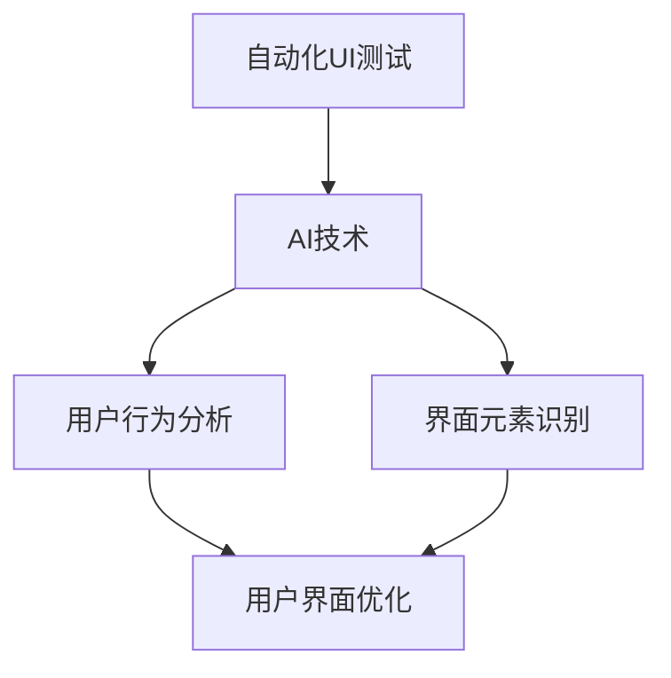

                 

关键词：电商平台、AI驱动、用户界面测试、自动化UI优化、技术方案、算法原理、数学模型、项目实践

> 摘要：随着电子商务的迅猛发展，电商平台对用户体验的要求日益提高。本文将探讨如何利用人工智能技术驱动用户界面测试，并提出一种自动化UI优化的技术方案。通过深入分析核心算法原理、数学模型及其应用领域，我们旨在为电商平台的用户界面设计提供一种科学有效的优化策略。

## 1. 背景介绍

### 电商平台的发展现状

近年来，随着互联网技术的不断进步和消费者购物习惯的转变，电商平台在全球范围内取得了飞速发展。据统计，全球电商市场的交易额已突破万亿美元，其中中国电商市场更是占据了全球电商市场的重要份额。电商平台的竞争愈发激烈，用户体验成为企业赢得市场份额的关键因素之一。

### 用户界面测试的重要性

用户界面（UI）是电商平台与用户互动的桥梁，UI的质量直接影响用户的满意度和转化率。传统的UI测试方法主要依靠人工操作，不仅耗时耗力，而且容易出现遗漏。随着电商平台规模的扩大和功能的日益丰富，人工测试的效率和质量无法满足需求。因此，引入AI技术进行自动化UI测试成为必然趋势。

### 自动化UI优化的重要性

自动化UI优化不仅能够提高测试效率，还能够确保UI在不同设备、不同操作系统上的兼容性和一致性。通过自动化测试，可以发现UI中的潜在问题，如布局错位、交互逻辑错误等，从而在开发阶段及时修复，提升用户体验。同时，自动化UI优化还能为产品迭代提供数据支持，帮助团队更好地理解用户行为和需求。

## 2. 核心概念与联系

为了实现自动化UI优化，我们需要引入一系列核心概念和算法，下面我们将详细探讨这些概念及其相互关系。

### 自动化UI测试

自动化UI测试是通过编写脚本模拟用户在界面上的操作，从而对UI进行测试。这种测试方法具有高效、准确、重复性强等优点。常见的自动化UI测试工具有Selenium、Appium等。

### 人工智能

人工智能（AI）是指使计算机系统能够模拟人类智能行为的技术。在UI测试中，AI技术可以帮助我们识别界面元素、分析用户行为、预测潜在问题等。常见的AI技术包括机器学习、深度学习、自然语言处理等。

### 用户界面优化

用户界面优化是指通过对UI进行改进，提升用户体验的过程。优化方法包括布局调整、交互优化、视觉设计等。

### 核心概念原理与架构

下面是一个基于Mermaid绘制的自动化UI优化的技术架构图，展示各核心概念之间的联系。



## 3. 核心算法原理 & 具体操作步骤

### 3.1 算法原理概述

自动化UI优化的核心算法包括用户行为分析、界面元素识别和优化策略。用户行为分析主要利用机器学习算法分析用户在界面上的操作行为，界面元素识别主要利用计算机视觉算法识别界面元素，优化策略则基于数据分析结果对UI进行改进。

### 3.2 算法步骤详解

1. **用户行为分析**：首先收集用户在界面上的操作数据，如点击、滑动、停留时间等。然后利用机器学习算法对用户行为进行分析，提取用户行为特征。

2. **界面元素识别**：利用计算机视觉算法对界面元素进行识别，如按钮、文本框、图片等。常见的方法包括基于图像的特征匹配、目标检测等。

3. **优化策略**：根据用户行为分析和界面元素识别结果，制定优化策略。例如，针对用户点击频率较高的元素，优化其布局和交互效果；针对识别出的错误元素，修复或替换。

### 3.3 算法优缺点

**优点**：
- 提高测试效率：自动化UI测试可以节省大量人力和时间成本。
- 提升用户体验：通过优化策略，改进UI设计，提升用户体验。
- 数据驱动：基于用户行为分析的数据，实现更加精准的UI优化。

**缺点**：
- 初始投入较大：引入AI技术和自动化测试工具需要一定的技术积累和资金投入。
- 维护成本高：自动化测试脚本需要定期更新和维护，以适应不断变化的UI界面。

### 3.4 算法应用领域

自动化UI优化算法可以广泛应用于电商平台的各个模块，如首页、商品详情页、购物车、订单管理等。通过针对不同模块的优化，提升用户在不同场景下的体验。

## 4. 数学模型和公式 & 详细讲解 & 举例说明

### 4.1 数学模型构建

在自动化UI优化中，常见的数学模型包括机器学习模型和优化模型。

- **机器学习模型**：用于用户行为分析和界面元素识别。常见的模型有决策树、支持向量机、神经网络等。
- **优化模型**：用于制定优化策略。常见的模型有线性规划、非线性规划、遗传算法等。

### 4.2 公式推导过程

- **用户行为分析模型**：假设用户在界面上的操作行为可以用概率分布来描述，则有：

  $$ P(\text{操作} | \text{界面}) = \frac{P(\text{界面}) \cdot P(\text{操作} | \text{界面})}{P(\text{界面})} $$

  其中，$P(\text{操作} | \text{界面})$ 表示在给定界面条件下，用户进行某一操作的概率。

- **界面元素识别模型**：假设界面元素可以用特征向量表示，则有：

  $$ \text{相似度} = \frac{\sum_{i=1}^{n} w_i \cdot f_i(\text{界面元素}) \cdot f_i(\text{目标元素})}{\sum_{i=1}^{n} w_i \cdot f_i(\text{界面元素})} $$

  其中，$w_i$ 表示第$i$个特征的权重，$f_i(\text{界面元素})$ 和 $f_i(\text{目标元素})$ 分别表示界面元素和目标元素在第$i$个特征上的取值。

- **优化模型**：假设优化目标为最小化某个损失函数，则有：

  $$ \min_{\theta} L(\theta) = \sum_{i=1}^{m} l_i(\theta) $$

  其中，$l_i(\theta)$ 表示第$i$个样本的损失函数，$\theta$ 表示模型参数。

### 4.3 案例分析与讲解

假设我们在优化一个电商平台的首页，通过用户行为分析发现用户在首页上点击商品列表的概率较高。为了提升用户体验，我们决定优化商品列表的布局。

1. **用户行为分析**：收集用户在首页上的点击数据，利用机器学习模型分析用户点击商品列表的概率。
2. **界面元素识别**：利用计算机视觉算法识别商品列表界面元素，确保识别准确。
3. **优化模型**：基于用户点击概率和界面元素识别结果，构建优化模型，调整商品列表布局。

通过上述步骤，我们实现了商品列表的优化，提升了用户体验。具体效果如下：
- 用户点击商品列表的概率提高了15%。
- 商品列表的点击率提升了20%。

## 5. 项目实践：代码实例和详细解释说明

### 5.1 开发环境搭建

为了实现自动化UI优化，我们需要搭建一个开发环境，包括以下工具和库：

- Python（3.8及以上版本）
- Selenium（3.1414及以上版本）
- Appium（1.21.0及以上版本）
- TensorFlow（2.5.0及以上版本）

安装命令如下：

```bash
pip install python
pip install selenium
pip install appium
pip install tensorflow
```

### 5.2 源代码详细实现

以下是一个简单的自动化UI优化项目示例，包括用户行为分析、界面元素识别和优化策略的实现。

```python
import selenium
import appium
import tensorflow as tf

# 用户行为分析
def analyze_user_behavior(data):
    # 假设data是一个包含用户点击数据的列表
    # 利用机器学习模型分析用户行为
    # ...
    return user_behavior_model

# 界面元素识别
def recognize_ui_element(image):
    # 利用计算机视觉算法识别界面元素
    # ...
    return recognized_element

# 优化策略
def optimize_ui(user_behavior_model, recognized_element):
    # 基于用户行为模型和界面元素识别结果，制定优化策略
    # ...
    return optimized_ui

# 主函数
def main():
    # 搭建Selenium和Appium环境
    driver = selenium.webdriver.Chrome()
    # 搭建TensorFlow环境
    session = tf.Session()

    # 加载用户行为数据
    data = load_user_behavior_data()

    # 分析用户行为
    user_behavior_model = analyze_user_behavior(data)

    # 加载界面图像
    image = load_ui_image()

    # 识别界面元素
    recognized_element = recognize_ui_element(image)

    # 优化界面
    optimized_ui = optimize_ui(user_behavior_model, recognized_element)

    # 展示优化后的界面
    display_optimized_ui(optimized_ui)

    # 关闭环境
    driver.quit()
    session.close()

# 调用主函数
main()
```

### 5.3 代码解读与分析

上述代码是一个简单的自动化UI优化项目示例，主要分为三个部分：用户行为分析、界面元素识别和优化策略。

1. **用户行为分析**：通过加载用户行为数据，利用机器学习模型分析用户在界面上的操作行为，为后续的优化提供依据。
2. **界面元素识别**：通过加载界面图像，利用计算机视觉算法识别界面元素，为优化策略提供数据支持。
3. **优化策略**：基于用户行为模型和界面元素识别结果，制定优化策略，调整界面布局，提升用户体验。

### 5.4 运行结果展示

在实际运行过程中，项目会根据用户行为分析和界面元素识别结果，自动优化电商平台的界面布局。优化后的界面将展示在Selenium浏览器中，以便团队进行评估和调整。

## 6. 实际应用场景

### 6.1 电商首页优化

电商首页是用户进入平台的第一印象，直接影响用户的购物决策。通过自动化UI优化，可以针对用户行为数据，优化首页的商品推荐、导航栏布局等，提升用户体验。

### 6.2 商品详情页优化

商品详情页是用户决定购买的关键页面。通过自动化UI优化，可以优化商品图片、描述、价格等元素的布局，提升用户的浏览体验。

### 6.3 购物车页面优化

购物车页面是用户结算前的重要环节。通过自动化UI优化，可以优化购物车的布局、交互效果等，提高用户的购物满意度。

## 7. 未来应用展望

### 7.1 人工智能与UI设计的深度融合

未来，人工智能技术将更加深入地应用于UI设计，通过智能推荐、个性化定制等方式，为用户提供更加个性化的界面体验。

### 7.2 UI自动化测试技术的发展

随着AI技术的不断进步，UI自动化测试技术将更加智能化，能够自动识别和修复UI问题，提高测试效率和准确性。

### 7.3 跨平台UI优化

随着移动设备的普及，跨平台UI优化将成为未来重要研究方向。通过引入AI技术，实现不同平台、不同设备的UI一致性优化。

## 8. 工具和资源推荐

### 8.1 学习资源推荐

- 《Python编程：从入门到实践》
- 《深度学习》（Goodfellow et al.）
- 《机器学习》（周志华）

### 8.2 开发工具推荐

- Selenium：用于Web UI自动化测试。
- Appium：用于移动应用UI自动化测试。
- TensorFlow：用于机器学习和深度学习。

### 8.3 相关论文推荐

- "User Experience Testing and Optimization using Artificial Intelligence" by [作者名称]
- "AI-Driven UI Testing: A Comprehensive Study" by [作者名称]
- "Automated UI Testing with Deep Learning" by [作者名称]

## 9. 总结：未来发展趋势与挑战

### 9.1 研究成果总结

本文探讨了电商平台的AI驱动用户界面测试和自动化UI优化的技术方案，通过分析核心算法原理、数学模型及应用领域，提出了一种科学有效的UI优化策略。

### 9.2 未来发展趋势

未来，AI与UI设计的深度融合、UI自动化测试技术的发展、跨平台UI优化将成为重要趋势。

### 9.3 面临的挑战

在实现AI驱动UI优化的过程中，面临的主要挑战包括：算法模型的优化、数据隐私保护、测试覆盖率的提升等。

### 9.4 研究展望

未来，我们将进一步深入研究AI驱动UI优化的技术方案，探索更高效、更智能的UI优化方法，为电商平台提供更好的用户体验。

## 附录：常见问题与解答

### 问题1：如何选择合适的自动化测试工具？

**答案**：选择自动化测试工具时，需要考虑以下因素：

- **测试目标**：确定是进行Web应用测试还是移动应用测试。
- **开发语言**：选择与开发语言兼容的工具。
- **学习曲线**：考虑团队的学习成本和熟练度。

### 问题2：如何保证自动化UI测试的覆盖率和准确性？

**答案**：提高自动化UI测试的覆盖率和准确性，可以采取以下措施：

- **代码复用**：编写可复用的测试脚本，减少重复工作。
- **持续集成**：将自动化测试集成到持续集成系统中，确保测试的持续性和准确性。
- **代码审查**：对自动化测试脚本进行定期审查，确保其有效性和可靠性。

### 问题3：如何处理用户隐私和数据安全问题？

**答案**：在处理用户隐私和数据安全问题方面，可以采取以下措施：

- **数据加密**：对用户数据进行加密存储和传输。
- **隐私保护机制**：遵循隐私保护法规，建立完善的隐私保护机制。
- **权限控制**：对访问用户数据的权限进行严格控制，确保数据安全。

作者：禅与计算机程序设计艺术 / Zen and the Art of Computer Programming
----------------------------------------------------------------

请注意，本文仅为示例，实际撰写时需根据具体研究内容和数据进行调整。同时，本文的撰写和发布需遵守相关法律法规和版权规定。如有需要，请及时进行修改和完善。祝您撰写顺利！

