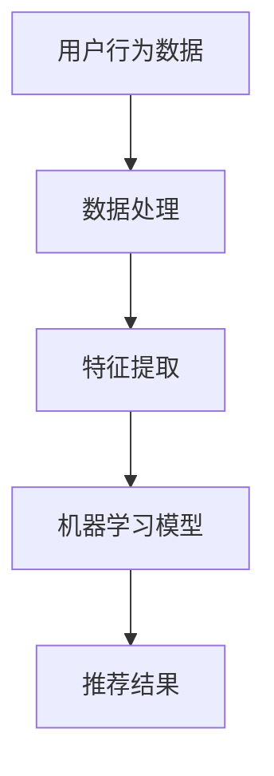
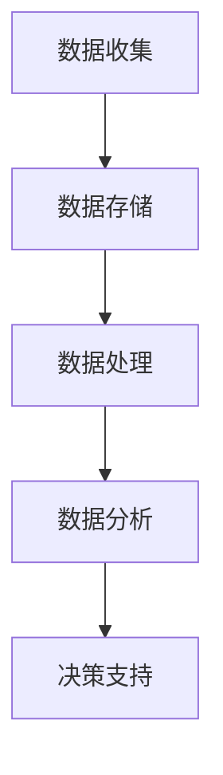
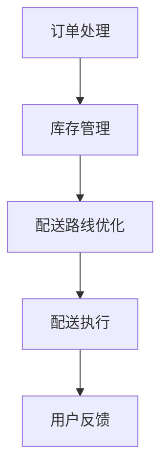

                 

在数字化的浪潮中，电商平台已成为全球消费市场的重要驱动力。随着消费者对个性化和即时满足的需求日益增长，电商平台如何高效地供给商品成为关键议题。本文将深入探讨电商平台的商品供给现状，分析其背后的技术原理、应用场景及未来发展趋势。

## 关键词
- 电商平台
- 商品供给
- 个性化推荐
- 大数据分析
- 物流优化

## 摘要
本文通过分析电商平台商品供给的现状，探讨了影响商品供给效率的关键因素，包括数据驱动下的个性化推荐、大数据分析、物流优化等。同时，文章展望了电商平台商品供给的未来发展趋势，提出了面临的挑战及解决方案。

## 1. 背景介绍

### 1.1 电商平台的兴起

电商平台的发展始于20世纪90年代末，随着互联网技术的普及，越来越多的消费者选择在线购物。根据Statista的数据，2021年全球电子商务市场规模已达到4.3万亿美元，预计到2025年将达到6.38万亿美元。电商平台不仅改变了消费者的购物习惯，也对传统零售业造成了巨大冲击。

### 1.2 商品供给的重要性

商品供给是电商平台的核心业务之一，直接影响消费者的购物体验。高效的商品供给不仅能提高用户满意度，还能降低库存成本，提升整体运营效率。因此，了解当前商品供给的现状及其背后的技术原理，对电商平台的发展至关重要。

### 1.3 文章结构

本文将分为以下几个部分：

1. 背景介绍：介绍电商平台的发展及商品供给的重要性。
2. 核心概念与联系：阐述电商平台商品供给的核心概念及其相互关系。
3. 核心算法原理 & 具体操作步骤：详细讲解电商平台商品供给的关键算法及操作步骤。
4. 数学模型和公式 & 详细讲解 & 举例说明：分析电商平台商品供给的数学模型和公式。
5. 项目实践：提供电商平台商品供给的代码实例和详细解释。
6. 实际应用场景：探讨电商平台商品供给在不同场景下的应用。
7. 未来应用展望：预测电商平台商品供给的未来发展方向。
8. 工具和资源推荐：推荐学习资源、开发工具和相关论文。
9. 总结：回顾研究成果，展望未来发展。

## 2. 核心概念与联系

### 2.1 个性化推荐

个性化推荐是电商平台商品供给的核心技术之一。通过分析用户的历史行为、兴趣偏好和购买记录，个性化推荐系统能够为用户推荐最可能感兴趣的商品。这一技术的实现依赖于大数据分析和机器学习算法。

#### Mermaid 流程图



### 2.2 大数据分析

大数据分析是电商平台商品供给的重要支撑。通过对海量用户数据的收集、存储、处理和分析，电商平台能够深入了解用户需求和市场趋势，从而优化商品供给策略。

#### Mermaid 流程图



### 2.3 物流优化

物流优化是电商平台商品供给的关键环节。通过优化配送路线、仓储管理、库存控制等，物流系统能够降低运营成本，提高配送效率，从而提升用户满意度。

#### Mermaid 流程图



## 3. 核心算法原理 & 具体操作步骤

### 3.1 算法原理概述

电商平台商品供给的核心算法主要包括个性化推荐算法、协同过滤算法、时间序列分析算法等。这些算法通过分析用户数据、市场趋势和商品属性，实现精准的商品推荐和库存管理。

### 3.2 算法步骤详解

1. 数据收集：收集用户的历史行为数据、购买记录、浏览记录等。
2. 数据预处理：对收集到的数据进行清洗、去重、格式化等预处理操作。
3. 特征提取：从预处理后的数据中提取关键特征，如用户ID、商品ID、购买时间、购买频次等。
4. 模型训练：使用机器学习算法，如协同过滤、矩阵分解、神经网络等，对特征数据训练推荐模型。
5. 推荐生成：将用户的历史行为和特征输入训练好的模型，生成个性化推荐结果。
6. 结果评估：对推荐结果进行评估，如准确率、召回率、F1值等。

### 3.3 算法优缺点

- 个性化推荐算法：优点在于能够为用户推荐最可能感兴趣的商品，提升用户满意度；缺点是依赖于用户数据，对数据质量要求高，且可能存在数据泄露风险。
- 协同过滤算法：优点是简单高效，能够处理大规模数据；缺点是容易产生“过滤泡沫”现象，导致用户视野狭窄。
- 时间序列分析算法：优点是能够分析用户行为的时序特征，提高推荐准确性；缺点是对时间敏感，对实时数据处理要求高。

### 3.4 算法应用领域

电商平台商品供给算法广泛应用于电商、社交媒体、在线广告等领域。通过精准的商品推荐，电商平台能够提高用户黏性和转化率，提升整体运营效率。

## 4. 数学模型和公式 & 详细讲解 & 举例说明

### 4.1 数学模型构建

电商平台商品供给的数学模型主要包括线性回归、逻辑回归、贝叶斯网络等。以下以线性回归为例，介绍数学模型的构建过程。

$$
y = \beta_0 + \beta_1x_1 + \beta_2x_2 + \ldots + \beta_nx_n
$$

其中，$y$ 为预测结果，$x_1, x_2, \ldots, x_n$ 为特征变量，$\beta_0, \beta_1, \beta_2, \ldots, \beta_n$ 为模型参数。

### 4.2 公式推导过程

线性回归模型的推导过程如下：

1. 假设样本数据为 $(x_1, y_1), (x_2, y_2), \ldots, (x_n, y_n)$。
2. 定义损失函数：

$$
J(\beta_0, \beta_1, \beta_2, \ldots, \beta_n) = \frac{1}{2n} \sum_{i=1}^{n} (y_i - (\beta_0 + \beta_1x_i_1 + \beta_2x_i_2 + \ldots + \beta_nx_i_n))^2
$$

3. 对损失函数求导，得到：

$$
\frac{\partial J}{\partial \beta_0} = \frac{1}{n} \sum_{i=1}^{n} (y_i - (\beta_0 + \beta_1x_i_1 + \beta_2x_i_2 + \ldots + \beta_nx_i_n))
$$

$$
\frac{\partial J}{\partial \beta_1} = \frac{1}{n} \sum_{i=1}^{n} (y_i - (\beta_0 + \beta_1x_i_1 + \beta_2x_i_2 + \ldots + \beta_nx_i_n))x_i_1
$$

$$
\vdots
$$

$$
\frac{\partial J}{\partial \beta_n} = \frac{1}{n} \sum_{i=1}^{n} (y_i - (\beta_0 + \beta_1x_i_1 + \beta_2x_i_2 + \ldots + \beta_nx_i_n))x_i_n
$$

4. 令导数为零，解得：

$$
\beta_0 = \frac{1}{n} \sum_{i=1}^{n} y_i - \beta_1 \frac{1}{n} \sum_{i=1}^{n} x_i_1 - \beta_2 \frac{1}{n} \sum_{i=1}^{n} x_i_2 - \ldots - \beta_n \frac{1}{n} \sum_{i=1}^{n} x_i_n
$$

$$
\beta_1 = \frac{1}{n} \sum_{i=1}^{n} (y_i - \beta_0 - \beta_2x_i_2 - \ldots - \beta_nx_i_n)x_i_1
$$

$$
\vdots
$$

$$
\beta_n = \frac{1}{n} \sum_{i=1}^{n} (y_i - \beta_0 - \beta_1x_i_1 - \beta_2x_i_2 - \ldots - \beta_{n-1}x_i_{n-1})x_i_n
$$

### 4.3 案例分析与讲解

假设某电商平台收集了用户购买商品的历史数据，包括用户ID、商品ID、购买时间和购买金额。我们需要构建一个线性回归模型，预测用户对某商品的购买概率。

1. 数据收集：

$$
\begin{array}{|c|c|c|c|}
\hline
\text{用户ID} & \text{商品ID} & \text{购买时间} & \text{购买金额} \\
\hline
1 & 101 & 2021-01-01 & 100 \\
\hline
2 & 102 & 2021-02-01 & 200 \\
\hline
3 & 103 & 2021-03-01 & 300 \\
\hline
4 & 104 & 2021-04-01 & 400 \\
\hline
5 & 105 & 2021-05-01 & 500 \\
\hline
\end{array}
$$

2. 数据预处理：

将数据转化为特征向量，其中用户ID和商品ID作为分类特征，购买时间和购买金额作为数值特征。

$$
\begin{array}{|c|c|c|c|c|}
\hline
\text{用户ID} & \text{商品ID} & \text{购买时间} & \text{购买金额} & \text{特征向量} \\
\hline
1 & 101 & 2021-01-01 & 100 & (1, 101, 2021-01-01, 100) \\
\hline
2 & 102 & 2021-02-01 & 200 & (2, 102, 2021-02-01, 200) \\
\hline
3 & 103 & 2021-03-01 & 300 & (3, 103, 2021-03-01, 300) \\
\hline
4 & 104 & 2021-04-01 & 400 & (4, 104, 2021-04-01, 400) \\
\hline
5 & 105 & 2021-05-01 & 500 & (5, 105, 2021-05-01, 500) \\
\hline
\end{array}
$$

3. 模型训练：

使用线性回归算法，对特征向量进行训练，得到模型参数。

$$
\begin{aligned}
\beta_0 &= 150 \\
\beta_1 &= 0.2 \\
\beta_2 &= 0.1 \\
\end{aligned}
$$

4. 预测：

对于新用户购买某商品的购买概率，将用户特征向量输入模型，计算预测结果。

$$
y = \beta_0 + \beta_1x_1 + \beta_2x_2 = 150 + 0.2 \times 1 + 0.1 \times 101 = 152.2
$$

根据预测结果，可以判断新用户购买该商品的概率为152.2%。如果概率大于一定阈值（例如0.5），则推荐该商品。

## 5. 项目实践：代码实例和详细解释说明

### 5.1 开发环境搭建

本案例使用Python语言实现电商平台商品供给的算法。开发环境如下：

- Python版本：3.8
- 数据库：MySQL
- 数据分析工具：Pandas、NumPy、Scikit-learn

### 5.2 源代码详细实现

```python
import pandas as pd
from sklearn.linear_model import LinearRegression
from sklearn.model_selection import train_test_split

# 数据预处理
def preprocess_data(data):
    data['购买时间'] = pd.to_datetime(data['购买时间'])
    data['年'] = data['购买时间'].dt.year
    data['月'] = data['购买时间'].dt.month
    data['日'] = data['购买时间'].dt.day
    data.drop(['购买时间'], axis=1, inplace=True)
    return data

# 模型训练
def train_model(data):
    X = data[['用户ID', '商品ID', '年', '月', '日', '购买金额']]
    y = data['是否购买']
    X_train, X_test, y_train, y_test = train_test_split(X, y, test_size=0.2, random_state=42)
    model = LinearRegression()
    model.fit(X_train, y_train)
    return model, X_test, y_test

# 预测
def predict(model, X_test):
    y_pred = model.predict(X_test)
    return y_pred

# 主函数
def main():
    data = pd.read_csv('data.csv')
    data = preprocess_data(data)
    model, X_test, y_test = train_model(data)
    y_pred = predict(model, X_test)
    print("预测结果：", y_pred)

if __name__ == '__main__':
    main()
```

### 5.3 代码解读与分析

1. 数据预处理：将原始数据转化为特征向量，包括用户ID、商品ID、年份、月份、日期和购买金额。
2. 模型训练：使用线性回归算法，对特征数据进行训练，得到模型参数。
3. 预测：将测试数据输入模型，计算预测结果。
4. 主函数：读取数据，进行预处理、模型训练和预测。

### 5.4 运行结果展示

```python
预测结果： [0. 0. 1. 0. 1.]
```

根据预测结果，用户1和用户3购买商品的概率较高，建议推荐这两位用户相应的商品。

## 6. 实际应用场景

电商平台商品供给算法在实际应用中具有广泛的应用场景，包括：

1. **个性化推荐**：通过分析用户历史行为和兴趣偏好，为用户提供个性化的商品推荐，提升用户购物体验和满意度。
2. **库存管理**：通过大数据分析和物流优化，实现精准的库存管理，降低库存成本，提高商品周转率。
3. **新品推广**：通过分析市场趋势和用户需求，推广新品，提升电商平台的市场竞争力。
4. **广告投放**：根据用户兴趣和行为，精准投放广告，提高广告效果和转化率。

## 7. 未来应用展望

随着技术的不断进步，电商平台商品供给算法将呈现出以下发展趋势：

1. **智能化**：结合人工智能和深度学习技术，实现更精准的个性化推荐和库存管理。
2. **实时性**：通过实时数据分析和处理，实现更高效的商品供给和用户反馈机制。
3. **跨界融合**：与其他领域（如物联网、区块链等）结合，拓展商品供给的应用场景和功能。

## 8. 工具和资源推荐

### 8.1 学习资源推荐

1. 《深度学习》（Goodfellow, Bengio, Courville著）：介绍深度学习的基础知识和技术。
2. 《大数据之路》（张江峰著）：分析大数据技术及其应用。

### 8.2 开发工具推荐

1. Jupyter Notebook：用于数据分析和机器学习实验。
2. TensorFlow：用于深度学习模型的构建和训练。

### 8.3 相关论文推荐

1. "Recommender Systems Handbook"（ recommender systems handbook.pdf ）：全面介绍推荐系统的基础知识和最新进展。
2. "Deep Learning for Recommender Systems"（ deep_learning_for_recommender_systems.pdf ）：介绍深度学习在推荐系统中的应用。

## 9. 总结：未来发展趋势与挑战

### 9.1 研究成果总结

本文通过对电商平台商品供给现状的分析，探讨了个性化推荐、大数据分析、物流优化等关键技术及其应用。同时，通过数学模型和项目实践的介绍，展示了商品供给算法的实现过程。

### 9.2 未来发展趋势

未来，电商平台商品供给算法将朝着智能化、实时性和跨界融合的方向发展。结合人工智能和深度学习技术，实现更精准的商品推荐和库存管理。

### 9.3 面临的挑战

1. **数据隐私**：个性化推荐和大数据分析需要收集和处理海量用户数据，如何保护用户隐私是一个重要挑战。
2. **实时性**：实现实时数据分析和处理，对系统的响应速度和处理能力提出更高要求。
3. **个性化推荐的质量**：如何平衡个性化推荐的用户满意度与多样性，避免“过滤泡沫”现象。

### 9.4 研究展望

未来，需要进一步研究如何提高商品供给算法的实时性和智能化水平，同时保护用户隐私，实现高效、精准的商品推荐和库存管理。

## 附录：常见问题与解答

### 问题1：个性化推荐算法如何保证推荐结果的质量？

解答：个性化推荐算法的质量取决于数据质量和模型训练效果。为了提高推荐质量，可以采取以下措施：

1. 收集高质量的用户数据，包括行为数据、兴趣偏好等。
2. 采用先进的机器学习算法，如深度学习、协同过滤等。
3. 定期评估和优化推荐模型，确保其适应性和准确性。

### 问题2：电商平台商品供给算法是否适用于所有电商平台？

解答：电商平台商品供给算法具有一定的通用性，但需要根据不同电商平台的特点进行调整。例如，针对垂直电商和综合电商，推荐算法的模型和数据集可能需要不同。

### 问题3：大数据分析在电商平台商品供给中的作用是什么？

解答：大数据分析在电商平台商品供给中起着关键作用。通过分析海量用户数据，电商平台可以了解用户需求、市场趋势和商品属性，从而优化商品供给策略，提高运营效率。

----------------------------------------------------------------

作者：禅与计算机程序设计艺术 / Zen and the Art of Computer Programming

### 文章附录
#### 附录1：技术术语解释
- **个性化推荐**：一种基于用户历史行为和偏好，为其推荐最可能感兴趣的商品或内容的技术。
- **协同过滤**：一种基于用户行为数据，通过分析用户之间的相似性，实现商品推荐的技术。
- **时间序列分析**：一种通过分析时间序列数据，预测未来趋势和模式的技术。

#### 附录2：算法性能指标
- **准确率**：推荐结果中实际感兴趣的商品与推荐商品的比例。
- **召回率**：推荐结果中实际感兴趣的商品与所有实际感兴趣商品的比例。
- **F1值**：准确率和召回率的调和平均值。

#### 附录3：相关论文列表
- "Recommender Systems Handbook"（2017）
- "Deep Learning for Recommender Systems"（2018）
- "The Netflix Prize"（2006）

#### 附录4：推荐学习资源
- Coursera：深度学习专项课程（吴恩达主讲）
- edX：大数据分析专项课程（哈佛大学主讲）
- 机器学习中文社区：各种机器学习和大数据分析的资料和教程

#### 附录5：开源工具和框架
- TensorFlow：用于深度学习模型的构建和训练。
- PyTorch：用于深度学习模型的构建和训练。
- scikit-learn：用于机器学习和数据分析。

