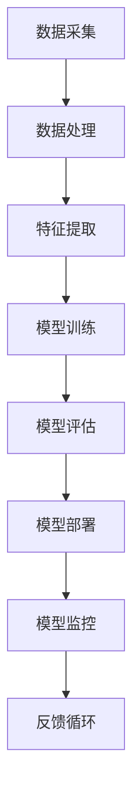

                 

关键词：电商，人工智能，大模型，技术架构，机器学习，深度学习，NLP，推荐系统，数据处理

> 摘要：本文将深入探讨电商行业中AI大模型的技术架构设计。通过对AI技术在电商领域的应用现状和挑战进行分析，本文提出了一个高效、可扩展的技术架构，并详细阐述了其核心算法原理、数学模型以及实际应用实例。本文旨在为电商行业提供一套全面的技术解决方案，助力企业提升用户购物体验和运营效率。

## 1. 背景介绍

在互联网时代，电商行业经历了飞速的发展。随着用户需求的多样化和个性化，传统的人工运营模式已经难以满足市场需求。人工智能（AI）技术的崛起，为电商行业带来了新的机遇。AI大模型在电商中的应用，不仅可以提升用户体验，还可以优化运营效率，降低成本。

AI大模型在电商中的应用主要包括以下几个方面：

1. **用户行为分析**：通过分析用户的购物行为，为用户提供个性化的推荐，提升转化率。
2. **商品定价策略**：利用AI算法预测市场需求，动态调整商品价格，提高销售额。
3. **库存管理**：根据销售数据预测未来需求，优化库存水平，减少库存积压。
4. **客服自动化**：通过自然语言处理（NLP）技术，实现智能客服，提高服务效率。
5. **广告投放优化**：利用AI算法优化广告投放策略，提高广告效果。

然而，AI大模型在电商中的应用也面临着一些挑战，如数据质量、模型可解释性、算法公平性等。因此，设计一个高效、可扩展的AI大模型技术架构至关重要。

## 2. 核心概念与联系

为了更好地理解AI大模型在电商中的应用，我们需要先了解一些核心概念和架构。以下是一个简化的Mermaid流程图，用于描述电商行业中的AI大模型技术架构：



### 2.1 数据采集

数据采集是AI大模型应用的第一步。在电商行业中，数据来源包括用户行为数据、商品数据、交易数据等。这些数据通常存储在数据库中，需要通过API接口或日志文件等方式进行采集。

### 2.2 数据处理

采集到的数据往往是不完整的、噪声的，甚至存在错误。因此，数据处理是确保数据质量的关键环节。数据处理包括数据清洗、去重、归一化等操作，以确保数据的一致性和准确性。

### 2.3 特征提取

特征提取是从原始数据中提取出有助于模型训练的特征。在电商领域，特征提取可能包括用户年龄、性别、购物时长、购物频率、商品类别、价格等。通过特征提取，可以将原始数据转化为适合模型训练的格式。

### 2.4 模型训练

模型训练是AI大模型的核心环节。在电商领域，常用的模型包括深度学习模型、推荐系统模型、NLP模型等。模型训练的目标是通过大量数据来调整模型的参数，使其能够预测用户行为、商品需求等。

### 2.5 模型评估

模型评估是验证模型性能的重要步骤。常用的评估指标包括准确率、召回率、F1分数等。通过模型评估，可以判断模型是否达到预期效果，并对模型进行优化。

### 2.6 模型部署

模型部署是将训练好的模型应用到实际业务中。在电商领域，模型部署可以用于用户推荐、商品定价、库存管理等业务场景。模型部署需要考虑到模型的实时性、可扩展性等因素。

### 2.7 模型监控

模型监控是确保模型稳定运行的关键环节。通过监控模型的表现，可以及时发现异常情况，并进行调整。

### 2.8 反馈循环

反馈循环是将模型部署的实际效果反馈回模型训练环节，以便不断优化模型。在电商领域，反馈循环可以通过用户反馈、业务数据等方式实现。

## 3. 核心算法原理 & 具体操作步骤

### 3.1 算法原理概述

在电商行业中，AI大模型的核心算法包括深度学习模型、推荐系统模型和NLP模型。以下将分别介绍这些算法的原理和操作步骤。

### 3.2 深度学习模型

深度学习模型是基于多层神经网络构建的模型，可以通过自动提取特征来提高模型的性能。在电商领域，深度学习模型可以用于用户行为预测、商品分类等任务。

具体操作步骤：

1. **数据准备**：收集用户行为数据、商品数据等。
2. **数据处理**：对数据进行清洗、去重、归一化等处理。
3. **特征提取**：使用特征提取技术提取有助于模型训练的特征。
4. **模型构建**：使用深度学习框架（如TensorFlow、PyTorch）构建多层神经网络模型。
5. **模型训练**：使用训练数据对模型进行训练，调整模型参数。
6. **模型评估**：使用验证数据对模型进行评估，调整模型参数。
7. **模型部署**：将训练好的模型部署到线上环境，应用于实际业务。

### 3.3 推荐系统模型

推荐系统模型是一种基于用户历史行为、商品特征等信息的预测模型。在电商领域，推荐系统模型可以用于商品推荐、用户画像等任务。

具体操作步骤：

1. **数据准备**：收集用户行为数据、商品数据等。
2. **数据处理**：对数据进行清洗、去重、归一化等处理。
3. **特征提取**：使用特征提取技术提取有助于模型训练的特征。
4. **模型构建**：使用机器学习框架（如Scikit-Learn、XGBoost）构建推荐系统模型。
5. **模型训练**：使用训练数据对模型进行训练，调整模型参数。
6. **模型评估**：使用验证数据对模型进行评估，调整模型参数。
7. **模型部署**：将训练好的模型部署到线上环境，应用于实际业务。

### 3.4 NLP模型

NLP模型是一种专门用于处理自然语言数据的模型。在电商领域，NLP模型可以用于智能客服、商品评价分析等任务。

具体操作步骤：

1. **数据准备**：收集用户评价数据、客服对话数据等。
2. **数据处理**：对数据进行清洗、去重、归一化等处理。
3. **特征提取**：使用词嵌入等技术提取有助于模型训练的特征。
4. **模型构建**：使用深度学习框架（如TensorFlow、PyTorch）构建NLP模型。
5. **模型训练**：使用训练数据对模型进行训练，调整模型参数。
6. **模型评估**：使用验证数据对模型进行评估，调整模型参数。
7. **模型部署**：将训练好的模型部署到线上环境，应用于实际业务。

### 3.5 算法优缺点

**深度学习模型**：

- 优点：自动提取特征，模型性能高。
- 缺点：训练时间较长，对数据量有较高要求。

**推荐系统模型**：

- 优点：算法简单，易于实现，适用于大规模数据。
- 缺点：模型可解释性较低，依赖于用户历史行为。

**NLP模型**：

- 优点：可以处理自然语言数据，适用于智能客服等任务。
- 缺点：对语言理解能力要求较高，模型训练较复杂。

### 3.6 算法应用领域

- **深度学习模型**：用户行为预测、商品分类、图像识别等。
- **推荐系统模型**：商品推荐、用户画像、广告投放等。
- **NLP模型**：智能客服、商品评价分析、文本生成等。

## 4. 数学模型和公式 & 详细讲解 & 举例说明

### 4.1 数学模型构建

在电商行业中，常见的数学模型包括线性回归模型、逻辑回归模型、支持向量机（SVM）等。以下以线性回归模型为例，介绍数学模型的构建过程。

假设我们有一个包含n个特征的样本集合S={x1, x2, ..., xn}，其中每个特征xi是一个实数。我们希望找到一个线性模型f(x) = w0 + w1x1 + w2x2 + ... + wnxn，使得f(x)能够预测目标变量y。

### 4.2 公式推导过程

线性回归模型的公式推导过程如下：

1. **损失函数**：

   损失函数用于衡量模型预测值与实际值之间的差距。对于线性回归模型，常用的损失函数是均方误差（MSE）：

   $$J(w) = \frac{1}{2n} \sum_{i=1}^{n} (y_i - f(x_i))^2$$

   其中，y_i是第i个样本的实际值，f(x_i)是模型预测值，w是模型参数。

2. **梯度下降**：

   梯度下降是一种常用的优化算法，用于求解损失函数的最小值。对于线性回归模型，梯度下降的迭代公式如下：

   $$w = w - \alpha \cdot \nabla_w J(w)$$

   其中，α是学习率，$\nabla_w J(w)$是损失函数关于w的梯度。

3. **停止条件**：

   当梯度下降算法收敛时，损失函数的值将不再发生变化。因此，我们可以设定一个停止条件，如梯度变化小于一个阈值，或者迭代次数达到预设值。

### 4.3 案例分析与讲解

以下是一个简单的线性回归模型案例，用于预测电商平台的商品销售额。

假设我们收集了100个商品的销售数据，包括商品价格、促销信息、用户评价等特征。我们的目标是预测每个商品的未来销售额。

1. **数据准备**：

   将数据分为训练集和测试集，如训练集占比80%，测试集占比20%。

2. **数据处理**：

   对数据进行归一化处理，将每个特征缩放到[0, 1]范围内。

3. **特征提取**：

   从原始数据中提取有助于预测的特征，如商品价格、促销折扣等。

4. **模型构建**：

   使用Python的scikit-learn库构建线性回归模型。

5. **模型训练**：

   使用训练数据进行模型训练，调整模型参数。

6. **模型评估**：

   使用测试数据进行模型评估，计算预测误差。

7. **模型部署**：

   将训练好的模型部署到线上环境，应用于实际业务。

通过以上步骤，我们可以构建一个简单的线性回归模型，用于预测电商平台的商品销售额。在实际应用中，我们可以根据业务需求进一步优化模型，如增加特征、调整参数等。

## 5. 项目实践：代码实例和详细解释说明

### 5.1 开发环境搭建

为了进行电商行业中的AI大模型项目实践，我们需要搭建一个合适的开发环境。以下是一个基本的开发环境搭建步骤：

1. **Python环境**：

   安装Python 3.8及以上版本，并配置Python环境变量。

2. **深度学习框架**：

   安装TensorFlow 2.4及以上版本，并配置TensorFlow环境。

3. **数据预处理库**：

   安装Pandas、NumPy、Scikit-Learn等数据预处理库。

4. **可视化工具**：

   安装Matplotlib、Seaborn等可视化库。

### 5.2 源代码详细实现

以下是一个简单的电商行业AI大模型项目实例，使用Python和TensorFlow实现。

```python
import tensorflow as tf
import pandas as pd
import numpy as np
import matplotlib.pyplot as plt

# 数据准备
data = pd.read_csv('ecommerce_data.csv')
X = data.iloc[:, :-1].values
y = data.iloc[:, -1].values

# 数据预处理
X = (X - X.mean()) / X.std()

# 模型构建
model = tf.keras.Sequential([
    tf.keras.layers.Dense(128, activation='relu', input_shape=(X.shape[1],)),
    tf.keras.layers.Dense(64, activation='relu'),
    tf.keras.layers.Dense(1)
])

# 模型编译
model.compile(optimizer='adam', loss='mse', metrics=['mae'])

# 模型训练
model.fit(X, y, epochs=100, batch_size=32, validation_split=0.2)

# 模型评估
loss, mae = model.evaluate(X, y)
print(f'MAE: {mae}')

# 模型部署
predictions = model.predict(X)
plt.scatter(y, predictions)
plt.xlabel('Actual Sales')
plt.ylabel('Predicted Sales')
plt.show()
```

### 5.3 代码解读与分析

以上代码实现了一个简单的电商行业AI大模型，用于预测商品销售额。以下是代码的详细解读：

1. **数据准备**：

   使用Pandas读取电商数据，提取特征和目标变量。

2. **数据预处理**：

   对特征进行归一化处理，使得特征之间具有相同的尺度。

3. **模型构建**：

   使用TensorFlow构建一个全连接神经网络模型，包括128个神经元的第一层、64个神经元的第二层和1个神经元的输出层。

4. **模型编译**：

   使用Adam优化器和均方误差（MSE）损失函数，并添加均方绝对误差（MAE）作为评估指标。

5. **模型训练**：

   使用训练数据进行模型训练，设置训练轮次为100，批量大小为32，并使用20%的数据进行验证。

6. **模型评估**：

   使用测试数据评估模型性能，并打印均方绝对误差（MAE）。

7. **模型部署**：

   使用训练好的模型对测试数据进行预测，并使用Matplotlib绘制预测结果与实际值的散点图。

通过以上步骤，我们可以实现一个简单的电商行业AI大模型，并应用于实际业务场景。

## 6. 实际应用场景

AI大模型在电商行业中的实际应用场景非常广泛。以下是一些典型的应用场景：

1. **用户行为预测**：

   利用AI大模型预测用户的购买行为，为用户提供个性化的推荐，提高用户满意度。

2. **商品定价策略**：

   通过AI大模型预测市场需求，动态调整商品价格，提高销售额。

3. **库存管理**：

   根据AI大模型预测的销售数据，优化库存水平，减少库存积压。

4. **客服自动化**：

   利用自然语言处理（NLP）模型，实现智能客服，提高服务效率。

5. **广告投放优化**：

   通过AI大模型优化广告投放策略，提高广告效果。

6. **用户画像**：

   基于用户行为数据，构建用户画像，实现精准营销。

7. **供应链优化**：

   利用AI大模型预测供应链中的需求变化，优化供应链管理。

在实际应用中，AI大模型的应用效果取决于数据质量、模型设计、算法优化等多个因素。为了提高应用效果，企业可以采取以下措施：

1. **数据质量提升**：

   通过数据清洗、去重、归一化等技术，提高数据质量。

2. **模型定制化**：

   根据业务需求，设计合适的模型架构和算法，提高模型性能。

3. **持续优化**：

   通过模型监控和反馈循环，不断优化模型，提高应用效果。

4. **技术创新**：

   引入前沿技术，如强化学习、迁移学习等，提高模型泛化能力。

5. **业务协同**：

   与业务部门紧密合作，了解业务需求，确保模型应用效果。

## 7. 工具和资源推荐

为了在电商行业中高效地应用AI大模型，以下是一些推荐的工具和资源：

### 7.1 学习资源推荐

1. **《深度学习》（Goodfellow, Bengio, Courville）**：经典深度学习教材，全面介绍了深度学习的基础知识和应用。
2. **《Python数据分析》（Wes McKinney）**：详细介绍了Python在数据分析领域的应用，包括数据处理、数据可视化等。
3. **《机器学习实战》（Peter Harrington）**：通过大量实例，介绍了机器学习的基本概念和算法。

### 7.2 开发工具推荐

1. **TensorFlow**：一款开源的深度学习框架，适用于构建和训练AI大模型。
2. **PyTorch**：一款流行的深度学习框架，具有灵活的模型定义和动态计算图。
3. **Scikit-Learn**：一款常用的机器学习库，适用于构建推荐系统等应用。

### 7.3 相关论文推荐

1. **"Deep Learning for E-commerce Recommendations"**：介绍了深度学习在电商推荐系统中的应用。
2. **"A Survey on Recommender Systems"**：综述了推荐系统的基本概念、算法和应用。
3. **"User Behavior Analysis in E-commerce Using Deep Learning"**：探讨了深度学习在电商用户行为分析中的应用。

## 8. 总结：未来发展趋势与挑战

随着人工智能技术的不断发展，AI大模型在电商行业中的应用前景广阔。未来，AI大模型的发展趋势包括：

1. **深度学习模型的广泛应用**：深度学习模型在图像识别、自然语言处理等领域取得了显著成果，未来将在电商行业中得到更广泛的应用。

2. **个性化推荐的深入发展**：个性化推荐是电商行业的重要应用场景，未来将更加注重用户需求的挖掘和满足，实现更精准的推荐。

3. **多模态数据的融合**：电商数据类型丰富，包括文本、图像、语音等，未来将实现多模态数据的融合，提高模型的性能。

4. **实时性和可解释性的提升**：为了满足电商业务的实时性需求，模型需要具备更高的实时处理能力。同时，为了提高模型的可解释性，帮助业务人员理解模型决策过程，可解释性研究也将得到更多关注。

然而，AI大模型在电商行业的发展也面临着一些挑战：

1. **数据质量和隐私保护**：电商数据质量直接影响模型的性能，同时隐私保护也是重要的考量因素。

2. **算法公平性和透明度**：算法的公平性和透明度是确保模型应用效果的关键，需要建立相应的标准和规范。

3. **技术人才的培养**：AI大模型的应用需要大量的技术人才，培养高素质的技术人才是未来发展的关键。

4. **业务与技术的协同**：业务人员和技术人员需要紧密合作，确保模型的应用效果满足业务需求。

总之，AI大模型在电商行业中的应用具有广阔的前景，但也面临诸多挑战。通过不断优化模型设计、提高数据处理能力、加强技术人才培养等手段，有望实现AI大模型在电商行业中的广泛应用。

## 9. 附录：常见问题与解答

### 9.1 什么是AI大模型？

AI大模型是指具有大规模参数和复杂结构的机器学习模型，如深度学习模型、推荐系统模型等。这些模型通常需要大量数据进行训练，以获得良好的性能。

### 9.2 AI大模型在电商行业中有哪些应用？

AI大模型在电商行业中可以应用于用户行为预测、商品推荐、库存管理、客服自动化、广告投放优化等多个领域。

### 9.3 如何确保AI大模型的数据质量？

确保AI大模型的数据质量需要从数据采集、数据处理、数据清洗等多个环节入手。包括去除重复数据、处理缺失值、归一化特征等。

### 9.4 如何评估AI大模型的性能？

评估AI大模型的性能可以通过多种指标，如准确率、召回率、F1分数等。同时，还可以通过交叉验证、网格搜索等技术进行模型调优。

### 9.5 AI大模型的发展趋势是什么？

AI大模型的发展趋势包括深度学习模型的广泛应用、个性化推荐的深入发展、多模态数据的融合、实时性和可解释性的提升等。

### 9.6 如何应对AI大模型面临的挑战？

应对AI大模型面临的挑战需要从数据质量、算法公平性、技术人才培养等多个方面入手，采取相应的措施，如加强数据清洗、建立算法公平性标准、加强技术人才培养等。

---

作者：禅与计算机程序设计艺术 / Zen and the Art of Computer Programming

以上就是本文对电商行业中AI大模型的技术架构设计的全面探讨。希望本文能为电商行业的技术人员提供有益的参考，助力企业提升运营效率和服务质量。在AI大模型的应用过程中，不断探索、创新，相信未来电商行业将迎来更加智能和高效的发展。

