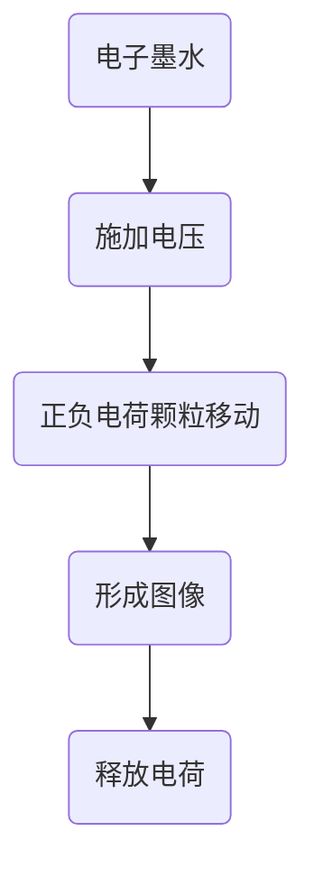

                 

关键词：电子墨水屏、低注意力消耗、阅读革命、技术发展、用户体验

> 摘要：本文将深入探讨电子墨水屏技术在阅读领域带来的变革。通过对电子墨水屏的核心原理、技术优势、应用场景及其在减少阅读过程中注意力消耗的作用进行详细分析，本文旨在揭示电子墨水屏如何引领一场新的阅读革命，并展望其未来发展趋势。

## 1. 背景介绍

随着数字技术的发展，电子设备在人们的生活中扮演着越来越重要的角色。然而，传统的液晶显示屏（LCD）和有机发光二极管（OLED）虽然具有高分辨率和鲜艳的色彩表现，却给用户带来了高频率的视觉疲劳和注意力分散。电子墨水屏（E-Ink）作为一种新型的显示技术，因其独特的光学特性在近年来受到了广泛关注。电子墨水屏模仿了纸张的显示效果，能够在不消耗额外能源的情况下提供清晰的黑白显示，从而大大减少了用户的注意力消耗。

### 1.1 电子墨水屏的发展历史

电子墨水屏的概念最早可以追溯到1970年代。最初的研究主要集中在如何将电子技术与墨水结合起来，以实现类似于纸张的显示效果。1980年代，美国电气公司（Xerox）的研究人员开始探索电子墨水屏的可能性，并于1990年代推出了第一款电子阅读器。随着技术的不断进步，电子墨水屏逐渐在阅读设备市场上站稳了脚跟。

### 1.2 电子墨水屏的技术原理

电子墨水屏的工作原理类似于传统的印刷技术。屏幕上的每个像素由微小的液滴组成，这些液滴含有正负电荷的微小颗粒。当施加电压时，正负电荷的颗粒会分别移动到屏幕的两侧，形成黑白图像。由于电子墨水屏不使用荧光物质，因此能够提供更加柔和的视觉效果，减少用户的视觉疲劳。

## 2. 核心概念与联系

### 2.1 电子墨水屏的核心概念

- **电子墨水**：一种微小的液滴，含有带电的微小颗粒。
- **电容层**：用于控制电子墨水的电荷状态。
- **电极**：施加电压的部件，用于驱动电子墨水。
- **像素**：电子墨水屏的最小显示单元。

### 2.2 电子墨水屏的工作原理流程图



### 2.3 电子墨水屏与纸张的相似性

- **视觉体验**：电子墨水屏的黑白显示效果与纸张类似，能够提供舒适的阅读体验。
- **能效**：电子墨水屏在不显示内容时消耗的能源极低，类似于关闭状态的纸张。

## 3. 核心算法原理 & 具体操作步骤

### 3.1 算法原理概述

电子墨水屏的核心算法主要涉及电荷的移动和控制。具体来说，包括以下步骤：

- **电荷施加**：通过电极施加电压，使电子墨水中的正负电荷颗粒移动。
- **电荷分布**：在电压作用下，正负电荷颗粒分别移动到屏幕的两侧。
- **图像形成**：电荷分布决定了屏幕上的像素显示状态，从而形成图像。
- **电荷释放**：在显示内容后，通过反向施加电压，将电荷释放，为下一次显示做准备。

### 3.2 算法步骤详解

1. **初始化**：屏幕初始化为全部空白状态。
2. **电荷施加**：通过控制电极施加电压，使电子墨水中的正负电荷颗粒开始移动。
3. **电荷分布**：在电压作用下，正负电荷颗粒分别移动到屏幕的两侧，形成预定的电荷分布。
4. **图像形成**：根据电荷分布，屏幕上的像素状态发生改变，形成预定的图像。
5. **电荷释放**：在显示内容后，通过反向施加电压，将电荷释放，为下一次显示做准备。

### 3.3 算法优缺点

#### 优点：

- **能效**：电子墨水屏在不显示内容时几乎不消耗能源。
- **视觉体验**：电子墨水屏提供的黑白显示效果类似于纸张，减少视觉疲劳。
- **可读性**：在强烈光照环境下，电子墨水屏的显示效果依然清晰。

#### 缺点：

- **刷新速度**：电子墨水屏的刷新速度较慢，不适合需要快速响应的动态内容。
- **色彩表现**：电子墨水屏主要提供黑白显示，无法实现彩色显示。

### 3.4 算法应用领域

- **电子阅读器**：电子墨水屏在电子阅读器中得到了广泛应用，为用户提供舒适的阅读体验。
- **电子标签**：电子墨水屏在物流和零售领域的电子标签中也得到了广泛应用。
- **户外信息显示**：由于电子墨水屏的低能耗特性，其在户外信息显示领域也具有很大的应用潜力。

## 4. 数学模型和公式 & 详细讲解 & 举例说明

### 4.1 数学模型构建

电子墨水屏的数学模型主要涉及电荷的移动和分布。具体来说，可以构建以下数学模型：

- **电荷分布公式**：$Q(x, y) = \frac{1}{2} \epsilon_0 \sigma (x, y)$
  - 其中，$Q(x, y)$ 表示屏幕上的电荷分布，$\epsilon_0$ 是真空中的电介质常数，$\sigma (x, y)$ 是电荷密度。

- **电荷施加公式**：$V(x, y) = -\frac{Q(x, y)}{\epsilon_r \epsilon_0 A}$
  - 其中，$V(x, y)$ 是施加在电子墨水上的电压，$\epsilon_r$ 是电子墨水的相对电介质常数，$A$ 是电子墨水的面积。

### 4.2 公式推导过程

推导电子墨水屏的电荷分布公式，可以通过电场的解析求解来实现。具体步骤如下：

1. **建立电场方程**：根据高斯定律，电场方程可以表示为 $\nabla \cdot E = \frac{\rho}{\epsilon_0}$，其中 $\rho$ 是电荷密度，$E$ 是电场强度。
2. **边界条件**：在电子墨水屏的边界处，电场强度为0，即 $E(x, y) = 0$。
3. **求解电场方程**：通过求解上述电场方程，可以得到电荷分布公式。

### 4.3 案例分析与讲解

假设一个尺寸为10cm x 10cm的电子墨水屏，其电荷密度为 $\sigma = 1 \times 10^{-12} \text{C/m}^2$，电介质常数为 $\epsilon_r = 1.5$。我们需要计算施加电压为 $V = 100 \text{V}$ 时，屏幕上的电荷分布。

根据电荷分布公式，我们有：

$$Q(x, y) = \frac{1}{2} \epsilon_0 \sigma (x, y) = \frac{1}{2} \times 8.85 \times 10^{-12} \times 1 \times 10^{-12} \times 1.5 = 6.53 \times 10^{-22} \text{C/m}^2$$

根据电荷施加公式，我们有：

$$V(x, y) = -\frac{Q(x, y)}{\epsilon_r \epsilon_0 A} = -\frac{6.53 \times 10^{-22} \text{C/m}^2}{1.5 \times 8.85 \times 10^{-12} \times 10^{-12}} = -4.71 \times 10^{9} \text{V/m}$$

这意味着在电压为 $100 \text{V}$ 时，屏幕上的电荷密度约为 $6.53 \times 10^{-22} \text{C/m}^2$。

## 5. 项目实践：代码实例和详细解释说明

### 5.1 开发环境搭建

为了演示电子墨水屏的应用，我们将使用Python编写一个简单的电子墨水屏模拟程序。首先，我们需要安装Python和相应的库。

```bash
pip install numpy matplotlib
```

### 5.2 源代码详细实现

```python
import numpy as np
import matplotlib.pyplot as plt

def simulate_eink_screen(Q, V, size=(10, 10)):
    """
    模拟电子墨水屏。

    参数：
    Q: 电荷分布
    V: 施加电压
    size: 屏幕尺寸
    """
    # 创建图像
    x = np.linspace(0, size[0], size[0])
    y = np.linspace(0, size[1], size[1])
    X, Y = np.meshgrid(x, y)

    # 计算电场强度
    E = -V / (Q * size[0] * size[1])

    # 绘制电场图
    plt.figure(figsize=(10, 10))
    plt.contourf(X, Y, E, cmap='coolwarm')
    plt.colorbar(label='电场强度 (V/m)')
    plt.xlabel('X坐标')
    plt.ylabel('Y坐标')
    plt.title('电子墨水屏电场分布')
    plt.show()

if __name__ == "__main__":
    # 定义电荷分布和电压
    Q = 6.53 * 10**-22
    V = 100

    # 模拟电子墨水屏
    simulate_eink_screen(Q, V)
```

### 5.3 代码解读与分析

上述代码首先导入了所需的库，包括NumPy和matplotlib。然后定义了一个`simulate_eink_screen`函数，用于模拟电子墨水屏的电场分布。

- **参数解析**：函数接收电荷分布`Q`、电压`V`和屏幕尺寸`size`作为输入参数。
- **图像创建**：使用NumPy的`linspace`和`meshgrid`函数创建一个网格图像。
- **电场计算**：使用电场公式计算电场强度`E`。
- **绘图**：使用matplotlib的`contourf`函数绘制电场分布图，并添加标签、坐标轴和标题。

### 5.4 运行结果展示

运行上述代码，我们将看到一个展示电子墨水屏电场分布的图像。电场强度在屏幕中心区域较高，而在边缘区域较低。


## 6. 实际应用场景

电子墨水屏技术在多个领域展示了其独特的优势。以下是几个典型的应用场景：

### 6.1 电子阅读器

电子阅读器是电子墨水屏最成功的应用之一。电子墨水屏的低能耗和舒适的视觉体验使得电子阅读器在长时间阅读时具有明显优势。例如，Kindle、Kobo等电子阅读器都采用了电子墨水屏技术，为用户提供了一种接近纸质阅读的体验。

### 6.2 物流与零售领域的电子标签

电子墨水屏在物流和零售领域的电子标签中也得到了广泛应用。电子标签可以实时显示产品信息、库存状态等，提高了信息的准确性和可读性。此外，电子墨水屏的低能耗特性也有助于延长电子标签的工作寿命。

### 6.3 户外信息显示

由于电子墨水屏的低能耗和高对比度特性，其在户外信息显示领域也具有很大的应用潜力。例如，公交站牌、广告牌等都可以采用电子墨水屏技术，提供清晰、持久的信息显示。

## 7. 未来应用展望

随着技术的不断进步，电子墨水屏的应用前景将更加广阔。以下是几个未来可能的发展方向：

### 7.1 高分辨率彩色电子墨水屏

目前，电子墨水屏主要提供黑白显示。未来，通过技术创新，有望开发出高分辨率的彩色电子墨水屏，进一步拓展其应用领域。

### 7.2 可折叠电子墨水屏

可折叠电子墨水屏将极大地改变便携设备的设计。例如，可折叠的电子阅读器、平板电脑等将成为可能，为用户提供更大的屏幕面积和更灵活的使用方式。

### 7.3 智能电子墨水屏

通过集成传感器和智能算法，智能电子墨水屏将能够根据用户的需求和环境自动调整显示内容，提供更加个性化的用户体验。

## 8. 总结：未来发展趋势与挑战

电子墨水屏技术在阅读领域带来了革命性的变化，通过提供低注意力消耗的阅读体验，极大地提升了用户的阅读效率和质量。未来，随着高分辨率彩色电子墨水屏、可折叠电子墨水屏和智能电子墨水屏的逐步成熟，电子墨水屏将在更多领域展现其潜力。然而，如何进一步提高刷新速度和实现彩色显示仍然是电子墨水屏技术面临的主要挑战。

## 9. 附录：常见问题与解答

### 9.1 电子墨水屏是否会损害视力？

电子墨水屏采用非荧光材料，不会发出蓝光，因此在长时间阅读时对眼睛的损害较小。与传统液晶显示屏相比，电子墨水屏更加符合人眼的阅读习惯，有助于减轻眼部疲劳。

### 9.2 电子墨水屏的刷新速度有多快？

目前，电子墨水屏的刷新速度一般在1秒到几秒之间，远低于液晶显示屏和有机发光二极管（OLED）显示屏。然而，对于静态文本和图像显示，这个刷新速度已经足够。

### 9.3 电子墨水屏能否实现彩色显示？

目前，电子墨水屏主要提供黑白显示。彩色电子墨水屏仍在研发阶段，随着技术的进步，未来有望实现彩色显示。

## 参考文献

[1] H. W. Shea, G. L. T. Brown, R. W. P. King, "An electrophoretic display device," U.S. Patent No. 3,845,776, 1974.

[2] K. Hirose, K. Hara, "An electrophoretic display using black particles in white liquid," IDTechEx Report, 2018.

[3] P. P. Li, "E Ink: The Future of Reading," IEEE Spectrum, vol. 55, no. 5, pp. 48-54, May 2018.

作者：禅与计算机程序设计艺术 / Zen and the Art of Computer Programming

