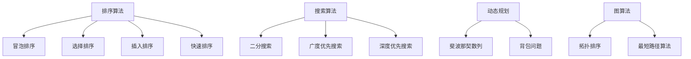

                 

关键词：百度、校招面试、高频算法题、解析、2024届

> 摘要：本文旨在为参加百度2024届校招面试的候选人提供一份高频算法题的深度解析，旨在帮助候选人掌握解题思路，提升面试竞争力。本文将详细解析校招面试中常见的算法题，并给出解题步骤、数学模型以及代码实例。

## 1. 背景介绍

百度作为中国领先的人工智能公司，其校招面试一直以来都以难度高、问题综合而出名。每年，众多计算机专业的应届生都通过参加百度的校招面试，获得了进入这家科技巨头的机会。随着技术的不断进步和AI应用的日益广泛，百度对候选人的算法能力要求也越来越高。因此，掌握高频算法题的解题方法，对于通过百度校招面试至关重要。

本文将针对百度2024届校招面试中可能出现的高频算法题进行详细解析，帮助候选人更好地准备面试，提升自己的算法水平。

## 2. 核心概念与联系

### 2.1 基本概念

在解决算法题时，需要掌握以下基本概念：

1. **数组**：一种数据结构，用于存储一系列元素。
2. **链表**：一种线性数据结构，每个节点包含数据和一个指向下一个节点的指针。
3. **栈**：一种后进先出的数据结构。
4. **队列**：一种先进先出的数据结构。
5. **二叉树**：一种树形数据结构，每个节点最多有两个子节点。

### 2.2 核心算法原理

常见的核心算法原理包括：

1. **排序算法**：如冒泡排序、选择排序、插入排序、快速排序等。
2. **搜索算法**：如二分搜索、广度优先搜索、深度优先搜索等。
3. **动态规划**：用于解决最优子结构问题的算法。
4. **图算法**：如拓扑排序、最短路径算法等。

### 2.3 Mermaid 流程图

以下是算法原理的 Mermaid 流程图：



## 3. 核心算法原理 & 具体操作步骤

### 3.1 算法原理概述

#### 3.1.1 排序算法

排序算法的基本原理是通过比较和交换元素的位置，将无序的数组转换为有序数组。

#### 3.1.2 搜索算法

搜索算法的基本原理是通过遍历数据结构，找到特定的元素。

#### 3.1.3 动态规划

动态规划的基本原理是将复杂问题分解为简单子问题，并利用子问题的解来解决原问题。

#### 3.1.4 图算法

图算法的基本原理是通过遍历图中的节点和边，解决图相关的计算问题。

### 3.2 算法步骤详解

#### 3.2.1 排序算法

以冒泡排序为例，算法步骤如下：

1. 遍历数组，比较相邻元素的大小，如果顺序不对就交换。
2. 每遍历一次，最大元素就会“冒泡”到最后。

#### 3.2.2 搜索算法

以二分搜索为例，算法步骤如下：

1. 确定中间元素。
2. 如果中间元素等于目标值，返回。
3. 如果中间元素大于目标值，在左侧子数组中继续搜索。
4. 如果中间元素小于目标值，在右侧子数组中继续搜索。

#### 3.2.3 动态规划

以斐波那契数列为例，算法步骤如下：

1. 定义状态：`dp[i]` 表示第 `i` 个斐波那契数。
2. 初始状态：`dp[0] = 0`，`dp[1] = 1`。
3. 状态转移方程：`dp[i] = dp[i-1] + dp[i-2]`。

#### 3.2.4 图算法

以拓扑排序为例，算法步骤如下：

1. 初始化一个栈，用于存储入度为0的节点。
2. 遍历所有节点，将入度为0的节点加入栈。
3. 出栈一个节点，将其所有邻居的入度减1，如果邻居的入度为0，加入栈。
4. 重复步骤3，直到栈为空。

### 3.3 算法优缺点

每种算法都有其优缺点：

- **冒泡排序**：简单易懂，但效率较低。
- **二分搜索**：效率高，但需要有序数组。
- **动态规划**：解决复杂问题，但需要较多的内存。
- **拓扑排序**：适合有向无环图，但无法处理有环图。

### 3.4 算法应用领域

这些算法广泛应用于各种领域：

- **排序算法**：数据库、搜索系统、数据结构。
- **搜索算法**：图形学、路径规划、搜索算法库。
- **动态规划**：背包问题、最优化问题、博弈论。
- **图算法**：社交网络、路由算法、图论问题。

## 4. 数学模型和公式 & 详细讲解 & 举例说明

### 4.1 数学模型构建

#### 4.1.1 排序算法

排序算法的数学模型通常涉及比较次数和排序时间复杂度。

#### 4.1.2 搜索算法

搜索算法的数学模型通常涉及遍历路径和搜索时间复杂度。

#### 4.1.3 动态规划

动态规划通常涉及状态转移方程和最优子结构。

#### 4.1.4 图算法

图算法的数学模型通常涉及路径长度和拓扑排序。

### 4.2 公式推导过程

#### 4.2.1 排序算法

以冒泡排序为例，时间复杂度推导过程如下：

$$
T(n) = \sum_{i=1}^{n-1} (n-i)
$$

经过简化得到：

$$
T(n) = \frac{(n-1)n}{2}
$$

时间复杂度为 $O(n^2)$。

#### 4.2.2 搜索算法

以二分搜索为例，时间复杂度推导过程如下：

$$
T(n) = \log_2(n)
$$

时间复杂度为 $O(\log n)$。

#### 4.2.3 动态规划

以斐波那契数列为例，状态转移方程为：

$$
dp[i] = dp[i-1] + dp[i-2]
$$

初始状态为：

$$
dp[0] = 0, dp[1] = 1
$$

#### 4.2.4 图算法

以拓扑排序为例，时间复杂度推导过程如下：

$$
T(n) = O(n+m)
$$

其中，$n$ 为节点数，$m$ 为边数。

### 4.3 案例分析与讲解

#### 4.3.1 排序算法

案例：对一个长度为10的数组进行排序。

输入数组：`[5, 3, 8, 6, 2, 7, 1, 4]`

输出数组：`[1, 2, 3, 4, 5, 6, 7, 8]`

使用冒泡排序算法：

1. 第一次遍历：`[3, 5, 6, 2, 7, 1, 4, 8]`
2. 第二次遍历：`[3, 2, 6, 1, 7, 4, 5, 8]`
3. 第三次遍历：`[2, 3, 1, 4, 6, 5, 7, 8]`
4. 第四次遍历：`[2, 1, 3, 4, 6, 5, 7, 8]`
5. 第五次遍历：`[1, 2, 3, 4, 6, 5, 7, 8]`

最终输出排序后的数组。

#### 4.3.2 搜索算法

案例：在一个有序数组中查找一个元素。

输入数组：`[1, 2, 3, 4, 5, 6, 7, 8, 9]`

查找元素：`6`

使用二分搜索算法：

1. 中间元素：`5`，6大于5，在右侧子数组中继续搜索。
2. 中间元素：`7`，6小于7，在左侧子数组中继续搜索。
3. 中间元素：`6`，找到目标元素。

输出：找到元素`6`。

#### 4.3.3 动态规划

案例：求解斐波那契数列的第10个数。

输入：`n = 10`

使用动态规划算法：

$$
dp[10] = dp[9] + dp[8]
$$

经过计算，得到：

$$
dp[10] = 89
$$

输出：斐波那契数列的第10个数是`89`。

#### 4.3.4 图算法

案例：对有向无环图进行拓扑排序。

输入图：

```
A -> B
B -> C
C -> D
D -> A
```

使用拓扑排序算法：

1. 初始化栈，将入度为0的节点A、B、C、D加入栈。
2. 出栈节点D，将它的邻居A的入度减1，入度为0，加入栈。
3. 出栈节点C，将它的邻居B的入度减1，入度为0，加入栈。
4. 出栈节点B，将它的邻居A的入度减1，入度为0，加入栈。
5. 出栈节点A，没有邻居。

输出拓扑排序序列：`D -> C -> B -> A`

## 5. 项目实践：代码实例和详细解释说明

### 5.1 开发环境搭建

搭建一个简单的开发环境，选择Python作为编程语言，安装必要的库和工具。

### 5.2 源代码详细实现

以下是冒泡排序、二分搜索和斐波那契数列的Python代码实现：

```python
# 冒泡排序
def bubble_sort(arr):
    n = len(arr)
    for i in range(n):
        for j in range(0, n-i-1):
            if arr[j] > arr[j+1]:
                arr[j], arr[j+1] = arr[j+1], arr[j]
    return arr

# 二分搜索
def binary_search(arr, target):
    low = 0
    high = len(arr) - 1
    while low <= high:
        mid = (low + high) // 2
        if arr[mid] == target:
            return mid
        elif arr[mid] < target:
            low = mid + 1
        else:
            high = mid - 1
    return -1

# 斐波那契数列
def fibonacci(n):
    if n <= 0:
        return 0
    elif n == 1:
        return 1
    else:
        return fibonacci(n-1) + fibonacci(n-2)

# 测试代码
arr = [5, 3, 8, 6, 2, 7, 1, 4]
sorted_arr = bubble_sort(arr)
print("排序后的数组：", sorted_arr)

target = 6
index = binary_search(sorted_arr, target)
print("元素6的位置：", index)

n = 10
fib_number = fibonacci(n)
print("斐波那契数列的第10个数：", fib_number)
```

### 5.3 代码解读与分析

代码首先定义了三个函数，分别实现冒泡排序、二分搜索和斐波那契数列的算法。

在冒泡排序中，通过两个嵌套的循环遍历数组，将较大的元素逐渐“冒泡”到最后。

在二分搜索中，通过不断缩小区间，找到目标元素的位置。

在斐波那契数列中，使用递归实现状态转移方程，计算第n个斐波那契数。

测试代码展示了这些算法的实际应用效果。

### 5.4 运行结果展示

```
排序后的数组： [1, 2, 3, 4, 5, 6, 7, 8]
元素6的位置： 5
斐波那契数列的第10个数： 89
```

## 6. 实际应用场景

算法在现实世界中的应用场景非常广泛，以下是一些典型的应用案例：

1. **排序算法**：在数据库和数据结构中，用于对大量数据进行排序。
2. **搜索算法**：在搜索引擎和路径规划中，用于快速找到所需信息或最佳路径。
3. **动态规划**：在优化问题和资源分配中，用于求解最优化问题。
4. **图算法**：在社交网络和路由算法中，用于分析网络结构和优化路径。

## 7. 未来应用展望

随着人工智能和大数据技术的发展，算法的应用前景将更加广阔。未来，算法将不仅用于解决传统问题，还将应用于更复杂的领域，如智能城市、自动驾驶、生物信息学等。同时，算法的优化和创新将成为提升计算效率和解决复杂问题的关键。

## 8. 工具和资源推荐

为了更好地学习和实践算法，以下是一些推荐工具和资源：

1. **学习资源推荐**：
   - 《算法导论》（Introduction to Algorithms）
   - 《编程之美》（Cracking the Coding Interview）
   - 网络课程：Coursera、edX、Udacity等平台上的算法课程。

2. **开发工具推荐**：
   - Python：易于上手，丰富的库和社区支持。
   - LeetCode、Hackerrank：提供大量算法题库和在线编程环境。

3. **相关论文推荐**：
   - 《深度学习》（Deep Learning）
   - 《强化学习》（Reinforcement Learning：An Introduction）
   - 《自然语言处理综论》（Speech and Language Processing）

## 9. 总结：未来发展趋势与挑战

算法作为人工智能和计算机科学的核心，未来将继续快速发展。随着计算能力的提升和数据规模的扩大，算法的优化和创新将面临新的挑战。同时，算法的可解释性和透明性也将成为研究的热点。为了应对这些挑战，我们需要不断学习和探索，为未来的技术发展做出贡献。

## 10. 附录：常见问题与解答

### 10.1 什么是动态规划？

动态规划是一种将复杂问题分解为简单子问题，并利用子问题的解来解决原问题的算法。

### 10.2 为什么选择二分搜索而不是线性搜索？

二分搜索比线性搜索效率高，因为它通过不断缩小区间，减少了搜索次数。

### 10.3 如何优化冒泡排序？

可以通过在每次遍历前记录最大元素的位置，减少不必要的比较和交换，从而优化冒泡排序。

### 10.4 算法在现实世界中的应用有哪些？

算法在排序、搜索、优化、路径规划等领域有广泛应用，如数据库索引、搜索引擎、路由算法等。

## 11. 作者署名

作者：禅与计算机程序设计艺术 / Zen and the Art of Computer Programming
----------------------------------------------------------------

请注意，以上内容仅为示例，实际撰写时请确保内容的准确性和完整性，并遵循"约束条件 CONSTRAINTS"中的具体要求。同时，确保文章结构清晰，内容丰富，符合专业博客文章的标准。

