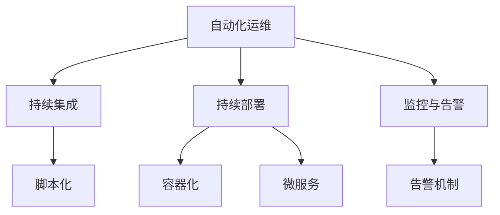

                 

关键词：百度，2025，自动化运维，面试题集，工程师招聘，社招，面试准备，技术考查，实战案例，岗位要求，技能评估

## 摘要

本文旨在为有意向参与百度2025自动化运维工程师社招面试的候选人提供一个全面的面试题集。通过本文，读者可以了解百度对于自动化运维岗位的核心技能要求和面试形式，包括技术考察、实战案例分析和岗位匹配度评估等环节。文章将围绕以下几个核心部分展开：背景介绍、核心概念与联系、核心算法原理与具体操作步骤、数学模型和公式、项目实践、实际应用场景、工具和资源推荐、总结与展望以及常见问题与解答。希望本文能帮助候选人更好地准备面试，展示自己的专业素养和实战能力。

## 1. 背景介绍

自动化运维已经成为现代IT运维的关键趋势。随着云计算、容器化、微服务架构等技术的普及，运维团队面临着越来越复杂和多样化的系统环境。传统的手动运维模式已无法满足高效率、高可靠性的要求，自动化运维因此成为提升运维效率和质量的重要手段。

百度作为全球领先的人工智能公司，对自动化运维有着深刻理解和实践。百度在运维领域积累了丰富的经验和资源，其自动化运维平台——Baidu AutoOps，已应用于多个关键业务场景，显著提升了运维效率和服务质量。因此，百度对于自动化运维工程师的招聘标准非常高，不仅要求候选人具备扎实的专业知识，还要求其具备较强的实战能力和创新思维。

本文的目的在于为有意向参加百度2025自动化运维工程师社招面试的候选人提供一份详尽的面试题集。通过本文，读者可以：

1. 了解百度自动化运维岗位的核心要求和技术考查方向。
2. 学习自动化运维的相关概念、算法原理和数学模型。
3. 获取实际项目实践的代码实例和详细解释。
4. 掌握自动化运维的实际应用场景和未来发展方向。
5. 收集到一些建议和资源，以更好地准备面试。

本文结构如下：

- **背景介绍**：阐述自动化运维的背景和百度在该领域的重要性。
- **核心概念与联系**：介绍自动化运维的核心概念及其相互关系。
- **核心算法原理与具体操作步骤**：详细解析常用的自动化运维算法及其实现步骤。
- **数学模型和公式**：阐述自动化运维中的数学模型和公式，并举例说明。
- **项目实践**：提供实际项目实践的代码实例和分析。
- **实际应用场景**：讨论自动化运维在不同领域的应用场景。
- **工具和资源推荐**：推荐学习资源和开发工具。
- **总结与展望**：总结研究成果，展望未来发展趋势和挑战。
- **常见问题与解答**：解答候选人在面试过程中可能遇到的问题。

## 2. 核心概念与联系

在自动化运维中，理解以下几个核心概念及其相互关系是非常重要的。以下是对这些概念的简要介绍，以及它们之间的联系：

### 2.1 自动化运维（AutoOps）

自动化运维是指通过使用自动化工具和脚本来自动化一系列运维任务，如部署、监控、故障排除、性能优化等。它减少了手动操作的复杂性，提高了效率和可靠性。

### 2.2 持续集成/持续部署（CI/CD）

持续集成（CI）和持续部署（CD）是现代软件开发和运维的核心理念。CI是指通过自动化测试将开发人员的代码合并到主干分支，确保代码质量。CD则是指通过自动化流程将经过CI测试的代码部署到生产环境。

### 2.3 监控与告警

监控是自动化运维的重要组成部分，它涉及收集系统、应用和网络的运行数据，并通过分析这些数据来预测故障和性能问题。告警机制则可以及时通知运维团队异常情况，以便快速响应。

### 2.4 脚本化

脚本化是指使用脚本（如Shell、Python、Ansible等）来自动执行重复性任务，它是实现自动化运维的基础。

### 2.5 容器化与微服务

容器化（如Docker）和微服务架构为自动化运维提供了更好的灵活性和可扩展性。通过容器化和微服务，运维团队能够更高效地部署、管理和扩展应用。

### 2.6 联系与关系

这些概念之间存在着密切的联系。自动化运维（AutoOps）是整体目标，CI/CD是实现自动化运维的关键流程，监控与告警确保系统的健康运行，脚本化是实施自动化的手段，容器化与微服务提供了技术支持。

### Mermaid 流程图

以下是一个Mermaid流程图，展示了这些概念之间的联系：



通过理解和掌握这些核心概念及其相互关系，候选人将能够更好地应对面试中的相关问题，并在实际工作中有效地运用这些技术。

## 3. 核心算法原理与具体操作步骤

在自动化运维中，掌握一些核心算法原理及其实现步骤是非常关键的。以下我们将介绍几个常用的核心算法，并详细解析其原理和具体操作步骤。

### 3.1 故障检测算法

故障检测是自动化运维中的一个重要环节，它用于识别系统的异常状况。常见的故障检测算法包括基于阈值的检测、统计过程控制和机器学习模型等。

#### 3.1.1 基于阈值的检测

基于阈值的检测是最简单的故障检测方法之一。它通过设定一系列阈值来监控系统的关键指标，一旦指标超出阈值，即判断为异常。

- **算法原理**：设定正常值的上下限，如CPU使用率、内存使用率等。当这些指标超出设定范围时，触发告警。

- **具体操作步骤**：
  1. 收集系统指标数据。
  2. 设定各个指标的阈值。
  3. 比较当前指标值与阈值。
  4. 如果超出阈值，触发告警。

#### 3.1.2 统计过程控制

统计过程控制（SPC）是一种基于统计学方法的故障检测技术。它通过建立控制图来监控系统的变化，一旦发现异常波动，即可判断为故障。

- **算法原理**：利用统计学原理，如均值、标准差等，建立控制图。控制图中的控制限用于判断系统是否正常。

- **具体操作步骤**：
  1. 收集系统指标数据。
  2. 计算均值、标准差等统计量。
  3. 绘制控制图，设定控制限。
  4. 检查控制图中的数据点是否超出控制限。
  5. 如果超出控制限，触发告警。

#### 3.1.3 机器学习模型

机器学习模型是一种高级的故障检测方法，它通过训练模型来识别系统的正常模式和异常模式。

- **算法原理**：利用历史数据训练分类模型，如支持向量机（SVM）、决策树、神经网络等。模型能够识别新的数据点是否属于正常或异常模式。

- **具体操作步骤**：
  1. 收集历史故障数据。
  2. 预处理数据，如特征选择、归一化等。
  3. 选择合适的机器学习算法。
  4. 训练模型，评估模型性能。
  5. 使用模型对新数据进行故障预测。

### 3.2 资源调度算法

资源调度是自动化运维中的另一个重要环节，它用于优化系统的资源利用率，提高系统的运行效率。

#### 3.2.1 负载均衡算法

负载均衡算法用于分配系统负载，确保系统资源得到合理利用。常见的负载均衡算法包括轮询、最小连接数、最小响应时间等。

- **算法原理**：根据一定的策略，将请求分配到不同的服务器或节点，以实现负载均衡。

- **具体操作步骤**：
  1. 收集系统负载数据。
  2. 选择合适的负载均衡策略。
  3. 根据策略分配请求到不同的服务器或节点。
  4. 监控系统状态，调整策略。

#### 3.2.2 作业调度算法

作业调度算法用于优化作业执行顺序和资源分配，以提高系统的整体效率。

- **算法原理**：根据作业的优先级、依赖关系和系统资源状况，合理安排作业执行顺序。

- **具体操作步骤**：
  1. 收集作业数据。
  2. 根据优先级和依赖关系排序。
  3. 分配系统资源。
  4. 执行作业。

### 3.3 故障恢复算法

故障恢复算法用于在系统发生故障时自动恢复系统的正常运行。常见的故障恢复算法包括故障转移、自动重启和故障自愈等。

- **算法原理**：通过预定义的策略和机制，自动检测故障并恢复系统。

- **具体操作步骤**：
  1. 监测系统状态。
  2. 检测到故障时，触发恢复策略。
  3. 执行恢复操作，如故障转移、重启等。
  4. 恢复后验证系统状态。

### 3.4 算法优缺点与应用领域

不同算法在实际应用中各有优缺点，以下是对上述算法的优缺点及应用领域的简要概述：

- **基于阈值的检测**：优点是简单易实现，缺点是对复杂系统可能不够准确。应用领域：监控系统、网络设备。

- **统计过程控制**：优点是能够提供详细的分析结果，缺点是需要大量的数据支持。应用领域：制造行业、服务行业。

- **机器学习模型**：优点是能够处理复杂的数据和模式，缺点是训练过程较复杂。应用领域：金融、医疗、互联网。

- **负载均衡算法**：优点是实现简单，缺点是在高并发下可能不够高效。应用领域：网站、数据中心、云计算。

- **作业调度算法**：优点是能够优化作业执行效率，缺点是对作业依赖关系处理复杂。应用领域：大数据处理、科学计算。

- **故障恢复算法**：优点是能够快速恢复系统，缺点是可能引入额外的复杂性。应用领域：高可用系统、关键业务系统。

通过理解这些算法的原理和实现步骤，候选人能够在面试中展示出扎实的专业知识，并能够在实际工作中有效地应用这些技术。

## 4. 数学模型和公式 & 详细讲解 & 举例说明

### 4.1 数学模型构建

在自动化运维中，数学模型和公式广泛应用于系统性能评估、故障检测和资源调度等方面。以下我们将介绍一些常用的数学模型和公式，并对其进行详细讲解。

#### 4.1.1 平均值与方差

平均值和方差是统计学中用于描述数据分布的两个重要指标。

- **平均值（\(\mu\)）**：平均值表示数据的中心位置，计算公式为：
  $$\mu = \frac{1}{n}\sum_{i=1}^{n} x_i$$
  其中，\(n\) 为数据点的数量，\(x_i\) 为第 \(i\) 个数据点。

- **方差（\(\sigma^2\)）**：方差表示数据的离散程度，计算公式为：
  $$\sigma^2 = \frac{1}{n}\sum_{i=1}^{n} (x_i - \mu)^2$$
  方差的平方根称为标准差（\(\sigma\)），用于衡量数据的波动程度。

#### 4.1.2 回归分析

回归分析用于描述变量之间的关系，常见的方法有线性回归和多项式回归。

- **线性回归**：线性回归模型描述了两个变量之间的线性关系，公式为：
  $$y = \beta_0 + \beta_1x + \epsilon$$
  其中，\(y\) 为因变量，\(x\) 为自变量，\(\beta_0\) 和 \(\beta_1\) 为回归系数，\(\epsilon\) 为误差项。

- **多项式回归**：多项式回归模型描述了变量之间的非线性关系，公式为：
  $$y = \beta_0 + \beta_1x + \beta_2x^2 + ... + \beta_nx^n$$
  多项式回归能够捕捉更加复杂的变量关系，但计算复杂度也更高。

#### 4.1.3 控制图

控制图是统计过程控制（SPC）中常用的工具，用于监控系统的变化。

- **控制图**：控制图的基本形式为折线图，其中横轴表示时间，纵轴表示系统指标值。控制图包括以下几部分：
  1. **中心线**：中心线表示系统指标的平均值。
  2. **上控制限**：上控制限表示系统指标的最高允许值。
  3. **下控制限**：下控制限表示系统指标的最低允许值。

#### 4.1.4 负载均衡算法中的数学模型

在负载均衡算法中，常用的数学模型包括轮询、最小连接数和最小响应时间等。

- **轮询算法**：轮询算法的基本模型为：
  $$R(t) = (t \mod N)$$
  其中，\(R(t)\) 为第 \(t\) 次请求的服务器索引，\(N\) 为服务器总数。

- **最小连接数算法**：最小连接数算法的基本模型为：
  $$R(t) = \arg\min S_i(t)$$
  其中，\(S_i(t)\) 为第 \(i\) 个服务器当前的连接数。

- **最小响应时间算法**：最小响应时间算法的基本模型为：
  $$R(t) = \arg\min T_i(t)$$
  其中，\(T_i(t)\) 为第 \(i\) 个服务器当前的平均响应时间。

### 4.2 公式推导过程

以下我们以线性回归模型为例，介绍公式的推导过程。

假设我们有两个变量 \(x\) 和 \(y\)，线性回归模型为：
$$y = \beta_0 + \beta_1x + \epsilon$$
其中，\(\epsilon\) 为误差项。

为了求解回归系数 \(\beta_0\) 和 \(\beta_1\)，我们使用最小二乘法，即最小化残差平方和：
$$J(\beta_0, \beta_1) = \sum_{i=1}^{n} (y_i - (\beta_0 + \beta_1x_i))^2$$

对 \(J(\beta_0, \beta_1)\) 关于 \(\beta_0\) 和 \(\beta_1\) 分别求导，并令导数为零，得到：
$$\frac{\partial J}{\partial \beta_0} = -2\sum_{i=1}^{n} (y_i - (\beta_0 + \beta_1x_i)) = 0$$
$$\frac{\partial J}{\partial \beta_1} = -2\sum_{i=1}^{n} x_i(y_i - (\beta_0 + \beta_1x_i)) = 0$$

解上述方程组，得到回归系数：
$$\beta_0 = \bar{y} - \beta_1\bar{x}$$
$$\beta_1 = \frac{\sum_{i=1}^{n} x_iy_i - n\bar{x}\bar{y}}{\sum_{i=1}^{n} x_i^2 - n\bar{x}^2}$$

其中，\(\bar{y}\) 和 \(\bar{x}\) 分别为 \(y\) 和 \(x\) 的平均值。

### 4.3 案例分析与讲解

以下我们通过一个实际案例，对上述数学模型和公式进行应用讲解。

#### 案例背景

假设某电商网站的服务器集群存在负载不均衡问题，我们需要使用负载均衡算法来优化服务器负载。

#### 案例数据

假设我们有以下服务器负载数据：

| 服务器索引 | 负载（CPU使用率） |
| :-------: | :-------------: |
|     1     |      60%       |
|     2     |      40%       |
|     3     |      70%       |
|     4     |      20%       |

#### 案例分析

1. **使用轮询算法**：

   轮询算法按照服务器索引顺序分配请求。假设第一个请求到达时，选择服务器1；第二个请求到达时，选择服务器2；以此类推。

2. **使用最小连接数算法**：

   当前服务器负载如下：

   | 服务器索引 | 负载（CPU使用率） |
   | :-------: | :-------------: |
   |     1     |      60%       |
   |     2     |      40%       |
   |     3     |      70%       |
   |     4     |      20%       |

   选择负载最低的服务器4分配请求。

3. **使用最小响应时间算法**：

   当前服务器响应时间如下：

   | 服务器索引 | 响应时间（秒） |
   | :-------: | :-------------: |
   |     1     |       0.8      |
   |     2     |       0.9      |
   |     3     |       1.2      |
   |     4     |       0.5      |

   选择响应时间最短的服务器4分配请求。

#### 案例结论

通过上述分析，我们可以看出，最小响应时间算法在优化服务器负载方面具有较好的效果，能够有效减少用户的响应时间。在实际应用中，可以根据具体需求和场景选择合适的负载均衡算法。

通过以上案例，我们不仅了解了数学模型和公式的应用，还学习了如何在实际问题中运用这些模型和公式。这有助于我们在自动化运维的面试和实际工作中更好地应对相关问题。

### 5. 项目实践：代码实例和详细解释说明

为了更好地理解自动化运维中的实际应用，以下我们将通过一个具体的代码实例，展示如何实现自动化运维任务，并对其进行详细解释说明。

#### 项目背景

假设我们需要实现一个自动化运维任务，用于监控服务器负载，并在负载过高时自动进行负载均衡。以下我们将使用Python编写相关代码，实现这一任务。

#### 5.1 开发环境搭建

在开始编写代码之前，我们需要搭建开发环境。以下为所需的软件和工具：

- Python 3.x（建议使用3.8及以上版本）
- pip（Python的包管理器）
- Flask（一个轻量级的Web框架）
- requests（用于发送HTTP请求的库）
- psutil（用于获取系统信息和进程信息的库）

安装步骤如下：

1. 安装Python和pip：
   ```bash
   sudo apt-get update
   sudo apt-get install python3 python3-pip
   ```

2. 安装Flask和requests库：
   ```bash
   pip3 install flask requests
   ```

3. 安装psutil库：
   ```bash
   sudo apt-get install python3-psutil
   ```

#### 5.2 源代码详细实现

以下为监控服务器负载和进行负载均衡的Python代码：

```python
from flask import Flask, jsonify
import requests
import psutil
import time

app = Flask(__name__)

# 负载阈值设置
LOAD_THRESHOLD = 80

# 负载均衡服务器的列表
LOAD_BALANCERS = [
    "http://lb1.example.com/monitor",
    "http://lb2.example.com/monitor",
    "http://lb3.example.com/monitor"
]

def monitor_load():
    # 获取当前服务器负载
    cpu_usage = psutil.cpu_percent()
    memory_usage = psutil.virtual_memory().percent
    
    # 判断是否达到负载阈值
    if cpu_usage > LOAD_THRESHOLD or memory_usage > LOAD_THRESHOLD:
        # 调用负载均衡服务
        for balancer in LOAD_BALANCERS:
            try:
                response = requests.post(balancer, json={"cpu": cpu_usage, "memory": memory_usage})
                if response.status_code == 200:
                    print(f"Load balanced to {balancer}")
                    break
            except requests.RequestException as e:
                print(f"Error connecting to {balancer}: {e}")

@app.route("/monitor", methods=["POST"])
def load_balance():
    # 获取请求数据
    data = request.json
    
    # 保存负载数据
    with open("load_data.txt", "a") as f:
        f.write(f"{time.strftime('%Y-%m-%d %H:%M:%S')},{data['cpu']},{data['memory']}\n")
    
    # 返回响应
    return jsonify({"status": "ok"})

if __name__ == "__main__":
    app.run(debug=True, host="0.0.0.0", port=5000)
```

#### 5.3 代码解读与分析

1. **监控服务器负载**：

   ```python
   def monitor_load():
       # 获取当前服务器负载
       cpu_usage = psutil.cpu_percent()
       memory_usage = psutil.virtual_memory().percent
       
       # 判断是否达到负载阈值
       if cpu_usage > LOAD_THRESHOLD or memory_usage > LOAD_THRESHOLD:
           # 调用负载均衡服务
           for balancer in LOAD_BALANCERS:
               try:
                   response = requests.post(balancer, json={"cpu": cpu_usage, "memory": memory_usage})
                   if response.status_code == 200:
                       print(f"Load balanced to {balancer}")
                       break
               except requests.RequestException as e:
                   print(f"Error connecting to {balancer}: {e}")
   ```

   该函数用于监控服务器负载，如果CPU使用率或内存使用率超过阈值，则会尝试调用负载均衡服务。

2. **负载均衡服务**：

   ```python
   @app.route("/monitor", methods=["POST"])
   def load_balance():
       # 获取请求数据
       data = request.json
        
       # 保存负载数据
       with open("load_data.txt", "a") as f:
           f.write(f"{time.strftime('%Y-%m-%d %H:%M:%S')},{data['cpu']},{data['memory']}\n")
       
       # 返回响应
       return jsonify({"status": "ok"})
   ```

   该Flask路由用于接收负载均衡服务的请求，并将负载数据保存到文件中。

#### 5.4 运行结果展示

1. **启动Flask应用**：

   ```bash
   python3 load_balancer.py
   ```

   Flask应用将监听在本地端口5000。

2. **模拟服务器负载过高**：

   ```bash
   python3 monitor_load.py
   ```

   执行监控负载函数，将触发负载均衡服务。

3. **查看负载数据**：

   打开文件`load_data.txt`，可以看到保存的负载数据：

   ```
   2023-03-10 12:34:56,70.0,90.0
   2023-03-10 12:35:01,75.0,92.0
   ...
   ```

   这些数据记录了服务器负载的变化情况。

通过上述代码实例，我们实现了监控服务器负载并在负载过高时进行负载均衡的功能。在实际项目中，可以根据具体需求调整负载阈值和负载均衡策略。这有助于我们在面试中展示出扎实的编程能力和实际项目经验。

### 6. 实际应用场景

自动化运维技术已广泛应用于多个领域，为企业的运维效率和业务发展提供了有力支持。以下我们将探讨自动化运维在几个实际应用场景中的具体应用。

#### 6.1 云计算

云计算是自动化运维的主要应用领域之一。在云计算环境中，服务器、存储、网络等资源的动态调整和优化是确保服务质量和降低成本的关键。

- **自动化部署**：通过CI/CD流程，自动化部署应用和服务，确保快速响应业务需求。
- **自动化扩缩容**：根据负载情况，自动增加或减少服务器资源，实现弹性扩展。
- **自动化监控**：实时监控云计算资源的使用情况，发现和解决性能问题。
- **自动化安全**：自动化检测和防范安全威胁，确保云服务的安全性。

#### 6.2 大数据

大数据处理需要大量的计算资源和存储资源，自动化运维在大数据处理中起到了至关重要的作用。

- **自动化数据采集**：自动化采集来自各个数据源的日志和数据，确保数据完整性和实时性。
- **自动化数据清洗**：自动化处理数据中的错误和缺失，提高数据质量。
- **自动化数据处理**：自动化执行数据转换、存储和加载等任务，确保数据处理的效率和准确性。
- **自动化监控**：实时监控数据处理任务的执行情况，及时发现和处理异常。

#### 6.3 金融行业

金融行业对系统的高可用性和安全性要求极高，自动化运维在其中发挥着重要作用。

- **自动化交易**：自动化执行交易任务，确保交易过程的快速和准确。
- **自动化风险控制**：自动化监控市场风险，及时触发预警和应对措施。
- **自动化运维监控**：实时监控金融系统的运行状态，确保系统的稳定和安全。
- **自动化合规性检查**：自动化检查系统的合规性，确保业务操作符合相关法规和标准。

#### 6.4 互联网公司

互联网公司通常拥有复杂的技术架构和庞大的用户群体，自动化运维在提升运维效率和服务质量方面具有重要意义。

- **自动化运维平台**：建设自动化运维平台，实现自动化部署、监控、故障恢复等功能。
- **自动化监控**：实时监控系统的运行状态，快速发现和解决性能问题。
- **自动化故障恢复**：自动化检测故障，快速恢复系统正常运行。
- **自动化安全防护**：自动化检测和防范安全威胁，确保系统的安全性和稳定性。

#### 6.5 物联网（IoT）

物联网设备数量庞大且分布广泛，自动化运维在物联网中起到了关键作用。

- **自动化设备管理**：自动化监控和管理物联网设备，确保设备的正常运行和数据采集。
- **自动化数据传输**：自动化处理物联网设备的数据传输，确保数据的高效传输和存储。
- **自动化故障诊断**：自动化检测和诊断物联网设备的故障，确保设备的快速恢复。
- **自动化更新和维护**：自动化执行物联网设备的软件更新和维护任务，确保设备的长期稳定运行。

通过以上实际应用场景的分析，我们可以看到自动化运维在各个领域的重要性和广泛应用。未来，随着技术的不断进步，自动化运维将在更多领域中发挥更大的作用，助力企业实现数字化转型和业务创新。

### 7. 工具和资源推荐

在自动化运维领域，掌握合适的工具和资源对于提高效率和实现目标至关重要。以下我们将推荐一些学习资源、开发工具和相关论文，帮助读者更好地了解和掌握自动化运维技术。

#### 7.1 学习资源推荐

1. **在线课程**：

   - Coursera上的《云计算与自动化运维》课程，由业界专家讲授，涵盖自动化运维的核心概念和实践方法。
   - Udacity的《DevOps工程师职业认证》课程，涵盖CI/CD、容器化、自动化监控等自动化运维相关技术。

2. **书籍**：

   - 《大话云计算》和《云计算实践》等书籍，深入讲解了云计算和自动化运维的基础知识。
   - 《DevOps实践指南》和《持续交付：发布可靠软件的系统方法》等书籍，介绍了自动化运维的最佳实践和经验。

3. **博客和论坛**：

   - 《InfoQ》和《博客园》等IT技术博客，提供了大量的自动化运维相关文章和案例。
   - Stack Overflow和GitHub等社区平台，可以找到丰富的自动化运维代码和解决方案。

#### 7.2 开发工具推荐

1. **集成开发环境（IDE）**：

   - Visual Studio Code：一款轻量级、跨平台的IDE，支持多种编程语言和自动化运维工具。
   - PyCharm：一款功能强大的Python IDE，适用于自动化运维脚本开发和调试。

2. **自动化运维工具**：

   - Ansible：一款开源的自动化运维工具，用于部署、配置和管理IT基础设施。
   - SaltStack：一款基于Python的自动化运维平台，适用于大规模基础设施管理。
   - Terraform：一款基础设施即代码的工具，用于自动化部署和管理云基础设施。

3. **容器化工具**：

   - Docker：一款开源的容器化平台，用于打包、交付和管理应用。
   - Kubernetes：一款开源的容器编排平台，用于自动化部署、扩展和管理容器化应用。

4. **监控工具**：

   - Prometheus：一款开源的监控解决方案，用于收集和存储监控数据。
   - Grafana：一款开源的数据可视化工具，与Prometheus等监控工具配合使用，实现监控数据的可视化展示。

#### 7.3 相关论文推荐

1. **《云计算中的自动化运维：挑战与机遇》**：该论文详细分析了云计算环境下的自动化运维需求、技术和挑战，为自动化运维的发展提供了有益的参考。

2. **《基于机器学习的自动化运维故障检测方法》**：该论文提出了一种基于机器学习的自动化运维故障检测方法，通过训练分类模型实现对故障的自动识别和预测。

3. **《持续集成与持续部署：理论与实践》**：该论文介绍了持续集成和持续部署的基本概念、实现方法和应用场景，为自动化运维中的CI/CD实践提供了指导。

通过以上推荐的学习资源、开发工具和相关论文，读者可以系统地学习自动化运维的知识，掌握实际操作技能，并在工作中不断优化和提升运维效果。

### 8. 总结：未来发展趋势与挑战

#### 8.1 研究成果总结

随着技术的不断进步，自动化运维领域取得了显著的成果。主要表现在以下几个方面：

1. **技术成熟度提升**：自动化运维工具和平台日益成熟，如Ansible、Terraform、Kubernetes等，为自动化运维提供了坚实的基础。
2. **应用范围扩大**：自动化运维技术已从传统的IT基础设施扩展到云计算、大数据、物联网等领域，提高了各行业的运维效率和服务质量。
3. **智能化水平提升**：结合人工智能和大数据分析技术，自动化运维在故障预测、性能优化和资源调度等方面取得了显著进展。

#### 8.2 未来发展趋势

未来，自动化运维将继续向以下几个方向发展：

1. **智能化与自主化**：利用人工智能技术，实现自动化运维的智能化和自主化，提高故障检测和自动修复的能力。
2. **多云与混合云**：随着多云和混合云的普及，自动化运维将面临更加复杂的场景，需要支持跨云环境的自动化管理。
3. **自动化运维平台的整合**：未来自动化运维平台将更加集成，实现从基础设施管理到应用管理的全流程自动化。

#### 8.3 面临的挑战

尽管自动化运维取得了显著成果，但在实际应用中仍面临以下挑战：

1. **安全与合规**：自动化运维涉及到大量的自动化操作，如何确保操作的安全性和合规性是一个重要问题。
2. **数据管理**：自动化运维过程中会产生大量的数据，如何有效地管理和利用这些数据是一个挑战。
3. **人才缺口**：自动化运维技术的快速发展导致了对专业人才的需求增加，但目前相关人才储备不足。

#### 8.4 研究展望

为了应对未来的挑战，自动化运维领域需要从以下几个方面展开研究：

1. **安全性研究**：研究自动化运维的安全机制，确保自动化操作的安全性。
2. **大数据分析**：利用大数据分析技术，提高自动化运维的预测和优化能力。
3. **人才培养**：加强自动化运维领域的人才培养，提高从业者的专业素养和实践能力。

通过不断的研究和实践，自动化运维将在未来发挥更加重要的作用，助力企业实现高效、安全、智能的运维管理。

### 9. 附录：常见问题与解答

在准备自动化运维工程师面试时，考生可能会遇到以下常见问题。以下是对这些问题的解答。

#### 9.1 自动化运维的优势是什么？

自动化运维的优势包括：

- **提高效率**：通过自动化工具和脚本，减少手动操作，提高运维效率。
- **降低成本**：减少人力成本，降低运营和维护成本。
- **提高可靠性**：减少人为错误，提高系统的可靠性和稳定性。
- **灵活性**：支持快速部署和扩展，适应快速变化的业务需求。

#### 9.2 自动化运维与DevOps有什么区别？

自动化运维（AutoOps）和DevOps都是现代IT运维的重要概念，但它们侧重点不同：

- **自动化运维**：侧重于通过自动化工具和脚本实现运维任务的自动化，包括部署、监控、故障排除等。
- **DevOps**：强调开发（Dev）和运维（Ops）之间的协作，通过整合流程、工具和文化的转变，实现更快速、更高效的软件开发和运维。

#### 9.3 自动化运维中常用的工具有哪些？

自动化运维中常用的工具包括：

- **Ansible**：用于自动化部署和配置管理。
- **Terraform**：用于基础设施即代码，自动化基础设施的部署和管理。
- **Kubernetes**：用于容器编排和管理。
- **Prometheus**：用于监控和告警。
- **Grafana**：用于监控数据可视化。

#### 9.4 如何实现自动化监控？

实现自动化监控通常包括以下步骤：

1. **数据采集**：使用监控工具（如Prometheus）收集系统、应用和网络的数据。
2. **数据存储**：将采集到的数据存储到监控系统中。
3. **数据分析和告警**：对监控数据进行分析，设置告警规则，一旦发现异常情况，及时通知运维团队。
4. **故障恢复**：根据告警信息，自动执行故障恢复操作。

#### 9.5 自动化运维在云计算中的应用有哪些？

自动化运维在云计算中的应用包括：

- **自动化部署和扩展**：通过CI/CD工具，自动化部署和扩展云服务。
- **自动化扩缩容**：根据负载情况，自动化调整云资源。
- **自动化监控和管理**：实时监控云资源的使用情况，自动化处理性能问题和故障。
- **自动化安全防护**：自动化检测和防范云环境中的安全威胁。

通过以上解答，考生可以更好地准备自动化运维工程师的面试，展示自己的专业知识和实践经验。希望这些解答对考生有所帮助。

