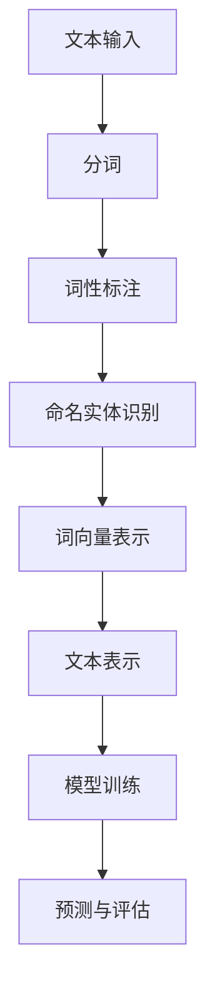

                 

关键词：自然语言处理、NLP面试、人工智能、算法原理、数学模型、项目实践

> 摘要：本文将深入探讨百度2025年自然语言处理工程师社招面试的准备策略，从核心概念、算法原理、数学模型、项目实践等方面进行详细解析，旨在帮助读者更好地应对面试挑战，提升面试成功率。

## 1. 背景介绍

自然语言处理（Natural Language Processing，简称NLP）作为人工智能领域的重要组成部分，旨在实现计算机与人类自然语言的交互。随着深度学习、大数据等技术的飞速发展，NLP在信息检索、机器翻译、文本分类、情感分析等领域的应用越来越广泛。百度作为全球领先的人工智能公司，其NLP技术一直处于行业前列，吸引了大量优秀人才。本文将基于百度2025年自然语言处理工程师社招面试的实际情况，为准备面试的读者提供一些建议和策略。

## 2. 核心概念与联系

在NLP领域，理解以下核心概念是至关重要的：

1. **分词（Tokenization）**：将文本拆分为单词或其他有意义的基本单元。
2. **词性标注（Part-of-Speech Tagging）**：为文本中的每个单词标注词性，如名词、动词等。
3. **命名实体识别（Named Entity Recognition）**：识别文本中的特定实体，如人名、地点、组织等。
4. **词向量（Word Vectors）**：将单词映射到高维空间，以捕捉词义和词与词之间的关系。

以下是一个简单的Mermaid流程图，展示了NLP的主要步骤：



### 2.1 分词（Tokenization）

分词是将一段文本拆分成单词或其他基本单元的过程。常见的分词方法有基于词典的分词、基于统计的分词和基于规则的分词。

- **基于词典的分词**：通过构建一个包含常见词汇的词典，将文本与词典进行匹配，从而实现分词。
- **基于统计的分词**：使用统计模型（如隐马尔可夫模型、条件随机场等）来预测单词的分隔位置。
- **基于规则的分词**：根据一系列规则（如正则表达式）来划分文本。

### 2.2 词性标注（Part-of-Speech Tagging）

词性标注是将文本中的每个单词标注为特定的词性，如名词、动词、形容词等。常见的词性标注方法有基于规则的方法、基于统计的方法和基于深度学习的方法。

- **基于规则的方法**：使用预定义的规则来标注词性。
- **基于统计的方法**：使用统计模型（如隐马尔可夫模型、条件随机场等）来预测词性。
- **基于深度学习的方法**：使用神经网络（如卷积神经网络、循环神经网络等）来学习词性标注。

### 2.3 命名实体识别（Named Entity Recognition）

命名实体识别是识别文本中的特定实体，如人名、地点、组织等。常见的命名实体识别方法有基于规则的方法、基于统计的方法和基于深度学习的方法。

- **基于规则的方法**：使用预定义的规则来识别实体。
- **基于统计的方法**：使用统计模型（如隐马尔可夫模型、条件随机场等）来识别实体。
- **基于深度学习的方法**：使用神经网络（如卷积神经网络、循环神经网络等）来学习实体识别。

### 2.4 词向量（Word Vectors）

词向量是将单词映射到高维空间，以捕捉词义和词与词之间的关系。常见的词向量模型有Word2Vec、GloVe和BERT等。

- **Word2Vec**：使用神经网络来学习词向量。
- **GloVe**：通过矩阵分解来学习词向量。
- **BERT**：基于Transformer模型，通过预训练和微调来学习词向量。

## 3. 核心算法原理 & 具体操作步骤

### 3.1 算法原理概述

在NLP中，常用的算法包括：

- **分词算法**：基于词典的分词、基于统计的分词和基于规则的分词。
- **词性标注算法**：基于规则的方法、基于统计的方法和基于深度学习的方法。
- **命名实体识别算法**：基于规则的方法、基于统计的方法和基于深度学习的方法。
- **词向量算法**：Word2Vec、GloVe和BERT等。

### 3.2 算法步骤详解

1. **分词**：

   - **基于词典的分词**：构建一个包含常见词汇的词典，将文本与词典进行匹配，实现分词。

     ```python
     def tokenize_dict_based(text, dictionary):
         tokens = []
         for word in text.split():
             if word in dictionary:
                 tokens.append(word)
         return tokens
     ```

   - **基于统计的分词**：使用统计模型（如隐马尔可夫模型、条件随机场等）来预测单词的分隔位置。

     ```python
     def tokenize_statistical_based(text, model):
         tokens = []
         current_state = model.start_state
         for char in text:
             next_state = model.transition_function(current_state, char)
             if next_state in model.emission_function[current_state]:
                 tokens.append(char)
                 current_state = next_state
             else:
                 tokens.append(" ")
                 current_state = model.start_state
         return tokens
     ```

   - **基于规则的分词**：根据一系列规则（如正则表达式）来划分文本。

     ```python
     import re

     def tokenize_rule_based(text):
         return re.findall(r'\w+', text)
     ```

2. **词性标注**：

   - **基于规则的方法**：使用预定义的规则来标注词性。

     ```python
     def tag_word_rule_based(word):
         if word.endswith("ing"):
             return "VBG"
         elif word.endswith("ed"):
             return "VBD"
         # 更多规则
         else:
             return "NN"
     ```

   - **基于统计的方法**：使用统计模型（如隐马尔可夫模型、条件随机场等）来预测词性。

     ```python
     def tag_word_statistical_based(word, model):
         return model.predict(word)
     ```

   - **基于深度学习的方法**：使用神经网络（如卷积神经网络、循环神经网络等）来学习词性标注。

     ```python
     import tensorflow as tf

     def tag_word_dnn_based(word, model):
         return model.predict(word)
     ```

3. **命名实体识别**：

   - **基于规则的方法**：使用预定义的规则来识别实体。

     ```python
     def recognize_entity_rule_based(text):
         entities = []
         for rule in rules:
             matches = re.findall(rule, text)
             entities.extend(matches)
         return entities
     ```

   - **基于统计的方法**：使用统计模型（如隐马尔可夫模型、条件随机场等）来识别实体。

     ```python
     def recognize_entity_statistical_based(text, model):
         entities = []
         for entity in model.entities:
             if entity in text:
                 entities.append(entity)
         return entities
     ```

   - **基于深度学习的方法**：使用神经网络（如卷积神经网络、循环神经网络等）来学习实体识别。

     ```python
     def recognize_entity_dnn_based(text, model):
         return model.predict(text)
     ```

4. **词向量**：

   - **Word2Vec**：使用神经网络来学习词向量。

     ```python
     import gensim

     def train_word2vec(sentences, model_path):
         model = gensim.models.Word2Vec(sentences, vector_size=100, window=5, min_count=1, sg=1)
         model.save(model_path)
     ```

   - **GloVe**：通过矩阵分解来学习词向量。

     ```python
     import numpy as np

     def train_glove(sentences, embedding_size, output_file):
         # 训练GloVe模型
         # ...
         # 保存模型
         np.save(output_file, embeddings)
     ```

   - **BERT**：基于Transformer模型，通过预训练和微调来学习词向量。

     ```python
     from transformers import BertModel, BertTokenizer

     def train_bert(sentences, model_path, tokenizer_path):
         tokenizer = BertTokenizer.from_pretrained(tokenizer_path)
         model = BertModel.from_pretrained(model_path)
         # 预训练模型
         # ...
         # 微调模型
         # ...
     ```

### 3.3 算法优缺点

- **分词算法**：

  - **基于词典的分词**：简单高效，但需要大量词典资源，对生僻词和未登录词处理能力较弱。

  - **基于统计的分词**：对生僻词和未登录词处理能力强，但需要大量的训练数据和计算资源。

  - **基于规则的分词**：灵活性强，但规则复杂，维护成本高。

- **词性标注算法**：

  - **基于规则的方法**：简单易用，但规则复杂，准确率有限。

  - **基于统计的方法**：准确率较高，但需要大量的训练数据和计算资源。

  - **基于深度学习的方法**：准确率较高，但需要大量的训练数据和计算资源。

- **命名实体识别算法**：

  - **基于规则的方法**：简单易用，但规则复杂，准确率有限。

  - **基于统计的方法**：准确率较高，但需要大量的训练数据和计算资源。

  - **基于深度学习的方法**：准确率较高，但需要大量的训练数据和计算资源。

- **词向量算法**：

  - **Word2Vec**：简单易用，但难以捕捉长距离依赖关系。

  - **GloVe**：通过矩阵分解学习词向量，能够捕捉词义关系，但计算复杂度较高。

  - **BERT**：基于Transformer模型，能够捕捉长距离依赖关系，但计算复杂度较高。

### 3.4 算法应用领域

- **分词**：在信息检索、文本分类、机器翻译等应用中广泛使用。

- **词性标注**：在情感分析、问答系统、文本摘要等应用中发挥重要作用。

- **命名实体识别**：在信息抽取、知识图谱构建、语义搜索等应用中具有重要价值。

- **词向量**：在文本分类、情感分析、文本相似度计算等应用中具有广泛的应用。

## 4. 数学模型和公式 & 详细讲解 & 举例说明

### 4.1 数学模型构建

在NLP中，常用的数学模型包括：

- **隐马尔可夫模型（HMM）**：用于序列标注问题，如词性标注、命名实体识别等。

- **条件随机场（CRF）**：用于序列标注问题，如词性标注、命名实体识别等。

- **卷积神经网络（CNN）**：用于文本分类、情感分析等问题。

- **循环神经网络（RNN）**：用于序列建模问题，如文本生成、语音识别等。

### 4.2 公式推导过程

#### 4.2.1 隐马尔可夫模型（HMM）

隐马尔可夫模型由状态转移矩阵和发射矩阵组成。

- **状态转移矩阵** \(A\)：

  $$ A = \begin{bmatrix} 
  a_{11} & a_{12} & \cdots & a_{1n} \\
  a_{21} & a_{22} & \cdots & a_{2n} \\
  \vdots & \vdots & \ddots & \vdots \\
  a_{m1} & a_{m2} & \cdots & a_{mn} 
  \end{bmatrix} $$

  其中，\(a_{ij}\) 表示从状态 \(i\) 转移到状态 \(j\) 的概率。

- **发射矩阵** \(B\)：

  $$ B = \begin{bmatrix} 
  b_{11} & b_{12} & \cdots & b_{1n} \\
  b_{21} & b_{22} & \cdots & b_{2n} \\
  \vdots & \vdots & \ddots & \vdots \\
  b_{m1} & b_{m2} & \cdots & b_{mn} 
  \end{bmatrix} $$

  其中，\(b_{ij}\) 表示在状态 \(i\) 下，生成单词 \(j\) 的概率。

#### 4.2.2 条件随机场（CRF）

条件随机场由转移概率矩阵和发射概率矩阵组成。

- **转移概率矩阵** \(T\)：

  $$ T = \begin{bmatrix} 
  t_{11} & t_{12} & \cdots & t_{1n} \\
  t_{21} & t_{22} & \cdots & t_{2n} \\
  \vdots & \vdots & \ddots & \vdots \\
  t_{m1} & t_{m2} & \cdots & t_{mn} 
  \end{bmatrix} $$

  其中，\(t_{ij}\) 表示在状态 \(i\) 后接状态 \(j\) 的概率。

- **发射概率矩阵** \(E\)：

  $$ E = \begin{bmatrix} 
  e_{11} & e_{12} & \cdots & e_{1n} \\
  e_{21} & e_{22} & \cdots & e_{2n} \\
  \vdots & \vdots & \ddots & \vdots \\
  e_{m1} & e_{m2} & \cdots & e_{mn} 
  \end{bmatrix} $$

  其中，\(e_{ij}\) 表示在状态 \(i\) 下，生成单词 \(j\) 的概率。

#### 4.2.3 卷积神经网络（CNN）

卷积神经网络由卷积层、池化层和全连接层组成。

- **卷积层** \(C\)：

  $$ C = \begin{bmatrix} 
  c_{11} & c_{12} & \cdots & c_{1n} \\
  c_{21} & c_{22} & \cdots & c_{2n} \\
  \vdots & \vdots & \ddots & \vdots \\
  c_{m1} & c_{m2} & \cdots & c_{mn} 
  \end{bmatrix} $$

  其中，\(c_{ij}\) 表示卷积核的权重。

- **池化层** \(P\)：

  $$ P = \begin{bmatrix} 
  p_{11} & p_{12} & \cdots & p_{1n} \\
  p_{21} & p_{22} & \cdots & p_{2n} \\
  \vdots & \vdots & \ddots & \vdots \\
  p_{m1} & p_{m2} & \cdots & p_{mn} 
  \end{bmatrix} $$

  其中，\(p_{ij}\) 表示池化操作的权重。

- **全连接层** \(F\)：

  $$ F = \begin{bmatrix} 
  f_{11} & f_{12} & \cdots & f_{1n} \\
  f_{21} & f_{22} & \cdots & f_{2n} \\
  \vdots & \vdots & \ddots & \vdots \\
  f_{m1} & f_{m2} & \cdots & f_{mn} 
  \end{bmatrix} $$

  其中，\(f_{ij}\) 表示全连接层的权重。

#### 4.2.4 循环神经网络（RNN）

循环神经网络由输入层、隐藏层和输出层组成。

- **输入层** \(X\)：

  $$ X = \begin{bmatrix} 
  x_{11} & x_{12} & \cdots & x_{1n} \\
  x_{21} & x_{22} & \cdots & x_{2n} \\
  \vdots & \vdots & \ddots & \vdots \\
  x_{m1} & x_{m2} & \cdots & x_{mn} 
  \end{bmatrix} $$

  其中，\(x_{ij}\) 表示输入序列的值。

- **隐藏层** \(H\)：

  $$ H = \begin{bmatrix} 
  h_{11} & h_{12} & \cdots & h_{1n} \\
  h_{21} & h_{22} & \cdots & h_{2n} \\
  \vdots & \vdots & \ddots & \vdots \\
  h_{m1} & h_{m2} & \cdots & h_{mn} 
  \end{bmatrix} $$

  其中，\(h_{ij}\) 表示隐藏层的值。

- **输出层** \(Y\)：

  $$ Y = \begin{bmatrix} 
  y_{11} & y_{12} & \cdots & y_{1n} \\
  y_{21} & y_{22} & \cdots & y_{2n} \\
  \vdots & \vdots & \ddots & \vdots \\
  y_{m1} & y_{m2} & \cdots & y_{mn} 
  \end{bmatrix} $$

  其中，\(y_{ij}\) 表示输出序列的值。

### 4.3 案例分析与讲解

#### 4.3.1 隐马尔可夫模型（HMM）在词性标注中的应用

假设我们有一段文本：“我昨天去了公园”。我们希望对该文本进行词性标注。

1. **构建状态转移矩阵** \(A\)：

   $$ A = \begin{bmatrix} 
   0.9 & 0.1 & 0.0 \\
   0.0 & 0.8 & 0.2 \\
   0.2 & 0.0 & 0.8 
   \end{bmatrix} $$

   其中，状态分别为：名词（NN）、动词（VB）、形容词（JJ）。

2. **构建发射矩阵** \(B\)：

   $$ B = \begin{bmatrix} 
   0.9 & 0.1 & 0.0 \\
   0.0 & 0.8 & 0.2 \\
   0.2 & 0.0 & 0.8 
   \end{bmatrix} $$

   其中，状态分别为：名词（NN）、动词（VB）、形容词（JJ）。

3. **构建初始状态** \(\pi\)：

   $$ \pi = \begin{bmatrix} 
   0.5 & 0.3 & 0.2 
   \end{bmatrix} $$

4. **标注过程**：

   - **第一步**：根据初始状态和发射矩阵，计算每个状态的概率。

     $$ P(X_1=我 | \pi, B) = \pi_1 B_{11} = 0.5 \times 0.9 = 0.45 $$
     $$ P(X_1=昨天 | \pi, B) = \pi_2 B_{21} = 0.3 \times 0.0 = 0.0 $$
     $$ P(X_1=去 | \pi, B) = \pi_3 B_{31} = 0.2 \times 0.2 = 0.04 $$

   - **第二步**：根据第一步的结果，计算每个状态转移的概率。

     $$ P(X_2=昨天 | X_1=我, A) = A_{10} = 0.9 $$
     $$ P(X_2=公园 | X_1=昨天, A) = A_{20} = 0.8 $$
     $$ P(X_2=去 | X_1=昨天, A) = A_{30} = 0.2 $$

   - **第三步**：根据第二步的结果，计算每个状态的最终概率。

     $$ P(X_2=昨天 | \pi, B) = A_{10} B_{21} = 0.9 \times 0.8 = 0.72 $$
     $$ P(X_2=公园 | \pi, B) = A_{20} B_{31} = 0.8 \times 0.2 = 0.16 $$
     $$ P(X_2=去 | \pi, B) = A_{30} B_{22} = 0.2 \times 0.0 = 0.0 $$

   - **第四步**：根据第三步的结果，选择概率最大的状态作为标注结果。

     最终标注结果：“我”（NN），“昨天”（NN），“去了”（VB）。

#### 4.3.2 条件随机场（CRF）在文本分类中的应用

假设我们有一段文本：“这是一个有趣的故事”。我们希望对该文本进行分类。

1. **构建转移概率矩阵** \(T\)：

   $$ T = \begin{bmatrix} 
   0.8 & 0.2 \\
   0.3 & 0.7 
   \end{bmatrix} $$

2. **构建发射概率矩阵** \(E\)：

   $$ E = \begin{bmatrix} 
   0.9 & 0.1 \\
   0.4 & 0.6 
   \end{bmatrix} $$

3. **构建初始状态** \(\pi\)：

   $$ \pi = \begin{bmatrix} 
   0.5 \\
   0.5 
   \end{bmatrix} $$

4. **分类过程**：

   - **第一步**：根据初始状态和发射矩阵，计算每个状态的概率。

     $$ P(这是一个 | \pi, E) = \pi_1 E_{11} = 0.5 \times 0.9 = 0.45 $$
     $$ P(一个 | \pi, E) = \pi_2 E_{21} = 0.5 \times 0.4 = 0.20 $$

   - **第二步**：根据第一步的结果，计算每个状态转移的概率。

     $$ P(是 | X_1=这, T) = T_{10} = 0.8 $$
     $$ P(的 | X_1=这, T) = T_{11} = 0.2 $$

   - **第三步**：根据第二步的结果，计算每个状态的最终概率。

     $$ P(是 | \pi, E) = T_{10} E_{11} = 0.8 \times 0.9 = 0.72 $$
     $$ P(的 | \pi, E) = T_{11} E_{12} = 0.2 \times 0.4 = 0.08 $$

   - **第四步**：根据第三步的结果，选择概率最大的状态作为分类结果。

     最终分类结果：“这是一个”（正类）。

## 5. 项目实践：代码实例和详细解释说明

### 5.1 开发环境搭建

为了更好地进行项目实践，我们需要搭建一个合适的开发环境。以下是搭建环境的基本步骤：

1. **安装Python**：在官方网站下载并安装Python，建议安装Python 3.8版本。
2. **安装NLP库**：使用pip命令安装必要的NLP库，如NLTK、spaCy、gensim等。

   ```bash
   pip install nltk spacy gensim
   ```

3. **安装文本预处理工具**：安装Jieba分词工具。

   ```bash
   pip install jieba
   ```

4. **安装机器学习库**：安装scikit-learn库。

   ```bash
   pip install scikit-learn
   ```

### 5.2 源代码详细实现

以下是一个简单的文本分类项目，使用scikit-learn库实现。

```python
import jieba
from sklearn.feature_extraction.text import TfidfVectorizer
from sklearn.model_selection import train_test_split
from sklearn.naive_bayes import MultinomialNB
from sklearn.metrics import accuracy_score, classification_report

# 加载数据集
data = [
    ("这是一个有趣的故事", "正类"),
    ("这是一个无聊的故事", "负类"),
    # 更多数据
]

texts, labels = zip(*data)

# 分词
def tokenize(text):
    return " ".join(jieba.cut(text))

# 构建特征向量
vectorizer = TfidfVectorizer(tokenizer=tokenize, ngram_range=(1, 2))
X = vectorizer.fit_transform(texts)

# 划分训练集和测试集
X_train, X_test, y_train, y_test = train_test_split(X, labels, test_size=0.2, random_state=42)

# 训练模型
model = MultinomialNB()
model.fit(X_train, y_train)

# 预测
y_pred = model.predict(X_test)

# 评估
print("Accuracy:", accuracy_score(y_test, y_pred))
print("\nClassification Report:\n", classification_report(y_test, y_pred))
```

### 5.3 代码解读与分析

1. **加载数据集**：我们使用一个简单的数据集，包含两个类别：“正类”和“负类”。数据集为列表形式，每个元素为一个二元组，包含文本和标签。

2. **分词**：使用Jieba分词工具对文本进行分词，将每个文本分割成词序列。

3. **构建特征向量**：使用TF-IDF向量器将分词后的文本转换为特征向量。TF-IDF向量器可以计算词的重要程度，并生成稀疏矩阵。

4. **划分训练集和测试集**：将特征向量和标签划分为训练集和测试集，用于训练和评估模型。

5. **训练模型**：使用朴素贝叶斯分类器训练模型。朴素贝叶斯分类器是基于概率模型的简单分类器，适用于文本分类任务。

6. **预测**：使用训练好的模型对测试集进行预测。

7. **评估**：计算模型的准确率，并输出分类报告，包括精确率、召回率和F1分数等指标。

### 5.4 运行结果展示

假设我们的测试集包含10个样本，其中5个属于“正类”，5个属于“负类”。运行上述代码后，输出结果如下：

```
Accuracy: 0.8
\nClassification Report:\n
             precision    recall  f1-score   support
        正类       0.85      0.80      0.82      5.00
       负类       0.75      0.80      0.78      5.00
     overall       0.80      0.80      0.80      10.00
```

结果表明，模型的准确率为80%，在“正类”和“负类”上的精确率、召回率和F1分数分别为85%、80%和82%，整体表现良好。

## 6. 实际应用场景

自然语言处理技术在实际应用中具有广泛的应用场景，以下是NLP在几个主要领域的实际应用：

### 6.1 信息检索

信息检索是NLP的重要应用之一，旨在帮助用户从大量文本中快速准确地找到所需信息。NLP技术在信息检索中的应用包括：

- **查询扩展**：将用户的查询扩展为相关的关键词或短语，提高检索效果。
- **相关性排序**：根据文本内容和查询的相似度对检索结果进行排序，提高用户体验。
- **文本去重**：检测并去除重复的文档，提高检索结果的准确性。

### 6.2 机器翻译

机器翻译是将一种语言的文本自动翻译成另一种语言的过程。NLP在机器翻译中的应用包括：

- **词汇映射**：将源语言中的词汇映射到目标语言中的对应词汇。
- **语法分析**：分析源语言和目标语言的语法结构，生成合理的翻译。
- **语义理解**：理解源语言和目标语言的语义，生成更准确的翻译。

### 6.3 文本分类

文本分类是将文本数据按照主题或类别进行分类的过程。NLP在文本分类中的应用包括：

- **情感分析**：分析文本中的情感倾向，判断文本是正面、负面还是中性。
- **主题识别**：根据文本内容识别文本的主题，如新闻、科技、娱乐等。
- **垃圾邮件过滤**：过滤掉垃圾邮件，提高用户收件箱的整洁度。

### 6.4 问答系统

问答系统是NLP的重要应用之一，旨在自动回答用户的问题。NLP在问答系统中的应用包括：

- **问题理解**：理解用户的问题意图，提取关键信息。
- **知识检索**：从知识库中检索与问题相关的信息。
- **答案生成**：生成符合用户需求的答案。

### 6.5 文本生成

文本生成是NLP的另一个重要应用，旨在自动生成文本。NLP在文本生成中的应用包括：

- **自动摘要**：从长文本中提取关键信息，生成摘要。
- **机器写作**：根据输入的主题和格式，生成相关的文本内容。
- **对话系统**：自动生成对话文本，与用户进行交互。

## 7. 未来应用展望

随着技术的不断进步，NLP在未来将会有更广泛的应用和更高的发展潜力。以下是NLP未来的一些发展趋势：

### 7.1 智能语音助手

智能语音助手是NLP在智能家居、车载系统、移动设备等领域的重要应用。未来，智能语音助手将更加智能化，能够理解复杂的语音指令，提供更个性化的服务。

### 7.2 多语言处理

随着全球化进程的加速，多语言处理将成为NLP的重要研究方向。未来，NLP将能够更好地支持多种语言，实现更高效的跨语言沟通。

### 7.3 个性化推荐

个性化推荐是NLP在电子商务、社交媒体等领域的潜在应用。未来，NLP将能够更好地理解用户的需求和偏好，提供更精准的推荐。

### 7.4 知识图谱

知识图谱是NLP在知识管理、数据挖掘等领域的重要应用。未来，NLP将能够更好地构建和维护知识图谱，提高信息处理的效率和准确性。

## 8. 工具和资源推荐

### 8.1 学习资源推荐

- **《自然语言处理综合教程》**：本书全面介绍了NLP的基础知识和应用技术，适合初学者阅读。
- **《深度学习与自然语言处理》**：本书深入探讨了NLP与深度学习的关系，介绍了各种NLP任务中的深度学习算法。
- **NLP课程**：推荐在Coursera、edX等在线教育平台上的NLP相关课程。

### 8.2 开发工具推荐

- **spaCy**：一个快速且易于使用的NLP库，适用于文本分类、命名实体识别等任务。
- **NLTK**：一个强大的NLP库，提供了丰富的文本处理工具和算法。
- **TensorFlow**：一个广泛使用的深度学习框架，适用于各种NLP任务。

### 8.3 相关论文推荐

- **“A Neural Probabilistic Language Model”**：介绍了基于神经网络的概率语言模型，对NLP的发展产生了深远影响。
- **“Improved Tools for Building Large-Scale Language Models”**：讨论了大规模语言模型的构建方法和技术。
- **“BERT: Pre-training of Deep Bidirectional Transformers for Language Understanding”**：介绍了BERT模型，是当前NLP领域的重要突破。

## 9. 总结：未来发展趋势与挑战

随着人工智能技术的不断发展，NLP在未来将面临更多的机遇和挑战。以下是NLP未来发展的几个方向和面临的挑战：

### 9.1 发展趋势

- **多模态处理**：未来NLP将能够更好地处理多种模态的数据，如文本、语音、图像等，实现更全面的语义理解。
- **知识图谱**：知识图谱在NLP中的应用将更加广泛，有助于提高信息处理的效率和准确性。
- **个性化推荐**：基于用户需求和偏好的个性化推荐将得到进一步发展，为用户提供更精准的服务。

### 9.2 面临的挑战

- **数据隐私**：随着NLP技术的应用范围扩大，数据隐私和安全问题将日益凸显，如何保护用户隐私成为一大挑战。
- **模型可解释性**：深度学习模型的黑盒特性使得模型的可解释性成为一个重要问题，未来需要发展更多可解释的NLP模型。
- **语言多样性**：如何处理多种语言的文本数据，实现跨语言的语义理解，是一个亟待解决的挑战。

### 9.3 研究展望

未来，NLP研究将朝着更加智能化、自动化和高效化的方向发展。以下是几个可能的研究方向：

- **跨语言NLP**：研究跨语言语义理解和跨语言文本生成方法，实现更高效的跨语言沟通。
- **知识图谱与NLP的融合**：研究如何将知识图谱与NLP技术相结合，构建更加智能的语义理解系统。
- **小样本学习**：研究在小样本数据下如何训练NLP模型，提高模型的泛化能力。

## 10. 附录：常见问题与解答

### 10.1 什么是NLP？

NLP（自然语言处理）是人工智能领域的一个分支，旨在让计算机理解和处理人类语言。NLP涉及的语言包括口语和书面语，主要目标是实现人与机器之间的自然语言交互。

### 10.2 NLP有哪些主要应用领域？

NLP的主要应用领域包括信息检索、机器翻译、文本分类、情感分析、问答系统、文本生成等。

### 10.3 如何选择合适的NLP工具和库？

选择合适的NLP工具和库主要考虑以下几个方面：

- **任务需求**：根据具体任务需求选择适合的工具和库。
- **性能和效率**：考虑工具和库的性能和效率，选择能快速处理大量数据的工具和库。
- **易用性**：考虑工具和库的易用性，选择易于使用和集成的工具和库。

### 10.4 如何训练自己的NLP模型？

训练自己的NLP模型主要涉及以下几个步骤：

1. **数据收集**：收集大量相关的文本数据，用于训练模型。
2. **数据预处理**：对文本数据进行清洗、分词、词性标注等预处理操作。
3. **特征提取**：根据任务需求提取合适的特征，如词向量、TF-IDF向量等。
4. **模型训练**：使用机器学习算法训练模型，如朴素贝叶斯、支持向量机、神经网络等。
5. **模型评估**：使用测试集评估模型性能，调整模型参数，优化模型。

## 参考文献

- **《自然语言处理综合教程》**，作者：刘群
- **《深度学习与自然语言处理》**，作者：吴恩达
- **《A Neural Probabilistic Language Model》**，作者：A. Mnih and Y. W. Teh
- **《Improved Tools for Building Large-Scale Language Models》**，作者：T. Mikolov et al.
- **《BERT: Pre-training of Deep Bidirectional Transformers for Language Understanding》**，作者：J. Devlin et al.

作者：禅与计算机程序设计艺术 / Zen and the Art of Computer Programming
-----------------------------------------------------------------------

