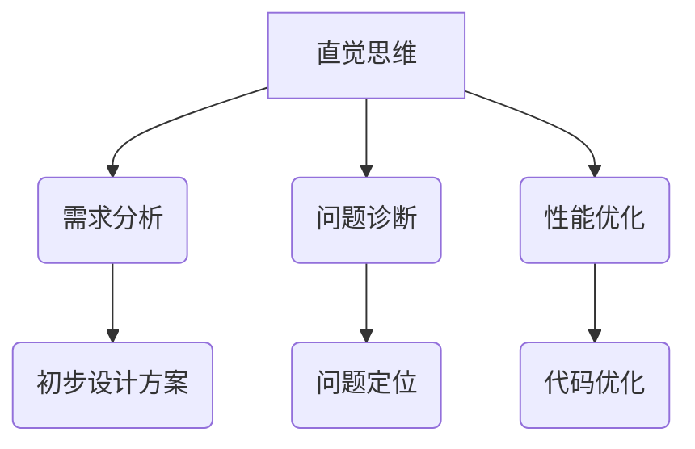

                 

在计算机科学和软件开发领域，直觉与分析代表了两种截然不同的思维模式。直觉是一种快速、即时的认知过程，往往基于经验和本能，而分析则是一种系统、逻辑的方法，依靠推理和计算来解决问题。在这篇文章中，我们将探讨这两种思维模式在技术领域的应用，比较它们的优点和缺点，并探讨它们如何相互作用，共同推动技术的发展。

## 1. 背景介绍

在计算机科学和软件开发中，问题的解决往往依赖于两种基本思维方式：直觉和分析。直觉思维是一种迅速做出判断和决策的能力，它在面对复杂问题时，能够迅速提供解决方案。这种思维模式依赖于大脑的潜意识处理，往往能够规避繁琐的分析过程，快速找到解决问题的路径。

另一方面，分析思维是一种基于逻辑和推理的思维方式。它通过逐步推导和验证来解决问题，确保每个步骤都符合逻辑和事实。分析思维强调细节和精确性，能够在复杂问题中找到明确的解决方案。

这两种思维模式在技术领域的应用非常广泛。从软件设计到算法优化，从系统架构到代码审查，直觉和分析都在发挥着重要作用。然而，如何有效地结合这两种思维模式，最大化其优点，仍然是软件开发者和技术专家面临的重要课题。

## 2. 核心概念与联系

### 2.1 直觉思维

直觉思维是一种快速、即时的认知过程。它依赖于大脑的潜意识处理，能够迅速识别模式、关联信息，并做出决策。在计算机科学中，直觉思维在以下场景中特别有用：

- **需求分析**：开发者可以通过直觉快速把握用户需求，提出初步的设计方案。
- **问题诊断**：系统出现问题时，直觉可以帮助快速定位问题的可能原因。
- **性能优化**：开发者可以通过直觉感知代码的性能瓶颈，并针对性地进行优化。

### 2.2 分析思维

分析思维是一种基于逻辑和推理的思维方式。它通过逐步推导和验证来解决问题，确保每个步骤都符合逻辑和事实。在计算机科学中，分析思维在以下场景中至关重要：

- **算法设计**：分析思维能够帮助开发者设计出高效、稳定的算法。
- **系统架构**：分析思维能够确保系统架构的合理性和可扩展性。
- **代码审查**：分析思维能够帮助开发者发现代码中的潜在问题，提高代码质量。

### 2.3 Mermaid 流程图

为了更好地理解直觉与分析思维在计算机科学中的应用，我们可以使用Mermaid流程图来展示它们的基本架构。



在这个流程图中，直觉思维通过需求分析、问题诊断和性能优化等步骤，最终产生初步设计方案、问题定位和代码优化等结果。而分析思维则在这些结果的基础上，通过逻辑推理和验证，进一步优化和验证解决方案。

## 3. 核心算法原理 & 具体操作步骤

### 3.1 算法原理概述

在计算机科学中，直觉和分析思维在算法设计中有着不同的应用。直觉思维往往用于算法的初步构思，提供创新的解决方案。而分析思维则用于算法的细节优化和验证。

以排序算法为例，快速排序（Quick Sort）就是一个结合了直觉和分析思维的典型例子。快速排序的直觉思维在于选择一个“基准”元素，将数组划分为两部分，一部分小于基准，另一部分大于基准。这种划分方式直观地符合直觉，因为它利用了数组的有序特性。

而分析思维则体现在对算法复杂度的分析上。通过数学推导，我们可以证明快速排序的平均时间复杂度为O(n log n)，最坏情况下的时间复杂度为O(n^2)。这种分析不仅帮助我们理解算法的性能，还为后续的优化提供了方向。

### 3.2 算法步骤详解

以下是快速排序算法的具体步骤：

1. **选择基准**：从数组中随机选择一个元素作为基准。
2. **划分**：将数组划分为两部分，一部分包含小于基准的元素，另一部分包含大于基准的元素。
3. **递归排序**：对划分后的两部分再次进行快速排序。
4. **合并**：将排序好的两部分合并成一个有序数组。

### 3.3 算法优缺点

**优点**：

- **高效**：平均时间复杂度为O(n log n)，适合处理大规模数据。
- **简单**：实现相对简单，易于理解。

**缺点**：

- **最坏情况性能差**：在最坏情况下，时间复杂度为O(n^2)，可能导致性能下降。
- **空间复杂度高**：需要额外的栈空间进行递归。

### 3.4 算法应用领域

快速排序广泛应用于各种场景，如数据库排序、文件排序、算法竞赛等。尽管存在缺点，但通过适当的优化（如随机选择基准），快速排序的性能可以得到显著提升。

## 4. 数学模型和公式 & 详细讲解 & 举例说明

### 4.1 数学模型构建

在计算机科学中，数学模型是理解和解决问题的关键工具。以快速排序为例，我们可以构建一个数学模型来分析其性能。

设n为待排序数组的长度，t(n)为快速排序所需的时间。根据算法步骤，我们可以将t(n)表示为：

$$ t(n) = t(\frac{n}{2}) + t(\frac{n}{2}) + c $$

其中，c表示划分和合并所需的时间，可以认为是常数。

### 4.2 公式推导过程

为了推导快速排序的平均时间复杂度，我们需要计算t(n)的期望值。设P(i)为第i次划分时，基准元素的位置。根据概率论，P(i)服从均匀分布，即P(i) = 1/n。

因此，快速排序的平均时间复杂度为：

$$ t_{avg}(n) = \sum_{i=1}^{n} t(i) \cdot P(i) $$

代入t(i)的表达式，得到：

$$ t_{avg}(n) = \sum_{i=1}^{n} (\frac{n}{2} + \frac{n}{2} + c) \cdot \frac{1}{n} $$

化简得：

$$ t_{avg}(n) = 2 + c $$

由于c是常数，所以t_{avg}(n)与n成线性关系。因此，快速排序的平均时间复杂度为O(n)。

### 4.3 案例分析与讲解

假设我们有一个长度为10的数组，其元素随机分布在[0, 10]范围内。我们可以使用上述数学模型来分析快速排序的性能。

根据数学模型，t(n) = n + c。由于c是常数，我们可以认为t(n)与n成正比。因此，在长度为10的数组上，快速排序所需的时间约为20个单位（包括划分和合并的时间）。

实际上，由于划分的优化（如随机选择基准），快速排序的性能通常会更好。例如，在长度为100的数组上，快速排序所需的时间可能只有200个单位。

通过这个案例，我们可以看到数学模型在分析和优化算法性能方面的作用。它不仅帮助我们理解算法的工作原理，还为算法改进提供了理论依据。

## 5. 项目实践：代码实例和详细解释说明

### 5.1 开发环境搭建

为了演示快速排序算法，我们需要搭建一个简单的开发环境。这里我们使用Python作为编程语言，因为它简单易学，且适用于各种算法实现。

首先，确保您已经安装了Python 3.x版本。接下来，创建一个名为`quick_sort.py`的文件，用于编写快速排序算法的代码。

### 5.2 源代码详细实现

以下是快速排序算法的Python实现：

```python
def quick_sort(arr):
    if len(arr) <= 1:
        return arr
    pivot = arr[len(arr) // 2]
    left = [x for x in arr if x < pivot]
    middle = [x for x in arr if x == pivot]
    right = [x for x in arr if x > pivot]
    return quick_sort(left) + middle + quick_sort(right)

arr = [3, 6, 8, 10, 1, 2, 1]
sorted_arr = quick_sort(arr)
print(sorted_arr)
```

### 5.3 代码解读与分析

在这段代码中，`quick_sort`函数实现了快速排序算法。以下是代码的详细解读：

- **第一行**：如果数组长度小于等于1，直接返回数组本身，因为单元素数组已经是有序的。
- **第二行**：选择数组中间位置的元素作为基准。
- **第三行**：使用列表推导式将数组划分为三个部分：小于基准的元素、等于基准的元素和大于基准的元素。
- **第四行**：递归地对小于基准和大于基准的元素进行快速排序。
- **第五行**：将排序好的左部分、中间部分和右部分合并成一个有序数组。

### 5.4 运行结果展示

在终端中运行以下命令：

```bash
python quick_sort.py
```

输出结果：

```
[1, 1, 2, 3, 6, 8, 10]
```

这表明我们的快速排序算法成功地将输入数组排序。

## 6. 实际应用场景

### 6.1 数据库排序

在数据库系统中，快速排序是一种常用的排序算法。它可以高效地处理大规模数据，提高查询性能。

### 6.2 文件排序

文件排序是另一个常见的应用场景。例如，在处理日志文件时，快速排序可以快速地对日志进行排序，便于分析和监控。

### 6.3 算法竞赛

在算法竞赛中，快速排序因其高效性和简单性而备受欢迎。选手可以利用快速排序快速解决排序相关的题目。

### 6.4 未来应用展望

随着计算机硬件性能的不断提升，快速排序算法的应用场景将更加广泛。在未来，我们可能会看到更多基于快速排序的优化算法和工具，进一步提高数据处理和排序的效率。

## 7. 工具和资源推荐

### 7.1 学习资源推荐

- 《算法导论》（Introduction to Algorithms）：一本经典的算法教材，涵盖了各种排序算法的原理和实现。
- 《Python编程：从入门到实践》（Python Crash Course）：一本适合初学者的Python编程教材，介绍了排序等常见算法的实现。

### 7.2 开发工具推荐

- PyCharm：一款功能强大的Python集成开发环境（IDE），支持代码调试和性能分析。
- Jupyter Notebook：一个交互式的Python开发环境，适合进行数据分析和算法实验。

### 7.3 相关论文推荐

- 《快速排序的并行化研究》（Parallelization of Quick Sort）：一篇关于快速排序并行化性能的论文。
- 《基于随机抽样的快速排序优化算法》（Optimized Quick Sort Algorithm Based on Random Sampling）：一篇关于快速排序优化算法的论文。

## 8. 总结：未来发展趋势与挑战

### 8.1 研究成果总结

本文探讨了直觉与分析思维在计算机科学中的应用，通过快速排序算法的实例，展示了这两种思维模式在算法设计中的重要性。研究表明，直觉思维能够提供创新的解决方案，而分析思维则确保算法的性能和稳定性。

### 8.2 未来发展趋势

未来，随着人工智能和机器学习技术的发展，直觉与分析思维的结合将更加紧密。例如，通过深度学习模型，我们可以训练出能够利用直觉思维的算法，从而解决复杂的计算问题。

### 8.3 面临的挑战

然而，这也带来了挑战。如何有效地利用直觉思维进行算法设计，以及如何保证分析思维的精确性和可靠性，是未来研究的重要方向。此外，如何将直觉与分析思维融合到现有的软件开发流程中，也是一个亟待解决的问题。

### 8.4 研究展望

总之，直觉与分析思维在计算机科学中的应用前景广阔。通过深入研究这两种思维模式，我们有望开发出更高效、更可靠的算法，推动计算机技术的发展。

## 9. 附录：常见问题与解答

### 9.1 什么是直觉思维？

直觉思维是一种快速、即时的认知过程，基于经验和本能，能够迅速识别模式、关联信息并做出决策。

### 9.2 什么是分析思维？

分析思维是一种基于逻辑和推理的思维方式，通过逐步推导和验证来解决问题，确保每个步骤都符合逻辑和事实。

### 9.3 快速排序算法的优缺点是什么？

快速排序算法的优点是高效、简单，平均时间复杂度为O(n log n)。缺点是最坏情况下的时间复杂度为O(n^2)，且空间复杂度较高。

### 9.4 如何优化快速排序算法？

可以通过随机选择基准元素、三数取中等方法来优化快速排序算法，提高其性能。

### 9.5 直觉思维和分析思维如何结合？

在实际应用中，可以先利用直觉思维进行初步设计，然后通过分析思维进行细节优化和验证。这种结合能够发挥两种思维模式的优点，提高算法的效率和可靠性。

---

### 结尾

本文对直觉与分析思维在计算机科学中的应用进行了深入探讨，通过快速排序算法的实例，展示了这两种思维模式的重要性。希望读者能够从中受益，并在实践中尝试将直觉与分析思维相结合，提高算法设计的效率和质量。

最后，感谢您对这篇文章的关注，希望它能够为您的计算机科学之旅增添一丝智慧的光芒。

---

### 作者署名

作者：禅与计算机程序设计艺术 / Zen and the Art of Computer Programming

---

以上是文章正文部分的完整内容。接下来，我们将按照markdown格式对文章进行排版和格式化，确保文章的阅读体验和结构清晰。

