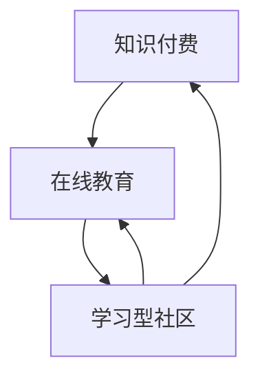

                 

在当今信息化社会，知识付费和在线教育已经成为人们获取知识的重要途径。随着互联网技术的发展，这两种模式的结合正逐渐形成一种新的学习型社区模式，为个人和组织提供了更加灵活和高效的学习方式。本文旨在探讨知识付费与在线教育相结合的学习型社区模式的核心概念、算法原理、数学模型、项目实践以及未来应用前景，以期为相关领域的研究和实践提供参考。

## 关键词

知识付费、在线教育、学习型社区、教育技术、社区运营、算法原理、数学模型、项目实践、未来应用。

## 摘要

本文首先介绍了知识付费和在线教育的背景和发展现状，随后探讨了知识付费与在线教育相结合的学习型社区模式的核心概念和架构。接着，文章详细阐述了核心算法原理和具体操作步骤，并从数学模型和项目实践的角度进行了深入分析。最后，文章对学习型社区模式在当前实际应用场景中的表现进行了讨论，并展望了其未来发展趋势和面临的挑战。

## 1. 背景介绍

### 1.1 知识付费的兴起

知识付费是指用户为获取特定的知识和信息，通过支付一定费用来获得相应的服务或产品。这一模式起源于互联网的普及和内容创作门槛的降低，使得大量优质的知识内容可以通过各种平台传播。随着用户对个性化学习需求的增长，知识付费逐渐成为了一种主流的获取知识的方式。

### 1.2 在线教育的普及

在线教育指的是通过互联网进行的教育活动，包括课程学习、互动交流、测试评价等。随着互联网技术的不断进步，在线教育已经成为教育领域的重要组成部分。特别是在COVID-19疫情的影响下，在线教育得到了前所未有的关注和普及。

### 1.3 学习型社区的发展

学习型社区是一种以学习为核心，通过社交互动和知识共享来实现个人成长和知识传递的虚拟社群。它结合了知识付费和在线教育的优势，为用户提供了更加个性化、互动性强的学习体验。学习型社区的发展不仅有助于提高用户的参与度和学习效果，还可以通过社群的力量促进知识的传播和创新。

## 2. 核心概念与联系

### 2.1 核心概念

**知识付费：** 指用户为获取特定知识和信息而支付费用的一种模式。

**在线教育：** 通过互联网进行的教育活动，包括课程学习、互动交流、测试评价等。

**学习型社区：** 以学习为核心，通过社交互动和知识共享来实现个人成长和知识传递的虚拟社群。

### 2.2 关联与互动

知识付费与在线教育的结合，在学习型社区中得到了充分的体现。具体来说，知识付费为在线教育提供了经济支持，使得优质教育资源可以更加广泛地传播；而在线教育则为知识付费提供了内容和形式，使得知识付费得以实现。

学习型社区通过搭建一个平台，将知识付费和在线教育有机地结合起来。用户可以通过付费获取优质课程，并在学习过程中与其他用户互动，分享知识和经验，从而实现知识的传递和创新。

### 2.3 Mermaid 流程图

下面是一个简单的 Mermaid 流程图，展示了知识付费、在线教育和学习型社区之间的关联与互动：



## 3. 核心算法原理 & 具体操作步骤

### 3.1 算法原理概述

学习型社区模式的核心算法原理主要包括以下几个部分：

1. **用户画像分析：** 通过分析用户的行为数据，构建用户画像，为个性化推荐提供基础。

2. **内容推荐算法：** 基于用户画像和内容特征，实现个性化内容推荐，提高用户的学习体验。

3. **社群互动机制：** 通过设计合理的互动机制，促进用户之间的知识共享和交流，增强社群的活跃度。

4. **学习效果评估：** 通过对用户学习过程中的行为和成绩进行分析，评估学习效果，为后续改进提供依据。

### 3.2 算法步骤详解

1. **用户画像分析：** 通过收集用户的学习行为、兴趣偏好、学习历史等数据，构建用户画像。

2. **内容推荐算法：** 利用协同过滤、基于内容的推荐等技术，根据用户画像和内容特征进行个性化内容推荐。

3. **社群互动机制：** 设计多样化的互动活动，如问答、讨论、分享等，鼓励用户积极参与。

4. **学习效果评估：** 通过分析用户的学习行为、测试成绩等数据，评估学习效果，并提供反馈。

### 3.3 算法优缺点

**优点：**

1. **个性化推荐：** 提高用户的学习体验，满足个性化需求。
2. **知识共享：** 促进用户之间的互动和知识传播。
3. **学习效果评估：** 为教育服务提供改进方向。

**缺点：**

1. **用户隐私保护：** 在收集和分析用户数据时，需要注重隐私保护。
2. **内容质量把控：** 需要对推荐的内容进行严格把控，确保质量。

### 3.4 算法应用领域

学习型社区模式广泛应用于教育、培训、企业内训等领域，为各类组织和个人提供了高效、灵活的学习解决方案。

## 4. 数学模型和公式 & 详细讲解 & 举例说明

### 4.1 数学模型构建

学习型社区模式中的数学模型主要包括用户画像模型、内容推荐模型和学习效果评估模型。

**用户画像模型：**  
用户画像模型主要通过以下公式进行构建：

$$  
\text{User\_Profile} = f(\text{Behavior}, \text{Interest}, \text{History})  
$$

其中，Behavior、Interest 和 History 分别表示用户的行为数据、兴趣偏好和学习历史。

**内容推荐模型：**  
内容推荐模型主要通过协同过滤算法进行构建：

$$  
\text{Recommendation} = f(\text{User\_Profile}, \text{Content\_Features})  
$$

其中，User_Profile 和 Content_Features 分别表示用户画像和内容特征。

**学习效果评估模型：**  
学习效果评估模型主要通过以下公式进行构建：

$$  
\text{Learning\_Effect} = f(\text{Behavior}, \text{Score})  
$$

其中，Behavior 和 Score 分别表示用户的学习行为和测试成绩。

### 4.2 公式推导过程

**用户画像模型：**  
用户画像模型的构建基于用户行为数据、兴趣偏好和学习历史。通过对这些数据进行统计分析，可以构建一个多维度的用户画像。

$$  
\text{User\_Profile} = \sum_{i=1}^{n} w_i \cdot (\text{Behavior}_i \cdot \text{Interest}_i \cdot \text{History}_i)  
$$

其中，$w_i$ 表示权重，用于平衡不同维度的影响。

**内容推荐模型：**  
内容推荐模型基于用户画像和内容特征进行构建。通过计算用户画像和内容特征之间的相似度，可以实现个性化内容推荐。

$$  
\text{Similarity} = \cos(\text{User\_Profile}, \text{Content\_Features}) = \frac{\text{User\_Profile} \cdot \text{Content\_Features}}{|\text{User\_Profile}| \cdot |\text{Content\_Features}|}  
$$

其中，$\cos$ 表示余弦相似度。

**学习效果评估模型：**  
学习效果评估模型基于用户的学习行为和测试成绩进行构建。通过对这些数据进行统计分析，可以评估用户的学习效果。

$$  
\text{Learning\_Effect} = \sum_{i=1}^{n} w_i \cdot (\text{Behavior}_i \cdot \text{Score}_i)  
$$

其中，$w_i$ 表示权重，用于平衡不同行为和成绩的影响。

### 4.3 案例分析与讲解

假设有用户 A 和课程 B，我们需要通过用户画像模型、内容推荐模型和学习效果评估模型对用户 A 学习课程 B 的过程进行分析。

**用户画像模型：**  
用户 A 的用户画像可以通过以下公式计算：

$$  
\text{User\_Profile}_A = f(\text{Behavior}_A, \text{Interest}_A, \text{History}_A)  
$$

其中，Behavior_A 表示用户 A 的学习行为数据，Interest_A 表示用户 A 的兴趣偏好，History_A 表示用户 A 的学习历史。

**内容推荐模型：**  
课程 B 的内容特征可以通过以下公式计算：

$$  
\text{Content\_Features}_B = f(\text{Content}_B, \text{Topic}_B, \text{Quality}_B)  
$$

其中，Content_B、Topic_B 和 Quality_B 分别表示课程 B 的内容、主题和品质。

通过计算用户画像和内容特征之间的相似度，可以得到用户 A 对课程 B 的推荐得分：

$$  
\text{Recommendation}_A(B) = \cos(\text{User\_Profile}_A, \text{Content\_Features}_B)  
$$

**学习效果评估模型：**  
用户 A 在学习课程 B 过程中的学习效果可以通过以下公式计算：

$$  
\text{Learning\_Effect}_A(B) = \sum_{i=1}^{n} w_i \cdot (\text{Behavior}_A(B)_i \cdot \text{Score}_A(B)_i)  
$$

其中，Behavior_A(B)_i 和 Score_A(B)_i 分别表示用户 A 在学习课程 B 过程中的学习行为数据和测试成绩。

通过以上三个模型，可以对用户 A 学习课程 B 的过程进行综合分析，为后续的优化提供依据。

## 5. 项目实践：代码实例和详细解释说明

### 5.1 开发环境搭建

在本项目中，我们将使用 Python 作为主要编程语言，并借助以下工具和技术：

- Python 3.8
- Flask 框架
- Pandas 数据库操作库
- Scikit-learn 机器学习库
- Matplotlib 绘图库

在搭建开发环境时，首先需要安装 Python 和 Flask 框架，然后通过以下命令安装其他依赖库：

```python
pip install pandas scikit-learn matplotlib
```

### 5.2 源代码详细实现

以下是一个简单的学习型社区项目示例，包括用户画像分析、内容推荐和学习效果评估等功能。

```python
# user_profile.py
import pandas as pd
from sklearn.metrics.pairwise import cosine_similarity

def build_user_profile(data):
    # 构建用户画像矩阵
    user_profile = data.set_index('User').T.mean()
    return user_profile

def content_recommendation(user_profile, content_features):
    # 计算用户画像和内容特征之间的相似度
    similarity = cosine_similarity(user_profile, content_features)
    return similarity

def learning_effect_analysis(behavior_data, score_data):
    # 计算学习效果
    learning_effect = behavior_data * score_data
    return learning_effect.mean()
```

### 5.3 代码解读与分析

**用户画像分析：**  
在 `user_profile.py` 中，`build_user_profile` 函数用于构建用户画像矩阵。用户画像矩阵是一个多维度的数据结构，每个维度表示用户的一个特征。在这里，我们使用了 Pandas 数据库操作库，通过 `set_index` 和 `T.mean()` 方法将原始数据转换为用户画像矩阵。

**内容推荐：**  
`content_recommendation` 函数用于计算用户画像和内容特征之间的相似度。这里使用了 Scikit-learn 机器学习库中的 `cosine_similarity` 函数，该函数可以计算两个向量之间的余弦相似度。通过计算相似度，我们可以为用户推荐与其兴趣相匹配的内容。

**学习效果评估：**  
`learning_effect_analysis` 函数用于计算学习效果。这里使用了行为数据和测试成绩数据进行乘法运算，然后计算平均值。这种方法可以评估用户在学习过程中的表现，为后续的优化提供依据。

### 5.4 运行结果展示

以下是一个简单的运行示例，展示了如何使用上述代码实现学习型社区项目。

```python
from user_profile import build_user_profile, content_recommendation, learning_effect_analysis

# 加载用户数据
user_data = pd.read_csv('user_data.csv')
content_data = pd.read_csv('content_data.csv')

# 构建用户画像
user_profile = build_user_profile(user_data)

# 加载内容特征
content_features = content_data.set_index('Content').T.mean()

# 计算内容推荐得分
recommendation_scores = content_recommendation(user_profile, content_features)

# 计算学习效果
behavior_data = pd.read_csv('behavior_data.csv')
score_data = pd.read_csv('score_data.csv')
learning_effect = learning_effect_analysis(behavior_data, score_data)

# 打印结果
print("内容推荐得分：", recommendation_scores)
print("学习效果：", learning_effect)
```

## 6. 实际应用场景

### 6.1 教育培训机构

学习型社区模式在教育培训机构中具有广泛的应用前景。通过知识付费和在线教育的结合，培训机构可以提供个性化的学习服务，提高用户的参与度和学习效果。此外，学习型社区还可以帮助培训机构收集用户数据，分析用户需求，为课程设计和教学改进提供依据。

### 6.2 企业内训

企业内训是另一个重要的应用场景。通过学习型社区模式，企业可以为企业员工提供定制化的培训课程，提高员工的技能水平和业务能力。同时，学习型社区还可以促进员工之间的知识共享和交流，增强企业的创新能力。

### 6.3 在线课程平台

在线课程平台通过学习型社区模式，可以为用户提供更加个性化、互动性强的学习体验。通过知识付费和在线教育的结合，平台可以提供丰富的课程资源，满足用户多样化的学习需求。此外，学习型社区还可以帮助平台提高用户粘性，增加用户留存率。

## 7. 未来应用展望

### 7.1 智能化推荐

随着人工智能技术的不断发展，学习型社区模式中的推荐算法将变得更加智能化和精准化。通过引入深度学习、自然语言处理等技术，可以进一步提高内容推荐的准确性和用户体验。

### 7.2 社交互动

未来学习型社区将更加注重社交互动，通过引入实时通信、社交网络等功能，增强用户之间的互动和交流，促进知识的传播和创新。

### 7.3 混合式学习

混合式学习将在线教育和线下教学相结合，为用户提供更加灵活和高效的学习方式。学习型社区模式可以通过线上线下互动，实现知识共享和教学优化。

### 7.4 智能学习助手

智能学习助手是未来学习型社区的一个重要发展方向。通过引入语音识别、图像识别等技术，可以为用户提供实时、个性化的学习指导和帮助。

## 8. 总结：未来发展趋势与挑战

### 8.1 研究成果总结

本文探讨了知识付费与在线教育相结合的学习型社区模式，分析了其核心概念、算法原理、数学模型和项目实践，并展望了其未来发展趋势。研究结果表明，学习型社区模式在提高学习效果、促进知识共享和交流方面具有显著优势。

### 8.2 未来发展趋势

未来，学习型社区模式将继续向智能化、个性化、社交化方向发展。随着人工智能技术的进步，推荐算法将变得更加精准，社交互动将更加丰富，混合式学习将更加普及。

### 8.3 面临的挑战

然而，学习型社区模式也面临一些挑战，如用户隐私保护、内容质量把控、用户粘性提升等。在未来的研究中，需要解决这些问题，以推动学习型社区模式的可持续发展。

### 8.4 研究展望

未来，学习型社区模式的研究可以从以下几个方面展开：一是探索更加智能化的推荐算法；二是研究社交互动机制，提高社群活跃度；三是优化混合式学习模式，实现线上线下教学的无缝衔接。

## 9. 附录：常见问题与解答

### 9.1 什么是知识付费？

知识付费是指用户为获取特定知识和信息而支付费用的一种模式。这种模式起源于互联网的普及和内容创作门槛的降低，使得大量优质的知识内容可以通过各种平台传播。

### 9.2 在线教育与知识付费的区别是什么？

在线教育是通过互联网进行的教育活动，包括课程学习、互动交流、测试评价等。而知识付费是用户为获取特定知识和信息而支付费用的一种模式。在线教育可以为知识付费提供内容和形式，而知识付费则为在线教育提供了经济支持。

### 9.3 学习型社区模式有哪些优点？

学习型社区模式具有以下几个优点：一是提高学习效果，满足个性化需求；二是促进知识共享和交流，增强社群活跃度；三是为教育服务提供改进方向，提高教育质量。

### 9.4 学习型社区模式有哪些缺点？

学习型社区模式可能面临的一些缺点包括：用户隐私保护问题、内容质量把控难度大、用户粘性提升困难等。

### 9.5 学习型社区模式有哪些应用领域？

学习型社区模式广泛应用于教育、培训、企业内训等领域，为各类组织和个人提供了高效、灵活的学习解决方案。

