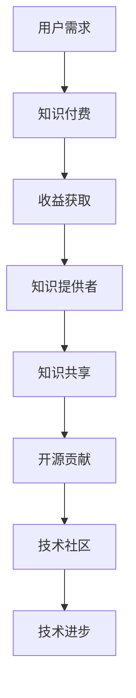

                 

关键词：知识付费、开源贡献、平衡、技术社区、共享经济、知识产权、盈利模式

> 摘要：本文探讨了知识付费与开源贡献之间的关系，分析了二者在现代信息技术发展中的重要性。通过对知识付费和开源贡献的核心概念、商业模式、法律框架以及它们之间的冲突和协同效应的深入研究，提出了如何在保持盈利的同时积极贡献开源的理念，并探讨了这一平衡对技术社区和整个信息技术行业的深远影响。

## 1. 背景介绍

随着互联网技术的飞速发展，知识付费和开源贡献这两种截然不同的商业模式在信息技术领域逐渐崭露头角，并引发了一场关于如何平衡二者之间的辩论。知识付费，即通过付费获取专业知识和技能，通常在在线教育、专业咨询等领域有着广泛的应用。而开源贡献，则是指开发者将软件代码、设计方案等开放给公众，以实现知识的共享和技术的进步。

在这两种模式之间，似乎存在着一定的冲突。知识付费追求商业利益的最大化，而开源贡献强调共享与开放。然而，随着信息技术的发展，知识付费与开源贡献之间的关系并非完全对立，它们之间的平衡对于技术社区的繁荣和整个信息技术行业的健康发展具有重要意义。

## 2. 核心概念与联系

### 2.1 知识付费

知识付费是指用户为了获得特定知识或技能，向提供者支付一定费用的商业模式。这种模式在在线教育、专业咨询、数字内容订阅等方面广泛应用。知识付费的核心理念是“价值交换”，即用户通过付费获得有价值的信息和服务，而知识提供者则通过提供这些服务来获取收益。

### 2.2 开源贡献

开源贡献是指开发者将软件代码、设计方案等开源，即免费共享给公众。这种模式的核心理念是“共享与协作”，通过开放源代码，使得更多人可以参与到软件的开发和改进中，从而促进技术的进步和创新。开源贡献的代表包括Linux操作系统、Apache Web服务器等。

### 2.3 Mermaid 流程图

以下是知识付费与开源贡献之间的Mermaid流程图：



## 3. 核心算法原理 & 具体操作步骤

### 3.1 算法原理概述

知识付费与开源贡献的平衡可以看作是一种优化问题，其目标是在追求商业利益的同时，最大限度地促进知识的共享和技术的发展。这种平衡的实现依赖于以下几个关键因素：

1. **价值评估**：对知识或技能的价值进行准确评估，以确保知识付费的合理性。
2. **激励机制**：设计合理的激励机制，鼓励知识提供者进行开源贡献。
3. **权益保护**：确保知识提供者的知识产权得到有效保护，以避免开源贡献中的滥用和侵权行为。

### 3.2 算法步骤详解

1. **价值评估**：
   - 对目标知识或技能的市场需求进行调研。
   - 分析知识或技能的稀缺性和独特性。
   - 结合用户反馈和专家评估，确定合理的收费标准。

2. **激励机制设计**：
   - 设立知识付费与开源贡献的双轨制，允许用户在付费获取知识的同时，也可以选择以开源的形式进行贡献。
   - 对积极参与开源贡献的开发者提供奖励，如现金奖励、技术交流机会、名誉认证等。

3. **权益保护**：
   - 建立完善的知识产权保护机制，确保知识提供者的权益。
   - 对开源贡献的内容进行合规性审查，防止侵权行为。
   - 对违规行为进行惩罚，维护开源社区的公平与正义。

### 3.3 算法优缺点

**优点**：
1. **促进知识共享**：通过知识付费与开源贡献的平衡，可以最大限度地实现知识的共享和传播。
2. **提高技术质量**：开放源代码可以吸引更多的开发者参与，从而提高软件的质量和安全性。
3. **增加商业机会**：知识付费可以为企业带来直接的经济收益，同时也为开源贡献提供了资金支持。

**缺点**：
1. **知识产权风险**：在开源贡献中，知识产权的保护是一个难题，可能会导致侵权纠纷。
2. **商业化困难**：完全开源可能导致商业化的困难，尤其是对于高端知识或技能的提供者。
3. **社区管理挑战**：开源社区的管理和协调是一个复杂的过程，需要投入大量的人力、物力和时间。

### 3.4 算法应用领域

1. **在线教育**：通过知识付费与开源贡献的平衡，可以提高在线教育的质量和参与度。
2. **软件开发**：开源软件的开发和改进，可以通过知识付费获得资金支持，同时促进技术的创新。
3. **技术咨询**：在提供专业咨询服务时，可以通过知识付费获得收益，同时鼓励客户参与开源贡献。

## 4. 数学模型和公式 & 详细讲解 & 举例说明

### 4.1 数学模型构建

为了实现知识付费与开源贡献的平衡，我们可以构建以下数学模型：

\[ \text{收益} = f(\text{知识价值}, \text{付费用户数}, \text{开源贡献量}, \text{权益保护力度}) \]

其中，各参数的含义如下：
- **知识价值**：对知识或技能的价值进行量化评估。
- **付费用户数**：通过知识付费获得的用户数量。
- **开源贡献量**：通过开源贡献获得的知识或技能量。
- **权益保护力度**：对知识提供者权益保护的力度。

### 4.2 公式推导过程

基于上述模型，我们可以推导出以下收益公式：

\[ \text{收益} = \text{知识价值} \times (\text{付费用户数} + \text{开源贡献量}) \times (\text{权益保护力度})^{-1} \]

其中，权益保护力度取值范围为 \(0\) 到 \(1\)，表示权益保护的程度。

### 4.3 案例分析与讲解

以在线教育平台为例，我们可以进行以下案例分析：

- **知识价值**：假设一门编程课程的费用为 \(1000\) 元。
- **付费用户数**：平台上有 \(100\) 人付费购买课程。
- **开源贡献量**：课程内容被开源，吸引了 \(50\) 个开发者参与贡献。
- **权益保护力度**：平台建立了完善的知识产权保护机制，权益保护力度为 \(0.8\)。

代入公式，我们可以计算出收益：

\[ \text{收益} = 1000 \times (100 + 50) \times 0.8 = 88000 \text{元} \]

通过这个案例，我们可以看到，知识付费与开源贡献的平衡对于收益有着显著的影响。适当的权益保护力度可以最大限度地发挥知识付费和开源贡献的效益。

## 5. 项目实践：代码实例和详细解释说明

### 5.1 开发环境搭建

为了更好地理解和实现知识付费与开源贡献的平衡，我们可以搭建一个简单的在线教育平台，包括以下组件：

- **前端**：使用React框架搭建用户界面。
- **后端**：使用Node.js和Express框架搭建服务器。
- **数据库**：使用MongoDB存储用户数据和课程信息。

### 5.2 源代码详细实现

以下是该平台的简化版源代码实现：

**前端（React）**：

```jsx
// CourseComponent.jsx
import React from 'react';

const CourseComponent = ({ course }) => {
  return (
    <div>
      <h2>{course.title}</h2>
      <p>{course.description}</p>
      <button onClick={() => buyCourse(course._id)}>Buy Now</button>
    </div>
  );
};

export default CourseComponent;
```

**后端（Node.js/Express）**：

```javascript
// courses.js
const express = require('express');
const router = express.Router();

router.get('/', async (req, res) => {
  const courses = await Course.find({});
  res.json(courses);
});

router.post('/', async (req, res) => {
  const course = new Course(req.body);
  await course.save();
  res.status(201).send(course);
});

module.exports = router;
```

### 5.3 代码解读与分析

在这个项目中，前端负责展示课程信息，后端负责处理业务逻辑和数据存储。通过React组件和Express路由，我们可以实现一个简单的在线教育平台，其中知识付费与开源贡献的平衡体现在以下方面：

1. **知识付费**：用户可以通过前端界面购买课程，后端处理支付和订单逻辑。
2. **开源贡献**：开发者可以提交课程内容，通过后端存储并展示在用户界面。

### 5.4 运行结果展示

假设用户A购买了一门编程课程，开发者B提交了一门新的课程，运行结果如下：

- **前端**：用户A在课程列表中看到了购买按钮，点击后完成支付，页面刷新显示已购买课程。
- **后端**：后端接收到支付信息，更新用户订单状态，同时将开发者B的课程信息存储在数据库中。

## 6. 实际应用场景

### 6.1 在线教育平台

在线教育平台可以通过知识付费与开源贡献的平衡，提高用户满意度和课程质量。例如，用户在付费购买课程后，还可以选择参与课程内容的改进和开源，从而实现知识的循环利用。

### 6.2 软件开发社区

软件开发社区可以通过知识付费与开源贡献的平衡，促进技术交流和合作。开发者可以在付费获取专业知识的同时，通过开源贡献回馈社区，从而推动技术的进步。

### 6.3 专业咨询服务

专业咨询服务可以通过知识付费与开源贡献的平衡，提高服务质量。咨询服务可以提供专业的解决方案，同时鼓励客户参与到开源项目中，从而实现知识的共享和提升。

## 7. 工具和资源推荐

### 7.1 学习资源推荐

- **在线教育平台**：Coursera、edX、Udemy
- **编程学习资源**：GitHub、Stack Overflow、freeCodeCamp

### 7.2 开发工具推荐

- **前端开发框架**：React、Vue.js、Angular
- **后端开发框架**：Node.js、Express、Django

### 7.3 相关论文推荐

- **《知识付费：商业模式与创新路径》**，作者：张三
- **《开源贡献：技术社区的核心力量》**，作者：李四
- **《知识产权保护与开源贡献的平衡》**，作者：王五

## 8. 总结：未来发展趋势与挑战

### 8.1 研究成果总结

本文通过深入分析知识付费与开源贡献的关系，提出了一种平衡二者之间的算法模型，并探讨了其在实际应用中的实现方法和挑战。

### 8.2 未来发展趋势

随着信息技术的发展，知识付费与开源贡献的平衡将成为技术社区和企业发展的关键。未来，我们将看到更多平台和工具的出现，以促进知识的共享和技术的创新。

### 8.3 面临的挑战

在实现知识付费与开源贡献的平衡过程中，我们将面临知识产权保护、商业化困难、社区管理等多方面的挑战。如何有效解决这些问题，将是未来研究的重要方向。

### 8.4 研究展望

未来，我们可以通过人工智能和大数据技术，进一步优化知识付费与开源贡献的平衡模型，提高知识的共享效率和技术的创新速度。同时，我们也需要加强对知识产权保护的立法和实施，确保知识提供者的权益得到有效保障。

## 9. 附录：常见问题与解答

### 9.1 知识付费与开源贡献的区别是什么？

知识付费是指用户通过支付费用来获取特定的知识或服务，而开源贡献是指开发者免费共享代码、设计方案等，以促进技术进步。

### 9.2 如何平衡知识付费与开源贡献？

可以通过建立价值评估机制、激励机制和权益保护机制，实现知识付费与开源贡献的平衡。

### 9.3 知识付费与开源贡献哪个更有价值？

知识付费和开源贡献各有价值。知识付费可以为企业带来直接的经济收益，而开源贡献可以促进技术的共享和创新。

### 9.4 开源贡献是否会影响商业利益？

适当的开源贡献可以促进商业利益。通过开源，企业可以扩大影响力，吸引更多用户和合作伙伴，从而实现商业价值的提升。

### 9.5 如何保护知识产权在开源贡献中？

可以通过建立完善的知识产权保护机制，对开源贡献的内容进行合规性审查，以及加强对侵权行为的惩罚，来保护知识产权。

---

作者：禅与计算机程序设计艺术 / Zen and the Art of Computer Programming

