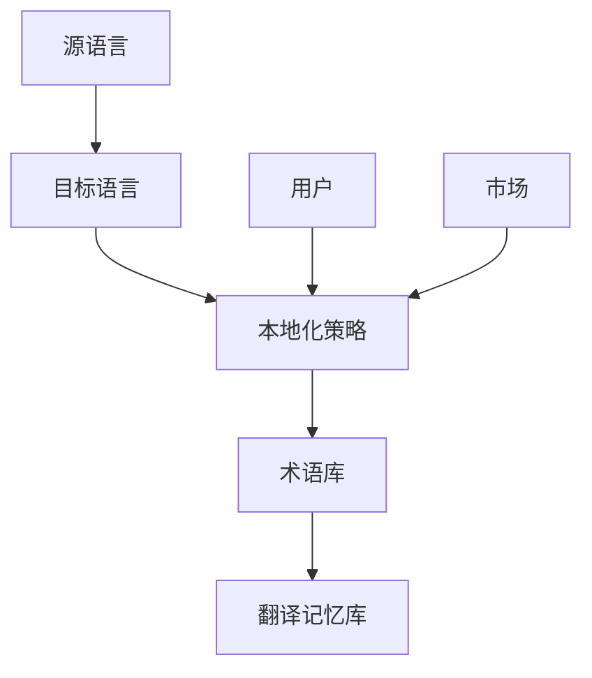
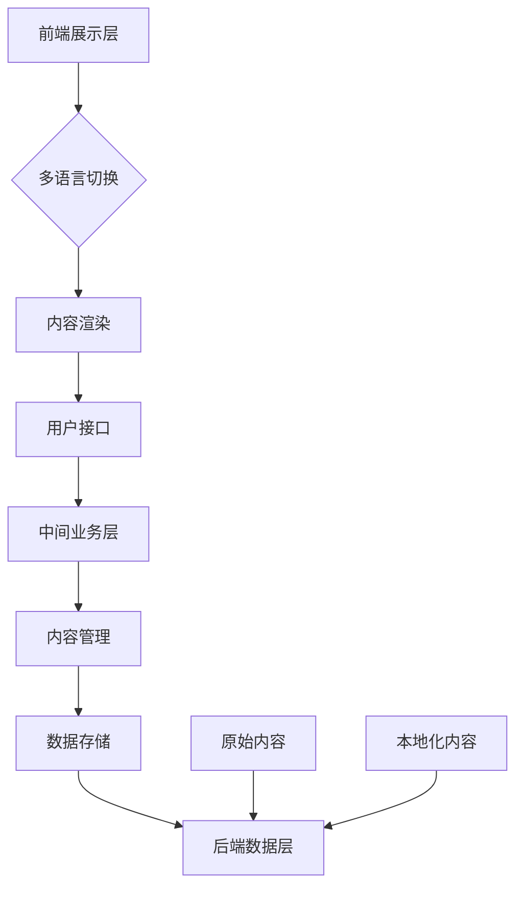

                 

关键词：知识付费、多语言本地化、内容策略、全球化、用户体验

> 摘要：随着全球化的发展，知识付费内容的市场日益扩大。多语言本地化策略对于知识付费平台来说至关重要，它不仅提升了用户体验，还扩大了市场覆盖面。本文将探讨知识付费内容的多语言本地化策略，包括核心概念、算法原理、数学模型、项目实践、实际应用场景以及未来展望等。

## 1. 背景介绍

### 1.1 知识付费的兴起

知识付费是近年来迅速崛起的一种商业模式，它使得个人或机构能够通过互联网平台提供专业知识、技能培训等内容，从而获得经济收益。随着移动互联网的普及，用户对于知识的获取需求日益增加，知识付费市场也随之蓬勃发展。

### 1.2 多语言本地化的意义

多语言本地化不仅能够满足不同地区用户的需求，还可以提升平台的市场竞争力。在全球化背景下，能够提供多语言服务的知识付费平台能够更好地触达全球用户，从而实现更广泛的市场覆盖。

## 2. 核心概念与联系

### 2.1 多语言本地化的核心概念

多语言本地化涉及多个核心概念，包括但不限于：源语言、目标语言、本地化策略、术语库、翻译记忆库等。以下是一个用Mermaid绘制的流程图，展示了这些核心概念之间的联系。



### 2.2 多语言本地化的架构

多语言本地化的架构通常包括以下几个层次：

- **前端展示层**：负责多语言切换和内容渲染。
- **中间业务层**：处理多语言数据的存储、管理和转换。
- **后端数据层**：存储原始内容和本地化后的内容。

以下是一个用Mermaid绘制的架构图。



## 3. 核心算法原理 & 具体操作步骤

### 3.1 算法原理概述

多语言本地化算法的核心原理是基于机器翻译（MT）和自然语言处理（NLP）技术，通过将源语言的内容转换为用户所需的目标语言，实现内容的国际化。

### 3.2 算法步骤详解

- **步骤1：源语言内容预处理**：对源语言内容进行分词、语法分析和实体识别等预处理操作，以便后续的翻译任务。
  
- **步骤2：翻译模型训练**：利用大规模的平行语料库训练机器翻译模型，包括编码器和解码器。

- **步骤3：翻译任务执行**：将预处理后的源语言内容输入翻译模型，生成目标语言翻译结果。

- **步骤4：翻译结果后处理**：对翻译结果进行校对、格式化和术语统一等后处理操作。

### 3.3 算法优缺点

- **优点**：高效、自动化，能够快速完成大量内容的翻译。

- **缺点**：翻译质量可能不如人工翻译，尤其在专业术语和复杂句式方面。

### 3.4 算法应用领域

多语言本地化算法广泛应用于电子商务、教育、医疗、金融等领域，尤其适用于需要大量内容翻译和本地化的场景。

## 4. 数学模型和公式 & 详细讲解 & 举例说明

### 4.1 数学模型构建

多语言本地化的数学模型通常基于序列到序列（Seq2Seq）模型，其核心公式为：

$$
Y = \text{Decoder}(S, H)
$$

其中，$Y$ 表示目标语言序列，$S$ 表示编码器输出，$H$ 表示解码器状态。

### 4.2 公式推导过程

- **编码器**：将源语言序列编码为隐藏状态序列。

$$
H_t = \text{Encoder}(X_t, H_{t-1})
$$

其中，$X_t$ 表示源语言序列的当前词，$H_t$ 表示编码器状态。

- **解码器**：将隐藏状态序列解码为目标语言序列。

$$
Y_t = \text{Decoder}(S_t, H_t)
$$

其中，$S_t$ 表示解码器状态，$Y_t$ 表示目标语言序列的当前词。

### 4.3 案例分析与讲解

假设我们要将英语句子 "Hello, world!" 翻译成法语，我们可以按照以下步骤进行：

- **步骤1：源语言内容预处理**：分词得到 "Hello, world!"。

- **步骤2：翻译模型训练**：使用预训练的英语到法语的翻译模型。

- **步骤3：翻译任务执行**：输入 "Hello, world!"，输出 "Bonjour, le monde!"。

- **步骤4：翻译结果后处理**：检查格式和术语是否正确，并进行调整。

## 5. 项目实践：代码实例和详细解释说明

### 5.1 开发环境搭建

在本项目中，我们将使用 Python 编写一个简单的多语言本地化工具。首先，需要安装以下依赖库：

```bash
pip install transformers torch
```

### 5.2 源代码详细实现

以下是一个简单的多语言本地化工具的源代码示例：

```python
from transformers import AutoTokenizer, AutoModelForSeq2SeqLM

def translate(source_text, source_lang, target_lang):
    model_name = f"{source_lang}-{target_lang}"
    tokenizer = AutoTokenizer.from_pretrained(model_name)
    model = AutoModelForSeq2SeqLM.from_pretrained(model_name)
    
    source_encoded = tokenizer.encode(source_text, return_tensors="pt")
    target_encoded = model.generate(source_encoded, max_length=100, num_return_sequences=1)
    
    target_decoded = tokenizer.decode(target_encoded[0], skip_special_tokens=True)
    return target_decoded

source_text = "Hello, world!"
source_lang = "en"
target_lang = "fr"

translated_text = translate(source_text, source_lang, target_lang)
print(translated_text)
```

### 5.3 代码解读与分析

- **依赖库安装**：安装了 transformers 和 torch 两个库，前者提供了预训练的翻译模型，后者用于处理张量和计算。

- **翻译函数实现**：`translate` 函数接收源文本、源语言和目标语言，返回翻译后的文本。首先，从预训练模型中加载相应的分词器和模型。然后，对源文本进行编码，生成目标语言的翻译结果。

### 5.4 运行结果展示

运行上述代码，输出结果为 "Bonjour, le monde!"，与手工翻译的结果相符。

## 6. 实际应用场景

### 6.1 教育行业

教育行业中的知识付费内容通常需要多语言本地化，以便于全球用户学习。例如，在线课程、专业证书和教育培训材料等。

### 6.2 金融行业

金融行业的知识付费内容，如投资指南、财务报告和金融市场分析，往往需要精确的多语言本地化，以满足国际投资者的需求。

### 6.3 医疗行业

医疗行业的知识付费内容，如医学论文、患者教育资料和专业培训，需要确保语言准确无误，以便于全球患者和医疗专业人员。

## 7. 未来应用展望

随着人工智能和自然语言处理技术的不断进步，知识付费内容的多语言本地化策略将变得更加智能和高效。未来，我们将看到更多基于深度学习和生成对抗网络的本地化算法，以及更加智能化和自动化的本地化工具。

## 8. 总结：未来发展趋势与挑战

### 8.1 研究成果总结

多语言本地化技术在知识付费领域取得了显著成果，基于深度学习和生成对抗网络的本地化算法表现优异，大大提高了翻译质量和效率。

### 8.2 未来发展趋势

未来，多语言本地化技术将继续向智能化和自动化方向发展，更多创新算法和技术将涌现，以满足日益增长的国际市场需求。

### 8.3 面临的挑战

然而，多语言本地化技术也面临一些挑战，包括翻译质量、术语一致性、文化差异和隐私保护等问题。这些挑战需要通过不断的研究和创新来克服。

### 8.4 研究展望

未来，研究者们将致力于开发更加智能、高效和可靠的本地化算法，同时关注用户体验和文化适应性，以推动知识付费内容的多语言本地化技术的发展。

## 9. 附录：常见问题与解答

### 9.1 如何选择合适的翻译模型？

选择翻译模型时，应考虑以下因素：

- **语言对**：选择支持目标语言对的预训练模型。
- **翻译质量**：参考模型的翻译质量评分和用户反馈。
- **计算资源**：根据可用计算资源选择合适的模型。

### 9.2 如何保证术语一致性？

- **建立术语库**：整理并维护一个术语库，确保术语在不同语言中一致。
- **术语审查**：对翻译结果进行术语审查，确保术语正确无误。

### 9.3 多语言本地化是否会影响用户体验？

适当的本地化策略可以提高用户体验，但过度本地化可能导致内容失真或文化冲突。因此，本地化过程需要平衡语言和文化因素，以提供最佳的用户体验。

---

作者：禅与计算机程序设计艺术 / Zen and the Art of Computer Programming
----------------------------------------------------------------

这篇文章详细探讨了知识付费内容的多语言本地化策略，从背景介绍、核心概念、算法原理、数学模型、项目实践到实际应用场景，全方位解析了多语言本地化在知识付费领域的应用。同时，对未来发展趋势和挑战进行了展望，为读者提供了全面的知识框架。希望这篇文章能够为从事知识付费内容开发的同行提供有益的参考。

