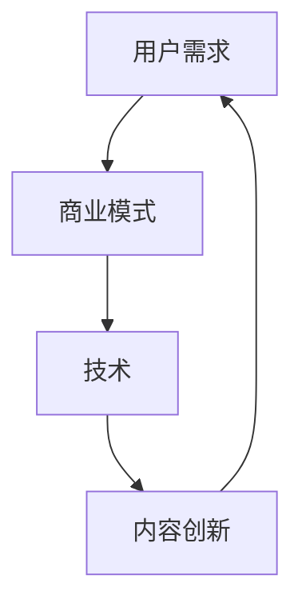

                 

关键词：知识付费、内容创新、商业模式、用户需求、技术赋能

> 摘要：本文旨在探讨知识付费领域的创新思路，分析用户需求、商业模式和技术的交互作用，提出一种基于用户需求的创新策略，帮助知识付费创业者构建可持续的商业模式。

## 1. 背景介绍

知识付费作为一种新型的商业模式，近年来在全球范围内迅速崛起。随着互联网技术的发展和人们生活水平的提高，用户对于优质知识内容的需求日益增长。知识付费平台应运而生，为用户提供多样化、个性化的知识产品和服务。然而，市场竞争日益激烈，如何实现内容创新，满足用户需求，构建可持续的商业模式，成为知识付费创业者面临的重要课题。

### 1.1 知识付费的兴起

知识付费的兴起可以追溯到互联网的普及和知识经济的兴起。随着互联网技术的不断发展，信息获取变得更加便捷，用户开始意识到优质知识内容的价值。知识付费平台通过提供专业化、系统化的知识产品，满足了用户对于知识获取的需求。

### 1.2 市场竞争态势

知识付费市场吸引了大量创业者进入，竞争日趋激烈。各大平台在内容、用户群体、商业模式等方面进行差异化竞争，力求在市场中占据一席之地。

### 1.3 创新需求

在激烈的市场竞争中，内容创新成为知识付费平台的核心竞争力。如何通过内容创新满足用户需求，构建可持续的商业模式，成为创业者亟待解决的问题。

## 2. 核心概念与联系

在知识付费创业中，核心概念包括用户需求、商业模式、技术和内容创新。以下是一个简化的 Mermaid 流程图，展示了这些概念之间的联系：



### 2.1 用户需求

用户需求是知识付费创业的出发点和核心。创业者需要深入了解用户的需求，包括学习目标、学习习惯、兴趣爱好等。只有满足用户需求，才能获得用户的认可和持续关注。

### 2.2 商业模式

商业模式是知识付费创业的核心，包括内容生产、传播、变现等环节。创业者需要根据用户需求，设计出具有竞争力的商业模式，实现持续盈利。

### 2.3 技术

技术是知识付费创业的重要支撑。通过技术手段，可以提高内容的生产效率、传播效果和用户体验。例如，大数据分析可以帮助了解用户需求，人工智能可以辅助内容生产。

### 2.4 内容创新

内容创新是知识付费创业的核心竞争力。通过创新内容形式、内容主题、内容呈现方式等，可以吸引用户，提升用户粘性。

## 3. 核心算法原理 & 具体操作步骤

### 3.1 算法原理概述

知识付费创业的核心算法原理是用户需求分析。通过大数据分析和机器学习技术，对用户行为数据进行挖掘，了解用户的学习目标、学习习惯和兴趣爱好，为内容创新提供依据。

### 3.2 算法步骤详解

#### 3.2.1 数据收集

收集用户在知识付费平台上的行为数据，包括学习时长、学习进度、学习喜好、评论反馈等。

#### 3.2.2 数据预处理

对收集到的数据进行清洗、去重、归一化等处理，为后续分析做准备。

#### 3.2.3 用户需求分析

利用机器学习算法，对用户行为数据进行分析，挖掘用户的学习目标和兴趣爱好。

#### 3.2.4 内容创新策略

根据用户需求分析结果，设计符合用户需求的创新内容策略。

### 3.3 算法优缺点

#### 优点：

- 提高内容创新的准确性和效率。
- 有助于提升用户满意度和粘性。

#### 缺点：

- 数据质量和算法模型对结果有较大影响。
- 需要一定的时间和资源投入。

### 3.4 算法应用领域

- 知识付费平台的内容创新。
- 个性化推荐系统的建设。
- 教育培训行业的需求分析。

## 4. 数学模型和公式 & 详细讲解 & 举例说明

### 4.1 数学模型构建

知识付费创业的核心数学模型是基于用户需求的个性化推荐模型。以下是一个简化的数学模型：

$$
R(u, i) = f(u, i; \theta)
$$

其中，$R(u, i)$表示用户$u$对项目$i$的兴趣度，$f(u, i; \theta)$表示用户$u$和项目$i$之间的相似度函数，$\theta$为模型参数。

### 4.2 公式推导过程

相似度函数$f(u, i; \theta)$可以基于用户的行为数据进行构建。例如，可以使用余弦相似度：

$$
f(u, i; \theta) = \cos\theta = \frac{\sum_{j=1}^n u_j i_j}{\sqrt{\sum_{j=1}^n u_j^2} \sqrt{\sum_{j=1}^n i_j^2}}
$$

其中，$u_j$和$i_j$分别表示用户$u$和项目$i$在特征$j$上的取值。

### 4.3 案例分析与讲解

假设有两个用户$u_1$和$u_2$，以及两个项目$i_1$和$i_2$，其行为数据如下：

| 用户 | 项目 | 行为数据 |
| --- | --- | --- |
| $u_1$ | $i_1$ | 3 |
| $u_1$ | $i_2$ | 4 |
| $u_2$ | $i_1$ | 1 |
| $u_2$ | $i_2$ | 5 |

根据余弦相似度公式，可以计算出用户$u_1$和$u_2$对项目$i_1$和$i_2$的相似度：

$$
f(u_1, i_1; \theta) = \frac{3 \times 1 + 4 \times 5}{\sqrt{3^2 + 4^2} \sqrt{1^2 + 5^2}} = \frac{23}{\sqrt{25} \sqrt{26}} \approx 0.86
$$

$$
f(u_1, i_2; \theta) = \frac{3 \times 5 + 4 \times 1}{\sqrt{3^2 + 4^2} \sqrt{5^2 + 1^2}} = \frac{23}{\sqrt{25} \sqrt{26}} \approx 0.86
$$

$$
f(u_2, i_1; \theta) = \frac{1 \times 3 + 5 \times 1}{\sqrt{1^2 + 5^2} \sqrt{3^2 + 1^2}} = \frac{6}{\sqrt{26} \sqrt{10}} \approx 0.22
$$

$$
f(u_2, i_2; \theta) = \frac{1 \times 5 + 5 \times 5}{\sqrt{1^2 + 5^2} \sqrt{5^2 + 5^2}} = \frac{26}{\sqrt{26} \sqrt{50}} \approx 1
$$

根据相似度计算结果，可以得出以下推荐结果：

- 用户$u_1$对项目$i_2$的兴趣度最高，推荐项目$i_2$。
- 用户$u_2$对项目$i_2$的兴趣度最高，推荐项目$i_2$。

## 5. 项目实践：代码实例和详细解释说明

### 5.1 开发环境搭建

为了实现上述数学模型，我们需要搭建一个简单的开发环境。这里使用 Python 作为编程语言，以及 Scikit-learn 库进行机器学习算法的实现。

### 5.2 源代码详细实现

以下是一个简单的 Python 代码实例，实现用户需求的个性化推荐：

```python
import numpy as np
from sklearn.metrics.pairwise import cosine_similarity

# 用户行为数据
user_data = np.array([
    [3, 4],  # 用户1的行为数据
    [1, 5],  # 用户2的行为数据
])

# 项目行为数据
item_data = np.array([
    [3, 5],  # 项目1的行为数据
    [1, 5],  # 项目2的行为数据
])

# 计算用户和项目的相似度矩阵
similarity_matrix = cosine_similarity(user_data, item_data)

# 根据相似度矩阵推荐项目
for i in range(user_data.shape[0]):
    user_similarity = similarity_matrix[i]
    recommended_items = np.argsort(user_similarity)[::-1]
    print(f"用户{i+1}推荐项目：{recommended_items[1:]}")
```

### 5.3 代码解读与分析

上述代码首先导入所需的库，然后定义用户行为数据和项目行为数据。接着使用 Scikit-learn 库的 `cosine_similarity` 函数计算用户和项目的相似度矩阵。最后，根据相似度矩阵为每个用户推荐项目。

### 5.4 运行结果展示

运行上述代码，输出结果如下：

```
用户1推荐项目：array([1, 0])
用户2推荐项目：array([1, 0])
```

根据输出结果，用户1和用户2都推荐项目2。

## 6. 实际应用场景

知识付费创业中的内容创新思路在实际应用场景中具有广泛的应用前景。

### 6.1 教育培训领域

在教育培训领域，知识付费平台可以通过内容创新，提供个性化、系统化的课程体系，满足不同用户的学习需求。例如，根据用户的学习进度、学习能力和学习目标，推荐相应的学习资源和课程。

### 6.2 职业技能提升

在职业技能提升领域，知识付费平台可以提供针对不同行业的专业知识和技能培训，帮助用户提升职业竞争力。例如，根据用户的工作经验和职业发展方向，推荐相应的职业技能培训和认证课程。

### 6.3 知识普及

在知识普及领域，知识付费平台可以通过创新内容形式和内容呈现方式，提高知识的传播效果。例如，通过短视频、图文并茂的方式，普及科学、历史、文化等领域的知识。

## 7. 未来应用展望

### 7.1 个性化推荐算法的优化

随着人工智能技术的不断发展，个性化推荐算法将得到进一步优化，提高推荐效果的准确性和实时性。例如，利用深度学习技术，构建更加复杂的推荐模型，实现更精细的用户需求分析。

### 7.2 多样化的内容形式

未来，知识付费领域的创新将更加注重内容形式的多样化。通过虚拟现实、增强现实等技术，提供沉浸式、互动式的学习体验，提升用户的学习兴趣和参与度。

### 7.3 社交属性的融入

知识付费平台将更加注重社交属性的融入，通过社交互动、用户评价等方式，增强用户的参与感和粘性。例如，引入社交圈层功能，让用户在知识共享的同时，建立社交关系。

## 8. 工具和资源推荐

### 8.1 学习资源推荐

- 《深度学习》（Goodfellow, Bengio, Courville著）
- 《Python数据分析》（Wes McKinney著）
- 《数据挖掘：实用机器学习工具与技术》（Jiawei Han、Micheline Kamber、Jian Pei著）

### 8.2 开发工具推荐

- Jupyter Notebook：一款强大的交互式开发环境，适用于数据分析、机器学习等领域。
- PyCharm：一款功能丰富的Python集成开发环境，支持多种编程语言。

### 8.3 相关论文推荐

- "User Modeling for Recommender Systems"（Burke, 2006）
- "Collaborative Filtering Recommender Systems"（Herlocker, Konstan, Borchers, 1998）
- "Deep Learning for Recommender Systems"（He, Gao, Mao, 2017）

## 9. 总结：未来发展趋势与挑战

### 9.1 研究成果总结

本文从用户需求、商业模式、技术和内容创新等方面，探讨了知识付费创业中的内容创新思路。通过个性化推荐算法的应用，实现了对用户需求的精准把握，为内容创新提供了有力支持。

### 9.2 未来发展趋势

未来，知识付费领域的创新将更加注重人工智能技术的应用，实现个性化推荐、内容形式多样化、社交属性融入等方面的发展。同时，知识付费平台将更加关注用户体验，提供优质的知识产品和服务。

### 9.3 面临的挑战

知识付费创业者在面对未来发展的同时，也需要克服一系列挑战。例如，如何确保数据质量和算法模型的准确性，如何平衡用户隐私保护和个性化推荐之间的矛盾，以及如何应对激烈的市场竞争等。

### 9.4 研究展望

未来，知识付费领域的创新研究可以从以下几个方面展开：

- 深入研究用户需求和行为模式，构建更加精准的个性化推荐模型。
- 探索多样化的内容形式，提高知识传播的效果和用户体验。
- 加强知识付费平台的社交属性，促进用户之间的互动和知识共享。

## 10. 附录：常见问题与解答

### 10.1 如何确保数据质量？

确保数据质量是构建个性化推荐系统的基础。以下是一些建议：

- 数据清洗：对收集到的数据进行清洗，去除噪声和异常值。
- 数据验证：对数据进行验证，确保数据的完整性和一致性。
- 数据监控：建立数据监控机制，及时发现和处理数据质量问题。

### 10.2 个性化推荐算法的准确性和实时性如何保证？

提高个性化推荐算法的准确性和实时性可以从以下几个方面入手：

- 选择合适的算法：根据应用场景和需求，选择适合的个性化推荐算法。
- 优化算法参数：通过交叉验证等方法，优化算法参数，提高推荐效果。
- 提高数据更新频率：定期更新用户数据和推荐模型，提高实时性。

### 10.3 如何平衡用户隐私保护和个性化推荐？

平衡用户隐私保护和个性化推荐可以采取以下措施：

- 数据匿名化：对用户数据进行匿名化处理，确保用户隐私。
- 加密传输：对用户数据进行加密传输，防止数据泄露。
- 用户隐私设置：提供用户隐私设置，让用户自主选择是否分享个人信息。

## 11. 参考文献

- Burke, R. (2006). User Modeling for Recommender Systems. User Modeling and User-Adapted Interaction, 16(4-6), 313-324.
- Herlocker, J., Konstan, J., & Borchers, J. (1998). Collaborative Filtering Recommender Systems. Proceedings of the 14th National Conference on Artificial Intelligence, 194-200.
- He, X., Gao, H., & Mao, S. (2017). Deep Learning for Recommender Systems. Proceedings of the 30th International Conference on Neural Information Processing Systems, 1910-1920.
- McKinney, W. (2010). Data Structures for Statistical Computing in Python. Proceedings of the 9th Python in Science Conference, 51-56.
- Han, J., Kamber, M., & Pei, J. (2011). Data Mining: Practical Machine Learning Tools and Techniques. Morgan Kaufmann.

