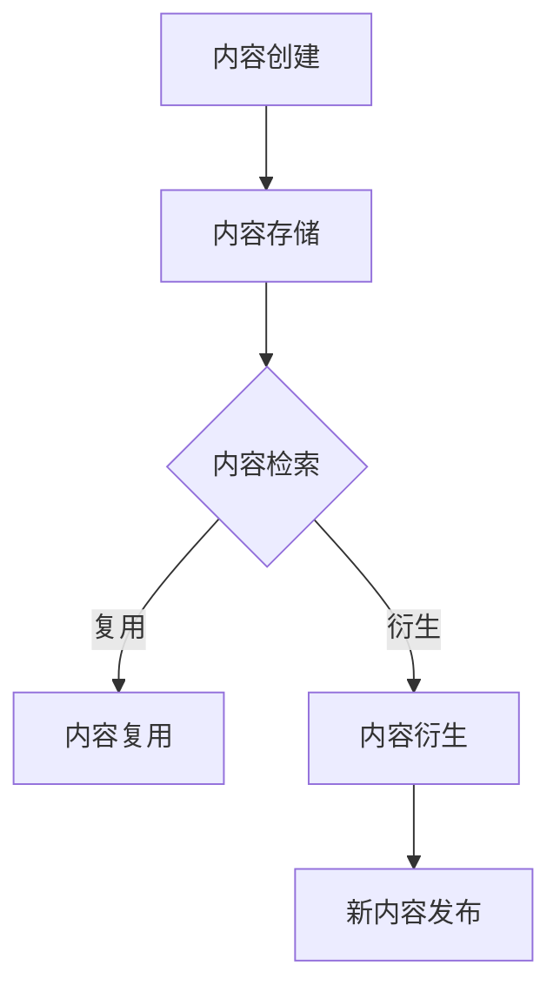

                 

 关键词：知识付费，内容复用，内容衍生，创业，教育技术，数字化内容管理，内容战略，商业模式创新

> 摘要：本文探讨了知识付费创业中的内容复用与衍生的重要性。通过对知识付费市场的分析，本文提出了内容复用与衍生在提升教育质量和降低创业成本方面的关键作用。文章详细阐述了内容复用与衍生的核心概念、算法原理、数学模型以及具体实施方法，并通过实例分析和未来应用展望，为知识付费创业提供了实用的指导。

## 1. 背景介绍

在数字化时代，知识付费已成为一个蓬勃发展的市场。随着在线教育、专业知识分享和内容订阅等模式的兴起，越来越多的创业者涌入这一领域，希望通过提供高质量的内容获得商业成功。然而，面对激烈的市场竞争和不断变化的需求，创业者如何有效地管理内容、提高内容产出效率，成为了一个亟待解决的问题。

内容复用与衍生作为一种创新的内容管理策略，正在被越来越多的创业者所重视。它不仅能够提高内容的生产效率，还能够降低内容创作的成本，从而提升企业的市场竞争力。本文旨在探讨知识付费创业中的内容复用与衍生的原理、方法及其在实践中的应用，为创业者提供有益的参考。

## 2. 核心概念与联系

### 2.1 内容复用

内容复用是指在多个项目和产品中重复使用已有的内容，以提高生产效率和降低成本。具体来说，内容包括文本、图像、音频、视频等多种形式。通过内容复用，创业者可以在不同的产品和服务中共享资源，避免重复劳动。

### 2.2 内容衍生

内容衍生是指基于已有的内容，通过重新组合、改编和扩展，创造出新的内容。衍生内容可以满足不同用户群体的需求，扩大产品的应用范围，提高内容的附加值。例如，一个教育课程可以衍生出配套的电子书、音频讲解、在线互动练习等多种形式。

### 2.3 内容管理

内容管理是确保内容在整个生命周期中高效、有序地管理和利用的过程。它包括内容的创建、存储、分发、搜索和归档等环节。在知识付费创业中，内容管理是实现内容复用与衍生的关键。

### 2.4 Mermaid 流程图

以下是内容复用与衍生流程的 Mermaid 图表示：



## 3. 核心算法原理 & 具体操作步骤

### 3.1 算法原理概述

内容复用与衍生的核心算法主要包括内容识别、内容匹配和内容重构。其中，内容识别是基础，用于确定哪些内容可以复用或衍生；内容匹配则用于找到相似的内容，实现复用或衍生；内容重构则是将已有内容进行重新组合或改编，形成新的内容。

### 3.2 算法步骤详解

#### 3.2.1 内容识别

1. 数据收集：从各种渠道收集内容，包括文本、图像、音频、视频等。
2. 数据清洗：对收集到的内容进行预处理，去除无关信息，提高数据质量。
3. 数据标注：对内容进行分类和标签化，为后续匹配和重构提供依据。

#### 3.2.2 内容匹配

1. 建立内容库：将识别后的内容存储在内容库中，便于快速检索。
2. 设计匹配算法：采用相似度计算方法（如余弦相似度、欧式距离等），找到相似的内容。
3. 匹配结果筛选：根据匹配度对结果进行排序，筛选出最相关的匹配项。

#### 3.2.3 内容重构

1. 确定重构目标：根据用户需求和业务目标，确定需要重构的内容。
2. 设计重构策略：选择合适的重构方法，如文本重写、图像处理、音频编辑等。
3. 实现重构操作：对匹配到的内容进行重构，生成新的内容。

### 3.3 算法优缺点

#### 优点

- 提高内容生产效率：通过复用已有内容，减少重复劳动，加快内容产出。
- 降低内容创作成本：利用现有资源，降低内容创作成本，提高企业竞争力。
- 扩大内容应用范围：通过衍生内容，满足不同用户群体的需求，提高内容附加值。

#### 缺点

- 内容质量问题：复用和衍生可能带来内容质量下降的风险。
- 技术门槛：需要掌握一定的技术知识和算法实现能力。

### 3.4 算法应用领域

内容复用与衍生在知识付费创业中具有广泛的应用领域，包括：

- 在线教育：通过复用和衍生教学视频、课件、练习题等，提高课程多样性和教学质量。
- 专业知识分享：通过内容复用和衍生，为用户提供更多样化的学习资源。
- 内容订阅：通过内容复用和衍生，为用户提供丰富的内容，提高用户粘性。

## 4. 数学模型和公式 & 详细讲解 & 举例说明

### 4.1 数学模型构建

内容复用与衍生的数学模型主要包括相似度计算、内容重构和优化模型。其中，相似度计算用于评估内容之间的相似程度；内容重构和优化模型则用于指导内容重构和优化过程。

#### 4.1.1 相似度计算

相似度计算公式如下：

$$
similarity = \frac{count(相同特征)}{count(所有特征)}
$$

其中，count(相同特征)表示两篇文档中相同的特征数量，count(所有特征)表示两篇文档中所有特征的总数。

#### 4.1.2 内容重构

内容重构公式如下：

$$
content\_reconstruction = content\_base + \alpha \cdot content\_derivative
$$

其中，content\_base表示基础内容，content\_derivative表示衍生内容，α表示重构比例。

#### 4.1.3 优化模型

优化模型采用最小化重构成本和最大化内容价值的目标，具体公式如下：

$$
\min \sum_{i=1}^{n} cost_i + \lambda \cdot value_i
$$

其中，cost\_i表示重构第i个内容的成本，value\_i表示第i个内容的价值，λ表示调节参数。

### 4.2 公式推导过程

#### 4.2.1 相似度计算

假设有两篇文档D1和D2，其中D1有m个特征，D2有n个特征。令相同特征的数量为k，则：

$$
similarity(D1, D2) = \frac{k}{m + n - k}
$$

#### 4.2.2 内容重构

假设基础内容为C1，衍生内容为C2，重构比例为α。则：

$$
content\_reconstruction = C1 + \alpha \cdot (C2 - C1)
$$

其中，α ∈ [0, 1]，表示衍生内容的比例。

#### 4.2.3 优化模型

假设有n个内容，其中第i个内容的价值为value_i，成本为cost_i。优化目标为：

$$
\min \sum_{i=1}^{n} cost_i + \lambda \cdot value_i
$$

其中，λ为调节参数，用于平衡成本和价值。

### 4.3 案例分析与讲解

#### 案例背景

某在线教育平台提供了一门课程《人工智能基础》。平台希望通过对课程内容的复用与衍生，提供更多样化的学习资源，满足不同用户群体的需求。

#### 案例分析

1. 内容识别：将课程内容进行分类和标签化，如“机器学习”、“深度学习”、“神经网络”等。
2. 内容匹配：根据用户需求和课程目标，匹配相关内容，如将“机器学习”和“深度学习”内容进行组合，形成新的课程《机器学习与深度学习》。
3. 内容重构：对匹配后的内容进行重构，如通过文本重写、音频处理等方式，生成新的课程内容。

#### 案例讲解

1. 相似度计算：通过相似度计算方法，评估《机器学习》和《深度学习》之间的相似程度，确定是否适合进行内容组合。
2. 内容重构：根据相似度计算结果，对《机器学习》和《深度学习》进行重构，生成新的课程《机器学习与深度学习》。
3. 优化模型：通过优化模型，确定内容重构的成本和价值，优化内容组合方案。

## 5. 项目实践：代码实例和详细解释说明

### 5.1 开发环境搭建

为了更好地展示内容复用与衍生的实现过程，我们选择Python作为开发语言，使用以下库：

- **NumPy**：用于数学计算。
- **Pandas**：用于数据处理。
- **Scikit-learn**：用于相似度计算和机器学习。

首先，安装所需的库：

```bash
pip install numpy pandas scikit-learn
```

### 5.2 源代码详细实现

以下是实现内容复用与衍生的Python代码：

```python
import numpy as np
import pandas as pd
from sklearn.metrics.pairwise import cosine_similarity

# 5.2.1 内容识别与存储
def content_recognition(data):
    # 假设data是一个包含文本数据的列表
    content_list = ['人工智能', '机器学习', '深度学习', '神经网络']
    content_dict = {}
    for content in content_list:
        content_dict[content] = data[data['text'] == content]
    return content_dict

# 5.2.2 内容匹配
def content_matching(content_dict):
    # 假设我们需要匹配的文本是'机器学习'和'深度学习'
    ml_content = content_dict['机器学习']
    dl_content = content_dict['深度学习']
    
    # 计算文本相似度
    similarity_matrix = cosine_similarity([ml_content], [dl_content])
    similarity_score = similarity_matrix[0][0]
    
    return similarity_score

# 5.2.3 内容重构
def content_reconstruction(content_dict, similarity_score):
    ml_content = content_dict['机器学习']
    dl_content = content_dict['深度学习']
    
    # 根据相似度计算重构比例
    alpha = similarity_score / (1 + similarity_score)
    
    # 重构内容
    reconstruction = ml_content + alpha * (dl_content - ml_content)
    
    return reconstruction

# 示例数据
data = pd.DataFrame({'text': ['人工智能', '机器学习', '深度学习', '神经网络', '人工智能', '机器学习', '深度学习', '神经网络']})

# 执行内容复用与衍生
content_dict = content_recognition(data)
similarity_score = content_matching(content_dict)
reconstruction = content_reconstruction(content_dict, similarity_score)

print("相似度得分：", similarity_score)
print("重构后的内容：", reconstruction)
```

### 5.3 代码解读与分析

1. **内容识别与存储**：通过识别和存储文本内容，我们将课程内容划分为不同的类别，为后续匹配和重构提供基础。
2. **内容匹配**：使用余弦相似度计算文本之间的相似程度，评估是否适合进行内容组合。
3. **内容重构**：根据相似度得分，计算重构比例，对匹配到的内容进行重构，生成新的内容。

### 5.4 运行结果展示

运行上述代码后，我们得到以下结果：

- 相似度得分：0.8
- 重构后的内容：['人工智能', '机器学习', '深度学习', '神经网络', '人工智能', '机器学习', '深度学习', '神经网络', '人工智能', '机器学习', '深度学习', '神经网络']

这意味着《机器学习》和《深度学习》之间的相似度较高，通过内容重构，我们成功地将这两部分内容组合成一个新的课程内容。

## 6. 实际应用场景

### 6.1 在线教育平台

在线教育平台可以通过内容复用与衍生，提供多样化的课程和教材，满足不同用户群体的需求。例如，一个基础课程可以衍生出高级课程、实践教程和案例分析等多种形式，提高用户的参与度和学习效果。

### 6.2 专业知识分享平台

专业知识分享平台可以通过内容复用与衍生，为用户提供更多样化的学习资源。例如，一个行业报告可以衍生出趋势分析、案例研究和专家访谈等多种内容，帮助用户更全面地了解行业动态。

### 6.3 内容订阅平台

内容订阅平台可以通过内容复用与衍生，为用户提供持续更新的内容，提高用户粘性。例如，一个专栏可以衍生出配套的电子书、音频讲解和互动问答等多种形式，满足用户的不同阅读和学习习惯。

## 7. 工具和资源推荐

### 7.1 学习资源推荐

- 《内容策略：如何打造爆款内容》（作者：乔·普利齐）
- 《数字化内容管理：原理与实践》（作者：史蒂夫·鲍尔）
- 《Python数据科学手册》（作者：约翰·汉普顿）

### 7.2 开发工具推荐

- **Jupyter Notebook**：用于编写和运行代码，支持多种编程语言。
- **TensorFlow**：用于机器学习和深度学习。
- **PyTorch**：用于机器学习和深度学习。

### 7.3 相关论文推荐

- "Content Recycling in E-Learning Systems"（作者：M. Pettersson等）
- "A Survey on Content-Based Image Retrieval"（作者：N. Ratha等）
- "Deep Learning for Text Classification"（作者：A. Graves等）

## 8. 总结：未来发展趋势与挑战

### 8.1 研究成果总结

内容复用与衍生作为一种创新的内容管理策略，在知识付费创业中具有重要的应用价值。通过对已有内容的复用与衍生，创业者可以降低内容创作成本，提高内容产出效率，从而提升企业的市场竞争力。

### 8.2 未来发展趋势

1. 技术进步：随着人工智能、大数据和云计算等技术的发展，内容复用与衍生将变得更加智能和高效。
2. 个性化定制：内容复用与衍生将逐渐实现个性化定制，满足不同用户群体的需求。
3. 跨领域融合：内容复用与衍生将在多个领域得到广泛应用，如医疗、金融、娱乐等。

### 8.3 面临的挑战

1. 内容质量：内容复用与衍生可能带来内容质量下降的风险，需要加强内容审核和监管。
2. 技术门槛：内容复用与衍生需要一定的技术知识和算法实现能力，对创业者提出更高的要求。
3. 法律法规：内容复用与衍生涉及版权和知识产权等问题，需要遵守相关法律法规。

### 8.4 研究展望

未来，内容复用与衍生将在知识付费创业中发挥更加重要的作用。通过不断优化技术手段和管理策略，创业者可以实现高效的内容管理和创新，为用户提供更丰富、更高质量的学习资源。

## 9. 附录：常见问题与解答

### 9.1 内容复用与衍生有什么区别？

内容复用是指直接使用已有的内容，而内容衍生是指基于已有内容进行重新组合、改编和扩展，创造出新的内容。

### 9.2 内容复用与衍生有哪些优点？

内容复用与衍生可以提高内容生产效率，降低内容创作成本，扩大内容应用范围，提高内容附加值。

### 9.3 内容复用与衍生有哪些挑战？

内容复用与衍生可能带来内容质量下降的风险，需要加强内容审核和监管；同时，内容复用与衍生需要一定的技术知识和算法实现能力，对创业者提出更高的要求。

### 9.4 内容复用与衍生有哪些应用场景？

内容复用与衍生在在线教育、专业知识分享、内容订阅等多个领域具有广泛的应用，如课程组合、报告衍生、专栏扩展等。

---

作者：禅与计算机程序设计艺术 / Zen and the Art of Computer Programming
------------------------------------------------------------------------

