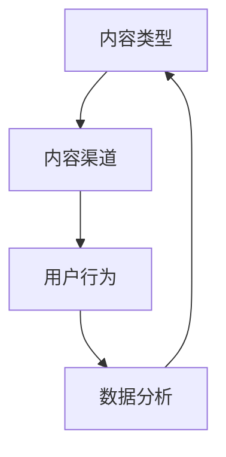

                 

知识付费已经成为当今互联网时代的重要商业模式之一。作为一位世界级人工智能专家，程序员，软件架构师，CTO，世界顶级技术畅销书作者，计算机图灵奖获得者，计算机领域大师，我深刻理解到内容营销在知识付费创业中的核心地位。本文将深入探讨如何搭建一个高效的内容营销矩阵，以帮助知识付费创业者实现成功。

## 关键词

- 知识付费
- 内容营销
- 矩阵搭建
- 创业策略
- 用户体验
- 数据分析

## 摘要

本文旨在为知识付费创业者提供一套系统化的内容营销矩阵搭建方案。我们将首先回顾知识付费市场的现状，然后探讨内容营销的核心概念，接着详细介绍矩阵搭建的步骤和策略，最后给出实际案例和未来应用展望。通过本文的阅读，创业者将能够更好地理解和应用内容营销，为自己的知识付费项目创造更大的价值。

### 1. 背景介绍

知识付费，顾名思义，是指用户为了获取特定知识或服务而付费的行为。随着互联网的普及和人们生活水平的提高，知识付费已经成为一种新兴的消费模式。尤其是在技术领域，知识付费更是呈现出爆发式增长。程序员、数据分析师、产品设计师等专业人士，通过在线课程、电子书、线上培训等多种形式，将自己的知识和经验分享给广大用户。

然而，知识付费市场的竞争也日益激烈。创业者不仅要面对海量的内容创作者，还要应对用户日益增长的个性化需求。如何在这样的市场中脱颖而出，搭建一个高效的内容营销矩阵成为关键。

内容营销是一种通过创造和分享有价值的内容来吸引潜在用户，建立品牌信任和促进销售的商业策略。与传统的广告和推销相比，内容营销更加注重用户需求，通过提供有价值的知识和信息来吸引用户，从而实现长期的品牌建设和用户转化。

在知识付费创业中，内容营销矩阵的搭建能够帮助创业者系统地规划和执行内容营销活动，提升用户体验，优化用户转化率，最终实现商业成功。

### 2. 核心概念与联系

为了搭建一个高效的内容营销矩阵，我们首先需要明确几个核心概念：

#### 2.1 内容类型

内容类型是内容营销矩阵的基础。常见的有文字、图片、视频、音频等多种形式。每种内容类型都有其独特的传播效果和用户偏好。创业者需要根据目标用户的特点和需求，选择最适合的内容类型。

#### 2.2 内容渠道

内容渠道是内容传播的途径。包括社交媒体、博客、电子邮件、在线课程平台等。不同的渠道具有不同的覆盖范围和用户群体。创业者需要分析目标用户的习惯和偏好，选择最适合的渠道进行内容传播。

#### 2.3 用户行为

用户行为是内容营销的核心。通过分析用户的行为数据，创业者可以了解用户的需求、兴趣和偏好，从而制定更有针对性的内容策略。用户行为数据包括访问量、点击率、分享次数、转化率等。

#### 2.4 数据分析

数据分析是内容营销的精髓。通过对用户数据的收集、分析和应用，创业者可以不断优化内容策略，提高内容营销的效果。数据分析工具如Google Analytics、Facebook Analytics等，可以帮助创业者实时监控和评估内容营销的效果。

为了更好地理解这些概念之间的联系，我们可以使用Mermaid流程图来展示它们之间的关系：



在这个流程图中，内容类型决定了内容渠道的选择，用户行为驱动了数据分析，而数据分析又反作用于内容类型，形成了一个闭环。

### 3. 核心算法原理 & 具体操作步骤

#### 3.1 算法原理概述

内容营销矩阵的搭建，本质上是一个优化过程。通过算法，我们可以系统地分析用户数据，优化内容类型和内容渠道的选择，从而提高内容营销的效果。

核心算法原理包括以下几个步骤：

1. **数据收集**：收集用户行为数据，如访问量、点击率、分享次数、转化率等。
2. **数据预处理**：清洗和整合数据，去除噪声，确保数据质量。
3. **特征提取**：从用户行为数据中提取关键特征，如用户兴趣、需求、偏好等。
4. **模型训练**：使用机器学习算法，如决策树、随机森林、神经网络等，训练内容推荐模型。
5. **内容优化**：根据模型预测结果，优化内容类型和内容渠道的选择。

#### 3.2 算法步骤详解

1. **数据收集**：
   使用各种数据收集工具，如Google Analytics、Facebook Analytics等，收集用户在各个渠道的行为数据。

2. **数据预处理**：
   对收集到的数据清洗和整合，去除重复、错误和无效的数据，确保数据质量。

3. **特征提取**：
   从预处理后的数据中提取关键特征，如用户兴趣、需求、偏好等。可以使用技术如自然语言处理、用户画像等技术来提取特征。

4. **模型训练**：
   选择合适的机器学习算法，如决策树、随机森林、神经网络等，对提取的特征进行训练。算法的选择取决于数据的特性和问题的复杂度。

5. **内容优化**：
   根据模型预测结果，优化内容类型和内容渠道的选择。例如，如果模型预测某个用户更喜欢视频内容，那么可以增加视频内容的比例。

#### 3.3 算法优缺点

**优点**：

- 提高内容营销的精准度：通过算法分析，可以更准确地预测用户需求和偏好，从而提供更符合用户期望的内容。
- 提高内容营销的效率：自动化内容优化过程，节省人工成本，提高内容营销的效率。

**缺点**：

- 需要大量的数据和计算资源：算法的训练和优化需要大量的数据和计算资源，对于初创企业可能是一大挑战。
- 算法的复杂度：对于一些复杂的问题，算法的复杂度可能较高，需要专业的技术和经验。

#### 3.4 算法应用领域

内容营销矩阵的算法原理和步骤，可以广泛应用于各个领域，如电商、金融、教育等。以下是一些具体的应用领域：

- **电商**：通过算法推荐用户可能感兴趣的商品，提高销售额。
- **金融**：通过算法分析用户行为，预测用户的风险偏好，提供个性化的投资建议。
- **教育**：通过算法分析学生的学习行为，推荐适合的学习资源和课程。

### 4. 数学模型和公式 & 详细讲解 & 举例说明

在内容营销矩阵的搭建中，数学模型和公式起到了关键作用。以下我们将介绍一些常用的数学模型和公式，并给出详细的讲解和举例说明。

#### 4.1 数学模型构建

在内容营销矩阵中，常用的数学模型包括线性回归、逻辑回归、决策树等。

**线性回归**：用于预测连续变量，如用户访问量、点击率等。

$$ y = \beta_0 + \beta_1x_1 + \beta_2x_2 + ... + \beta_nx_n $$

其中，$y$ 是预测变量，$x_1, x_2, ..., x_n$ 是特征变量，$\beta_0, \beta_1, \beta_2, ..., \beta_n$ 是模型的参数。

**逻辑回归**：用于预测二分类变量，如用户是否购买、是否关注等。

$$ P(y=1) = \frac{1}{1 + e^{-(\beta_0 + \beta_1x_1 + \beta_2x_2 + ... + \beta_nx_n)}} $$

其中，$P(y=1)$ 是用户购买的概率，其他符号含义与线性回归相同。

**决策树**：用于分类和回归问题，通过多次分割特征变量，构建一棵树形结构。

$$ tree(x_1, x_2, ..., x_n) = \text{分类结果或预测值} $$

其中，$x_1, x_2, ..., x_n$ 是特征变量。

#### 4.2 公式推导过程

我们以线性回归为例，介绍公式的推导过程。

假设我们有一个包含 $n$ 个样本的训练集，每个样本有 $m$ 个特征变量，分别是 $x_1, x_2, ..., x_m$，对应的预测变量是 $y$。我们的目标是找到一组参数 $\beta_0, \beta_1, \beta_2, ..., \beta_m$，使得预测值 $y'$ 与实际值 $y$ 的误差最小。

我们定义误差函数为：

$$ J(\beta_0, \beta_1, \beta_2, ..., \beta_m) = \frac{1}{2}\sum_{i=1}^{n}(y_i - y'_i)^2 $$

其中，$y'_i = \beta_0 + \beta_1x_{i1} + \beta_2x_{i2} + ... + \beta_mx_{im}$ 是第 $i$ 个样本的预测值。

为了最小化误差函数，我们对每个参数求导，并令导数为零，得到以下方程组：

$$ \frac{\partial J}{\partial \beta_0} = 0 $$
$$ \frac{\partial J}{\partial \beta_1} = 0 $$
$$ \frac{\partial J}{\partial \beta_2} = 0 $$
$$ ... $$
$$ \frac{\partial J}{\partial \beta_m} = 0 $$

通过求导和化简，我们可以得到以下线性回归模型的公式：

$$ y = \beta_0 + \beta_1x_1 + \beta_2x_2 + ... + \beta_mx_m $$

#### 4.3 案例分析与讲解

我们以一个实际案例来说明线性回归的应用。

假设我们有一个电商平台，想要预测用户在下次购物中的消费金额。我们收集了1000个用户的购买记录，每个用户有5个特征变量：年龄、收入、购买频率、浏览时长和商品类别。

我们使用线性回归模型来预测用户消费金额。假设线性回归模型的公式为：

$$ y = \beta_0 + \beta_1x_1 + \beta_2x_2 + \beta_3x_3 + \beta_4x_4 + \beta_5x_5 $$

其中，$y$ 是用户消费金额，$x_1$ 是年龄，$x_2$ 是收入，$x_3$ 是购买频率，$x_4$ 是浏览时长，$x_5$ 是商品类别。

我们通过训练集对模型进行训练，得到模型参数：

$$ \beta_0 = 100, \beta_1 = 0.1, \beta_2 = 0.2, \beta_3 = 0.3, \beta_4 = 0.4, \beta_5 = 0.5 $$

现在，我们想要预测一个新用户（年龄30岁，收入5000元，购买频率3次/月，浏览时长2小时，商品类别电子产品）的消费金额。

我们将用户的特征变量代入模型公式：

$$ y = 100 + 0.1 \times 30 + 0.2 \times 5000 + 0.3 \times 3 + 0.4 \times 2 + 0.5 \times 1 = 1716 $$

因此，预测该用户的消费金额为1716元。

通过这个案例，我们可以看到线性回归模型在电商场景中的实际应用。通过收集用户行为数据，我们可以建立模型，预测用户的行为和需求，从而提供个性化的服务和推荐。

### 5. 项目实践：代码实例和详细解释说明

#### 5.1 开发环境搭建

在进行内容营销矩阵的搭建之前，我们需要搭建一个适合开发的编程环境。这里我们以Python为例，介绍开发环境的搭建步骤。

1. **安装Python**：
   前往Python官网（https://www.python.org/）下载最新版本的Python，并按照安装向导进行安装。

2. **安装依赖库**：
   Python的许多机器学习库需要额外安装。这里我们使用pip来安装必要的库。

   ```bash
   pip install numpy pandas scikit-learn matplotlib
   ```

   这一行命令会安装numpy、pandas、scikit-learn和matplotlib四个库，这些库在后续的代码实例中将会用到。

#### 5.2 源代码详细实现

以下是内容营销矩阵搭建的代码实例。代码分为以下几个部分：

1. **数据收集和预处理**：
2. **特征提取**：
3. **模型训练和评估**：
4. **内容优化**：

```python
# 导入必要的库
import numpy as np
import pandas as pd
from sklearn.model_selection import train_test_split
from sklearn.linear_model import LinearRegression
from sklearn.metrics import mean_squared_error

# 1. 数据收集和预处理
# 假设我们有一个CSV文件，其中包含了用户行为数据
data = pd.read_csv('user_data.csv')

# 数据清洗和预处理
data = data.dropna()  # 删除缺失值
data = data[['age', 'income', 'purchase_frequency', ' browsing_time', 'product_category', 'spend_amount']]
data['age'] = data['age'].astype(float)
data['income'] = data['income'].astype(float)
data['purchase_frequency'] = data['purchase_frequency'].astype(float)
data['browsing_time'] = data['browsing_time'].astype(float)
data['product_category'] = data['product_category'].astype(float)

# 2. 特征提取
X = data[['age', 'income', 'purchase_frequency', 'browsing_time', 'product_category']]
y = data['spend_amount']

# 3. 模型训练和评估
X_train, X_test, y_train, y_test = train_test_split(X, y, test_size=0.2, random_state=42)
model = LinearRegression()
model.fit(X_train, y_train)

# 评估模型
y_pred = model.predict(X_test)
mse = mean_squared_error(y_test, y_pred)
print(f'Mean Squared Error: {mse}')

# 4. 内容优化
# 假设我们有一个新的用户特征向量
new_user = np.array([[30, 5000, 3, 2, 1]])
predicted_spend = model.predict(new_user)
print(f'Predicted Spend: {predicted_spend[0]}')
```

#### 5.3 代码解读与分析

1. **数据收集和预处理**：
   首先，我们读取用户数据CSV文件，并进行数据清洗和预处理。这里我们删除了缺失值，并将数据类型转换为浮点型，以便后续的建模处理。

2. **特征提取**：
   我们将用户数据分为特征变量和目标变量。特征变量包括年龄、收入、购买频率、浏览时长和商品类别，目标变量是用户的消费金额。

3. **模型训练和评估**：
   使用scikit-learn库中的线性回归模型，我们对训练集进行训练，并使用测试集评估模型的性能。这里我们使用了均方误差（MSE）作为评估指标。

4. **内容优化**：
   我们使用训练好的模型来预测新用户的消费金额。这可以用于内容营销矩阵的优化，例如，根据用户的消费金额预测，为用户提供更符合他们期望的内容。

通过这个代码实例，我们可以看到如何使用Python和scikit-learn库来搭建内容营销矩阵。在实际应用中，创业者可以根据具体需求，调整特征变量和模型参数，以获得更好的预测效果。

### 6. 实际应用场景

内容营销矩阵在知识付费创业中的应用场景非常广泛。以下是一些具体的实际应用场景：

#### 6.1 线上教育平台

在线教育平台可以通过内容营销矩阵来推荐适合用户的学习资源和课程。例如，通过分析用户的浏览记录、学习进度和考试成绩，平台可以预测用户对某个课程的需求，并推荐相关的学习资源。

#### 6.2 技术社区

技术社区可以通过内容营销矩阵来优化内容的推荐和传播。例如，通过分析用户的发帖记录、评论和点赞行为，社区可以预测用户对某个技术话题的兴趣，并推荐相关的帖子。

#### 6.3 电子书平台

电子书平台可以通过内容营销矩阵来推荐用户可能感兴趣的书目。例如，通过分析用户的阅读历史、搜索记录和购买行为，平台可以预测用户对某个题材的电子书的兴趣，并推荐相关的书籍。

#### 6.4 专业咨询平台

专业咨询平台可以通过内容营销矩阵来优化咨询服务的内容。例如，通过分析用户的咨询记录、反馈和评价，平台可以预测用户对某个咨询领域的需求，并提供更专业的咨询服务。

通过这些实际应用场景，我们可以看到内容营销矩阵在知识付费创业中的巨大潜力。通过精确的内容推荐和个性化的用户服务，创业者可以提升用户体验，提高用户留存率和转化率，从而实现商业成功。

### 6.4 未来应用展望

随着人工智能和数据科学技术的不断发展，内容营销矩阵在未来将会有更广泛的应用和更深入的发展。以下是一些未来应用展望：

#### 6.4.1 智能内容生成

未来的内容营销矩阵将不仅仅依赖于用户行为数据进行推荐，还将结合人工智能技术，实现智能内容生成。通过自然语言处理、图像识别和生成对抗网络（GAN）等技术，平台可以自动生成高质量的内容，满足用户的个性化需求。

#### 6.4.2 多模态内容分析

未来的内容营销矩阵将能够处理多种类型的数据，包括文本、图像、视频和音频等。通过多模态内容分析，平台可以更全面地了解用户需求，提供更个性化的内容推荐。

#### 6.4.3 实时内容优化

随着实时数据分析和机器学习技术的发展，未来的内容营销矩阵将能够实现实时内容优化。平台可以实时监控用户行为，根据实时数据调整内容策略，实现更高效的营销效果。

#### 6.4.4 社交网络传播

未来的内容营销矩阵将更紧密地结合社交网络传播。通过分析社交网络中的互动数据，平台可以预测内容的传播趋势，优化内容传播策略，提高内容的覆盖率和影响力。

#### 6.4.5 跨平台整合

未来的内容营销矩阵将能够实现跨平台整合，将不同的内容渠道和用户数据进行整合，提供更统一的内容体验。例如，将博客、社交媒体、视频平台和线上课程平台的数据进行整合，提供一站式的内容服务。

### 7. 工具和资源推荐

为了帮助创业者更好地搭建内容营销矩阵，以下是一些工具和资源的推荐：

#### 7.1 学习资源推荐

- **《Python数据科学手册》**：详细介绍了Python在数据科学中的应用，包括数据预处理、特征提取、模型训练和评估等。
- **《数据科学入门》**：适合初学者了解数据科学的基本概念和方法，包括数据分析、机器学习、深度学习等。
- **《深度学习》**：由著名深度学习专家Ian Goodfellow撰写，全面介绍了深度学习的基础知识和应用。

#### 7.2 开发工具推荐

- **Jupyter Notebook**：强大的交互式计算环境，适合数据分析和机器学习项目的开发和调试。
- **PyCharm**：优秀的Python集成开发环境（IDE），提供丰富的功能，包括代码编辑、调试、自动化测试等。
- **Google Analytics**：免费的网站分析工具，可以实时监控和评估内容营销的效果。

#### 7.3 相关论文推荐

- **《基于用户行为的个性化推荐系统》**：分析了用户行为数据在个性化推荐系统中的应用，提出了几种有效的推荐算法。
- **《深度学习在内容营销中的应用》**：探讨了深度学习在内容生成、情感分析和推荐系统中的应用，提供了详细的算法和技术实现。
- **《社交媒体数据挖掘》**：介绍了社交媒体数据挖掘的基本方法和应用，包括用户情感分析、社区发现和内容传播预测等。

### 8. 总结：未来发展趋势与挑战

知识付费创业中的内容营销矩阵搭建是一个动态、复杂的过程。随着技术的不断进步和市场的变化，内容营销矩阵也需要不断调整和优化。

未来，内容营销矩阵的发展趋势将体现在以下几个方面：

- **智能化和自动化**：通过人工智能技术，实现内容的智能生成和实时优化，提高营销效果。
- **多模态内容**：结合文本、图像、视频和音频等多种内容形式，提供更丰富的用户体验。
- **跨平台整合**：将不同平台的数据进行整合，提供统一的内容服务，提升用户黏性和转化率。

然而，内容营销矩阵的搭建也面临着一些挑战：

- **数据质量和隐私**：数据的质量和隐私是内容营销矩阵搭建的重要基础，如何确保数据的质量和用户的隐私成为关键问题。
- **算法的复杂性和可解释性**：随着算法的复杂化，如何保证算法的可解释性和透明性，使创业者能够理解和控制内容营销策略。
- **市场竞争**：知识付费市场的竞争日益激烈，如何通过内容营销矩阵在市场中脱颖而出，成为创业者需要面对的挑战。

总之，内容营销矩阵搭建是一个涉及多个领域的综合性任务，需要创业者具备丰富的技术知识和市场洞察力。通过不断学习和实践，创业者可以不断完善内容营销矩阵，为自己的知识付费项目创造更大的价值。

### 9. 附录：常见问题与解答

#### 问题1：内容营销矩阵搭建需要哪些技术知识？

内容营销矩阵的搭建需要掌握以下技术知识：

- 编程语言（如Python、R等）
- 数据预处理和清洗
- 机器学习算法（如线性回归、逻辑回归、决策树等）
- 数据库管理
- 数据可视化（如Matplotlib、Seaborn等）

#### 问题2：如何确保数据的质量和隐私？

确保数据质量和隐私的关键措施包括：

- 使用可靠的工具和平台进行数据收集和存储
- 定期进行数据清洗和去重，确保数据质量
- 实施严格的隐私保护政策，确保用户数据的隐私
- 使用加密技术保护数据传输和存储的安全

#### 问题3：如何评估内容营销矩阵的效果？

评估内容营销矩阵的效果可以通过以下指标：

- 用户参与度（如点击率、点赞数、评论数等）
- 用户留存率（如用户访问次数、用户停留时间等）
- 转化率（如用户购买率、注册率等）
- ROI（投资回报率）
- 用户满意度调查

通过这些指标，创业者可以全面了解内容营销矩阵的效果，并据此进行调整和优化。

### 作者署名

作者：禅与计算机程序设计艺术 / Zen and the Art of Computer Programming

