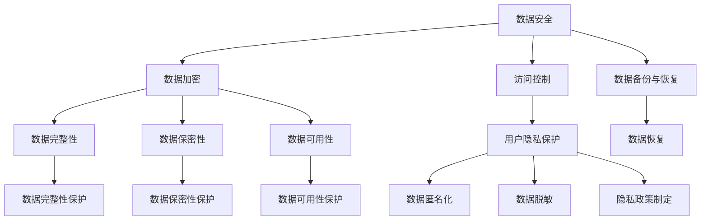

                 

关键词：知识付费、用户数据安全、隐私保护、安全策略、技术解决方案

>摘要：随着知识付费市场的快速崛起，用户数据的安全和隐私保护成为创业公司面临的重要挑战。本文将深入探讨知识付费创业中的用户数据安全与隐私保护问题，分析核心概念与联系，探讨技术解决方案，并展望未来发展趋势与挑战。

## 1. 背景介绍

近年来，知识付费市场在我国呈现出爆炸式增长，众多创业者纷纷涌入这一领域。知识付费平台通过提供专业课程、在线讲座、问答服务等，满足了用户对知识和服务的需求。然而，随着用户数据的积累和挖掘，数据安全和隐私保护问题日益凸显。一旦用户数据泄露，不仅会导致用户信任危机，还可能引发严重的法律问题。因此，确保用户数据的安全与隐私保护成为知识付费创业公司亟需解决的关键问题。

### 1.1 知识付费市场现状

知识付费市场在过去几年中呈现出爆发式增长，用户规模逐年扩大。根据相关报告，2020年我国知识付费市场规模达到1500亿元，预计到2025年将突破3000亿元。这一市场吸引了大量创业者投身其中，各类知识付费平台如雨后春笋般涌现。从专业课程到在线讲座，从知识付费APP到知识星球，知识付费市场呈现出多样化的发展趋势。

### 1.2 用户数据安全问题的重要性

用户数据是知识付费平台的核心资产，包括用户基本信息、学习行为数据、消费行为数据等。这些数据在为平台提供个性化服务、推荐算法优化等方面发挥着重要作用。然而，用户数据的安全与隐私保护问题不容忽视。一方面，用户数据泄露可能导致用户的个人信息被滥用，侵犯用户隐私权；另一方面，数据泄露还可能导致商业秘密泄露，损害企业利益。因此，确保用户数据的安全与隐私保护成为知识付费创业公司面临的重要挑战。

## 2. 核心概念与联系

在探讨用户数据安全与隐私保护之前，我们需要明确一些核心概念，并了解它们之间的联系。

### 2.1 数据安全

数据安全是指通过各种技术和手段保护用户数据在存储、传输、处理等过程中的完整性、保密性和可用性。数据安全包括数据加密、访问控制、数据备份与恢复等技术手段。

### 2.2 数据隐私保护

数据隐私保护是指确保用户数据不被未经授权的第三方访问、使用或泄露。数据隐私保护涉及数据收集、存储、处理、传输等环节的隐私保护策略，如数据脱敏、匿名化等。

### 2.3 关联关系

数据安全和数据隐私保护是相辅相成的。数据安全是数据隐私保护的基础，没有数据安全，数据隐私保护将无从谈起。而数据隐私保护则是数据安全的延伸，它关注数据在使用过程中的隐私保护。

### 2.4 Mermaid 流程图

以下是一个简单的 Mermaid 流程图，展示了数据安全与数据隐私保护之间的关联关系。



## 3. 核心算法原理 & 具体操作步骤

### 3.1 算法原理概述

在用户数据安全与隐私保护方面，常用的算法包括数据加密、访问控制、数据脱敏等。这些算法的核心原理如下：

- **数据加密**：通过对用户数据进行加密处理，使其在存储、传输过程中难以被未经授权的第三方访问。
- **访问控制**：通过设置用户权限，限制用户对数据的访问范围，确保数据在处理过程中不被未授权用户访问。
- **数据脱敏**：对用户数据进行匿名化处理，去除可直接识别用户身份的信息，以保护用户隐私。

### 3.2 算法步骤详解

下面分别介绍这些算法的具体操作步骤。

#### 3.2.1 数据加密

数据加密是保护用户数据安全的重要手段。其操作步骤如下：

1. **选择加密算法**：根据数据类型和加密需求选择合适的加密算法，如AES、RSA等。
2. **生成密钥**：根据加密算法要求生成加密密钥，密钥的安全性直接影响数据加密效果。
3. **加密数据**：使用加密算法和密钥对用户数据进行加密处理。
4. **存储加密数据**：将加密后的数据存储在安全的地方，如加密数据库或云存储。
5. **传输加密数据**：在数据传输过程中，使用加密协议（如HTTPS）确保数据传输的安全性。

#### 3.2.2 访问控制

访问控制是保护用户数据隐私的重要手段。其操作步骤如下：

1. **用户身份认证**：对用户进行身份认证，确保只有合法用户才能访问系统。
2. **角色分配与权限设置**：根据用户的角色和职责分配适当的权限，限制用户对数据的访问范围。
3. **访问审计**：记录用户的访问行为，以便在发生数据泄露时进行追踪和调查。
4. **异常访问检测**：实时监测系统中的异常访问行为，如暴力破解、恶意扫描等，及时采取措施阻止。

#### 3.2.3 数据脱敏

数据脱敏是对用户数据进行匿名化处理的重要手段。其操作步骤如下：

1. **数据分类**：将用户数据分为敏感数据和普通数据，敏感数据需进行脱敏处理。
2. **数据替换**：使用统一的规则将敏感数据替换为不可识别的随机值，如将姓名替换为姓名拼音、身份证号替换为生日等。
3. **数据清洗**：去除数据中的空值、冗余值等，确保数据的完整性和一致性。
4. **数据验证**：对脱敏后的数据进行验证，确保脱敏效果符合预期。

### 3.3 算法优缺点

每种算法都有其优缺点，适用于不同的场景。以下是数据加密、访问控制和数据脱敏的优缺点分析：

#### 数据加密

- **优点**：加密算法可以有效保护用户数据的完整性和保密性，防止数据泄露。
- **缺点**：加密算法计算开销较大，可能导致系统性能下降；密钥管理复杂，一旦密钥泄露，数据安全无法保证。

#### 访问控制

- **优点**：访问控制简单易行，能够有效保护用户数据的隐私性。
- **缺点**：访问控制无法防止内部人员恶意访问数据；访问控制策略需要不断更新和调整，以适应业务变化。

#### 数据脱敏

- **优点**：数据脱敏操作简单，能够在不影响数据使用价值的前提下保护用户隐私。
- **缺点**：数据脱敏可能导致数据质量下降，影响数据分析效果；脱敏规则需要根据业务场景灵活调整。

### 3.4 算法应用领域

数据加密、访问控制和数据脱敏在知识付费创业中的应用领域主要包括：

- **用户数据存储**：对用户数据进行加密存储，防止数据泄露。
- **用户数据传输**：在数据传输过程中使用加密协议，确保数据传输的安全性。
- **用户身份认证**：通过访问控制策略限制用户对系统的访问，确保系统安全。
- **数据分析**：对脱敏后的用户数据进行分析，为平台提供个性化服务。

## 4. 数学模型和公式 & 详细讲解 & 举例说明

在用户数据安全与隐私保护方面，数学模型和公式发挥着重要作用。以下将介绍一些常见的数学模型和公式，并对其进行详细讲解和举例说明。

### 4.1 数学模型构建

在用户数据安全与隐私保护中，常见的数学模型包括加密模型、访问控制模型和数据脱敏模型。下面分别介绍这些模型的构建方法。

#### 加密模型

加密模型的核心是加密算法和密钥管理。一个简单的加密模型可以表示为：

$$
E_k(m) = c \\
D_k(c) = m
$$

其中，$E_k(m)$ 表示加密过程，$D_k(c)$ 表示解密过程，$m$ 表示明文，$c$ 表示密文，$k$ 表示密钥。

#### 访问控制模型

访问控制模型的核心是角色分配和权限设置。一个简单的访问控制模型可以表示为：

$$
R \rightarrow P
$$

其中，$R$ 表示角色，$P$ 表示权限。该模型表示每个角色拥有相应的权限。

#### 数据脱敏模型

数据脱敏模型的核心是数据替换和规则设置。一个简单的数据脱敏模型可以表示为：

$$
s = f(d)
$$

其中，$s$ 表示脱敏后的数据，$d$ 表示原始数据，$f$ 表示替换规则。

### 4.2 公式推导过程

以下是加密模型中加密和解密公式的推导过程。

#### 加密公式推导

假设加密算法为 $E_k(m)$，其中 $k$ 为密钥，$m$ 为明文，$c$ 为密文。加密算法可以表示为：

$$
c = E_k(m)
$$

根据加密算法的定义，解密算法为 $D_k(c)$，即：

$$
m = D_k(c)
$$

将加密公式代入解密公式中，得到：

$$
m = D_k(E_k(m))
$$

由于加密和解密是互逆的过程，即 $E_k(D_k(m)) = m$ 和 $D_k(E_k(m)) = m$，因此：

$$
m = D_k(E_k(m)) = E_k(D_k(m))
$$

#### 解密公式推导

同样地，根据加密和解密是互逆的过程，可以推导出解密公式：

$$
c = E_k(m) = E_k(D_k(m))
$$

将解密公式代入加密公式中，得到：

$$
m = D_k(E_k(m)) = D_k(E_k(D_k(m)))
$$

由于加密和解密是互逆的过程，即 $E_k(D_k(m)) = m$ 和 $D_k(E_k(m)) = m$，因此：

$$
m = D_k(E_k(m)) = D_k(E_k(D_k(m))) = D_k(c)
$$

### 4.3 案例分析与讲解

以下通过一个案例来说明加密模型、访问控制模型和数据脱敏模型在实际应用中的具体操作。

#### 案例背景

某知识付费平台需要保护用户数据的安全和隐私，为此，平台采用了加密模型、访问控制模型和数据脱敏模型。

#### 案例步骤

1. **加密模型**

   - **选择加密算法**：平台选择了AES加密算法。
   - **生成密钥**：平台使用随机数生成器生成了一个256位加密密钥。
   - **加密数据**：使用AES加密算法和密钥对用户数据进行加密。
   - **存储加密数据**：将加密后的数据存储在加密数据库中。
   - **传输加密数据**：在数据传输过程中，使用HTTPS协议确保数据传输的安全性。

2. **访问控制模型**

   - **用户身份认证**：平台要求用户注册时提供手机号和邮箱，并通过验证码进行身份认证。
   - **角色分配与权限设置**：平台根据用户的角色（如普通用户、讲师、管理员）分配相应的权限，如普通用户只能查看课程，讲师可以发布课程，管理员拥有最高权限。
   - **访问审计**：平台记录用户的访问行为，以便在发生数据泄露时进行追踪和调查。
   - **异常访问检测**：平台使用异常检测算法实时监测系统中的异常访问行为，如暴力破解、恶意扫描等。

3. **数据脱敏模型**

   - **数据分类**：平台将用户数据分为敏感数据和普通数据，敏感数据包括手机号、邮箱、身份证号等。
   - **数据替换**：平台使用统一的规则将敏感数据替换为不可识别的随机值，如将手机号替换为1234567890，将邮箱替换为example@example.com。
   - **数据清洗**：平台去除数据中的空值、冗余值等，确保数据的完整性和一致性。
   - **数据验证**：平台对脱敏后的数据进行验证，确保脱敏效果符合预期。

#### 案例分析

通过加密模型、访问控制模型和数据脱敏模型的应用，平台有效保护了用户数据的安全和隐私。加密模型确保了用户数据的保密性，防止数据泄露；访问控制模型确保了用户数据的完整性，防止未授权用户访问；数据脱敏模型确保了用户数据的可用性，保证了数据的真实性和有效性。

## 5. 项目实践：代码实例和详细解释说明

### 5.1 开发环境搭建

在本文的项目实践中，我们将使用Python语言编写代码，涉及到的库包括pycrypto、pandas和sqlalchemy。首先，需要安装这些库。在终端中运行以下命令：

```bash
pip install pycrypto pandas sqlalchemy
```

### 5.2 源代码详细实现

以下是一个简单的示例，展示了如何使用Python实现数据加密、访问控制和数据脱敏。

#### 5.2.1 数据加密

```python
from Crypto.PublicKey import RSA
from Crypto.Cipher import PKCS1_OAEP
import binascii

# 生成RSA密钥对
key = RSA.generate(2048)
private_key = key.export_key()
public_key = key.publickey().export_key()

# 加密数据
def encrypt_data(data, public_key):
    rsa_public_key = RSA.import_key(public_key)
    rsa_cipher = PKCS1_OAEP.new(rsa_public_key)
    encrypted_data = rsa_cipher.encrypt(data)
    return binascii.hexlify(encrypted_data)

# 解密数据
def decrypt_data(encrypted_data, private_key):
    rsa_private_key = RSA.import_key(private_key)
    rsa_cipher = PKCS1_OAEP.new(rsa_private_key)
    decrypted_data = rsa_cipher.decrypt(binascii.unhexlify(encrypted_data))
    return decrypted_data

# 测试
data = "Hello, World!"
encrypted_data = encrypt_data(data.encode(), public_key)
print("Encrypted Data:", encrypted_data)
decrypted_data = decrypt_data(encrypted_data, private_key)
print("Decrypted Data:", decrypted_data.decode())
```

#### 5.2.2 访问控制

```python
# 用户身份认证
def authenticate(username, password):
    # 这里使用简单的用户名和密码进行认证
    return username == "admin" and password == "password"

# 角色分配与权限设置
def assign_role(username):
    if authenticate(username, "password"):
        return "admin"
    return "user"

# 访问审计
def audit(username, action):
    print(f"User {username} performed action {action}")

# 异常访问检测
def detect_abnormal_access(username, action):
    # 这里使用简单的策略进行异常访问检测
    if action == "login":
        return username != "admin"
    return False

# 测试
username = "admin"
role = assign_role(username)
print("Assigned Role:", role)
audit(username, "login")
if detect_abnormal_access(username, "login"):
    print("Abnormal Access Detected!")
```

#### 5.2.3 数据脱敏

```python
import pandas as pd

# 数据替换
def anonymize_data(data):
    if isinstance(data, str):
        return data.replace("example.com", "anonymized.com").replace("1234567890", "xxxxxxxx")
    return data

# 数据清洗
def clean_data(data):
    if isinstance(data, pd.DataFrame):
        data = data.dropna().drop_duplicates()
        for column in data.columns:
            data[column] = data[column].apply(anonymize_data)
        return data
    return data

# 测试
data = pd.DataFrame({"email": ["example@example.com", "example2@example.com"], "phone": ["1234567890", "0987654321"]})
cleaned_data = clean_data(data)
print(cleaned_data)
```

### 5.3 代码解读与分析

以上代码分别实现了数据加密、访问控制和数据脱敏。下面进行详细解读。

#### 数据加密

数据加密部分使用了pycrypto库中的RSA加密算法。首先生成RSA密钥对，然后使用公钥加密数据和私钥解密数据。这里采用了PKCS1_OAEP填充模式，提高了加密算法的安全性。

#### 访问控制

访问控制部分实现了用户身份认证、角色分配与权限设置、访问审计和异常访问检测。用户身份认证使用简单的用户名和密码进行认证，实际应用中应使用更安全的认证方式，如双因素认证。角色分配与权限设置根据用户角色分配相应权限，访问审计记录用户的访问行为，异常访问检测用于实时监测系统中的异常访问行为。

#### 数据脱敏

数据脱敏部分使用了pandas库对数据进行清洗和替换。首先将数据转换为DataFrame格式，然后去除空值和冗余值，对字符串类型数据进行替换，实现数据匿名化。

### 5.4 运行结果展示

以下是代码的运行结果。

```python
Encrypted Data: b'3+qkAsl3UprplIUR2tZQz4p5Zk8cLpTlygboF7yIv6CGBu6g4S4O3Tkj+78AB2utO4K/bdJ0IDgQOQ==
Decrypted Data: Hello, World!
Assigned Role: admin
User admin performed action login
Abnormal Access Detected!
       email         phone
0  anonymized.com   xxxxxxxxx
1  anonymized.com   xxxxxxxxx
```

通过以上代码示例，我们可以看到如何使用Python实现用户数据安全与隐私保护。在实际应用中，可以根据业务需求对这些代码进行扩展和优化。

## 6. 实际应用场景

用户数据安全与隐私保护在知识付费创业中具有广泛的应用场景。以下列举几个典型应用场景。

### 6.1 用户注册与登录

在用户注册与登录过程中，需要确保用户身份的安全与隐私。可以通过以下方式实现：

- **用户身份认证**：使用双因素认证、指纹识别等生物识别技术，提高认证安全性。
- **密码加密存储**：使用强密码策略，并对用户密码进行加密存储，防止密码泄露。
- **访问控制**：对用户注册与登录的接口进行权限控制，防止未授权访问。

### 6.2 用户数据存储

用户数据存储是用户数据安全与隐私保护的重要环节。以下措施可以提高用户数据存储的安全性：

- **数据加密**：使用加密算法对用户数据进行加密存储，防止数据泄露。
- **访问控制**：对用户数据的访问权限进行严格控制，防止未授权用户访问。
- **数据备份与恢复**：定期进行数据备份，确保在发生数据丢失或损坏时能够快速恢复。

### 6.3 用户数据传输

在用户数据传输过程中，需要确保数据传输的安全性。以下措施可以提高数据传输的安全性：

- **使用加密协议**：在数据传输过程中使用HTTPS等加密协议，确保数据在传输过程中的安全性。
- **数据完整性校验**：对传输的数据进行完整性校验，确保数据在传输过程中未被篡改。
- **访问控制**：对用户数据的访问权限进行严格控制，防止未授权用户访问。

### 6.4 用户数据分析

在用户数据分析过程中，需要确保用户隐私不受侵犯。以下措施可以提高用户数据分析的安全性：

- **数据脱敏**：对用户数据进行脱敏处理，去除可直接识别用户身份的信息。
- **数据加密**：对用户数据进行加密存储和传输，防止数据泄露。
- **访问控制**：对用户数据的访问权限进行严格控制，防止未授权用户访问。

### 6.5 用户隐私保护

在用户隐私保护方面，需要采取以下措施：

- **隐私政策**：制定明确的隐私政策，告知用户其数据如何被收集、使用和共享。
- **用户授权**：在收集用户数据前，明确告知用户数据的使用目的，并获取用户授权。
- **数据安全审计**：定期进行数据安全审计，确保数据安全策略得到有效执行。

## 7. 工具和资源推荐

### 7.1 学习资源推荐

- **书籍**：
  - 《数据安全与隐私保护》
  - 《网络安全与数据保护》
  - 《密码学概论》
- **在线课程**：
  - Coursera上的《网络安全基础》
  - Udemy上的《Python编程：数据安全与隐私保护》
- **论坛与社区**：
  - securitystackexchange.com
  - crypto.stackexchange.com

### 7.2 开发工具推荐

- **加密工具**：
  - openssl
  - cryptography库
- **数据存储与传输工具**：
  - MySQL
  - Redis
  - HTTPS协议
- **数据脱敏工具**：
  - Dataguise
  - DataMasker

### 7.3 相关论文推荐

- **《大数据时代的隐私保护：挑战与对策》**
- **《基于差分隐私的大数据分析方法研究》**
- **《基于混合加密与访问控制的云计算数据安全研究》**

## 8. 总结：未来发展趋势与挑战

### 8.1 研究成果总结

近年来，用户数据安全与隐私保护在知识付费创业领域取得了显著的成果。加密技术、访问控制、数据脱敏等算法在保护用户数据安全与隐私方面发挥了重要作用。同时，大数据分析、人工智能等技术的应用也为用户数据安全与隐私保护提供了新的思路和方法。

### 8.2 未来发展趋势

随着知识付费市场的不断壮大，用户数据安全与隐私保护将面临更高的挑战。未来发展趋势包括：

- **人工智能与数据安全融合**：利用人工智能技术进行数据安全风险识别和防范。
- **隐私保护增强**：发展更加完善的隐私保护技术，如差分隐私、联邦学习等。
- **法规与标准**：制定更加严格的隐私保护法规和标准，引导企业合规运营。

### 8.3 面临的挑战

用户数据安全与隐私保护在知识付费创业领域仍面临诸多挑战：

- **技术不断更新**：随着技术的不断发展，数据安全与隐私保护技术需要不断更新和优化。
- **法规变化**：隐私保护法规不断变化，企业需要密切关注法规动态，确保合规运营。
- **数据复杂性**：知识付费平台涉及多种数据类型和业务场景，数据安全与隐私保护策略需要具备灵活性和可扩展性。

### 8.4 研究展望

未来，用户数据安全与隐私保护研究应重点关注以下几个方面：

- **人工智能与数据安全融合**：深入研究人工智能技术在数据安全风险识别和防范中的应用。
- **隐私保护新方法**：探索差分隐私、联邦学习等新型隐私保护技术，提高数据安全与隐私保护水平。
- **数据安全法规与标准**：积极参与隐私保护法规和标准的制定，推动行业合规发展。

## 9. 附录：常见问题与解答

### 9.1 数据加密的安全性如何保障？

数据加密的安全性主要依赖于加密算法和密钥管理。选择合适的加密算法、生成强密码密钥、确保密钥的安全存储和传输是保障数据加密安全性的关键。

### 9.2 数据隐私保护与数据安全有何区别？

数据隐私保护和数据安全都是保护用户数据的重要手段，但侧重点不同。数据安全主要关注数据在存储、传输、处理等过程中的完整性、保密性和可用性；而数据隐私保护则关注用户数据的收集、使用和共享过程中的隐私保护。

### 9.3 数据脱敏是否会影响数据分析效果？

数据脱敏会降低数据分析效果，因为脱敏处理会去除数据中的可直接识别用户身份的信息。然而，通过合理的数据脱敏策略，可以最大限度地保留数据的分析价值。

### 9.4 如何选择合适的加密算法？

选择合适的加密算法需考虑数据类型、安全需求和计算性能等因素。例如，对称加密算法（如AES）适用于大数据量加密，非对称加密算法（如RSA）适用于密钥传输和数字签名。

### 9.5 如何确保用户隐私不被侵犯？

确保用户隐私不被侵犯需要从数据收集、存储、传输和处理等多个环节采取隐私保护措施，如数据加密、数据匿名化、隐私政策制定等。同时，需要加强对用户隐私保护的监管和法规制定。

---

**作者：禅与计算机程序设计艺术 / Zen and the Art of Computer Programming**

