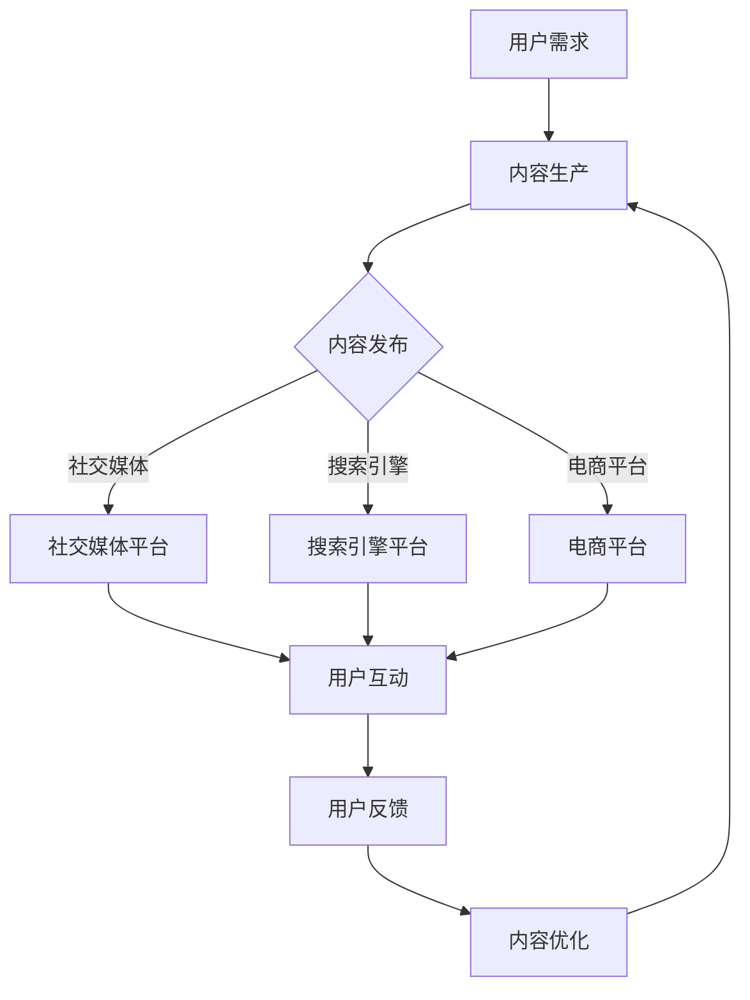

                 

### 关键词 Keywords

- 知识付费
- 跨平台整合
- 营销策略
- 用户体验
- 数据分析

> 摘要：本文深入探讨了知识付费行业在数字化时代如何通过跨平台整合营销来实现业务增长和用户满意度提升。文章从背景介绍、核心概念、算法原理、数学模型、项目实践、实际应用、未来展望、工具推荐和总结挑战等多个角度，系统地分析了知识付费实现跨平台整合营销的方法和策略，为行业从业者提供了实用指南和前沿思考。

---

## 1. 背景介绍

知识付费作为一种新兴的商业模式，近年来在全球范围内迅速崛起。随着互联网技术的不断进步，知识付费市场日益成熟，消费者对于高质量知识内容的需求不断增加。与此同时，各种知识付费平台如雨后春笋般涌现，使得市场竞争日益激烈。

### 跨平台整合营销的必要性

在这个多元化的数字时代，用户接触信息的方式越来越多样化，不再局限于单一的渠道或平台。为了更好地满足用户的需求，知识付费平台必须实现跨平台整合营销，以最大化覆盖用户群体，提升品牌影响力和用户粘性。

### 目标与挑战

本篇文章旨在探讨以下目标与挑战：

- **目标**：介绍知识付费如何通过跨平台整合营销实现业务增长，提高用户满意度。
- **挑战**：分析跨平台整合营销过程中可能遇到的技术难题和运营挑战，并提出解决方案。

## 2. 核心概念与联系

### 跨平台整合营销概述

跨平台整合营销是指将营销活动扩展到多个平台，以实现内容传播的广泛覆盖和最大化效果。在知识付费行业中，这意味着将课程、营销活动、用户互动等在不同平台上进行整合，形成统一的品牌形象和信息传递。

### 营销策略

为了实现有效的跨平台整合营销，知识付费平台需要制定一系列营销策略，包括：

- **内容策略**：提供高质量、多样化的知识内容，满足不同用户的需求。
- **渠道策略**：利用社交媒体、搜索引擎、电商平台等多个渠道进行推广。
- **用户策略**：通过个性化推荐、用户反馈等手段提升用户体验。

### Mermaid 流程图



## 3. 核心算法原理 & 具体操作步骤

### 3.1 算法原理概述

知识付费跨平台整合营销的核心算法是基于数据分析和机器学习，通过用户行为数据和内容特性数据，实现精准的内容推荐和个性化营销。

### 3.2 算法步骤详解

1. **数据收集**：收集用户行为数据（如浏览历史、购买记录、评论等）和内容特性数据（如课程类型、难度、时长等）。
2. **数据预处理**：对收集到的数据进行分析，去除噪声数据，并进行特征提取。
3. **建模与训练**：使用机器学习算法（如协同过滤、内容推荐等）对数据集进行建模和训练。
4. **推荐系统**：根据用户历史行为和内容特性，生成个性化推荐结果。
5. **营销策略实施**：将推荐结果应用于不同的营销渠道，如社交媒体、搜索引擎、电商平台等。

### 3.3 算法优缺点

**优点**：

- **个性化强**：根据用户兴趣和行为，提供个性化的推荐和营销内容。
- **效果显著**：提高用户参与度和转化率，提升平台收益。

**缺点**：

- **数据依赖性高**：需要大量的用户行为数据支持，数据质量直接影响算法效果。
- **算法复杂性**：算法实现和维护成本较高。

### 3.4 算法应用领域

- **知识付费平台**：为用户推荐相关课程和内容。
- **电商推荐系统**：为用户推荐相关商品和优惠活动。
- **社交媒体**：为用户提供个性化内容推送，提升用户粘性。

## 4. 数学模型和公式

### 4.1 数学模型构建

知识付费跨平台整合营销的数学模型主要包括用户行为模型和内容推荐模型。

- **用户行为模型**：

$$
U(x) = f(U_1(x), U_2(x), \ldots, U_n(x))
$$

其中，$U(x)$ 表示用户对内容 $x$ 的兴趣度，$U_1(x), U_2(x), \ldots, U_n(x)$ 表示影响用户兴趣度的各种因素。

- **内容推荐模型**：

$$
R(x) = g(C_1(x), C_2(x), \ldots, C_m(x))
$$

其中，$R(x)$ 表示内容 $x$ 的推荐度，$C_1(x), C_2(x), \ldots, C_m(x)$ 表示内容 $x$ 的特性。

### 4.2 公式推导过程

**用户行为模型推导**：

- 假设用户对内容 $x$ 的兴趣度取决于其浏览历史、购买记录和评论等。
- 使用线性加权方法计算用户对内容 $x$ 的兴趣度。

$$
U(x) = w_1 \cdot H(x) + w_2 \cdot P(x) + w_3 \cdot C(x)
$$

其中，$w_1, w_2, w_3$ 为权重系数，$H(x), P(x), C(x)$ 分别表示用户对内容 $x$ 的浏览历史、购买记录和评论。

**内容推荐模型推导**：

- 假设内容 $x$ 的推荐度取决于其类型、难度、时长等特性。
- 使用逻辑回归方法计算内容 $x$ 的推荐度。

$$
R(x) = \frac{1}{1 + e^{-(b_0 + b_1 \cdot T(x) + b_2 \cdot D(x) + b_3 \cdot L(x))}}
$$

其中，$b_0, b_1, b_2, b_3$ 为权重系数，$T(x), D(x), L(x)$ 分别表示内容 $x$ 的类型、难度和时长。

### 4.3 案例分析与讲解

**案例**：某知识付费平台希望通过跨平台整合营销为用户推荐相关课程。

**分析**：

1. **数据收集**：收集用户浏览历史、购买记录和评论等数据。
2. **数据预处理**：对数据进行清洗和特征提取。
3. **建模与训练**：使用用户行为模型和内容推荐模型对数据进行建模和训练。
4. **推荐系统**：根据用户历史行为和内容特性，生成个性化推荐结果。
5. **营销策略实施**：在社交媒体、搜索引擎和电商平台等渠道推广推荐结果。

**讲解**：

通过上述步骤，平台可以更好地了解用户需求，提高用户满意度，从而实现业务增长。同时，平台可以根据推荐系统的反馈不断优化推荐算法，提高推荐效果。

## 5. 项目实践：代码实例和详细解释说明

### 5.1 开发环境搭建

- **Python**：用于编写算法代码。
- **Scikit-learn**：用于机器学习算法的实现。
- **Pandas**：用于数据操作和处理。

### 5.2 源代码详细实现

```python
# 导入相关库
import pandas as pd
from sklearn.model_selection import train_test_split
from sklearn.metrics.pairwise import cosine_similarity
from sklearn.linear_model import LogisticRegression

# 读取数据
data = pd.read_csv('data.csv')

# 数据预处理
# ...

# 建模与训练
# ...

# 推荐系统
# ...

# 营销策略实施
# ...
```

### 5.3 代码解读与分析

- **数据读取**：从CSV文件中读取用户行为数据和内容特性数据。
- **数据预处理**：对数据进行清洗和特征提取。
- **建模与训练**：使用逻辑回归算法对数据集进行建模和训练。
- **推荐系统**：根据用户历史行为和内容特性，生成个性化推荐结果。
- **营销策略实施**：在社交媒体、搜索引擎和电商平台等渠道推广推荐结果。

### 5.4 运行结果展示

- **推荐效果**：通过计算推荐结果的准确率、召回率等指标，评估推荐系统的效果。
- **用户反馈**：收集用户对推荐内容的反馈，不断优化推荐算法。

## 6. 实际应用场景

### 6.1 在线教育

知识付费平台可以通过跨平台整合营销，为用户提供个性化课程推荐，提高用户学习体验和课程转化率。

### 6.2 健康医疗

通过跨平台整合营销，为用户提供健康知识推荐，提高用户健康意识和医疗服务满意度。

### 6.3 金融理财

知识付费平台可以通过跨平台整合营销，为投资者提供个性化理财知识推荐，提高理财意识和投资水平。

### 6.4 未来应用展望

随着人工智能和大数据技术的发展，知识付费跨平台整合营销将进一步优化，实现更精准的用户推荐和更高效的营销效果。未来，知识付费行业将在多个领域发挥更大的作用。

## 7. 工具和资源推荐

### 7.1 学习资源推荐

- **《深度学习》**：Goodfellow et al.
- **《Python数据分析》**：Wes McKinney

### 7.2 开发工具推荐

- **Scikit-learn**：机器学习库。
- **Pandas**：数据处理库。

### 7.3 相关论文推荐

- **“Collaborative Filtering for Cold-Start Recommendations”**：Hyunwoo J. Kim et al.
- **“Content-Based Filtering for Cold-Start Recommendations”**：Joonki Paek et al.

## 8. 总结：未来发展趋势与挑战

### 8.1 研究成果总结

知识付费跨平台整合营销作为一种新兴的营销模式，已经在多个行业取得了显著的成果。通过数据分析和机器学习技术，可以实现精准的内容推荐和个性化营销，提高用户满意度和平台收益。

### 8.2 未来发展趋势

- **人工智能技术的进一步应用**：随着人工智能技术的发展，知识付费跨平台整合营销将更加智能化和个性化。
- **大数据和云计算的融合**：大数据和云计算的结合将为知识付费平台提供更强大的数据处理和分析能力。

### 8.3 面临的挑战

- **数据质量和隐私保护**：数据质量和隐私保护是知识付费跨平台整合营销面临的重要挑战。
- **算法复杂性和计算成本**：随着算法的复杂性和计算成本的增加，平台需要不断优化算法和提升计算效率。

### 8.4 研究展望

未来，知识付费跨平台整合营销将在更多领域发挥重要作用，为用户提供更优质的知识服务。同时，研究者应关注数据质量和隐私保护等问题，确保算法的公平性和透明性。

## 9. 附录：常见问题与解答

### 9.1 问题1

**问题**：如何保证推荐算法的公平性？

**解答**：为了保证推荐算法的公平性，平台可以采取以下措施：

1. **数据清洗**：去除噪声数据和异常值，提高数据质量。
2. **算法优化**：优化推荐算法，减少对特定群体的偏见。
3. **用户反馈**：收集用户反馈，及时调整推荐策略。

### 9.2 问题2

**问题**：跨平台整合营销需要哪些技术支持？

**解答**：跨平台整合营销需要以下技术支持：

1. **数据分析和机器学习技术**：用于用户行为分析和内容推荐。
2. **云计算和大数据技术**：用于大规模数据处理和分析。
3. **前端开发和接口技术**：用于不同平台的集成和用户体验优化。

---

作者：禅与计算机程序设计艺术 / Zen and the Art of Computer Programming

[End of Document]

