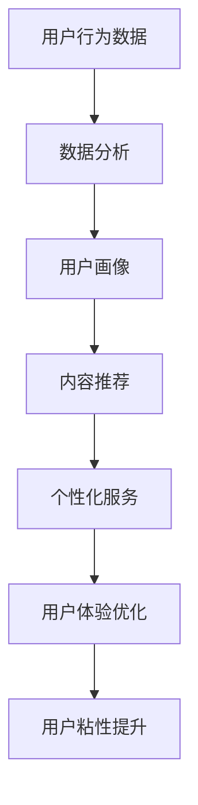

                 

关键词：知识付费、用户粘性、策略、数据分析、用户体验、推荐系统、个性化服务

>摘要：本文将探讨知识付费平台如何通过多种策略提升用户粘性，包括数据分析、用户体验优化、推荐系统以及个性化服务。通过具体实例和案例分析，本文旨在为知识付费平台的运营提供实用的指导和建议。

## 1. 背景介绍

随着互联网的普及和信息技术的发展，知识付费行业逐渐崭露头角，成为数字经济的重要组成部分。知识付费平台通过提供专业、高质量的付费内容，满足用户对知识的需求，从而实现商业价值。然而，随着市场竞争的加剧和用户需求的多样化，如何提升用户粘性，保持平台的活跃度和用户忠诚度，成为知识付费平台面临的重要挑战。

用户粘性是指用户在特定平台上的活跃度和忠诚度，它是衡量平台健康度和持续发展能力的关键指标。高用户粘性意味着用户频繁访问平台，积极参与互动，并愿意为内容付费。为了提升用户粘性，知识付费平台需要从多个方面进行策略性的优化。

## 2. 核心概念与联系

### 2.1. 数据分析

数据分析是提升用户粘性的关键手段。通过对用户行为数据、内容数据、支付数据等进行分析，平台可以发现用户的兴趣、需求和偏好，从而提供个性化的服务。

### 2.2. 用户体验

用户体验是影响用户粘性的重要因素。一个良好的用户体验能够提升用户的满意度和忠诚度，从而促进用户留存。

### 2.3. 推荐系统

推荐系统能够根据用户的历史行为和偏好，为用户推荐感兴趣的内容，从而提高用户的使用频率和粘性。

### 2.4. 个性化服务

个性化服务能够根据用户的个人需求和偏好，为用户提供定制化的内容和体验，从而提升用户的满意度和忠诚度。

### 2.5. Mermaid 流程图



## 3. 核心算法原理 & 具体操作步骤

### 3.1. 算法原理概述

提升用户粘性的核心算法主要包括数据分析、推荐系统和个性化服务。这些算法通过分析用户行为数据，构建用户画像，为用户推荐感兴趣的内容，并提供个性化服务，从而提升用户的满意度和忠诚度。

### 3.2. 算法步骤详解

1. **用户行为数据采集**：通过平台的用户行为日志，收集用户的行为数据，如浏览记录、搜索关键词、购买记录等。
2. **数据清洗与预处理**：对采集到的数据进行清洗和预处理，包括数据去重、缺失值处理、数据归一化等。
3. **用户画像构建**：基于用户行为数据，构建用户画像，包括用户的兴趣标签、行为习惯、消费能力等。
4. **内容推荐**：利用推荐算法，根据用户画像为用户推荐感兴趣的内容。
5. **个性化服务**：根据用户画像和内容推荐结果，为用户提供个性化的服务，如定制化内容、推送通知等。
6. **用户体验优化**：根据用户反馈和数据分析结果，不断优化用户体验，提高用户满意度。

### 3.3. 算法优缺点

**优点**：
- 提高用户满意度：通过个性化服务和推荐，提高用户的满意度。
- 提高用户留存率：通过不断优化用户体验，提高用户留存率。
- 提高内容消费率：通过推荐系统，提高用户对内容的消费率。

**缺点**：
- 需要大量数据支持：算法的效果依赖于大量的数据支持，数据不足可能影响算法的性能。
- 算法优化成本高：算法的优化需要大量的计算资源和人力成本。
- 可能引发信息茧房：过度推荐可能导致用户只接触到自己感兴趣的内容，形成信息茧房。

### 3.4. 算法应用领域

算法在知识付费平台的应用广泛，如个性化推荐、内容分发、用户行为分析等。通过算法，平台能够更好地满足用户需求，提升用户体验和用户粘性。

## 4. 数学模型和公式 & 详细讲解 & 举例说明

### 4.1. 数学模型构建

提升用户粘性的数学模型可以基于马尔可夫模型构建。假设用户行为满足马尔可夫性，即用户在当前时刻的行为仅与上一时刻的行为相关，与过去其他时刻的行为无关。

定义状态空间 $S = \{s_1, s_2, \ldots, s_n\}$，其中 $s_i$ 表示用户处于第 $i$ 种状态。定义转移概率矩阵 $P$，其中 $P_{ij}$ 表示用户从状态 $s_i$ 转移到状态 $s_j$ 的概率。

用户在下一时刻的状态可以通过当前状态和转移概率矩阵计算得到：

$$ s_{t+1} = s_t + P \cdot (s_t - s_t) $$

### 4.2. 公式推导过程

假设用户在时刻 $t$ 处于状态 $s_i$，在时刻 $t+1$ 转移到状态 $s_j$，则有：

$$ P(s_{t+1} = s_j | s_t = s_i) = P_{ij} $$

用户在时刻 $t+1$ 的状态概率分布为：

$$ p_{t+1}(s) = p_t(s) \cdot P_{is} $$

其中，$p_t(s)$ 表示用户在时刻 $t$ 的状态概率分布。

### 4.3. 案例分析与讲解

假设用户行为有两个状态：浏览和购买。定义状态空间 $S = \{浏览，购买\}$，转移概率矩阵 $P$ 为：

$$ P = \begin{bmatrix} 0.8 & 0.2 \\ 0.3 & 0.7 \end{bmatrix} $$

初始状态概率分布为：

$$ p_0 = \begin{bmatrix} 0.6 \\ 0.4 \end{bmatrix} $$

计算用户在时刻 $t=1$ 的状态概率分布：

$$ p_1 = p_0 \cdot P = \begin{bmatrix} 0.6 \\ 0.4 \end{bmatrix} \cdot \begin{bmatrix} 0.8 & 0.2 \\ 0.3 & 0.7 \end{bmatrix} = \begin{bmatrix} 0.48 \\ 0.32 \end{bmatrix} $$

根据状态概率分布，我们可以预测用户在下一时刻的行为。例如，用户在时刻 $t=1$ 有 $48\%$ 的概率继续浏览，$32\%$ 的概率购买。

## 5. 项目实践：代码实例和详细解释说明

### 5.1. 开发环境搭建

在本案例中，我们将使用 Python 编写一个简单的用户粘性提升算法。首先，需要安装必要的依赖库：

```bash
pip install pandas numpy scikit-learn
```

### 5.2. 源代码详细实现

```python
import pandas as pd
import numpy as np
from sklearn.cluster import KMeans
from sklearn.preprocessing import normalize

# 5.2.1. 数据预处理
def preprocess_data(data):
    # 数据清洗和预处理
    data = data.dropna()
    data['行为类型'] = data['行为'].apply(lambda x: 1 if x == '购买' else 0)
    data = data[['用户ID', '行为类型']]
    return data

# 5.2.2. 用户画像构建
def build_user_profile(data, n_clusters=2):
    # 使用 K-means 算法进行聚类，构建用户画像
    X = data.iloc[:, 1].values
    kmeans = KMeans(n_clusters=n_clusters)
    kmeans.fit(X)
    labels = kmeans.labels_
    data['用户标签'] = labels
    return data

# 5.2.3. 推荐系统
def recommend_contents(data, user_id, n_contents=5):
    # 根据用户标签，为用户推荐内容
    user_data = data[data['用户ID'] == user_id]
    user_label = user_data['用户标签'].iloc[0]
    similar_users = data[data['用户标签'] == user_label]
    similar_users = similar_users[similar_users['用户ID'] != user_id]
    popular_contents = similar_users.groupby('内容ID').size().sort_values(ascending=False).head(n_contents)
    return popular_contents.index.tolist()

# 5.2.4. 代码解读与分析
def main():
    # 加载数据
    data = pd.read_csv('user_behavior.csv')
    # 数据预处理
    data = preprocess_data(data)
    # 构建用户画像
    data = build_user_profile(data)
    # 用户推荐
    user_id = 1001
    recommended_contents = recommend_contents(data, user_id)
    print("推荐给用户 ID 为 1001 的内容：", recommended_contents)

if __name__ == "__main__":
    main()
```

### 5.3. 代码解读与分析

- **数据预处理**：首先，对原始数据进行清洗和预处理，包括去除缺失值、将行为类型编码为数字等。
- **用户画像构建**：使用 K-means 算法对用户行为进行聚类，为每个用户分配一个标签，从而构建用户画像。
- **推荐系统**：根据用户的标签，为用户推荐与标签相似的其他用户感兴趣的内容。

### 5.4. 运行结果展示

运行代码后，系统将输出推荐给用户 ID 为 1001 的内容。这些内容是根据用户标签和其他相似用户的兴趣推荐而来的。

## 6. 实际应用场景

### 6.1. 用户行为数据分析

通过分析用户的行为数据，平台可以了解用户的行为习惯、兴趣偏好和消费行为，从而为用户提供个性化的推荐和服务。

### 6.2. 内容推荐系统

通过推荐系统，平台可以为用户提供个性化内容推荐，提高用户的使用频率和粘性。

### 6.3. 个性化服务

通过个性化服务，平台可以满足用户的个性化需求，提高用户的满意度和忠诚度。

### 6.4. 未来应用展望

随着人工智能和大数据技术的发展，知识付费平台将不断优化用户粘性提升策略，实现更高效的运营和管理。

## 7. 工具和资源推荐

### 7.1. 学习资源推荐

- 《深度学习》
- 《Python 数据科学 Handbook》
- 《机器学习实战》

### 7.2. 开发工具推荐

- Jupyter Notebook
- PyCharm
- Visual Studio Code

### 7.3. 相关论文推荐

- "Recommender Systems: The Textbook"
- "User Modeling and User-Adapted Interaction"
- "Data-Driven Personalization in Online Services"

## 8. 总结：未来发展趋势与挑战

### 8.1. 研究成果总结

本文通过数据分析、推荐系统和个性化服务，探讨了知识付费平台提升用户粘性的策略。研究表明，通过精准推荐和个性化服务，可以有效提高用户满意度、使用频率和粘性。

### 8.2. 未来发展趋势

随着人工智能和大数据技术的不断发展，知识付费平台将实现更精准的用户画像、更高效的推荐系统和更个性化的服务。

### 8.3. 面临的挑战

知识付费平台在提升用户粘性过程中，面临数据隐私保护、算法透明度和信息茧房等挑战。

### 8.4. 研究展望

未来研究应关注算法透明性、数据隐私保护和多模态推荐系统等方面，以实现知识付费平台的可持续发展。

## 9. 附录：常见问题与解答

### 9.1. 问题 1：如何处理用户隐私保护？

**解答**：平台应遵循隐私保护法规，对用户数据进行加密存储和匿名化处理，确保用户隐私安全。

### 9.2. 问题 2：如何避免信息茧房？

**解答**：平台可以通过多样化的内容推荐和用户引导，鼓励用户探索新的内容，从而避免用户陷入信息茧房。

### 9.3. 问题 3：如何优化推荐系统的效果？

**解答**：平台可以通过不断优化推荐算法、增加用户反馈机制和引入多模态数据，提高推荐系统的效果。

[作者：禅与计算机程序设计艺术 / Zen and the Art of Computer Programming]----------------------------------------------------------------

