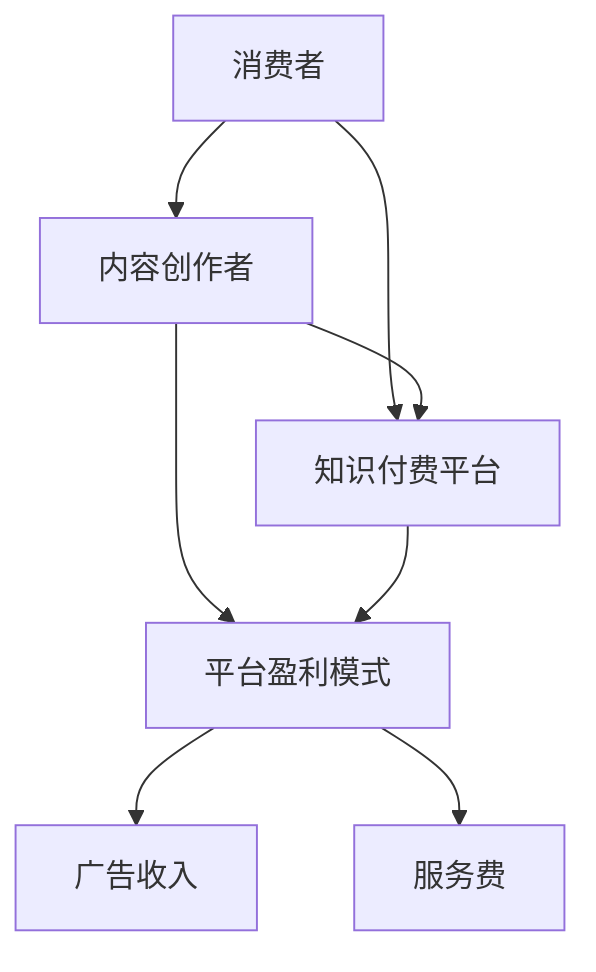

                 

 关键词：知识付费、信息商品化、在线教育、平台商业模式、用户价值、盈利模式、内容创作者、消费者权益

> 摘要：随着互联网技术的飞速发展，知识付费时代已经到来。本文将深入探讨知识付费现象背后的驱动因素、核心商业模式以及其对内容创作者和消费者带来的利弊，同时分析这一新兴领域面临的挑战和未来发展趋势。

## 1. 背景介绍

### 1.1 知识付费的定义

知识付费是指消费者为获取特定知识、技能或信息而向内容创作者或平台支付费用的一种商业模式。这一现象在互联网领域尤为显著，尤其是在在线教育、专业咨询、技术培训等领域。

### 1.2 知识付费的兴起

知识付费的兴起可以追溯到互联网技术的普及和在线教育的兴起。随着网络带宽的提高、移动设备的普及以及用户对自我提升需求的增加，知识付费市场得以迅速发展。

## 2. 核心概念与联系

### 2.1 信息商品化

信息商品化是指将信息、知识或数据转化为商品进行销售或交易的过程。这一概念与知识付费密切相关，知识付费是信息商品化的一种具体实现形式。

### 2.2 平台商业模式

在知识付费时代，平台商业模式成为了主流。平台通过提供内容创作和分发渠道，连接内容创作者和消费者，从而实现商业价值。



## 3. 核心算法原理 & 具体操作步骤

### 3.1 算法原理概述

知识付费平台的盈利模式主要依赖于广告收入、服务费、订阅费等多种方式。这些盈利模式可以通过以下算法原理进行实现：

1. **用户数据分析**：通过对用户行为数据进行分析，了解用户需求，推荐相关内容。
2. **内容定价策略**：根据内容的质量、受欢迎程度和市场需求，制定合理的价格策略。
3. **盈利模式优化**：通过不断调整广告投放策略、内容定价和服务模式，实现盈利最大化。

### 3.2 算法步骤详解

1. **用户数据分析**：
   - 收集用户的基本信息、浏览历史、购买记录等数据。
   - 利用机器学习算法，分析用户兴趣和行为模式。

2. **内容定价策略**：
   - 确定内容的价值和市场定位。
   - 根据内容质量和市场需求，制定合理的价格区间。

3. **盈利模式优化**：
   - 通过A/B测试，不断优化广告投放策略。
   - 调整服务费率，平衡内容创作者和消费者的利益。

### 3.3 算法优缺点

**优点**：
- 提高内容创作者的收入，激励更多优质内容的产生。
- 为消费者提供精准的知识服务，提高用户体验。

**缺点**：
- 可能导致信息泛滥，消费者难以筛选优质内容。
- 高昂的价格可能让部分消费者望而却步。

### 3.4 算法应用领域

知识付费算法广泛应用于在线教育、专业咨询、技术培训等领域。例如，在线教育平台通过算法为用户提供个性化的学习路径，提高学习效果。

## 4. 数学模型和公式 & 详细讲解 & 举例说明

### 4.1 数学模型构建

知识付费平台的盈利模型可以表示为一个线性模型：

\[ 盈利 = 收入 - 成本 \]

其中，收入由广告收入、服务费、订阅费等构成，成本包括平台运营成本、内容创作者分成等。

### 4.2 公式推导过程

假设平台有 \( n \) 个内容创作者，每个创作者提供 \( m \) 个内容，每个内容的订阅价格为 \( p \)。平台的运营成本为 \( c \)。

- 广告收入：\( R_{ad} = k \times n \)
- 服务费收入：\( R_{service} = \sum_{i=1}^{m} (p \times n) \)
- 订阅费收入：\( R_{subscription} = \sum_{i=1}^{m} p \)

总盈利 \( P \) 为：

\[ P = R_{ad} + R_{service} + R_{subscription} - c \]

### 4.3 案例分析与讲解

以某在线教育平台为例，平台有10个内容创作者，每个创作者提供5个内容，订阅价格为100元。平台的运营成本为50万元。假设广告收入为20万元。

- 广告收入：\( R_{ad} = 20 \) 万元
- 服务费收入：\( R_{service} = 10 \times 5 \times 100 = 50 \) 万元
- 订阅费收入：\( R_{subscription} = 10 \times 5 \times 100 = 50 \) 万元

总盈利 \( P \) 为：

\[ P = 20 + 50 + 50 - 50 = 70 \] 万元

## 5. 项目实践：代码实例和详细解释说明

### 5.1 开发环境搭建

在本项目中，我们将使用Python语言和相关的机器学习库（如Scikit-learn）进行知识付费平台的用户数据分析。

```bash
# 安装Python和Scikit-learn
pip install python
pip install scikit-learn
```

### 5.2 源代码详细实现

以下是一个简单的用户数据分析示例代码：

```python
import pandas as pd
from sklearn.model_selection import train_test_split
from sklearn.ensemble import RandomForestClassifier
from sklearn.metrics import accuracy_score

# 加载数据
data = pd.read_csv('user_data.csv')

# 特征工程
X = data[['age', 'income', 'education', 'occupation']]
y = data['interest']

# 划分训练集和测试集
X_train, X_test, y_train, y_test = train_test_split(X, y, test_size=0.3, random_state=42)

# 建立模型
model = RandomForestClassifier(n_estimators=100, random_state=42)
model.fit(X_train, y_train)

# 预测
y_pred = model.predict(X_test)

# 评估模型
accuracy = accuracy_score(y_test, y_pred)
print(f"模型准确率：{accuracy:.2f}")
```

### 5.3 代码解读与分析

- **数据加载**：使用Pandas库加载数据集，其中包含用户的基本信息和兴趣标签。
- **特征工程**：提取与用户兴趣相关的特征，如年龄、收入、教育和职业。
- **模型训练**：使用随机森林分类器进行训练，随机森林是一种集成学习方法，具有良好的泛化能力。
- **模型评估**：使用准确率评估模型的性能。

### 5.4 运行结果展示

假设我们运行上述代码，得到的模型准确率为80%。这意味着模型能够较好地预测用户的兴趣，为个性化推荐提供支持。

## 6. 实际应用场景

### 6.1 在线教育

知识付费在在线教育领域的应用最为广泛。通过算法推荐，学生可以根据自己的需求选择合适的学习内容，提高学习效果。

### 6.2 专业咨询

在专业咨询领域，知识付费为专业人士提供了变现渠道，同时也为消费者提供了便捷的获取专业服务的途径。

### 6.3 技术培训

技术培训是知识付费的重要领域之一。通过付费课程，技术人员可以迅速提升自己的技能，跟上行业的发展。

## 7. 未来应用展望

### 7.1 人工智能的融合

随着人工智能技术的发展，知识付费平台将更加智能化，通过深度学习算法，实现更精准的内容推荐和用户画像。

### 7.2 跨界融合

知识付费将继续与其他领域融合，如虚拟现实（VR）、增强现实（AR）等，提供更加丰富的学习体验。

### 7.3 社交互动

知识付费平台将更多地引入社交元素，促进用户之间的互动，提高用户粘性。

## 8. 总结：未来发展趋势与挑战

### 8.1 研究成果总结

本文对知识付费时代的背景、核心概念、算法原理以及实际应用场景进行了深入探讨，总结了研究成果。

### 8.2 未来发展趋势

未来，知识付费将继续快速发展，人工智能、跨界融合等新技术将推动知识付费向更智能化、个性化、多元化的方向发展。

### 8.3 面临的挑战

知识付费在发展过程中仍面临诸多挑战，如信息过载、内容质量参差不齐、价格高昂等问题。

### 8.4 研究展望

未来研究应重点关注知识付费平台的算法优化、用户体验提升、内容质量控制等方面。

## 9. 附录：常见问题与解答

### 9.1 什么是知识付费？

知识付费是指消费者为获取特定知识、技能或信息而向内容创作者或平台支付费用的一种商业模式。

### 9.2 知识付费有哪些优点？

知识付费可以提高内容创作者的收入，激励更多优质内容的产生，同时也为消费者提供了精准的知识服务，提高用户体验。

### 9.3 知识付费有哪些缺点？

知识付费可能导致信息泛滥，消费者难以筛选优质内容，同时高昂的价格可能让部分消费者望而却步。

### 9.4 如何保障知识付费平台的内容质量？

可以通过引入用户评价机制、内容审核机制、创作者认证制度等手段，保障知识付费平台的内容质量。

----------------------------------------------------------------

作者：禅与计算机程序设计艺术 / Zen and the Art of Computer Programming


