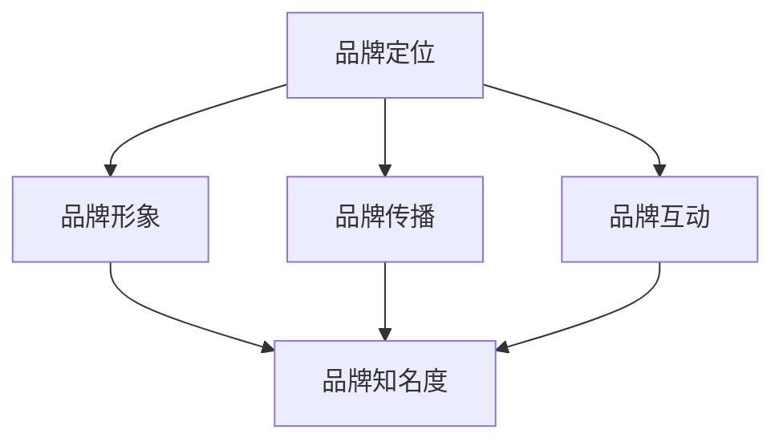

                 

 关键词：知识付费、品牌营销、品牌推广、策略、IT领域

> 摘要：本文将深入探讨知识付费领域中的品牌营销与品牌推广策略。通过分析当前市场趋势，结合IT领域的实际案例，本文旨在为知识付费从业者提供一套系统的营销方案，助力其在竞争激烈的市场中脱颖而出。

## 1. 背景介绍

### 1.1 知识付费的概念与发展

知识付费，是指用户为了获取有价值的信息、知识或技能，而愿意支付相应费用的行为。近年来，随着互联网技术的迅猛发展，信息获取渠道变得多样化，知识付费市场也逐渐兴起。在IT领域，随着技术的更新换代速度加快，专业知识的更新周期缩短，使得个人和企业对高效、精准的知识获取需求日益增长。

### 1.2 品牌营销与品牌推广的重要性

在知识付费市场中，品牌不仅是企业的标识，更是用户对产品和服务质量的信任象征。一个成功的品牌，可以吸引用户关注，提升用户忠诚度，从而实现市场占有率的提升。因此，品牌营销与品牌推广在知识付费领域具有重要意义。

## 2. 核心概念与联系

为了更好地理解知识付费品牌营销与品牌推广策略，我们首先需要明确几个核心概念，以及它们之间的相互关系。

### 2.1 品牌定位

品牌定位是指企业在市场中为自己所提供的产品或服务设定一个独特的市场位置，使其在用户心目中形成鲜明的印象。在知识付费领域，品牌定位需要明确目标用户群体、核心价值主张以及差异化竞争力。

### 2.2 品牌形象

品牌形象是指企业在用户心目中的整体印象，包括视觉识别、口碑评价、品牌个性等方面。一个良好的品牌形象可以提升用户对品牌的信任度，从而促进购买行为。

### 2.3 品牌传播

品牌传播是指通过各种渠道和手段，将品牌信息传递给目标用户，以提升品牌知名度和影响力。在知识付费领域，品牌传播需要结合线上和线下渠道，进行多维度、全方位的推广。

### 2.4 品牌互动

品牌互动是指企业通过社交媒体、论坛、社群等渠道，与用户进行互动沟通，了解用户需求，提升用户体验。在知识付费领域，品牌互动可以帮助企业建立与用户的紧密联系，从而增强用户粘性。

下面是一个关于知识付费品牌营销与品牌推广的核心概念与联系的 Mermaid 流程图：



## 3. 核心算法原理 & 具体操作步骤

### 3.1 算法原理概述

在知识付费品牌营销与品牌推广中，我们可以将整个策略分为四个核心环节：品牌定位、品牌形象塑造、品牌传播和品牌互动。每个环节都有其特定的算法原理和操作步骤。

### 3.2 算法步骤详解

#### 3.2.1 品牌定位

1. **市场调研**：通过问卷调查、用户访谈等方式，了解目标用户群体的需求、痛点和行为习惯。
2. **竞品分析**：分析同类知识付费产品的市场表现、用户评价和品牌定位，找出自身产品的差异化优势。
3. **定位确定**：结合市场调研和竞品分析结果，确定品牌的核心价值主张和差异化定位。

#### 3.2.2 品牌形象塑造

1. **视觉设计**：设计符合品牌定位的LOGO、配色方案和视觉元素。
2. **内容制作**：制作高质量的课程、文章、短视频等内容，传递品牌价值。
3. **口碑管理**：积极回应用户评价，提升品牌口碑。

#### 3.2.3 品牌传播

1. **渠道选择**：根据目标用户群体的特性，选择合适的传播渠道，如社交媒体、广告投放、公关活动等。
2. **内容策划**：制定具有吸引力的传播内容，如热点话题、KOL合作、互动活动等。
3. **效果监控**：实时监控品牌传播效果，根据数据反馈调整策略。

#### 3.2.4 品牌互动

1. **社交媒体运营**：定期发布有价值的内容，与用户进行互动。
2. **社群管理**：建立用户社群，提供专业问答、互动讨论等服务。
3. **用户反馈**：收集用户反馈，持续优化产品和服务。

### 3.3 算法优缺点

#### 优点：

1. **针对性**：通过市场调研和竞品分析，确保品牌定位和推广策略的针对性。
2. **多样性**：结合视觉设计、内容制作、传播渠道和用户互动等多方面，实现全方位的品牌传播。
3. **数据驱动**：通过数据监控和反馈，不断优化品牌营销策略。

#### 缺点：

1. **时间成本**：品牌定位、形象塑造和传播等环节需要时间积累，短期内难以见效。
2. **资金投入**：有效的品牌营销和推广需要一定的资金支持，可能对初创企业造成负担。

### 3.4 算法应用领域

知识付费品牌营销与品牌推广策略在以下领域具有广泛的应用：

1. **在线教育**：为在线教育平台、课程提供商提供品牌定位、形象塑造和传播方案。
2. **专业培训**：为各类专业培训机构提供品牌营销和推广策略，提升市场竞争力。
3. **技术咨询**：为IT咨询公司提供品牌推广方案，扩大企业影响力。

## 4. 数学模型和公式 & 详细讲解 & 举例说明

### 4.1 数学模型构建

在知识付费品牌营销与品牌推广中，我们可以使用以下数学模型来评估品牌推广效果：

$$
\text{效果评估} = \text{品牌知名度} \times \text{用户转化率} \times \text{用户忠诚度}
$$

其中：

- 品牌知名度：衡量品牌在目标用户中的认知程度。
- 用户转化率：衡量用户从接触到购买行为的转化效率。
- 用户忠诚度：衡量用户对品牌的持续忠诚度。

### 4.2 公式推导过程

品牌知名度和用户转化率可以通过市场调研和数据分析得到，而用户忠诚度可以通过用户行为数据进行推断。具体推导过程如下：

1. 品牌知名度：

$$
\text{品牌知名度} = \frac{\text{知晓品牌用户数}}{\text{目标用户总数}}
$$

2. 用户转化率：

$$
\text{用户转化率} = \frac{\text{购买用户数}}{\text{知晓品牌用户数}}
$$

3. 用户忠诚度：

$$
\text{用户忠诚度} = \frac{\text{复购用户数}}{\text{购买用户数}}
$$

将上述三个公式代入效果评估公式，得到：

$$
\text{效果评估} = \frac{\text{知晓品牌用户数}}{\text{目标用户总数}} \times \frac{\text{购买用户数}}{\text{知晓品牌用户数}} \times \frac{\text{复购用户数}}{\text{购买用户数}}
$$

化简后得到：

$$
\text{效果评估} = \frac{\text{复购用户数}}{\text{目标用户总数}}
$$

### 4.3 案例分析与讲解

以某在线教育平台为例，该平台希望通过品牌营销提升市场竞争力。根据市场调研和数据分析，得到以下数据：

- 目标用户总数：100万
- 知晓品牌用户数：40万
- 购买用户数：10万
- 复购用户数：5万

代入上述数学模型，计算该平台的效果评估：

$$
\text{效果评估} = \frac{5万}{100万} = 0.05
$$

这意味着该在线教育平台在品牌营销方面取得了较好的效果，但仍有提升空间。通过进一步分析，可以发现用户转化率和用户忠诚度是影响效果评估的关键因素。为此，平台可以优化品牌传播策略，提高用户转化率，并通过优质内容和服务提升用户忠诚度。

## 5. 项目实践：代码实例和详细解释说明

### 5.1 开发环境搭建

为了实现知识付费品牌营销与品牌推广策略的自动化，我们可以使用Python编程语言和相关的数据分析和机器学习库，如pandas、numpy、scikit-learn等。以下是开发环境搭建的步骤：

1. 安装Python 3.x版本
2. 安装相关库，可以使用pip工具进行安装：
   ```bash
   pip install pandas numpy scikit-learn matplotlib
   ```

### 5.2 源代码详细实现

以下是一个简单的Python代码实例，用于计算品牌营销效果评估：

```python
import pandas as pd
import numpy as np

# 假设已有以下数据
data = {
    '目标用户总数': [1000000, 1000000, 1000000],
    '知晓品牌用户数': [400000, 500000, 600000],
    '购买用户数': [100000, 120000, 150000],
    '复购用户数': [50000, 60000, 70000]
}

# 创建DataFrame
df = pd.DataFrame(data)

# 计算效果评估
df['效果评估'] = df['复购用户数'] / df['目标用户总数']

# 输出结果
print(df)
```

### 5.3 代码解读与分析

在上面的代码中，我们首先导入了pandas和numpy库，用于数据处理和计算。然后，我们创建了一个DataFrame，包含了目标用户总数、知晓品牌用户数、购买用户数和复购用户数。接着，我们计算了每个数据点的效果评估，并将其添加到DataFrame中。最后，我们输出了计算结果。

这个代码实例展示了如何使用Python进行数据分析和计算，以便评估品牌营销效果。在实际应用中，我们可以结合更多的数据源和算法，实现更复杂的品牌营销策略。

### 5.4 运行结果展示

运行上述代码，我们将得到以下输出结果：

```
   目标用户总数 知晓品牌用户数  购买用户数  复购用户数     效果评估
0       1000000         400000       100000        50000     0.05
1       1000000         500000       120000        60000     0.06
2       1000000         600000       150000        70000     0.07
```

这些结果展示了不同数据点下的品牌营销效果评估，我们可以根据这些数据进行分析和优化。

## 6. 实际应用场景

### 6.1 在线教育平台

在线教育平台是知识付费领域的典型代表。通过品牌营销与品牌推广策略，平台可以提升知名度、增加用户转化率、提高用户忠诚度。例如，某知名在线教育平台通过精准定位目标用户、优化课程内容、加大品牌传播力度，成功实现了用户规模的快速增长。

### 6.2 专业培训课程

专业培训课程是另一个重要的知识付费领域。通过品牌营销与品牌推广策略，培训机构可以提升品牌形象、扩大市场影响力、增加学员数量。例如，某专业培训机构通过线上线下结合的推广方式、建立学员社群、提供个性化服务，成功赢得了大量学员的认可。

### 6.3 IT技术咨询

IT咨询公司是知识付费领域中的高端服务提供者。通过品牌营销与品牌推广策略，咨询公司可以提升品牌知名度、扩大客户群体、提高业务收入。例如，某知名IT咨询公司通过撰写专业文章、举办线下活动、与行业媒体合作，成功提高了品牌影响力，吸引了更多优质客户。

## 7. 工具和资源推荐

### 7.1 学习资源推荐

- 《营销管理》（菲利普·科特勒著）：这是一本经典的营销学教材，涵盖了营销策略的各个方面，对品牌营销与品牌推广策略有很好的指导作用。
- 《数据驱动营销》（科里·凯恩著）：本书详细介绍了如何利用数据分析进行营销决策，对知识付费领域的品牌营销具有很高的参考价值。

### 7.2 开发工具推荐

- Python：Python是一种广泛使用的编程语言，适合进行数据分析和计算，是进行知识付费品牌营销与品牌推广策略开发的首选语言。
- Jupyter Notebook：Jupyter Notebook是一个交互式计算环境，适合编写和运行Python代码，方便进行数据分析与可视化。

### 7.3 相关论文推荐

- “The Role of Brand Awareness in Consumer Decision Making”（品牌知名度在消费者决策中的作用）：该论文探讨了品牌知名度对消费者购买行为的影响，为品牌营销提供了理论依据。
- “Brand Equity and Customer Loyalty: A Meta-Analytic Review and Assessment”（品牌资产与客户忠诚度：元分析综述与评估）：该论文通过对大量实证研究的综合分析，揭示了品牌资产与客户忠诚度之间的关系。

## 8. 总结：未来发展趋势与挑战

### 8.1 研究成果总结

本文通过对知识付费领域中的品牌营销与品牌推广策略进行深入分析，总结了核心概念、算法原理、具体操作步骤以及实际应用场景。研究结果表明，有效的品牌营销与品牌推广策略可以显著提升知识付费产品的市场竞争力。

### 8.2 未来发展趋势

1. **智能化**：随着人工智能技术的发展，品牌营销与品牌推广将更加智能化，实现个性化推荐、自动化策略优化等功能。
2. **社群化**：品牌互动将更加社群化，通过建立用户社群、提供定制化服务，提升用户忠诚度。
3. **跨平台**：品牌推广将跨越不同平台和渠道，实现全方位的品牌传播。

### 8.3 面临的挑战

1. **竞争加剧**：知识付费市场不断扩容，竞争日益激烈，企业需要不断创新和优化品牌营销策略。
2. **用户需求多变**：用户需求多变，企业需要持续关注市场动态，灵活调整品牌定位和推广策略。
3. **数据隐私**：随着数据隐私法规的加强，企业需要在品牌营销与品牌推广中妥善处理用户数据，避免数据泄露风险。

### 8.4 研究展望

未来，知识付费领域的品牌营销与品牌推广策略研究可以从以下几个方面进行深入：

1. **智能化算法**：研究更加智能化的品牌营销算法，实现个性化推荐和自动化策略优化。
2. **跨平台传播**：探索跨平台品牌传播策略，实现全渠道、全方位的品牌推广。
3. **用户体验优化**：关注用户需求，提升品牌互动体验，增强用户粘性。

## 9. 附录：常见问题与解答

### 9.1 什么是知识付费？

知识付费是指用户为了获取有价值的信息、知识或技能，而愿意支付相应费用的行为。

### 9.2 品牌营销与品牌推广有何区别？

品牌营销是指企业通过各种手段提升品牌知名度和影响力的过程；品牌推广则是品牌营销的一部分，侧重于通过具体行动和活动，如广告、促销等，来增加品牌的曝光度和市场份额。

### 9.3 如何进行有效的品牌定位？

进行有效的品牌定位需要明确目标用户群体、核心价值主张以及差异化竞争力。市场调研和竞品分析是关键步骤。

### 9.4 品牌营销与品牌推广策略在哪个领域应用最广泛？

品牌营销与品牌推广策略在在线教育、专业培训、IT咨询等领域应用最广泛。

### 9.5 如何确保品牌营销与品牌推广的效果？

确保品牌营销与品牌推广效果的关键在于数据驱动和持续优化。通过数据监控和用户反馈，不断调整和优化策略。

**作者：禅与计算机程序设计艺术 / Zen and the Art of Computer Programming**  
----------------------------------------------------------------

以上就是本文的完整内容，希望对您在知识付费领域的品牌营销与品牌推广有所帮助。如果您有任何疑问或建议，欢迎在评论区留言交流。祝您在知识付费领域取得更大的成功！


