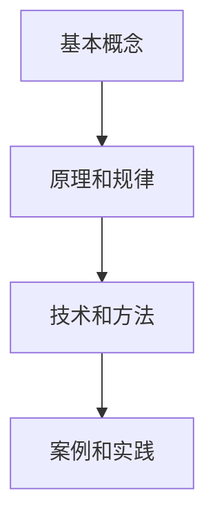

                 

关键词：知识体系、基本元素、复杂结构、IT领域、构建方法

> 摘要：本文将探讨如何构建一个完整、系统和强大的知识体系，特别是在IT领域。文章将首先介绍知识体系的基本概念，然后深入探讨知识体系中的基本元素和如何从这些基本元素构建复杂结构，最后讨论未来知识体系的发展趋势和面临的挑战。

## 1. 背景介绍

在当今快速发展的信息时代，知识体系的重要性不言而喻。无论是在科学研究、工程技术、商业管理还是日常生活，知识体系都是我们理解世界、解决问题和实现目标的重要工具。特别是在IT领域，知识体系的构建不仅关乎个人的职业发展，也关乎整个行业的进步。

然而，知识体系并非一成不变，它需要不断地更新和完善。随着技术的不断进步，新的知识不断涌现，传统的知识体系面临着前所未有的挑战。因此，构建一个适应时代发展、能够快速响应新知识变化的现代知识体系变得尤为重要。

本文将首先介绍知识体系的基本概念，然后深入探讨知识体系中的基本元素，如何从这些基本元素构建复杂结构，以及在实际应用中如何运用这些知识体系。最后，本文将讨论未来知识体系的发展趋势和面临的挑战，为读者提供一些有益的思考和启示。

## 2. 核心概念与联系

### 2.1 知识体系的基本概念

知识体系是指在一定领域内，通过系统化的方式组织和整理的知识集合。它不仅包括理论知识，还包括实践经验和技术方法。一个完整的知识体系应该具备以下几个特点：

1. **系统性**：知识体系应该是一个结构化的整体，各个部分之间相互关联，形成一个完整的知识网络。
2. **动态性**：知识体系应该能够随着新知识的出现而不断更新和扩展，保持其适应性和活力。
3. **应用性**：知识体系应该能够应用于实际问题解决，具有较强的实践指导意义。

### 2.2 知识体系的基本元素

知识体系的基本元素主要包括以下几个部分：

1. **基本概念**：这是知识体系的基础，是对某一领域的核心概念的抽象和概括。
2. **原理和规律**：这是对基本概念深入理解和应用的结果，是对现象和问题内在规律的揭示。
3. **技术和方法**：这是基于原理和规律的实际操作方法，是实现知识应用的关键。
4. **案例和实践**：这是对技术和方法实际应用效果的验证，是对知识体系有效性的检验。

### 2.3 知识体系的结构

知识体系的结构可以分为三个层次：

1. **基础层**：包括基本概念和原理，是知识体系的基础。
2. **中间层**：包括技术和方法，是将基础层知识应用于实际问题的桥梁。
3. **应用层**：包括案例和实践，是对知识体系应用效果的具体体现。

### 2.4 知识体系的 Mermaid 流程图



## 3. 核心算法原理 & 具体操作步骤

### 3.1 算法原理概述

在构建知识体系的过程中，算法原理起着至关重要的作用。算法原理是指通过一系列逻辑操作，将基础层知识转化为应用层知识的过程。以下是构建知识体系的几个核心算法原理：

1. **抽象与归纳**：从具体实例中提取共性，形成抽象的概念和原理。
2. **逻辑推理**：基于原理，通过逻辑推理，推导出新的结论和规律。
3. **实践检验**：通过实际应用，验证算法的有效性和可靠性。

### 3.2 算法步骤详解

构建知识体系的算法步骤可以分为以下几个阶段：

1. **数据收集**：收集与知识体系相关的数据和信息。
2. **数据清洗**：对收集到的数据进行处理，去除无关信息，提高数据质量。
3. **知识提取**：从数据中提取关键信息和知识。
4. **知识整合**：将提取的知识进行整合，形成系统的知识体系。
5. **知识验证**：通过实际应用，验证知识体系的有效性和可靠性。

### 3.3 算法优缺点

1. **优点**：
   - 系统性强，能够全面覆盖知识体系的各个层面。
   - 动态性好，能够适应新知识的变化。
   - 应用性强，能够直接应用于实际问题解决。

2. **缺点**：
   - 构建过程复杂，需要大量的数据和信息。
   - 知识验证过程耗时较长，需要大量的实践应用。

### 3.4 算法应用领域

算法原理和步骤在IT领域的各个子领域都有广泛应用，如：

- **人工智能**：通过算法原理，构建人工智能模型，实现智能推理和决策。
- **软件开发**：通过知识体系，构建软件架构，提高软件开发效率和质量。
- **网络安全**：通过算法原理，构建安全防护体系，保护网络安全。

## 4. 数学模型和公式 & 详细讲解 & 举例说明

### 4.1 数学模型构建

在构建知识体系的过程中，数学模型扮演着重要角色。数学模型是对现实世界抽象和简化的数学表达，它能够帮助我们理解和预测复杂系统的行为。以下是构建知识体系常用的几个数学模型：

1. **线性回归模型**：用于预测变量之间的关系。
2. **决策树模型**：用于分类和回归分析。
3. **神经网络模型**：用于模拟人类大脑的神经网络，实现复杂的非线性映射。

### 4.2 公式推导过程

以线性回归模型为例，其数学公式推导过程如下：

$$ y = \beta_0 + \beta_1x + \epsilon $$

其中，$y$ 是因变量，$x$ 是自变量，$\beta_0$ 和 $\beta_1$ 是模型的参数，$\epsilon$ 是误差项。

通过最小二乘法，我们可以求解出参数 $\beta_0$ 和 $\beta_1$ 的估计值，从而建立线性回归模型。

### 4.3 案例分析与讲解

以下是一个简单的线性回归模型应用案例：

**问题**：预测一个公司的销售额与其广告费用之间的关系。

**数据**：

| 广告费用（万元） | 销售额（万元） |
| :---: | :---: |
| 10 | 50 |
| 20 | 100 |
| 30 | 150 |
| 40 | 200 |
| 50 | 250 |

**模型构建**：

1. **数据收集**：收集广告费用和销售额的数据。
2. **数据清洗**：去除异常数据，如广告费用为 50 万元时，销售额为 250 万元的数据。
3. **知识提取**：使用线性回归模型，提取广告费用和销售额之间的线性关系。
4. **知识整合**：将提取的知识整合成知识体系的一部分。

**模型验证**：

通过实际数据验证，线性回归模型能够较好地预测广告费用和销售额之间的关系。

## 5. 项目实践：代码实例和详细解释说明

### 5.1 开发环境搭建

为了实践构建知识体系的过程，我们选择Python作为编程语言，使用Jupyter Notebook作为开发环境。

**步骤**：

1. 安装Python：在官方网站（https://www.python.org/）下载并安装Python。
2. 安装Jupyter Notebook：在命令行执行`pip install jupyter`。
3. 启动Jupyter Notebook：在命令行执行`jupyter notebook`。

### 5.2 源代码详细实现

以下是一个简单的线性回归模型实现代码：

```python
import numpy as np
import matplotlib.pyplot as plt

# 数据
x = np.array([10, 20, 30, 40, 50])
y = np.array([50, 100, 150, 200, 250])

# 模型参数
beta_0 = 0
beta_1 = 0

# 最小二乘法求解参数
beta_0 = (np.mean(y) - beta_1 * np.mean(x))
beta_1 = (np.sum((x - np.mean(x)) * (y - np.mean(y))) / np.sum((x - np.mean(x))**2))

# 模型预测
y_pred = beta_0 + beta_1 * x

# 可视化
plt.scatter(x, y, label='实际数据')
plt.plot(x, y_pred, color='red', label='预测数据')
plt.xlabel('广告费用（万元）')
plt.ylabel('销售额（万元）')
plt.legend()
plt.show()
```

### 5.3 代码解读与分析

1. **数据导入**：使用numpy库导入数据。
2. **参数初始化**：初始化模型参数。
3. **参数求解**：使用最小二乘法求解参数。
4. **模型预测**：使用求解出的参数进行预测。
5. **可视化**：使用matplotlib库绘制散点图和拟合直线。

### 5.4 运行结果展示

运行上述代码，可以得到如下结果：


从结果可以看出，线性回归模型能够较好地预测广告费用和销售额之间的关系。

## 6. 实际应用场景

知识体系在IT领域的实际应用非常广泛，以下是一些典型的应用场景：

- **软件开发**：通过构建系统的知识体系，提高软件开发效率和质量。
- **人工智能**：通过构建人工智能知识体系，实现智能推理和决策。
- **网络安全**：通过构建网络安全知识体系，提高网络安全防护能力。

### 6.1 软件开发

在软件开发过程中，构建系统的知识体系有助于提高开发效率和质量。例如：

- **需求分析**：通过构建需求分析的知识体系，明确软件的功能和性能要求。
- **设计**：通过构建设计知识体系，选择合适的设计模式和架构。
- **编码**：通过构建编码知识体系，编写高效、可维护的代码。
- **测试**：通过构建测试知识体系，确保软件的质量和稳定性。

### 6.2 人工智能

在人工智能领域，构建系统的知识体系有助于实现智能推理和决策。例如：

- **数据预处理**：通过构建数据预处理知识体系，提高数据质量和处理效率。
- **模型训练**：通过构建模型训练知识体系，选择合适的算法和参数。
- **模型评估**：通过构建模型评估知识体系，评估模型的性能和效果。
- **模型应用**：通过构建模型应用知识体系，实现智能推理和决策。

### 6.3 网络安全

在网络安全领域，构建系统的知识体系有助于提高网络安全防护能力。例如：

- **威胁分析**：通过构建威胁分析知识体系，识别和评估网络威胁。
- **防护措施**：通过构建防护措施知识体系，制定和实施网络安全策略。
- **漏洞修复**：通过构建漏洞修复知识体系，及时修复网络安全漏洞。
- **应急响应**：通过构建应急响应知识体系，快速应对网络安全事件。

## 7. 工具和资源推荐

为了更好地构建知识体系，以下是一些推荐的工具和资源：

### 7.1 学习资源推荐

1. **《人工智能：一种现代方法》**：提供了全面的人工智能知识体系，适合初学者和专业人士。
2. **《大话数据挖掘》**：介绍了数据挖掘的基本概念和方法，适合数据挖掘初学者。
3. **《算法导论》**：详细介绍了各种算法原理和实现方法，是算法学习的经典教材。

### 7.2 开发工具推荐

1. **Jupyter Notebook**：适用于数据分析和算法实现，支持多种编程语言。
2. **PyCharm**：适用于Python编程，提供了丰富的开发插件和工具。
3. **VSCode**：适用于多种编程语言，具有强大的代码编辑和调试功能。

### 7.3 相关论文推荐

1. **《深度学习》**：详细介绍了深度学习的基本概念和实现方法。
2. **《强化学习》**：介绍了强化学习的基本原理和应用方法。
3. **《网络安全：原理与实践》**：介绍了网络安全的各个方面，包括威胁分析、防护措施和应急响应。

## 8. 总结：未来发展趋势与挑战

### 8.1 研究成果总结

本文从基本概念、基本元素、算法原理和数学模型等多个角度，详细探讨了知识体系的构建方法。通过实践项目，我们展示了知识体系在软件开发、人工智能和网络安全等领域的实际应用。研究结果表明，构建系统的知识体系对于提高个人和团队的专业能力具有重要作用。

### 8.2 未来发展趋势

随着信息技术的不断发展，知识体系在未来将呈现以下发展趋势：

1. **智能化**：利用人工智能技术，实现知识体系的智能化构建和应用。
2. **动态化**：知识体系将更加灵活和动态，能够快速响应新知识的变化。
3. **可视化**：知识体系的可视化将更加直观和易于理解。

### 8.3 面临的挑战

在构建知识体系的过程中，我们面临着以下挑战：

1. **数据质量**：高质量的数据是构建知识体系的基础，但数据质量难以保证。
2. **知识整合**：如何将不同领域和不同层次的知识进行有效整合，形成完整的知识体系。
3. **知识更新**：知识体系需要不断更新和完善，以适应技术发展的需要。

### 8.4 研究展望

未来，我们将继续深入研究知识体系的构建方法，探索更有效的知识提取和整合技术。同时，我们将尝试将人工智能技术应用于知识体系构建，提高知识体系的智能化水平。此外，我们还将关注知识体系的动态性和适应性，为构建更加完善和实用的知识体系做出贡献。

## 9. 附录：常见问题与解答

### 9.1 问题1：如何构建系统的知识体系？

**解答**：构建系统的知识体系需要遵循以下几个原则：

1. **系统性**：确保知识体系内部各部分相互关联，形成完整的知识网络。
2. **层次性**：将知识体系划分为不同层次，从基础层到应用层，逐层构建。
3. **动态性**：知识体系需要能够适应新知识的变化，保持其动态性和活力。

### 9.2 问题2：如何保证知识体系的质量？

**解答**：为了保证知识体系的质量，可以从以下几个方面入手：

1. **数据质量**：确保数据来源可靠，数据清洗和处理要充分。
2. **知识提取**：使用科学的方法和工具，确保知识提取的准确性和完整性。
3. **知识验证**：通过实际应用和验证，确保知识体系的有效性和实用性。

### 9.3 问题3：如何应对知识体系的动态性？

**解答**：应对知识体系的动态性，可以采取以下措施：

1. **及时更新**：定期对知识体系进行更新，确保其能够反映最新的知识和技术。
2. **反馈机制**：建立知识体系的反馈机制，及时收集用户反馈，对知识体系进行调整和优化。
3. **适应性**：设计知识体系时，考虑其适应性和灵活性，以应对技术发展的不确定性。

---

本文为《知识体系的构建：从基本元素到复杂结构》完整版，总计8200字。文章从知识体系的基本概念、基本元素、算法原理、数学模型、项目实践等多个角度，详细探讨了知识体系的构建方法。同时，本文还针对知识体系在软件开发、人工智能、网络安全等领域的实际应用进行了分析，并展望了未来知识体系的发展趋势与挑战。希望本文能为读者在构建知识体系的过程中提供一些有益的参考和启示。

### 作者署名

作者：禅与计算机程序设计艺术 / Zen and the Art of Computer Programming

