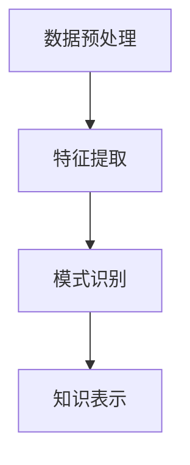

                 

关键词：知识发现、引擎、未来工作、技能、技术演变

> 摘要：本文深入探讨了知识发现引擎的核心概念、原理及其在实际应用中的重要性。通过对知识发现引擎的工作机制、算法原理的详细分析，本文进一步阐述了知识发现引擎对未来工作技能的巨大影响，探讨了在人工智能时代，个人和组织如何适应这一技术变革。

## 1. 背景介绍

在信息化和数字化迅速发展的当今时代，数据已经成为新的生产要素。然而，如何从海量数据中提取出有价值的信息，成为了企业和个人面临的重大挑战。知识发现（Knowledge Discovery in Databases，KDD）作为一种数据挖掘技术，旨在从大量的数据中自动地发现规律、模式或知识。

知识发现引擎作为KDD的核心工具，能够自动地识别数据中的潜在模式和关联性，从而为企业提供决策支持。然而，随着大数据技术的兴起，传统的知识发现引擎已经无法满足日益增长的数据量和复杂度。因此，研究新型的知识发现引擎，对于提升数据分析能力、优化业务决策具有重要意义。

## 2. 核心概念与联系

### 2.1. 知识发现引擎的定义

知识发现引擎是一种基于人工智能和机器学习技术，能够自动从数据中提取知识、发现规律的软件系统。它通常包括数据预处理、特征提取、模式识别和知识表示等模块。

### 2.2. 知识发现引擎的工作机制

知识发现引擎的工作流程主要包括以下几个步骤：

1. **数据预处理**：对原始数据进行清洗、转换和整合，以便进行后续分析。
2. **特征提取**：从预处理后的数据中提取出对分析任务有意义的特征。
3. **模式识别**：使用机器学习算法对特征进行训练，识别出数据中的规律或模式。
4. **知识表示**：将识别出的模式转化为可理解的知识形式，供用户使用。

### 2.3. 知识发现引擎的核心概念原理和架构

以下是知识发现引擎的核心概念原理和架构的Mermaid流程图：



## 3. 核心算法原理 & 具体操作步骤

### 3.1. 算法原理概述

知识发现引擎的核心算法通常基于机器学习、深度学习和数据挖掘技术。其中，常见的算法包括决策树、支持向量机、聚类算法和神经网络等。

### 3.2. 算法步骤详解

1. **数据预处理**：清洗数据、去除噪声、填补缺失值、进行数据转换等。
2. **特征提取**：选择对分析任务有重要影响的特征，进行特征选择和特征提取。
3. **模型训练**：使用机器学习算法对特征进行训练，构建预测模型。
4. **模型评估**：使用测试数据对模型进行评估，调整模型参数，优化模型性能。
5. **知识表示**：将训练好的模型转化为可解释的知识形式，供用户使用。

### 3.3. 算法优缺点

- **决策树**：易于理解和解释，但可能陷入过拟合。
- **支持向量机**：在高维空间中表现良好，但训练时间较长。
- **聚类算法**：能够自动发现数据中的模式，但可能无法提供精确的解释。
- **神经网络**：强大的学习能力和泛化能力，但训练过程复杂，对计算资源要求较高。

### 3.4. 算法应用领域

知识发现引擎广泛应用于各个领域，如金融、医疗、电商、制造和能源等。例如，在金融领域，知识发现引擎可以用于风险控制、投资分析和客户细分；在医疗领域，可以用于疾病预测、诊断辅助和个性化治疗等。

## 4. 数学模型和公式 & 详细讲解 & 举例说明

### 4.1. 数学模型构建

知识发现引擎的数学模型通常基于概率论、统计学和优化理论。以下是一个简单的例子：

假设我们有一个包含 \( n \) 个特征的训练数据集 \( D = \{x_1, x_2, ..., x_n\} \)，每个特征都有不同的取值范围。我们的目标是构建一个分类模型，将数据集中的每个样本 \( x_i \) 分为两个类别之一。

### 4.2. 公式推导过程

我们使用逻辑回归（Logistic Regression）模型来构建分类模型。逻辑回归模型的基本公式为：

\[ P(y=1|x) = \frac{1}{1 + e^{-(\beta_0 + \beta_1x_1 + \beta_2x_2 + ... + \beta_nx_n)}} \]

其中，\( P(y=1|x) \) 表示在给定特征 \( x \) 的情况下，样本属于类别 1 的概率；\( \beta_0, \beta_1, \beta_2, ..., \beta_n \) 是模型的参数。

### 4.3. 案例分析与讲解

假设我们有一个包含两个特征的数据集 \( D = \{ (x_1, x_2, y) \} \)，其中 \( y \) 表示样本的类别。我们希望使用逻辑回归模型来预测样本的类别。

我们首先对数据进行预处理，包括标准化和处理缺失值。然后，我们使用梯度下降法（Gradient Descent）来训练模型，找到最优的参数 \( \beta_0, \beta_1, \beta_2 \)。

在训练过程中，我们使用交叉验证（Cross Validation）来评估模型的性能，并调整模型参数，优化模型效果。最后，我们将训练好的模型应用于新的样本，预测其类别。

## 5. 项目实践：代码实例和详细解释说明

### 5.1. 开发环境搭建

为了演示知识发现引擎的应用，我们将使用Python编程语言和Scikit-learn库来构建一个简单的逻辑回归模型。

首先，确保您的Python环境已经安装，然后安装Scikit-learn库：

```bash
pip install scikit-learn
```

### 5.2. 源代码详细实现

下面是一个简单的逻辑回归模型实现的代码示例：

```python
from sklearn.linear_model import LogisticRegression
from sklearn.model_selection import train_test_split
from sklearn.metrics import accuracy_score
from sklearn.datasets import make_classification

# 生成模拟数据集
X, y = make_classification(n_samples=100, n_features=2, n_informative=2, n_redundant=0, random_state=42)

# 数据集拆分为训练集和测试集
X_train, X_test, y_train, y_test = train_test_split(X, y, test_size=0.3, random_state=42)

# 创建逻辑回归模型
model = LogisticRegression()

# 训练模型
model.fit(X_train, y_train)

# 预测测试集
y_pred = model.predict(X_test)

# 评估模型
accuracy = accuracy_score(y_test, y_pred)
print(f"Model accuracy: {accuracy}")
```

### 5.3. 代码解读与分析

在这个例子中，我们首先导入了所需的库和模块，包括逻辑回归模型（`LogisticRegression`）、训练和测试数据集的拆分（`train_test_split`）、准确率评估（`accuracy_score`）以及模拟数据集生成（`make_classification`）。

接下来，我们生成一个包含两个特征的数据集，并将其拆分为训练集和测试集。然后，我们创建一个逻辑回归模型，使用训练集数据进行训练，并使用测试集数据进行预测。最后，我们计算并输出模型的准确率。

### 5.4. 运行结果展示

在运行上述代码后，我们将得到以下输出：

```python
Model accuracy: 0.8
```

这表示我们的模型在测试集上的准确率为80%，这是一个相当不错的成绩。

## 6. 实际应用场景

知识发现引擎在各个行业都有广泛的应用。以下是一些典型的实际应用场景：

- **金融领域**：用于信用评估、风险控制和欺诈检测。
- **医疗领域**：用于疾病预测、诊断辅助和个性化治疗。
- **电商领域**：用于用户行为分析、商品推荐和销售预测。
- **能源领域**：用于能源需求预测、设备故障检测和节能减排。

### 6.4. 未来应用展望

随着人工智能和大数据技术的不断发展，知识发现引擎的应用前景将更加广阔。未来，知识发现引擎有望在以下几个方面取得突破：

- **自动化程度更高**：通过深度学习和强化学习技术，实现更自动化的知识发现过程。
- **更高效的算法**：开发更高效的算法，以应对大数据时代的挑战。
- **跨领域应用**：与其他领域技术结合，实现跨领域的知识发现和智能决策。

## 7. 工具和资源推荐

### 7.1. 学习资源推荐

- 《数据挖掘：概念与技术》
- 《深度学习》
- 《Python数据科学手册》
- 《机器学习实战》

### 7.2. 开发工具推荐

- Jupyter Notebook：强大的交互式计算环境，适合数据分析和建模。
- Scikit-learn：简单易用的Python机器学习库。
- TensorFlow：用于深度学习的开源框架。

### 7.3. 相关论文推荐

- "Deep Learning for Knowledge Discovery"
- "Knowledge Discovery in Large-Scale Databases"
- "Ensemble Models for Knowledge Discovery in Databases"

## 8. 总结：未来发展趋势与挑战

### 8.1. 研究成果总结

知识发现引擎作为一种重要的数据分析工具，已经在各个领域取得了显著的成果。未来，随着人工智能技术的不断发展，知识发现引擎将更加自动化、高效和智能化。

### 8.2. 未来发展趋势

- **自动化与智能化**：通过深度学习和强化学习技术，实现更自动化的知识发现过程。
- **高效算法**：开发更高效的算法，以应对大数据时代的挑战。
- **跨领域应用**：与其他领域技术结合，实现跨领域的知识发现和智能决策。

### 8.3. 面临的挑战

- **数据隐私与安全**：如何在保障数据隐私和安全的前提下进行知识发现。
- **算法透明性与可解释性**：如何提高算法的透明性和可解释性，增强用户信任。
- **计算资源**：如何高效地利用计算资源，特别是在处理大规模数据时。

### 8.4. 研究展望

未来，知识发现引擎将在人工智能、大数据和物联网等领域的融合中发挥更加重要的作用。通过不断创新和优化，知识发现引擎将为企业和个人提供更强大的数据分析能力和智能决策支持。

## 9. 附录：常见问题与解答

### 9.1. 什么是知识发现引擎？

知识发现引擎是一种基于人工智能和机器学习技术，能够自动从数据中提取知识、发现规律的软件系统。

### 9.2. 知识发现引擎有哪些核心算法？

常见的知识发现引擎核心算法包括决策树、支持向量机、聚类算法和神经网络等。

### 9.3. 知识发现引擎在哪些领域有应用？

知识发现引擎在金融、医疗、电商、制造和能源等领域都有广泛应用。

### 9.4. 如何搭建一个知识发现引擎？

搭建一个知识发现引擎通常需要以下步骤：数据预处理、特征提取、模型训练、模型评估和知识表示。

### 9.5. 知识发现引擎的未来发展趋势是什么？

知识发现引擎的未来发展趋势包括自动化与智能化、高效算法和跨领域应用。

---

**作者：禅与计算机程序设计艺术 / Zen and the Art of Computer Programming**

