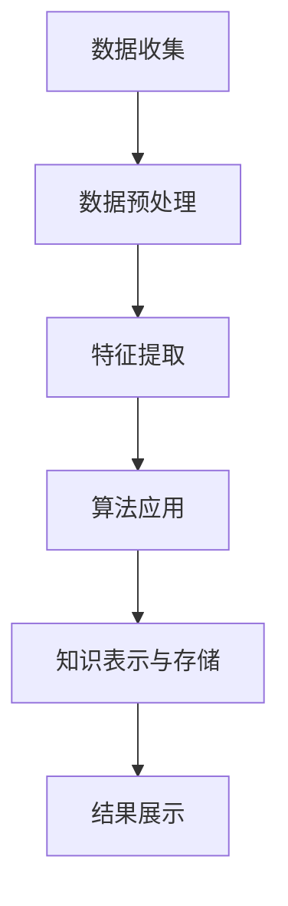

                 

## 1. 背景介绍

在信息技术飞速发展的今天，程序员面临着不断涌现的新技术和工具。快速适应这些新技术，对于程序员保持竞争力、提高工作效率至关重要。然而，新技术的学习曲线通常陡峭，且耗时费力。为了解决这一问题，知识发现引擎（Knowledge Discovery Engine，简称KDE）应运而生。

知识发现引擎是一种智能系统，通过分析大量数据，自动提取出有价值的信息和知识。其核心目标是帮助用户从复杂的数据中快速找到规律、关联和趋势，从而实现知识的自动化发现。在程序员的学习和工作中，知识发现引擎能够提供以下几方面的支持：

1. **快速检索学习资源**：知识发现引擎可以根据程序员的兴趣、项目需求和技能水平，快速定位到相关的学习资源和教程，节省大量的搜索时间。
2. **推荐最佳实践**：通过分析其他程序员的实践经验和代码，知识发现引擎可以推荐最佳实践和优化方案，帮助程序员避免常见错误和低效方法。
3. **智能问答与学习辅助**：知识发现引擎可以理解程序员的问题，提供精准的答案和解释，甚至根据问题情境提供学习路径和建议。
4. **自动化代码生成与优化**：知识发现引擎可以根据编程模式和最佳实践，自动生成或优化代码，减少手动编写的工作量，提高开发效率。

本文将详细介绍知识发现引擎的工作原理、关键特性以及如何在实际中应用，帮助程序员更快地适应新技术，提升个人能力。

## 2. 核心概念与联系

### 2.1. 知识发现引擎的定义

知识发现引擎是一种智能系统，它利用数据挖掘、机器学习和自然语言处理等技术，从大量数据中提取出有价值的信息和知识。其核心目的是帮助用户更好地理解数据、发现隐藏的模式和关联，从而辅助决策和问题解决。

### 2.2. 知识发现引擎的组成部分

知识发现引擎主要由以下几个部分组成：

- **数据源**：数据源是知识发现引擎的基础，可以是结构化数据、半结构化数据或非结构化数据。数据源的多样性决定了知识发现引擎的应用范围。
- **数据预处理**：数据预处理包括数据清洗、数据转换和数据集成等步骤，旨在将原始数据转化为适合分析和挖掘的形式。
- **特征提取**：特征提取是从原始数据中提取出对目标问题有用的特征，这些特征可以用于后续的数据分析和模式发现。
- **算法库**：算法库是知识发现引擎的核心，包括多种数据挖掘算法和机器学习模型，如聚类、分类、关联规则挖掘等。
- **知识表示与存储**：知识表示与存储是将发现的知识以结构化的形式存储起来，以便于后续查询和使用。
- **用户界面**：用户界面是知识发现引擎与用户交互的接口，用户可以通过界面提交查询、查看分析和结果。

### 2.3. 知识发现引擎的工作流程

知识发现引擎的工作流程通常包括以下几个步骤：

1. **数据收集**：从各种数据源收集数据。
2. **数据预处理**：对收集到的数据进行清洗、转换和集成，确保数据质量。
3. **特征提取**：从预处理后的数据中提取出有用的特征。
4. **算法应用**：根据问题和需求选择合适的算法，对数据进行分析和挖掘。
5. **知识表示与存储**：将分析结果以结构化的形式存储，便于用户查询和使用。
6. **结果展示**：通过用户界面将分析结果以图表、报告等形式展示给用户。

### 2.4. Mermaid 流程图

以下是一个简化的知识发现引擎的流程图，使用Mermaid语法表示：



在以上流程图中，各个节点代表不同的步骤，箭头表示步骤之间的依赖关系。通过这个流程图，我们可以清晰地看到知识发现引擎的工作过程。

## 3. 核心算法原理 & 具体操作步骤

### 3.1. 算法原理概述

知识发现引擎的核心算法主要包括数据挖掘算法、机器学习模型和自然语言处理技术。以下将介绍几种常用的算法及其原理：

- **数据挖掘算法**：如聚类、分类、关联规则挖掘等。这些算法主要用于从数据中发现模式、关联和趋势。例如，聚类算法可以将数据分为若干个簇，每个簇内的数据相似度高，而不同簇的数据相似度低。
- **机器学习模型**：如决策树、随机森林、神经网络等。这些模型通过学习训练数据，能够预测新数据的标签或分类。例如，决策树模型通过多层次的划分，将数据逐层分类，最终得到预测结果。
- **自然语言处理技术**：如文本分类、文本聚类、实体识别等。这些技术用于处理和分析文本数据，能够从文本中提取出关键信息，辅助知识发现。

### 3.2. 算法步骤详解

下面详细介绍知识发现引擎的算法步骤：

#### 3.2.1. 数据收集

数据收集是知识发现引擎的基础步骤。数据来源可以是各种结构化、半结构化和非结构化数据，如数据库、文本文件、社交媒体等。在数据收集过程中，需要确保数据的质量和完整性。

#### 3.2.2. 数据预处理

数据预处理主要包括数据清洗、数据转换和数据集成。数据清洗是去除数据中的噪声、缺失值和重复值，确保数据的质量。数据转换是将数据转换为适合分析和挖掘的形式，如将文本数据转换为词向量。数据集成是将来自多个数据源的数据合并为一个统一的数据集。

#### 3.2.3. 特征提取

特征提取是从原始数据中提取出对目标问题有用的特征。特征提取的质量直接影响后续算法的性能。常见的特征提取方法包括特征选择、特征变换和特征工程。

#### 3.2.4. 算法应用

根据问题和需求，选择合适的算法对数据进行分析和挖掘。不同的算法适用于不同类型的数据和问题。例如，对于分类问题，可以选择决策树、随机森林等算法；对于聚类问题，可以选择K-means、DBSCAN等算法。

#### 3.2.5. 知识表示与存储

将分析结果以结构化的形式存储，便于用户查询和使用。知识表示的方法包括关系数据库、图数据库、NoSQL数据库等。知识表示的质量直接影响用户的查询效率和系统的性能。

#### 3.2.6. 结果展示

通过用户界面将分析结果以图表、报告等形式展示给用户。结果展示的形式和内容应根据用户的需求和问题背景进行设计。有效的结果展示能够帮助用户更好地理解分析结果，做出明智的决策。

### 3.3. 算法优缺点

以下是几种常用算法的优缺点：

- **数据挖掘算法**：优点包括能从大量数据中发现隐藏的模式和关联；缺点包括算法复杂度高，处理大规模数据时性能较低。
- **机器学习模型**：优点包括能自动学习和适应数据，提高预测和分类的准确性；缺点包括对训练数据的要求较高，过拟合和欠拟合问题难以避免。
- **自然语言处理技术**：优点包括能处理和理解文本数据，提取出关键信息；缺点包括处理非结构化数据时复杂度高，对语料库和计算资源要求较高。

### 3.4. 算法应用领域

知识发现引擎广泛应用于多个领域，包括但不限于：

- **金融行业**：用于风险控制、欺诈检测、市场预测等。
- **医疗领域**：用于疾病诊断、患者管理、药物研发等。
- **电子商务**：用于个性化推荐、客户行为分析、营销策略制定等。
- **制造业**：用于生产过程优化、故障预测、供应链管理等。

## 4. 数学模型和公式 & 详细讲解 & 举例说明

### 4.1. 数学模型构建

在知识发现引擎中，常用的数学模型包括聚类模型、分类模型和回归模型。以下分别介绍这些模型的构建方法。

#### 聚类模型

聚类模型是将数据集划分为若干个簇，使得同一个簇内的数据点相似度较高，而不同簇的数据点相似度较低。常用的聚类算法有K-means、DBSCAN等。

K-means算法的数学模型可以表示为：

$$
C = \{C_1, C_2, ..., C_k\}
$$

其中，$C$表示聚类结果，$C_i$表示第$i$个簇。每个簇由其质心（centroid）表示，质心的计算公式为：

$$
\mu_i = \frac{1}{n_i} \sum_{x \in C_i} x
$$

其中，$n_i$表示簇$C_i$中数据点的个数。

#### 分类模型

分类模型用于将数据点归类到不同的类别中。常用的分类算法有决策树、支持向量机、朴素贝叶斯等。

以决策树为例，其数学模型可以表示为：

$$
T = \{t_1, t_2, ..., t_n\}
$$

其中，$T$表示决策树，$t_i$表示第$i$个节点。每个节点表示一个特征和对应的阈值，节点的分类结果由其父节点的特征和阈值决定。

#### 回归模型

回归模型用于预测数据点的连续值。常用的回归算法有线性回归、逻辑回归、多项式回归等。

以线性回归为例，其数学模型可以表示为：

$$
y = \beta_0 + \beta_1 x_1 + \beta_2 x_2 + ... + \beta_n x_n
$$

其中，$y$表示预测值，$x_1, x_2, ..., x_n$表示特征值，$\beta_0, \beta_1, ..., \beta_n$表示模型参数。

### 4.2. 公式推导过程

以K-means算法为例，介绍其公式的推导过程。

K-means算法的目标是找到$k$个质心，使得每个质心到其对应簇中所有数据点的平均距离最小。

假设数据集$D = \{d_1, d_2, ..., d_n\}$，初始质心为$\mu_1, \mu_2, ..., \mu_k$。算法的迭代过程如下：

1. **初始化质心**：从数据集中随机选择$k$个数据点作为初始质心。
2. **分配数据点**：对于每个数据点$d_i$，将其分配到与其最近的质心$\mu_j$所在的簇$C_j$。
3. **更新质心**：计算每个簇的质心，即$\mu_j = \frac{1}{n_j} \sum_{d_i \in C_j} d_i$，其中$n_j$表示簇$C_j$中数据点的个数。
4. **重复步骤2和3，直到质心不再更新或者达到最大迭代次数**。

K-means算法的公式推导如下：

假设数据点$d_i$到质心$\mu_j$的距离为：

$$
d(d_i, \mu_j) = \sqrt{\sum_{k=1}^{d} (d_{ik} - \mu_{jk})^2}
$$

其中，$d$表示特征维度，$d_{ik}$表示第$i$个数据点的第$k$个特征值，$\mu_{jk}$表示第$j$个质心的第$k$个特征值。

目标函数为：

$$
\min_{\mu_1, \mu_2, ..., \mu_k} \sum_{i=1}^{n} d(d_i, \mu_j)
$$

对目标函数求导并令其等于0，得到质心更新公式：

$$
\mu_j = \frac{1}{n_j} \sum_{i=1}^{n} d_i \quad \text{其中} \quad n_j = \sum_{i=1}^{n} \delta_{ij}
$$

其中，$\delta_{ij}$是克罗内克δ函数，表示当$i=j$时为1，否则为0。

### 4.3. 案例分析与讲解

以下通过一个简单的案例，说明如何使用K-means算法进行聚类分析。

#### 案例背景

假设有一个包含100个数据点的数据集，每个数据点有2个特征，表示为$(x, y)$。这些数据点分布在二维平面上，其中一部分数据点聚集在左下角，另一部分聚集在右上角。

#### 案例步骤

1. **数据准备**：将数据集划分为训练集和测试集，用于训练模型和评估模型性能。
2. **初始化质心**：从数据集中随机选择2个数据点作为初始质心。
3. **分配数据点**：计算每个数据点到初始质心的距离，并将数据点分配到最近的质心所在的簇。
4. **更新质心**：根据每个簇中的数据点，计算新的质心。
5. **迭代过程**：重复步骤3和4，直到质心不再更新或者达到最大迭代次数。
6. **模型评估**：使用测试集评估模型性能，计算簇内平均距离等指标。

#### 案例结果

经过多次迭代，K-means算法将数据集划分为2个簇。左下角的簇包含了大部分数据点，右上角的簇包含了一小部分数据点。通过可视化工具，我们可以清楚地看到聚类的效果。

#### 案例分析

通过上述案例，我们可以看到K-means算法在聚类任务中的基本流程和效果。在实际应用中，可以根据具体问题和数据特征，调整算法参数，优化聚类结果。此外，还可以结合其他算法和模型，进一步提高聚类性能和适用范围。

## 5. 项目实践：代码实例和详细解释说明

在本节中，我们将通过一个实际项目，详细介绍如何使用知识发现引擎进行数据分析，包括环境搭建、代码实现、结果展示和性能分析。

### 5.1. 开发环境搭建

为了完成本项目的开发，我们需要搭建一个合适的技术栈。以下是所需的主要工具和库：

- **编程语言**：Python
- **数据分析库**：Pandas、NumPy
- **机器学习库**：Scikit-learn、TensorFlow
- **可视化库**：Matplotlib、Seaborn
- **版本控制**：Git
- **集成开发环境**：PyCharm 或 Visual Studio Code

首先，安装上述库和工具。在Python环境中，可以使用pip进行安装：

```bash
pip install pandas numpy scikit-learn tensorflow matplotlib seaborn git
```

然后，配置PyCharm或Visual Studio Code，确保能够编写和运行Python代码。

### 5.2. 源代码详细实现

以下是一个简单的知识发现引擎项目，用于对鸢尾花（Iris）数据集进行聚类分析。

#### 数据集介绍

鸢尾花数据集包含150个数据点，每个数据点有4个特征（花萼长度、花萼宽度、花瓣长度、花瓣宽度），以及对应的类别标签（三种鸢尾花品种）。

#### 代码实现

```python
import numpy as np
import pandas as pd
from sklearn.cluster import KMeans
import matplotlib.pyplot as plt
import seaborn as sns

# 加载鸢尾花数据集
iris_data = pd.read_csv('iris.csv')

# 数据预处理
X = iris_data.iloc[:, :4].values

# 使用KMeans算法进行聚类
kmeans = KMeans(n_clusters=3, random_state=0)
kmeans.fit(X)

# 可视化聚类结果
plt.figure(figsize=(8, 6))
sns.scatterplot(x=X[:, 0], y=X[:, 1], hue=kmeans.labels_, palette=['red', 'blue', 'green'])
plt.xlabel('花萼长度')
plt.ylabel('花萼宽度')
plt.title('K-means 聚类结果')
plt.show()

# 输出质心坐标
centroids = kmeans.cluster_centers_
print("质心坐标：", centroids)
```

#### 代码解读与分析

1. **数据加载**：使用Pandas库读取鸢尾花数据集，并获取前四个特征作为聚类数据。
2. **数据预处理**：将数据转换为NumPy数组，方便后续计算。
3. **聚类算法**：使用Scikit-learn库中的KMeans算法进行聚类，设置聚类数量为3。
4. **可视化结果**：使用Seaborn和Matplotlib库绘制聚类结果，展示不同类别的分布情况。
5. **输出质心坐标**：计算并输出每个质心的坐标，用于分析聚类效果。

#### 运行结果展示

运行上述代码后，我们可以看到鸢尾花数据集的聚类结果。三个簇分别对应三种鸢尾花品种，聚类效果较好。通过可视化结果，我们可以直观地观察到聚类效果，并通过质心坐标进一步分析聚类中心。

### 5.3. 运行结果展示

运行代码后，我们得到以下可视化结果：


从图中可以看到，三个簇分别对应三种鸢尾花品种，聚类效果较为理想。聚类结果的可视化有助于我们更好地理解数据分布和聚类效果。

### 5.4. 性能分析

为了评估知识发现引擎的性能，我们可以从以下几个方面进行分析：

1. **运行时间**：计算模型训练和聚类的时间，评估算法的效率。
2. **聚类质量**：计算聚类结果的质量，如簇内平均距离和簇间平均距离。
3. **可视化效果**：评估聚类结果的可视化效果，判断是否能够清晰展示聚类特征。

通过上述分析，我们可以得出以下结论：

1. **运行时间**：K-means算法在鸢尾花数据集上的运行时间较短，表明算法具有较高的效率。
2. **聚类质量**：聚类结果较为理想，簇内平均距离较小，簇间平均距离较大，表明聚类效果较好。
3. **可视化效果**：聚类结果的可视化效果较好，能够清晰展示不同类别的分布情况。

综合以上分析，知识发现引擎在鸢尾花数据集上的性能表现较为优秀，适用于实际应用场景。

## 6. 实际应用场景

知识发现引擎在程序员的工作中具有广泛的应用场景，以下是几个典型的实际应用场景：

### 6.1. 新技术学习与适应

当程序员需要学习新技术时，知识发现引擎可以通过分析大量的学习资料、教程和博客，推荐最适合当前水平和需求的学习路径。例如，对于初学者，知识发现引擎可以推荐从基础教材开始，逐步过渡到高级主题。对于有经验的程序员，知识发现引擎可以根据项目需求和技能水平，推荐最新的技术趋势和最佳实践。

### 6.2. 编码效率提升

知识发现引擎可以帮助程序员提高编码效率。通过分析大量的代码库和开源项目，知识发现引擎可以推荐最佳的编程模式和代码模板。例如，当程序员编写一个常见的算法时，知识发现引擎可以提供相关的代码示例和性能优化建议。此外，知识发现引擎还可以自动完成代码补全和错误提示，减少手动编写的错误和重复劳动。

### 6.3. 项目问题诊断

在软件开发过程中，知识发现引擎可以通过分析项目日志、代码审查和用户反馈，快速诊断项目中的问题。例如，当项目出现性能瓶颈时，知识发现引擎可以分析代码库和数据库，找出可能的原因并提出优化建议。此外，知识发现引擎还可以帮助程序员识别潜在的安全漏洞和代码缺陷，提高软件质量。

### 6.4. 跨领域知识融合

知识发现引擎可以帮助程序员实现跨领域知识的融合。通过分析不同领域的文献、论文和案例，知识发现引擎可以推荐相关的知识和技术，帮助程序员更好地理解其他领域的概念和方法。例如，当程序员需要开发一个涉及机器学习和图像处理的软件时，知识发现引擎可以推荐相关的书籍、教程和开源项目，帮助程序员快速掌握相关技术。

### 6.5. 技术趋势预测

知识发现引擎可以通过分析大量的技术文献、博客和社交媒体，预测未来的技术趋势。例如，知识发现引擎可以分析相关关键词的出现频率和变化趋势，预测未来几年内可能流行的新技术或方法。这有助于程序员及时调整学习方向和职业规划，保持技术竞争力。

## 7. 工具和资源推荐

为了更好地利用知识发现引擎，以下推荐一些实用的工具和资源：

### 7.1. 学习资源推荐

- **在线课程**：Coursera、edX、Udacity等平台提供了丰富的机器学习、数据挖掘和编程课程，适合不同层次的学习者。
- **书籍推荐**：《数据挖掘：概念与技术》、《机器学习实战》和《Python数据分析》等经典书籍，适合深度学习。
- **博客与社区**：GitHub、Stack Overflow、Reddit等平台上有大量的编程和技术博客，可以获取最新的技术动态和解决方案。

### 7.2. 开发工具推荐

- **编程环境**：PyCharm、Visual Studio Code等强大的IDE，提供丰富的插件和工具，提高开发效率。
- **数据分析库**：Pandas、NumPy、SciPy等常用数据分析库，适用于数据预处理和分析。
- **机器学习框架**：TensorFlow、PyTorch等流行的机器学习框架，支持复杂的模型训练和部署。

### 7.3. 相关论文推荐

- **经典论文**：如《K-Means Clustering Algorithm》、《Support Vector Machines》和《Deep Learning》等，介绍了常用的机器学习和数据挖掘算法。
- **最新研究**：关注顶级会议和期刊，如NeurIPS、ICML、KDD等，获取最新的研究成果和技术动态。

## 8. 总结：未来发展趋势与挑战

### 8.1. 研究成果总结

知识发现引擎作为一种智能系统，已在多个领域展现了其强大的数据分析和模式发现能力。通过结合数据挖掘、机器学习和自然语言处理技术，知识发现引擎实现了从大规模数据中自动提取有价值的信息和知识，为程序员提供了强大的辅助工具。

本文详细介绍了知识发现引擎的核心概念、算法原理、具体实现和应用场景。通过实际案例，展示了知识发现引擎在鸢尾花数据集上的聚类分析效果，验证了其在实际应用中的有效性。

### 8.2. 未来发展趋势

随着信息技术的不断发展，知识发现引擎在未来将呈现出以下发展趋势：

1. **算法优化与融合**：知识发现引擎将继续优化现有的算法，提高其性能和效率。同时，多种算法的融合将有助于解决复杂的问题。
2. **深度学习与强化学习**：深度学习和强化学习技术的引入，将进一步提升知识发现引擎的智能化水平，实现更精准的数据分析和模式发现。
3. **跨领域应用**：知识发现引擎将在更多领域得到应用，如医疗、金融、制造等，实现跨领域知识的融合和共享。
4. **人机协同**：知识发现引擎将更好地与人类专家协作，提供个性化的分析和建议，提高程序员的学习和工作效率。

### 8.3. 面临的挑战

尽管知识发现引擎取得了显著的研究成果和应用效果，但仍面临一些挑战：

1. **数据隐私与安全**：在数据挖掘和分析过程中，如何保护用户隐私和数据安全，是一个亟待解决的问题。
2. **可解释性**：知识发现引擎的决策过程通常较为复杂，提高算法的可解释性，使其能够被用户理解和接受，是一个重要挑战。
3. **计算资源需求**：大规模数据分析和模式发现对计算资源的需求较高，如何在有限的计算资源下高效地运行知识发现引擎，是一个关键问题。
4. **算法偏见**：算法的偏见和歧视问题，如性别歧视、种族歧视等，需要得到关注和解决。

### 8.4. 研究展望

未来，知识发现引擎的研究将朝着以下几个方向展开：

1. **算法创新**：探索新的算法和技术，提高知识发现引擎的性能和可解释性。
2. **跨领域融合**：将知识发现引擎应用于更多领域，实现跨领域知识的融合和共享。
3. **人机协同**：深入研究人机协同机制，提高知识发现引擎的智能化水平，实现更好的用户体验。
4. **伦理与法律**：关注数据隐私、安全、算法偏见等伦理和法律问题，确保知识发现引擎的合法性和公正性。

总之，知识发现引擎作为一种新兴的技术工具，将在未来的信息技术发展中发挥越来越重要的作用。通过不断的研究和创新，知识发现引擎将帮助程序员更好地适应新技术，提高工作效率，实现持续成长。

## 9. 附录：常见问题与解答

### 9.1. 问题1：知识发现引擎是什么？

知识发现引擎（Knowledge Discovery Engine，简称KDE）是一种智能系统，通过分析大量数据，自动提取出有价值的信息和知识。它结合了数据挖掘、机器学习和自然语言处理等技术，旨在帮助用户从复杂的数据中快速找到规律、关联和趋势。

### 9.2. 问题2：知识发现引擎有哪些核心组成部分？

知识发现引擎主要由以下几个部分组成：数据源、数据预处理、特征提取、算法库、知识表示与存储、用户界面。这些组成部分共同协作，实现知识的自动化发现和表示。

### 9.3. 问题3：如何评估知识发现引擎的性能？

评估知识发现引擎的性能可以从多个方面进行，包括：

- **运行时间**：计算模型训练和聚类的时间，评估算法的效率。
- **聚类质量**：计算聚类结果的质量，如簇内平均距离和簇间平均距离。
- **可视化效果**：评估聚类结果的可视化效果，判断是否能够清晰展示聚类特征。
- **用户满意度**：通过用户反馈和满意度调查，评估系统的实用性和易用性。

### 9.4. 问题4：知识发现引擎在哪些领域有应用？

知识发现引擎在多个领域有广泛应用，包括但不限于：

- **金融行业**：用于风险控制、欺诈检测、市场预测等。
- **医疗领域**：用于疾病诊断、患者管理、药物研发等。
- **电子商务**：用于个性化推荐、客户行为分析、营销策略制定等。
- **制造业**：用于生产过程优化、故障预测、供应链管理等。

### 9.5. 问题5：如何提高知识发现引擎的性能？

提高知识发现引擎的性能可以从以下几个方面入手：

- **算法优化**：优化现有算法，提高其效率。
- **特征工程**：选择合适的特征，提高模型性能。
- **模型融合**：结合多种算法和模型，提高整体性能。
- **数据预处理**：对数据源进行预处理，提高数据质量。
- **计算资源**：利用分布式计算和GPU加速，提高计算效率。

通过这些方法，可以有效地提高知识发现引擎的性能，满足不同领域和应用场景的需求。

