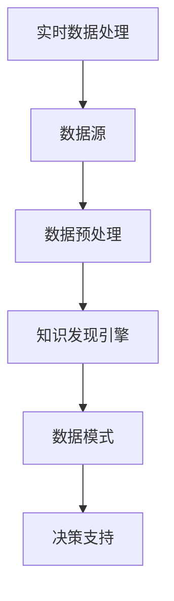

                 

关键词：知识发现引擎、实时数据处理、技术、算法、应用场景、未来展望

> 摘要：本文将深入探讨知识发现引擎在实时数据处理技术方面的应用。我们将详细介绍核心概念、算法原理、数学模型、实践案例以及未来发展趋势，旨在为读者提供一个全面的技术指南。

## 1. 背景介绍

随着信息技术的飞速发展，大数据和实时数据流处理已经成为当今世界的重要领域。知识发现引擎（Knowledge Discovery Engine，KDE）作为数据挖掘和分析的重要工具，在处理海量数据、提取有价值信息方面发挥着关键作用。然而，传统的知识发现方法往往无法满足实时数据处理的需求。因此，本文将重点探讨如何利用实时数据处理技术提升知识发现引擎的性能和效率。

### 1.1 知识发现引擎的定义和作用

知识发现引擎是一种利用机器学习和数据挖掘技术，从大规模数据中自动提取模式、关联和规律的智能系统。其主要作用包括：

1. **数据预处理**：清洗和整理数据，为后续分析做好准备。
2. **模式识别**：发现数据中的隐藏模式和规律。
3. **预测分析**：基于历史数据预测未来的趋势和变化。
4. **决策支持**：为企业和个人提供数据驱动的决策支持。

### 1.2 实时数据处理的必要性

实时数据处理（Real-time Data Processing）是指系统能够在数据产生的同时快速处理和响应，以满足快速变化的业务需求。实时数据处理具有以下几个特点：

1. **低延迟**：数据处理的速度接近或等于数据的产生速度，确保系统能够实时响应。
2. **高吞吐量**：系统需要能够处理大规模的数据流，而不影响性能。
3. **弹性扩展**：系统能够根据数据流量的变化自动调整资源分配。

## 2. 核心概念与联系

### 2.1 实时数据处理与知识发现引擎的关系

实时数据处理和知识发现引擎之间的关系如图1所示。



图1：实时数据处理与知识发现引擎的关系

### 2.2 实时数据处理的关键技术

实时数据处理的关键技术包括：

1. **流处理框架**：如Apache Kafka、Apache Flink等，用于高效地处理大规模数据流。
2. **分布式计算**：利用分布式计算技术，如MapReduce，实现大规模数据的并行处理。
3. **内存计算**：利用内存计算技术，如Apache Spark，提高数据处理速度。

### 2.3 知识发现引擎的技术组成

知识发现引擎的技术组成包括：

1. **机器学习算法**：用于发现数据中的模式和规律。
2. **数据挖掘技术**：如聚类、分类、关联规则等，用于分析数据。
3. **可视化工具**：用于将分析结果以图表等形式展示出来，便于理解和决策。

## 3. 核心算法原理 & 具体操作步骤

### 3.1 算法原理概述

实时数据处理中的核心算法通常是基于流处理和机器学习技术。以下是一些常见的算法：

1. **流处理算法**：如Apache Kafka的KStream，用于实时处理数据流。
2. **机器学习算法**：如K-means、决策树等，用于模式识别和预测分析。

### 3.2 算法步骤详解

#### 流处理算法步骤

1. **数据采集**：通过数据采集模块从各种数据源（如数据库、日志文件等）获取数据。
2. **数据预处理**：对数据进行清洗、转换和格式化，使其适合进一步处理。
3. **流处理**：使用流处理框架（如Apache Kafka）对数据进行实时处理。
4. **数据存储**：将处理后的数据存储到数据库或其他数据存储系统。

#### 机器学习算法步骤

1. **数据准备**：选择适合的机器学习算法，准备训练数据。
2. **模型训练**：使用训练数据训练模型。
3. **模型评估**：使用测试数据评估模型性能。
4. **模型部署**：将训练好的模型部署到实时数据处理系统中。

### 3.3 算法优缺点

#### 流处理算法

**优点**：

- **低延迟**：能够实时处理数据流，满足实时性需求。
- **高吞吐量**：能够处理大规模数据流，具备较强的处理能力。

**缺点**：

- **复杂度**：流处理系统通常较为复杂，需要一定的技术背景。
- **可靠性**：在处理大规模数据流时，系统的可靠性需要特别关注。

#### 机器学习算法

**优点**：

- **自适应能力**：能够根据数据变化自动调整模型。
- **高效性**：能够在大规模数据上快速训练和预测。

**缺点**：

- **数据依赖**：模型的性能高度依赖于数据质量。
- **解释性**：一些复杂的机器学习算法难以解释其决策过程。

### 3.4 算法应用领域

实时数据处理和知识发现引擎在以下领域具有广泛的应用：

1. **金融**：实时监控交易行为，发现异常交易。
2. **医疗**：实时分析医疗数据，提供个性化治疗方案。
3. **交通**：实时监控交通流量，优化交通管理。
4. **物联网**：实时处理物联网设备的数据，实现智能监控和决策。

## 4. 数学模型和公式 & 详细讲解 & 举例说明

### 4.1 数学模型构建

在实时数据处理和知识发现引擎中，常用的数学模型包括：

1. **时间序列模型**：用于预测时间序列数据的变化趋势。
2. **聚类模型**：用于将数据分为若干个类别。
3. **分类模型**：用于将数据分为不同的类别。

### 4.2 公式推导过程

以下是一个简单的时间序列预测模型的公式推导过程：

$$
y_t = \beta_0 + \beta_1 x_t + \epsilon_t
$$

其中，$y_t$表示时间序列的第$t$个数据点，$x_t$表示时间序列的第$t$个特征，$\beta_0$和$\beta_1$分别为模型的参数，$\epsilon_t$表示误差项。

### 4.3 案例分析与讲解

假设我们有一个时间序列数据集，包含每天的平均气温。我们希望利用时间序列模型预测未来三天的平均气温。以下是具体的分析过程：

1. **数据准备**：首先，我们将数据集分为训练集和测试集。训练集用于训练模型，测试集用于评估模型性能。

2. **模型训练**：使用训练集数据训练时间序列模型，得到模型的参数$\beta_0$和$\beta_1$。

3. **模型评估**：使用测试集数据评估模型的性能，计算预测误差。

4. **预测**：利用训练好的模型预测未来三天的平均气温。

## 5. 项目实践：代码实例和详细解释说明

### 5.1 开发环境搭建

为了实践实时数据处理和知识发现引擎，我们需要搭建一个开发环境。以下是具体的步骤：

1. **安装Python**：在本地计算机上安装Python，版本建议为3.8以上。

2. **安装相关库**：安装Apache Kafka、Apache Flink等相关的Python库。

3. **配置Kafka**：在本地计算机上配置Kafka，用于数据采集和流处理。

4. **配置Flink**：在本地计算机上配置Flink，用于实时数据处理和知识发现。

### 5.2 源代码详细实现

以下是一个简单的实时数据处理和知识发现引擎的Python代码实例：

```python
# 导入相关库
from pyflink.datastream import StreamExecutionEnvironment
from pyflink.table import StreamTableEnvironment

# 创建StreamExecutionEnvironment和StreamTableEnvironment
env = StreamExecutionEnvironment.get_execution_environment()
t_env = StreamTableEnvironment.create(env)

# 配置Kafka
properties = {
    "bootstrap.servers": "localhost:9092",
    "group.id": "test_group"
}

# 读取Kafka数据流
data_stream = t_env.from_kafka("test_topic", properties)

# 数据预处理
cleaned_data_stream = data_stream.filter(lambda x: x != '')

# 实时知识发现
result_stream = cleaned_data_stream.group_by().agg(...)

# 输出结果
result_stream.print()

# 执行任务
t_env.execute("Real-time Knowledge Discovery Engine")
```

### 5.3 代码解读与分析

上述代码实现了一个简单的实时数据处理和知识发现引擎。具体解读如下：

1. **创建环境**：创建StreamExecutionEnvironment和StreamTableEnvironment，用于流处理和表处理。

2. **配置Kafka**：配置Kafka连接参数，用于读取Kafka数据流。

3. **读取数据流**：从Kafka的"test_topic"主题中读取数据流。

4. **数据预处理**：对数据流进行清洗，去除无效数据。

5. **实时知识发现**：对清洗后的数据流进行分组和聚合操作，实现实时知识发现。

6. **输出结果**：将结果输出到控制台。

7. **执行任务**：执行流处理任务。

### 5.4 运行结果展示

运行上述代码后，我们可以看到实时处理的结果，如图表、数据统计等信息，用于决策支持和数据可视化。

## 6. 实际应用场景

实时数据处理和知识发现引擎在多个实际应用场景中具有广泛的应用：

### 6.1 金融领域

金融领域中的实时数据处理和知识发现引擎主要用于监控交易行为、风险管理、市场预测等。例如，银行可以使用实时数据处理和知识发现引擎监测交易异常，及时发现欺诈行为。

### 6.2 医疗领域

医疗领域中的实时数据处理和知识发现引擎可以用于实时监控患者健康状况、预测疾病风险等。例如，医院可以使用实时数据处理和知识发现引擎分析患者数据，提供个性化的治疗方案。

### 6.3 交通领域

交通领域中的实时数据处理和知识发现引擎可以用于交通流量监控、路况预测、交通管理优化等。例如，交通部门可以使用实时数据处理和知识发现引擎分析实时交通数据，优化交通信号灯控制策略，提高交通效率。

### 6.4 物联网领域

物联网领域中的实时数据处理和知识发现引擎可以用于智能监控、设备维护、能源管理等。例如，工业企业可以使用实时数据处理和知识发现引擎监控生产设备，预测设备故障，实现预防性维护。

## 7. 工具和资源推荐

### 7.1 学习资源推荐

1. **《大数据技术导论》**：详细介绍了大数据处理的基本概念和技术。
2. **《机器学习实战》**：提供了丰富的机器学习算法实例和实践经验。
3. **《Apache Kafka实战》**：深入讲解了Kafka的使用方法和实践技巧。

### 7.2 开发工具推荐

1. **Python**：用于实现实时数据处理和知识发现引擎的核心语言。
2. **Apache Kafka**：用于实时数据采集和流处理。
3. **Apache Flink**：用于实时数据处理和知识发现。

### 7.3 相关论文推荐

1. **"Real-time Knowledge Discovery in Data Streams"**：详细介绍了实时数据处理和知识发现的基本概念和算法。
2. **"A Survey on Real-time Stream Processing Systems"**：对实时流处理系统进行了全面的综述。
3. **"Knowledge Discovery from Data Streams"**：探讨了实时数据处理和知识发现的理论基础。

## 8. 总结：未来发展趋势与挑战

### 8.1 研究成果总结

本文详细介绍了实时数据处理和知识发现引擎的基本概念、核心算法、数学模型、实践案例以及实际应用场景。通过本文的学习，读者可以全面了解实时数据处理和知识发现引擎的工作原理和实现方法。

### 8.2 未来发展趋势

1. **算法优化**：随着计算能力的提升，实时数据处理和知识发现引擎的算法将得到进一步优化，提高性能和效率。
2. **人工智能融合**：实时数据处理和知识发现引擎将逐渐融入人工智能技术，实现更智能的数据分析和决策支持。
3. **跨领域应用**：实时数据处理和知识发现引擎将在更多领域得到应用，如智能制造、智慧城市等。

### 8.3 面临的挑战

1. **数据隐私**：随着数据隐私问题的日益突出，实时数据处理和知识发现引擎需要解决数据隐私保护和合规性问题。
2. **可靠性**：实时数据处理和知识发现引擎需要保证系统的可靠性和稳定性，特别是在大规模数据处理场景下。
3. **实时性**：如何保证实时数据处理和知识发现引擎在低延迟、高吞吐量条件下稳定运行，是一个重要的挑战。

### 8.4 研究展望

未来，实时数据处理和知识发现引擎的研究将朝着以下几个方向展开：

1. **算法创新**：研究新的实时数据处理和知识发现算法，提高系统的性能和效率。
2. **系统集成**：将实时数据处理和知识发现引擎与其他系统（如物联网、人工智能等）进行集成，实现跨领域的应用。
3. **安全与隐私**：研究实时数据处理和知识发现引擎在数据隐私保护方面的技术和方法。

## 9. 附录：常见问题与解答

### 9.1 什么是实时数据处理？

实时数据处理是指系统能够在数据产生的同时快速处理和响应，以满足快速变化的业务需求。它具有低延迟、高吞吐量、弹性扩展等特点。

### 9.2 实时数据处理和大数据处理有什么区别？

实时数据处理和大数据处理的主要区别在于处理速度和实时性。大数据处理通常涉及历史数据的批量处理，而实时数据处理则关注实时数据流的处理。

### 9.3 如何保证实时数据处理系统的可靠性？

为了保证实时数据处理系统的可靠性，可以从以下几个方面入手：

1. **系统设计**：设计合理的系统架构，确保系统具有高可用性和容错性。
2. **数据备份**：对关键数据进行备份，确保数据不丢失。
3. **监控与报警**：实时监控系统性能，及时发现问题并进行报警。

### 9.4 实时数据处理和知识发现引擎有哪些应用领域？

实时数据处理和知识发现引擎在金融、医疗、交通、物联网等领域具有广泛的应用。例如，在金融领域，可以用于交易监控、风险管理；在医疗领域，可以用于患者健康管理、疾病预测；在交通领域，可以用于交通流量监控、路况预测等。

### 9.5 如何搭建实时数据处理和知识发现系统？

搭建实时数据处理和知识发现系统需要以下步骤：

1. **需求分析**：明确系统的需求，包括数据处理能力、实时性要求等。
2. **技术选型**：选择合适的实时数据处理和知识发现技术，如Apache Kafka、Apache Flink等。
3. **系统设计**：设计合理的系统架构，包括数据采集、数据处理、数据存储、数据展示等模块。
4. **开发实现**：根据系统设计进行开发实现，包括数据采集、数据处理、数据存储、数据展示等模块。
5. **测试与优化**：对系统进行测试和优化，确保系统满足性能和可靠性要求。

[作者：禅与计算机程序设计艺术 / Zen and the Art of Computer Programming]

