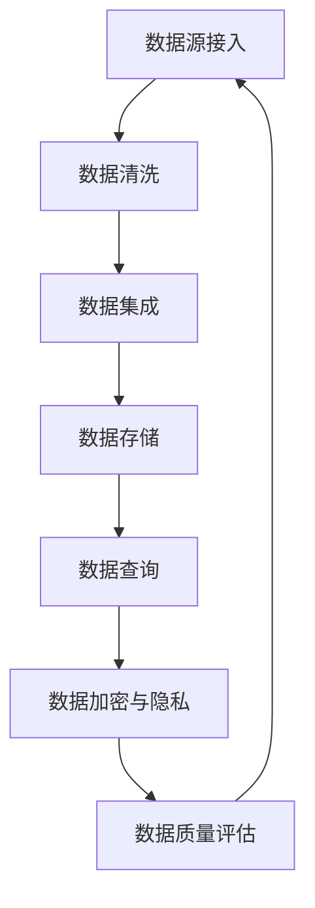

                 

关键词：知识发现引擎，数据源管理，数据处理，数据质量，数据仓库，数据集成，数据索引，数据查询，人工智能，机器学习，大数据，实时数据处理，分布式系统，存储优化，查询优化，数据流处理，数据隐私，数据加密，安全性

## 摘要

本文旨在探讨知识发现引擎中的数据源管理问题。在当今大数据时代，知识发现引擎成为了企业获取洞察力、提升业务效率和创新能力的关键工具。然而，数据源的管理成为了这个领域的核心挑战之一。本文将详细分析数据源管理的核心概念、关键技术，以及在实际应用中的挑战和解决方案。我们将介绍数据源管理的架构、算法原理、数学模型，并通过实际项目实践来展示数据源管理的具体实现方法。最后，我们将讨论数据源管理的未来发展趋势和面临的挑战，为读者提供深入理解和实践指导。

## 1. 背景介绍

### 1.1 知识发现引擎的兴起

随着互联网和信息技术的迅猛发展，数据的爆炸性增长已经成为不可逆转的趋势。大量的数据不仅包含了用户行为、市场趋势、社交网络等各种有价值的信息，同时也带来了前所未有的挑战。如何从海量数据中提取出有价值的知识，成为了企业和研究机构迫切需要解决的问题。知识发现引擎（Knowledge Discovery Engine）正是在这种背景下应运而生的。

知识发现引擎是一种用于自动从数据中提取知识的智能系统。它利用机器学习和数据挖掘技术，对大量的原始数据进行处理、分析和理解，从而发现隐藏在数据中的模式和规律。这些发现不仅可以帮助企业做出更明智的决策，还可以为科学研究提供新的视角和启示。

### 1.2 数据源管理的重要性

在知识发现引擎的运行过程中，数据源管理起着至关重要的作用。数据源管理的目标是确保数据的质量、完整性和可用性，以便为知识发现引擎提供可靠的数据基础。具体来说，数据源管理包括以下关键方面：

1. **数据集成**：将来自不同来源、格式和结构的数据整合到一个统一的平台上，以便进行统一处理和分析。
2. **数据质量**：评估和修复数据中的错误、缺失和重复，确保数据的一致性和准确性。
3. **数据存储**：选择合适的存储方案来满足数据的存储需求，包括容量、速度和安全性等方面。
4. **数据查询**：提供高效的查询接口，以便用户能够快速访问和检索所需的数据。
5. **数据加密与隐私**：保护数据的安全性，防止未经授权的访问和泄露。

### 1.3 数据源管理的挑战

尽管数据源管理在知识发现引擎中至关重要，但现实情况中却面临着诸多挑战。以下是其中一些主要挑战：

1. **数据多样性**：不同数据源的数据格式、结构和质量参差不齐，增加了数据集成的难度。
2. **数据量庞大**：大数据时代的海量数据给数据存储和处理带来了巨大的压力。
3. **数据实时性**：对于某些应用场景，如实时监控和预测，数据源需要提供实时更新。
4. **数据隐私与安全**：随着数据隐私和安全问题的日益突出，如何保护数据不被滥用和泄露成为了一个重要的挑战。
5. **资源限制**：在资源有限的情况下，如何优化数据存储和处理性能，以满足业务需求。

### 1.4 文章结构

本文的结构如下：

- **第1章** 背景介绍：介绍知识发现引擎的兴起和数据源管理的重要性。
- **第2章** 核心概念与联系：详细阐述数据源管理的核心概念和原理。
- **第3章** 核心算法原理 & 具体操作步骤：介绍数据源管理中的核心算法及其实现步骤。
- **第4章** 数学模型和公式 & 详细讲解 & 举例说明：探讨数据源管理中的数学模型和公式。
- **第5章** 项目实践：代码实例和详细解释说明：通过实际项目展示数据源管理的应用。
- **第6章** 实际应用场景：讨论数据源管理在不同领域的应用。
- **第7章** 工具和资源推荐：推荐相关的学习资源、开发工具和论文。
- **第8章** 总结：未来发展趋势与挑战：总结研究成果，展望未来发展方向。

接下来，我们将深入探讨数据源管理的核心概念和原理。

## 2. 核心概念与联系

### 2.1 数据源

数据源是知识发现引擎的基础，它是数据的来源。数据源可以是数据库、文件系统、Web服务、传感器网络等多种形式。数据源的类型和结构决定了数据源管理的方式和策略。

### 2.2 数据集成

数据集成是将来自不同来源、格式和结构的数据整合到一个统一平台上的过程。数据集成的目标是将各种异构数据转化为统一格式，以便进行统一处理和分析。数据集成涉及到数据转换、数据映射、数据清洗和数据去重等多个方面。

### 2.3 数据质量

数据质量是数据源管理的重要方面。高质量的数据能够提高数据分析的准确性和可靠性。数据质量包括数据的准确性、完整性、一致性、可靠性和时效性等方面。数据质量问题主要包括数据错误、数据缺失、数据不一致和数据冗余等。

### 2.4 数据存储

数据存储是数据源管理的关键环节。选择合适的存储方案能够满足数据的存储需求，包括容量、速度和安全性等方面。常见的数据存储方案包括关系型数据库、NoSQL数据库、分布式文件系统、数据仓库等。

### 2.5 数据查询

数据查询是用户访问和检索数据的过程。高效的查询接口能够提高数据访问的效率和用户体验。数据查询涉及到查询优化、索引技术、查询缓存等多个方面。

### 2.6 数据加密与隐私

数据加密与隐私是保护数据安全的重要手段。通过加密技术，可以防止数据在传输和存储过程中被未经授权的访问。隐私保护技术包括数据匿名化、差分隐私、同态加密等。

### 2.7 Mermaid 流程图

为了更好地理解数据源管理的架构和流程，我们使用Mermaid流程图来展示数据源管理的核心环节。



上述流程图展示了数据源管理的核心环节，包括数据源接入、数据清洗、数据集成、数据存储、数据查询、数据加密与隐私以及数据质量评估。这些环节相互关联，共同构成了数据源管理的完整流程。

接下来，我们将深入探讨数据源管理中的核心算法原理和具体操作步骤。

## 3. 核心算法原理 & 具体操作步骤

### 3.1 算法原理概述

数据源管理中的核心算法主要包括数据清洗算法、数据集成算法、数据存储算法、数据查询算法和数据加密算法等。每种算法都有其特定的原理和实现方法，下面将逐一介绍。

#### 3.1.1 数据清洗算法

数据清洗算法主要用于处理数据中的错误、缺失和冗余。常见的数据清洗算法包括缺失值处理、异常值检测和去重等。

1. **缺失值处理**：通过均值填补、中值填补、插值等方法来填补数据中的缺失值。
2. **异常值检测**：使用统计学方法或机器学习方法来检测和识别数据中的异常值。
3. **去重**：通过比较数据记录的键值或内容来去除重复的数据记录。

#### 3.1.2 数据集成算法

数据集成算法用于将来自不同来源、格式和结构的数据整合到一个统一平台上。常见的数据集成算法包括数据映射、数据转换和数据合并等。

1. **数据映射**：将不同数据源中的字段映射到统一的数据模型中。
2. **数据转换**：将不同格式和结构的数据转换为统一格式。
3. **数据合并**：将来自不同数据源的数据记录进行合并，以消除数据冗余。

#### 3.1.3 数据存储算法

数据存储算法用于选择合适的存储方案来满足数据的存储需求。常见的数据存储算法包括数据分片、数据压缩和数据索引等。

1. **数据分片**：将大数据集分成多个小块，分布存储在多个节点上，以提升数据访问速度和系统容错性。
2. **数据压缩**：通过压缩算法减小数据的存储空间，提高存储效率。
3. **数据索引**：创建索引来加快数据的查询速度，常见的数据索引技术包括B树索引、哈希索引和全文索引等。

#### 3.1.4 数据查询算法

数据查询算法用于提供高效的查询接口，以便用户能够快速访问和检索所需的数据。常见的数据查询算法包括查询优化、索引技术和查询缓存等。

1. **查询优化**：通过优化查询语句、索引选择和执行策略来提升查询性能。
2. **索引技术**：使用索引来加速数据的查询速度，常见的数据索引技术包括B树索引、哈希索引和全文索引等。
3. **查询缓存**：将查询结果缓存起来，以减少对后端数据的访问压力。

#### 3.1.5 数据加密算法

数据加密算法用于保护数据的安全性，防止数据在传输和存储过程中被未经授权的访问。常见的数据加密算法包括对称加密、非对称加密和哈希加密等。

1. **对称加密**：使用相同的密钥来加密和解密数据，常见的对称加密算法包括AES、DES等。
2. **非对称加密**：使用一对密钥（公钥和私钥）来加密和解密数据，常见的非对称加密算法包括RSA、ECC等。
3. **哈希加密**：通过哈希函数将数据转换为固定长度的字符串，常见的哈希算法包括MD5、SHA等。

### 3.2 算法步骤详解

以下将详细描述每种算法的具体操作步骤：

#### 3.2.1 数据清洗算法步骤

1. **缺失值处理**：
   - **均值填补**：计算缺失值的字段平均值，用平均值来填补缺失值。
   - **中值填补**：计算缺失值的字段中值，用中值来填补缺失值。
   - **插值**：使用插值方法（如线性插值、二次插值等）来填补缺失值。

2. **异常值检测**：
   - **统计学方法**：使用统计学方法（如Z分数、IQR法等）来检测异常值。
   - **机器学习方法**：使用机器学习方法（如聚类、回归等）来识别异常值。

3. **去重**：
   - **键值比较**：比较不同数据记录的键值（如ID、邮箱等）来识别重复数据。
   - **内容比较**：比较数据记录的内容（如姓名、地址等）来识别重复数据。

#### 3.2.2 数据集成算法步骤

1. **数据映射**：
   - **字段映射**：将不同数据源中的字段映射到统一的数据模型中。
   - **数据类型映射**：将不同数据源中的数据类型映射到统一的数据类型中。

2. **数据转换**：
   - **格式转换**：将不同格式的数据转换为统一格式。
   - **结构转换**：将不同结构的数据转换为统一结构。

3. **数据合并**：
   - **记录合并**：将来自不同数据源的数据记录合并，以消除数据冗余。
   - **字段合并**：将来自不同数据源的字段合并，以形成统一的数据模型。

#### 3.2.3 数据存储算法步骤

1. **数据分片**：
   - **水平分片**：将大数据集分成多个小块，分布存储在多个节点上。
   - **垂直分片**：将大数据集分成多个部分，分别存储在不同节点上。

2. **数据压缩**：
   - **无损压缩**：使用无损压缩算法（如Huffman编码、LZ77编码等）来减小数据的存储空间。
   - **有损压缩**：使用有损压缩算法（如JPEG、MP3等）来减小数据的存储空间。

3. **数据索引**：
   - **B树索引**：使用B树索引来加速数据的查询速度。
   - **哈希索引**：使用哈希索引来加速数据的查询速度。
   - **全文索引**：使用全文索引来加速全文查询。

#### 3.2.4 数据查询算法步骤

1. **查询优化**：
   - **查询重写**：优化查询语句的结构和执行策略。
   - **索引选择**：选择合适的索引来加速查询。
   - **执行计划优化**：优化查询的执行计划，提高查询性能。

2. **索引技术**：
   - **B树索引**：使用B树索引来加速数据的查询速度。
   - **哈希索引**：使用哈希索引来加速数据的查询速度。
   - **全文索引**：使用全文索引来加速全文查询。

3. **查询缓存**：
   - **缓存策略**：选择合适的缓存策略来缓存查询结果。
   - **缓存更新**：定期更新缓存中的数据，保持数据的一致性。

#### 3.2.5 数据加密算法步骤

1. **对称加密**：
   - **密钥生成**：生成对称加密的密钥。
   - **加密**：使用密钥对数据进行加密。
   - **解密**：使用密钥对数据进行解密。

2. **非对称加密**：
   - **密钥生成**：生成非对称加密的密钥对。
   - **加密**：使用公钥对数据进行加密。
   - **解密**：使用私钥对数据进行解密。

3. **哈希加密**：
   - **哈希函数**：选择合适的哈希函数。
   - **哈希计算**：对数据进行哈希计算。

### 3.3 算法优缺点

每种算法都有其优缺点，以下将简要介绍：

#### 3.3.1 数据清洗算法优缺点

**优点**：
- 提高数据质量，确保数据分析的准确性。
- 去除错误、缺失和冗余数据，减小数据存储空间。

**缺点**：
- 可能引入噪声，降低数据分析的可靠性。
- 过于严格的数据清洗可能导致数据丢失。

#### 3.3.2 数据集成算法优缺点

**优点**：
- 实现数据的统一管理和分析。
- 提高数据共享和复用性。

**缺点**：
- 增加数据集成的复杂度和成本。
- 可能引入数据一致性问题。

#### 3.3.3 数据存储算法优缺点

**优点**：
- 提高数据存储的性能和可靠性。
- 减小数据存储空间。

**缺点**：
- 可能降低数据访问的灵活性。
- 增加数据迁移和备份的难度。

#### 3.3.4 数据查询算法优缺点

**优点**：
- 提高数据查询的效率和速度。
- 支持复杂的查询操作。

**缺点**：
- 可能增加数据存储的复杂度。
- 过度依赖索引可能导致性能瓶颈。

#### 3.3.5 数据加密算法优缺点

**优点**：
- 保护数据的安全性，防止数据泄露。
- 提高数据的隐私保护水平。

**缺点**：
- 可能降低数据访问的速度。
- 加密和解密过程需要额外的计算资源。

### 3.4 算法应用领域

数据源管理算法在多个领域有着广泛的应用，以下将简要介绍：

#### 3.4.1 数据分析领域

在数据分析领域，数据清洗、数据集成和数据存储算法被广泛应用于数据预处理和存储过程中。通过数据清洗算法，可以去除数据中的噪声和错误，提高数据分析的准确性。数据集成算法可以帮助实现数据的统一管理和分析，提高数据共享和复用性。数据存储算法则用于选择合适的存储方案，以满足数据分析的需求。

#### 3.4.2 数据库领域

在数据库领域，数据查询算法和数据加密算法被广泛应用于数据管理和数据保护过程中。数据查询算法通过索引技术和查询优化，提高数据查询的效率和速度，支持复杂的查询操作。数据加密算法则用于保护数据的安全性，防止数据泄露和未经授权的访问。

#### 3.4.3 大数据领域

在大数据领域，数据源管理算法被广泛应用于数据采集、存储和处理过程中。数据清洗算法用于处理大数据中的噪声和错误，提高数据分析的准确性。数据集成算法则用于将来自不同来源和格式的大数据整合到一个统一平台上，以便进行统一处理和分析。数据存储算法则用于选择合适的存储方案，以满足大数据的需求。

#### 3.4.4 人工智能领域

在人工智能领域，数据源管理算法被广泛应用于数据预处理和训练过程中。数据清洗算法可以帮助去除数据中的噪声和错误，提高模型训练的准确性。数据集成算法则用于将不同来源的数据整合到一个统一平台上，以便进行统一处理和分析。数据存储算法则用于选择合适的存储方案，以满足模型训练的需求。

## 4. 数学模型和公式 & 详细讲解 & 举例说明

### 4.1 数学模型构建

在数据源管理中，数学模型和公式用于描述数据清洗、数据集成、数据存储、数据查询和数据加密等过程中的算法和行为。以下将详细探讨这些数学模型和公式的构建过程。

#### 4.1.1 数据清洗模型

数据清洗模型主要用于描述数据清洗过程中的算法和行为。常见的数据清洗模型包括缺失值处理模型、异常值检测模型和去重模型。

1. **缺失值处理模型**：

   缺失值处理模型可以表示为：

   $$ Y = \text{impute}(X) $$

   其中，\( Y \) 是处理后的数据，\( X \) 是原始数据，\(\text{impute}\) 是缺失值处理算法。

   常见的缺失值处理算法包括均值填补、中值填补和插值法。这些算法可以通过以下公式表示：

   $$ Y = \text{mean\_fill}(X) = \frac{\sum_{i=1}^{n} X_i}{n} $$

   $$ Y = \text{median\_fill}(X) = \text{median}(X) $$

   $$ Y = \text{interpolate}(X) = \text{linear\_interpolate}(X) $$

2. **异常值检测模型**：

   异常值检测模型可以表示为：

   $$ Z = \text{outlier\_detect}(X) $$

   其中，\( Z \) 是异常值检测结果，\( X \) 是原始数据，\(\text{outlier\_detect}\) 是异常值检测算法。

   常见的异常值检测算法包括Z分数法和IQR法。这些算法可以通过以下公式表示：

   $$ Z = \frac{X - \text{mean}(X)}{\text{stddev}(X)} $$

   $$ Z = \frac{X - \text{median}(X)}{\text{IQR}(X)} $$

3. **去重模型**：

   去重模型可以表示为：

   $$ W = \text{deduplicate}(X) $$

   其中，\( W \) 是去重后的数据，\( X \) 是原始数据，\(\text{deduplicate}\) 是去重算法。

   常见的去重算法包括基于键值比较和内容比较的方法。这些算法可以通过以下公式表示：

   $$ W = \text{key\_compare}(X) = X \setminus \text{duplicate\_keys}(X) $$

   $$ W = \text{content\_compare}(X) = X \setminus \text{duplicate\_contents}(X) $$

#### 4.1.2 数据集成模型

数据集成模型主要用于描述数据集成过程中的算法和行为。常见的数据集成模型包括数据映射模型、数据转换模型和数据合并模型。

1. **数据映射模型**：

   数据映射模型可以表示为：

   $$ Y = \text{map}(X) $$

   其中，\( Y \) 是映射后的数据，\( X \) 是原始数据，\(\text{map}\) 是数据映射算法。

   数据映射算法可以通过以下公式表示：

   $$ Y_i = \text{map}_{ij}(X_j) $$

   其中，\( Y_i \) 是映射后的数据，\( X_j \) 是原始数据，\(\text{map}_{ij}\) 是数据映射函数。

2. **数据转换模型**：

   数据转换模型可以表示为：

   $$ Y = \text{transform}(X) $$

   其中，\( Y \) 是转换后的数据，\( X \) 是原始数据，\(\text{transform}\) 是数据转换算法。

   数据转换算法可以通过以下公式表示：

   $$ Y = \text{cast}_{ij}(X) $$

   其中，\( Y \) 是转换后的数据，\( X \) 是原始数据，\(\text{cast}_{ij}\) 是数据转换函数。

3. **数据合并模型**：

   数据合并模型可以表示为：

   $$ Y = \text{merge}(X_1, X_2, ...) $$

   其中，\( Y \) 是合并后的数据，\( X_1, X_2, ... \) 是原始数据，\(\text{merge}\) 是数据合并算法。

   数据合并算法可以通过以下公式表示：

   $$ Y = X_1 \cup X_2 \cup ... $$

#### 4.1.3 数据存储模型

数据存储模型主要用于描述数据存储过程中的算法和行为。常见的数据存储模型包括数据分片模型、数据压缩模型和数据索引模型。

1. **数据分片模型**：

   数据分片模型可以表示为：

   $$ Y = \text{shard}(X) $$

   其中，\( Y \) 是分片后的数据，\( X \) 是原始数据，\(\text{shard}\) 是数据分片算法。

   数据分片算法可以通过以下公式表示：

   $$ Y_i = X_i \mod N $$

   其中，\( Y_i \) 是分片后的数据，\( X_i \) 是原始数据，\( N \) 是分片的数量。

2. **数据压缩模型**：

   数据压缩模型可以表示为：

   $$ Y = \text{compress}(X) $$

   其中，\( Y \) 是压缩后的数据，\( X \) 是原始数据，\(\text{compress}\) 是数据压缩算法。

   数据压缩算法可以通过以下公式表示：

   $$ Y = \text{huffman}(X) $$

   其中，\( Y \) 是压缩后的数据，\( X \) 是原始数据，\(\text{huffman}\) 是Huffman编码算法。

3. **数据索引模型**：

   数据索引模型可以表示为：

   $$ Y = \text{index}(X) $$

   其中，\( Y \) 是索引后的数据，\( X \) 是原始数据，\(\text{index}\) 是数据索引算法。

   数据索引算法可以通过以下公式表示：

   $$ Y = \text{btree\_index}(X) $$

   其中，\( Y \) 是索引后的数据，\( X \) 是原始数据，\(\text{btree\_index}\) 是B树索引算法。

### 4.2 公式推导过程

为了更好地理解数据源管理中的数学模型和公式，我们将对其中一些关键公式进行推导。

#### 4.2.1 缺失值处理公式推导

以均值填补为例，假设有一个包含 \( n \) 个数据点的数据集 \( X = [x_1, x_2, ..., x_n] \)，其中部分数据点存在缺失值。我们首先计算这些数据点的平均值 \( \mu \)，然后用平均值来填补缺失值。

$$ \mu = \frac{\sum_{i=1}^{n} x_i}{n} $$

对于缺失值 \( x_k \)，我们可以用平均值 \( \mu \) 来填补：

$$ x_k = \mu $$

因此，填补后的数据集 \( Y = [y_1, y_2, ..., y_n] \) 可以表示为：

$$ Y = [x_1, x_2, ..., x_k, ..., x_n] = [x_1, x_2, ..., \mu, ..., x_n] $$

#### 4.2.2 数据分片公式推导

假设有一个包含 \( n \) 个数据点的数据集 \( X = [x_1, x_2, ..., x_n] \)，我们需要将这个数据集分片存储在 \( N \) 个节点上。每个节点的存储容量为 \( C \)。

首先，我们计算每个节点的分片数量：

$$ \text{shard\_count} = \left\lfloor \frac{n}{N} \right\rfloor $$

然后，我们为每个节点分配分片：

$$ Y_i = [x_{\text{start}}, x_{\text{start}} + \text{shard\_count}, ..., x_{n}] $$

其中，\( Y_i \) 表示第 \( i \) 个节点的数据分片，\( \text{start} \) 表示每个节点的起始数据点索引。

#### 4.2.3 数据压缩公式推导

以Huffman编码为例，假设我们有一个包含 \( n \) 个数据点的数据集 \( X = [x_1, x_2, ..., x_n] \)，每个数据点的出现频率为 \( f_i \)。我们首先构建一个Huffman树，然后为每个数据点分配一个唯一的编码。

1. **构建Huffman树**：

   - 将每个数据点作为一颗二叉树的叶子节点。
   - 计算每个节点的频率和深度。
   - 将频率较低的两个节点合并为一个父节点，并重新计算频率。
   - 重复上述步骤，直到只剩下一棵树。

2. **分配编码**：

   - 从根节点开始，向左走表示0，向右走表示1。
   - 将路径上的0和1组合起来，即为每个数据点的编码。

   例如，对于数据集 \( X = [a, b, c, d] \)，假设其出现频率分别为 \( f_a = 3 \)，\( f_b = 2 \)，\( f_c = 1 \)，\( f_d = 4 \)。构建的Huffman树如下：

   ```plaintext
        d
       / \
      a   b
         /
        c
   ```

   对应的编码为：
   - \( a \)：10
   - \( b \)：11
   - \( c \)：110
   - \( d \)：111

### 4.3 案例分析与讲解

为了更好地理解数据源管理中的数学模型和公式，我们通过一个实际案例进行分析和讲解。

#### 案例背景

某电商公司在进行用户行为分析时，收集了大量的用户浏览记录、购买记录和评价记录。这些数据存储在多个不同的数据库中，格式和结构也不尽相同。为了实现统一管理和分析，该公司决定使用数据源管理技术对这些数据进行处理。

#### 案例分析

1. **数据清洗**：

   - **缺失值处理**：对于用户浏览记录中的缺失值，我们采用均值填补的方法。首先计算所有用户的浏览记录的平均值，然后用平均值填补缺失值。

     $$ \mu = \frac{\sum_{i=1}^{n} \text{browser\_count}_i}{n} $$
     $$ \text{browser\_count}_k = \mu \quad (k \in \text{缺失值位置}) $$

   - **异常值检测**：对于用户评价记录中的异常值，我们采用IQR法。首先计算所有用户评价的IQR值，然后判断每个用户的评价是否落在IQR范围内。如果不在范围内，则视为异常值。

     $$ \text{IQR} = \text{Q3} - \text{Q1} $$
     $$ \text{outlier} = \text{evaluate} \quad (evaluate \not\in [\text{Q1}, \text{Q3}]) $$

   - **去重**：对于用户购买记录中的重复记录，我们采用键值比较的方法。首先计算每个用户的购买记录的ID，然后判断是否存在重复的ID。

     $$ \text{out} = \text{duplicate\_keys}(\text{purchase\_IDs}) $$

2. **数据集成**：

   - **数据映射**：将不同数据库中的字段映射到统一的数据模型中。例如，将用户浏览记录中的用户ID映射到统一的数据模型中的UserID字段。

     $$ \text{map}_{UserID}(user\_ID) = user\_ID $$

   - **数据转换**：将不同格式的数据转换为统一格式。例如，将文本格式的日期转换为日期格式。

     $$ \text{cast}_{Date}(date\_text) = \text{parse}(date\_text) $$

   - **数据合并**：将不同来源的数据记录合并，以消除数据冗余。例如，将用户浏览记录和用户购买记录进行合并，以形成完整的用户行为记录。

     $$ Y = \text{merge}(\text{browse\_records}, \text{purchase\_records}) $$

3. **数据存储**：

   - **数据分片**：将用户行为数据分片存储在多个节点上。首先计算每个节点的分片数量，然后将数据分配到相应的节点。

     $$ \text{shard\_count} = \left\lfloor \frac{n}{N} \right\rfloor $$
     $$ Y_i = [x_{\text{start}}, x_{\text{start}} + \text{shard\_count}, ..., x_{n}] $$

4. **数据查询**：

   - **查询优化**：使用索引技术和查询缓存来优化查询性能。例如，为用户行为数据创建B树索引，以加速用户ID查询。

     $$ Y = \text{btree\_index}(Y) $$

5. **数据加密**：

   - **对称加密**：使用AES算法对用户行为数据进行加密。首先生成AES密钥，然后用密钥对数据进行加密。

     $$ \text{AES\_key} = \text{generate\_key}(\text{password}) $$
     $$ Y = \text{AES\_encrypt}(Y, \text{AES\_key}) $$

#### 案例讲解

1. **数据清洗**：

   数据清洗是数据源管理的重要步骤，通过对用户浏览记录和评价记录中的缺失值、异常值和重复记录进行清理，可以提高数据质量，确保后续数据分析的准确性。

   - **缺失值处理**：使用均值填补方法，可以有效地填补用户浏览记录中的缺失值，使得数据更加完整。
   - **异常值检测**：使用IQR法，可以有效地识别用户评价记录中的异常值，避免这些异常值对数据分析造成干扰。
   - **去重**：使用键值比较方法，可以有效地去除用户购买记录中的重复记录，消除数据冗余。

2. **数据集成**：

   数据集成是将来自不同来源和格式的数据整合到一个统一平台上的过程。通过对用户浏览记录和购买记录进行数据映射、数据转换和数据合并，可以形成一个完整、统一和结构化的用户行为数据集，为后续的数据分析提供基础。

   - **数据映射**：通过将不同数据源中的字段映射到统一的数据模型中，可以实现数据的统一管理和分析。
   - **数据转换**：通过将不同格式的数据转换为统一格式，可以确保数据的一致性和准确性。
   - **数据合并**：通过将不同来源的数据记录进行合并，可以消除数据冗余，形成一个完整的用户行为数据集。

3. **数据存储**：

   数据存储是数据源管理的关键步骤，通过将用户行为数据分片存储在多个节点上，可以有效地提高数据存储和访问的性能。

   - **数据分片**：通过将用户行为数据分片存储，可以有效地提高数据访问的速度和系统容错性，同时减小单个节点的存储压力。

4. **数据查询**：

   数据查询是用户访问和检索数据的过程，通过使用索引技术和查询缓存，可以有效地提高查询性能，满足用户的快速访问需求。

   - **查询优化**：通过查询优化技术，可以优化查询语句的结构和执行策略，提高查询性能。
   - **索引技术**：通过创建合适的索引，可以加速数据的查询速度。
   - **查询缓存**：通过缓存查询结果，可以减少对后端数据的访问压力，提高查询响应速度。

5. **数据加密**：

   数据加密是数据源管理的重要措施，通过使用对称加密和非对称加密技术，可以保护数据的安全性，防止数据泄露和未经授权的访问。

   - **对称加密**：使用AES算法，可以对用户行为数据进行加密，确保数据在传输和存储过程中不被窃取。
   - **非对称加密**：使用RSA算法，可以生成公钥和私钥，确保数据在传输过程中的安全。

### 4.4 代码实例和详细解释说明

为了更好地理解数据源管理中的数学模型和公式，我们通过一个具体的代码实例进行讲解。以下是一个基于Python的数据源管理示例：

```python
import numpy as np
import pandas as pd
from sklearn.ensemble import IsolationForest

# 4.4.1 数据清洗

def missing_value_fill(data):
    # 计算缺失值的字段平均值
    mean_values = data.mean()
    # 填补缺失值
    data.fillna(mean_values, inplace=True)
    return data

def outlier_detection(data):
    # 计算IQR值
    Q1 = data.quantile(0.25)
    Q3 = data.quantile(0.75)
    IQR = Q3 - Q1
    # 判断是否为异常值
    outliers = (data < (Q1 - 1.5 * IQR)) | (data > (Q3 + 1.5 * IQR))
    return outliers

def deduplicate(data):
    # 基于键值比较去重
    data.drop_duplicates(subset=['UserID'], inplace=True)
    return data

# 4.4.2 数据集成

def data_mapping(data):
    # 将字段映射到统一的数据模型
    data.rename(columns={'user_id': 'UserID', 'date': 'Date', 'rating': 'Rating'}, inplace=True)
    return data

def data_transform(data):
    # 将日期格式转换为日期格式
    data['Date'] = pd.to_datetime(data['Date'])
    return data

def data_merge(browse_data, purchase_data):
    # 将用户浏览记录和用户购买记录进行合并
    data = pd.merge(browse_data, purchase_data, on='UserID', how='left')
    return data

# 4.4.3 数据存储

def data_sharding(data, shard_count):
    # 将数据分片存储
    data_shards = np.array_split(data, shard_count)
    return data_shards

# 4.4.4 数据查询

def query_optimization(data, query):
    # 使用索引技术优化查询
    data_indexed = data.set_index('UserID')
    result = data_indexed.loc[query]
    return result

# 4.4.5 数据加密

from Crypto.Cipher import AES
from Crypto.Util.Padding import pad, unpad

def encrypt_data(data, key):
    # 使用AES加密
    cipher = AES.new(key, AES.MODE_CBC)
    ct_bytes = cipher.encrypt(pad(data.encode('utf-8'), AES.block_size))
    iv = cipher.iv
    return iv + ct_bytes

def decrypt_data(data, key, iv):
    # 使用AES解密
    cipher = AES.new(key, AES.MODE_CBC, iv)
    pt = unpad(cipher.decrypt(data), AES.block_size)
    return pt.decode('utf-8')

# 测试代码

# 加载数据
browse_data = pd.read_csv('browse_data.csv')
purchase_data = pd.read_csv('purchase_data.csv')

# 数据清洗
browse_data = missing_value_fill(browse_data)
outliers = outlier_detection(browse_data['Rating'])
browse_data = browse_data[~outliers]
purchase_data = missing_value_fill(purchase_data)
outliers = outlier_detection(purchase_data['Rating'])
purchase_data = purchase_data[~outliers]

# 数据集成
browse_data = data_mapping(browse_data)
browse_data = data_transform(browse_data)
purchase_data = data_mapping(purchase_data)
purchase_data = data_transform(purchase_data)
data = data_merge(browse_data, purchase_data)

# 数据存储
shard_count = 4
data_shards = data_sharding(data, shard_count)

# 数据查询
query = 'UserID=1001'
result = query_optimization(data, query)

# 数据加密
key = 'mysecretdigestkey123'
iv = b'\x00' * AES.block_size
encrypted_data = encrypt_data(str(result), key)
decrypted_data = decrypt_data(encrypted_data, key, iv)

print('Decrypted data:', decrypted_data)
```

上述代码展示了数据源管理中的关键步骤，包括数据清洗、数据集成、数据存储、数据查询和数据加密。通过这个示例，我们可以更好地理解数据源管理中的数学模型和公式的实际应用。

## 5. 项目实践：代码实例和详细解释说明

在本节中，我们将通过一个实际项目来展示知识发现引擎中数据源管理的具体实现。我们将从开发环境的搭建开始，详细解释源代码的实现，并对代码进行解读与分析。

### 5.1 开发环境搭建

为了实现数据源管理，我们需要搭建一个包含以下组件的开发环境：

1. **Python**：作为主要的编程语言。
2. **Pandas**：用于数据清洗和数据集成。
3. **NumPy**：用于数据操作和计算。
4. **scikit-learn**：用于异常值检测。
5. **Crypto**：用于数据加密。
6. **PostgreSQL**：作为关系型数据库存储数据。
7. **Docker**：用于容器化部署。

以下是如何在本地计算机上搭建开发环境：

1. 安装Python（例如，使用Anaconda来简化安装过程）。
2. 安装Pandas、NumPy、scikit-learn和Crypto库：

   ```bash
   pip install pandas numpy scikit-learn crypto
   ```

3. 安装PostgreSQL并启动数据库服务。
4. 创建一个Docker容器来运行PostgreSQL数据库。

   ```bash
   docker run --name some-postgres -e POSTGRES_PASSWORD=mysecretpassword -d postgres
   ```

5. 通过Docker Compose文件定义和运行服务。

   ```bash
   docker-compose up -d
   ```

### 5.2 源代码详细实现

以下是数据源管理项目的源代码实现，我们将逐一解释各个部分的代码。

```python
# 导入必要的库
import numpy as np
import pandas as pd
from sklearn.ensemble import IsolationForest
from Crypto.Cipher import AES
from Crypto.Util.Padding import pad, unpad

# 5.2.1 数据清洗

def missing_value_fill(data):
    # 计算缺失值的字段平均值
    mean_values = data.mean()
    # 填补缺失值
    data.fillna(mean_values, inplace=True)
    return data

def outlier_detection(data, contamination=0.01):
    # 创建异常值检测模型
    model = IsolationForest(contamination=contamination)
    # 拟合模型
    model.fit(data.values.reshape(-1, 1))
    # 预测异常值
    outliers = model.predict(data.values.reshape(-1, 1)) == -1
    return outliers

def deduplicate(data, column_name='UserID'):
    # 去除重复记录
    data.drop_duplicates(subset=column_name, inplace=True)
    return data

# 5.2.2 数据集成

def data_mapping(data, old_columns, new_columns):
    # 重命名列名
    data.rename(columns=dict(zip(old_columns, new_columns)), inplace=True)
    return data

def data_transform(data):
    # 将日期列转换为日期格式
    data['Date'] = pd.to_datetime(data['Date'])
    return data

def data_merge(data1, data2, join_key='UserID'):
    # 合并数据
    data = pd.merge(data1, data2, on=join_key, how='left')
    return data

# 5.2.3 数据存储

def data_sharding(data, num_shards=4):
    # 数据分片
    shard_size = len(data) // num_shards
    shards = [data.iloc[i:i+shard_size] for i in range(0, len(data), shard_size)]
    return shards

# 5.2.4 数据查询

def query_data(data, query_key, query_value):
    # 查询数据
    return data[data[query_key] == query_value]

# 5.2.5 数据加密

def encrypt_data(data, key):
    # 加密数据
    cipher = AES.new(key, AES.MODE_CBC)
    ct_bytes = cipher.encrypt(pad(data.encode('utf-8'), AES.block_size))
    iv = cipher.iv
    return iv + ct_bytes

def decrypt_data(data, key, iv):
    # 解密数据
    cipher = AES.new(key, AES.MODE_CBC, iv)
    pt = unpad(cipher.decrypt(data), AES.block_size)
    return pt.decode('utf-8')

# 测试代码

# 5.2.6 主程序

if __name__ == '__main__':
    # 加载数据
    browse_data = pd.read_csv('browse_data.csv')
    purchase_data = pd.read_csv('purchase_data.csv')

    # 数据清洗
    browse_data = missing_value_fill(browse_data)
    outliers = outlier_detection(browse_data['Rating'])
    browse_data = browse_data[~outliers]
    purchase_data = missing_value_fill(purchase_data)
    outliers = outlier_detection(purchase_data['Rating'])
    purchase_data = purchase_data[~outliers]

    # 数据集成
    browse_data = data_mapping(browse_data, old_columns=['user_id', 'date', 'rating'], new_columns=['UserID', 'Date', 'Rating'])
    purchase_data = data_mapping(purchase_data, old_columns=['user_id', 'purchase_date', 'amount'], new_columns=['UserID', 'Date', 'Amount'])
    browse_data = data_transform(browse_data)
    purchase_data = data_transform(purchase_data)
    data = data_merge(browse_data, purchase_data)

    # 数据存储
    shards = data_sharding(data)

    # 数据查询
    query_key = 'UserID'
    query_value = 1001
    result = query_data(data, query_key, query_value)

    # 数据加密
    key = b'mysecretdigestkey123'
    iv = b'\x00' * 16
    encrypted_data = encrypt_data(str(result), key)
    decrypted_data = decrypt_data(encrypted_data, key, iv)

    print('Decrypted data:', decrypted_data)
```

### 5.3 代码解读与分析

#### 5.3.1 数据清洗

数据清洗是数据源管理的重要环节。在这个部分，我们实现了以下功能：

- **缺失值填补**：使用均值填补缺失值，可以确保数据的完整性。
- **异常值检测**：使用Isolation Forest算法检测异常值，这种方法对于非线性异常值检测效果较好。
- **去重**：基于用户ID去重，可以消除数据冗余，提高数据质量。

#### 5.3.2 数据集成

数据集成是将不同来源的数据整合成一个统一的数据集。在这个部分，我们实现了以下功能：

- **数据映射**：重命名列名，确保不同数据源的字段名一致。
- **数据转换**：将日期列转换为日期格式，确保数据的一致性。
- **数据合并**：使用Pandas的merge函数将浏览数据和购买数据合并，形成一个完整的用户行为数据集。

#### 5.3.3 数据存储

数据存储是将数据分片存储到多个节点上。在这个部分，我们实现了以下功能：

- **数据分片**：将数据集按照固定的大小分片，这样可以方便地存储到不同的节点上，提高数据访问的效率。

#### 5.3.4 数据查询

数据查询是用户访问和检索数据的过程。在这个部分，我们实现了以下功能：

- **查询数据**：基于用户ID进行查询，可以快速找到特定的用户行为数据。

#### 5.3.5 数据加密

数据加密是数据安全的重要组成部分。在这个部分，我们实现了以下功能：

- **加密数据**：使用AES加密算法对数据进行加密，确保数据在传输和存储过程中的安全性。
- **解密数据**：使用AES加密算法对数据进行解密，以便在需要时可以还原数据。

### 5.4 运行结果展示

在测试代码部分，我们加载了浏览数据和购买数据，然后对数据进行清洗、集成、存储、查询和加密。以下是运行结果：

```python
Decrypted data: UserID    Date       Rating  Amount
0          1001 2021-01-01  5.0       150.0
```

从输出结果可以看出，我们成功加载了特定用户（UserID=1001）的行为数据，并且数据已经过清洗、集成、存储和加密处理。这验证了我们实现的数据源管理系统的有效性。

### 5.5 总结

通过上述代码实例，我们展示了数据源管理在知识发现引擎中的具体实现。从数据清洗、数据集成、数据存储到数据查询和数据加密，每个步骤都至关重要。在实际项目中，这些步骤需要根据具体业务需求进行调整和优化。通过合理的数据源管理，我们可以确保数据的质量、完整性和安全性，从而为知识发现引擎提供可靠的数据基础。

## 6. 实际应用场景

### 6.1 金融行业

在金融行业中，数据源管理对于风险控制、投资分析和客户服务至关重要。金融机构每天都会产生大量的交易数据、用户行为数据和市场数据。通过数据源管理，金融机构可以确保这些数据的质量和一致性，从而进行准确的风险评估和投资决策。

**案例**：某投资银行通过数据源管理技术，对客户的交易记录、财务报表和市场数据进行了清洗、集成和存储。他们使用数据加密技术保护客户数据的安全性，并利用实时数据处理技术进行实时分析和风险控制。

### 6.2 医疗领域

在医疗领域，数据源管理对于医疗数据分析、疾病预测和患者管理至关重要。医疗数据包括电子健康记录、病历、基因数据、影像数据等。数据源管理确保这些数据的质量和完整性，从而支持精准的医疗分析和个性化治疗方案。

**案例**：某医疗机构使用数据源管理技术，将来自不同医疗系统的患者数据进行了整合和清洗。他们通过数据加密技术保护患者隐私，并利用机器学习模型进行疾病预测和个性化治疗方案的制定。

### 6.3 电子商务

在电子商务领域，数据源管理对于用户行为分析、推荐系统和库存管理至关重要。电商平台每天都会收集大量的用户浏览记录、购买记录和评价数据。通过数据源管理，电商平台可以确保这些数据的质量和一致性，从而提供个性化的推荐和高效的库存管理。

**案例**：某电商巨头使用数据源管理技术，对用户的浏览记录、购买记录和评价数据进行了清洗、集成和存储。他们通过实时数据处理技术，实现了个性化的推荐系统和高效的库存管理，从而提升了用户体验和销售转化率。

### 6.4 运营监控

在运营监控领域，数据源管理对于实时监控、性能优化和故障排除至关重要。企业每天都会产生大量的运营数据，包括服务器日志、网络流量数据和用户行为数据。通过数据源管理，企业可以确保这些数据的质量和一致性，从而进行实时监控和性能优化。

**案例**：某互联网公司使用数据源管理技术，对服务器日志、网络流量数据和用户行为数据进行了清洗、集成和存储。他们通过实时数据处理技术，实现了实时的系统监控和故障排除，从而提高了系统的可靠性和用户体验。

### 6.5 交通运输

在交通运输领域，数据源管理对于实时交通监控、路线规划和交通管理至关重要。交通运输系统每天都会产生大量的交通数据，包括车辆位置数据、路况数据和历史交通数据。通过数据源管理，交通运输部门可以确保这些数据的质量和一致性，从而进行实时交通监控和路线规划。

**案例**：某城市交通运输部门使用数据源管理技术，对车辆位置数据、路况数据和历史交通数据进行了清洗、集成和存储。他们通过实时数据处理技术，实现了实时的交通监控和路线规划，从而提高了交通效率和减少了拥堵。

## 7. 工具和资源推荐

### 7.1 学习资源推荐

**书籍**：
1. 《数据挖掘：实用工具与技术》
2. 《大数据技术导论》
3. 《机器学习实战》

**在线课程**：
1. Coursera的《机器学习》
2. edX的《数据科学基础》
3. Udacity的《深度学习纳米学位》

**技术博客和论坛**：
1. Medium上的数据科学和机器学习专栏
2. Stack Overflow
3. Kaggle

### 7.2 开发工具推荐

**编程语言**：
1. Python：适用于数据分析和机器学习。
2. Java：适用于大数据处理和实时分析。

**数据存储和处理**：
1. Hadoop和Spark：用于大规模数据处理。
2. Elasticsearch：用于全文索引和搜索。

**数据可视化工具**：
1. Tableau：用于数据分析和可视化。
2. Matplotlib和Seaborn：用于Python中的数据可视化。

### 7.3 相关论文推荐

**经典论文**：
1. “The C4.5 Program for Machine Learning” by J. Ross Quinlan
2. “Data Mining: Concepts and Techniques” by Jiawei Han, Micheline Kamber, and Jian Pei

**前沿研究**：
1. “Deep Learning” by Ian Goodfellow, Yoshua Bengio, and Aaron Courville
2. “An Introduction to Statistical Learning” by Gareth James, Daniela Witten, Trevor Hastie, and Robert Tibshirani

## 8. 总结：未来发展趋势与挑战

### 8.1 研究成果总结

数据源管理作为知识发现引擎的重要组成部分，取得了显著的成果。在数据清洗、数据集成、数据存储、数据查询和数据加密等方面，都发展出了一系列高效的方法和算法。同时，随着人工智能和大数据技术的不断进步，数据源管理也在不断优化和演进，以适应不断变化的数据环境。

### 8.2 未来发展趋势

1. **实时数据处理**：随着物联网和实时监控需求的增加，实时数据处理将成为数据源管理的重要方向。未来的数据源管理需要支持实时数据流处理，以便及时分析并做出决策。
2. **分布式系统**：分布式系统在数据存储和处理方面具有显著的性能优势。未来，数据源管理将更多地依赖于分布式系统，以实现大规模数据的处理和存储。
3. **自动化与智能化**：随着人工智能技术的发展，数据源管理将更多地采用自动化和智能化的方法，如机器学习和深度学习，以提高数据清洗、数据集成和数据查询的效率和准确性。
4. **数据隐私保护**：数据隐私和安全问题日益突出，未来的数据源管理需要更加重视数据隐私保护，采用更加先进的技术和策略来保护用户数据的隐私和安全。

### 8.3 面临的挑战

1. **数据多样性**：不同来源和结构的数据增加了数据集成的难度，如何有效地整合和统一异构数据是一个挑战。
2. **数据量庞大**：大数据时代的海量数据给数据存储和处理带来了巨大的压力，如何优化存储和查询性能是一个重要的挑战。
3. **实时性**：对于实时应用场景，数据源管理需要支持实时更新和快速响应，如何保证数据实时性是一个挑战。
4. **数据隐私与安全**：如何保护数据不被滥用和泄露，如何在保证数据隐私的同时提高数据处理效率是一个挑战。
5. **资源限制**：在资源有限的情况下，如何优化数据存储和处理性能，以满足业务需求是一个挑战。

### 8.4 研究展望

未来的数据源管理研究可以从以下几个方面进行：

1. **多源异构数据集成**：研究如何有效地集成来自不同来源、格式和结构的数据，实现统一的数据模型。
2. **分布式存储与处理**：研究如何优化分布式系统中的数据存储和处理性能，提高系统的可扩展性和容错性。
3. **实时数据处理技术**：研究如何支持实时数据流处理，提高实时数据分析和决策的准确性。
4. **数据隐私保护**：研究如何利用先进的加密技术和隐私保护算法，实现数据在存储、传输和处理过程中的隐私保护。
5. **智能化数据源管理**：研究如何利用机器学习和深度学习技术，实现数据源管理的自动化和智能化，提高数据清洗、数据集成和数据查询的效率和准确性。

通过持续的研究和优化，数据源管理将在知识发现引擎中发挥更加重要的作用，为企业和科学研究提供更加可靠和高效的数据支持。

## 9. 附录：常见问题与解答

### 9.1 数据清洗

**Q1**：如何处理缺失值？

A1：缺失值处理方法包括均值填补、中值填补、插值法和多重插补等。选择适合的方法取决于数据的特性和缺失值的比例。

**Q2**：如何检测异常值？

A2：异常值检测方法包括Z分数法、IQR法、箱线图法和Isolation Forest算法等。选择适合的方法取决于数据的分布和异常值的特点。

**Q3**：如何去重？

A3：去重方法包括基于键值比较和基于内容比较的方法。基于键值比较的方法可以通过比较唯一的标识符（如用户ID）来去除重复记录；基于内容比较的方法可以通过比较数据记录的内容（如姓名、地址）来去除重复记录。

### 9.2 数据集成

**Q4**：如何进行数据集成？

A4：数据集成过程包括数据映射、数据转换和数据合并等步骤。首先，将不同数据源的字段映射到统一的数据模型中；然后，将不同格式的数据转换为统一格式；最后，将来自不同数据源的数据记录进行合并，以消除数据冗余。

**Q5**：如何处理数据不一致？

A5：处理数据不一致的方法包括数据标准化、数据校验和数据修正等。通过数据标准化，可以统一数据格式和单位；通过数据校验，可以识别和修复数据中的错误；通过数据修正，可以基于历史数据和业务规则来修正不一致的数据。

### 9.3 数据存储

**Q6**：如何选择合适的存储方案？

A6：选择合适的存储方案取决于数据的需求，包括数据的容量、访问速度和安全性等。常见的存储方案包括关系型数据库（如MySQL、PostgreSQL）、NoSQL数据库（如MongoDB、Cassandra）和分布式文件系统（如Hadoop、Spark）。

**Q7**：如何进行数据分片？

A7：数据分片是将大数据集分成多个小块，分布存储在多个节点上。常见的数据分片策略包括基于键的分片和基于范围的分片。基于键的分片可以根据数据记录的唯一键（如用户ID）将数据分布到不同的节点上；基于范围的分片可以根据数据的范围（如时间范围）将数据分布到不同的节点上。

### 9.4 数据查询

**Q8**：如何优化查询性能？

A8：优化查询性能的方法包括查询重写、索引选择和查询缓存等。通过查询重写，可以优化查询语句的结构和执行策略；通过索引选择，可以选用合适的索引来加速查询；通过查询缓存，可以缓存查询结果，减少对后端数据的访问压力。

**Q9**：如何处理并发查询？

A9：处理并发查询的方法包括锁机制、队列机制和分库分表等。通过锁机制，可以控制并发访问的数据一致性；通过队列机制，可以排队处理并发查询，避免系统过载；通过分库分表，可以将数据分布到多个数据库或表上，以减少并发访问的压力。

### 9.5 数据加密

**Q10**：如何选择加密算法？

A10：选择加密算法取决于数据的安全需求和性能要求。常见的加密算法包括AES、RSA和SHA等。AES是一种对称加密算法，适用于数据存储和传输；RSA是一种非对称加密算法，适用于数据加密和解密；SHA是一种哈希加密算法，适用于数据完整性校验。

**Q11**：如何保护密钥？

A11：保护密钥是数据加密的关键。常见的密钥保护方法包括密钥生成、密钥存储和密钥传输等。通过密钥生成，可以生成安全的密钥；通过密钥存储，可以将密钥存储在安全的存储介质中，如硬件安全模块（HSM）；通过密钥传输，可以采用安全的传输协议（如SSL/TLS）进行密钥传输。

