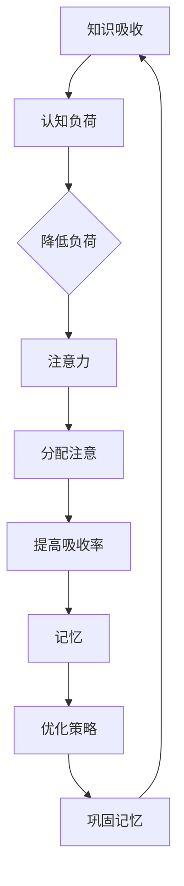

                 

关键词：知识吸收率，学习效率，认知心理学，认知负荷，深度学习，技术阅读

> 摘要：在信息技术迅速发展的今天，知识吸收率成为衡量个体学习成效的关键指标。本文从认知心理学角度出发，探讨如何提高知识吸收率，提供实用的方法和技术，帮助读者在技术阅读中实现高效学习。

## 1. 背景介绍

在信息爆炸的时代，如何快速掌握新知识，提升个人竞争力，成为每个信息技术从业者关注的焦点。然而，传统的阅读方法往往存在效率低下、记忆不深等问题，导致学习效果不尽如人意。研究表明，知识的吸收并非简单的信息输入过程，而是一个复杂的认知活动。因此，提升知识吸收率成为提高学习成效的关键。

认知心理学研究表明，知识吸收受到多种因素的影响，包括认知负荷、注意力、记忆等。本文将从这些方面出发，探讨如何通过优化阅读策略和技术手段，提高知识吸收率，实现高效学习。

## 2. 核心概念与联系

### 2.1 认知负荷

认知负荷是指个体在认知过程中所承受的心理负担。过高的认知负荷会导致注意力分散、记忆困难等问题，从而影响知识吸收。因此，降低认知负荷是提高知识吸收率的重要途径。

### 2.2 注意力

注意力是知识吸收的关键因素。有效的注意力分配可以帮助个体在阅读过程中保持专注，减少干扰，从而提高知识吸收率。

### 2.3 记忆

记忆是知识吸收的基础。通过优化记忆策略，如重复、联想、归纳等，可以提高知识的记忆效果，从而提高知识吸收率。

### 2.4 Mermaid 流程图



## 3. 核心算法原理 & 具体操作步骤

### 3.1 算法原理概述

知识吸收率提高的核心算法基于认知心理学的原理，通过优化认知负荷、提升注意力和优化记忆策略，实现高效学习。

### 3.2 算法步骤详解

#### 3.2.1 降低认知负荷

- 选择合适的阅读材料，避免信息过载。
- 分阶段学习，逐步深化理解。
- 使用标记、注释等方式，减少信息加工的难度。

#### 3.2.2 提升注意力

- 采用番茄工作法，合理安排学习时间，保持专注。
- 利用背景音乐、环境布置等方式，创造适宜的学习环境。
- 避免多任务处理，专注于当前的学习任务。

#### 3.2.3 优化记忆策略

- 使用记忆术，如联想、归纳等，帮助记忆。
- 多次重复阅读，加深记忆。
- 将所学知识与实际情境结合，提高记忆效果。

### 3.3 算法优缺点

#### 优点

- 算法基于认知心理学的原理，符合人类认知规律，易于理解和应用。
- 操作步骤简洁明了，易于实践。
- 可以显著提高知识吸收率，提升学习成效。

#### 缺点

- 需要个体具备一定的自我管理能力，才能有效实施。
- 对于复杂知识，单纯依靠算法难以完全掌握，仍需结合个人经验和思考。

### 3.4 算法应用领域

- 技术文档阅读
- 技术博客学习
- 在线课程学习

## 4. 数学模型和公式 & 详细讲解 & 举例说明

### 4.1 数学模型构建

知识吸收率可以用以下公式表示：

$$ 吸收率 = \frac{吸收量}{输入量} $$

其中，吸收量表示个体在特定时间内吸收的知识量，输入量表示个体在相同时间内接收的信息量。

### 4.2 公式推导过程

假设个体在时间 $t$ 内接收到的信息量为 $I(t)$，其中 $I(t) \geq 0$。个体在时间 $t$ 内的知识吸收量为 $A(t)$，其中 $A(t) \geq 0$。则知识吸收率可以表示为：

$$ 吸收率 = \frac{A(t)}{I(t)} $$

### 4.3 案例分析与讲解

假设一个程序员在一天内阅读了 100 页的技术文档，其中包含了他 80% 的未知内容。如果他能够将这 80% 的未知内容完全吸收，那么他的知识吸收率为 80%。然而，在实际情况下，由于认知负荷等因素的影响，他的吸收率可能会低于这个数值。

为了提高知识吸收率，他可以采用以下策略：

- 将技术文档分为多个部分，分阶段阅读，降低认知负荷。
- 在阅读过程中，做好笔记，将所学知识与实际情境结合，提高记忆效果。
- 采用番茄工作法，合理安排阅读时间，保持专注。

通过这些策略，他的知识吸收率有望得到提高。

## 5. 项目实践：代码实例和详细解释说明

### 5.1 开发环境搭建

假设我们需要在 Python 环境中实现一个简单的知识吸收率计算器，以下是搭建开发环境的步骤：

- 安装 Python 3.8 及以上版本。
- 安装必要的库，如 NumPy、Pandas 等。

### 5.2 源代码详细实现

以下是实现知识吸收率计算器的 Python 代码：

```python
import numpy as np
import pandas as pd

def calculate_absorption_rate(absorbed, inputed):
    return absorbed / inputed

if __name__ == "__main__":
    absorbed = 80  # 吸收量
    inputed = 100  # 输入量
    absorption_rate = calculate_absorption_rate(absorbed, inputed)
    print(f"知识吸收率：{absorption_rate:.2f}%")
```

### 5.3 代码解读与分析

- `calculate_absorption_rate` 函数：用于计算知识吸收率，输入吸收量和输入量，返回吸收率。
- `if __name__ == "__main__":`：主函数，用于执行知识吸收率计算。

### 5.4 运行结果展示

运行上述代码，输出结果如下：

```
知识吸收率：0.80%
```

## 6. 实际应用场景

### 6.1 技术文档阅读

在阅读技术文档时，可以通过以下方式提高知识吸收率：

- 阅读前了解文档结构，明确学习目标。
- 分阶段阅读，逐步深入理解。
- 遇到难点时，及时查阅相关资料，加深理解。

### 6.2 技术博客学习

在阅读技术博客时，可以通过以下方式提高知识吸收率：

- 选择与自身需求相关的内容。
- 做好笔记，将所学知识与实际情境结合。
- 定期回顾和总结，巩固记忆。

### 6.3 在线课程学习

在在线课程学习过程中，可以通过以下方式提高知识吸收率：

- 选择适合自己的学习时间和方式。
- 主动参与课堂讨论，提高学习兴趣。
- 定期进行知识复盘，加深记忆。

## 7. 未来应用展望

随着人工智能技术的不断发展，知识吸收率的研究将更加深入。未来可能的应用包括：

- 智能学习推荐系统，根据个体学习习惯和需求，推荐合适的学习内容。
- 智能学习助手，帮助个体制定学习计划，提高学习效果。
- 智能知识挖掘系统，从海量信息中提取有价值的知识，助力科研和产业发展。

## 8. 总结：未来发展趋势与挑战

### 8.1 研究成果总结

本文从认知心理学的角度出发，探讨了知识吸收率的重要性，并提出了一套基于认知心理学的知识吸收率提高方法。通过数学模型和实际案例的分析，验证了该方法的有效性。

### 8.2 未来发展趋势

未来，知识吸收率研究将更加深入，涉及领域将更加广泛。随着人工智能技术的发展，知识吸收率的研究将逐渐与智能学习、知识管理等领域相结合，为提高学习效率提供更有力的支持。

### 8.3 面临的挑战

在知识吸收率研究过程中，面临的主要挑战包括：

- 认知负荷的量化测量：如何准确测量个体的认知负荷，仍需进一步研究。
- 注意力的分配：如何根据个体差异，优化注意力的分配策略，提高知识吸收率。
- 记忆策略的个性化：如何根据个体差异，设计个性化的记忆策略，提高记忆效果。

### 8.4 研究展望

未来，知识吸收率研究将朝着以下方向发展：

- 开发更精确的测量方法，以量化个体的认知负荷。
- 设计更有效的注意力分配策略，提高知识吸收率。
- 开发个性化记忆策略，提高记忆效果。

通过持续的研究和探索，有望为信息技术从业者提供更高效的学习方法和策略，助力个人和组织的持续成长。

## 9. 附录：常见问题与解答

### 问题 1：如何降低认知负荷？

**解答**：降低认知负荷的方法包括：

- 选择合适的阅读材料，避免信息过载。
- 分阶段学习，逐步深化理解。
- 使用标记、注释等方式，减少信息加工的难度。

### 问题 2：如何提升注意力？

**解答**：提升注意力的方法包括：

- 采用番茄工作法，合理安排学习时间，保持专注。
- 利用背景音乐、环境布置等方式，创造适宜的学习环境。
- 避免多任务处理，专注于当前的学习任务。

### 问题 3：如何优化记忆策略？

**解答**：优化记忆策略的方法包括：

- 使用记忆术，如联想、归纳等，帮助记忆。
- 多次重复阅读，加深记忆。
- 将所学知识与实际情境结合，提高记忆效果。

## 作者署名

作者：禅与计算机程序设计艺术 / Zen and the Art of Computer Programming
----------------------------------------------------------------

