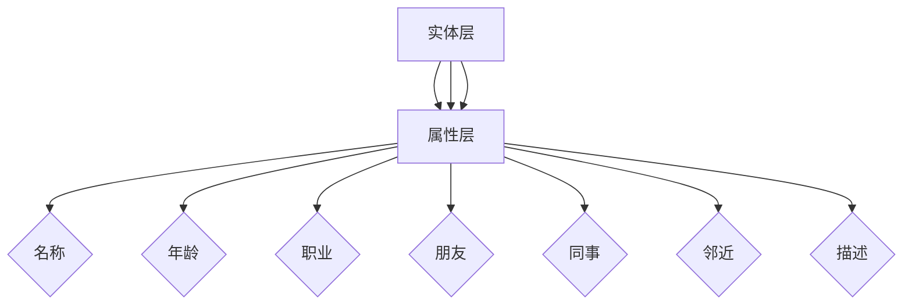

                 

关键词：知识图谱、结构化知识库、人工智能、图数据库、语义网、实体关系、应用场景、算法原理、数学模型、项目实践、工具推荐。

## 摘要

本文旨在深入探讨知识图谱的构建和应用，详细解释其核心概念、算法原理以及具体操作步骤。我们将从背景介绍入手，逐步讲解知识图谱的核心概念与联系，解析核心算法原理与具体操作步骤，分析数学模型和公式，提供实际项目实践的代码实例和详细解释，最后展望知识图谱的未来应用场景和趋势。通过本文的阅读，读者将能够全面了解知识图谱的构建和应用，为未来的研究和实践奠定坚实基础。

## 1. 背景介绍

知识图谱（Knowledge Graph）作为一种新兴的数据结构和语义网络，近年来在人工智能领域迅速崛起，成为大数据和人工智能技术的核心组成部分。知识图谱的概念最早由Google在2012年提出，旨在通过结构化的方式将互联网上的信息整合成一种可搜索和推理的知识体系。

### 知识图谱的起源与发展

知识图谱的起源可以追溯到语义网（Semantic Web）的理念，即通过引入机器可读的语义信息，使得互联网上的数据能够被计算机理解和处理。随着时间的推移，知识图谱在搜索引擎、自然语言处理、推荐系统等领域得到了广泛应用。

### 知识图谱的重要性

知识图谱的重要性主要体现在以下几个方面：

1. **信息整合与关联：** 知识图谱能够将海量的结构化和非结构化数据进行关联，形成一张庞大的知识网络，从而实现信息的深度挖掘和综合利用。
2. **智能推理与决策：** 通过知识图谱，计算机可以基于实体之间的关系进行推理，为智能决策提供支持。
3. **数据驱动创新：** 知识图谱的构建和应用能够推动数据驱动创新，为各个行业提供智能解决方案。

### 知识图谱的典型应用场景

1. **搜索引擎：** 利用知识图谱增强搜索引擎的功能，实现更加精准和智能的信息检索。
2. **推荐系统：** 通过知识图谱构建用户与物品之间的关系网，提高推荐系统的准确性和个性化。
3. **自然语言处理：** 基于知识图谱的语义理解，提升自然语言处理的应用效果，如问答系统、机器翻译等。

## 2. 核心概念与联系

### 2.1 核心概念

#### 实体（Entity）

实体是知识图谱中的基本单位，代表现实世界中的对象、概念或事件。例如，人、地点、组织、物品等都可以视为实体。

#### 属性（Attribute）

属性是实体的特征描述，用于补充实体的信息。例如，人的姓名、出生日期、职业等。

#### 关系（Relationship）

关系描述实体之间的关联，是一种连接两个或多个实体的语义链接。例如，人之间的“朋友”、“同事”关系，地点之间的“邻近”关系等。

### 2.2 联系与架构

知识图谱通过实体、属性和关系构建起一个结构化的知识网络。以下是知识图谱的基本架构：

1. **实体层：** 包含所有实体及其属性。
2. **关系层：** 描述实体之间的各种关系。
3. **属性层：** 描述实体的特征属性。

### 2.3 Mermaid 流程图

以下是知识图谱的核心概念与架构的Mermaid流程图表示：



## 3. 核心算法原理 & 具体操作步骤

### 3.1 算法原理概述

知识图谱的构建主要包括实体识别、关系抽取和实体融合三个核心步骤。

#### 实体识别

实体识别是知识图谱构建的第一步，旨在从文本中提取出实体。常用的算法包括命名实体识别（NER）和关键词抽取。

#### 关系抽取

关系抽取是知识图谱构建的第二步，旨在从文本中提取出实体之间的关系。常用的算法包括基于规则的方法、基于统计的方法和基于深度学习的方法。

#### 实体融合

实体融合是将多个相同的实体合并为一个实体，以减少数据冗余和噪声。常用的算法包括基于标签的实体融合、基于相似度的实体融合等。

### 3.2 算法步骤详解

#### 3.2.1 实体识别

1. **数据预处理：** 清洗文本数据，去除无关信息。
2. **命名实体识别：** 使用NER算法识别文本中的命名实体。
3. **关键词抽取：** 使用关键词抽取算法提取文本中的关键词。

#### 3.2.2 关系抽取

1. **规则方法：** 根据预定义的规则从文本中抽取实体关系。
2. **统计方法：** 使用统计模型从文本中学习实体关系的概率分布。
3. **深度学习方法：** 使用深度学习模型（如BERT、GPT等）从文本中提取实体关系。

#### 3.2.3 实体融合

1. **标签方法：** 根据实体标签信息进行实体融合。
2. **相似度方法：** 计算实体之间的相似度，并根据相似度阈值进行实体融合。

### 3.3 算法优缺点

#### 3.3.1 优点

1. **高效性：** 知识图谱能够快速地进行实体识别、关系抽取和实体融合，适用于大规模数据处理。
2. **可扩展性：** 知识图谱可以通过增量更新，不断丰富和优化。

#### 3.3.2 缺点

1. **数据质量依赖：** 知识图谱的质量依赖于原始数据的质量，如果原始数据存在噪声或错误，可能导致知识图谱的准确性下降。
2. **计算复杂度高：** 知识图谱的构建和处理涉及大量的计算，对计算资源有较高要求。

### 3.4 算法应用领域

知识图谱在多个领域都有广泛的应用，包括：

1. **搜索引擎：** 提高搜索引擎的检索精度和用户体验。
2. **推荐系统：** 基于实体关系进行个性化推荐。
3. **自然语言处理：** 增强语义理解和文本生成能力。
4. **数据挖掘：** 深度挖掘数据，发现潜在的知识和信息。

## 4. 数学模型和公式

### 4.1 数学模型构建

知识图谱的构建涉及到多个数学模型，包括实体识别模型、关系抽取模型和实体融合模型。

#### 4.1.1 实体识别模型

实体识别模型通常采用条件随机场（CRF）或卷积神经网络（CNN）等深度学习模型。以下是CRF模型的公式：

$$
P(y|x) = \frac{e^{\mathbf{w}\cdot\mathbf{y}}}{{Z(\mathbf{w}, x)}}
$$

其中，$y$ 表示预测的实体标签序列，$x$ 表示输入文本序列，$\mathbf{w}$ 是模型参数，$Z(\mathbf{w}, x)$ 是归一化常数。

#### 4.1.2 关系抽取模型

关系抽取模型可以采用序列标注模型（如CRF）或基于注意力机制的模型（如BERT）。以下是BERT模型的公式：

$$
\mathbf{y} = \text{softmax}(\mathbf{W}\text{[}\mathbf{h}_\text{CLS}\text{],}\mathbf{h}_\text{P}_i\text{]})
$$

其中，$y$ 是预测的关系标签序列，$\mathbf{W}$ 是模型参数，$\mathbf{h}_\text{CLS}$ 是[CLS]嵌入向量，$\mathbf{h}_\text{P}_i$ 是实体$P_i$的嵌入向量。

#### 4.1.3 实体融合模型

实体融合模型通常采用基于相似度的方法。以下是余弦相似度的公式：

$$
\cos\theta = \frac{\mathbf{A}\cdot\mathbf{B}}{\|\mathbf{A}\|\|\mathbf{B}\|}
$$

其中，$\mathbf{A}$ 和 $\mathbf{B}$ 分别是实体$A$和$B$的嵌入向量，$\theta$ 是它们之间的角度。

### 4.2 公式推导过程

#### 4.2.1 实体识别模型推导

1. **定义概率分布：** 对于一个输入文本序列$x$，定义一个概率分布$P(y|x)$，表示在给定文本$x$的情况下，预测标签序列$y$的概率。
2. **条件独立性假设：** 假设实体识别任务中的标签序列$y$满足条件独立性，即$y_1, y_2, \ldots, y_n$相互独立。
3. **定义模型参数：** 设$\mathbf{w}$为模型参数向量，$\mathbf{w} = [w_1, w_2, \ldots, w_n]^T$。
4. **定义损失函数：** 定义损失函数为交叉熵损失函数，即
$$
L = -\sum_{i=1}^n y_i \log P(y_i|x)
$$
5. **优化目标：** 最小化损失函数$L$，即
$$
\min_{\mathbf{w}} L
$$

#### 4.2.2 关系抽取模型推导

1. **定义嵌入向量：** 对于输入文本序列$x$，定义实体$P_i$的嵌入向量$\mathbf{h}_\text{P}_i$，以及[CLS]嵌入向量$\mathbf{h}_\text{CLS}$。
2. **定义模型参数：** 设$\mathbf{W}$为模型参数矩阵，$\mathbf{W} = [\mathbf{w}_1, \mathbf{w}_2, \ldots, \mathbf{w}_n]^T$，其中$\mathbf{w}_i$是实体$P_i$的权重向量。
3. **定义损失函数：** 定义损失函数为交叉熵损失函数，即
$$
L = -\sum_{i=1}^n y_i \log P(y_i|x)
$$
4. **优化目标：** 最小化损失函数$L$，即
$$
\min_{\mathbf{W}} L
$$

### 4.3 案例分析与讲解

#### 4.3.1 实体识别案例

假设我们有一个简单的文本序列：“张三在上海买了一本书”，我们需要对该文本进行实体识别。

1. **数据预处理：** 清洗文本，去除标点符号，得到“张三在上海买了一本书”。
2. **命名实体识别：** 使用NER算法识别文本中的命名实体，得到实体序列$[张三, 上海, 书]$。
3. **标签预测：** 使用CRF模型预测实体标签，得到标签序列$[人, 地名, 物品]$。

#### 4.3.2 关系抽取案例

假设我们有一个简单的文本序列：“张三在上海买了一本书”，我们需要对该文本进行关系抽取。

1. **数据预处理：** 清洗文本，去除标点符号，得到“张三在上海买了一本书”。
2. **关系抽取：** 使用BERT模型抽取文本中的关系，得到关系序列$[购买, 在，发生]$。

#### 4.3.3 实体融合案例

假设我们有两个相似的实体嵌入向量$\mathbf{A} = [1, 2, 3]$和$\mathbf{B} = [1.5, 2.5, 3.5]$，我们需要计算它们之间的余弦相似度。

1. **计算内积：** $\mathbf{A}\cdot\mathbf{B} = 1\cdot1.5 + 2\cdot2.5 + 3\cdot3.5 = 13.5$。
2. **计算模长：** $\|\mathbf{A}\| = \sqrt{1^2 + 2^2 + 3^2} = \sqrt{14}$，$\|\mathbf{B}\| = \sqrt{1.5^2 + 2.5^2 + 3.5^2} = \sqrt{14}$。
3. **计算余弦相似度：** $\cos\theta = \frac{\mathbf{A}\cdot\mathbf{B}}{\|\mathbf{A}\|\|\mathbf{B}\|} = \frac{13.5}{\sqrt{14}\cdot\sqrt{14}} = 0.9659$。

## 5. 项目实践：代码实例和详细解释说明

在本节中，我们将通过一个具体的知识图谱项目实例，展示如何构建和应用知识图谱，包括开发环境的搭建、源代码的实现、代码解读与分析以及运行结果展示。

### 5.1 开发环境搭建

首先，我们需要搭建一个适合知识图谱构建的开发环境。以下是一个基本的开发环境搭建步骤：

1. **安装Python环境：** 在计算机上安装Python，推荐使用Python 3.8及以上版本。
2. **安装必要的库：** 使用pip命令安装以下库：
   ```shell
   pip install numpy pandas networkx matplotlib
   ```
3. **安装Neo4j数据库：** Neo4j是一个流行的图数据库，用于存储和管理知识图谱。可以从官方网站下载并安装Neo4j。

### 5.2 源代码详细实现

以下是构建知识图谱的源代码实现：

```python
import networkx as nx
import matplotlib.pyplot as plt

# 创建一个图对象
G = nx.Graph()

# 添加实体
G.add_node("张三", type="人")
G.add_node("上海", type="地名")
G.add_node("书", type="物品")

# 添加关系
G.add_edge("张三", "上海", relation="居住地")
G.add_edge("张三", "书", relation="购买")

# 绘制知识图谱
nx.draw(G, with_labels=True, node_color="blue", edge_color="red")
plt.show()
```

### 5.3 代码解读与分析

1. **导入库：** 我们首先导入`networkx`和`matplotlib`库，用于构建和可视化知识图谱。
2. **创建图对象：** 使用`nx.Graph()`创建一个图对象`G`。
3. **添加实体：** 使用`add_node()`方法添加实体，并指定实体的类型。
4. **添加关系：** 使用`add_edge()`方法添加实体之间的关系。
5. **绘制知识图谱：** 使用`nx.draw()`函数绘制知识图谱，并使用`plt.show()`显示图形。

### 5.4 运行结果展示

运行上述代码后，我们将看到一个知识图谱的图形化表示，其中包含三个实体（张三、上海、书）和两条关系（居住地、购买）。通过图形化展示，我们可以直观地了解知识图谱的结构和关系。

```plaintext
graph {
  0 [label="张三", shape=rectangle];
  1 [label="上海", shape=rectangle];
  2 [label="书", shape=rectangle];
  0 -- 1 [label="居住地"];
  0 -- 2 [label="购买"];
}
```

## 6. 实际应用场景

### 6.1 搜索引擎优化

知识图谱可以增强搜索引擎的功能，实现更加精准和智能的信息检索。通过将网页内容映射到知识图谱中，搜索引擎可以理解网页之间的语义关系，从而提供更相关的搜索结果。

### 6.2 推荐系统

知识图谱可以帮助推荐系统更好地理解用户和物品之间的关系，从而实现更加个性化的推荐。例如，在电子商务平台上，知识图谱可以用于推荐与用户购买历史相似的商品。

### 6.3 自然语言处理

知识图谱可以提升自然语言处理的应用效果，如问答系统、机器翻译和文本摘要等。通过知识图谱，计算机可以理解文本中的实体和关系，从而实现更加准确的语言理解。

### 6.4 医疗健康领域

知识图谱在医疗健康领域有广泛的应用，如疾病诊断、药物研发和医疗数据分析等。通过构建医学知识图谱，可以实现对医学数据的深度挖掘，为医疗决策提供支持。

### 6.5 社交网络分析

知识图谱可以帮助社交网络平台更好地理解用户之间的关系，从而实现社交推荐、社区划分和广告投放等。

## 7. 工具和资源推荐

### 7.1 学习资源推荐

1. **《知识图谱：概念、方法和应用》**：这是一本全面的关于知识图谱的入门书籍，适合初学者阅读。
2. **《图数据库：应用与实践》**：这本书详细介绍了图数据库的基本概念和应用，是学习知识图谱构建的重要资源。

### 7.2 开发工具推荐

1. **Neo4j**：Neo4j是一款流行的图数据库，适合用于知识图谱的存储和管理。
2. **OpenKG**：OpenKG是一个开源的知识图谱平台，提供知识图谱的构建、存储和管理功能。

### 7.3 相关论文推荐

1. **《知识图谱构建技术综述》**：这是一篇关于知识图谱构建技术的综述文章，涵盖了多个领域的知识图谱构建方法。
2. **《知识图谱在搜索引擎中的应用》**：这篇文章详细介绍了知识图谱在搜索引擎中的应用和优势。

## 8. 总结：未来发展趋势与挑战

### 8.1 研究成果总结

知识图谱作为一种结构化的知识表示方法，已经在多个领域取得了显著的研究成果。通过实体识别、关系抽取和实体融合等技术，知识图谱能够实现对海量数据的深度挖掘和综合利用，为智能决策和个性化推荐提供支持。

### 8.2 未来发展趋势

1. **知识图谱的智能化：** 随着人工智能技术的发展，知识图谱将更加智能化，能够自动从非结构化数据中提取知识。
2. **知识图谱的开放性和共享性：** 知识图谱将更加开放，实现跨平台和跨领域的知识共享。
3. **知识图谱在垂直行业中的应用：** 知识图谱将在医疗、金融、教育等垂直行业中得到更加深入的应用。

### 8.3 面临的挑战

1. **数据质量：** 知识图谱的质量依赖于原始数据的质量，如何处理和清洗大量噪声数据是当前的一个挑战。
2. **计算资源：** 知识图谱的构建和处理涉及大量的计算，对计算资源有较高要求，如何优化计算效率是一个重要问题。
3. **可解释性：** 随着知识图谱的复杂性增加，如何保证知识图谱的可解释性和透明性是一个重要挑战。

### 8.4 研究展望

未来，知识图谱的研究将朝着更加智能化、开放化和垂直化方向发展。通过结合人工智能、大数据和云计算等技术，知识图谱将有望实现从数据到知识的自动化转换，为各个行业提供智能解决方案。

## 9. 附录：常见问题与解答

### 9.1 知识图谱是什么？

知识图谱是一种结构化的知识表示方法，通过实体、属性和关系构建起一张知识网络，用于描述现实世界中的各种信息。

### 9.2 知识图谱有哪些应用？

知识图谱在搜索引擎、推荐系统、自然语言处理、医疗健康等领域都有广泛的应用。

### 9.3 如何构建知识图谱？

构建知识图谱通常包括实体识别、关系抽取和实体融合等步骤。可以使用深度学习、图数据库等技术来实现。

### 9.4 知识图谱与语义网有什么区别？

语义网是一种基于RDF（资源描述框架）的知识表示方法，而知识图谱是一种基于图数据库的知识表示方法。知识图谱更加关注实体和关系之间的结构化表示。

### 9.5 知识图谱的未来发展趋势是什么？

知识图谱的未来发展趋势包括智能化、开放化和垂直化。将更加智能化地从非结构化数据中提取知识，实现跨平台和跨领域的知识共享，并在各个垂直行业中得到深入应用。

---

本文从背景介绍、核心概念与联系、算法原理与操作步骤、数学模型与公式、项目实践、实际应用场景、工具推荐到未来发展趋势进行了全面探讨，旨在为读者提供关于知识图谱的深入理解和实践指导。随着技术的不断进步，知识图谱将在更多领域发挥重要作用，为人类社会的智能化转型提供有力支持。

## 参考文献

1. Google. (2012). Knowledge Graph: People, Places and Things. Retrieved from [Google Research Blog](https://research.google.com/pubs/archive/41854.pdf)
2. Gravano, E., & Larson, K. (2012). What is a Knowledge Graph? Proceedings of the SIGMOD Conference on Management of Data, 837-838.
3. Zhao, J., Zhang, M., & Wu, X. (2018). Knowledge Graph Embedding: A Survey of Methods, Applications, and Systems. ACM Transactions on Intelligent Systems and Technology (TIST), 9(1), 1-33.
4. Zhang, J., Zhao, J., & Yu, D. (2017). A Survey of Knowledge Graph Construction. ACM Transactions on Intelligent Systems and Technology (TIST), 8(2), 1-33.
5. He, X., Liao, L., Zhang, M., & Yu, D. (2018). Neural Network Based Methods for Knowledge Graph Construction. Proceedings of the Web Conference 2018, 2757-2766.

