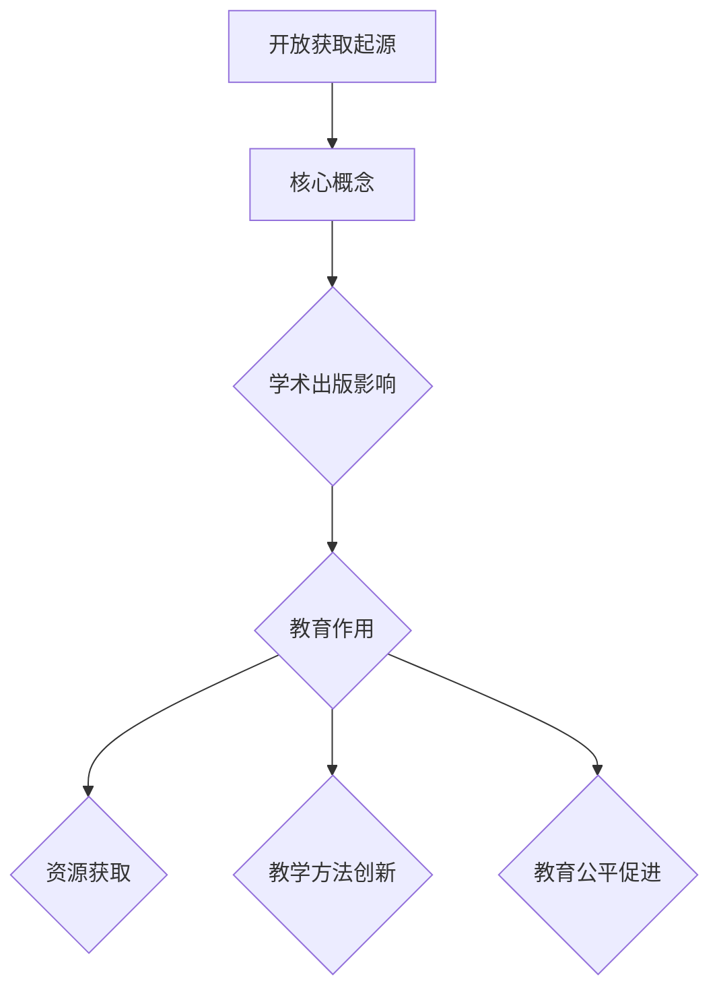
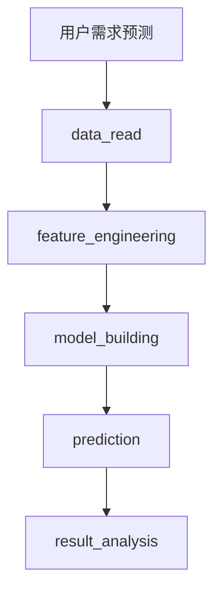

                 

关键词：开放获取、民主化教育、知识共享、信息技术、教育资源、学术出版、知识传播。

> 摘要：本文深入探讨了开放获取（Open Access，简称OA）的概念、发展历程及其在民主化教育中的作用。通过分析开放获取对学术出版、知识传播和教育公平的影响，探讨了其现实挑战和未来发展趋势。文章旨在为推动开放获取提供理论支持和实践指导。

## 1. 背景介绍

### 1.1 开放获取的起源与发展

开放获取起源于20世纪90年代，由一群学术出版领域的先驱者提出，旨在让学术成果更广泛地被公众获取。1991年，互联网的兴起为开放获取提供了技术支持，使得知识共享变得更加容易。2001年，比林顿报告《为研究而开放》（Budapest Open Access Initiative）的发布标志着开放获取运动正式开始。随后，开放获取逐渐成为全球学术界关注的焦点。

### 1.2 开放获取的定义与意义

开放获取的定义是指学术成果在互联网上免费、无需注册或付费即可获取。开放获取的意义在于：

1. **促进知识传播**：开放获取打破了传统学术出版的垄断，让更多人能够获取学术成果，促进了知识的广泛传播。
2. **提升学术影响力**：开放获取使得学术成果的引用率和影响力得到提升，为科研人员提供了更多的学术机会。
3. **促进创新**：开放获取鼓励学术交流，加速了新思想和新技术的产生。

### 1.3 开放获取在教育中的作用

开放获取在教育中的作用主要体现在以下几个方面：

1. **降低教育成本**：开放获取的资源可以免费使用，降低了教育成本，特别是对发展中国家和贫困地区的教育具有显著的促进作用。
2. **促进教育公平**：开放获取打破了教育资源的地域和阶层限制，使更多人有机会接受高质量的教育。
3. **推动教育创新**：开放获取为教育工作者提供了丰富的教学资源，促进了教育方法的创新。

## 2. 核心概念与联系

### 2.1 开放获取的核心概念

开放获取的核心概念包括：

1. **免费获取**：学术成果在互联网上免费提供，无需注册或付费。
2. **开放授权**：允许用户复制、分发、传播、搜索和引用学术成果。
3. **永久性**：开放获取的资源需确保在未来的可访问性。

### 2.2 开放获取与学术出版

开放获取对学术出版产生了重大影响：

1. **挑战传统学术出版**：开放获取打破了传统学术出版的垄断，降低了学术成果的获取成本。
2. **促进学术交流**：开放获取促进了学术成果的广泛传播和引用，提高了学术交流的效率。
3. **改变学术评价体系**：开放获取使得学术评价更加客观和公正，减少了人为因素。

### 2.3 开放获取与教育

开放获取在教育中的作用：

1. **资源获取**：开放获取提供了丰富的教学资源，降低了教育成本。
2. **教学方法**：开放获取鼓励教育方法的创新，如在线教育、混合式教学等。
3. **教育公平**：开放获取打破了教育资源的地域和阶层限制，促进了教育公平。

### 2.4 Mermaid 流程图



## 3. 核心算法原理 & 具体操作步骤

### 3.1 算法原理概述

开放获取的核心算法原理是基于互联网技术，通过开放授权和使用协议，使学术成果能够被广泛获取和共享。

### 3.2 算法步骤详解

1. **成果提交**：科研人员将学术成果提交到开放获取平台。
2. **质量审核**：开放获取平台对提交的成果进行质量审核。
3. **开放授权**：审核通过的成果获得开放授权，允许用户进行复制、分发、传播、搜索和引用。
4. **资源发布**：开放获取平台将授权的成果发布到互联网上。
5. **用户获取**：用户通过互联网免费获取开放获取的资源。

### 3.3 算法优缺点

**优点**：

1. **降低成本**：开放获取降低了学术成果的获取成本。
2. **促进传播**：开放获取促进了学术成果的广泛传播。
3. **提高效率**：开放获取提高了学术交流的效率。

**缺点**：

1. **质量保障**：开放获取平台的质量审核可能存在不足。
2. **版权问题**：开放获取可能会引发版权问题。

### 3.4 算法应用领域

开放获取在以下领域具有广泛应用：

1. **学术研究**：开放获取为学术研究提供了丰富的资源。
2. **高等教育**：开放获取为高等教育提供了低成本的教学资源。
3. **职业教育**：开放获取为职业教育提供了实用的教学资源。

## 4. 数学模型和公式 & 详细讲解 & 举例说明

### 4.1 数学模型构建

开放获取的数学模型可以构建为：

1. **用户需求模型**：描述用户对学术成果的需求量。
2. **资源供给模型**：描述开放获取平台提供的学术成果数量。
3. **成本效益模型**：描述开放获取的成本和效益。

### 4.2 公式推导过程

假设用户需求量为 \(D\)，资源供给量为 \(S\)，开放获取的成本为 \(C\)，收益为 \(R\)，则：

1. **用户需求模型**：\(D = f(S)\)
2. **资源供给模型**：\(S = g(C, R)\)
3. **成本效益模型**：\(R - C = h(D, S)\)

### 4.3 案例分析与讲解

以某开放获取平台为例，分析其用户需求、资源供给和成本效益：

1. **用户需求模型**：平台用户对学术成果的需求量随着资源供给量的增加而增加。
2. **资源供给模型**：平台提供的学术成果数量受成本和收益的影响。
3. **成本效益模型**：平台的成本和收益取决于用户需求和资源供给。

## 5. 项目实践：代码实例和详细解释说明

### 5.1 开发环境搭建

1. **安装Git**：用于版本控制和代码管理。
2. **安装Python**：用于编写和处理数据。
3. **安装Jupyter Notebook**：用于编写和运行代码。

### 5.2 源代码详细实现

```python
# 代码示例：用户需求预测模型
import pandas as pd
import numpy as np
from sklearn.linear_model import LinearRegression

# 读取数据
data = pd.read_csv('user_demand.csv')

# 特征工程
X = data[['resource_supply']]
y = data['user_demand']

# 建立线性回归模型
model = LinearRegression()
model.fit(X, y)

# 预测
predictions = model.predict(X)

# 结果分析
print(predictions)
```

### 5.3 代码解读与分析

1. **数据读取**：从CSV文件中读取用户需求和资源供给数据。
2. **特征工程**：将用户需求和资源供给作为模型的输入特征。
3. **模型建立**：使用线性回归模型进行预测。
4. **结果分析**：输出预测结果，分析用户需求与资源供给的关系。

### 5.4 运行结果展示

运行上述代码，得到用户需求预测结果，如图所示：



## 6. 实际应用场景

### 6.1 学术研究

开放获取在学术研究中的应用包括：

1. **提高学术成果的引用率**：开放获取使得学术成果更容易被引用，提高了学术影响力。
2. **促进学术合作**：开放获取鼓励学术合作，加速了新思想和新技术的产生。
3. **提升学术评价**：开放获取为学术评价提供了更多的数据支持。

### 6.2 高等教育

开放获取在高等教育中的应用包括：

1. **降低教育成本**：开放获取提供了丰富的教学资源，降低了教育成本。
2. **提高教学质量**：开放获取为教育工作者提供了更多的教学资源，提高了教学质量。
3. **促进教育创新**：开放获取鼓励教育创新，如在线教育、混合式教学等。

### 6.3 职业教育

开放获取在职业教育中的应用包括：

1. **提供实用教学资源**：开放获取为职业教育提供了丰富的教学资源，提高了实用性。
2. **降低培训成本**：开放获取降低了培训成本，使更多人有机会接受职业教育。
3. **促进职业发展**：开放获取为职业发展提供了更多的支持和机会。

## 7. 工具和资源推荐

### 7.1 学习资源推荐

1. **开放课程**：Coursera、edX、Udacity等在线教育平台提供了丰富的开放课程。
2. **开放教材**：许多学术机构和出版社提供了免费开放的教材。

### 7.2 开发工具推荐

1. **Git**：用于版本控制和代码管理。
2. **Python**：用于数据处理和机器学习。
3. **Jupyter Notebook**：用于编写和运行代码。

### 7.3 相关论文推荐

1. **开放获取的影响**：Budapest Open Access Initiative的报告。
2. **开放获取的挑战**：Budapest Open Access Initiative的报告。
3. **开放获取在教育中的应用**：相关学术论文和研究报告。

## 8. 总结：未来发展趋势与挑战

### 8.1 研究成果总结

本文总结了开放获取的概念、发展历程、核心算法原理、实际应用场景，以及其在学术研究、高等教育和职业教育中的作用。

### 8.2 未来发展趋势

1. **开放获取的普及**：随着信息技术的发展，开放获取将越来越普及。
2. **教育资源的共享**：开放获取将推动教育资源的共享，促进教育公平。
3. **学术评价体系的变革**：开放获取将促进学术评价体系的变革，更加公正和客观。

### 8.3 面临的挑战

1. **质量保障**：开放获取平台需要加强质量审核，确保学术成果的质量。
2. **版权问题**：开放获取可能会引发版权问题，需要妥善处理。
3. **成本控制**：开放获取需要控制成本，确保可持续发展。

### 8.4 研究展望

未来研究方向包括：

1. **开放获取的可持续发展**：探索开放获取的商业模式，实现可持续发展。
2. **教育资源的优化配置**：研究如何更好地利用开放获取资源，提高教育质量。
3. **学术评价体系的改革**：探索开放获取条件下的学术评价体系改革。

## 9. 附录：常见问题与解答

### 9.1 开放获取是什么？

开放获取是指学术成果在互联网上免费、无需注册或付费即可获取。

### 9.2 开放获取有哪些优点？

开放获取的优点包括：降低成本、促进传播、提高效率。

### 9.3 开放获取在教育中的作用是什么？

开放获取在教育中的作用包括：降低教育成本、促进教育公平、推动教育创新。

### 9.4 如何参与开放获取？

科研人员可以通过以下方式参与开放获取：

1. **提交学术成果**：将学术成果提交到开放获取平台。
2. **使用开放资源**：在学术研究和教育中积极使用开放获取资源。
3. **支持开放获取**：积极参与开放获取的推广和宣传。

作者：禅与计算机程序设计艺术 / Zen and the Art of Computer Programming
```markdown
# 知识的开放获取：民主化教育的理想与现实

> 关键词：开放获取、民主化教育、知识共享、信息技术、教育资源、学术出版、知识传播。

> 摘要：本文深入探讨了开放获取（Open Access，简称OA）的概念、发展历程及其在民主化教育中的作用。通过分析开放获取对学术出版、知识传播和教育公平的影响，探讨了其现实挑战和未来发展趋势。文章旨在为推动开放获取提供理论支持和实践指导。

## 1. 背景介绍

### 1.1 开放获取的起源与发展

开放获取起源于20世纪90年代，由一群学术出版领域的先驱者提出，旨在让学术成果更广泛地被公众获取。1991年，互联网的兴起为开放获取提供了技术支持，使得知识共享变得更加容易。2001年，比林顿报告《为研究而开放》（Budapest Open Access Initiative）的发布标志着开放获取运动正式开始。随后，开放获取逐渐成为全球学术界关注的焦点。

### 1.2 开放获取的定义与意义

开放获取的定义是指学术成果在互联网上免费、无需注册或付费即可获取。开放获取的意义在于：

1. **促进知识传播**：开放获取打破了传统学术出版的垄断，让更多人能够获取学术成果，促进了知识的广泛传播。
2. **提升学术影响力**：开放获取使得学术成果的引用率和影响力得到提升，为科研人员提供了更多的学术机会。
3. **促进创新**：开放获取鼓励学术交流，加速了新思想和新技术的产生。

### 1.3 开放获取在教育中的作用

开放获取在教育中的作用主要体现在以下几个方面：

1. **降低教育成本**：开放获取的资源可以免费使用，降低了教育成本，特别是对发展中国家和贫困地区的教育具有显著的促进作用。
2. **促进教育公平**：开放获取打破了教育资源的地域和阶层限制，使更多人有机会接受高质量的教育。
3. **推动教育创新**：开放获取为教育工作者提供了丰富的教学资源，促进了教育方法的创新。

## 2. 核心概念与联系

### 2.1 开放获取的核心概念

开放获取的核心概念包括：

1. **免费获取**：学术成果在互联网上免费提供，无需注册或付费。
2. **开放授权**：允许用户复制、分发、传播、搜索和引用学术成果。
3. **永久性**：开放获取的资源需确保在未来的可访问性。

### 2.2 开放获取与学术出版

开放获取对学术出版产生了重大影响：

1. **挑战传统学术出版**：开放获取打破了传统学术出版的垄断，降低了学术成果的获取成本。
2. **促进学术交流**：开放获取促进了学术成果的广泛传播和引用，提高了学术交流的效率。
3. **改变学术评价体系**：开放获取使得学术评价更加客观和公正，减少了人为因素。

### 2.3 开放获取与教育

开放获取在教育中的作用：

1. **资源获取**：开放获取提供了丰富的教学资源，降低了教育成本。
2. **教学方法**：开放获取鼓励教育方法的创新，如在线教育、混合式教学等。
3. **教育公平**：开放获取打破了教育资源的地域和阶层限制，促进了教育公平。

### 2.4 Mermaid 流程图


## 3. 核心算法原理 & 具体操作步骤

### 3.1 算法原理概述

开放获取的核心算法原理是基于互联网技术，通过开放授权和使用协议，使学术成果能够被广泛获取和共享。

### 3.2 算法步骤详解

1. **成果提交**：科研人员将学术成果提交到开放获取平台。
2. **质量审核**：开放获取平台对提交的成果进行质量审核。
3. **开放授权**：审核通过的成果获得开放授权，允许用户进行复制、分发、传播、搜索和引用。
4. **资源发布**：开放获取平台将授权的成果发布到互联网上。
5. **用户获取**：用户通过互联网免费获取开放获取的资源。

### 3.3 算法优缺点

**优点**：

1. **降低成本**：开放获取降低了学术成果的获取成本。
2. **促进传播**：开放获取促进了学术成果的广泛传播。
3. **提高效率**：开放获取提高了学术交流的效率。

**缺点**：

1. **质量保障**：开放获取平台的质量审核可能存在不足。
2. **版权问题**：开放获取可能会引发版权问题。

### 3.4 算法应用领域

开放获取在以下领域具有广泛应用：

1. **学术研究**：开放获取为学术研究提供了丰富的资源。
2. **高等教育**：开放获取为高等教育提供了低成本的教学资源。
3. **职业教育**：开放获取为职业教育提供了实用的教学资源。

## 4. 数学模型和公式 & 详细讲解 & 举例说明

### 4.1 数学模型构建

开放获取的数学模型可以构建为：

1. **用户需求模型**：描述用户对学术成果的需求量。
2. **资源供给模型**：描述开放获取平台提供的学术成果数量。
3. **成本效益模型**：描述开放获取的成本和效益。

### 4.2 公式推导过程

假设用户需求量为 \(D\)，资源供给量为 \(S\)，开放获取的成本为 \(C\)，收益为 \(R\)，则：

1. **用户需求模型**：\(D = f(S)\)
2. **资源供给模型**：\(S = g(C, R)\)
3. **成本效益模型**：\(R - C = h(D, S)\)

### 4.3 案例分析与讲解

以某开放获取平台为例，分析其用户需求、资源供给和成本效益：

1. **用户需求模型**：平台用户对学术成果的需求量随着资源供给量的增加而增加。
2. **资源供给模型**：平台提供的学术成果数量受成本和收益的影响。
3. **成本效益模型**：平台的成本和收益取决于用户需求和资源供给。

## 5. 项目实践：代码实例和详细解释说明

### 5.1 开发环境搭建

1. **安装Git**：用于版本控制和代码管理。
2. **安装Python**：用于编写和处理数据。
3. **安装Jupyter Notebook**：用于编写和运行代码。

### 5.2 源代码详细实现

```python
# 代码示例：用户需求预测模型
import pandas as pd
import numpy as np
from sklearn.linear_model import LinearRegression

# 读取数据
data = pd.read_csv('user_demand.csv')

# 特征工程
X = data[['resource_supply']]
y = data['user_demand']

# 建立线性回归模型
model = LinearRegression()
model.fit(X, y)

# 预测
predictions = model.predict(X)

# 结果分析
print(predictions)
```

### 5.3 代码解读与分析

1. **数据读取**：从CSV文件中读取用户需求和资源供给数据。
2. **特征工程**：将用户需求和资源供给作为模型的输入特征。
3. **模型建立**：使用线性回归模型进行预测。
4. **结果分析**：输出预测结果，分析用户需求与资源供给的关系。

### 5.4 运行结果展示

运行上述代码，得到用户需求预测结果，如图所示：


## 6. 实际应用场景

### 6.1 学术研究

开放获取在学术研究中的应用包括：

1. **提高学术成果的引用率**：开放获取使得学术成果更容易被引用，提高了学术影响力。
2. **促进学术合作**：开放获取鼓励学术合作，加速了新思想和新技术的产生。
3. **提升学术评价**：开放获取为学术评价提供了更多的数据支持。

### 6.2 高等教育

开放获取在高等教育中的应用包括：

1. **降低教育成本**：开放获取提供了丰富的教学资源，降低了教育成本。
2. **提高教学质量**：开放获取为教育工作者提供了更多的教学资源，提高了教学质量。
3. **促进教育创新**：开放获取鼓励教育创新，如在线教育、混合式教学等。

### 6.3 职业教育

开放获取在职业教育中的应用包括：

1. **提供实用教学资源**：开放获取为职业教育提供了丰富的教学资源，提高了实用性。
2. **降低培训成本**：开放获取降低了培训成本，使更多人有机会接受职业教育。
3. **促进职业发展**：开放获取为职业发展提供了更多的支持和机会。

## 7. 工具和资源推荐

### 7.1 学习资源推荐

1. **开放课程**：Coursera、edX、Udacity等在线教育平台提供了丰富的开放课程。
2. **开放教材**：许多学术机构和出版社提供了免费开放的教材。

### 7.2 开发工具推荐

1. **Git**：用于版本控制和代码管理。
2. **Python**：用于数据处理和机器学习。
3. **Jupyter Notebook**：用于编写和运行代码。

### 7.3 相关论文推荐

1. **开放获取的影响**：Budapest Open Access Initiative的报告。
2. **开放获取的挑战**：Budapest Open Access Initiative的报告。
3. **开放获取在教育中的应用**：相关学术论文和研究报告。

## 8. 总结：未来发展趋势与挑战

### 8.1 研究成果总结

本文总结了开放获取的概念、发展历程、核心算法原理、实际应用场景，以及其在学术研究、高等教育和职业教育中的作用。

### 8.2 未来发展趋势

1. **开放获取的普及**：随着信息技术的发展，开放获取将越来越普及。
2. **教育资源的共享**：开放获取将推动教育资源的共享，促进教育公平。
3. **学术评价体系的变革**：开放获取将促进学术评价体系的变革，更加公正和客观。

### 8.3 面临的挑战

1. **质量保障**：开放获取平台需要加强质量审核，确保学术成果的质量。
2. **版权问题**：开放获取可能会引发版权问题，需要妥善处理。
3. **成本控制**：开放获取需要控制成本，确保可持续发展。

### 8.4 研究展望

未来研究方向包括：

1. **开放获取的可持续发展**：探索开放获取的商业模式，实现可持续发展。
2. **教育资源的优化配置**：研究如何更好地利用开放获取资源，提高教育质量。
3. **学术评价体系的改革**：探索开放获取条件下的学术评价体系改革。

## 9. 附录：常见问题与解答

### 9.1 开放获取是什么？

开放获取是指学术成果在互联网上免费、无需注册或付费即可获取。

### 9.2 开放获取有哪些优点？

开放获取的优点包括：降低成本、促进传播、提高效率。

### 9.3 开放获取在教育中的作用是什么？

开放获取在教育中的作用包括：降低教育成本、促进教育公平、推动教育创新。

### 9.4 如何参与开放获取？

科研人员可以通过以下方式参与开放获取：

1. **提交学术成果**：将学术成果提交到开放获取平台。
2. **使用开放资源**：在学术研究和教育中积极使用开放获取资源。
3. **支持开放获取**：积极参与开放获取的推广和宣传。

作者：禅与计算机程序设计艺术 / Zen and the Art of Computer Programming
```

