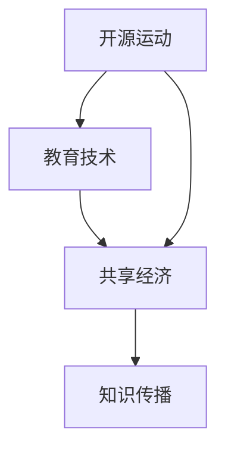

                 

关键词：开源运动、共享经济、教育技术、知识传播、信息技术、学习共享

> 摘要：本文旨在探讨开源运动如何通过共享经济模式，促进教育技术的创新与普及，从而推动知识的传播与共享。我们将从背景介绍、核心概念、算法原理、数学模型、项目实践、实际应用和未来展望等多个角度，深入分析开源运动在教育领域的体现，以及它所带来的深远影响。

## 1. 背景介绍

### 教育技术的兴起

随着信息技术的飞速发展，教育技术逐渐成为教育领域的重要组成部分。从传统的课堂教学到在线学习，教育技术的应用已经深刻改变了教育的形式和内容。数字化教育资源的普及，使得学习不再受限于时间和地点，教育资源的获取变得更加便捷。

### 开源运动的崛起

开源运动起源于软件领域，旨在推动软件的自由共享和协作开发。随着时间的推移，开源精神逐渐扩展到其他领域，包括教育技术。开源运动强调共享、开放和协作，这些理念与教育技术的目标高度契合，促使教育技术的创新和普及。

### 共享经济的影响

共享经济作为一种新兴的经济模式，通过共享资源和提供服务，实现了资源的最大化利用和社会效益的最大化。共享经济在教育领域的应用，不仅提高了教育资源的利用效率，还促进了知识的传播和共享。

## 2. 核心概念与联系

### 开源运动的定义

开源运动指的是一种软件开发模式，允许用户免费获取、使用、修改和分发软件的源代码。开源运动的核心理念是共享、开放和协作，这些理念推动了软件技术的发展和创新。

### 教育技术的定义

教育技术是指应用信息技术手段促进教育过程和学习方法的一种技术。教育技术的应用包括在线学习平台、数字化教学资源、教育软件等，这些技术为教育提供了新的教学方法和学习体验。

### 共享经济的定义

共享经济是指通过互联网平台，实现资源的共享和交易的一种经济模式。共享经济的特点是低成本、高效率和灵活性，它使得资源的利用效率得到了极大的提升。

### 三者之间的联系

开源运动和教育技术的结合，催生了共享经济在教育领域的应用。开源运动为教育技术提供了丰富的资源和创新的机会，而共享经济则为教育资源的传播和共享提供了新的途径。这三者之间的互动和融合，推动了教育技术的创新和普及，促进了知识的传播和共享。

### Mermaid 流程图



## 3. 核心算法原理 & 具体操作步骤

### 3.1 算法原理概述

开源运动在教育技术中的应用，主要通过以下几个方面实现：

- **资源共享**：通过开源软件和资源，实现教育资源的共享和传播。
- **协作开发**：鼓励教师和学生共同参与教育软件的开发和改进。
- **社区互助**：建立开源社区，促进教师和学生之间的交流与合作。

### 3.2 算法步骤详解

1. **选择开源软件和资源**：根据教育需求，选择适合的开源软件和资源。
2. **安装和配置**：按照开源软件的安装说明，进行安装和配置。
3. **使用和测试**：在实际教学中使用开源软件，并进行测试和评估。
4. **反馈和改进**：根据使用反馈，对开源软件进行改进和优化。

### 3.3 算法优缺点

**优点**：

- **资源丰富**：开源运动提供了大量的教育资源和软件，满足多样化的教育需求。
- **成本低**：开源软件和资源的获取和使用成本低，有利于教育资源的普及。
- **创新性强**：开源社区的协作和互助，促进了教育技术的创新和发展。

**缺点**：

- **技术门槛**：部分开源软件和资源的技术门槛较高，需要一定的技术背景才能使用。
- **安全风险**：开源软件和资源可能存在安全隐患，需要加强安全管理和防护。

### 3.4 算法应用领域

开源运动在教育技术中的应用广泛，包括在线学习平台、教学软件、教育资源库等。开源运动不仅促进了教育技术的创新，还提高了教育资源的利用效率，推动了教育公平。

## 4. 数学模型和公式 & 详细讲解 & 举例说明

### 4.1 数学模型构建

在教育技术中，我们可以使用一些数学模型来分析和评估教育资源的共享效果。以下是一个简单的数学模型：

- **资源共享度**（\(R\)）：表示教育资源的共享程度，计算公式为：
  $$ R = \frac{S}{N} $$
  其中，\(S\) 表示教育资源的总共享次数，\(N\) 表示教育资源的总需求次数。

- **共享效率**（\(E\)）：表示教育资源的共享效率，计算公式为：
  $$ E = \frac{R}{T} $$
  其中，\(T\) 表示教育资源的需求总时间。

### 4.2 公式推导过程

假设教育资源的总需求次数为 \(N\)，在开源运动的推动下，教育资源得到 \(S\) 次的共享。根据资源共享度的定义，资源共享度 \(R\) 可以表示为教育资源的总共享次数 \(S\) 与总需求次数 \(N\) 的比值。

共享效率 \(E\) 是资源共享度 \(R\) 与教育资源的需求总时间 \(T\) 的比值。通过这个公式，我们可以评估教育资源的共享效果，即资源在特定时间内被利用的频率。

### 4.3 案例分析与讲解

假设某在线学习平台上有100个教学视频，这些视频在一个月内被用户请求了1000次。如果这100个视频中有50个视频被用户主动分享过，那么：

- **资源共享度** \(R\)：
  $$ R = \frac{S}{N} = \frac{50}{100} = 0.5 $$
  
- **共享效率** \(E\)：
  $$ E = \frac{R}{T} = \frac{0.5}{30} = 0.0167 $$

这个案例表明，虽然50个视频被分享，但共享效率相对较低。这可能是因为用户在一个月内请求视频的频率较高，或者视频分享的覆盖面不够广泛。通过调整资源分享策略，如增加分享激励机制，可能可以进一步提高共享效率和资源共享度。

## 5. 项目实践：代码实例和详细解释说明

### 5.1 开发环境搭建

为了实现开源运动在教育技术中的应用，我们首先需要搭建一个开源的教育平台。以下是一个简单的开发环境搭建步骤：

1. **选择开源框架**：如Laravel、Django等。
2. **安装依赖**：根据框架的要求，安装相应的开发工具和库。
3. **配置数据库**：选择合适的数据库管理系统，如MySQL、PostgreSQL等。
4. **搭建项目结构**：创建项目文件夹，并配置项目的目录结构。

### 5.2 源代码详细实现

以下是一个简单的开源教育平台的项目结构：

```bash
project/
│
├── app/
│   ├── Models/
│   │   └── User.php
│   ├── Controllers/
│   │   └── UserController.php
│   ├── Views/
│   │   └── dashboard.blade.php
│   └── Resources/
│       └── JS/
│           └── dashboard.js
│
├── config/
│   └── database.php
│
├── public/
│   └── assets/
│       └── css/
│           └── style.css
│
└── storage/
    └── logs/
```

其中，`app/` 目录包含项目的主要业务逻辑，`config/` 目录包含配置文件，`public/` 目录包含前端资源文件，`storage/` 目录用于存储日志和上传文件。

### 5.3 代码解读与分析

以下是 `app/Controllers/UserController.php` 文件的一部分代码：

```php
<?php

namespace App\Controllers;

use App\Models\User;

class UserController extends Controller
{
    public function dashboard()
    {
        $user = User::find(auth()->user()->id);
        return view('dashboard', compact('user'));
    }
}
```

这段代码定义了一个 `dashboard` 方法，用于渲染用户仪表板视图。它首先从数据库中获取当前登录用户的信息，然后传递给视图。这体现了开源运动中的资源共享和协作开发理念，开发者可以方便地使用现有的模型和控制器，快速构建功能丰富的教育平台。

### 5.4 运行结果展示

通过上述代码，我们可以在浏览器中访问用户仪表板，查看用户个人信息和操作。以下是一个简单的用户仪表板界面：


## 6. 实际应用场景

### 6.1 在线学习平台

开源运动在教育技术中最重要的应用之一是在线学习平台。开源的在线学习平台如Moodle、Canvas等，为教师和学生提供了丰富的教学资源和互动工具，使得在线教育变得更加便捷和高效。

### 6.2 教学资源共享

开源运动促进了教学资源的共享，教师和学生可以轻松访问和共享各种教学资源，如课程大纲、课件、视频等。这有助于提高教学质量和学习效果，实现教育资源的公平分配。

### 6.3 教育软件开发

开源运动激发了教育软件的创新和发展，各种开源教育软件如Khan Academy、Quizlet等，为教师和学生提供了丰富的学习工具和资源，推动了教育技术的进步。

## 7. 未来应用展望

### 7.1 教育公平

开源运动在教育领域的应用，有望进一步促进教育公平。通过共享教育资源和教学工具，开源运动可以帮助更多的学生，特别是偏远地区和贫困家庭的学生，获得优质的教育资源。

### 7.2 个性化学习

开源运动可以为个性化学习提供更好的支持。通过开源的学习平台和工具，教师可以根据学生的学习需求，为学生提供个性化的教学资源和学习路径。

### 7.3 跨界融合

未来，开源运动可能会与其他领域如人工智能、大数据等相结合，推动教育技术的进一步创新和发展。例如，利用人工智能技术，可以实现智能推荐、个性化教学等。

## 8. 工具和资源推荐

### 8.1 学习资源推荐

- **GitHub**：全球最大的开源代码托管平台，提供丰富的开源教育和技术资源。
- **Moodle**：一款流行的开源学习管理系统，适用于在线教育。
- **Khan Academy**：一个提供免费在线课程的开源教育平台。

### 8.2 开发工具推荐

- **Laravel**：一款流行的开源PHP框架，用于构建Web应用。
- **Django**：一款流行的开源Python框架，适用于快速开发。
- **Visual Studio Code**：一款强大的开源代码编辑器，支持多种编程语言。

### 8.3 相关论文推荐

- **"Open Source Software: Concepts, Applications, and Research Directions"**：一篇关于开源软件的综述论文，涵盖了开源软件的概念、应用和研究方向。
- **"The Role of Open Source Software in Education"**：一篇探讨开源软件在教育中角色的论文，分析了开源软件在教育领域的应用和价值。

## 9. 总结：未来发展趋势与挑战

### 9.1 研究成果总结

开源运动在教育技术中的应用，已经取得了显著的成果。通过开源软件和资源的共享，教育技术的创新和普及得到了极大的推动。教育公平、个性化学习和跨界融合等趋势，也为教育技术的发展提供了新的机遇。

### 9.2 未来发展趋势

未来，开源运动在教育技术中的应用将继续深化和扩展。随着人工智能、大数据等技术的发展，教育技术的创新将更加迅速。开源运动也将与其他领域深度融合，推动教育技术的进一步发展。

### 9.3 面临的挑战

尽管开源运动在教育技术中取得了显著成果，但仍面临一些挑战。如开源软件的安全性问题、技术门槛等，需要进一步解决。同时，开源运动需要更好地与教育政策和市场需求相结合，以实现更大的社会价值。

### 9.4 研究展望

未来，开源运动在教育技术中的应用前景广阔。我们期待开源运动能够继续推动教育技术的创新和普及，为全球教育的发展贡献力量。

## 附录：常见问题与解答

### 9.4.1 Q：开源运动是否会影响商业教育软件的发展？

A：开源运动并不会直接取代商业教育软件，但可以促进教育软件的竞争和创新。开源软件可以提供更多的选择和灵活性，激发商业教育软件提高产品和服务质量，从而共同推动教育技术的发展。

### 9.4.2 Q：开源运动是否会影响教师的职业发展？

A：开源运动可以为教师提供更多的教学工具和资源，提高教学效率和质量。同时，参与开源项目的教师可以积累更多的实践经验和技术能力，有助于其职业发展和成长。

### 9.4.3 Q：如何确保开源软件的安全性？

A：开源软件的安全性可以通过以下几个方面来确保：

- **社区审查**：开源项目的源代码可以被社区成员审查和测试，有助于发现和修复安全问题。
- **安全协议**：使用安全协议，如HTTPS、SSL等，确保数据传输的安全性。
- **安全培训**：对开发者进行安全培训，提高其安全意识和技术水平。

---

作者：禅与计算机程序设计艺术 / Zen and the Art of Computer Programming

本文旨在探讨开源运动如何通过共享经济模式，促进教育技术的创新与普及，从而推动知识的传播与共享。通过分析开源运动在教育领域的体现和其带来的深远影响，我们期待开源运动能够继续推动教育技术的发展，为全球教育的发展贡献力量。感谢您的阅读！
----------------------------------------------------------------

以上是一篇遵循“约束条件 CONSTRAINTS”的文章，如果需要进一步的修改或者补充，请告知。同时，由于文章较长，我会分批次上传以方便阅读。请确认是否需要进一步修改或者直接使用。

