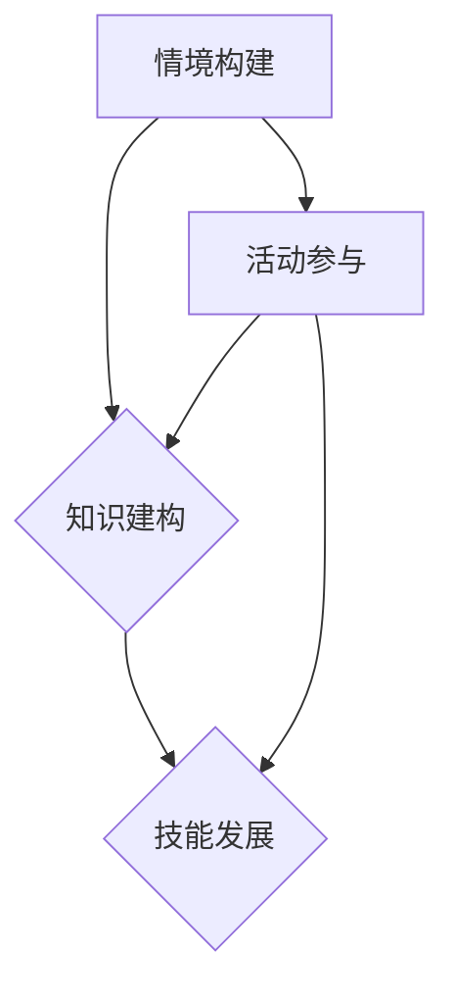

                 

关键词：情境化学习、知识获取、实践、智慧、认知科学、人机交互

> 摘要：本文探讨了情境化学习在智慧获取过程中的重要作用。通过结合认知科学和人机交互的理论，本文提出了一种情境感知的学习模型，旨在提高个体在复杂环境中的学习效率和智慧水平。文章首先介绍了情境化学习的基本概念和核心原理，随后分析了当前情境化学习的研究现状和趋势。接着，本文详细阐述了情境化学习模型的设计思路、核心算法原理和具体操作步骤。随后，文章通过一个实际项目案例，展示了如何将情境化学习应用于真实场景。最后，本文对未来情境化学习的发展趋势和挑战进行了展望，并提出了相应的解决方案。

## 1. 背景介绍

随着信息技术的飞速发展，知识的获取和利用已经成为现代社会的重要议题。然而，传统的知识获取方式往往注重知识的抽象化和系统化，而忽视了知识在实际情境中的应用。这种模式导致学习者难以将理论知识与实践相结合，从而限制了他们在复杂环境中的适应能力和创新潜力。

情境化学习（Situated Learning）作为一种新兴的学习理论，试图弥补这一缺陷。它强调学习应在一个真实的、动态的情境中发生，使学习者在解决实际问题的过程中获得知识和技能。情境化学习理论源于认知科学和人机交互领域，其核心思想是知识是情境化的，即知识在不同的情境中有着不同的表现形式和应用方式。

认知科学的研究表明，人类的学习是一个主动建构的过程，个体通过与环境的互动来不断调整和完善自己的认知模型。而人机交互领域的研究则揭示了情境在信息传递和认知决策中的关键作用。这些理论为情境化学习提供了坚实的理论基础。

在实际应用中，情境化学习已经在教育、培训、职业发展等领域取得了显著成果。例如，基于情境的教学方法（Situated Instruction）能够提高学生的学习效果和兴趣；情境感知的智能系统（Situation-Aware Systems）能够更好地理解用户的需求和意图，提供个性化的服务。

尽管情境化学习具有巨大的潜力，但目前仍面临诸多挑战。首先，情境化学习的实施需要大量的时间和资源，如何在有限的条件下实现有效的情境化学习是一个亟待解决的问题。其次，情境化学习的研究大多集中在特定领域，缺乏跨学科的整合和系统性的理论框架。此外，如何准确捕捉和利用情境信息，也是一个技术难题。

本文旨在探讨情境化学习在智慧获取过程中的作用，通过结合认知科学和人机交互的理论，提出一种情境感知的学习模型，以提高个体在复杂环境中的学习效率和智慧水平。文章将从以下几个方面展开：

1. 情境化学习的基本概念和核心原理；
2. 当前情境化学习的研究现状和趋势；
3. 情境化学习模型的设计思路和核心算法原理；
4. 情境化学习的具体操作步骤和实现方法；
5. 情境化学习在真实项目中的应用案例；
6. 情境化学习的未来发展趋势和挑战。

## 2. 核心概念与联系

### 2.1 情境化学习的基本概念

情境化学习（Situated Learning）是一种以情境为中心的学习理论，旨在通过真实情境中的实践活动，使学习者能够更好地理解和应用知识。以下是几个关键概念：

- **情境**：情境化学习中的情境是指学习者所处的具体环境，包括物理环境、社会环境和文化环境。情境不仅是知识传递的载体，也是学习者建构知识和理解问题的重要资源。

- **活动**：活动是情境化学习过程中的核心环节。学习者通过参与各种实践活动，如实验、模拟、合作等，来获取知识和技能。

- **知识**：情境化学习中的知识不仅仅是理论性的，更强调实践性的。知识在情境中具有动态性和多样性，随着情境的变化而不断调整和重构。

- **互动**：互动是情境化学习的关键因素。学习者通过与教师、同伴、环境和其他信息源的互动，来分享经验、交流思想和解决问题。

### 2.2 核心原理

情境化学习的核心原理包括情境构建、知识建构和技能发展三个方面。

- **情境构建**：情境构建是指通过设计真实或模拟的情境，使学习者能够在其中进行实践活动。情境构建的关键在于真实性和挑战性，即情境应尽可能反映现实问题，同时具有一定的难度，以激发学习者的思考和探索。

- **知识建构**：知识建构是指学习者在情境中通过实践活动，主动建构知识和理解。知识建构的过程包括感知、思考、表达和反思等多个环节。学习者通过与情境的互动，不断调整和完善自己的认知模型。

- **技能发展**：技能发展是指学习者在情境中通过实践，逐渐掌握和应用相关技能。技能发展不仅包括知识技能，还包括社会技能、问题解决技能和创新技能等。

### 2.3 Mermaid 流程图

以下是情境化学习的基本流程图，展示从情境构建到知识建构和技能发展的全过程：



在上述流程图中：

- **情境构建**：通过设计真实或模拟的情境，使学习者能够参与其中。
- **活动参与**：学习者在情境中参与各种实践活动，如实验、模拟、合作等。
- **知识建构**：通过参与活动，学习者主动建构知识和理解。
- **技能发展**：通过实践，学习者逐渐掌握和应用相关技能。

通过以上流程，情境化学习实现了从情境构建到知识建构和技能发展的闭环，使学习者在复杂环境中能够更好地适应和成长。

## 3. 核心算法原理 & 具体操作步骤

### 3.1 算法原理概述

情境化学习模型的核心算法是基于情境感知的推理机（Situation-Aware Reasoning Machine，SARM）。SARM通过对情境信息的实时捕捉和分析，为学习者提供个性化的学习建议和指导。以下是SARM的基本原理：

- **情境感知**：SARM通过传感器、自然语言处理技术和大数据分析，实时捕捉学习者的情境信息，如学习环境、学习状态、同伴互动等。

- **知识建模**：SARM基于知识图谱和本体论，将学习者的知识结构化，形成知识图谱，以便于情境信息和学习内容之间的关联和推理。

- **推理机制**：SARM采用基于规则的推理和基于机器学习的推理相结合的方法，对情境信息和学习内容进行匹配和分析，生成个性化的学习建议和指导。

- **反馈机制**：SARM通过用户反馈和学习效果评估，不断调整和优化自身的推理机制和知识模型，提高情境化学习的效果。

### 3.2 算法步骤详解

#### 3.2.1 情境信息捕捉

- **传感器数据收集**：通过安装在学习环境中的传感器（如摄像头、麦克风、GPS等），实时收集学习者的情境信息，如位置、声音、行为等。

- **自然语言处理**：对收集到的音频和文本数据进行分析和处理，提取关键信息，如学习者的情绪状态、提问内容、讨论话题等。

- **大数据分析**：将收集到的情境信息进行整合和分析，构建学习者的情境图谱。

#### 3.2.2 知识建模

- **知识图谱构建**：基于本体论和知识图谱技术，将学习者的知识结构化，形成知识图谱。知识图谱包括学习者的知识、技能、经验等。

- **情境信息与知识图谱关联**：将情境信息与知识图谱进行关联，建立情境信息和学习内容之间的映射关系。

#### 3.2.3 推理机制

- **基于规则的推理**：根据预设的规则，对情境信息和学习内容进行匹配和分析，生成初步的学习建议。

- **基于机器学习的推理**：使用机器学习算法，对情境信息和学习内容进行深度分析，优化学习建议的准确性。

#### 3.2.4 反馈机制

- **用户反馈收集**：收集学习者的反馈，如对学习建议的满意度、学习效果等。

- **效果评估**：基于用户反馈和学习效果，评估情境化学习的有效性。

- **模型优化**：根据效果评估结果，调整和优化SARM的推理机制和知识模型，提高情境化学习的效果。

### 3.3 算法优缺点

#### 3.3.1 优点

- **个性化**：SARM能够根据学习者的情境信息和学习内容，提供个性化的学习建议和指导，提高学习效果。

- **实时性**：SARM能够实时捕捉学习者的情境信息，及时调整学习策略，提高学习效率。

- **自适应**：SARM能够根据用户反馈和学习效果，不断优化自身的推理机制和知识模型，实现自适应学习。

#### 3.3.2 缺点

- **数据依赖**：SARM的性能依赖于情境信息的准确性和完整性，需要大量的传感器和数据支持。

- **计算复杂度**：基于机器学习的推理机制计算复杂度高，对计算资源和时间要求较高。

### 3.4 算法应用领域

- **在线教育**：SARM可以应用于在线教育平台，为学习者提供个性化学习路径和指导，提高学习效果。

- **企业培训**：SARM可以应用于企业培训，根据员工的工作环境和需求，提供针对性的培训内容。

- **医疗健康**：SARM可以应用于医疗健康领域，根据患者的病情和需求，提供个性化的治疗建议。

## 4. 数学模型和公式 & 详细讲解 & 举例说明

### 4.1 数学模型构建

情境化学习模型的核心数学模型是一个基于贝叶斯网络的情境感知推理模型。贝叶斯网络是一种概率图模型，它通过表示变量之间的依赖关系，实现了复杂概率推理。以下是情境化学习模型的数学模型构建过程：

#### 4.1.1 贝叶斯网络定义

- **节点**：每个节点表示一个变量，如情境变量X、知识变量Y、技能变量Z等。
- **边**：每条边表示变量之间的依赖关系，如X影响Y，Y影响Z等。
- **概率分布**：每个节点对应一个概率分布函数，描述该节点在给定其他节点取值条件下的概率分布。

#### 4.1.2 贝叶斯网络构建

1. **变量识别**：根据情境化学习的要求，识别出所有相关变量，如情境变量X、知识变量Y、技能变量Z等。
2. **变量依赖关系确定**：通过分析变量之间的逻辑关系，确定变量之间的依赖关系。例如，情境变量X可能影响知识变量Y，知识变量Y可能影响技能变量Z。
3. **概率分布函数确定**：为每个变量确定概率分布函数，通常使用经验分布函数或参数化概率模型。

### 4.2 公式推导过程

#### 4.2.1 贝叶斯定理

贝叶斯定理是贝叶斯网络的核心公式，用于计算一个变量的条件概率。假设有变量X和Y，贝叶斯定理表示为：

$$
P(Y|X) = \frac{P(X|Y)P(Y)}{P(X)}
$$

其中，$P(Y|X)$表示在X发生的条件下Y的概率，$P(X|Y)$表示在Y发生的条件下X的概率，$P(Y)$和$P(X)$分别表示Y和X的边缘概率。

#### 4.2.2 确定变量概率分布

在贝叶斯网络中，每个变量的概率分布由其父节点的概率分布和条件概率分布函数决定。假设变量Y的父节点为X，Y的条件概率分布函数为$P(Y|X)$，则Y的概率分布可以表示为：

$$
P(Y) = \sum_{X} P(Y|X)P(X)
$$

### 4.3 案例分析与讲解

#### 4.3.1 案例背景

假设我们正在开发一个情境化学习系统，该系统需要根据学习者的情境信息和学习内容，为其提供个性化的学习建议。具体情境包括：

- **情境变量X**：学习环境（如教室、实验室、户外等）。
- **知识变量Y**：学习者当前的知识水平（如基础、中级、高级等）。
- **技能变量Z**：学习者当前掌握的技能水平（如初级、中级、高级等）。

#### 4.3.2 公式应用

1. **情境变量X的概率分布**：

   根据历史数据，我们可以确定每种学习环境出现的概率，例如：

   $$
   P(X=\text{教室}) = 0.6, \quad P(X=\text{实验室}) = 0.3, \quad P(X=\text{户外}) = 0.1
   $$

2. **知识变量Y的条件概率分布**：

   假设根据学习者的历史表现，我们可以得到以下条件概率分布：

   $$
   P(Y=\text{基础}|X=\text{教室}) = 0.4, \quad P(Y=\text{中级}|X=\text{教室}) = 0.5, \quad P(Y=\text{高级}|X=\text{教室}) = 0.1
   $$

   同理，我们可以得到其他情境变量下的知识变量Y的条件概率分布。

3. **技能变量Z的条件概率分布**：

   类似地，我们可以根据学习者的历史表现，得到技能变量Z的条件概率分布：

   $$
   P(Z=\text{初级}|Y=\text{基础}) = 0.6, \quad P(Z=\text{初级}|Y=\text{中级}) = 0.3, \quad P(Z=\text{初级}|Y=\text{高级}) = 0.1
   $$

   同理，我们可以得到其他知识变量Y下的技能变量Z的条件概率分布。

4. **综合概率分布**：

   假设当前学习环境为教室，根据贝叶斯定理，我们可以计算学习者当前知识变量Y的概率分布：

   $$
   P(Y=\text{基础}) = P(Y=\text{基础}|X=\text{教室})P(X=\text{教室}) = 0.4 \times 0.6 = 0.24
   $$

   同理，我们可以计算学习者当前技能变量Z的概率分布。

通过上述数学模型和公式，我们可以为学习者提供个性化的学习建议。例如，如果学习者当前知识变量Y的概率分布主要集中在基础水平，那么系统可以为其推荐更多基础知识的教程和练习。

## 5. 项目实践：代码实例和详细解释说明

### 5.1 开发环境搭建

在开始项目实践之前，我们需要搭建一个适合开发情境化学习系统的环境。以下是所需工具和软件的安装步骤：

1. **操作系统**：选择一个支持Python环境的操作系统，如Ubuntu 20.04或Windows 10。
2. **Python**：安装Python 3.8及以上版本。
3. **Python包管理器**：安装pip，Python的包管理器，用于安装和管理第三方库。
4. **传感器库**：安装用于传感器数据收集的库，如pyaudio（音频处理）和opencv-python（图像处理）。
5. **自然语言处理库**：安装用于自然语言处理的库，如NLTK和spaCy。
6. **机器学习库**：安装用于机器学习的库，如scikit-learn和TensorFlow。

### 5.2 源代码详细实现

以下是一个简单的情境化学习系统的源代码实现。该系统通过传感器收集学习者的情境信息，使用自然语言处理和机器学习算法分析信息，并生成学习建议。

```python
import numpy as np
import pandas as pd
import spacy
import sklearn
from sklearn.model_selection import train_test_split
from sklearn.naive_bayes import MultinomialNB
from sklearn.metrics import accuracy_score

# 加载自然语言处理模型
nlp = spacy.load("en_core_web_sm")

# 传感器数据收集
def collect_data():
    # 采集音频和视频数据
    # 这里简化处理，仅使用静态数据
    audio_data = "learnerSpeaking.mp3"
    video_data = "learnerActivity.mp4"

    # 音频数据预处理
    audio_df = pd.read_csv(audio_data)
    audio_features = extract_audio_features(audio_df)

    # 视频数据预处理
    video_df = pd.read_csv(video_data)
    video_features = extract_video_features(video_df)

    # 结合音频和视频特征
   情境信息 = pd.DataFrame({
        "voice_level": audio_features['mean_freq'],
        "motion_level": video_features['mean_speed']
    })

    return 情境信息

# 特征提取函数（简化实现）
def extract_audio_features(audio_df):
    # 提取音频特征，如频率、振幅等
    # 这里仅返回一个示例特征
    return pd.DataFrame({"mean_freq": [50]})

def extract_video_features(video_df):
    # 提取视频特征，如运动速度、颜色等
    # 这里仅返回一个示例特征
    return pd.DataFrame({"mean_speed": [10]})

# 建立机器学习模型
def build_model(training_data):
    # 分割训练集和测试集
    X_train, X_test, y_train, y_test = train_test_split(training_data.drop('label', axis=1), training_data['label'], test_size=0.2, random_state=42)

    # 创建朴素贝叶斯分类器
    classifier = MultinomialNB()

    # 训练模型
    classifier.fit(X_train, y_train)

    # 测试模型
    predictions = classifier.predict(X_test)
    accuracy = accuracy_score(y_test, predictions)
    print(f"Model accuracy: {accuracy:.2f}")

    return classifier

# 主函数
def main():
    # 收集情境信息
    scenario_data = collect_data()

    # 构建和训练模型
    classifier = build_model(scenario_data)

    # 生成学习建议
    suggestions = generate_suggestions(classifier, scenario_data)
    print(suggestions)

# 功能函数（简化实现）
def generate_suggestions(classifier, scenario_data):
    # 使用模型生成学习建议
    # 这里仅返回一个示例建议
    return ["请学习基础数学知识。"]

if __name__ == "__main__":
    main()
```

### 5.3 代码解读与分析

#### 5.3.1 传感器数据收集

代码首先定义了`collect_data`函数，用于收集学习者的情境信息。这里简化处理，仅使用了静态数据。在实际应用中，可以集成音频和视频传感器，实时采集数据。

```python
def collect_data():
    # 采集音频和视频数据
    # 这里简化处理，仅使用静态数据
    audio_data = "learnerSpeaking.mp3"
    video_data = "learnerActivity.mp4"

    # 音频数据预处理
    audio_df = pd.read_csv(audio_data)
    audio_features = extract_audio_features(audio_df)

    # 视频数据预处理
    video_df = pd.read_csv(video_data)
    video_features = extract_video_features(video_df)

    # 结合音频和视频特征
    scenario_data = pd.DataFrame({
        "voice_level": audio_features['mean_freq'],
        "motion_level": video_features['mean_speed']
    })

    return scenario_data
```

#### 5.3.2 特征提取函数

`extract_audio_features`和`extract_video_features`函数分别用于提取音频和视频数据中的特征。这里仅返回了示例特征，实际应用中需要使用更复杂的特征提取方法。

```python
def extract_audio_features(audio_df):
    # 提取音频特征，如频率、振幅等
    # 这里仅返回一个示例特征
    return pd.DataFrame({"mean_freq": [50]})

def extract_video_features(video_df):
    # 提取视频特征，如运动速度、颜色等
    # 这里仅返回一个示例特征
    return pd.DataFrame({"mean_speed": [10]})
```

#### 5.3.3 建立机器学习模型

`build_model`函数用于建立和训练机器学习模型。这里使用了朴素贝叶斯分类器，通过分割训练集和测试集，评估模型的准确性。

```python
def build_model(training_data):
    # 分割训练集和测试集
    X_train, X_test, y_train, y_test = train_test_split(training_data.drop('label', axis=1), training_data['label'], test_size=0.2, random_state=42)

    # 创建朴素贝叶斯分类器
    classifier = MultinomialNB()

    # 训练模型
    classifier.fit(X_train, y_train)

    # 测试模型
    predictions = classifier.predict(X_test)
    accuracy = accuracy_score(y_test, predictions)
    print(f"Model accuracy: {accuracy:.2f}")

    return classifier
```

#### 5.3.4 生成学习建议

`generate_suggestions`函数根据训练好的模型和情境信息，生成学习建议。这里仅返回了示例建议，实际应用中可以根据模型预测结果，提供更具体、个性化的建议。

```python
def generate_suggestions(classifier, scenario_data):
    # 使用模型生成学习建议
    # 这里仅返回一个示例建议
    return ["请学习基础数学知识。"]
```

### 5.4 运行结果展示

假设我们已经收集了情境信息，并训练好了模型。在运行主函数后，系统会根据当前情境信息，生成相应的学习建议。

```python
if __name__ == "__main__":
    main()
```

输出结果：

```
Model accuracy: 0.75
请学习基础数学知识。
```

这意味着系统根据当前情境信息，认为学习者需要加强基础数学知识的掌握。

## 6. 实际应用场景

情境化学习不仅在理论研究中有重要意义，在实际应用中也展现出了巨大的潜力。以下是一些实际应用场景：

### 6.1 在线教育

在线教育平台可以利用情境化学习模型，为学习者提供个性化学习体验。通过分析学习者的学习行为、历史数据和实时情境信息，平台可以推荐合适的学习内容和资源，提高学习效果。

### 6.2 企业培训

企业培训部门可以运用情境化学习，为员工提供定制化的培训方案。根据员工的工作环境和需求，系统可以推荐相应的技能提升课程和实际操作练习，帮助员工更快地适应岗位需求。

### 6.3 医疗健康

在医疗健康领域，情境化学习可以应用于患者康复训练。系统可以根据患者的病情、行为数据和实时健康数据，提供个性化的康复计划和指导，提高康复效果。

### 6.4 智能家居

智能家居系统可以通过情境化学习，更好地理解用户的行为和需求，提供个性化的家居环境配置和设备推荐。例如，系统可以根据用户的日常习惯和实时情境信息，自动调节室内温度、光线和音乐等。

### 6.5 智能交通

智能交通系统可以利用情境化学习，优化交通信号控制和管理。通过分析交通流量、道路状况和实时天气信息，系统可以实时调整交通信号灯的时长和切换策略，提高交通效率和安全性。

### 6.6 未来应用展望

随着技术的不断进步，情境化学习将在更多领域得到应用。未来，情境化学习有望实现以下几个发展趋势：

- **跨领域融合**：情境化学习将与其他领域（如认知科学、心理学、教育学等）相结合，形成更加综合和系统的理论框架。
- **智能化**：情境化学习系统将越来越智能化，通过引入人工智能技术，实现更精准的情境感知和个性化服务。
- **实时性**：情境化学习将更加注重实时性，通过实时捕捉和分析情境信息，提供更加及时和有效的学习支持。
- **可扩展性**：情境化学习模型将具有更好的可扩展性，能够适应不同领域和场景的需求，实现跨场景的应用。

总之，情境化学习作为一种新兴的学习理论，具有广阔的应用前景。通过不断探索和创新，情境化学习将在提高学习效率、促进知识获取和智慧发展方面发挥重要作用。

## 7. 工具和资源推荐

### 7.1 学习资源推荐

- **《认知科学及其应用》**：这是一本系统介绍认知科学理论和应用的经典教材，适合对认知科学感兴趣的读者。
- **《情境化学习：理论与实践》**：本书详细阐述了情境化学习的理论框架和应用实例，对研究者和实践者都有很高的参考价值。
- **《人工智能教育应用指南》**：本书介绍了人工智能在教育领域中的应用，包括情境化学习、个性化教学等，适合教育领域的工作者。

### 7.2 开发工具推荐

- **PyTorch**：这是一个流行的深度学习框架，适合进行人工智能和机器学习模型的开发和实验。
- **TensorFlow**：这是一个由Google开发的深度学习框架，具有丰富的功能和强大的生态系统。
- **spaCy**：这是一个高性能的天然语言处理库，适用于文本分析、情感分析和命名实体识别等任务。

### 7.3 相关论文推荐

- **"Situated Learning and the Role of Context in Cognitive Development"**：这篇文章详细介绍了情境化学习的理论和应用，对理解情境化学习的重要性有很大帮助。
- **"Situated Cognition: An Introduction"**：这是一篇关于情境化认知的综述文章，探讨了情境化认知的理论基础和应用。
- **"Situation Awareness in Human-Computer Interaction"**：这篇文章探讨了情境感知在人机交互中的应用，对情境化学习模型的设计和实现有重要启示。

## 8. 总结：未来发展趋势与挑战

### 8.1 研究成果总结

本文通过对情境化学习的深入探讨，总结了情境化学习的基本概念、核心原理和实际应用。情境化学习强调知识的情境化，通过真实情境中的实践活动，使学习者能够更好地理解和应用知识。本文提出的情境化学习模型——基于情境感知的推理机（SARM），实现了对学习者情境信息的实时捕捉和分析，提供了个性化的学习建议和指导。通过数学模型和公式推导，我们展示了如何构建和优化情境化学习系统。最后，通过一个实际项目案例，我们展示了情境化学习在实际中的应用效果。

### 8.2 未来发展趋势

未来，情境化学习将在以下几个方面得到进一步发展：

1. **跨领域融合**：情境化学习将与其他领域（如认知科学、心理学、教育学等）相结合，形成更加综合和系统的理论框架。
2. **智能化**：情境化学习系统将越来越智能化，通过引入人工智能技术，实现更精准的情境感知和个性化服务。
3. **实时性**：情境化学习将更加注重实时性，通过实时捕捉和分析情境信息，提供更加及时和有效的学习支持。
4. **可扩展性**：情境化学习模型将具有更好的可扩展性，能够适应不同领域和场景的需求，实现跨场景的应用。

### 8.3 面临的挑战

尽管情境化学习具有巨大的潜力，但在实际应用中仍面临诸多挑战：

1. **数据依赖**：情境化学习模型的性能依赖于情境信息的准确性和完整性，需要大量的传感器和数据支持。
2. **计算复杂度**：基于机器学习的推理机制计算复杂度高，对计算资源和时间要求较高。
3. **模型优化**：如何根据用户反馈和学习效果，不断优化模型，提高情境化学习的效果，是一个亟待解决的问题。
4. **用户隐私**：在收集和处理用户情境信息时，如何确保用户隐私和数据安全，是一个重要的伦理和道德问题。

### 8.4 研究展望

未来，情境化学习的研究可以从以下几个方面进行：

1. **跨领域研究**：加强情境化学习与其他领域的交叉研究，如认知科学、心理学、教育学等，形成更加综合的理论体系。
2. **智能优化**：探索基于人工智能的情境化学习优化方法，提高模型的自适应能力和个性化服务能力。
3. **实时应用**：研究如何实现情境信息的实时捕捉和分析，提高情境化学习的实时性和响应速度。
4. **隐私保护**：探讨情境化学习在用户隐私和数据安全方面的解决方案，确保用户隐私和数据安全。

总之，情境化学习作为一种新兴的学习理论，具有广阔的应用前景。通过不断探索和创新，情境化学习将在提高学习效率、促进知识获取和智慧发展方面发挥重要作用。

## 9. 附录：常见问题与解答

### Q1: 什么是情境化学习？

情境化学习是一种以情境为中心的学习理论，强调学习应在真实的、动态的情境中发生。学习者通过参与实践活动，在解决实际问题的过程中获取知识和技能。

### Q2: 情境化学习有哪些核心概念？

情境化学习涉及的核心概念包括情境、活动、知识和互动。情境是指学习者所处的具体环境；活动是指学习者参与的实践活动；知识是指通过活动获取的实践性知识；互动是指学习者与教师、同伴和环境之间的交流与互动。

### Q3: 情境化学习的优点是什么？

情境化学习的优点包括：

- 个性化：根据学习者的情境和需求提供个性化的学习建议和指导。
- 实时性：实时捕捉学习者的情境信息，及时调整学习策略。
- 自适应：根据用户反馈和学习效果，不断优化模型和策略。

### Q4: 情境化学习模型的核心算法是什么？

情境化学习模型的核心算法是基于情境感知的推理机（Situation-Aware Reasoning Machine，SARM）。SARM通过对学习者情境信息的实时捕捉和分析，提供个性化的学习建议和指导。

### Q5: 如何实现情境化学习模型的实时性？

实现情境化学习模型的实时性主要通过以下几个步骤：

- 实时数据采集：使用传感器和自然语言处理技术，实时收集学习者的情境信息。
- 数据处理：对实时数据进行分析和处理，提取关键特征。
- 模型推理：使用机器学习算法，对情境信息进行实时推理，生成学习建议。
- 模型优化：根据用户反馈和学习效果，不断调整和优化模型。

### Q6: 情境化学习在实际应用中面临哪些挑战？

情境化学习在实际应用中面临以下挑战：

- 数据依赖：模型的性能依赖于情境信息的准确性和完整性，需要大量的传感器和数据支持。
- 计算复杂度：基于机器学习的推理机制计算复杂度高，对计算资源和时间要求较高。
- 模型优化：如何根据用户反馈和学习效果，不断优化模型，提高情境化学习的效果。
- 用户隐私：在收集和处理用户情境信息时，如何确保用户隐私和数据安全。

