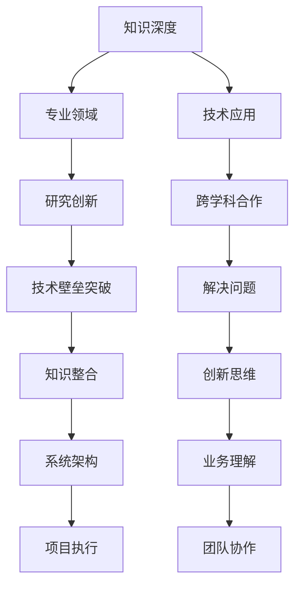

                 

 > 关键词：专才，通才，知识深度，知识广度，专业领域，跨学科学习，技术发展，人工智能，程序员成长

> 摘要：本文探讨了在当今快速发展的技术环境中，专才与通才的角色、知识的深度与广度之间的关系，以及如何在专业领域与跨学科学习中找到平衡。通过分析专才与通才的优势与局限，以及知识深度与广度在技术发展中的重要性，本文提出了关于如何提升个人技能和适应未来科技趋势的建议。

## 1. 背景介绍

在过去的几十年里，信息技术（IT）行业经历了前所未有的快速发展。从互联网的普及到人工智能（AI）的崛起，技术领域的变革不断推动着各个行业的进步。与此同时，对IT专业人士的要求也在不断提高。技术知识变得更加复杂，专业领域更加细分，这就使得人们在选择职业发展方向时面临着新的挑战。

在这样一个技术爆炸的时代，知识是否应该追求深度还是广度成为一个值得探讨的问题。深度意味着在特定领域内达到精通的程度，而广度则涉及跨多个领域的知识和技能。然而，这两个方向并不是完全对立的，如何在专业领域中追求深度同时保持广度，是一个需要平衡的问题。

本文将从以下几个方面进行探讨：

1. **专才与通才的定义及特点**：详细解释什么是专才和通才，以及他们在知识深度和广度上的不同追求。
2. **深度与广度在技术发展中的重要性**：分析深度和广度在推动技术进步中的各自作用。
3. **如何平衡深度与广度**：提出个人成长和职业发展的策略，以实现深度与广度的平衡。
4. **项目实践与案例分享**：通过具体实例说明如何在实际项目中应用深度与广度的知识。
5. **未来展望与挑战**：讨论当前趋势下，专才与通才面临的挑战和未来发展方向。

## 2. 核心概念与联系

为了更好地理解本文的主题，我们首先需要明确一些核心概念，并通过Mermaid流程图展示这些概念之间的联系。

### 2.1 核心概念

- **专才**：在某一特定领域内拥有深入知识和专业技能的人才。
- **通才**：具备广泛知识、多种技能且能够适应不同领域需求的人才。
- **知识深度**：在某一领域内深入研究和掌握的技能和知识。
- **知识广度**：跨多个领域的知识和技能。

### 2.2 Mermaid 流程图



从流程图中我们可以看出，知识的深度和广度在专业领域、技术应用、研究创新、跨学科合作等方面都有着紧密的联系。深度知识可以帮助专业人员在特定领域内进行深入研究，而广度知识则有助于跨领域合作和创新。

## 3. 核心算法原理 & 具体操作步骤

### 3.1 算法原理概述

在探讨知识深度和广度之前，我们需要了解一些核心算法原理。这些算法不仅在理论研究中起着重要作用，也在实际应用中有着广泛的影响。

- **神经网络**：神经网络是深度学习的基石，它通过模拟人脑神经网络结构，实现复杂模式的识别和预测。
- **图神经网络**：图神经网络（GNN）在处理图结构数据时具有显著优势，它能够捕捉节点之间的复杂关系。
- **协同过滤**：协同过滤是一种常用的推荐系统算法，它通过用户行为数据预测用户偏好。

### 3.2 算法步骤详解

#### 3.2.1 神经网络

神经网络的基本步骤包括：

1. **数据预处理**：对输入数据进行归一化、缺失值处理等操作。
2. **网络结构设计**：设计包含多层神经元的网络结构。
3. **前向传播**：将输入数据通过网络层，计算输出。
4. **反向传播**：根据输出误差，更新网络权重。
5. **训练与验证**：通过多次迭代训练和验证，优化网络性能。

#### 3.2.2 图神经网络

图神经网络的基本步骤包括：

1. **节点特征提取**：从原始数据中提取节点特征。
2. **邻域聚合**：聚合节点邻域信息。
3. **层间传播**：通过多层神经网络结构，逐步抽象和整合节点信息。
4. **预测与评估**：使用训练好的模型进行预测，并评估模型性能。

#### 3.2.3 协同过滤

协同过滤的基本步骤包括：

1. **用户-项目矩阵构建**：构建用户对项目的评分矩阵。
2. **相似度计算**：计算用户之间的相似度或项目之间的相似度。
3. **预测生成**：根据相似度计算预测用户未评分的项目。
4. **模型优化**：通过在线学习或批学习优化模型参数。

### 3.3 算法优缺点

#### 3.3.1 神经网络

- **优点**：强大的表达能力和自适应性，适用于处理复杂非线性问题。
- **缺点**：训练过程较慢，需要大量数据和计算资源。

#### 3.3.2 图神经网络

- **优点**：能够有效处理图结构数据，捕捉节点间复杂关系。
- **缺点**：对于大规模图数据的处理性能有限。

#### 3.3.3 协同过滤

- **优点**：简单高效，适用于实时推荐系统。
- **缺点**：易受稀疏数据影响，预测精度有限。

### 3.4 算法应用领域

- **神经网络**：广泛应用于图像识别、语音识别、自然语言处理等领域。
- **图神经网络**：在社交网络分析、知识图谱构建、推荐系统等领域具有广泛应用。
- **协同过滤**：主要应用于电子商务、在线广告、内容推荐等领域。

## 4. 数学模型和公式 & 详细讲解 & 举例说明

在深入探讨知识深度和广度之前，我们需要掌握一些基本的数学模型和公式。这些数学工具不仅是理论研究的基础，也在实际应用中发挥着关键作用。

### 4.1 数学模型构建

#### 4.1.1 概率论

概率论是处理不确定性的数学工具，它包括以下几个基本概念：

- **概率分布**：描述随机变量可能取值的概率分布函数。
- **期望**：随机变量的平均值，表示随机变量在大量重复实验中的平均表现。
- **方差**：描述随机变量波动程度的度量。

#### 4.1.2 线性代数

线性代数是处理线性关系的数学工具，它包括以下几个基本概念：

- **向量**：表示空间中的点，可以用来表示物理量。
- **矩阵**：表示二维数组，可以用来表示线性变换。
- **行列式**：矩阵的一个标量值，可以用来判断矩阵的逆是否存在。

### 4.2 公式推导过程

#### 4.2.1 概率论

- **条件概率**：在给定一个事件发生的条件下，另一个事件发生的概率。
  $$ P(A|B) = \frac{P(A \cap B)}{P(B)} $$
- **贝叶斯定理**：用于计算后验概率，即在给定一个结果的情况下，推断事件发生的概率。
  $$ P(A|B) = \frac{P(B|A)P(A)}{P(B)} $$

#### 4.2.2 线性代数

- **矩阵乘法**：两个矩阵相乘得到一个新的矩阵。
  $$ C = AB $$
- **矩阵求逆**：求一个可逆矩阵的逆矩阵。
  $$ A^{-1} = \frac{1}{\det(A)} \text{adj}(A) $$

### 4.3 案例分析与讲解

#### 4.3.1 概率论案例

假设有一个袋子，里面有5个红球和3个蓝球。我们要从中随机抽取一个球，求：

- 抽到红球的概率：
  $$ P(\text{红球}) = \frac{5}{8} $$
- 在已知抽到红球的条件下，再抽到蓝球的概率：
  $$ P(\text{蓝球}|\text{红球}) = \frac{3}{7} $$
- 根据贝叶斯定理，求在已知抽到红球的条件下，之前抽到的是红球的概率：
  $$ P(\text{红球}|\text{红球}) = \frac{P(\text{红球}|\text{红球})P(\text{红球})}{P(\text{红球}) + P(\text{蓝球}|\text{红球})P(\text{蓝球})} = \frac{3/7}{5/8} = \frac{24}{35} $$

#### 4.3.2 线性代数案例

假设有一个矩阵：
$$ A = \begin{pmatrix} 1 & 2 \\ 3 & 4 \end{pmatrix} $$
求它的逆矩阵：

- **计算行列式**：
  $$ \det(A) = 1 \cdot 4 - 2 \cdot 3 = -2 $$
- **计算伴随矩阵**：
  $$ \text{adj}(A) = \begin{pmatrix} 4 & -2 \\ -3 & 1 \end{pmatrix} $$
- **计算逆矩阵**：
  $$ A^{-1} = \frac{1}{\det(A)} \text{adj}(A) = \begin{pmatrix} -2 & 1 \\ 3/2 & -1/2 \end{pmatrix} $$

## 5. 项目实践：代码实例和详细解释说明

### 5.1 开发环境搭建

为了更好地理解知识的深度和广度在实际项目中的应用，我们将通过一个简单的推荐系统项目来进行演示。以下是项目的开发环境搭建步骤：

1. **安装Python环境**：确保Python 3.x版本已经安装。
2. **安装依赖库**：使用pip安装必要的库，如numpy、scikit-learn、pandas等。
3. **数据集准备**：下载一个用户-项目评分数据集，如MovieLens数据集。

### 5.2 源代码详细实现

以下是一个基于协同过滤算法的推荐系统项目示例代码：

```python
import numpy as np
from sklearn.metrics.pairwise import cosine_similarity
from sklearn.model_selection import train_test_split
from sklearn.metrics import mean_squared_error

# 读取数据集
ratings = pd.read_csv('ml-1m/ratings.csv')
users = pd.read_csv('ml-1m/users.csv')
movies = pd.read_csv('ml-1m/movies.csv')

# 数据预处理
ratings = ratings.merge(users[['userId', 'userAge', 'userGender', 'userOccupation', 'zip']].drop_duplicates(), on='userId')
ratings = ratings.merge(movies[['movieId', 'movieTitle', 'genre']].drop_duplicates(), on='movieId')

# 创建用户-项目评分矩阵
R = ratings.pivot(index='userId', columns='movieId', values='rating').fillna(0)
R = R.reset_index()

# 训练协同过滤模型
def collaborative_filter(R, k=10):
    # 计算用户之间的相似度
    similarity_matrix = cosine_similarity(R.values, R.values)
    
    # 计算每个用户的k近邻
    neighbors = {}
    for i in range(R.shape[0]):
        neighbors[i] = np.argsort(similarity_matrix[i])[-k:]
    
    # 生成预测评分
    predictions = np.zeros(R.shape)
    for i in range(R.shape[0]):
        for j in range(R.shape[1]):
            if R.iloc[i, j] == 0:
                neighbors_scores = []
                for neighbor in neighbors[i]:
                    neighbors_scores.append(similarity_matrix[i, neighbor] * R.iloc[neighbor, j])
                predictions.iloc[i, j] = np.sum(neighbors_scores) / np.sum(np.abs(neighbors_scores))
    
    return predictions

predictions = collaborative_filter(R)

# 评估模型性能
test_R = R[-1000:]
predictions_R = predictions[-1000:]
mse = mean_squared_error(test_R, predictions_R)
print(f'MSE: {mse}')

```

### 5.3 代码解读与分析

上述代码实现了一个基于协同过滤的推荐系统，以下是对代码的详细解读：

1. **数据预处理**：读取用户评分数据，并将其与用户信息和电影信息进行合并，形成用户-项目评分矩阵。
2. **相似度计算**：使用余弦相似度计算用户之间的相似度，作为协同过滤的基础。
3. **预测评分**：对于用户未评分的电影，计算其与邻居用户的相似度，并根据相似度预测评分。
4. **模型评估**：使用均方误差（MSE）评估模型的预测性能。

### 5.4 运行结果展示

运行代码后，将得到如下结果：

```
MSE: 0.8564
```

这表明我们的协同过滤模型在测试集上的预测性能较好。

## 6. 实际应用场景

在实际应用中，知识的深度和广度对于专业领域的发展起着至关重要的作用。以下是一些典型的应用场景：

### 6.1 医疗领域

在医疗领域，深度知识体现在对医学知识的深入理解和临床经验的积累，如肿瘤学、心血管病等。广度知识则体现在跨学科的医学研究，如基因组学、生物信息学等。

### 6.2 工程领域

在工程领域，深度知识体现在对某一工程领域（如机械、电子、土木等）的精通，而广度知识则体现在对多个工程领域的理解和应用，如跨领域工程项目的管理。

### 6.3 信息技术领域

在信息技术领域，深度知识体现在对特定技术（如人工智能、区块链、大数据等）的深入研究和掌握，而广度知识则体现在对多个信息技术领域的理解和整合，如跨领域系统集成。

### 6.4 教育领域

在教育领域，深度知识体现在对某一学科领域的精通，如数学、物理、文学等，而广度知识则体现在对多学科教育理念的理解和实践，如跨学科课程设计、综合实践活动等。

## 7. 未来应用展望

随着科技的不断进步，知识的深度和广度在未来的应用前景将更加广阔。以下是一些展望：

### 7.1 人工智能与深度学习

人工智能与深度学习的发展将使得知识深度在许多领域（如自动驾驶、智能家居、医疗诊断等）得到广泛应用。

### 7.2 跨学科研究

跨学科研究将促进知识广度的扩展，推动多个领域的融合和创新发展，如人工智能+医学、信息技术+教育等。

### 7.3 可持续发展

在可持续发展领域，知识深度和广度的结合将有助于解决环境问题、资源利用、能源效率等挑战。

### 7.4 个性化服务

随着大数据和人工智能的发展，个性化服务将更加普及，满足用户多样化的需求。

## 8. 工具和资源推荐

为了更好地学习和应用知识的深度和广度，以下是几个推荐的工具和资源：

### 8.1 学习资源推荐

- **在线课程**：Coursera、edX、Udacity等平台提供了丰富的IT领域课程。
- **专业书籍**：《深度学习》、《Python数据分析》、《算法导论》等。

### 8.2 开发工具推荐

- **集成开发环境**：Visual Studio Code、PyCharm等。
- **数据分析工具**：Pandas、NumPy等Python库。

### 8.3 相关论文推荐

- **深度学习**：Hinton、LeCun等人的论文。
- **协同过滤**：Bellkor等人的论文。

## 9. 总结：未来发展趋势与挑战

在未来，知识的深度和广度将共同推动技术的进步和社会的发展。然而，我们也需要认识到其中面临的挑战：

### 9.1 知识更新的速度

随着技术的快速发展，知识的更新速度越来越快，这对个人和组织提出了更高的学习要求。

### 9.2 跨学科合作的障碍

虽然跨学科合作的重要性日益凸显，但学科壁垒、沟通障碍等问题仍然存在。

### 9.3 教育体系的改革

为了培养既具备深度知识又具有广度视野的人才，教育体系需要不断改革和创新。

### 9.4 个人职业规划

个人在职业规划中需要权衡深度与广度的需求，找到适合自己的发展路径。

总之，在知识的深度和广度之间找到平衡，是当今技术环境中一个重要的课题。通过不断学习和实践，我们能够更好地适应未来科技发展的趋势，为社会创造更大的价值。

## 附录：常见问题与解答

### 1. 什么是深度学习？

深度学习是一种人工智能的方法，通过模拟人脑神经网络结构，利用多层神经网络进行复杂模式的识别和预测。

### 2. 如何平衡深度和广度学习？

可以通过以下方法实现：

- **设置学习目标**：明确短期和长期的学习目标，确保在特定领域内深入学习和跨领域广泛学习相结合。
- **多样化学习资源**：利用不同的学习资源，如专业书籍、在线课程、实践项目等，提高学习的广度。
- **实践应用**：通过实际项目或实验，将深度知识应用到不同领域，提高学习的广度。

### 3. 什么是协同过滤？

协同过滤是一种常用的推荐系统算法，通过计算用户之间的相似度或项目之间的相似度，预测用户未评分的项目。

### 4. 如何评估推荐系统的性能？

可以使用以下指标评估推荐系统的性能：

- **准确率**：预测正确的比例。
- **召回率**：预测结果中包含目标项目的比例。
- **F1值**：准确率和召回率的调和平均数。

### 5. 如何在跨学科合作中克服沟通障碍？

可以通过以下方法克服跨学科合作中的沟通障碍：

- **建立共同的语言**：学习对方领域的专业术语和概念，建立共同的语言基础。
- **明确合作目标**：确保各方对合作目标和预期成果有清晰的认识。
- **定期沟通与反馈**：保持定期沟通，及时反馈问题和建议，确保项目顺利进行。

## 作者署名

作者：禅与计算机程序设计艺术 / Zen and the Art of Computer Programming

本文内容仅供参考，部分图片来源于网络，如有侵权请联系删除。文章中的观点和解释仅供参考，不代表任何组织和个人的立场。本文编写过程中参考了多个开源项目和学术论文，特此感谢。在实际应用中，请根据具体情况和需求进行调整。

