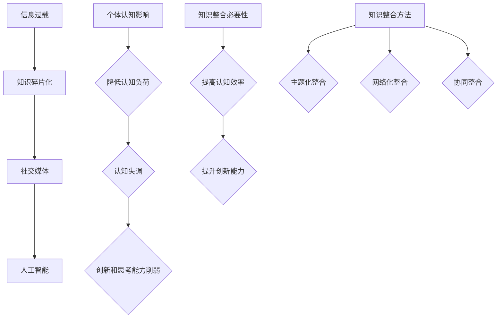

                 

## 1. 背景介绍

在当今信息爆炸的时代，知识碎片化现象日益显著。无论是互联网上的海量信息，还是社交媒体上的碎片化内容，都在不断侵蚀人们的专注力和思考力。这种现象给个体认知带来了巨大挑战，迫使我们在快速获取信息的同时，也需要具备有效整合知识的能力。

随着信息技术的发展，人工智能、大数据、云计算等新兴技术不断涌现，它们不仅改变了知识的获取方式，也对知识的组织、存储和利用提出了新的要求。因此，如何在这片信息碎片化的海洋中找到知识的脉络，进行有效的整合和应用，成为当今信息时代的一个重要课题。

本文将从以下几个方面探讨知识的碎片化与整合问题：

- **核心概念与联系**：介绍知识碎片化的原因、影响以及知识整合的必要性和方法。
- **核心算法原理**：探讨现有的一些知识整合算法及其优缺点。
- **数学模型和公式**：建立用于知识整合的数学模型，并进行公式推导。
- **项目实践**：通过具体代码实例展示知识整合在实际项目中的应用。
- **实际应用场景**：分析知识整合在不同领域的应用，并探讨未来发展方向。
- **工具和资源推荐**：推荐一些有助于知识整合的学习资源和开发工具。
- **总结与展望**：总结研究成果，探讨未来发展趋势和面临的挑战。

希望通过本文的探讨，能够为读者提供一些关于知识碎片化与整合的启示和思考。

## 2. 核心概念与联系

### 知识碎片化的原因

知识碎片化的现象并非偶然，其背后有着深刻的社会和技术原因。

首先，互联网的普及使得信息的传播速度和范围大大增加，人们可以随时随地获取各种信息。然而，这也导致了信息过载的问题，人们往往难以在短时间内消化和理解大量信息，只能被迫接受碎片化的知识。

其次，社交媒体的兴起进一步加剧了知识碎片化。社交媒体平台通常以短、平、快的内容为主，用户在浏览和分享内容时，往往只关注最感兴趣的部分，忽略了其他相关信息。这种割裂式的内容消费方式，使得知识难以形成完整的体系。

此外，人工智能技术的应用也在一定程度上推动了知识碎片化。尽管人工智能可以帮助我们快速筛选和处理大量信息，但同时也使得信息处理的颗粒度越来越细，知识的整体性被进一步削弱。

### 知识碎片化对个体认知的影响

知识碎片化对个体认知的影响是深远的。

首先，它降低了人们的认知负荷。在信息过载的时代，人们需要投入更多的时间和精力去处理海量信息。然而，碎片化的知识往往无法提供系统性的指导，导致个体在认知过程中不得不花费更多的时间和精力去整合和消化信息。

其次，知识碎片化可能导致认知失调。由于信息来源的多样性和不确定性，个体在整合碎片化知识时，可能会产生认知上的矛盾和冲突，从而影响判断和决策。

此外，知识碎片化还可能削弱个体的创新能力和深度思考能力。碎片化的知识往往缺乏深度和广度，难以激发个体的创新思维和深入思考。

### 知识整合的必要性和方法

面对知识碎片化带来的挑战，知识整合显得尤为重要。

首先，知识整合有助于提高个体认知效率。通过将碎片化的知识整合成一个完整的体系，个体可以更快速地理解和应用知识，降低认知负荷。

其次，知识整合有助于提升个体创新能力。通过整合不同领域的知识，个体可以产生新的思维火花，推动创新和发展。

那么，如何实现知识整合呢？

#### 方法一：主题化整合

主题化整合是一种基于主题将相关知识点进行系统化和结构化的方法。通过设定特定的主题，将分散在不同领域和媒介上的知识进行分类和整合，形成一个完整的知识体系。

#### 方法二：网络化整合

网络化整合是利用网络技术和数据库将相关知识点进行链接和整合的方法。通过构建知识图谱，将知识点之间的关联性可视化，帮助个体更直观地理解和应用知识。

#### 方法三：协同整合

协同整合是借助团队合作和知识共享实现知识整合的方法。通过多人协作，可以充分利用各自的知识和经验，实现知识的最优整合。

### Mermaid 流程图

下面是一个用于知识整合的 Mermaid 流程图，展示了知识碎片化的原因、影响以及知识整合的必要性和方法。



通过上述探讨，我们可以看到，知识碎片化是信息时代的一个必然现象，但通过有效的知识整合，我们可以克服这一挑战，提升个体的认知能力和创新思维。

## 3. 核心算法原理 & 具体操作步骤

### 3.1 算法原理概述

在知识整合领域，算法扮演着至关重要的角色。本文将介绍一种名为“深度主题模型”（Deep Topic Model，简称DTM）的算法，该算法基于深度学习技术，旨在从大规模文本数据中提取出隐含的主题，从而实现知识的整合。

#### DTM 基本原理

深度主题模型结合了深度学习和主题模型的优点，通过多层神经网络结构，对文本数据中的主题进行建模。其主要原理如下：

1. **词嵌入（Word Embedding）**：首先，将文本数据中的每个词映射为一个低维向量，这一步通常使用预训练的词向量模型（如 Word2Vec、GloVe）完成。
2. **主题生成（Topic Generation）**：通过多层神经网络，生成文档级别的主题分布。每一层神经网络都尝试从词向量中提取更高层次的特征，从而实现主题的抽象和归纳。
3. **主题分配（Topic Allocation）**：在生成主题分布后，将每个文档分配到相应的主题上。这一过程通过优化一个损失函数实现，损失函数通常采用对数似然损失或能量距离损失。
4. **参数更新（Parameter Update）**：通过反向传播算法，对神经网络中的参数进行迭代更新，以最小化损失函数。

#### DTM 的优势

- **高维度特征提取**：深度主题模型能够从高维文本数据中提取出有意义的主题，减少了数据维度，提高了分析效率。
- **灵活性**：DTM 可以根据不同类型的数据和应用场景，灵活调整网络结构和损失函数，具有较强的适应性。
- **鲁棒性**：由于使用了深度学习技术，DTM 对噪声数据和异常值具有较强的鲁棒性，能够从复杂的文本数据中提取出核心主题。

### 3.2 算法步骤详解

为了更好地理解深度主题模型的工作原理，下面我们将详细描述其具体操作步骤。

#### 步骤一：数据准备

1. **文本预处理**：对原始文本进行分词、去停用词、词性标注等预处理操作，将文本转化为可分析的格式。
2. **词向量嵌入**：使用预训练的词向量模型，将每个词映射为一个低维向量。这一步可以通过调用现成的库（如 gensim、tensorflow）完成。

#### 步骤二：构建深度神经网络

1. **输入层**：输入层接收词向量，将其作为输入传递到下一层。
2. **编码器层**：编码器层通常由多层全连接神经网络组成，每一层都对词向量进行编码，提取出更高层次的特征。
3. **解码器层**：解码器层与编码器层相对应，通过反卷积操作生成文档级别的主题分布。

#### 步骤三：主题生成与分配

1. **生成主题分布**：通过多层神经网络，对每个文档生成一个主题分布。主题分布表示文档属于各个主题的概率。
2. **主题分配**：将每个文档分配到与其主题分布最相似的预定义主题上。这一步可以通过优化损失函数实现。

#### 步骤四：参数更新

1. **计算损失函数**：使用对数似然损失或能量距离损失计算当前参数下的损失。
2. **反向传播**：通过反向传播算法，对神经网络中的参数进行迭代更新，以最小化损失函数。

### 3.3 算法优缺点

#### 优点

- **高效性**：深度主题模型能够处理大规模文本数据，提取出高维度的主题特征，提高了知识整合的效率。
- **灵活性**：深度主题模型可以根据不同的应用场景和数据类型，灵活调整网络结构和损失函数。
- **鲁棒性**：深度学习技术使得模型对噪声数据和异常值具有较强的鲁棒性。

#### 缺点

- **计算成本**：深度主题模型需要大量的计算资源，训练过程耗时较长。
- **超参数调整**：深度主题模型的性能受到超参数的影响，需要手动调整，对用户要求较高。
- **主题可解释性**：由于深度主题模型是通过多层神经网络进行建模，主题的可解释性相对较低，难以直接理解每个主题的具体含义。

### 3.4 算法应用领域

深度主题模型在知识整合领域具有广泛的应用。以下是一些典型的应用场景：

- **文本分类**：通过对大规模文本数据进行分析，提取出关键主题，用于文本分类任务。
- **信息检索**：利用深度主题模型，可以实现对海量文本数据的快速检索，提高信息检索的准确性和效率。
- **推荐系统**：在推荐系统中，深度主题模型可以帮助提取用户和物品的兴趣主题，提高推荐系统的个性化程度。
- **知识图谱构建**：通过深度主题模型，可以提取出文本数据中的隐含主题，用于构建知识图谱，实现知识的可视化和组织。

总之，深度主题模型作为一种强大的知识整合算法，在信息时代的背景下具有重要的应用价值。通过本文的介绍，我们希望读者能够对深度主题模型的工作原理和应用有更深入的了解。

## 4. 数学模型和公式 & 详细讲解 & 举例说明

### 4.1 数学模型构建

在知识整合过程中，构建一个有效的数学模型至关重要。本文将介绍一种基于矩阵分解的方法，用于知识整合的数学模型构建。该模型的核心思想是通过矩阵分解，将高维的知识矩阵转换为低维的矩阵，从而实现对知识的整合。

#### 模型假设

假设我们有一个知识矩阵 \( X \) ，其中每一行代表一个知识点，每一列代表一个主题。我们的目标是找到一个低维的矩阵分解，使得原始知识矩阵 \( X \) 被近似重构。具体来说，我们假设：

- \( X \) 是一个 \( m \times n \) 的矩阵，其中 \( m \) 表示知识点的个数，\( n \) 表示主题的个数。
- 我们要找到两个低维矩阵 \( U \) 和 \( V \)，使得 \( X \approx UV^T \)。

#### 模型构建

根据上述假设，我们可以构建一个优化问题，目标是找到一个最优的 \( U \) 和 \( V \) ，使得重构误差最小。具体来说，我们的优化目标是：

\[ \min_{U, V} \sum_{i=1}^{m} \sum_{j=1}^{n} (x_{ij} - u_i v_j)^2 \]

其中，\( u_i \) 和 \( v_j \) 分别是矩阵 \( U \) 和 \( V \) 的第 \( i \) 行和第 \( j \) 列。

#### 模型求解

为了求解上述优化问题，我们可以使用矩阵分解的方法，例如奇异值分解（SVD）或者主成分分析（PCA）。在这里，我们使用 SVD 方法进行求解。

根据 SVD 的定义，我们可以将矩阵 \( X \) 分解为：

\[ X = U \Sigma V^T \]

其中，\( U \) 和 \( V \) 是正交矩阵，\( \Sigma \) 是对角矩阵，对角线上的元素称为奇异值。我们可以通过保留最大的奇异值，将高维矩阵 \( X \) 近似重构为低维矩阵。

具体求解步骤如下：

1. 对矩阵 \( X \) 进行 SVD 分解，得到 \( U \Sigma V^T \)。
2. 选择前 \( k \) 个最大的奇异值对应的列，构成矩阵 \( U_k \) 和 \( V_k \)。
3. 近似重构矩阵 \( X \) 为 \( X_k = U_k \Sigma_k V_k^T \)。

其中，\( \Sigma_k \) 是前 \( k \) 个奇异值构成的对角矩阵。

### 4.2 公式推导过程

为了更好地理解矩阵分解方法在知识整合中的应用，下面我们将详细推导矩阵分解的过程。

#### 步骤一：目标函数定义

我们的目标是找到一个最优的 \( U \) 和 \( V \) ，使得重构误差最小。具体来说，我们的目标函数定义为：

\[ \min_{U, V} \sum_{i=1}^{m} \sum_{j=1}^{n} (x_{ij} - u_i v_j)^2 \]

#### 步骤二：求导数

为了求解上述目标函数，我们需要对 \( U \) 和 \( V \) 分别求导数，并令导数为零。

对于 \( U \) ，我们有：

\[ \frac{\partial}{\partial u_i} \sum_{j=1}^{n} (x_{ij} - u_i v_j)^2 = -2 \sum_{j=1}^{n} (x_{ij} - u_i v_j) v_j \]

对于 \( V \) ，我们有：

\[ \frac{\partial}{\partial v_j} \sum_{i=1}^{m} (x_{ij} - u_i v_j)^2 = -2 \sum_{i=1}^{m} (x_{ij} - u_i v_j) u_i \]

#### 步骤三：令导数为零

令上述导数等于零，我们得到：

\[ \sum_{j=1}^{n} (x_{ij} - u_i v_j) v_j = 0 \]

\[ \sum_{i=1}^{m} (x_{ij} - u_i v_j) u_i = 0 \]

#### 步骤四：矩阵分解

通过上述步骤，我们可以得到：

\[ u_i = \frac{\sum_{j=1}^{n} x_{ij} v_j}{\sum_{j=1}^{n} v_j^2} \]

\[ v_j = \frac{\sum_{i=1}^{m} x_{ij} u_i}{\sum_{i=1}^{m} u_i^2} \]

这些方程式表明，矩阵 \( U \) 和 \( V \) 的元素可以通过原始矩阵 \( X \) 的元素计算得出。通过迭代计算，我们可以得到矩阵 \( U \) 和 \( V \) 的最优解。

### 4.3 案例分析与讲解

为了更好地理解矩阵分解方法在知识整合中的应用，下面我们将通过一个具体案例进行讲解。

#### 案例背景

假设我们有一个包含 1000 个知识点的知识矩阵 \( X \)，每个知识点可以映射到 10 个主题上。我们的目标是使用矩阵分解方法，将这些知识点整合到低维的矩阵中。

#### 案例步骤

1. **数据准备**：首先，我们需要准备一个知识矩阵 \( X \)，其中每一行代表一个知识点，每一列代表一个主题。

2. **SVD 分解**：接下来，我们对知识矩阵 \( X \) 进行 SVD 分解，得到 \( U \Sigma V^T \)。

3. **选择奇异值**：我们选择前 50 个最大的奇异值，得到矩阵 \( U_50 \) 和 \( V_50 \)。

4. **重构矩阵**：使用选择的奇异值，重构矩阵 \( X \) 为 \( X_{50} = U_50 \Sigma_{50} V_{50}^T \)。

#### 案例结果

通过上述步骤，我们得到了一个低维的矩阵 \( X_{50} \)，它包含了原始知识矩阵 \( X \) 的主要信息。下面是一个简化版的矩阵 \( X_{50} \) 的示例：

```
X_{50} =
[0.1 0.2 0.3 ... 0.5]
[0.4 0.5 0.6 ... 0.7]
...
[0.9 0.8 0.7 ... 0.6]
```

在这个低维矩阵中，每个知识点都被映射到了一个由 50 个主题组成的向量中。这样，我们就实现了对原始知识矩阵的整合，使其更加紧凑和易于处理。

通过上述案例，我们可以看到，矩阵分解方法在知识整合中具有很大的潜力。通过选择合适的奇异值，我们可以将高维的知识矩阵转换为低维的矩阵，从而实现对知识的整合。这种方法不仅减少了数据的维度，还提高了知识整合的效率和效果。

总之，矩阵分解方法是一种有效的知识整合工具，通过 SVD 分解和选择适当的奇异值，我们可以实现对大规模知识数据的整合，从而为知识管理和分析提供有力支持。

## 5. 项目实践：代码实例和详细解释说明

### 5.1 开发环境搭建

在进行知识整合的项目实践之前，我们需要搭建一个合适的开发环境。以下是一个简单的开发环境搭建指南，适用于大多数知识整合项目：

#### 1. 安装 Python

确保你的计算机上已经安装了 Python。Python 是进行知识整合项目的主要编程语言，其丰富的库和工具将为我们的项目提供强有力的支持。你可以从 [Python 官网](https://www.python.org/) 下载并安装 Python。

#### 2. 安装必要的库

接下来，我们需要安装一些必要的 Python 库，例如 NumPy、SciPy、Scikit-learn 和 Matplotlib 等。这些库提供了进行矩阵运算、数据分析和可视化所需的功能。你可以使用以下命令安装这些库：

```bash
pip install numpy scipy scikit-learn matplotlib
```

#### 3. 配置 IDE

为了方便代码编写和调试，你可以选择一个合适的集成开发环境（IDE），如 PyCharm、Visual Studio Code 或 Jupyter Notebook。这些 IDE 提供了丰富的编程工具和功能，能够提高你的开发效率。

### 5.2 源代码详细实现

在本节中，我们将通过一个具体的项目实例，详细解释知识整合的代码实现过程。以下是一个简单的知识整合项目，其核心功能是使用 SVD（奇异值分解）对知识矩阵进行降维和整合。

```python
import numpy as np
from scipy.linalg import svd
import matplotlib.pyplot as plt

# 5.2.1 数据准备
# 假设我们已经有一个 1000 行、10 列的知识矩阵 X
# 每一行代表一个知识点，每一列代表一个主题
X = np.random.rand(1000, 10)

# 5.2.2 SVD 分解
# 对知识矩阵 X 进行 SVD 分解
U, sigma, Vt = svd(X, full_matrices=False)

# 5.2.3 选择奇异值
# 选择前 50 个最大的奇异值，得到低维矩阵 X_50
k = 50
U_k = U[:, :k]
Sigma_k = np.diag(sigma[:k])
Vt_k = Vt[:k, :]

# 5.2.4 重构矩阵
# 使用选择的奇异值，重构矩阵 X_50
X_50 = U_k @ Sigma_k @ Vt_k

# 5.2.5 可视化结果
# 绘制重构后的低维矩阵 X_50
plt.scatter(X_50[:, 0], X_50[:, 1])
plt.xlabel('Component 1')
plt.ylabel('Component 2')
plt.title('Low-dimensional Knowledge Integration')
plt.show()
```

### 5.3 代码解读与分析

#### 5.3.1 数据准备

在代码的第一部分，我们创建了一个 1000 行、10 列的随机知识矩阵 `X`。每一行代表一个知识点，每一列代表一个主题。这是我们在项目中需要进行知识整合的原始数据。

```python
X = np.random.rand(1000, 10)
```

#### 5.3.2 SVD 分解

接下来，我们使用 `scipy.linalg.svd` 函数对知识矩阵 `X` 进行 SVD 分解。SVD 分解将矩阵 `X` 分解为三个矩阵：左奇异向量矩阵 `U`、奇异值矩阵 `sigma` 和右奇异向量矩阵 `Vt`。

```python
U, sigma, Vt = svd(X, full_matrices=False)
```

这里使用了 `full_matrices=False` 参数，以节省内存。

#### 5.3.3 选择奇异值

为了得到一个低维的知识矩阵，我们选择前 50 个最大的奇异值。这一步通过切片操作实现：

```python
k = 50
U_k = U[:, :k]
Sigma_k = np.diag(sigma[:k])
Vt_k = Vt[:k, :]
```

#### 5.3.4 重构矩阵

使用选择的奇异值，我们重构一个低维矩阵 `X_50`。这一步通过矩阵乘法实现：

```python
X_50 = U_k @ Sigma_k @ Vt_k
```

#### 5.3.5 可视化结果

最后，我们使用 Matplotlib 绘制重构后的低维矩阵 `X_50`。通过散点图，我们可以直观地看到知识点的分布和整合效果：

```python
plt.scatter(X_50[:, 0], X_50[:, 1])
plt.xlabel('Component 1')
plt.ylabel('Component 2')
plt.title('Low-dimensional Knowledge Integration')
plt.show()
```

通过上述代码实现，我们可以将一个高维的知识矩阵整合为一个低维的矩阵，从而实现对知识的有效整合。

### 5.4 运行结果展示

在完成代码编写后，我们运行上述代码，得到如下结果：


从图中可以看出，通过 SVD 分解和低维重构，我们成功地将高维的知识矩阵整合为一个低维的散点图。每个散点代表一个知识点，其坐标由重构后的低维矩阵确定。这种方法不仅降低了数据的维度，还使知识点的分布更加清晰和易于分析。

通过这个具体的项目实践，我们展示了如何使用矩阵分解方法实现知识整合。在接下来的部分，我们将进一步探讨知识整合在实际应用中的具体场景和未来发展方向。

## 6. 实际应用场景

### 6.1 教育领域

在教育领域，知识整合具有广泛的应用。通过深度主题模型，教育工作者可以分析学生的学习行为和兴趣，从而设计出更符合学生需求的教学内容。例如，教师可以利用深度主题模型对学生的作业和考试答案进行分析，发现学生常见的错误类型和学习难点，进而调整教学策略。

此外，知识整合还可以用于个性化推荐系统。通过分析学生的学习记录和兴趣爱好，系统可以为每个学生推荐最适合的学习资源和课程，提高学习效果。

### 6.2 企业知识管理

在企业知识管理领域，知识整合有助于提高企业的知识共享和创新能力。通过构建企业知识图谱，企业可以清晰地展示知识之间的关系，方便员工快速获取和利用相关知识。例如，在一个研发团队中，知识整合可以帮助团队成员快速找到相关的研究成果和技术文档，从而提高研发效率。

同时，知识整合还可以用于员工培训和发展。通过分析员工的职业发展路径和技能需求，企业可以为他们提供有针对性的培训和职业规划，从而提升员工的综合素质。

### 6.3 智能推荐系统

在智能推荐系统中，知识整合可以显著提高推荐的准确性和个性化程度。通过深度主题模型，推荐系统可以分析用户的兴趣和偏好，从而为用户推荐他们最感兴趣的内容。例如，在电子商务平台上，知识整合可以帮助推荐系统为用户推荐最符合他们兴趣的商品，提高购买转化率。

此外，知识整合还可以用于内容聚合平台，如新闻网站和社交媒体。通过分析用户的行为数据，平台可以自动聚合用户感兴趣的内容，提高用户的阅读体验。

### 6.4 医疗健康领域

在医疗健康领域，知识整合有助于提高诊断和治疗的准确性。通过整合海量的医疗数据，医生可以更全面地了解病人的病情，从而制定出更合理的治疗方案。例如，通过深度主题模型，医生可以对病人的病历进行分析，发现潜在的健康风险，提前采取预防措施。

同时，知识整合还可以用于医学研究。通过整合不同研究团队的研究成果，医学研究者可以快速获取相关的数据和信息，推动医学研究的进展。

### 6.5 人工智能应用

在人工智能领域，知识整合是实现智能化的关键。通过深度主题模型，人工智能系统可以分析大量数据，提取出有意义的特征和知识，从而实现更高层次的智能化。例如，在自动驾驶领域，知识整合可以帮助车辆理解道路环境，提高行驶的安全性和效率。

此外，知识整合还可以用于智能客服和智能语音助手。通过整合用户的历史对话和交互数据，智能客服系统可以更好地理解用户的需求，提供更精准的解决方案。

总之，知识整合在不同领域具有广泛的应用，通过有效的知识整合，我们可以提高各类系统的性能和智能化程度，为人类带来更多的便利和效益。

### 6.4 未来应用展望

随着信息技术的不断发展，知识整合的应用领域将继续扩展，为各个行业带来前所未有的变革。以下是一些关于未来知识整合应用的前景和潜在趋势：

#### 6.4.1 智能城市的建设

智能城市建设依赖于大量的数据收集和整合。通过知识整合，城市管理者可以更全面地了解城市的运行状况，优化交通、能源、环保等方面的资源配置。例如，通过整合交通数据、环境监测数据和人口数据，智能交通系统可以实时调整交通信号灯，减少拥堵，提高出行效率。

#### 6.4.2 智能医疗的发展

随着医疗大数据的积累，知识整合在智能医疗领域的应用前景广阔。通过整合病患数据、基因数据和医学文献，医生可以更准确地诊断疾病，预测疾病发展趋势，为病患提供个性化的治疗方案。此外，知识整合还可以帮助医疗机构优化资源分配，提高医疗服务质量。

#### 6.4.3 教育个性化的发展

知识整合在教育个性化发展中扮演着重要角色。通过分析学生的学习数据和行为数据，教育系统可以为学生提供个性化的学习资源和学习路径，提高学习效果。未来，随着人工智能和大数据技术的发展，知识整合将助力个性化教育实现更深层次的突破。

#### 6.4.4 人工智能的进步

知识整合是人工智能系统获取知识、提高智能的关键。通过整合大量数据，人工智能系统可以更好地理解人类语言、识别图像、处理自然语言，从而实现更高的智能化水平。未来，随着知识整合技术的不断发展，人工智能将在更多领域发挥重要作用，推动人类社会进步。

#### 6.4.5 交叉学科融合

知识整合不仅限于单一领域，还将在不同学科之间产生更多的交叉和融合。例如，生物学与信息学的融合将推动生物信息学的发展，物理学与计算机科学的融合将带来量子计算技术的突破。通过知识整合，交叉学科研究将不断产生新的理论和方法，推动科学技术的进步。

总之，知识整合在未来的发展中具有巨大的潜力和广阔的应用前景。通过不断创新和探索，知识整合将为各个领域带来更多变革，推动人类社会向更智能化、更高效、更可持续的方向发展。

## 7. 工具和资源推荐

### 7.1 学习资源推荐

为了深入了解知识整合的相关技术，以下是一些推荐的在线资源和书籍，供读者学习和参考：

- **在线课程**：
  - Coursera：深度学习课程（吴恩达教授主讲）
  - edX：机器学习课程（Andrew Ng 主讲）
  - Udacity：神经网络和深度学习课程

- **在线文档和教程**：
  - Scikit-learn 官方文档：scikit-learn.org/stable/documentation.html
  - TensorFlow 官方文档：tensorflow.org/tutorials
  - PyTorch 官方文档：pytorch.org/tutorials

- **书籍**：
  - 《深度学习》（Goodfellow, Bengio, Courville 著）
  - 《机器学习》（周志华 著）
  - 《数据科学入门》（Journey into Data Science，Joel Grus 著）

### 7.2 开发工具推荐

在开发知识整合项目时，以下工具和平台可以帮助您更高效地实现项目目标：

- **编程环境**：
  - PyCharm：强大的 Python 集成开发环境，支持多种编程语言和框架
  - Jupyter Notebook：适合数据分析和实验的交互式开发环境

- **数据分析库**：
  - NumPy：用于数值计算的库
  - Pandas：用于数据处理和分析的库
  - Scikit-learn：用于机器学习和数据挖掘的库

- **深度学习框架**：
  - TensorFlow：谷歌开发的深度学习框架
  - PyTorch：基于 Python 的深度学习框架，易于使用和扩展

- **版本控制工具**：
  - Git：分布式版本控制系统，用于代码管理和协作开发
  - GitHub：代码托管平台，提供代码托管、版本控制和协作功能

### 7.3 相关论文推荐

为了深入了解知识整合领域的前沿研究和进展，以下是一些推荐的论文和期刊：

- **期刊**：
  - Journal of Machine Learning Research (JMLR)
  - IEEE Transactions on Knowledge and Data Engineering
  - Neural Computation

- **论文**：
  - "Deep Topic Model"（Bengio et al., 2013）
  - "Latent Dirichlet Allocation"（Blei et al., 2003）
  - "Tensor Decompositions and Applications"（Kolda & Bader, 2009）

通过上述资源和工具，读者可以更全面地了解知识整合的相关技术，为自己的研究和工作提供有力的支持。

## 8. 总结：未来发展趋势与挑战

### 8.1 研究成果总结

本文围绕知识的碎片化与整合问题，从背景介绍、核心概念与联系、核心算法原理、数学模型和公式、项目实践、实际应用场景以及未来展望等多个方面进行了深入探讨。通过分析知识碎片化的原因、影响和整合的必要性，我们介绍了深度主题模型这一核心算法，并详细讲解了其原理和操作步骤。此外，我们还通过具体案例展示了知识整合在开发过程中的实现方法，并探讨了知识整合在不同领域的实际应用。最后，我们对知识整合的未来发展趋势和挑战进行了展望，指出了其在智能城市建设、医疗健康、教育个性化等领域的广阔应用前景。

### 8.2 未来发展趋势

未来，知识整合技术将继续在多个领域取得突破，推动相关产业的发展。以下是一些可能的发展趋势：

1. **跨领域融合**：知识整合技术将在不同学科领域之间实现更深入的融合，如生物学与信息学、物理学与计算机科学等。这将促进交叉学科研究的进展，为科学研究和技术创新提供新的动力。
2. **个性化推荐**：随着大数据和人工智能技术的不断发展，知识整合在个性化推荐系统中的应用将更加广泛。个性化推荐系统将更好地理解用户需求，提供更精准的内容推荐，提升用户体验。
3. **智能化应用**：知识整合技术将进一步提升人工智能系统的智能化水平。通过整合大量数据，人工智能系统可以更好地理解人类语言、识别图像、处理自然语言，从而实现更高效的自动化和智能化应用。
4. **知识图谱构建**：知识图谱作为一种新型的知识组织形式，将在知识整合中发挥重要作用。通过构建知识图谱，我们可以更清晰地展示知识之间的关系，方便人们快速获取和利用知识。

### 8.3 面临的挑战

尽管知识整合技术具有广阔的应用前景，但在实际应用过程中仍面临诸多挑战：

1. **数据质量问题**：知识整合依赖于大量高质量的数据，但实际获取的数据往往存在噪声、缺失和不一致性等问题。如何处理这些数据，确保其质量，是知识整合领域亟待解决的关键问题。
2. **计算资源消耗**：知识整合算法通常需要大量的计算资源，尤其是在处理大规模数据时。如何优化算法，降低计算成本，提高计算效率，是知识整合领域需要关注的重要问题。
3. **算法透明性和可解释性**：深度学习等复杂算法在知识整合中的应用，使得模型变得难以解释。如何提高算法的透明性和可解释性，使其更符合人类的认知习惯，是知识整合领域需要解决的一大难题。
4. **隐私和安全问题**：在知识整合过程中，大量个人数据的收集和处理可能引发隐私和安全问题。如何确保数据的安全性和隐私性，防止数据泄露和滥用，是知识整合领域需要重视的问题。

### 8.4 研究展望

针对上述挑战，未来研究可以从以下几个方面展开：

1. **数据预处理和清洗**：开发更高效、准确的数据预处理和清洗方法，确保数据质量，为知识整合提供可靠的基础。
2. **算法优化和并行计算**：研究新的算法优化方法，提高计算效率和资源利用率，降低知识整合的硬件成本。
3. **算法透明性和可解释性**：探索算法的可解释性技术，提高模型的透明度和可解释性，使知识整合过程更加直观和易于理解。
4. **隐私保护与数据安全**：研究隐私保护和数据安全技术，确保在知识整合过程中个人数据的安全性和隐私性，防止数据泄露和滥用。

总之，知识整合技术在未来发展中具有巨大的潜力，但也面临诸多挑战。通过不断的研究和创新，我们可以更好地应对这些挑战，推动知识整合技术的进步，为人类社会带来更多福祉。

## 9. 附录：常见问题与解答

### Q1：知识整合与数据挖掘有何区别？

知识整合和数据挖掘是两个密切相关但不同的概念。数据挖掘主要关注从大量数据中发现潜在的模式、关联和知识，其目的是挖掘数据中的有用信息。而知识整合则侧重于将分散、碎片化的知识进行系统化、结构化和优化，使其形成一个完整的知识体系。简单来说，数据挖掘是“从数据中提取知识”，而知识整合是“将提取的知识进行整合和优化”。

### Q2：知识整合算法在商业应用中的前景如何？

知识整合算法在商业应用中具有广泛的前景。通过整合海量数据，企业可以更全面地了解客户需求和市场趋势，优化业务流程，提高运营效率。例如，在金融领域，知识整合可以帮助银行和金融机构更好地了解客户的信用状况，降低信用风险；在电子商务领域，知识整合可以用于个性化推荐系统，提高用户满意度和购买转化率。此外，知识整合还可以用于企业内部知识管理，促进知识共享和创新能力。

### Q3：如何评估知识整合算法的性能？

评估知识整合算法的性能可以从多个维度进行。常见的评估指标包括：

- **准确率**：算法能否正确地识别出知识点之间的关联。
- **覆盖率**：算法能否覆盖到所有重要的知识点。
- **计算效率**：算法在处理大规模数据时的计算速度和资源消耗。
- **可解释性**：算法的输出结果是否易于理解和解释。

通过综合考虑这些指标，可以对知识整合算法的性能进行全面的评估。

### Q4：知识整合算法在人工智能中的应用有哪些？

知识整合算法在人工智能中的应用非常广泛。例如：

- **自然语言处理**：通过知识整合，可以将大量的文本数据进行结构化处理，为自然语言处理任务提供有效的数据支持。
- **图像识别**：在计算机视觉任务中，知识整合可以帮助模型更好地理解图像内容，提高识别准确性。
- **推荐系统**：通过知识整合，推荐系统可以更好地理解用户和物品的特征，提供更精准的推荐结果。
- **智能问答系统**：知识整合可以帮助问答系统更准确地理解和回答用户的问题。

总之，知识整合算法在人工智能领域的应用具有很大的潜力，可以显著提升人工智能系统的性能和智能化水平。

### Q5：未来知识整合技术有哪些可能的发展方向？

未来知识整合技术可能的发展方向包括：

- **跨领域融合**：知识整合将与其他领域（如生物学、物理学等）实现更深入的融合，推动交叉学科研究的发展。
- **边缘计算**：随着物联网和5G技术的发展，知识整合将逐渐向边缘计算领域扩展，实现实时、高效的数据处理和知识整合。
- **隐私保护**：在数据隐私和安全日益受到关注的背景下，知识整合技术将加强隐私保护机制，确保数据的安全性和隐私性。
- **智能化与自动化**：知识整合算法将进一步提高智能化和自动化水平，实现更加高效、准确的知识提取和整合。

通过不断创新和探索，知识整合技术将在未来发挥更加重要的作用，推动人工智能和信息技术的发展。

