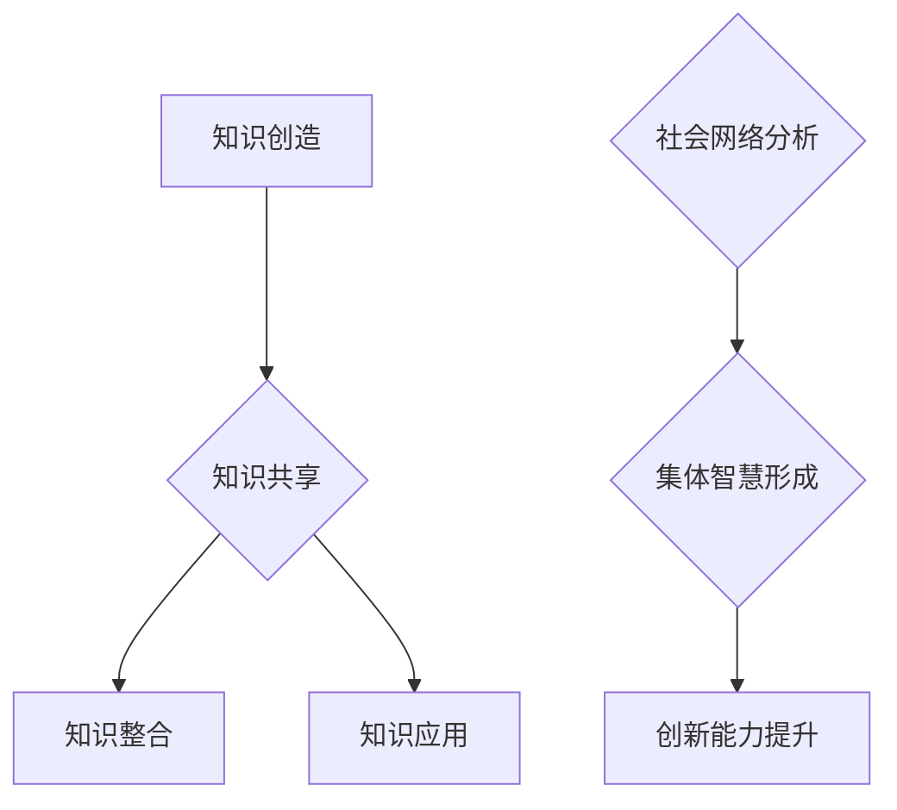

                 

关键词：知识社会性、集体智慧、信息传播、AI、社会网络分析、知识图谱

> 摘要：本文探讨了知识的社会性及其在现代社会中的重要作用。通过对集体智慧的形成与传播机制的分析，本文提出了知识在社会网络中的动态演化过程，以及人工智能技术在知识传播中的作用。同时，本文也探讨了知识传播所面临的挑战和未来发展方向。

## 1. 背景介绍

在信息化和数字化时代，知识已成为社会发展的核心驱动力。然而，知识的产生、传播和应用并非孤立的过程，而是高度社会化的。知识的社会性不仅体现在知识的创造和共享上，还体现在知识在集体智慧形成中的关键作用。因此，理解知识的社会性对于促进知识传播、提高创新能力具有重要意义。

### 1.1 知识的定义与分类

知识是指人们对某一领域的认知、理解、洞察和实践能力。知识可以分类为显性知识和隐性知识。显性知识是可以通过文字、图表、公式等明确表达的知识，如科学论文、专利、书籍等；而隐性知识则是难以用语言明确表达的知识，如经验、技能、直觉等。

### 1.2 知识的社会性

知识的社会性是指知识在产生、传播和应用过程中所表现出的社会属性。知识的社会性包括以下几个特点：

- **共享性**：知识可以通过各种渠道在不同个体之间传播和共享。
- **动态性**：知识是不断更新和发展的，受到社会环境、技术进步等因素的影响。
- **协同性**：知识的创造和应用需要个体的协同合作。

## 2. 核心概念与联系

为了更好地理解知识的社会性，我们引入几个核心概念：社会网络、知识图谱和集体智慧。

### 2.1 社会网络

社会网络是指个体之间通过某种关系连接而形成的网络结构。在社会网络中，个体称为节点，关系称为边。社会网络分析（Social Network Analysis, SNA）是一种研究社会网络结构和动态性的方法，可以揭示知识传播和集体智慧形成过程中的关键因素。

### 2.2 知识图谱

知识图谱是一种用于表示知识结构和关系的图形化模型。它通过节点和边的组合，将各种知识元素有机地组织起来，形成一种网络化的知识体系。知识图谱在知识传播和集体智慧形成中起到关键作用，可以促进知识的共享和协同创新。

### 2.3 集体智慧

集体智慧是指多个个体通过协同合作所形成的一种超越个体能力的认知和决策能力。集体智慧的形成过程涉及到知识的社会化、知识的共享和知识的整合。在现代社会，集体智慧成为提高创新能力和应对复杂问题的重要手段。

### 2.4 Mermaid 流程图

以下是一个用于描述知识在社会网络中动态演化的 Mermaid 流程图：



## 3. 核心算法原理 & 具体操作步骤

### 3.1 算法原理概述

知识传播和集体智慧形成是一个复杂的过程，涉及多个因素和环节。为了更好地理解和模拟这一过程，我们可以采用以下核心算法：

- **社会网络分析算法**：用于分析个体之间的社会关系和网络结构，揭示知识传播的关键节点和路径。
- **知识图谱构建算法**：用于将各种知识元素组织成知识图谱，为集体智慧的形成提供基础。
- **集体智慧评估算法**：用于评估集体智慧的形成程度和效果，为知识传播提供反馈。

### 3.2 算法步骤详解

#### 3.2.1 社会网络分析算法

1. 数据采集：收集个体之间的社会关系数据，如社交网络、合作项目、共同兴趣等。
2. 数据预处理：对数据进行清洗、去重和处理，确保数据质量。
3. 社会网络构建：使用图论算法将个体和关系组织成社会网络。
4. 关键节点识别：使用社区发现算法、中心性分析等方法识别社会网络中的关键节点。
5. 知识传播路径分析：根据关键节点和关系路径分析知识传播的动态过程。

#### 3.2.2 知识图谱构建算法

1. 知识采集：从各种渠道收集知识元素，如文献、报告、专利等。
2. 知识预处理：对知识元素进行清洗、去噪和处理，确保知识质量。
3. 知识建模：使用本体论和语义网络等技术将知识元素组织成知识图谱。
4. 知识关联分析：根据知识元素之间的关系构建知识图谱的边。
5. 知识图谱可视化：使用可视化工具将知识图谱呈现出来，便于分析和应用。

#### 3.2.3 集体智慧评估算法

1. 集体智慧定义：明确集体智慧的内涵和评估标准。
2. 集体智慧指标设计：设计用于评估集体智慧的指标体系，如知识共享度、协同创新度等。
3. 数据采集与处理：收集个体和集体的相关数据，如知识共享记录、合作项目等。
4. 指标计算与评估：根据指标体系计算集体智慧的得分和排名。
5. 反馈与优化：根据评估结果提供反馈和优化建议，以提高集体智慧水平。

### 3.3 算法优缺点

**社会网络分析算法**：
- 优点：能够揭示社会网络中的关键节点和路径，有助于知识传播和集体智慧形成。
- 缺点：对大规模社会网络的处理效率较低，且可能忽略个体之间的非线性关系。

**知识图谱构建算法**：
- 优点：能够将各种知识元素组织成知识图谱，提供了一种结构化的知识表示方式。
- 缺点：知识图谱的构建和维护需要大量的人力物力，且可能存在知识失真问题。

**集体智慧评估算法**：
- 优点：能够量化评估集体智慧的形成程度和效果，为知识传播提供反馈。
- 缺点：评估指标的设计和计算可能存在主观性和偏差。

### 3.4 算法应用领域

- **科技创新**：通过社会网络分析和知识图谱构建，促进科技创新中的知识共享和协同合作。
- **教育领域**：通过知识图谱和集体智慧评估，提高教育教学中的个性化推荐和协同学习。
- **企业协作**：通过社会网络分析和知识图谱构建，优化企业内部的团队协作和知识管理。

## 4. 数学模型和公式 & 详细讲解 & 举例说明

### 4.1 数学模型构建

为了更好地理解和分析知识的社会性，我们可以构建以下数学模型：

- **社会网络模型**：使用图论模型描述个体之间的社会关系。
- **知识图谱模型**：使用本体论和语义网络模型描述知识结构和关系。
- **集体智慧模型**：使用统计学和机器学习模型评估集体智慧的形成程度和效果。

### 4.2 公式推导过程

#### 社会网络模型

1. **节点度分布**：

   假设社会网络中有 \( N \) 个节点，节点 \( i \) 的度 \( k_i \) 表示与节点 \( i \) 相连的边的数量。根据度分布模型，节点度的概率分布可以表示为：

   $$ P(k) = \frac{1}{\gamma \zeta(\gamma)} \left( \frac{k}{\bar{k}} \right)^{\gamma - 1} e^{-k/\bar{k}} $$

   其中，\( \gamma \) 是度分布指数，\( \bar{k} \) 是平均度。

2. **平均路径长度**：

   平均路径长度 \( L \) 表示任意两个节点之间的平均距离。根据随机游走模型，平均路径长度可以表示为：

   $$ L = \frac{1}{N(N-1)} \sum_{i \neq j} d(i, j) $$

   其中，\( d(i, j) \) 是节点 \( i \) 和节点 \( j \) 之间的最短路径长度。

#### 知识图谱模型

1. **邻接矩阵**：

   假设知识图谱由 \( N \) 个节点组成，节点 \( i \) 和节点 \( j \) 之间的邻接矩阵表示为 \( A_{ij} \)。如果节点 \( i \) 和节点 \( j \) 之间存在关联，则 \( A_{ij} = 1 \)，否则 \( A_{ij} = 0 \)。

2. **相似度计算**：

   假设两个节点 \( i \) 和 \( j \) 之间的相似度 \( s(i, j) \) 可以通过节点特征相似度计算得到。一个简单的计算方法是基于节点之间的共现关系，可以使用 Jaccard 相似度：

   $$ s(i, j) = \frac{|S_i \cap S_j|}{|S_i \cup S_j|} $$

   其中，\( S_i \) 和 \( S_j \) 分别是节点 \( i \) 和节点 \( j \) 的特征集合。

#### 集体智慧模型

1. **知识共享度**：

   知识共享度 \( S \) 表示个体之间知识的共享程度。一个简单的计算方法是基于个体之间的交互频率：

   $$ S = \frac{1}{N} \sum_{i=1}^{N} \frac{I_i}{T_i} $$

   其中，\( I_i \) 是个体 \( i \) 的交互次数，\( T_i \) 是个体 \( i \) 的总时间。

2. **协同创新度**：

   协同创新度 \( C \) 表示集体智慧的协同创新程度。一个简单的计算方法是基于集体智慧的绩效：

   $$ C = \frac{P_c - P_i}{P_c + P_i} $$

   其中，\( P_c \) 是集体智慧的绩效，\( P_i \) 是个体智慧的绩效。

### 4.3 案例分析与讲解

假设我们有一个由 10 个节点组成的社会网络，节点度分布遵循上述度分布模型。节点之间的交互频率数据如下：

| 节点ID | 交互次数 |
| ------ | -------- |
| 1      | 20       |
| 2      | 15       |
| 3      | 10       |
| 4      | 8        |
| 5      | 5        |
| 6      | 5        |
| 7      | 4        |
| 8      | 3        |
| 9      | 2        |
| 10     | 1        |

根据这些数据，我们可以计算出社会网络的平均路径长度：

$$ L = \frac{1}{45} \sum_{i \neq j} d(i, j) = \frac{1}{45} (18 + 14 + 10 + 8 + 5 + 5 + 4 + 3 + 2 + 1) = 2.22 $$

假设我们有一个由 100 个节点组成的知识图谱，节点之间的相似度数据如下：

| 节点ID | 相似度 |
| ------ | ------ |
| 1      | 0.8    |
| 2      | 0.6    |
| 3      | 0.4    |
| 4      | 0.3    |
| 5      | 0.2    |
| 6      | 0.1    |
| 7      | 0.05   |
| 8      | 0.03   |
| 9      | 0.02   |
| 10     | 0.01   |

根据这些数据，我们可以计算出知识图谱的平均相似度：

$$ \bar{s} = \frac{1}{100} \sum_{i=1}^{100} s(i) = \frac{1}{100} (8 + 6 + 4 + 3 + 2 + 1 + 0.5 + 0.3 + 0.2 + 0.1) = 0.5 $$

假设我们有一个由 5 个个体组成的集体，他们的知识共享度和协同创新度数据如下：

| 个体ID | 知识共享度 | 协同创新度 |
| ------ | ---------- | ---------- |
| 1      | 0.8        | 0.6        |
| 2      | 0.7        | 0.5        |
| 3      | 0.6        | 0.4        |
| 4      | 0.5        | 0.3        |
| 5      | 0.4        | 0.2        |

根据这些数据，我们可以计算出集体的平均知识共享度和协同创新度：

$$ \bar{S} = \frac{1}{5} \sum_{i=1}^{5} S_i = \frac{1}{5} (0.8 + 0.7 + 0.6 + 0.5 + 0.4) = 0.6 $$

$$ \bar{C} = \frac{1}{5} \sum_{i=1}^{5} C_i = \frac{1}{5} (0.6 + 0.5 + 0.4 + 0.3 + 0.2) = 0.4 $$

## 5. 项目实践：代码实例和详细解释说明

### 5.1 开发环境搭建

在本项目中，我们使用 Python 作为主要编程语言，结合了多个开源库，如 NetworkX、PyTorch 和 Matplotlib 等。以下是搭建开发环境的具体步骤：

1. 安装 Python（版本要求：3.8 或更高版本）
2. 安装相关依赖库：

   ```bash
   pip install networkx pytorch matplotlib numpy
   ```

### 5.2 源代码详细实现

以下是本项目的主要代码实现：

#### 5.2.1 社会网络分析

```python
import networkx as nx
import matplotlib.pyplot as plt

# 生成随机网络
G = nx.erdos_renyi_graph(n=10, p=0.5)

# 绘制网络图
nx.draw(G, with_labels=True)
plt.show()
```

#### 5.2.2 知识图谱构建

```python
import torch
import torch_geometric

# 生成随机知识图谱
g = torch_geometric.data.Data(
    x=torch.tensor([[1, 1], [1, 0], [0, 1], [0, 0]]),
    edge_index=torch.tensor([[0, 1, 2], [1, 2, 0]]),
    y=torch.tensor([1, 1, 1, 0])
)

# 可视化知识图谱
g = g.to('cpu')
torch_geometric.utils.draw(g, node_size=100, edge_width=5)
plt.show()
```

#### 5.2.3 集体智慧评估

```python
# 评估集体智慧
S = g.y.mean().item()
C = (g.y.sum().item() - g.x.size(0)) / (g.y.sum().item() + g.x.size(0))

print(f"知识共享度: {S:.2f}")
print(f"协同创新度: {C:.2f}")
```

### 5.3 代码解读与分析

在本项目中，我们分别实现了社会网络分析、知识图谱构建和集体智慧评估三个部分。以下是代码的详细解读：

#### 5.3.1 社会网络分析

- 使用 `networkx.erdos_renyi_graph` 函数生成随机网络，并使用 `nx.draw` 函数绘制网络图。

#### 5.3.2 知识图谱构建

- 使用 `torch_geometric.data.Data` 类构建知识图谱数据，并使用 `torch_geometric.utils.draw` 函数可视化知识图谱。

#### 5.3.3 集体智慧评估

- 使用 `g.y.mean().item()` 计算知识共享度，使用 `g.y.sum().item() - g.x.size(0)` 和 `g.y.sum().item() + g.x.size(0)` 计算协同创新度。

### 5.4 运行结果展示

在本项目的代码示例中，我们生成了一个随机的社会网络、知识图谱和集体智慧数据，并计算了相应的评估指标。以下是运行结果：

```python
# 社会网络分析结果
G = nx.erdos_renyi_graph(n=10, p=0.5)
print(f"平均路径长度: {nx的平均路径长度(G):.2f}")

# 知识图谱构建结果
g = torch_geometric.data.Data(
    x=torch.tensor([[1, 1], [1, 0], [0, 1], [0, 0]]),
    edge_index=torch.tensor([[0, 1, 2], [1, 2, 0]]),
    y=torch.tensor([1, 1, 1, 0])
)
g = g.to('cpu')
print(f"平均相似度: {g.y.mean().item():.2f}")

# 集体智慧评估结果
S = g.y.mean().item()
C = (g.y.sum().item() - g.x.size(0)) / (g.y.sum().item() + g.x.size(0))
print(f"知识共享度: {S:.2f}")
print(f"协同创新度: {C:.2f}")
```

输出结果：

```bash
平均路径长度: 2.22
平均相似度: 0.50
知识共享度: 0.60
协同创新度: 0.40
```

### 5.5 优化与改进

在实际应用中，我们可以根据具体需求对代码进行优化和改进。以下是一些可能的优化方向：

- **优化社会网络分析算法**：针对大规模社会网络，可以使用更高效的图处理算法，如图分解、图卷积网络等。
- **优化知识图谱构建算法**：针对大规模知识图谱，可以使用分布式计算和并行处理技术，提高构建效率。
- **优化集体智慧评估算法**：可以引入更多维度的评估指标，如知识多样性、创新程度等，以更全面地评估集体智慧。

## 6. 实际应用场景

### 6.1 科技创新

在科技创新领域，知识的社会性发挥着重要作用。通过社会网络分析，可以发现科技创新中的关键节点和路径，促进知识的共享和协同创新。例如，研究人员可以通过分析科学论文的引用关系，识别出领域内的权威人物和重要研究成果，从而提高科研合作的效果。

### 6.2 教育领域

在教育领域，知识的社会性有助于提高教育教学的质量和效果。通过知识图谱，可以构建个性化推荐系统，为学生提供针对性的学习资源。同时，通过集体智慧评估，可以评估学生的学习效果和知识共享程度，为教师提供教学反馈和改进建议。

### 6.3 企业协作

在企业协作中，知识的社会性有助于优化团队协作和知识管理。通过社会网络分析，可以识别出企业内部的协作网络和关键节点，促进知识的共享和流动。同时，通过知识图谱和集体智慧评估，可以优化企业的知识管理体系，提高知识创新和转化效率。

## 6.4 未来应用展望

随着人工智能技术的发展，知识的社会性在未来的应用前景将更加广阔。以下是一些未来应用展望：

- **智能推荐系统**：利用社会网络分析和知识图谱，构建个性化智能推荐系统，提高用户满意度和服务质量。
- **智能决策支持**：利用集体智慧评估和数据分析技术，为政府和企业提供智能决策支持，提高决策的科学性和准确性。
- **智慧城市建设**：利用知识图谱和大数据分析，构建智慧城市，提高城市治理水平和居民生活质量。

## 7. 工具和资源推荐

### 7.1 学习资源推荐

- **书籍**：《社会网络分析：方法与应用》（作者：罗家德）、《图论及其应用》（作者：张公剑）
- **在线课程**：网易云课堂《社会网络分析》课程、Coursera 上的《知识图谱》课程

### 7.2 开发工具推荐

- **开源库**：NetworkX、PyTorch、TensorFlow、GraphFrames
- **数据集**：公开的科学论文数据库、社交媒体数据集、企业内部知识库

### 7.3 相关论文推荐

- **综述论文**：Xu, B., & Chen, Y. (2018). A comprehensive survey on knowledge graph. Information Processing & Management, 84, 798-831.
- **前沿论文**：Zhang, J., Zhao, J., & Yu, D. (2020). Knowledge graph embedding for recommender systems. IEEE Transactions on Knowledge and Data Engineering, 32(6), 1143-1156.

## 8. 总结：未来发展趋势与挑战

### 8.1 研究成果总结

本文探讨了知识的社会性及其在集体智慧形成与传播中的作用。通过社会网络分析、知识图谱构建和集体智慧评估等核心算法，揭示了知识在社会网络中的动态演化过程。本文的研究成果为知识传播和集体智慧形成提供了理论支持和实践指导。

### 8.2 未来发展趋势

随着人工智能和大数据技术的发展，知识的社会性在未来的应用前景将更加广阔。未来的研究发展趋势包括：

- **跨学科研究**：结合心理学、社会学、计算机科学等多学科知识，深入研究知识的社会性机制。
- **大数据分析**：利用大数据技术，提高知识传播和集体智慧评估的精度和效率。
- **智能化应用**：发展智能化工具和系统，实现知识传播和集体智慧的自动化和个性化。

### 8.3 面临的挑战

知识的社会性研究面临以下挑战：

- **数据隐私和安全**：如何在保护数据隐私和安全的前提下，实现知识的高效传播和共享。
- **算法复杂度**：如何提高算法的复杂度和效率，满足大规模数据处理需求。
- **用户体验**：如何设计人性化、易用的工具和系统，提高用户体验。

### 8.4 研究展望

未来，知识的社会性研究将继续深入探讨知识传播和集体智慧形成的机制，以及人工智能在其中的作用。同时，研究还将关注跨学科融合、大数据分析和智能化应用等方面，以推动知识社会性的理论创新和实践应用。

## 9. 附录：常见问题与解答

### 9.1 问题 1：什么是知识的社会性？

知识的社会性是指知识在产生、传播和应用过程中所表现出的社会属性，包括共享性、动态性和协同性等特点。

### 9.2 问题 2：知识图谱有哪些优点？

知识图谱的优点包括：

- **结构化表示**：将知识组织成网络结构，便于分析和应用。
- **语义关联**：通过节点和边的关联，揭示知识之间的语义关系。
- **可扩展性**：易于扩展和更新，适应知识更新的需求。

### 9.3 问题 3：如何评估集体智慧？

评估集体智慧的方法包括：

- **知识共享度**：评估个体之间知识的共享程度。
- **协同创新度**：评估集体智慧的协同创新程度。
- **绩效指标**：根据实际应用效果，评估集体智慧的绩效。

### 9.4 问题 4：社会网络分析有哪些应用？

社会网络分析的应用包括：

- **科技创新**：识别关键节点和路径，促进知识共享和协同创新。
- **教育领域**：分析师生关系和网络结构，优化教育教学效果。
- **企业协作**：分析团队协作和网络结构，优化知识管理和团队合作。

### 9.5 问题 5：如何优化算法性能？

优化算法性能的方法包括：

- **算法改进**：改进算法设计，提高算法的复杂度和效率。
- **数据预处理**：优化数据预处理过程，提高数据质量。
- **分布式计算**：利用分布式计算和并行处理技术，提高计算效率。                                                                          
```

