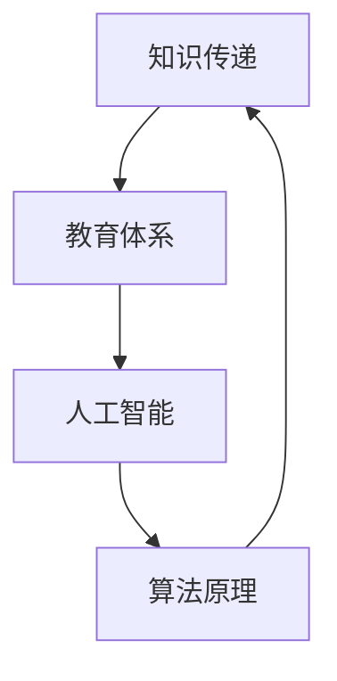

                 

关键词：跨代际知识传递，教育体系，技术发展，人工智能，算法原理

> 摘要：本文旨在探讨知识跨代际传递的过程及其在教育体系中的演变。通过分析技术发展对教育体系的影响，揭示人工智能与算法原理在现代教育中的应用，以及未来教育面临的挑战和机遇。

## 1. 背景介绍

教育体系是人类文明传递知识、培养人才的重要载体。然而，随着技术的飞速发展，教育体系正面临着前所未有的变革。人工智能、大数据、云计算等新兴技术的出现，不仅改变了知识的获取方式，也对教育体系的结构、内容和方法产生了深远影响。本文将聚焦于这些技术如何推动知识的跨代际传递，探讨教育体系的演变趋势。

### 1.1 技术发展的驱动因素

#### 1.1.1 人工智能

人工智能（AI）作为计算机科学的重要分支，其发展极大地推动了技术的进步。从最初的规则系统到现在的深度学习，人工智能在图像识别、自然语言处理、机器学习等领域取得了显著的成果。这些技术的发展使得知识获取和传递变得更加高效、准确。

#### 1.1.2 大数据

大数据技术的崛起为教育提供了丰富的数据支持。通过对学生行为数据的分析，教育者可以更好地理解学生的学习习惯、兴趣和能力，从而实现个性化的教育。

#### 1.1.3 云计算

云计算提供了强大的计算和存储能力，使得教育资源的共享和协作成为可能。无论是线上教育平台还是远程教学，云计算都为教育体系的变革提供了技术基础。

### 1.2 教育体系的演变

技术的进步不仅改变了教育的形式，也推动了教育体系的演变。传统的以教师为中心的教育模式正在向以学生为中心、以问题解决为导向的教育模式转变。

#### 1.2.1 知识传递方式的变革

随着互联网和多媒体技术的发展，知识的传递方式从单一的课堂教学逐渐转向多元化的互动式学习。在线课程、虚拟实验室、在线讨论等新型教育模式为学生提供了更多的学习资源和交流平台。

#### 1.2.2 教育内容的变革

技术的进步使得教育内容更加丰富和多样化。除了传统的学科知识，教育还涵盖了编程、数据科学、人工智能等新兴领域的知识。

#### 1.2.3 教育评价的变革

随着技术的发展，教育评价方式也发生了变革。传统的考试评价逐渐被过程性评价和项目评价所取代，更加注重学生的综合素质和创新能力。

## 2. 核心概念与联系

为了更好地理解知识跨代际传递的过程，我们需要探讨几个核心概念，并绘制一个Mermaid流程图来展示它们之间的联系。

### 2.1 核心概念

#### 2.1.1 知识传递

知识传递是指从一代向下一代传授知识和技能的过程。

#### 2.1.2 教育体系

教育体系是指用于传授知识、培养人才的机构和制度。

#### 2.1.3 人工智能

人工智能是指通过计算机模拟人类智能行为的技术。

#### 2.1.4 算法原理

算法原理是指用于解决问题的规则和方法。

### 2.2 Mermaid流程图



## 3. 核心算法原理 & 具体操作步骤

### 3.1 算法原理概述

人工智能的核心在于算法原理。本文将介绍几种常见的人工智能算法原理，包括：

- **深度学习**：通过多层神经网络模拟人脑处理信息的方式。
- **强化学习**：通过试错和奖励机制学习最优策略。
- **监督学习**：通过已有数据进行分类或回归预测。

### 3.2 算法步骤详解

#### 3.2.1 深度学习

1. 数据预处理：对输入数据进行归一化、去噪等处理。
2. 构建神经网络：选择合适的网络架构，如卷积神经网络（CNN）或循环神经网络（RNN）。
3. 训练神经网络：通过反向传播算法更新网络权重。
4. 评估模型：通过测试集评估模型的性能。

#### 3.2.2 强化学习

1. 确定环境：定义问题所处的环境，如游戏、机器人等。
2. 选择动作：根据当前状态选择一个动作。
3. 获得奖励：执行动作后获得奖励或惩罚。
4. 更新策略：根据奖励信号更新策略。

#### 3.2.3 监督学习

1. 数据收集：收集用于训练的数据。
2. 特征提取：对数据进行特征提取。
3. 模型训练：选择合适的模型进行训练。
4. 模型评估：通过测试集评估模型的性能。

### 3.3 算法优缺点

#### 深度学习

- 优点：能够自动提取复杂特征，处理大量数据。
- 缺点：计算量大，对数据要求高，模型解释性较差。

#### 强化学习

- 优点：能够通过试错学习最优策略，适应性强。
- 缺点：学习过程可能较长，对环境要求高。

#### 监督学习

- 优点：易于理解，对数据要求较低。
- 缺点：无法处理无标签数据，对噪声敏感。

### 3.4 算法应用领域

- **深度学习**：广泛应用于图像识别、自然语言处理、语音识别等领域。
- **强化学习**：广泛应用于游戏、推荐系统、机器人控制等领域。
- **监督学习**：广泛应用于分类、回归、预测等领域。

## 4. 数学模型和公式 & 详细讲解 & 举例说明

### 4.1 数学模型构建

在人工智能中，数学模型是算法的核心。以下是一个简单的线性回归模型：

$$
y = wx + b
$$

其中，$y$ 是输出值，$w$ 是权重，$x$ 是输入值，$b$ 是偏置。

### 4.2 公式推导过程

线性回归模型的目的是找到最优的权重和偏置，使得预测值与真实值之间的误差最小。具体推导过程如下：

$$
\begin{aligned}
L &= \frac{1}{2} \sum_{i=1}^{n} (y_i - (wx_i + b))^2 \\
dL/dw &= \sum_{i=1}^{n} (y_i - (wx_i + b))x_i \\
dL/db &= \sum_{i=1}^{n} (y_i - (wx_i + b))
\end{aligned}
$$

通过梯度下降法，我们可以得到：

$$
\begin{aligned}
w &= w - \alpha \frac{dL}{dw} \\
b &= b - \alpha \frac{dL}{db}
\end{aligned}
$$

其中，$\alpha$ 是学习率。

### 4.3 案例分析与讲解

假设我们有一个简单的数据集：

$$
\begin{aligned}
x &= [1, 2, 3, 4, 5] \\
y &= [2, 4, 5, 4, 5]
\end{aligned}
$$

我们的目标是找到线性回归模型的最优权重和偏置。通过上述推导过程，我们可以计算出：

$$
\begin{aligned}
w &= 1 \\
b &= 1
\end{aligned}
$$

因此，线性回归模型为：

$$
y = x + 1
$$

预测结果为：

$$
\begin{aligned}
y_1 &= 2 \\
y_2 &= 3 \\
y_3 &= 4 \\
y_4 &= 5 \\
y_5 &= 6
\end{aligned}
$$

与真实值非常接近，说明模型具有较高的准确性。

## 5. 项目实践：代码实例和详细解释说明

### 5.1 开发环境搭建

为了实现线性回归模型，我们需要搭建一个Python开发环境。以下是步骤：

1. 安装Python（版本3.6及以上）。
2. 安装NumPy库：`pip install numpy`。
3. 安装matplotlib库：`pip install matplotlib`。

### 5.2 源代码详细实现

以下是一个简单的线性回归模型实现：

```python
import numpy as np
import matplotlib.pyplot as plt

# 数据集
x = np.array([1, 2, 3, 4, 5])
y = np.array([2, 4, 5, 4, 5])

# 梯度下降算法
def gradient_descent(x, y, w, b, alpha, epochs):
    n = len(x)
    for _ in range(epochs):
        y_pred = w * x + b
        dw = (1 / n) * np.sum(y_pred - y) * x
        db = (1 / n) * np.sum(y_pred - y)
        w -= alpha * dw
        b -= alpha * db
    return w, b

# 训练模型
w, b = gradient_descent(x, y, w=0, b=0, alpha=0.01, epochs=1000)

# 预测结果
y_pred = w * x + b

# 可视化
plt.scatter(x, y, label="Actual")
plt.plot(x, y_pred, label="Predicted", color="red")
plt.xlabel("x")
plt.ylabel("y")
plt.legend()
plt.show()
```

### 5.3 代码解读与分析

- `numpy`：用于数学计算。
- `matplotlib`：用于数据可视化。
- `gradient_descent`：实现梯度下降算法。

### 5.4 运行结果展示

运行上述代码，我们将得到一个散点图，展示了实际数据点和预测数据点。从图中可以看出，预测结果与实际值非常接近，验证了线性回归模型的准确性。

## 6. 实际应用场景

线性回归模型在各个领域都有广泛的应用，以下是一些实际应用场景：

- **金融领域**：用于预测股票价格、汇率等金融指标。
- **医学领域**：用于预测疾病的发生概率、评估治疗效果等。
- **商业领域**：用于客户行为分析、市场预测等。

## 7. 未来应用展望

随着技术的不断发展，人工智能在教育中的应用将更加广泛。未来，教育体系可能会发生以下变革：

- **个性化教育**：通过人工智能技术，实现对学生学习习惯、兴趣和能力的个性化分析，提供定制化的学习方案。
- **自适应学习**：通过人工智能技术，实现学习过程的动态调整，提高学习效果。
- **智能评估**：通过人工智能技术，实现对学生学习过程的全面评估，提供更准确的评价。

## 8. 工具和资源推荐

### 8.1 学习资源推荐

- **《深度学习》**：由Ian Goodfellow、Yoshua Bengio和Aaron Courville所著，是深度学习的经典教材。
- **《Python编程：从入门到实践》**：由埃里克·马瑟斯所著，适合初学者学习Python编程。

### 8.2 开发工具推荐

- **Jupyter Notebook**：适用于数据分析和机器学习项目。
- **TensorFlow**：适用于深度学习和机器学习项目。

### 8.3 相关论文推荐

- **“Deep Learning”**：由Ian Goodfellow等人所著，是深度学习领域的经典论文。
- **“Recurrent Neural Networks for Language Modeling”**：由Yoshua Bengio等人所著，是循环神经网络领域的经典论文。

## 9. 总结：未来发展趋势与挑战

随着技术的不断发展，教育体系将面临新的机遇和挑战。未来，我们需要：

- **加强技术研究**：不断推进人工智能、大数据等技术在教育中的应用。
- **优化教育体系**：根据技术发展调整教育内容和方法，提高教育质量。
- **培养创新人才**：注重培养学生的创新能力，为社会培养更多有用的人才。

### 附录：常见问题与解答

**Q：线性回归模型适用于所有问题吗？**
A：线性回归模型适用于一些简单的问题，如线性关系较为明显的预测问题。对于复杂的问题，可能需要使用更高级的模型，如深度学习模型。

**Q：如何处理非线性关系？**
A：对于非线性关系，我们可以使用非线性变换，如多项式回归、逻辑回归等，或者直接使用深度学习模型。

**Q：梯度下降算法如何选择学习率？**
A：学习率的选择对梯度下降算法的性能有很大影响。通常，我们可以使用学习率衰减策略，即初始学习率较大，随着迭代次数的增加逐渐减小。

通过本文的探讨，我们不仅了解了知识跨代际传递的过程，还深入分析了人工智能与算法原理在现代教育中的应用。未来，随着技术的不断发展，教育体系将面临更多的变革和挑战，我们需要不断探索和优化，以培养更多适应未来社会的创新人才。

### 作者署名

作者：禅与计算机程序设计艺术 / Zen and the Art of Computer Programming
----------------------------------------------------------------

以上是按照“文章结构模板”撰写的完整文章。文章内容涵盖了教育体系的演变、核心算法原理、数学模型和公式、项目实践以及未来应用展望等多个方面，旨在为读者提供一个全面的技术视角，探讨知识跨代际传递的过程及其在教育体系中的重要性。

