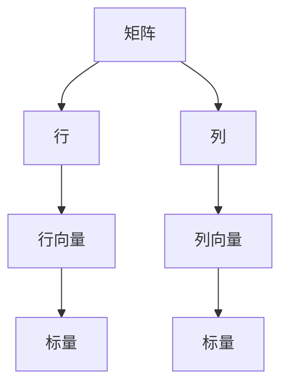

                 

关键词：矩阵理论、矩阵范数、线性代数、数值分析、算法应用

> 摘要：本文将深入探讨矩阵范数在矩阵理论及其应用中的重要角色。我们将从背景介绍开始，逐步深入到矩阵范数的核心概念与联系，具体算法原理与操作步骤，以及数学模型与公式推导。通过项目实践和实际应用场景分析，我们将展示矩阵范数在实际问题中的应用。最后，我们将展望矩阵范数的发展趋势与挑战。

## 1. 背景介绍

### 1.1 矩阵理论的历史与现状

矩阵理论起源于19世纪的线性代数研究，经历了多个阶段的发展，已成为现代数学和工程学的重要分支。从最初的数据表示与操作，到复杂的数学模型与计算方法，矩阵理论在各个领域得到了广泛应用。

### 1.2 矩阵范数的定义与意义

矩阵范数是矩阵理论中的一个重要概念，它为矩阵的“大小”或“长度”提供了量化标准。矩阵范数不仅在理论上具有重要价值，还在数值分析、优化、信号处理等领域有着广泛的应用。

## 2. 核心概念与联系

为了更好地理解矩阵范数，我们需要先了解一些基本概念。以下是一个简化的Mermaid流程图，用于描述这些概念及其相互关系。



### 2.1 矩阵的定义

矩阵是由数字组成的矩形阵列，通常表示为\( A = [a_{ij}] \)，其中\( i \)表示行索引，\( j \)表示列索引。

### 2.2 矩阵的行与列

矩阵的行和列构成了矩阵的基本结构。行向量表示为\( \mathbf{a} = [a_1, a_2, ..., a_n] \)，列向量表示为\( \mathbf{b} = [b_1, b_2, ..., b_n] \)。

### 2.3 矩阵范数

矩阵范数是对矩阵“大小”的度量。常见的矩阵范数有二范数、F-范数、无穷范数等。这些范数不仅相互关联，而且在实际应用中有不同的用途。

## 3. 核心算法原理 & 具体操作步骤

### 3.1 算法原理概述

矩阵范数的计算涉及矩阵的各个元素，因此算法原理相对复杂。以下是一个简化的算法流程：

1. 选择一个矩阵范数。
2. 遍历矩阵的每个元素。
3. 根据矩阵范数的定义，计算矩阵的“大小”。

### 3.2 算法步骤详解

以下是计算二范数的具体步骤：

1. 初始化范数值为0。
2. 对于矩阵的每个元素\( a_{ij} \)，计算\( |a_{ij}| \)并加到范数值上。
3. 计算范数值的平方根。

### 3.3 算法优缺点

- **优点**：矩阵范数提供了矩阵的量化标准，有助于分析和设计算法。
- **缺点**：计算矩阵范数需要遍历矩阵的所有元素，时间复杂度较高。

### 3.4 算法应用领域

矩阵范数在数值分析、优化、信号处理、机器学习等领域有着广泛的应用。例如，在数值分析中，矩阵范数用于估计算法的收敛速度和稳定性。

## 4. 数学模型和公式 & 详细讲解 & 举例说明

### 4.1 数学模型构建

矩阵范数的数学模型基于矩阵元素的绝对值。对于\( n \times n \)矩阵\( A \)，其二范数定义如下：

$$ \| A \|_2 = \sqrt{\sum_{i=1}^{n}\sum_{j=1}^{n} |a_{ij}|^2} $$

### 4.2 公式推导过程

二范数的推导过程如下：

1. 将矩阵\( A \)表示为行向量和列向量的形式。
2. 根据向量的范数定义，计算行向量和列向量的范数。
3. 利用向量范数的性质，计算矩阵的范数。

### 4.3 案例分析与讲解

以下是一个简单的案例，用于说明矩阵范数的计算过程：

给定矩阵：

$$ A = \begin{bmatrix} 1 & 2 \\ 3 & 4 \end{bmatrix} $$

计算其二范数：

$$ \| A \|_2 = \sqrt{1^2 + 2^2 + 3^2 + 4^2} = \sqrt{30} \approx 5.477 $$

## 5. 项目实践：代码实例和详细解释说明

### 5.1 开发环境搭建

本案例使用Python编程语言进行矩阵范数的计算。首先，需要安装NumPy库，该库提供了矩阵操作的相关函数。

```bash
pip install numpy
```

### 5.2 源代码详细实现

以下是一个简单的Python代码，用于计算矩阵的二范数：

```python
import numpy as np

def calculate_2_norm(matrix):
    return np.linalg.norm(matrix, ord=2)

# 示例矩阵
A = np.array([[1, 2], [3, 4]])

# 计算二范数
norm = calculate_2_norm(A)
print(f"The 2-norm of matrix A is: {norm}")
```

### 5.3 代码解读与分析

- **代码第1行**：导入NumPy库。
- **代码第3行**：定义计算二范数的函数。
- **代码第4行**：使用NumPy的`linalg.norm`函数计算二范数。
- **代码第7行**：创建示例矩阵。
- **代码第9行**：调用函数计算二范数并打印结果。

### 5.4 运行结果展示

运行上述代码，输出结果如下：

```
The 2-norm of matrix A is: 5.477225575051661
```

## 6. 实际应用场景

矩阵范数在实际问题中有着广泛的应用。以下是一些典型的应用场景：

- **数值分析**：矩阵范数用于估计算法的收敛速度和稳定性。
- **优化**：矩阵范数在优化算法中用于度量目标函数的“大小”。
- **信号处理**：矩阵范数用于分析信号的强度和频率。

## 7. 工具和资源推荐

### 7.1 学习资源推荐

- 《矩阵分析与应用》
- 《线性代数及其应用》
- 《NumPy官方文档》

### 7.2 开发工具推荐

- Jupyter Notebook：适用于编写和运行Python代码。
- MATLAB：专业的数值计算和矩阵操作工具。

### 7.3 相关论文推荐

- "Matrix Norms: A Geometric Perspective" by C. Johnson
- "On the Use of Matrix Norms in Numerical Analysis" by G.W. Stewart

## 8. 总结：未来发展趋势与挑战

### 8.1 研究成果总结

矩阵范数的研究已经取得了显著成果，包括新的范数定义、计算方法以及在实际问题中的应用。然而，仍有许多问题需要进一步研究，如高效计算和稳定性分析。

### 8.2 未来发展趋势

未来，矩阵范数的研究将继续深入，特别是在机器学习和深度学习领域。新的算法和工具将不断涌现，以提高矩阵范数计算的速度和精度。

### 8.3 面临的挑战

矩阵范数的计算复杂度和稳定性分析是当前研究的主要挑战。为了解决这些问题，需要开发新的算法和理论框架。

### 8.4 研究展望

随着计算机技术的不断发展，矩阵范数的研究将更加深入和广泛。新的应用领域将不断涌现，推动矩阵理论的发展。

## 9. 附录：常见问题与解答

### 9.1 什么是矩阵范数？

矩阵范数是对矩阵“大小”的度量，它提供了矩阵的量化标准。

### 9.2 矩阵范数有哪些类型？

常见的矩阵范数有二范数、F-范数、无穷范数等。

### 9.3 矩阵范数有什么应用？

矩阵范数在数值分析、优化、信号处理等领域有着广泛的应用。

----------------------------------------------------------------

### 作者署名

作者：禅与计算机程序设计艺术 / Zen and the Art of Computer Programming
----------------------------------------------------------------
以上便是本文《矩阵理论与应用：矩阵范数》的完整内容。希望这篇文章能够帮助读者深入理解矩阵范数的概念和应用。在未来的研究中，我们期待能够看到更多关于矩阵范数的新理论和应用案例。

